# Investigation Phase Progression Flexibility

**Date**: 2025-10-11  
**Source**: Investigation Phases and OODA Integration Framework v2.1

---

## ✅ CONFIRMED: Non-Linear Phase Progression

The FaultMaven investigation framework **does NOT force linear progression** from Phase 0→6. Instead, it supports **flexible paths** based on:
- Incident urgency (CRITICAL vs NORMAL)
- Investigation strategy (Active Incident vs Post-Mortem)
- Problem context (active outage vs historical analysis)

---

## Investigation Paths

### Path 1: Normal Investigation (Full Progression)

**When**: Normal urgency, thorough investigation needed  
**Strategy**: Post-Mortem  
**Path**: **Phase 0 → 1 → 2 → 3 → 4 → 5 → 6**

```
Phase 0 (Intake)       → Problem confirmation, consent
Phase 1 (Blast Radius) → Scope and impact assessment
Phase 2 (Timeline)     → When did it start/change?
Phase 3 (Hypothesis)   → Generate root cause theories
Phase 4 (Validation)   → Test hypotheses systematically
Phase 5 (Solution)     → Apply fix and verify
Phase 6 (Document)     → Generate artifacts
```

**Characteristics**:
- All phases executed in order
- Full OODA depth in Phase 4 (3-6+ iterations)
- Thorough evidence collection
- High-confidence root cause required

---

### Path 2: Critical Incident (Phase Skipping)

**When**: HIGH/CRITICAL urgency, service down  
**Strategy**: Active Incident  
**Path**: **Phase 0 → 1 → 5 → 6** (SKIP Phases 2-4)

```
Phase 0 (Intake)       → Quick problem detection
Phase 1 (Blast Radius) → Fast impact assessment
                         [SKIP Phase 2: Timeline]
                         [SKIP Phase 3: Hypothesis]
                         [SKIP Phase 4: Validation]
Phase 5 (Solution)     → IMMEDIATE MITIGATION
                         - Restart service
                         - Rollback deployment
                         - Scale resources
Phase 6 (Document)     → Incident summary
                         - Service restored
                         - Root cause: Unknown
                         - Option: Schedule RCA later
```

**Characteristics**:
- **Speed over certainty**
- Skip hypothesis generation and testing
- Jump directly to mitigation options
- Root cause analysis deferred (or optional)
- Full investigation can be run later as post-mortem

**Example from Documentation**:
```
🚨 CRITICAL INCIDENT DETECTED

Phase 1 (Quick Assessment):
🎯 Problem: API service down (500 errors)
🔴 Impact: All API requests affected

Phase 5 (SKIP Phases 2-4, jump to Solution):
Mitigation Options (fastest first):
1. 🔄 Restart API service - 2 min
2. ↩️ Rollback last deployment - 5 min
3. 📈 Scale up replicas - 3 min
```

---

### Path 3: Post-Incident RCA (Direct Entry)

**When**: Service already restored, need root cause  
**Strategy**: Post-Mortem  
**Path**: **Phase 0 → 1 → 4 → 5 → 6** (SKIP/ABBREVIATE Phases 2-3)

```
Phase 0 (Intake)       → Describe historical incident
Phase 1 (Blast Radius) → Quick context gathering
                         [SKIP/ABBREVIATE Phase 2: Timeline - known]
                         [SKIP/ABBREVIATE Phase 3: Hypothesis - jump to testing]
Phase 4 (Validation)   → DEEP SYSTEMATIC TESTING
                         - Full OODA iterations (3-6+)
                         - Evidence-driven validation
                         - Multiple hypothesis testing
                         - Confidence scoring required
Phase 5 (Solution)     → Permanent fix design
Phase 6 (Document)     → Comprehensive RCA report
```

**Characteristics**:
- Problem already known (no need for timeline/hypothesis generation)
- **Jump directly to Phase 4** (systematic validation)
- Full OODA depth for thorough analysis
- High confidence root cause required
- Comprehensive documentation

**Example from Documentation**:
```
User: "Had to rollback deployment yesterday. Need RCA"

Phase 0-1: Quick framing
Phase 4: Direct entry for systematic validation
- Full OODA iterations with deep investigation
- Test multiple hypotheses
- Achieve 70%+ confidence in root cause
```

---

### Path 4: Simple Quick-Win (Minimal Path)

**When**: Simple issue with obvious solution  
**Strategy**: Post-Mortem (low complexity)  
**Path**: **Phase 0 → 1 → 5 → 6** (Solution found early)

```
Phase 0 (Intake)       → User describes issue
Phase 1 (Blast Radius) → Quick assessment
                         → SOLUTION OBVIOUS (1-2 OODA cycles)
                         [SKIP Phase 2-4: Not needed]
Phase 5 (Solution)     → Apply known fix
Phase 6 (Document)     → Brief summary
```

**Example**:
```
User: "Website won't load, ERR_CONNECTION_REFUSED"

Phase 1: Quick check
- Is service running? → No
- Recent changes? → Service stopped

Phase 5: Solution found immediately
- Start service
- Verify working
```

---

## Phase Transition Rules

### When to Advance Phases

**Phase 0 → Phase 1**:
- User **consents** to formal investigation
- Problem confirmed and framed

**Phase 1 → Phase 2/4/5** (Flexible):
- If **NORMAL urgency** → Phase 2 (Timeline)
- If **CRITICAL urgency + solution obvious** → Phase 5 (Mitigation)
- If **Post-mortem + context known** → Phase 4 (Validation)

**Phase 2 → Phase 3**:
- Timeline established
- When issue started identified

**Phase 3 → Phase 4/5** (Urgency-Based):
- If **CRITICAL urgency** → May skip to Phase 5 (fast mitigation)
- If **NORMAL urgency** → Phase 4 (thorough testing)

**Phase 4 → Phase 5**:
- Root cause identified with **≥70% confidence**
- Or hypotheses exhausted (proceed with best guess)

**Phase 5 → Phase 6**:
- Solution applied and verified effective
- Or mitigation complete (active incident)

**Phase 6**: Terminal phase (case closed)

---

## Entry Point Flexibility

### Entry Point 1: Phase 0 (Standard)
**When**: Normal conversational start  
**How**: User asks question, agent detects problem signal  
**Example**: "My database is slow" → Phase 0 Intake

### Entry Point 2: Phase 1 (Direct Problem Report)
**When**: User explicitly states they have an active problem  
**How**: Immediate consent, skip Phase 0 confirmation  
**Example**: "🚨 Production API is down!" → Direct to Phase 1

### Entry Point 3: Phase 4 (Post-Mortem RCA)
**When**: Historical incident, service already restored  
**How**: Quick framing (Phase 0-1), jump to validation  
**Example**: "Need RCA for yesterday's outage" → Phase 0→1→4

### Entry Point 4: Phase 5 (Known Solution)
**When**: Problem and solution both obvious  
**How**: Skip investigation, verify and apply fix  
**Example**: "Service won't start" + "Not running" → Direct to restart

---

## Urgency-Based Branching

```mermaid
graph TD
    P0[Phase 0: Intake]
    P1[Phase 1: Blast Radius]
    P2[Phase 2: Timeline]
    P3[Phase 3: Hypothesis]
    P4[Phase 4: Validation]
    P5[Phase 5: Solution]
    P6[Phase 6: Document]
    
    P0 -->|Consent| P1
    
    P1 -->|NORMAL urgency| P2
    P1 -->|CRITICAL urgency<br/>+ obvious solution| P5
    P1 -->|Post-mortem<br/>+ context known| P4
    
    P2 --> P3
    P3 -->|NORMAL urgency| P4
    P3 -->|CRITICAL urgency<br/>+ mitigation ready| P5
    
    P4 -->|Root cause found<br/>≥70% confidence| P5
    P5 -->|Solution verified| P6
    
    style P1 fill:#ffe0b2
    style P5 fill:#ffcdd2
    style P4 fill:#c8e6c9
```



**Key Decision Points**:

1. **After Phase 1** (Blast Radius):
   - Normal urgency → Phase 2 (standard path)
   - Critical urgency → Phase 5 (emergency mitigation)
   - Post-mortem → Phase 4 (systematic validation)

2. **After Phase 3** (Hypothesis):
   - Normal urgency → Phase 4 (test thoroughly)
   - Critical urgency → Phase 5 (apply mitigation)

---

## Examples from Documentation

### Critical Incident (Phase Skip)

**Documented Example**:
```
User: "🚨 API down! Getting 500 errors, alerts firing!"

Path: Phase 0 → 1 → 5 → 6

Phase 1: Quick assessment (1-2 OODA cycles)
  → API down, all endpoints affected, CRITICAL

Phase 5: SKIP Phases 2-4, jump to mitigation
  → Restart, rollback, or scale
  → Service restored in 8 minutes

Phase 6: Document incident
  → Option: Schedule full RCA later (Phase 2-4)
  → Or: Close without RCA
```

### Post-Mortem RCA (Direct to Validation)

**Documented Example**:
```
User: "Had to rollback deployment yesterday. Need RCA"

Path: Phase 0 → 1 → 4 → 5 → 6

Phase 0-1: Quick framing
  → Problem: deployment failure
  → Context: already rolled back

Phase 4: JUMP directly to systematic validation
  → SKIP Phase 2 (timeline known)
  → SKIP Phase 3 (just generate hypotheses)
  → Deep OODA iterations (3-6+)
  → Test hypotheses systematically

Phase 5: Design permanent fix
Phase 6: Comprehensive post-mortem report
```

---

## Design Intent

### Why Flexible Progression?

**Rationale from Framework**:

1. **Match Human Reasoning**: Humans don't always follow linear steps
   - Emergency: "Fix first, understand later"
   - Known context: "Skip obvious steps"
   
2. **Urgency Adaptation**: Critical incidents need speed
   - Skip analysis phases
   - Jump to mitigation
   - Defer thorough RCA

3. **Context Awareness**: Avoid redundant work
   - Post-mortem: Don't re-establish timeline
   - Simple issues: Don't over-analyze
   
4. **Resource Efficiency**: Adapt investigation depth
   - Simple: 1-2 OODA cycles, minimal phases
   - Complex: 6+ OODA cycles, all phases

---

## Summary: All Possible Paths

```
1. FULL PATH (Normal):
   Phase 0 → 1 → 2 → 3 → 4 → 5 → 6
   
2. CRITICAL INCIDENT (Emergency):
   Phase 0 → 1 → 5 → 6
   (Skip 2-4 for speed, optional RCA later)
   
3. POST-MORTEM RCA (Historical):
   Phase 0 → 1 → 4 → 5 → 6
   (Skip/abbreviate 2-3, direct to validation)
   
4. SIMPLE QUICK-WIN (Obvious solution):
   Phase 0 → 1 → 5 → 6
   (Solution found in Phase 1, skip analysis)
   
5. ESCALATION PATH (Any phase):
   Phase X → STALLED → ESCALATE
   (Can escalate from any phase if blocked)
```

---

## Confirmation: Design Principles

From the Investigation Phases Framework v2.1:

✅ **"Flexible entry points based on incident context"**  
✅ **"Critical incidents allow phase skipping (Phase 0→1→5→6)"**  
✅ **"Post-incident RCA can skip or abbreviate Phases 1-3"**  
✅ **"Adaptive OODA iteration intensity per investigation phase"**  
✅ **"Natural investigation flow matching human reasoning"**

---

## Answer to Your Question

**Q: Does the system force linear progress from Phase 0→6?**  
**A: NO** ✅

**The system supports**:
- ✅ Phase skipping (2, 3, 4 can be skipped in emergencies)
- ✅ Direct entry (can enter at Phase 1 or Phase 4)
- ✅ Urgency-based branching (different paths for CRITICAL vs NORMAL)
- ✅ Context-aware progression (post-mortem takes different path)
- ✅ Early termination (can close after mitigation without RCA)

**Possible paths**: At least **5 distinct investigation paths** documented, with flexibility to adapt based on real-time conditions.

---

**Source**: [Investigation Phases and OODA Integration Framework v2.1](docs/architecture/investigation-phases-and-ooda-integration.md)  
**See**: Scenario 3 (Critical Incident), Scenario 4 (Post-Mortem RCA), Phase transition rules

---

The system is **adaptive and flexible**, not rigidly linear! 🎯


