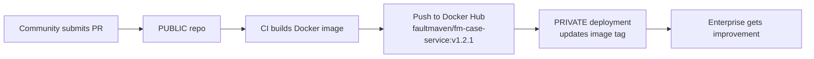

# FaultMaven Public Open-Source Version - Architecture Design

**Version:** 1.0
**Date:** 2025-11-16
**Status:** Design Document
**License:** Apache 2.0

---

## Executive Summary

This document defines the architecture and implementation plan for FaultMaven's public, open-source version. The design follows an **"Enterprise Superset" model** where the public version is the foundational layer, and the enterprise SaaS version extends it with proprietary services.

**Key Principles:**
- ✅ **Apache 2.0 License** - Zero-friction, enterprise-friendly, includes patent grant
- ✅ **Microservices Architecture** - Same architecture for PUBLIC and PRIVATE versions
- ✅ **One-Way Sync via Docker** - Public improvements feed enterprise via Docker Hub
- ✅ **Pluggable Auth Gateway** - Lightweight `fm-auth-service` for public, Supabase for enterprise
- ✅ **Single Extension Binary** - One browser extension for all users, capabilities-driven UI

---

## 1. Repository Structure

### Five (5) Public Repositories in `github.com/FaultMaven/`

#### 1.1 `faultmaven` (Backend Microservices)
**Purpose:** Core backend API services
**Source:** Extracted from original monolithic codebase
**License:** Apache 2.0

**Microservices to Extract:**
```
faultmaven/
├── services/
│   ├── fm-case-service/           # Case lifecycle management
│   ├── fm-session-service/        # Session/conversation management
│   ├── fm-knowledge-service/      # Knowledge base (RAG)
│   ├── fm-auth-service/           # Lightweight auth (PUBLIC only)
│   └── fm-api-gateway/            # Pluggable auth gateway
│
├── shared/
│   └── fm-contracts/              # Shared models/interfaces
│
├── docker-compose.dev.yml         # Development stack
└── README.md
```

**Key Features (PUBLIC):**
- ✅ Case management (SQLite storage)
- ✅ Knowledge base with RAG (ChromaDB or in-memory vectors)
- ✅ Session management (Redis or in-memory)
- ✅ Basic authentication (JWT via fm-auth-service)
- ✅ Multi-LLM support (OpenAI, Anthropic, Fireworks, local)

**What's NOT in PUBLIC:**
- ❌ Organizations & Teams
- ❌ SSO/SAML (enterprise auth)
- ❌ RBAC (role-based access control)
- ❌ Advanced analytics
- ❌ Investigation workflows (advanced)

---

#### 1.2 `faultmaven-copilot` (Browser Extension)
**Purpose:** Unified browser extension for chat interface
**Source:** Refactored from original extension
**License:** Apache 2.0

**Architecture:**
```
faultmaven-copilot/
├── src/
│   ├── background/
│   ├── sidepanel/              # Chat UI ONLY
│   ├── options/                # Settings page (API endpoint config)
│   └── api/
│       └── capabilities.ts     # Calls /v1/meta/capabilities
│
├── manifest.json               # Works with both Chrome & Firefox
└── README.md
```

**Single Binary Approach:**
- One extension for both PUBLIC and PRIVATE users
- Default API endpoint: `https://api.faultmaven.ai` (Enterprise)
- Options page allows override: `http://localhost:8000` (Self-hosted)
- UI adapts via Capabilities API response

**Capabilities API (`/v1/meta/capabilities`):**

Self-Hosted Response:
```json
{
  "deploymentMode": "self-hosted",
  "features": {
    "chat": true,
    "knowledgeBase": true,
    "cases": true
  },
  "dashboardUrl": "http://localhost:3000",
  "auth": {
    "type": "basic",
    "loginUrl": "http://localhost:8000/auth/login"
  }
}
```

Enterprise Response:
```json
{
  "deploymentMode": "enterprise",
  "features": {
    "chat": true,
    "knowledgeBase": true,
    "cases": true,
    "organizations": true,
    "teams": true,
    "sso": true
  },
  "dashboardUrl": "https://app.faultmaven.ai",
  "auth": {
    "type": "supabase",
    "loginUrl": "https://api.faultmaven.ai/auth/login"
  }
}
```

---

#### 1.3 `faultmaven-dashboard` (Web Application)
**Purpose:** Knowledge Base management UI
**Source:** New React/Next.js app
**License:** Apache 2.0

**Architecture:**
```
faultmaven-dashboard/
├── src/
│   ├── app/
│   │   ├── kb/                  # Knowledge Base UI
│   │   │   ├── upload/
│   │   │   ├── search/
│   │   │   └── manage/
│   │   ├── cases/               # Case list (read-only view)
│   │   └── settings/
│   │
│   ├── components/
│   └── lib/
│       └── api-client.ts        # Calls backend API
│
├── Dockerfile
├── package.json
└── README.md
```

**Key Features:**
- Upload documents to knowledge base
- Search and browse knowledge base
- View cases (read-only, main interaction in extension)
- Configure LLM settings

**Split UI Model:**
- **Extension (faultmaven-copilot):** Chat ONLY
- **Dashboard (faultmaven-dashboard):** KB Management ONLY
- Applies to both PUBLIC and PRIVATE versions

---

#### 1.4 `faultmaven-website` (Marketing & Docs)
**Purpose:** Official website and documentation
**Source:** Migrated from `website/` subfolder
**License:** Apache 2.0 (allows community doc contributions)

**Structure:**
```
faultmaven-website/
├── src/
│   ├── pages/
│   │   ├── index.tsx            # Marketing homepage
│   │   ├── docs/                # Documentation
│   │   │   ├── getting-started/
│   │   │   ├── deployment/
│   │   │   ├── api-reference/
│   │   │   └── architecture/
│   │   └── pricing/             # Clearly shows FREE (self-hosted) vs PAID (SaaS)
│   │
│   └── components/
│
└── README.md
```

**Why Public:**
- Community can contribute documentation improvements
- Transparency builds trust
- Marketing copy doesn't contain IP

---

#### 1.5 `faultmaven-deploy` (Easy Deployment)
**Purpose:** "Easy button" for self-hosted users
**Source:** New repository
**License:** Apache 2.0

**Complete Repository:**
```
faultmaven-deploy/
├── docker-compose.yml           # Main deployment file
├── .env.example                 # Configuration template
├── configs/
│   └── gateway.yml              # Gateway configuration
│
├── scripts/
│   └── init.sh                  # First-time setup
│
└── README.md                    # Complete setup guide
```

**User Experience:**
```bash
# Step 1: Clone
git clone https://github.com/FaultMaven/faultmaven-deploy.git
cd faultmaven-deploy

# Step 2: Configure
cp .env.example .env
# Edit .env with LLM API keys

# Step 3: Deploy
docker-compose up -d

# Done! Access at:
# - Extension API: http://localhost:8000
# - Dashboard: http://localhost:3000
```

**docker-compose.yml (PUBLIC Stack):**
```yaml
version: '3.8'

services:
  # API Gateway (pluggable auth)
  gateway:
    image: faultmaven/fm-api-gateway:latest
    ports:
      - "8000:8000"
    environment:
      - AUTH_MODE=fm-auth-service
      - AUTH_SERVICE_URL=http://auth:8001
      - CASE_SERVICE_URL=http://case:8003
      - SESSION_SERVICE_URL=http://session:8002
      - KNOWLEDGE_SERVICE_URL=http://knowledge:8004
    depends_on:
      - auth
      - case
      - session
      - knowledge

  # Lightweight Auth Service (PUBLIC)
  auth:
    image: faultmaven/fm-auth-service:latest
    environment:
      - JWT_SECRET=${JWT_SECRET}
      - DATABASE_URL=sqlite:///data/auth.db
    volumes:
      - auth-data:/data

  # Case Service
  case:
    image: faultmaven/fm-case-service:latest
    environment:
      - DATABASE_URL=sqlite:///data/cases.db
      - LLM_PROVIDER=${LLM_PROVIDER:-openai}
      - OPENAI_API_KEY=${OPENAI_API_KEY}
    volumes:
      - case-data:/data

  # Session Service
  session:
    image: faultmaven/fm-session-service:latest
    environment:
      - STORAGE_MODE=redis
      - REDIS_URL=redis://redis:6379
    depends_on:
      - redis

  # Knowledge Service
  knowledge:
    image: faultmaven/fm-knowledge-service:latest
    environment:
      - VECTOR_STORE=chromadb
      - CHROMADB_URL=http://chromadb:8000
      - EMBEDDING_MODEL=sentence-transformers/all-MiniLM-L6-v2
    volumes:
      - knowledge-data:/data
    depends_on:
      - chromadb

  # Dashboard (KB Management UI)
  dashboard:
    image: faultmaven/faultmaven-dashboard:latest
    ports:
      - "3000:3000"
    environment:
      - NEXT_PUBLIC_API_URL=http://localhost:8000

  # Infrastructure
  redis:
    image: redis:7-alpine
    volumes:
      - redis-data:/data

  chromadb:
    image: chromadb/chroma:latest
    volumes:
      - chromadb-data:/chroma/chroma

volumes:
  auth-data:
  case-data:
  knowledge-data:
  redis-data:
  chromadb-data:
```

---

## 2. Pluggable Auth Gateway Architecture

### 2.1 Pattern A: API Gateway Handles Auth

**PUBLIC Configuration (fm-auth-service):**
```yaml
# gateway.yml
auth:
  provider: fm-auth-service
  config:
    service_url: http://auth:8001
    jwt_issuer: faultmaven-self-hosted
    jwt_audience: faultmaven-api
```

**PRIVATE Configuration (Supabase):**
```yaml
# gateway.yml (Enterprise)
auth:
  provider: supabase
  config:
    project_url: https://your-project.supabase.co
    anon_key: ${SUPABASE_ANON_KEY}
    jwt_secret: ${SUPABASE_JWT_SECRET}
```

### 2.2 Gateway Implementation

```python
# fm-api-gateway/src/gateway/auth/factory.py

from abc import ABC, abstractmethod
from typing import Optional

class AuthProvider(ABC):
    @abstractmethod
    async def validate_token(self, token: str) -> Optional[dict]:
        """Validate JWT and return user claims"""
        pass

class FMAuthProvider(AuthProvider):
    """Lightweight auth for PUBLIC/self-hosted"""
    def __init__(self, service_url: str):
        self.service_url = service_url

    async def validate_token(self, token: str) -> Optional[dict]:
        # Call fm-auth-service to validate
        response = await http_client.get(
            f"{self.service_url}/validate",
            headers={"Authorization": f"Bearer {token}"}
        )
        return response.json() if response.status == 200 else None

class SupabaseAuthProvider(AuthProvider):
    """Enterprise SSO for PRIVATE/SaaS"""
    def __init__(self, project_url: str, jwt_secret: str):
        self.project_url = project_url
        self.jwt_secret = jwt_secret

    async def validate_token(self, token: str) -> Optional[dict]:
        # Validate Supabase JWT
        try:
            claims = jwt.decode(token, self.jwt_secret, algorithms=["HS256"])
            return claims
        except jwt.InvalidTokenError:
            return None

# Factory
def create_auth_provider(config: dict) -> AuthProvider:
    provider_type = config["auth"]["provider"]

    if provider_type == "fm-auth-service":
        return FMAuthProvider(
            service_url=config["auth"]["config"]["service_url"]
        )
    elif provider_type == "supabase":
        return SupabaseAuthProvider(
            project_url=config["auth"]["config"]["project_url"],
            jwt_secret=config["auth"]["config"]["jwt_secret"]
        )
    else:
        raise ValueError(f"Unknown auth provider: {provider_type}")
```

---

## 3. One-Way Sync Strategy (PUBLIC → PRIVATE)

### 3.1 The Golden Rule

> **All core bug fixes and improvements are made ONLY in PUBLIC repositories.**

### 3.2 Sync Workflow



### 3.3 Implementation

**PUBLIC Repository CI/CD (.github/workflows/release.yml):**
```yaml
name: Build and Publish Docker Image

on:
  push:
    tags:
      - 'v*'

jobs:
  build:
    runs-on: ubuntu-latest
    steps:
      - uses: actions/checkout@v3

      - name: Set up Docker Buildx
        uses: docker/setup-buildx-action@v2

      - name: Login to Docker Hub
        uses: docker/login-action@v2
        with:
          username: ${{ secrets.DOCKERHUB_USERNAME }}
          password: ${{ secrets.DOCKERHUB_TOKEN }}

      - name: Extract version from tag
        id: version
        run: echo "VERSION=${GITHUB_REF#refs/tags/v}" >> $GITHUB_OUTPUT

      - name: Build and push
        uses: docker/build-push-action@v4
        with:
          context: .
          push: true
          tags: |
            faultmaven/fm-case-service:latest
            faultmaven/fm-case-service:${{ steps.version.outputs.VERSION }}
```

**PRIVATE Repository Sync:**
```yaml
# enterprise-deployment/docker-compose.yml (PRIVATE)
version: '3.8'

services:
  # PUBLIC services (pulled from Docker Hub)
  case:
    image: faultmaven/fm-case-service:v1.2.1  # <-- Update this tag
    # ... rest of config

  knowledge:
    image: faultmaven/fm-knowledge-service:v1.2.1  # <-- Update this tag
    # ... rest of config

  # PRIVATE services (built internally)
  sso:
    build: ./services/fm-sso-service
    # ... enterprise-only service

  rbac:
    build: ./services/fm-rbac-service
    # ... enterprise-only service
```

**Sync Process:**
1. Bug fixed in `github.com/FaultMaven/faultmaven`
2. Merged to main → CI builds `faultmaven/fm-case-service:v1.2.1`
3. Update private `docker-compose.yml`: `image: faultmaven/fm-case-service:v1.2.1`
4. Run `docker-compose pull && docker-compose up -d`
5. Enterprise deployment now has the fix

**Zero git merge conflicts!**

---

## 4. Microservices to Extract from Monolithic Codebase

### 4.1 Current State Analysis

**Existing Microservices (Already Built):**
```
/home/swhouse/projects/
├── fm-agent-service/          ❌ PRIVATE (advanced AI workflows)
├── fm-api-gateway/            ✅ PUBLIC (needs auth plugin work)
├── fm-auth-service/           ✅ PUBLIC (lightweight JWT)
├── fm-case-service/           ✅ PUBLIC (remove org features)
├── fm-contracts/              ✅ PUBLIC (shared models)
├── fm-evidence-service/       ❓ PUBLIC? (if basic file upload)
├── fm-investigation-service/  ❌ PRIVATE (enterprise workflows)
├── fm-knowledge-service/      ✅ PUBLIC (remove RBAC)
└── fm-session-service/        ✅ PUBLIC (remove multi-tenant)
```

**Monolithic Code to DEPRECATE:**
```
FaultMaven/  (original monolith)
└── (Keep for reference, but migrate to microservices)
```

### 4.2 Extraction Plan for PUBLIC Microservices

#### Step 1: Clean Each Service for PUBLIC Release

**fm-case-service (PUBLIC Version):**
```bash
# Remove enterprise features
- Organizations & teams
- Case sharing across users
- Advanced analytics
- PostgreSQL support (keep SQLite only)

# Keep core features
+ Case CRUD
+ Evidence attachment
+ AI chat integration
+ SQLite storage
```

**fm-knowledge-service (PUBLIC Version):**
```bash
# Remove enterprise features
- Per-organization knowledge bases
- RBAC (role-based access)
- PostgreSQL support
- Team-level KB sharing

# Keep core features
+ Document upload
+ RAG search
+ Embeddings (sentence-transformers)
+ ChromaDB or in-memory vectors
```

**fm-session-service (PUBLIC Version):**
```bash
# Remove enterprise features
- Multi-tenant session isolation
- Redis clustering
- Advanced session analytics

# Keep core features
+ Session CRUD
+ Conversation history
+ Redis support (single instance)
+ In-memory fallback
```

**fm-api-gateway (PUBLIC Version):**
```bash
# Add pluggable auth
+ Auth provider interface
+ fm-auth-service integration
+ Supabase integration (for enterprise)

# Remove enterprise features
- Complex rate limiting
- Advanced monitoring

# Keep core features
+ Request routing
+ JWT validation
+ CORS handling
+ Basic rate limiting
```

---

## 5. Implementation Roadmap

### Phase 1: Repository Setup (Week 1)
- [ ] Create 5 public repositories in `github.com/FaultMaven/`
- [ ] Configure Apache 2.0 LICENSE in each
- [ ] Setup CI/CD pipelines (Docker builds)
- [ ] Create initial README files

### Phase 2: Extract & Clean Microservices (Week 2-3)
- [ ] Extract fm-case-service → remove org features
- [ ] Extract fm-knowledge-service → remove RBAC
- [ ] Extract fm-session-service → simplify to single-tenant
- [ ] Extract fm-auth-service → lightweight JWT only
- [ ] Extract fm-api-gateway → implement pluggable auth

### Phase 3: Build Dashboard (Week 3-4)
- [ ] Create faultmaven-dashboard React app
- [ ] Implement KB upload UI
- [ ] Implement KB search UI
- [ ] Implement case list (read-only)

### Phase 4: Refactor Extension (Week 4-5)
- [ ] Refactor faultmaven-copilot to chat-only
- [ ] Implement Capabilities API
- [ ] Add options page for API endpoint config
- [ ] Test with both localhost and production endpoints

### Phase 5: Create Deployment Repo (Week 5)
- [ ] Create faultmaven-deploy repository
- [ ] Write comprehensive docker-compose.yml
- [ ] Create .env.example with all config options
- [ ] Write detailed README with setup instructions

### Phase 6: Documentation (Week 6)
- [ ] Migrate and update faultmaven-website
- [ ] Write getting started guide
- [ ] Write API reference
- [ ] Write architecture documentation
- [ ] Create video walkthrough

### Phase 7: Testing & Polish (Week 7)
- [ ] End-to-end testing of docker-compose deployment
- [ ] Load testing
- [ ] Security audit
- [ ] Bug fixes

### Phase 8: Launch (Week 8)
- [ ] Announce on Hacker News, Reddit
- [ ] Publish blog post
- [ ] Create demo video
- [ ] Monitor community feedback

---

## 6. Success Metrics

### V1: Zero-Friction Adoption
- ✅ User can deploy in < 5 minutes
- ✅ Single `docker-compose up` command
- ✅ Works offline (no Supabase dependency)
- ✅ Clear upgrade path to enterprise

### Community Engagement
- 🎯 100 GitHub stars in first month
- 🎯 10 community PRs in first quarter
- 🎯 5 community-contributed KB documents

### Enterprise Pipeline
- 🎯 10% of self-hosted users request enterprise features
- 🎯 5 enterprise pilots from self-hosted users

---

## 7. Open Questions & Decisions Needed

### Q1: Evidence Service - PUBLIC or PRIVATE?
**Decision needed:** Should fm-evidence-service be in the PUBLIC version?

**Option A: Include in PUBLIC**
- Pro: Complete feature parity for basic use cases
- Pro: File uploads are not proprietary
- Con: Adds complexity

**Option B: Exclude from PUBLIC**
- Pro: Simpler PUBLIC stack
- Con: Users can't upload files in self-hosted version

**Recommendation:** Include in PUBLIC (Option A)

### Q2: ChromaDB vs In-Memory Vectors?
**Decision needed:** Default vector store for PUBLIC version?

**Option A: ChromaDB (recommended)**
- Pro: Persistent storage
- Pro: Better performance at scale
- Con: Extra Docker container

**Option B: In-Memory (FAISS)**
- Pro: Zero dependencies
- Con: Data lost on restart
- Con: Limited scale

**Recommendation:** ChromaDB (Option A), with in-memory as fallback

### Q3: Redis vs In-Memory Sessions?
**Decision needed:** Default session store for PUBLIC version?

**Option A: Redis (recommended)**
- Pro: Persistent sessions
- Pro: Industry standard
- Con: Extra Docker container

**Option B: In-Memory**
- Pro: Zero dependencies
- Con: Sessions lost on restart

**Recommendation:** Redis (Option A), docker-compose makes it trivial

---

## 8. Conclusion

This design achieves all strategic goals:

✅ **Apache 2.0** - Enterprise-friendly, zero-friction license
✅ **Enterprise Superset** - PUBLIC is foundation, PRIVATE extends it
✅ **One-Way Sync** - Docker artifacts eliminate merge conflicts
✅ **Pluggable Auth** - Lightweight for PUBLIC, enterprise SSO for PRIVATE
✅ **Single Extension** - One binary, capabilities-driven UI
✅ **Zero-Friction Setup** - `docker-compose up` and you're running

The architecture is clean, maintainable, and positions FaultMaven for both community growth and enterprise success.

---

**Next Steps:**
1. Review and approve this design
2. Begin Phase 1: Repository setup
3. Start extracting microservices

**Estimated Timeline:** 8 weeks to public launch
