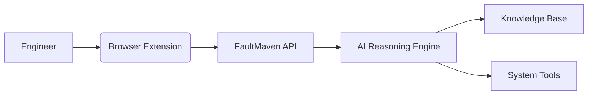
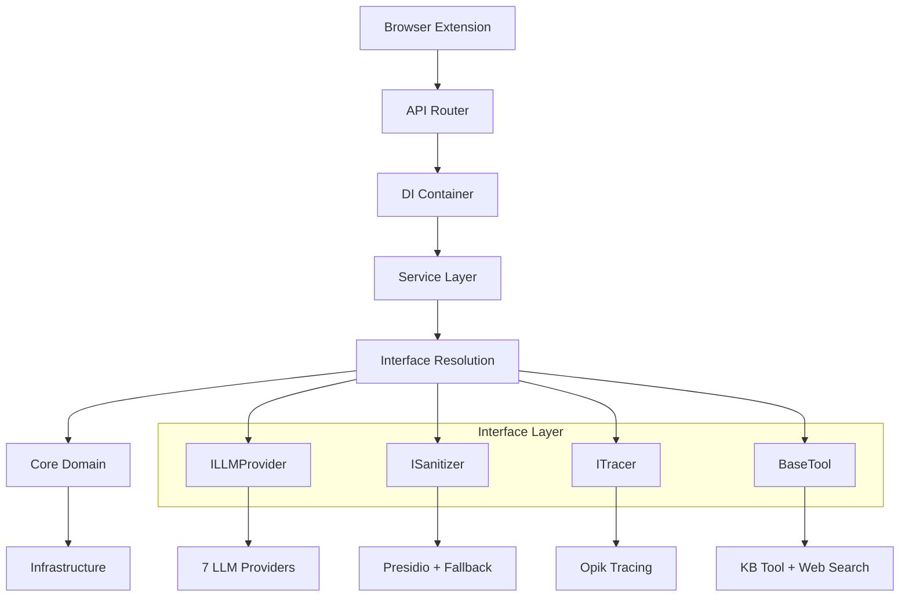

# FaultMaven
[](https://opensource.org/licenses/Apache-2.0)
[](https://www.python.org/downloads/)
[](https://docs.docker.com/)
[](https://fastapi.tiangolo.com/)
[](https://github.com/FaultMaven/faultmaven)
[](https://github.com/FaultMaven/faultmaven)
[](https://github.com/FaultMaven/faultmaven)
[](https://github.com/FaultMaven/faultmaven)

**AI-Powered Troubleshooting Copilot for SRE and DevOps Teams**

*Built with Clean Architecture, Interface-Based Design, and Comprehensive Dependency Injection*

## 🚀 Introduction

FaultMaven is an enterprise-grade open-source AI troubleshooting copilot designed to help SRE and DevOps teams diagnose and resolve complex system issues. Built with clean architecture principles, it serves as the intelligent backend that powers browser-based troubleshooting workflows, combining structured reasoning with centralized knowledge management and multi-LLM provider support.



## ✨ Core Components

### 1. FaultMaven API Server (This Repository)
- **Clean Architecture**: Interface-based design with dependency injection container
- **Multi-LLM Support**: 7 providers (Fireworks, OpenAI, Anthropic, Gemini, HuggingFace, OpenRouter, Local)
- **AI Reasoning Engine**: LangGraph-based agent with 5-phase SRE troubleshooting doctrine
- **Knowledge Management**: RAG-powered document processing with vector store abstraction
- **Data Processing**: Interface-based log/metrics analysis pipelines
- **Privacy-First Security**: Comprehensive PII redaction with Presidio microservice integration
- **User Management**: Authentication, account management, billing, and usage tracking

### 2. [FaultMaven Website](https://faultmaven.com) (This Repository)
- **User Authentication**: Registration, login, password management
- **Account Dashboard**: Profile management, subscription, billing
- **Marketing Pages**: Landing pages, features, pricing, company information
- **Extension Download**: Browser extension distribution and setup guides

### 3. [FaultMaven Copilot](https://github.com/FaultMaven/faultmaven-copilot) (Separate Repository)
- **Browser Extension UI**: Troubleshooting interface with 7 response types
- **Real-time Communication**: Interactive chat with AI agent
- **Evidence Submission**: File uploads and data input
- **Session Management**: Context-aware troubleshooting sessions

## 🧠 Key Features

| Feature | Description | Technology |
|---------|-------------|------------|
| **Clean Architecture** | Interface-based design with dependency injection | `DIContainer`, Interface contracts |
| **Multi-LLM Support** | 7 providers with automatic fallback | Fireworks, OpenAI, Anthropic, Gemini+ |
| **Agentic Troubleshooting** | Five-phase SRE doctrine for issue investigation | LangGraph, LLMs |
| **Knowledge Base (RAG)** | Centralized repository for runbooks and docs | ChromaDB, BGE-M3 |
| **Privacy-First Design** | Comprehensive PII redaction before processing | Presidio microservice, Custom regex |
| **Client Protection System** | Two-phase protection against malicious clients | Rate limiting, ML anomaly detection, Reputation |
| **Interface-Based Tools** | Pluggable tool system with `BaseTool` interface | `KnowledgeBaseTool`, `WebSearchTool` |
| **Context-Aware Analysis** | Intelligent evidence processing with interfaces | `IDataClassifier`, `ILogProcessor` |
| **Comprehensive Observability** | LLM tracing and performance monitoring | Opik, `ITracer` interface |
| **Dual Frontend Architecture** | Website for auth/management, Extension for troubleshooting | Website + Copilot Extension |
| **User Management** | Authentication, billing, usage tracking | User accounts, subscriptions, billing |

## 🚀 Quick Start

### Prerequisites
- [Docker](https://www.docker.com/products/docker-desktop/)
- [Python 3.11+](https://www.python.org/downloads/)
- Clone the repositories:
  ```bash
  # Backend API server + Website frontend
  git clone https://github.com/FaultMaven/faultmaven.git
  
  # Browser extension (separate repository)
  git clone https://github.com/FaultMaven/faultmaven-copilot.git
  ```

### Local Setup with Docker
1. Configure environment variables:
   ```bash
   cp .env.example .env
   # Add your API keys to .env
   ```

2. Start the stack:
   ```bash
   docker-compose up --build -d
   ```

3. Verify services:
   ```bash
   docker ps --format "table {{.Names}}\t{{.Status}}\t{{.Ports}}"
   ```
   ```
   NAMES               STATUS              PORTS
   faultmaven-backend  Up 5 minutes        0.0.0.0:8000->8000/tcp
   chromadb            Up 5 minutes        8000/tcp
   redis               Up 5 minutes        6379/tcp
   ```

4. Start the website frontend:
   ```bash
   # In faultmaven directory (website frontend)
   cd frontend
   npm install
   npm run dev
   # Website will be available at http://localhost:3000
   ```

5. Start the copilot extension development:
   ```bash
   # In faultmaven-copilot directory
   echo "VITE_API_BASE_URL=http://localhost:8000" > .env.local
   npm install
   npm run dev
   # Extension development server will be available
   ```

### Local Development Setup

For local development without Docker:

1. Setup Python environment:
   ```bash
   python -m venv .venv
   source .venv/bin/activate
   pip install -r requirements.txt
   ```

2. Configure environment:
   ```bash
   cp .env.example .env
   # Add your API keys to .env
   ```

3. Start FaultMaven:
   ```bash
   # Standard startup
   ./run_faultmaven.sh
   
   # Or development mode (full transparency, all logs)
   ./run_faultmaven_dev.sh
   ```

## 🧪 Testing

Run the test suite with pytest:

```bash
# Unit tests
pytest -m "unit"

# Integration tests (requires Docker)
pytest -m "integration"

# Full test suite
pytest --cov=faultmaven tests/
```

## 🏗️ Architecture Overview

FaultMaven follows **Clean Architecture** principles with interface-based programming, comprehensive dependency injection, and clear separation of concerns. The system is designed for maximum maintainability, testability, and extensibility through interface contracts and service abstraction.

### Clean Architecture Layers

```
┌─────────────────────────────────────────────────────────────┐
│                        API Layer                             │
│  (FastAPI Routers, Dependencies, Request/Response Models)    │
├─────────────────────────────────────────────────────────────┤
│                      Service Layer                           │
│  (Business Logic, Orchestration, Interface Dependencies)     │
├─────────────────────────────────────────────────────────────┤
│                    Core Domain                               │
│  (Agent, Data Processing, Knowledge Base)                    │
├─────────────────────────────────────────────────────────────┤
│                   Infrastructure Layer                       │
│  (LLM Router, Redis, ChromaDB, Security, Observability)      │
├─────────────────────────────────────────────────────────────┤
│                   Interface Contracts                        │
│  (ILLMProvider, ISanitizer, ITracer, BaseTool, etc.)        │
└─────────────────────────────────────────────────────────────┘
```

### Dependency Injection Architecture

**DIContainer** provides centralized dependency management:
- **Singleton Pattern**: Single container instance across application
- **Lazy Initialization**: Components created only when needed  
- **Interface Resolution**: Automatic mapping from interfaces to implementations
- **Health Monitoring**: Built-in health checking for all dependencies
- **Graceful Degradation**: Mock implementations when dependencies unavailable

### Key Components

#### 1. **API Layer** (`api/v1/`)
- RESTful endpoints with versioning support
- Request validation and response formatting
- Dependency injection for services
- Middleware for authentication and rate limiting

#### 2. **Service Layer** (`services/`) - Interface-Based Orchestration
- **AgentService**: Orchestrates troubleshooting workflows using `ILLMProvider`, `ISanitizer`, `ITracer`, `List[BaseTool]`
- **DataService**: Manages data processing using `IDataClassifier`, `ILogProcessor`, `IStorageBackend`
- **KnowledgeService**: Handles knowledge base operations using `IVectorStore`, `IKnowledgeIngester`
- **SessionService**: Provides session lifecycle management using `ISessionStore`

#### 3. **Core Domain** (`core/`)
- **Agent**: LangGraph-based troubleshooting engine with 5-phase doctrine
- **Processing**: Log analysis and data classification
- **Knowledge**: Document ingestion and RAG operations

#### 4. **Infrastructure** (`infrastructure/`) - Interface Implementations
- **LLM**: Multi-provider routing with fallback implementing `ILLMProvider` (7 providers supported)
- **Persistence**: Redis sessions and ChromaDB vectors implementing `ISessionStore`, `IVectorStore`
- **Security**: Comprehensive PII redaction implementing `ISanitizer` with Presidio integration
- **Observability**: Opik tracing implementing `ITracer` with distributed monitoring

#### 5. **Interface Contracts** (`models/interfaces.py`)
Defines abstract contracts for all major components:
- **Infrastructure**: `ILLMProvider`, `ISanitizer`, `ITracer`, `IVectorStore`, `ISessionStore`
- **Processing**: `IDataClassifier`, `ILogProcessor`, `IKnowledgeIngester`
- **Tools**: `BaseTool` with standardized `execute()` and `get_schema()` methods

### Data Flow Example



For detailed architecture documentation, see:
- [Architecture Decision Guide](docs/ARCHITECTURE_DECISION_GUIDE.md) - Comprehensive architectural blueprint and migration strategy
- [System Architecture](docs/architecture/SYSTEM_ARCHITECTURE.md) - Complete interface-based architecture
- [Dependency Injection System](docs/architecture/dependency-injection-system.md) - DI container deep dive
- [Service Patterns](docs/architecture/service-patterns.md) - Interface-based service design

## 🛠️ Development

### Environment Setup
1. Create virtual environment:
   ```bash
   python -m venv .venv
   source .venv/bin/activate
   ```

2. Install dependencies:
   ```bash
   pip install -r requirements.txt
   pip install -r requirements-test.txt
   python -m spacy download en_core_web_lg
   ```

3. Configure pre-commit hooks:
   ```bash
   pre-commit install
   ```

### Clean Architecture Code Structure
```
faultmaven/
├── api/v1/              # API Layer - HTTP endpoints and routing
│   ├── routes/          # Domain-specific routers (agent, data, knowledge, session)
│   └── dependencies.py  # FastAPI dependency injection integration
├── services/            # Service Layer - Business logic orchestration 
│   ├── agent_service.py    # Troubleshooting workflow orchestration
│   ├── data_service.py     # Data processing pipeline management
│   ├── knowledge_service.py # Knowledge base operations
│   └── session_service.py   # Session lifecycle management
├── core/                # Core Domain - Business logic and entities
│   ├── agent/           # AI reasoning engine (LangGraph + 5-phase doctrine)
│   ├── knowledge/       # RAG document processing
│   └── processing/      # Data classification and log analysis
├── infrastructure/      # Infrastructure - External service integrations
│   ├── llm/            # Multi-provider LLM routing (7 providers)
│   ├── security/       # PII redaction with Presidio integration
│   ├── persistence/    # Redis sessions + ChromaDB vectors
│   └── observability/  # Opik tracing and monitoring
├── tools/              # Agent Tools - Standardized capabilities
│   ├── knowledge_base.py  # RAG tool implementing BaseTool
│   └── web_search.py      # Search tool implementing BaseTool
├── models/             # Data Models and Interface Contracts
│   ├── interfaces.py   # Abstract interfaces for all layers
│   └── *.py           # Request/response DTOs and domain entities
├── container.py        # Dependency Injection Container (DIContainer)
├── config/             # Configuration and Feature Flags
└── main.py             # FastAPI application with DI integration
```

## ⚙️ Configuration

### LLM Provider Setup

FaultMaven supports **7 LLM providers** with automatic fallback chains managed through a centralized provider registry:

```env
# Primary provider (7 options available)
CHAT_PROVIDER="fireworks"  # fireworks, openai, anthropic, gemini, huggingface, openrouter, local

# Provider API keys (providers auto-initialize based on available keys)
FIREWORKS_API_KEY="fw_your_api_key"           # Fireworks AI (recommended)
OPENAI_API_KEY="sk_your_openai_key"          # OpenAI GPT models
ANTHROPIC_API_KEY="sk-ant-your_key"          # Claude 3.5 Sonnet
GEMINI_API_KEY="your_google_ai_key"          # Google Gemini
HUGGINGFACE_API_KEY="hf_your_token"          # HuggingFace models
OPENROUTER_API_KEY="sk-or-your_key"          # OpenRouter multi-provider
LOCAL_LLM_URL="http://localhost:11434"       # Local/Ollama (no API key needed)
```

**Automatic Fallback Chain**: Primary → Fireworks → OpenAI → Local (based on available API keys)

**Supported Models by Provider**:
- **Fireworks**: `llama-v3p1-8b-instruct`, `llama-v3p1-70b-instruct`, `mixtral-8x7b-instruct`
- **OpenAI**: `gpt-4o`, `gpt-4o-mini`, `gpt-3.5-turbo`
- **Anthropic**: `claude-3-5-sonnet-20241022`, `claude-3-haiku-20240307`, `claude-3-opus-20240229`
- **Gemini**: `gemini-1.5-pro`, `gemini-1.5-flash`, `gemini-pro-vision`
- **HuggingFace**: `tiiuae/falcon-7b-instruct`, `microsoft/DialoGPT-large`
- **OpenRouter**: Access to multiple providers through unified API
- **Local**: Ollama, vLLM, any OpenAI-compatible server

For detailed configuration and adding new providers, see: [How to Add Providers](docs/how-to-add-providers.md)

### Environment Variables

Copy `.env.example` to `.env` and configure:
- **Required**: At least one LLM provider API key
- **Optional**: Observability, web search, local model servers

### Observability & Monitoring

**Built-in Health Monitoring**:
```bash
# Check dependency injection container health
curl http://localhost:8000/health/dependencies

# Response includes status of all injected dependencies:
{
  "status": "healthy",  # healthy | degraded | not_initialized
  "components": {
    "llm_provider": true,
    "sanitizer": true, 
    "tracer": true,
    "tools_count": 2,
    "agent_service": true,
    "data_service": true,
    "knowledge_service": true
  }
}
```

**Opik LLM Observability**:

For **team Opik server** (default configuration):
```bash
# Ensure hostname resolves
echo "192.168.0.111 opik.faultmaven.local" >> /etc/hosts
./run_faultmaven.sh
```

For **custom Opik instances**:
```bash
# Configure custom Opik server
cp scripts/config/opik_remote.sh.example scripts/config/opik_custom.sh
# Edit with your Opik server details
source scripts/config/opik_custom.sh
./run_faultmaven.sh
```

**Accessing Monitoring**:
- **Opik Dashboard**: `http://opik.faultmaven.local:30080` - LLM traces and performance
- **Health Endpoint**: `http://localhost:8000/health/dependencies` - Container health
- **API Documentation**: `http://localhost:8000/docs` - Interactive API explorer

## 📜 License

Apache 2.0 - See [LICENSE](LICENSE) for details.

## 🤝 Contributing

We welcome contributions! Please see our [Contribution Guidelines](docs/CONTRIBUTING.md) for details.

**Architecture Guidelines**: When contributing, please follow the interface-based design patterns. All new components should:
1. Define and implement appropriate interfaces from `models/interfaces.py`
2. Integrate with the dependency injection container
3. Include comprehensive unit tests with interface mocks
4. Follow the clean architecture layer separation

## 📬 Contact

For inquiries: [support@faultmaven.ai](mailto:support@faultmaven.ai)  
Join our [Discord Community](https://discord.com/faultmaven) for real-time discussion.

## 📚 Documentation

### **Documentation Structure**

FaultMaven documentation is organized into strategic and tactical levels:

#### **Strategic Level (System Vision & Requirements)**
- **[System Requirements & Design](../docs/FAULTMAVEN_SYSTEM_REQUIREMENTS.md)** - Complete system vision, requirements, and frontend design specifications

#### **Tactical Level (Implementation & Technical Details)**
- **[Architecture Documentation](../docs/architecture/)** - Technical implementation guidance
- **[Protection System Guide](../docs/security/comprehensive-protection-implementation-guide.md)** - Complete client protection implementation (Phase 1 + Phase 2)
- **[Website Frontend Documentation](../docs/frontend/)** - Website frontend implementation details (this repository)
- **[Copilot Extension Repository](https://github.com/FaultMaven/faultmaven-copilot)** - Complete browser extension codebase and documentation

### **Quick Navigation by Role**

#### **For Product Managers & Stakeholders**
- **[System Requirements](../docs/FAULTMAVEN_SYSTEM_REQUIREMENTS.md)** - System vision, features, and business requirements

#### **For Website Frontend Developers** (This Repository)
- **[Website Frontend Guide](../docs/frontend/website-guide.md)** - Landing pages, authentication, and user management
- **[Website Component Library](../docs/frontend/website-components.md)** - Marketing, auth, and dashboard components

#### **For Copilot Extension Developers** (Separate Repository)
- **[System Requirements - Frontend Section](../docs/FAULTMAVEN_SYSTEM_REQUIREMENTS.md#frontend-design--user-experience)** - UI/UX requirements and design specifications for the browser extension
- **[Copilot Repository](https://github.com/FaultMaven/faultmaven-copilot)** - Complete extension codebase and documentation
- **Note**: The 7 response types and troubleshooting UI are implemented in the separate repository

#### **For Backend Developers**
- **[System Architecture](../docs/architecture/SYSTEM_ARCHITECTURE.md)** - High-level system architecture and design patterns
- **[Component Interactions](../docs/architecture/COMPONENT_INTERACTIONS.md)** - Component interaction patterns and data flows
- **[Implementation Gap Analysis](../docs/architecture/IMPLEMENTATION_GAP_ANALYSIS.md)** - Development roadmap and gap closure plan
- **[Developer Guide](../docs/architecture/developer-guide.md)** - Development workflow and best practices
- **[Service Patterns](../docs/architecture/service-patterns.md)** - Service layer implementation patterns
- **[Dependency Injection System](../docs/architecture/dependency-injection-system.md)** - DI container architecture and patterns
- **[Container Usage Guide](../docs/architecture/container-usage-guide.md)** - Practical DI container usage examples

#### **For DevOps & Operations**
- **[Deployment Guide](../docs/architecture/DEPLOYMENT_GUIDE.md)** - Production deployment instructions and configuration
- **[Testing Guide](../docs/architecture/testing-guide.md)** - Testing strategies and quality assurance

#### **For New Team Members**
- **[Developer Guide](../docs/architecture/developer-guide.md)** - Onboarding and development workflow
- **[Interface-Based Design](../docs/architecture/interface-based-design.md)** - Core architectural principles

### **Key Features Documentation**

#### **Response Type System**
- **7 Response Types**: ANSWER, PLAN_PROPOSAL, CLARIFICATION_REQUEST, CONFIRMATION_REQUEST, SOLUTION_READY, NEEDS_MORE_DATA, ESCALATION_REQUIRED
- **Copilot Extension Components**: Each response type has dedicated React components with specific behaviors in the browser extension
- **Website Frontend**: Landing pages, authentication, and user management (separate from the 7 response types)
- **Implementation**: 
  - **Copilot Extension**: See [Copilot Repository](https://github.com/FaultMaven/faultmaven-copilot) for complete implementation
  - **Website**: See [Website Component Library](../docs/frontend/website-components.md)

#### **Intelligent Communication**
- **Memory Management**: Hierarchical memory system with context awareness
- **Advanced Prompting**: Dynamic prompt assembly with context injection
- **Strategic Planning**: Multi-phase planning and problem decomposition
- **Implementation**: See [System Requirements - Advanced Communication Section](../docs/FAULTMAVEN_SYSTEM_REQUIREMENTS.md#advanced-communication-layer-memory-prompting--planning)

#### **Case Lifecycle Management**
- **Status Management**: Comprehensive case status tracking
- **Termination Logic**: Intelligent case closure and escalation
- **Implementation**: See [System Requirements - Case Lifecycle Section](../docs/FAULTMAVEN_SYSTEM_REQUIREMENTS.md#case-lifecycle-management)

---

**Technical Documentation**:
- [Architecture Deep Dive](docs/architecture/SYSTEM_ARCHITECTURE.md)
- [DI Container Guide](docs/architecture/dependency-injection-system.md)
- [Container Usage Guide](docs/architecture/container-usage-guide.md)
- [LLM Provider Setup](docs/how-to-add-providers.md)
- [Testing Guide](tests/README.md)
- [Testing Architecture Guide](docs/architecture/testing-guide.md)
- [Migration Guide](docs/migration/import-migration-guide.md)