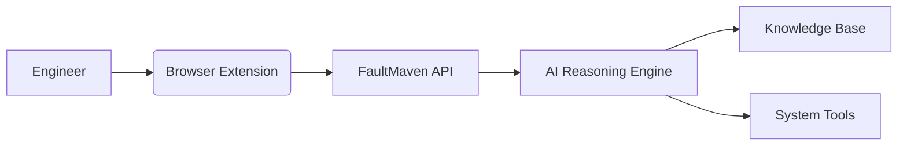
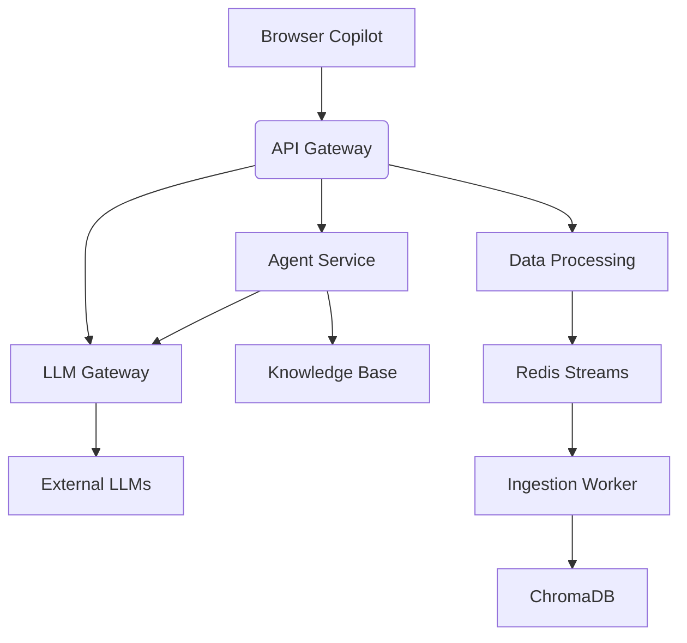

# FaultMaven
[](https://opensource.org/licenses/Apache-2.0)
[](https://www.python.org/downloads/)
[](https://docs.docker.com/)
[](https://fastapi.tiangolo.com/)
[](https://github.com/FaultMaven/faultmaven)
[](https://github.com/FaultMaven/faultmaven)

**AI-Powered Troubleshooting Copilot for SRE and DevOps Teams**

## 🚀 Introduction

FaultMaven is an open-source AI assistant designed to help engineers diagnose and resolve complex system issues. It serves as the intelligent backend that powers browser-based troubleshooting workflows, combining structured reasoning with centralized knowledge management.



## ✨ Core Components

### 1. FaultMaven API Server (This Repository)
- **AI Reasoning Engine**: LangGraph-based agent with SRE troubleshooting doctrine
- **Knowledge Management**: RAG-powered document processing
- **Data Processing**: Log/metrics analysis pipelines
- **Security**: PII redaction and access controls

### 2. [FaultMaven Copilot](https://github.com/FaultMaven/faultmaven-copilot)
- Browser extension UI for real-time troubleshooting
- Side panel interface for evidence submission
- Interactive chat experience

## 🧠 Key Features

| Feature | Description | Technology |
|---------|-------------|------------|
| **Agentic Troubleshooting** | Five-phase SRE doctrine for issue investigation | LangGraph, LLMs |
| **Knowledge Base (RAG)** | Centralized repository for runbooks and docs | ChromaDB, BGE-M3 |
| **Privacy-First Design** | Sensitive data redaction before processing | Presidio, Custom regex |
| **Extensible Tools** | Pluggable tool system for integrations | LangChain Tools |
| **Context-Aware Analysis** | Intelligent evidence processing | Scikit-learn, Pandas |
| **Observability** | LLM tracing and performance monitoring | Opik, Prometheus |

## 🚀 Quick Start

### Prerequisites
- [Docker](https://www.docker.com/products/docker-desktop/)
- [Python 3.11+](https://www.python.org/downloads/)
- Clone both repositories:
  ```bash
  git clone https://github.com/FaultMaven/faultmaven.git
  git clone https://github.com/FaultMaven/faultmaven-copilot.git
  ```

### Local Setup with Docker
1. Configure environment variables:
   ```bash
   cp .env.example .env
   # Add your API keys to .env
   ```

2. Start the stack:
   ```bash
   docker-compose up --build -d
   ```

3. Verify services:
   ```bash
   docker ps --format "table {{.Names}}\t{{.Status}}\t{{.Ports}}"
   ```
   ```
   NAMES               STATUS              PORTS
   faultmaven-backend  Up 5 minutes        0.0.0.0:8000->8000/tcp
   chromadb            Up 5 minutes        8000/tcp
   redis               Up 5 minutes        6379/tcp
   ```

4. Connect the frontend:
   ```bash
   # In faultmaven-copilot directory
   echo "VITE_API_BASE_URL=http://localhost:8000" > .env.local
   npm install
   npm run dev
   ```

## 🧪 Testing

Run the test suite with pytest:

```bash
# Unit tests
pytest -m "unit"

# Integration tests (requires Docker)
pytest -m "integration"

# Full test suite
pytest --cov=faultmaven tests/
```

## 🏗️ Architecture Overview

FaultMaven uses a microservices-ready architecture with clear separation of concerns:



### Key Components
1. **API Gateway**: Request routing and authentication
2. **Agent Service**: Stateful reasoning workflows
3. **LLM Gateway**: Provider routing and caching
4. **Knowledge Base**: RAG operations and document management
5. **Data Processing**: Evidence classification and analysis

For architecture details, see [Microservice Transition Plan](docs/architecture/microservice-proposal.md).

## 🛠️ Development

### Environment Setup
1. Create virtual environment:
   ```bash
   python -m venv .venv
   source .venv/bin/activate
   ```

2. Install dependencies:
   ```bash
   pip install -r requirements.txt
   pip install -r requirements-test.txt
   ```

3. Configure pre-commit hooks:
   ```bash
   pre-commit install
   ```

### Code Structure
```
faultmaven/
├── agent/               # Reasoning components
├── api/                 # Endpoint handlers
├── data_processing/     # Evidence analysis
├── knowledge_base/      # RAG management
├── llm/                 # Model routing
├── security/            # PII redaction
├── models.py            # Shared data models
└── main.py              # Application entry point
```

## 📜 License

Apache 2.0 - See [LICENSE](LICENSE) for details.

## 🤝 Contributing

We welcome contributions! Please see our [Contribution Guidelines](CONTRIBUTING.md) for details.

## 📬 Contact

For inquiries: [support@faultmaven.ai](mailto:support@faultmaven.ai)  
Join our [Discord Community](https://discord.com/faultmaven) for real-time discussion.