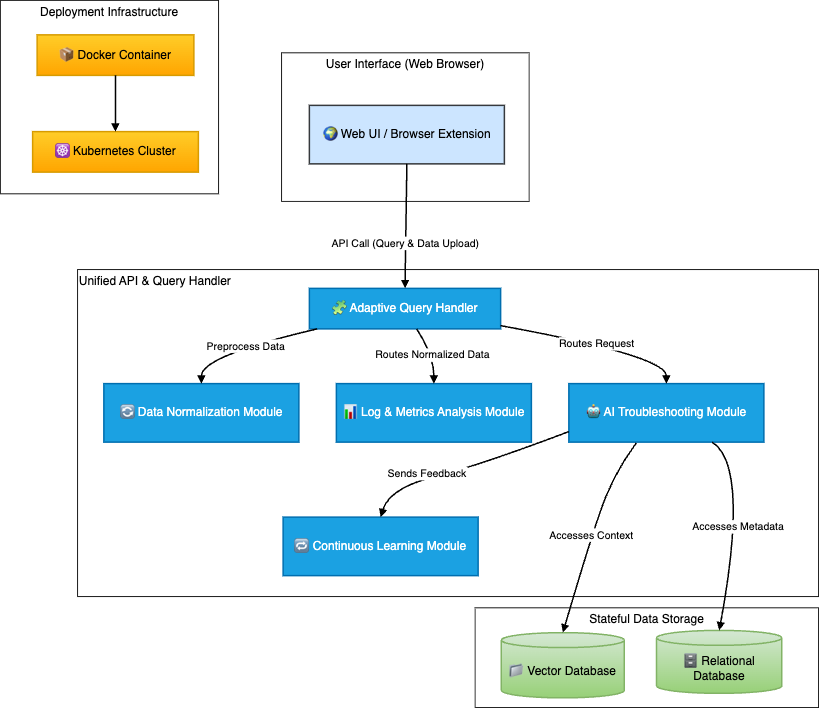

# FaultMaven

## 🚀 Introduction
FaultMaven is an **AI-powered troubleshooting assistant** designed for **Engineers, SREs, and DevOps professionals**. It operates as a **browser-integrated companion**, dynamically analyzing logs, observability data, and incident reports to provide **real-time insights and guided troubleshooting**.

By leveraging AI-driven analysis and contextual awareness, FaultMaven **accelerates incident resolution**, minimizes **manual effort**, and enhances **reliability engineering workflows**.

---

## ✨ Key Features
✔ **AI-Driven Troubleshooting** – Provides **real-time recommendations** based on logs, metrics, and contextual analysis.  
✔ **Dynamic Query Handling** – Supports **query-only**, **data-only**, and **combined** troubleshooting scenarios.  
✔ **Log & Metrics Analysis** – Extracts key patterns and anomalies from structured and unstructured observability data.  
✔ **AI-Assisted vs. Manual Control** – Users have full control over AI involvement in troubleshooting.  
✔ **Session-Based Continuous Learning** – Adapts troubleshooting recommendations based on session interactions.  

---

## 📦 Installation & Setup

### ✅ Prerequisites
Ensure you have the following installed before setting up FaultMaven:
- Python **3.10+**
- Docker (for containerized deployment)
- Git (for version control)

### 🔧 Setup Instructions
Clone the repository and install dependencies:
```bash
git clone https://github.com/FaultMaven/FaultMaven.git
cd FaultMaven
python -m venv venv
source venv/bin/activate  # For Windows use `venv\Scripts\activate`
pip install -r requirements.txt
```

### ▶️ Running the Application
Run the application locally:
```bash
python app/main.py
```

Run with Docker:
```bash
docker build -t faultmaven-mvp .
docker run -p 8000:8000 faultmaven-mvp
```

---

## 🛠 Development Guide
### 💡 Contributing
We welcome contributions! To get started:
1. **Fork** the repository.
2. **Create a feature branch**:  
   ```bash
   git checkout -b feature-new-module
   ```
3. **Commit & push** your changes:
   ```bash
   git commit -m "Added new feature"
   git push origin feature-new-module
   ```
4. **Submit a Pull Request** for review.

### 📂 Code Structure
The project follows a **modular architecture**:
- **`app/`** – Core application modules.
  - **`adaptive_query_handler.py`** – Processes user queries.
  - **`log_metrics_analysis.py`** – Extracts insights from logs and metrics.
  - **`ai_troubleshooting.py`** – Provides AI-generated troubleshooting recommendations.
  - **`continuous_learning.py`** – Implements session-based learning.
  - **`data_manager.py`** – Manages data normalization and input preprocessing.
  - **`logger.py`** – Handles logging and debugging.
  - **`api.py`** – Defines FastAPI endpoints for user interaction.
- **`tests/`** – Unit and integration test suite.

### 🧪 Running Tests
Run unit tests using:
```bash
pytest tests/
```

---

## 🏗 Architecture Overview
FaultMaven is designed with a **monolithic deployment model** (for MVP) with **modular components** that can later be scaled into microservices.

### 🎯 Core Components
- **Adaptive Query Handler** – Interprets user input and routes queries accordingly.
- **Log & Metrics Analysis Module** – Extracts patterns and anomalies from observability data.
- **AI Troubleshooting Module** – Generates guided troubleshooting recommendations.
- **Continuous Learning Module** – Improves AI suggestions dynamically within a session.
- **Unified API Server** – Serves FastAPI endpoints and integrates AI processing.

### 🏢 System Architecture Diagram


For more details, see the [Architecture Documentation](docs/architecture.md).

---

## 📜 License
This project is licensed under the **Apache 2.0 License** – see the [LICENSE](LICENSE) file for details.

---

## 🔮 Roadmap
✅ **MVP Release** – Core AI troubleshooting & log analysis  
🚀 **Cloud Integration** – AWS, GCP, Azure support  
🛡 **Enterprise Features** – Advanced security & RBAC  
🧠 **Improved AI** – Context-aware troubleshooting enhancements  

Stay updated on our progress via the [Roadmap](docs/roadmap.md).

---

## 📬 Contact
For inquiries, reach out via:  
📧 [sterlanyu@gmail.com](mailto:sterlanyu@gmail.com)
