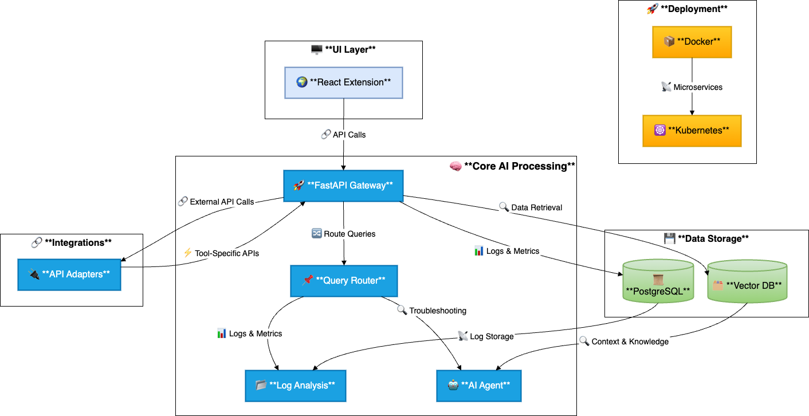

# FaultMaven

## 🚀 Introduction
FaultMaven is an **AI-powered troubleshooting assistant** designed for **Engineers, SREs, and DevOps professionals**. It operates as a **browser-integrated companion**, dynamically analyzing logs, incident reports, and system documentation to provide **real-time insights and guided troubleshooting**.

By leveraging AI-driven analysis and historical context, FaultMaven **reduces incident resolution time**, minimizes **manual effort**, and enhances **reliability engineering workflows**.

---

## ✨ Key Features
✔ **AI-Driven Root Cause Analysis** – Identifies patterns, anomalies, and dependencies in logs and system metrics.  
✔ **Real-Time Log Parsing & Error Detection** – Extracts insights from structured/unstructured logs instantly.  
✔ **Guided Troubleshooting Workflow** – Suggests next steps based on **historical data and best practices**.  
✔ **Seamless Observability Integration** – Connects with tools like **Splunk, Datadog, and Prometheus**.  
✔ **Interactive AI-Powered Assistant** – Provides **context-aware** recommendations and diagnostic insights.  

---

## 📦 Installation & Setup

### ✅ Prerequisites
Ensure you have the following installed before setting up FaultMaven:
- Python **3.10+**
- Docker & Kubernetes (for deployment)
- Git (for version control)

### 🔧 Setup Instructions
Clone the repository and install dependencies:
```bash
git clone https://github.com/FaultMaven/FaultMaven.git
cd FaultMaven
python -m venv venv
source venv/bin/activate  # For Windows use `venv\Scripts\activate`
pip install -r requirements.txt
```

### ▶️ Running the Application
Run the application locally:
```bash
python app/main.py
```

Run with Docker:
```bash
docker build -t faultmaven .
docker run -p 8080:8080 faultmaven
```

---

## 🛠 Development Guide
### 💡 Contributing
We welcome contributions! To get started:
1. **Fork** the repository.
2. **Create a feature branch**:  
   ```bash
   git checkout -b feature-new-module
   ```
3. **Commit & push** your changes:
   ```bash
   git commit -m "Added new feature"
   git push origin feature-new-module
   ```
4. **Submit a Pull Request** for review.

### 📂 Code Structure
The project follows a **modular architecture**:
- **`app/agents/`** – AI agents for troubleshooting & log analysis.
- **`app/api.py`** – API endpoints powered by **FastAPI**.
- **`app/data_manager.py`** – Handles data retrieval and processing.
- **`app/logger.py`** – Centralized logging module.
- **`tests/`** – Unit and integration test suite.

### 🧪 Running Tests
Run unit tests using:
```bash
pytest tests/
```

---

## 🏗 Architecture Overview
FaultMaven is designed with a **scalable, containerized microservices architecture**:

### 🎯 Core Components
- **AI Agents** – Perform log analysis, context retrieval, and guided troubleshooting.
- **Backend Services** – API gateway, data pipeline, and observability integrations.
- **Browser Extension UI** – User interface for interacting with FaultMaven's insights.
- **Storage** – PostgreSQL (for structured data), VectorDB (for historical context).

### 🏢 System Architecture Diagram


For more details, see the [Architecture Documentation](docs/architecture.md).

---

## 📜 License
This project is licensed under the **Apache 2.0 License** – see the [LICENSE](LICENSE) file for details.

---

## 🔮 Roadmap
✅ **MVP Release** – Core AI troubleshooting & log analysis  
🚀 **Multi-Cloud Integration** – AWS, GCP, Azure support  
🛡 **Enterprise Features** – Enhanced security & RBAC  
🧠 **Advanced AI** – Context-aware troubleshooting improvements  

Stay updated on our progress via the [Roadmap](docs/roadmap.md).

---

## 📬 Contact
For inquiries, reach out via:  
📧 [sterlanyu@gmail.com](mailto:sterlanyu@gmail.com)
