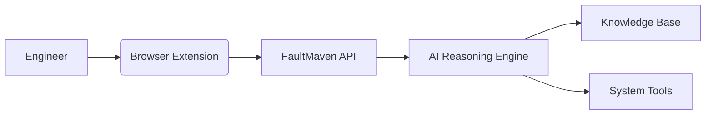
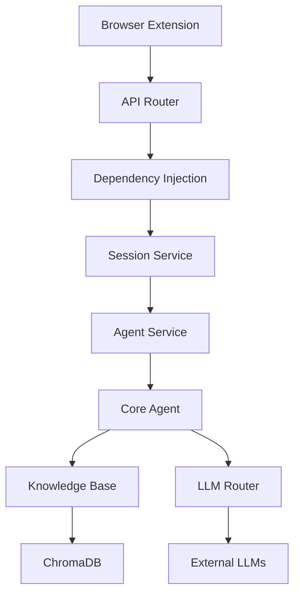

# FaultMaven
[](https://opensource.org/licenses/Apache-2.0)
[](https://www.python.org/downloads/)
[](https://docs.docker.com/)
[](https://fastapi.tiangolo.com/)
[](https://github.com/FaultMaven/faultmaven)
[](https://github.com/FaultMaven/faultmaven)

**AI-Powered Troubleshooting Copilot for SRE and DevOps Teams**

## 🚀 Introduction

FaultMaven is an open-source AI assistant designed to help engineers diagnose and resolve complex system issues. It serves as the intelligent backend that powers browser-based troubleshooting workflows, combining structured reasoning with centralized knowledge management.



## ✨ Core Components

### 1. FaultMaven API Server (This Repository)
- **AI Reasoning Engine**: LangGraph-based agent with SRE troubleshooting doctrine
- **Knowledge Management**: RAG-powered document processing
- **Data Processing**: Log/metrics analysis pipelines
- **Security**: PII redaction and access controls

### 2. [FaultMaven Copilot](https://github.com/FaultMaven/faultmaven-copilot)
- Browser extension UI for real-time troubleshooting
- Side panel interface for evidence submission
- Interactive chat experience

## 🧠 Key Features

| Feature | Description | Technology |
|---------|-------------|------------|
| **Agentic Troubleshooting** | Five-phase SRE doctrine for issue investigation | LangGraph, LLMs |
| **Knowledge Base (RAG)** | Centralized repository for runbooks and docs | ChromaDB, BGE-M3 |
| **Privacy-First Design** | Sensitive data redaction before processing | Presidio, Custom regex |
| **Extensible Tools** | Pluggable tool system for integrations | LangChain Tools |
| **Context-Aware Analysis** | Intelligent evidence processing | Scikit-learn, Pandas |
| **Observability** | LLM tracing and performance monitoring | Opik, Prometheus |

## 🚀 Quick Start

### Prerequisites
- [Docker](https://www.docker.com/products/docker-desktop/)
- [Python 3.11+](https://www.python.org/downloads/)
- Clone both repositories:
  ```bash
  git clone https://github.com/FaultMaven/faultmaven.git
  git clone https://github.com/FaultMaven/faultmaven-copilot.git
  ```

### Local Setup with Docker
1. Configure environment variables:
   ```bash
   cp .env.example .env
   # Add your API keys to .env
   ```

2. Start the stack:
   ```bash
   docker-compose up --build -d
   ```

3. Verify services:
   ```bash
   docker ps --format "table {{.Names}}\t{{.Status}}\t{{.Ports}}"
   ```
   ```
   NAMES               STATUS              PORTS
   faultmaven-backend  Up 5 minutes        0.0.0.0:8000->8000/tcp
   chromadb            Up 5 minutes        8000/tcp
   redis               Up 5 minutes        6379/tcp
   ```

4. Connect the frontend:
   ```bash
   # In faultmaven-copilot directory
   echo "VITE_API_BASE_URL=http://localhost:8000" > .env.local
   npm install
   npm run dev
   ```

### Local Development Setup

For local development without Docker:

1. Setup Python environment:
   ```bash
   python -m venv .venv
   source .venv/bin/activate
   pip install -r requirements.txt
   ```

2. Configure environment:
   ```bash
   cp .env.example .env
   # Add your API keys to .env
   ```

3. Start FaultMaven:
   ```bash
   # Standard startup
   ./run_faultmaven.sh
   
   # Or development mode (full transparency, all logs)
   ./run_faultmaven_dev.sh
   ```

## 🧪 Testing

Run the test suite with pytest:

```bash
# Unit tests
pytest -m "unit"

# Integration tests (requires Docker)
pytest -m "integration"

# Full test suite
pytest --cov=faultmaven tests/
```

## 🏗️ Architecture Overview

FaultMaven follows a modern, service-oriented architecture with clear separation of concerns and dependency injection. The system is designed for scalability, maintainability, and extensibility.

### Core Architecture Layers

```
┌─────────────────────────────────────────────────────────────┐
│                        API Layer                             │
│  (FastAPI Routers, Dependencies, Request/Response Models)    │
├─────────────────────────────────────────────────────────────┤
│                      Service Layer                           │
│  (Business Logic, Orchestration, Domain Operations)          │
├─────────────────────────────────────────────────────────────┤
│                    Core Components                           │
│  (Agent, Data Processing, Knowledge Base)                    │
├─────────────────────────────────────────────────────────────┤
│                   Infrastructure Layer                       │
│  (LLM Router, Redis, ChromaDB, Security, Observability)      │
└─────────────────────────────────────────────────────────────┘
```

### Key Components

#### 1. **API Layer** (`api/v1/`)
- RESTful endpoints with versioning support
- Request validation and response formatting
- Dependency injection for services
- Middleware for authentication and rate limiting

#### 2. **Service Layer** (`services/`)
- **AgentService**: Orchestrates troubleshooting workflows
- **DataService**: Manages data ingestion and processing
- **KnowledgeService**: Handles knowledge base operations
- **SessionService**: Provides session lifecycle management

#### 3. **Core Domain** (`core/`)
- **Agent**: LangGraph-based troubleshooting engine with 5-phase doctrine
- **Processing**: Log analysis and data classification
- **Knowledge**: Document ingestion and RAG operations

#### 4. **Infrastructure** (`infrastructure/`)
- **LLM**: Multi-provider routing with fallback
- **Persistence**: Redis sessions and ChromaDB vectors
- **Security**: PII redaction and data sanitization
- **Observability**: Opik tracing and metrics

### Data Flow Example



For detailed architecture documentation, see:
- [Current Architecture](docs/architecture/current-architecture.md)
- [Service Patterns](docs/architecture/service-patterns.md)
- [Migration Guide](docs/migration/import-migration-guide.md)

## 🛠️ Development

### Environment Setup
1. Create virtual environment:
   ```bash
   python -m venv .venv
   source .venv/bin/activate
   ```

2. Install dependencies:
   ```bash
   pip install -r requirements.txt
   pip install -r requirements-test.txt
   python -m spacy download en_core_web_lg
   ```

3. Configure pre-commit hooks:
   ```bash
   pre-commit install
   ```

### Code Structure
```
faultmaven/
├── api/v1/              # Versioned API endpoints
├── core/                # Core business logic
│   ├── agent/           # AI reasoning engine
│   ├── knowledge/       # Knowledge management
│   └── processing/      # Data analysis
├── infrastructure/      # External integrations
│   ├── llm/            # LLM providers
│   ├── persistence/    # Data storage
│   ├── security/       # Privacy controls
│   └── observability/  # Monitoring
├── services/           # Service layer
├── models/             # Data models
├── tools/              # Agent tools
├── container.py        # Dependency injection
└── main.py             # FastAPI application
```

## ⚙️ Configuration

### LLM Provider Setup

FaultMaven supports multiple LLM providers with automatic fallback:

```env
# Primary provider (options: fireworks, openai, local, gemini, huggingface, openrouter, anthropic)
CHAT_PROVIDER="fireworks"

# Provider API keys
FIREWORKS_API_KEY="your-fireworks-api-key"
OPENAI_API_KEY="your-openai-api-key"
```

For detailed configuration and adding new providers, see: [How to Add Providers](docs/how-to-add-providers.md)

### Environment Variables

Copy `.env.example` to `.env` and configure:
- **Required**: At least one LLM provider API key
- **Optional**: Observability, web search, local model servers

### Observability Setup

For **team Opik server at opik.faultmaven.local** (default configuration in `.env`):
```bash
# Ensure hostname resolves: echo "192.168.0.111 opik.faultmaven.local" >> /etc/hosts
./run_faultmaven.sh
```

For **other Opik instances** (e.g., different environment):
```bash
# Set up custom Opik configuration (one-time setup)
cp scripts/config/opik_remote.sh.example scripts/config/opik_custom.sh
# Edit scripts/config/opik_custom.sh with your Opik server details

# Use custom Opik server
source scripts/config/opik_custom.sh
./run_faultmaven.sh
```

**Accessing Opik UI:**
- Team Opik Dashboard: `http://opik.faultmaven.local:30080`
- View traces, performance metrics, and LLM analytics

## 📜 License

Apache 2.0 - See [LICENSE](LICENSE) for details.

## 🤝 Contributing

We welcome contributions! Please see our [Contribution Guidelines](CONTRIBUTING.md) for details.

## 📬 Contact

For inquiries: [support@faultmaven.ai](mailto:support@faultmaven.ai)  
Join our [Discord Community](https://discord.com/faultmaven) for real-time discussion.