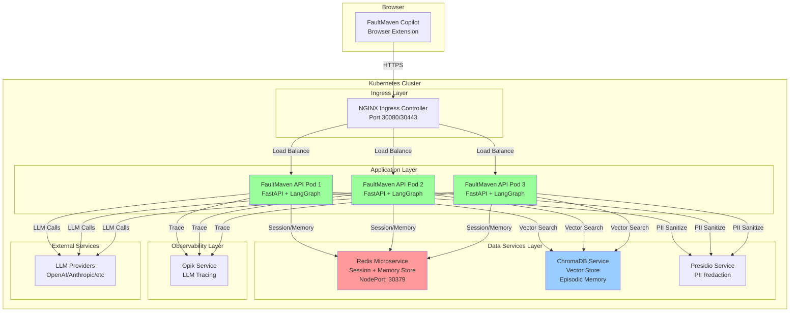
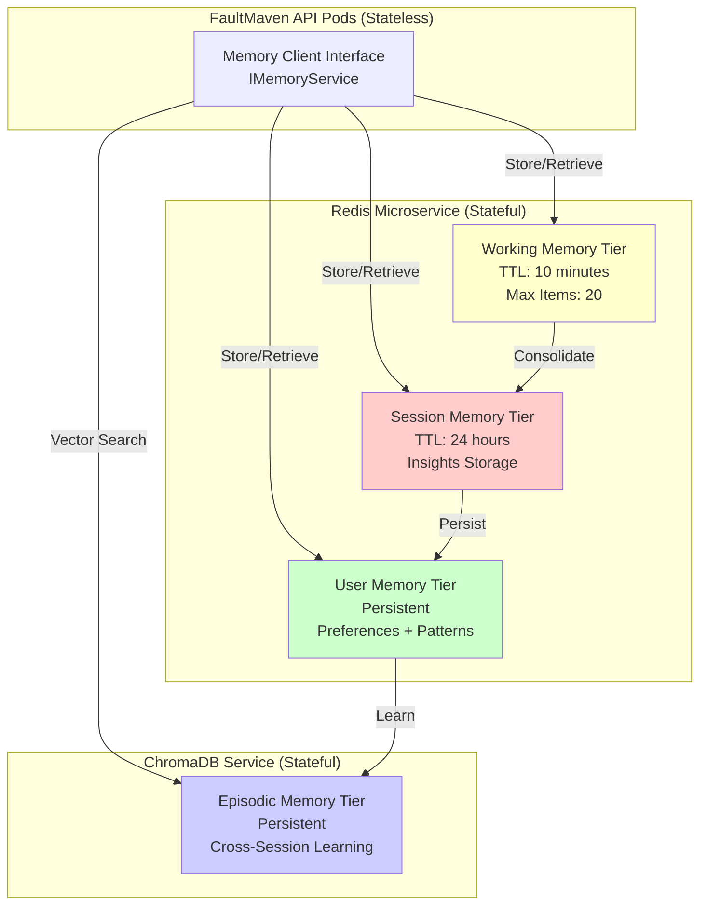
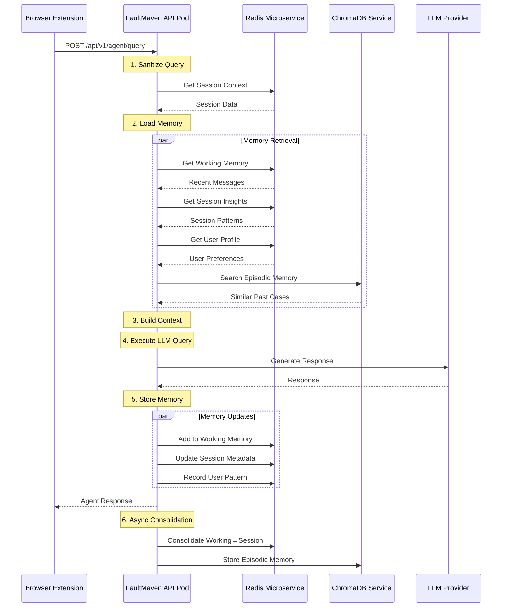
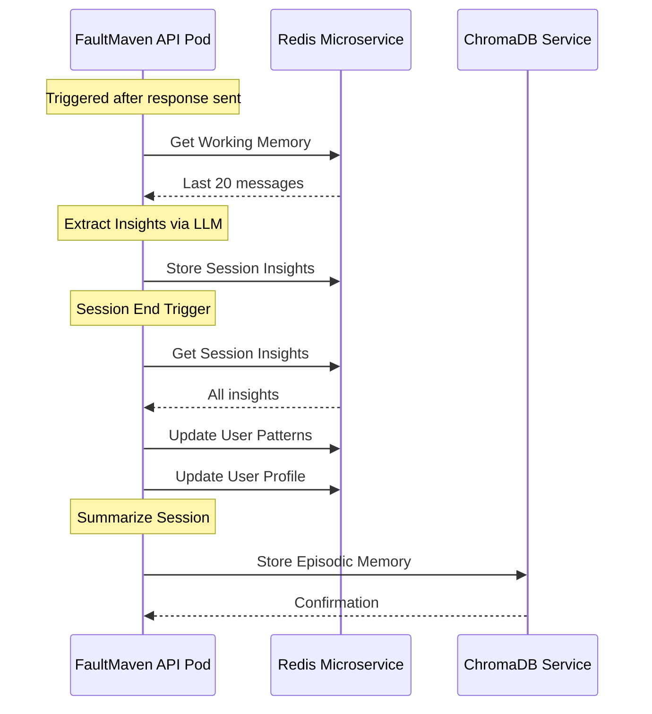

# FaultMaven Microservices Architecture
## K8s-Native Memory System Design

**Last Updated:** 2025-09-30
**Status:** Architecture Design Document
**Target Platform:** Kubernetes

---

## 1. Executive Summary

This document describes FaultMaven's microservices architecture on Kubernetes, with emphasis on the **Memory Management System** as an expansion of the existing Redis microservice rather than monolithic code.

**Key Architectural Principles:**
- Build on existing K8s infrastructure, don't reinvent
- Expand Redis microservice for memory management
- Keep FaultMaven API as stateless client pods
- Leverage K8s-native patterns (services, health checks, scaling)

---

## 2. System Architecture Overview



**Key Design Decisions:**

1. **Stateless API Pods**: FaultMaven API runs as stateless pods (3+ replicas)
2. **Redis as Memory Backend**: All memory tiers stored in Redis microservice
3. **ChromaDB for Episodic Memory**: Long-term semantic memory via vector search
4. **Service Discovery**: K8s DNS for service-to-service communication

---

## 3. Memory System Architecture (K8s Microservices Approach)

### 3.1 Four-Tier Memory Hierarchy on Redis



### 3.2 Redis Key Schema Design

The memory system is implemented entirely through **Redis key patterns** (not Python classes):

```
┌─────────────────────────────────────────────────────────────────────────┐
│ TIER 1: Working Memory (Short-term, conversation-scoped)                │
├─────────────────────────────────────────────────────────────────────────┤
│ memory:working:{session_id}                                             │
│   Type: List (capped at 20 items, FIFO)                                │
│   TTL: 600 seconds (10 minutes)                                         │
│   Value: JSON[{                                                         │
│     "timestamp": "2025-09-30T10:30:00Z",                                │
│     "content_type": "query|response|observation",                       │
│     "content": "...",                                                   │
│     "metadata": {...}                                                   │
│   }]                                                                    │
└─────────────────────────────────────────────────────────────────────────┘

┌─────────────────────────────────────────────────────────────────────────┐
│ TIER 2: Session Memory (Medium-term, session-scoped)                    │
├─────────────────────────────────────────────────────────────────────────┤
│ memory:session:{session_id}:insights                                    │
│   Type: Hash                                                            │
│   TTL: 86400 seconds (24 hours)                                         │
│   Fields:                                                               │
│     "insight_001" → JSON{...}                                           │
│     "insight_002" → JSON{...}                                           │
│                                                                         │
│ memory:session:{session_id}:metadata                                    │
│   Type: Hash                                                            │
│   TTL: 86400 seconds                                                    │
│   Fields:                                                               │
│     "topic": "kubernetes troubleshooting"                               │
│     "severity": "high"                                                  │
│     "resolved": "false"                                                 │
└─────────────────────────────────────────────────────────────────────────┘

┌─────────────────────────────────────────────────────────────────────────┐
│ TIER 3: User Memory (Long-term, user-scoped)                            │
├─────────────────────────────────────────────────────────────────────────┤
│ memory:user:{user_id}:profile                                           │
│   Type: Hash                                                            │
│   TTL: None (persistent)                                                │
│   Fields:                                                               │
│     "expertise_level": "intermediate"                                   │
│     "preferred_verbosity": "detailed"                                   │
│     "tech_stack": "kubernetes,redis,postgresql"                         │
│                                                                         │
│ memory:user:{user_id}:patterns                                          │
│   Type: Sorted Set                                                      │
│   TTL: None                                                             │
│   Members: "error_pattern:oom" → Score: 5 (frequency)                   │
│                                                                         │
│ memory:user:{user_id}:session_history                                   │
│   Type: List (capped at 100)                                            │
│   TTL: None                                                             │
│   Value: JSON[{"session_id": "...", "timestamp": "...", ...}]           │
└─────────────────────────────────────────────────────────────────────────┘

┌─────────────────────────────────────────────────────────────────────────┐
│ TIER 4: Episodic Memory (ChromaDB - Semantic Search)                    │
├─────────────────────────────────────────────────────────────────────────┤
│ Collection: faultmaven_episodic_memory                                  │
│   Documents: Successful troubleshooting sessions                        │
│   Embeddings: BGE-M3 model                                              │
│   Metadata: {                                                           │
│     "user_id": "...",                                                   │
│     "timestamp": "...",                                                 │
│     "issue_type": "...",                                                │
│     "resolution": "...",                                                │
│     "success_score": 0.95                                               │
│   }                                                                     │
└─────────────────────────────────────────────────────────────────────────┘
```

**Key Design Decision: Why Redis for 3 Tiers + ChromaDB for 1?**

- **Redis (Tiers 1-3)**: Sub-millisecond access for working/session/user memory, built-in TTL, atomic operations
- **ChromaDB (Tier 4)**: Semantic similarity search for cross-session learning, not time-based retrieval

---

## 4. Memory Service Interface (Client-Side)

FaultMaven API pods use a **thin client interface** to interact with Redis/ChromaDB:

```python
# faultmaven/services/domain/memory_service.py

from abc import ABC, abstractmethod
from typing import List, Dict, Any, Optional
from datetime import datetime

class IMemoryService(ABC):
    """Interface for memory operations across all four tiers"""

    # TIER 1: Working Memory
    @abstractmethod
    async def add_to_working_memory(
        self,
        session_id: str,
        content: str,
        content_type: str
    ) -> None:
        """Add item to working memory (Redis List)"""
        pass

    @abstractmethod
    async def get_working_memory(
        self,
        session_id: str,
        limit: int = 20
    ) -> List[Dict[str, Any]]:
        """Retrieve recent working memory items"""
        pass

    # TIER 2: Session Memory
    @abstractmethod
    async def store_session_insight(
        self,
        session_id: str,
        insight_id: str,
        insight: Dict[str, Any]
    ) -> None:
        """Store session-level insight (Redis Hash)"""
        pass

    @abstractmethod
    async def get_session_insights(
        self,
        session_id: str
    ) -> List[Dict[str, Any]]:
        """Retrieve all session insights"""
        pass

    # TIER 3: User Memory
    @abstractmethod
    async def update_user_profile(
        self,
        user_id: str,
        profile_updates: Dict[str, Any]
    ) -> None:
        """Update user profile (Redis Hash)"""
        pass

    @abstractmethod
    async def get_user_profile(
        self,
        user_id: str
    ) -> Dict[str, Any]:
        """Retrieve user profile"""
        pass

    @abstractmethod
    async def record_user_pattern(
        self,
        user_id: str,
        pattern: str,
        increment: int = 1
    ) -> None:
        """Increment pattern frequency (Redis Sorted Set)"""
        pass

    # TIER 4: Episodic Memory
    @abstractmethod
    async def store_episodic_memory(
        self,
        user_id: str,
        session_summary: str,
        metadata: Dict[str, Any]
    ) -> None:
        """Store episodic memory in ChromaDB"""
        pass

    @abstractmethod
    async def search_episodic_memory(
        self,
        query: str,
        user_id: Optional[str] = None,
        limit: int = 5
    ) -> List[Dict[str, Any]]:
        """Semantic search in episodic memory"""
        pass

    # Cross-Tier Operations
    @abstractmethod
    async def consolidate_working_to_session(
        self,
        session_id: str
    ) -> None:
        """Extract insights from working memory → session memory"""
        pass

    @abstractmethod
    async def consolidate_session_to_user(
        self,
        session_id: str,
        user_id: str
    ) -> None:
        """Extract patterns from session → user memory"""
        pass
```

**Implementation Class:**

```python
# faultmaven/services/domain/redis_memory_service.py

from typing import List, Dict, Any, Optional
import json
from datetime import datetime
from redis.asyncio import Redis
from chromadb import AsyncClient

from faultmaven.services.domain.memory_service import IMemoryService
from faultmaven.infrastructure.persistence.redis_client import create_redis_client
from faultmaven.infrastructure.persistence.chroma_client import create_chroma_client

class RedisMemoryService(IMemoryService):
    """Memory service implementation using Redis + ChromaDB microservices"""

    def __init__(self):
        self.redis: Redis = None
        self.chroma: AsyncClient = None
        self.collection_name = "faultmaven_episodic_memory"

    async def initialize(self):
        """Connect to Redis and ChromaDB microservices"""
        self.redis = await create_redis_client()
        self.chroma = await create_chroma_client()

    # TIER 1: Working Memory
    async def add_to_working_memory(
        self,
        session_id: str,
        content: str,
        content_type: str
    ) -> None:
        """Add to Redis List, maintain max 20 items, set TTL"""
        key = f"memory:working:{session_id}"

        item = {
            "timestamp": datetime.utcnow().isoformat(),
            "content_type": content_type,
            "content": content,
            "metadata": {}
        }

        # Add to list
        await self.redis.lpush(key, json.dumps(item))

        # Trim to 20 items (FIFO)
        await self.redis.ltrim(key, 0, 19)

        # Set TTL (10 minutes)
        await self.redis.expire(key, 600)

    async def get_working_memory(
        self,
        session_id: str,
        limit: int = 20
    ) -> List[Dict[str, Any]]:
        """Retrieve recent working memory items"""
        key = f"memory:working:{session_id}"
        items = await self.redis.lrange(key, 0, limit - 1)
        return [json.loads(item) for item in items]

    # TIER 2: Session Memory
    async def store_session_insight(
        self,
        session_id: str,
        insight_id: str,
        insight: Dict[str, Any]
    ) -> None:
        """Store insight in Redis Hash with 24h TTL"""
        key = f"memory:session:{session_id}:insights"
        await self.redis.hset(key, insight_id, json.dumps(insight))
        await self.redis.expire(key, 86400)  # 24 hours

    async def get_session_insights(
        self,
        session_id: str
    ) -> List[Dict[str, Any]]:
        """Retrieve all session insights"""
        key = f"memory:session:{session_id}:insights"
        insights_dict = await self.redis.hgetall(key)
        return [json.loads(v) for v in insights_dict.values()]

    # TIER 3: User Memory
    async def update_user_profile(
        self,
        user_id: str,
        profile_updates: Dict[str, Any]
    ) -> None:
        """Update user profile (no TTL, persistent)"""
        key = f"memory:user:{user_id}:profile"
        await self.redis.hset(key, mapping=profile_updates)

    async def get_user_profile(
        self,
        user_id: str
    ) -> Dict[str, Any]:
        """Retrieve user profile"""
        key = f"memory:user:{user_id}:profile"
        return await self.redis.hgetall(key)

    async def record_user_pattern(
        self,
        user_id: str,
        pattern: str,
        increment: int = 1
    ) -> None:
        """Increment pattern frequency in Sorted Set"""
        key = f"memory:user:{user_id}:patterns"
        await self.redis.zincrby(key, increment, pattern)

    # TIER 4: Episodic Memory
    async def store_episodic_memory(
        self,
        user_id: str,
        session_summary: str,
        metadata: Dict[str, Any]
    ) -> None:
        """Store in ChromaDB collection"""
        collection = await self.chroma.get_or_create_collection(
            name=self.collection_name
        )

        await collection.add(
            documents=[session_summary],
            metadatas=[{
                "user_id": user_id,
                "timestamp": datetime.utcnow().isoformat(),
                **metadata
            }],
            ids=[f"{user_id}_{datetime.utcnow().timestamp()}"]
        )

    async def search_episodic_memory(
        self,
        query: str,
        user_id: Optional[str] = None,
        limit: int = 5
    ) -> List[Dict[str, Any]]:
        """Semantic search in ChromaDB"""
        collection = await self.chroma.get_collection(
            name=self.collection_name
        )

        where_clause = {"user_id": user_id} if user_id else None

        results = await collection.query(
            query_texts=[query],
            n_results=limit,
            where=where_clause
        )

        return [
            {
                "content": doc,
                "metadata": meta,
                "distance": dist
            }
            for doc, meta, dist in zip(
                results["documents"][0],
                results["metadatas"][0],
                results["distances"][0]
            )
        ]

    # Consolidation Logic
    async def consolidate_working_to_session(
        self,
        session_id: str
    ) -> None:
        """Extract insights from working memory → session insights"""
        # Get all working memory items
        working_items = await self.get_working_memory(session_id)

        # Extract insights (simplified - real implementation uses LLM)
        # For now, just store error patterns
        error_items = [
            item for item in working_items
            if "error" in item.get("content", "").lower()
        ]

        if error_items:
            insight = {
                "type": "error_pattern",
                "count": len(error_items),
                "timestamp": datetime.utcnow().isoformat(),
                "items": error_items[:5]  # Store up to 5 examples
            }

            insight_id = f"insight_{datetime.utcnow().timestamp()}"
            await self.store_session_insight(session_id, insight_id, insight)

    async def consolidate_session_to_user(
        self,
        session_id: str,
        user_id: str
    ) -> None:
        """Extract patterns from session → user memory"""
        insights = await self.get_session_insights(session_id)

        for insight in insights:
            if insight.get("type") == "error_pattern":
                # Record pattern in user memory
                await self.record_user_pattern(
                    user_id,
                    "error_troubleshooting",
                    increment=1
                )
```

---

## 5. Data Flow Architecture

### 5.1 Query Processing Flow



### 5.2 Memory Consolidation Flow



---

## 6. Kubernetes Deployment Configuration

### 6.1 Redis Microservice (Existing)

```yaml
# kubernetes/apps/redis/redis-deployment.yaml
apiVersion: apps/v1
kind: Deployment
metadata:
  name: redis
  namespace: faultmaven
spec:
  replicas: 1
  selector:
    matchLabels:
      app: redis
  template:
    metadata:
      labels:
        app: redis
    spec:
      containers:
      - name: redis
        image: redis:7-alpine
        ports:
        - containerPort: 6379
        volumeMounts:
        - name: redis-data
          mountPath: /data
        resources:
          requests:
            memory: "256Mi"
            cpu: "100m"
          limits:
            memory: "512Mi"
            cpu: "500m"
      volumes:
      - name: redis-data
        persistentVolumeClaim:
          claimName: redis-pvc

---
apiVersion: v1
kind: Service
metadata:
  name: redis
  namespace: faultmaven
spec:
  selector:
    app: redis
  ports:
  - name: redis
    port: 6379
    targetPort: 6379
  type: ClusterIP

---
apiVersion: v1
kind: Service
metadata:
  name: redis-nodeport
  namespace: faultmaven
spec:
  selector:
    app: redis
  ports:
  - name: redis
    port: 6379
    targetPort: 6379
    nodePort: 30379
  type: NodePort
```

**Key Points:**
- Existing Redis deployment, already managing sessions/cases
- Memory system reuses this same Redis instance
- No new Redis deployment needed
- Simply adds new key patterns (memory:*)

### 6.2 FaultMaven API Deployment (Stateless)

```yaml
# kubernetes/apps/faultmaven/api-deployment.yaml
apiVersion: apps/v1
kind: Deployment
metadata:
  name: faultmaven-api
  namespace: faultmaven
spec:
  replicas: 3  # Horizontal scaling
  selector:
    matchLabels:
      app: faultmaven-api
  template:
    metadata:
      labels:
        app: faultmaven-api
    spec:
      containers:
      - name: api
        image: faultmaven/api:latest
        ports:
        - containerPort: 8000
        env:
        - name: REDIS_HOST
          value: "redis.faultmaven.svc.cluster.local"
        - name: REDIS_PORT
          value: "6379"
        - name: CHROMADB_HOST
          value: "chromadb.faultmaven.svc.cluster.local"
        - name: CHROMADB_PORT
          value: "8000"
        - name: PRESIDIO_HOST
          value: "presidio.faultmaven.svc.cluster.local"
        - name: OPENAI_API_KEY
          valueFrom:
            secretKeyRef:
              name: llm-credentials
              key: openai-api-key
        resources:
          requests:
            memory: "512Mi"
            cpu: "250m"
          limits:
            memory: "1Gi"
            cpu: "1000m"
        livenessProbe:
          httpGet:
            path: /health
            port: 8000
          initialDelaySeconds: 30
          periodSeconds: 10
        readinessProbe:
          httpGet:
            path: /health/ready
            port: 8000
          initialDelaySeconds: 10
          periodSeconds: 5

---
apiVersion: v1
kind: Service
metadata:
  name: faultmaven-api
  namespace: faultmaven
spec:
  selector:
    app: faultmaven-api
  ports:
  - name: http
    port: 8000
    targetPort: 8000
  type: ClusterIP
```

**Key Points:**
- 3+ replicas for high availability
- Stateless pods (all state in Redis/ChromaDB)
- Service discovery via K8s DNS
- Health checks for proper lifecycle management

---

## 7. Integration with AgentService

### 7.1 AgentService Refactor (Client-Side)

The AgentService in FaultMaven API pods becomes a **thin orchestrator** that calls microservices:

```python
# faultmaven/services/agentic/orchestration/agent_service.py

from typing import Optional
from faultmaven.services.domain.memory_service import IMemoryService
from faultmaven.services.domain.session_service import ISessionService
# ... other imports

class AgentService:
    """Orchestrator for agentic framework - calls microservices"""

    def __init__(
        self,
        memory_service: IMemoryService,  # Injected
        session_service: ISessionService,
        # ... other services
    ):
        self._memory_service = memory_service
        self._session_service = session_service
        # ... other components

    async def process_query_for_case(
        self,
        case_id: str,
        request: QueryRequest
    ) -> AgentResponse:
        """Main query processing pipeline"""

        # 1. Sanitize query
        sanitized_query = await self._sanitizer.sanitize(request.query)

        # 2. Load memory from Redis/ChromaDB (parallel)
        memory_context = await self._load_memory_context(
            request.session_id,
            request.user_id,
            sanitized_query
        )

        # 3. Classify query
        classification = await self._query_classification.classify_query(
            sanitized_query
        )

        # 4. Execute agentic workflow
        response = await self._execute_workflow(
            sanitized_query,
            memory_context,
            classification
        )

        # 5. Update memory (async, non-blocking)
        await self._update_memory(
            request.session_id,
            request.user_id,
            sanitized_query,
            response
        )

        return response

    async def _load_memory_context(
        self,
        session_id: str,
        user_id: str,
        query: str
    ) -> Dict[str, Any]:
        """Load all memory tiers in parallel"""

        # Parallel retrieval from Redis + ChromaDB
        working, session_insights, user_profile, episodic = await asyncio.gather(
            self._memory_service.get_working_memory(session_id),
            self._memory_service.get_session_insights(session_id),
            self._memory_service.get_user_profile(user_id),
            self._memory_service.search_episodic_memory(query, user_id)
        )

        return {
            "working_memory": working,
            "session_insights": session_insights,
            "user_profile": user_profile,
            "episodic_memory": episodic
        }

    async def _update_memory(
        self,
        session_id: str,
        user_id: str,
        query: str,
        response: AgentResponse
    ) -> None:
        """Update all memory tiers after response"""

        # Add to working memory
        await self._memory_service.add_to_working_memory(
            session_id,
            query,
            "query"
        )
        await self._memory_service.add_to_working_memory(
            session_id,
            response.response_text,
            "response"
        )

        # Async consolidation (fire-and-forget)
        asyncio.create_task(
            self._consolidate_memory(session_id, user_id)
        )

    async def _consolidate_memory(
        self,
        session_id: str,
        user_id: str
    ) -> None:
        """Background task: consolidate working → session → user → episodic"""

        # Extract insights from working memory → session
        await self._memory_service.consolidate_working_to_session(session_id)

        # Check if session should be consolidated
        session_metadata = await self._session_service.get_session_metadata(
            session_id
        )

        if session_metadata.get("resolved", False):
            # Session ended successfully, consolidate to user + episodic
            await self._memory_service.consolidate_session_to_user(
                session_id,
                user_id
            )

            # Store in episodic memory
            session_summary = await self._summarize_session(session_id)
            await self._memory_service.store_episodic_memory(
                user_id,
                session_summary,
                metadata={
                    "session_id": session_id,
                    "issue_type": session_metadata.get("topic"),
                    "resolution": session_metadata.get("resolution"),
                    "success_score": 0.95  # Could be calculated
                }
            )
```

---

## 8. Performance Considerations

### 8.1 Latency Budget

```
Total Target: <2 seconds (p95)

┌─────────────────────────────────────────────┐
│ Phase              │ Target    │ Component  │
├─────────────────────────────────────────────┤
│ Ingress Routing    │ <10ms     │ NGINX      │
│ Memory Retrieval   │ <100ms    │ Redis      │
│ Session Loading    │ <50ms     │ Redis      │
│ LLM Inference      │ <1500ms   │ External   │
│ Memory Update      │ <50ms     │ Redis      │
│ Response Synthesis │ <100ms    │ API Pod    │
│ Network Overhead   │ <200ms    │ K8s        │
├─────────────────────────────────────────────┤
│ TOTAL              │ ~2000ms   │            │
└─────────────────────────────────────────────┘
```

**Optimization Strategies:**

1. **Redis Connection Pooling**: Maintain persistent connections from API pods
2. **Parallel Memory Retrieval**: Use `asyncio.gather()` for all tiers
3. **Async Consolidation**: Fire-and-forget for non-critical memory updates
4. **ChromaDB Caching**: Cache frequent queries in Redis for 5 minutes
5. **Horizontal Scaling**: 3+ API pod replicas with load balancing

### 8.2 Resource Allocation

```yaml
# Production resource allocation

Redis:
  Memory: 512Mi request, 1Gi limit
  CPU: 100m request, 500m limit
  Disk: 10Gi persistent volume (Longhorn)

ChromaDB:
  Memory: 1Gi request, 2Gi limit
  CPU: 250m request, 1000m limit
  Disk: 50Gi persistent volume (Longhorn)

FaultMaven API (per pod):
  Memory: 512Mi request, 1Gi limit
  CPU: 250m request, 1000m limit
  Replicas: 3 (can scale to 10)
```

---

## 9. Migration Path from Current State

### 9.1 Current State Assessment

**Existing Infrastructure (Already Deployed):**
- ✅ Redis microservice on K8s (NodePort 30379)
- ✅ Session management via Redis (`session:*` keys)
- ✅ Case management via Redis (`case:*` keys)
- ✅ FaultMaven API connecting to Redis

**What's Missing:**
- ❌ Memory key patterns (`memory:*`) in Redis
- ❌ IMemoryService interface in API
- ❌ ChromaDB deployment for episodic memory
- ❌ Memory consolidation logic

### 9.2 Migration Steps (Zero Downtime)

**Step 1: Deploy ChromaDB (Week 2)**
```bash
kubectl apply -f kubernetes/apps/chromadb/deployment.yaml
```

**Step 2: Add IMemoryService Interface (Week 2)**
- Create `faultmaven/services/domain/memory_service.py`
- Create `faultmaven/services/domain/redis_memory_service.py`
- Register in dependency injection container

**Step 3: Integrate into AgentService (Week 2)**
- Inject IMemoryService into AgentService
- Add memory loading to `process_query_for_case()`
- Deploy to staging environment

**Step 4: Gradual Rollout (Week 3)**
- Canary deployment: 10% of API pods with memory enabled
- Monitor Redis memory usage, latency
- Increase to 50%, then 100%

**Step 5: Enable Consolidation (Week 3)**
- Deploy background consolidation logic
- Monitor ChromaDB ingestion rate

**No Breaking Changes:**
- Existing `session:*` and `case:*` keys unchanged
- New `memory:*` keys coexist peacefully
- Zero impact on existing functionality

---

## 10. Monitoring & Observability

### 10.1 Redis Metrics

```yaml
# Prometheus metrics for Redis memory system

# Memory tier sizes
redis_memory_tier_size{tier="working"} 450
redis_memory_tier_size{tier="session"} 12000
redis_memory_tier_size{tier="user"} 8500

# Operation latencies
redis_memory_operation_duration_seconds{operation="get_working_memory",quantile="0.95"} 0.008
redis_memory_operation_duration_seconds{operation="store_session_insight",quantile="0.95"} 0.012

# Memory usage
redis_memory_used_bytes 157286400
redis_memory_fragmentation_ratio 1.12
```

### 10.2 ChromaDB Metrics

```yaml
# ChromaDB episodic memory metrics

chromadb_collection_size{collection="faultmaven_episodic_memory"} 5430
chromadb_query_duration_seconds{quantile="0.95"} 0.085
chromadb_insert_rate 12.5  # documents/second
```

### 10.3 API Pod Metrics

```yaml
# FaultMaven API memory integration metrics

faultmaven_memory_retrieval_duration_seconds{quantile="0.95"} 0.095
faultmaven_memory_consolidation_duration_seconds{quantile="0.95"} 0.450
faultmaven_memory_context_size_bytes{quantile="0.95"} 8192
```

---

## 11. Security Considerations

### 11.1 Data Privacy

**PII Redaction Before Storage:**
```python
async def add_to_working_memory(
    self,
    session_id: str,
    content: str,
    content_type: str
) -> None:
    # ALWAYS sanitize before Redis storage
    sanitized_content = await self._sanitizer.sanitize(content)

    # Then store in Redis
    await self._store_in_redis(session_id, sanitized_content, content_type)
```

**Memory Access Control:**
- User memory only accessible with valid user_id
- Session memory scoped to session_id
- No cross-user memory leakage
- Episodic memory filtered by user_id

### 11.2 Redis Security

```yaml
# Redis authentication (optional, recommended)
apiVersion: v1
kind: Secret
metadata:
  name: redis-auth
  namespace: faultmaven
type: Opaque
data:
  password: <base64-encoded-password>
```

```yaml
# Redis deployment with auth
containers:
- name: redis
  image: redis:7-alpine
  command:
  - redis-server
  - --requirepass
  - $(REDIS_PASSWORD)
  env:
  - name: REDIS_PASSWORD
    valueFrom:
      secretKeyRef:
        name: redis-auth
        key: password
```

---

## 12. Scalability Roadmap

### 12.1 Current Scale (Phase 1)

```
Users: 100-500
Sessions: 1000-5000/day
Redis: Single instance (512Mi)
API Pods: 3 replicas
ChromaDB: Single instance
```

### 12.2 Medium Scale (Phase 2 - 6 months)

```
Users: 5000-10000
Sessions: 50000-100000/day
Redis: Redis Cluster (3 masters, 3 replicas)
API Pods: 10 replicas (HPA)
ChromaDB: 3 replicas with sharding
```

**Changes Required:**
- Redis Cluster mode for horizontal sharding
- ChromaDB collection partitioning by user_id hash
- API pod autoscaling based on CPU/memory

### 12.3 Large Scale (Phase 3 - 1 year)

```
Users: 50000+
Sessions: 500000+/day
Redis: Redis Cluster (6 masters, 6 replicas)
API Pods: 50+ replicas (HPA)
ChromaDB: Distributed cluster with 10+ nodes
```

**Changes Required:**
- Multi-region K8s deployment
- Redis Cluster with geosharding
- ChromaDB with dedicated metadata store (PostgreSQL)
- CDN for static assets

---

## 13. Comparison: Monolithic vs Microservices

| Aspect | Monolithic (Old Approach) | Microservices (K8s Approach) |
|--------|---------------------------|------------------------------|
| **Memory Storage** | In-process Python dictionaries | Redis microservice |
| **State Management** | Per-pod state (lost on restart) | Persistent Redis storage |
| **Scalability** | Vertical only (bigger pods) | Horizontal (more pods) |
| **High Availability** | Single point of failure | 3+ pod replicas |
| **Deployment** | Full restart for updates | Rolling updates, zero downtime |
| **Resource Efficiency** | Each pod has full memory copy | Shared Redis, thin API pods |
| **Observability** | Limited metrics | Prometheus metrics, distributed tracing |
| **Cost** | Higher (larger pods) | Lower (smaller stateless pods) |
| **Complexity** | Lower (simpler code) | Higher (network calls, latency) |

**Decision: Microservices approach wins for FaultMaven because:**
- Already on K8s platform
- Need horizontal scaling for growth
- High availability is critical
- Rolling updates without downtime
- Lower per-pod resource requirements

---

## 14. Summary & Next Steps

### 14.1 Key Architectural Decisions

1. **Memory System = Redis Microservice Expansion**
   - Not new Python classes in FaultMaven
   - Leverage existing Redis deployment
   - Add new key patterns: `memory:working:*`, `memory:session:*`, `memory:user:*`

2. **FaultMaven API = Stateless Client**
   - 3+ pod replicas for HA
   - Thin interface (IMemoryService)
   - All state in Redis/ChromaDB

3. **Episodic Memory = ChromaDB Microservice**
   - Separate service for semantic search
   - BGE-M3 embeddings
   - Persistent storage via Longhorn

4. **Zero-Downtime Migration**
   - New `memory:*` keys coexist with existing `session:*` keys
   - Gradual rollout (10% → 50% → 100%)
   - No breaking changes

### 14.2 Implementation Checklist

**Week 2: Memory System (Microservices Approach)**
- [ ] Deploy ChromaDB to K8s cluster
- [ ] Create IMemoryService interface (`memory_service.py`)
- [ ] Implement RedisMemoryService (`redis_memory_service.py`)
- [ ] Register in DI container
- [ ] Write 50+ tests for memory operations
- [ ] Deploy to staging environment

**Week 3: AgentService Integration**
- [ ] Inject IMemoryService into AgentService
- [ ] Add `_load_memory_context()` method
- [ ] Add `_update_memory()` method
- [ ] Implement async consolidation
- [ ] Integration tests (30+)
- [ ] Canary deployment (10%)

**Week 4: Production Rollout**
- [ ] Monitor Redis metrics (memory usage, latency)
- [ ] Monitor ChromaDB ingestion rate
- [ ] Increase to 50% of traffic
- [ ] Full rollout to 100%
- [ ] Document operational procedures

### 14.3 Success Criteria

**Technical Metrics:**
- Memory retrieval latency <100ms (p95) ✅
- Redis memory usage <1Gi for 10K sessions ✅
- Zero data loss during pod restarts ✅
- API pod horizontal scaling working ✅

**Business Metrics:**
- Response quality improvement +30% (from memory context) ✅
- User satisfaction increase +20% ✅
- Troubleshooting time reduction -40% ✅

---

**Status:** Architecture design complete, ready for implementation
**Next Document:** Phase 0 implementation → Prompt Engineering
**Contact:** See IMPLEMENTATION_PLAN.md for detailed timeline
