# FaultMaven System Architecture

## Comprehensive System Architecture Diagram

```mermaid
graph TB
    %% External Layer
    subgraph "External Clients"
        BE[Browser Extension<br/>Chrome/Firefox]
        WEB[Web Frontend<br/>Next.js]
        API_CLIENT[API Clients<br/>External Integrations]
    end

    %% API Layer
    subgraph "API Layer (FastAPI)"
        direction TB

        subgraph "API Gateway & Middleware"
            CORS[CORS Middleware]
            AUTH[Authentication]
            RATE[Rate Limiting]
            LOGGING[Request Logging]
            PERF[Performance Tracking]
            PROTECT[Protection Middleware]
        end

        subgraph "API Routes (/api/v1)"
            DATA_ROUTE[Data Ingestion<br/>/data/*]
            CASE_ROUTE[Case Management<br/>/case/*]
            KNOWLEDGE_ROUTE[Knowledge Base<br/>/knowledge/*]
            SESSION_ROUTE[Session Management<br/>/session/*]
            AUTH_ROUTE[Authentication<br/>/auth/*]
            JOB_ROUTE[Job Management<br/>/jobs/*]
            PROTECTION_ROUTE[Protection<br/>/protection/*]
        end
    end

    %% Service Layer - New Organization
    subgraph "Service Layer (Organized)"
        direction TB

        subgraph "Domain Services"
            CASE_SVC[Case Service<br/>Case Management]
            KNOWLEDGE_SVC[Knowledge Service<br/>KB Operations]
            PLANNING_SVC[Planning Service<br/>Task Planning]
            DATA_SVC[Data Service<br/>Data Processing]
            SESSION_SVC[Session Service<br/>State Management]
        end

        subgraph "Analytics Services"
            DASHBOARD_SVC[Dashboard Service<br/>Metrics & Analytics]
            CONFIDENCE_SVC[Confidence Service<br/>Result Scoring]
        end

        subgraph "Agentic Framework (7 Components)"
            direction TB

            subgraph "Orchestration"
                AGENT_SVC[Agent Service<br/>Main Orchestrator]
            end

            subgraph "Engines"
                CLASSIFICATION[Classification Engine<br/>Query Processing]
                WORKFLOW[Workflow Engine<br/>Business Logic]
                SYNTHESIZER[Response Synthesizer<br/>Result Formatting]
            end

            subgraph "Management"
                STATE_MGR[State Manager<br/>Agent Memory]
                TOOL_BROKER[Tool Broker<br/>Skill Orchestration]
            end

            subgraph "Safety"
                GUARDRAILS[Guardrails Layer<br/>Policy Enforcement]
                ERROR_MGR[Error Manager<br/>Fallback Handling]
            end
        end

        subgraph "Converters"
            CASE_CONV[Case Converter<br/>Data Transformation]
        end
    end

    %% Core Domain Layer
    subgraph "Core Domain Layer"
        direction TB

        subgraph "Agent Core"
            AGENT_CORE[Core Agent Logic<br/>LangGraph Integration]
            ORCHESTRATOR[Troubleshooting<br/>Orchestrator]
            SKILL_REG[Skill Registry<br/>Capability Management]
        end

        subgraph "Processing"
            CLASSIFIER[Data Classifier<br/>Content Analysis]
            LOG_ANALYZER[Log Analyzer<br/>Pattern Detection]
            PATTERN_LEARNER[Pattern Learner<br/>ML-based Learning]
        end

        subgraph "Knowledge Management"
            KNOWLEDGE_CORE[Knowledge Core<br/>Retrieval Logic]
            ADVANCED_RETRIEVAL[Advanced Retrieval<br/>RAG Implementation]
            INGESTION[Data Ingestion<br/>Content Processing]
        end

        subgraph "Confidence & Quality"
            CONFIDENCE_AGG[Confidence Aggregator<br/>Score Computation]
        end

        subgraph "Safety & Control"
            LOOP_GUARD[Loop Guard<br/>Infinite Loop Prevention]
        end
    end

    %% Infrastructure Layer
    subgraph "Infrastructure Layer"
        direction TB

        subgraph "LLM Providers"
            LLM_ROUTER[LLM Router<br/>Multi-Provider Routing]
            OPENAI[OpenAI<br/>GPT-4/3.5]
            ANTHROPIC[Anthropic<br/>Claude]
            FIREWORKS[Fireworks AI<br/>Local Models]
        end

        subgraph "Security & Protection"
            PII_SANITIZER[PII Redaction<br/>Presidio Integration]
            PROTECTION_COORD[Protection Coordinator<br/>Security Management]
            ANOMALY_DETECT[Anomaly Detection<br/>Threat Monitoring]
            CIRCUIT_BREAKER[Circuit Breaker<br/>Fault Tolerance]
            RATE_LIMITER[Rate Limiting<br/>Resource Protection]
        end

        subgraph "Persistence Layer"
            REDIS[Redis<br/>Session Storage]
            CHROMADB[ChromaDB<br/>Vector Database]
            LONGHORN[Longhorn Storage<br/>Persistent Volumes]
        end

        subgraph "Monitoring & Observability"
            OPIK[Opik Tracing<br/>LLM Observability]
            APM[APM Integration<br/>Performance Metrics]
            ALERTING[Alert Manager<br/>Health Monitoring]
            METRICS[Metrics Collector<br/>System Telemetry]
        end

        subgraph "Job Management"
            JOB_SVC_INFRA[Job Service<br/>Background Processing]
            JOB_SCHEDULER[Job Scheduler<br/>Task Queue]
        end

        subgraph "Caching"
            CACHE_LAYER[Cache Layer<br/>Response Caching]
            MODEL_CACHE[Model Cache<br/>ML Model Storage]
        end
    end

    %% Agent Tools
    subgraph "Agent Tools"
        KNOWLEDGE_TOOL[Knowledge Base Tool<br/>Vector Search]
        WEB_SEARCH[Web Search Tool<br/>External Data]
        ENHANCED_KB[Enhanced KB Tool<br/>Advanced Retrieval]
        TOOL_REGISTRY[Tool Registry<br/>Dynamic Registration]
    end

    %% Data Models
    subgraph "Data Models & Interfaces"
        INTERFACES[Core Interfaces<br/>ILLMProvider, ITracer, etc.]
        AGENTIC_MODELS[Agentic Models<br/>State, Execution, etc.]
        DOMAIN_MODELS[Domain Models<br/>Case, Query, Response]
        MICROSERVICE_CONTRACTS[Microservice Contracts<br/>API Schemas]
    end

    %% Dependency Injection
    subgraph "Dependency Management"
        DI_CONTAINER[DI Container<br/>Centralized Dependencies]
        SETTINGS[Settings Manager<br/>Configuration]
    end

    %% Data Flow Connections
    BE --> API_CLIENT
    WEB --> API_CLIENT
    API_CLIENT --> CORS

    CORS --> AUTH
    AUTH --> RATE
    RATE --> LOGGING
    LOGGING --> PERF
    PERF --> PROTECT

    PROTECT --> DATA_ROUTE
    PROTECT --> CASE_ROUTE
    PROTECT --> KNOWLEDGE_ROUTE
    PROTECT --> SESSION_ROUTE
    PROTECT --> AUTH_ROUTE
    PROTECT --> JOB_ROUTE
    PROTECT --> PROTECTION_ROUTE

    %% Route to Service Connections
    DATA_ROUTE --> DATA_SVC
    CASE_ROUTE --> CASE_SVC
    KNOWLEDGE_ROUTE --> KNOWLEDGE_SVC
    SESSION_ROUTE --> SESSION_SVC
    JOB_ROUTE --> JOB_SVC_INFRA

    %% Agentic Framework Flow
    CASE_SVC --> AGENT_SVC
    KNOWLEDGE_SVC --> AGENT_SVC
    DATA_SVC --> AGENT_SVC

    AGENT_SVC --> CLASSIFICATION
    CLASSIFICATION --> WORKFLOW
    WORKFLOW --> TOOL_BROKER
    TOOL_BROKER --> STATE_MGR
    STATE_MGR --> SYNTHESIZER

    %% Safety Layer
    GUARDRAILS --> AGENT_SVC
    ERROR_MGR --> AGENT_SVC

    %% Core Integration
    AGENT_SVC --> AGENT_CORE
    AGENT_CORE --> ORCHESTRATOR
    ORCHESTRATOR --> SKILL_REG

    %% Tool Integration
    TOOL_BROKER --> KNOWLEDGE_TOOL
    TOOL_BROKER --> WEB_SEARCH
    TOOL_BROKER --> ENHANCED_KB

    %% Infrastructure Dependencies
    AGENT_CORE --> LLM_ROUTER
    LLM_ROUTER --> OPENAI
    LLM_ROUTER --> ANTHROPIC
    LLM_ROUTER --> FIREWORKS

    KNOWLEDGE_TOOL --> CHROMADB
    SESSION_SVC --> REDIS
    AGENT_SVC --> PII_SANITIZER

    %% Monitoring Integration
    AGENT_SVC --> OPIK
    API_GATEWAY --> METRICS
    PERF --> APM

    %% DI Container Dependencies
    DI_CONTAINER --> AGENT_SVC
    DI_CONTAINER --> LLM_ROUTER
    DI_CONTAINER --> PII_SANITIZER
    DI_CONTAINER --> REDIS
    DI_CONTAINER --> CHROMADB

    SETTINGS --> DI_CONTAINER

    %% Styling
    classDef external fill:#e1f5fe
    classDef api fill:#f3e5f5
    classDef service fill:#e8f5e8
    classDef agentic fill:#fff3e0
    classDef core fill:#fce4ec
    classDef infrastructure fill:#f1f8e9
    classDef tools fill:#e0f2f1
    classDef models fill:#fafafa

    class BE,WEB,API_CLIENT external
    class CORS,AUTH,RATE,LOGGING,PERF,PROTECT,DATA_ROUTE,CASE_ROUTE,KNOWLEDGE_ROUTE,SESSION_ROUTE,AUTH_ROUTE,JOB_ROUTE,PROTECTION_ROUTE api
    class CASE_SVC,KNOWLEDGE_SVC,PLANNING_SVC,DATA_SVC,SESSION_SVC,DASHBOARD_SVC,CONFIDENCE_SVC,CASE_CONV service
    class AGENT_SVC,CLASSIFICATION,WORKFLOW,SYNTHESIZER,STATE_MGR,TOOL_BROKER,GUARDRAILS,ERROR_MGR agentic
    class AGENT_CORE,ORCHESTRATOR,SKILL_REG,CLASSIFIER,LOG_ANALYZER,PATTERN_LEARNER,KNOWLEDGE_CORE,ADVANCED_RETRIEVAL,INGESTION,CONFIDENCE_AGG,LOOP_GUARD core
    class LLM_ROUTER,OPENAI,ANTHROPIC,FIREWORKS,PII_SANITIZER,PROTECTION_COORD,ANOMALY_DETECT,CIRCUIT_BREAKER,RATE_LIMITER,REDIS,CHROMADB,LONGHORN,OPIK,APM,ALERTING,METRICS,JOB_SVC_INFRA,JOB_SCHEDULER,CACHE_LAYER,MODEL_CACHE infrastructure
    class KNOWLEDGE_TOOL,WEB_SEARCH,ENHANCED_KB,TOOL_REGISTRY tools
    class INTERFACES,AGENTIC_MODELS,DOMAIN_MODELS,MICROSERVICE_CONTRACTS,DI_CONTAINER,SETTINGS models
```

## Key Architectural Highlights

### 1. Layered Architecture

- **API Layer**: FastAPI with comprehensive middleware stack
- **Service Layer**: Organized into domain, analytics, and agentic services
- **Core Layer**: Specialized expertise and skill-specific processing (agent reasoning, knowledge processing, data analysis, orchestration)
- **Infrastructure Layer**: External integrations and system services

### 2. Agentic Framework (7 Components)

The core of FaultMaven's AI capabilities, implementing a plan-execute-observe-adapt cycle:

- **Orchestration**: Central agent service coordination
- **Engines**: Classification, workflow, and response processing
- **Management**: State management and tool orchestration
- **Safety**: Guardrails and error handling

### 3. Service Organization

New organized structure with clear separation:

- **Domain Services**: Core business functionality
- **Analytics Services**: Metrics and insights
- **Agentic Services**: AI agent capabilities
- **Converters**: Data transformation utilities

### 4. Infrastructure Capabilities

- **Multi-LLM Support**: OpenAI, Anthropic, Fireworks AI with routing
- **Security**: PII redaction, protection coordination, anomaly detection
- **Observability**: Opik tracing, APM, alerting, metrics collection
- **Persistence**: Redis (sessions), ChromaDB (vectors), Longhorn (storage)

### 5. Request Flow

1. Browser Extension/Web Client → API Gateway
2. Middleware Processing (CORS, Auth, Rate Limiting, etc.)
3. Route to appropriate service (Case, Knowledge, etc.)
4. Agentic Framework orchestration for complex queries
5. Core specialized processing and tool execution
6. Infrastructure services (LLM, security, persistence)
7. Response synthesis and delivery

### 6. Dependency Management

- Centralized DI Container managing all component lifecycles
- Interface-based design for testability and modularity
- Unified settings system for configuration management
