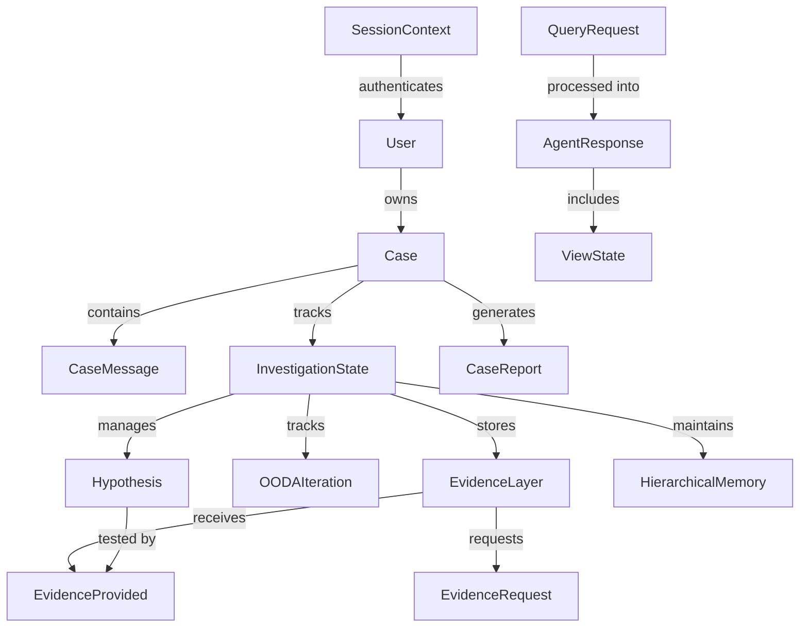

# Data Models Reference

**Version:** 1.0
**Date:** 2025-10-24
**Purpose:** Comprehensive catalog of all Pydantic data models in FaultMaven
**Total Models:** 150+ across 20 model files

---

## Overview

This document provides a complete reference for all data models used in FaultMaven. Models are organized by functional area with field descriptions, relationships, and usage examples.

**Model Locations**:
- Core: `faultmaven/models/*.py`
- Microservice Contracts: `faultmaven/models/microservice_contracts/*.py`

**Update Frequency**: 🔥 HIGH - Update when modifying model definitions

---

## Table of Contents

1. [API Models](#1-api-models) - Request/response schemas
2. [Investigation Models](#2-investigation-models) - Investigation state and OODA
3. [Evidence Models](#3-evidence-models) - Evidence collection and tracking
4. [Case Models](#4-case-models) - Case entity and lifecycle
5. [Agentic Models](#5-agentic-models) - Agent execution and planning
6. [Common Models](#6-common-models) - Shared data structures
7. [Report Models](#7-report-models) - Document generation
8. [Interface Models](#8-interface-models) - Service interfaces
9. [Protection Models](#9-protection-models) - Security and rate limiting
10. [Auth Models](#10-auth-models) - Authentication and authorization

---

## 1. API Models

**File**: `faultmaven/models/api.py`
**Purpose**: HTTP API request/response schemas for v3.1.0

### Core Enums

#### ResponseType

```python
class ResponseType(str, Enum):
    """17 intent-based response types for v3.1.0 schema"""
    SUGGESTED_ACTION = "suggested_action"
    EVIDENCE_REQUEST = "evidence_request"
    SCOPE_ASSESSMENT = "scope_assessment"
    TIMELINE_UPDATE = "timeline_update"
    HYPOTHESIS = "hypothesis"
    TEST_RESULT = "test_result"
    SOLUTION_PROPOSAL = "solution_proposal"
    CASE_SUMMARY = "case_summary"
    QUERY_REFINEMENT = "query_refinement"
    CLARIFICATION = "clarification"
    COMMAND_SUGGESTION = "command_suggestion"
    CONFIGURATION_CHECK = "configuration_check"
    DEPENDENCY_ANALYSIS = "dependency_analysis"
    RESOURCE_ANALYSIS = "resource_analysis"
    DATA_INSIGHTS = "data_insights"
    TROUBLESHOOTING_ASSISTANCE = "troubleshooting_assistance"
    GENERAL_RESPONSE = "general_response"
```

**Usage**: Determines response structure in AgentResponse
**Spec Reference**: Query Classification and Prompt Engineering design

#### SourceType

```python
class SourceType(str, Enum):
    """Evidence attribution source types"""
    LLM_REASONING = "llm_reasoning"
    KNOWLEDGE_BASE = "knowledge_base"
    USER_PROVIDED_DATA = "user_provided_data"
    EXTERNAL_API = "external_api"
    CASE_HISTORY = "case_history"
```

### Request Models

#### QueryRequest

```python
class QueryRequest(BaseModel):
    """Main troubleshooting query request"""
    session_id: str                              # Session ID for auth
    query: str                                   # User's question/problem
    context: Optional[Dict[str, Any]] = None     # Additional context
    priority: Literal["low", "medium", "high", "critical"] = "medium"
    timestamp: str = Field(default_factory=utc_timestamp)
```

**API Endpoint**: `POST /api/v1/cases/{case_id}/query`
**Response**: `AgentResponse`

### Response Models

#### AgentResponse

```python
class AgentResponse(BaseModel):
    """v3.1.0 unified agent response with intent-driven structure"""
    schema_version: Literal["3.1.0"] = "3.1.0"
    response_type: ResponseType                  # Intent-based type
    content: str                                 # Human-readable response
    structured_data: Optional[Dict[str, Any]]    # Type-specific structured data
    sources: List[Source]                        # Evidence attribution
    view_state: ViewState                        # Complete UI state
    metadata: Dict[str, Any]                     # Processing metadata
```

**Key Fields**:
- `response_type`: Determines `structured_data` schema
- `sources`: Evidence attribution for transparency
- `view_state`: Complete frontend rendering state
- `metadata`: Confidence, processing time, phase info

#### ViewState

```python
class ViewState(BaseModel):
    """Complete frontend rendering state"""
    session_id: str                              # Current session
    case_id: str                                 # Current case
    user_id: str                                 # Authenticated user
    case_title: str                              # Display title
    case_status: Literal["active", "investigating", "solved", "stalled", "archived"]
    running_summary: str                         # AI-generated summary
    uploaded_data: List[UploadedData]            # Files uploaded
    conversation_count: int                      # Number of exchanges
    last_updated: str                            # UTC timestamp
    can_upload_data: bool                        # Upload capability
    needs_more_info: bool                        # Evidence needed flag
    available_actions: List[AvailableAction]     # Next steps
    progress_indicators: List[ProgressIndicator] # Investigation progress

    # Investigation Framework Extensions (Phase-specific)
    investigation_progress: Optional[Dict[str, Any]]  # Lifecycle progress
    ooda_progress: Optional[Dict[str, Any]]           # OODA execution state
    evidence_status: Optional[Dict[str, Any]]         # Evidence tracking
```

**Purpose**: Single source of truth for frontend UI state
**Spec Reference**: Schema v3.1.0 Design (architecture-overview.md)

#### Source

```python
class Source(BaseModel):
    """Evidence attribution for transparency"""
    source_type: SourceType
    source_id: Optional[str]                     # Document ID, API endpoint, etc.
    confidence: float = Field(..., ge=0.0, le=1.0)
    snippet: Optional[str]                       # Relevant excerpt
    metadata: Dict[str, Any] = Field(default_factory=dict)
```

### Supporting Models

#### UploadedData

```python
class UploadedData(BaseModel):
    """Uploaded file metadata"""
    data_id: str
    filename: str
    file_type: str
    upload_timestamp: str
    processing_status: ProcessingStatus
    insights: Optional[Dict[str, Any]]
```

#### AvailableAction

```python
class AvailableAction(BaseModel):
    """User action options"""
    action_id: str
    action_type: str                             # "upload", "answer", "clarify", etc.
    label: str                                   # UI button text
    description: str
    priority: int = 0                            # Sorting order
```

#### ProgressIndicator

```python
class ProgressIndicator(BaseModel):
    """Investigation progress tracking"""
    indicator_id: str
    label: str                                   # "Scope defined", "Timeline established"
    status: Literal["pending", "in_progress", "completed"]
    percentage: Optional[int]                    # 0-100
```

### Case Management Models

#### Case (API version)

```python
class Case(BaseModel):
    """API representation of a case"""
    case_id: str
    title: str
    description: Optional[str]
    status: Literal["active", "resolved", "archived"]
    priority: Literal["low", "medium", "high", "critical"]
    created_at: str                              # UTC ISO 8601
    updated_at: str                              # UTC ISO 8601
    message_count: int
    owner_id: str                                # User who owns case (REQUIRED)
```

**Note**: This is the API schema. Domain Case model in `case.py` is more comprehensive.

---

## 2. Investigation Models

**File**: `faultmaven/models/investigation.py`
**Purpose**: Investigation Framework state management, OODA integration
**Design Reference**: Investigation Phases and OODA Integration Framework v2.1

### Core Enums

#### InvestigationPhase

```python
class InvestigationPhase(int, Enum):
    """7-phase investigation lifecycle (0-indexed)"""
    INTAKE = 0                                   # Consultant mode, problem detection
    BLAST_RADIUS = 1                             # Scope and impact
    TIMELINE = 2                                 # When did it start
    HYPOTHESIS = 3                               # Generate hypotheses
    VALIDATION = 4                               # Test hypotheses
    SOLUTION = 5                                 # Propose solutions
    DOCUMENT = 6                                 # Generate reports
```

#### OODAStep

```python
class OODAStep(str, Enum):
    """OODA loop steps"""
    OBSERVE = "observe"                          # Gather information
    ORIENT = "orient"                            # Analyze and contextualize
    DECIDE = "decide"                            # Choose action
    ACT = "act"                                  # Execute action
```

#### EngagementMode

```python
class EngagementMode(str, Enum):
    """Agent engagement modes"""
    CONSULTANT = "consultant"                    # Q&A mode, reactive
    LEAD_INVESTIGATOR = "lead_investigator"      # Systematic investigation
```

#### HypothesisStatus

```python
class HypothesisStatus(str, Enum):
    """Hypothesis lifecycle states"""
    CAPTURED = "captured"                        # Opportunistic capture (Phases 0-2)
    ACTIVE = "active"                            # Currently being tested
    VALIDATED = "validated"                      # Confirmed by evidence
    REFUTED = "refuted"                          # Disproved by evidence
    RETIRED = "retired"                          # Abandoned (low confidence/anchoring)
    SUPERSEDED = "superseded"                    # Better hypothesis found
```

### State Management Models

#### InvestigationState

```python
class InvestigationState(BaseModel):
    """Complete investigation state - hierarchical structure

    5-layer architecture:
    1. Metadata Layer - Case identification
    2. Lifecycle Layer - Phase/mode/strategy tracking
    3. OODA Engine Layer - OODA execution state
    4. Evidence Layer - Evidence requests and collection
    5. Memory Layer - Hierarchical memory management
    """

    # Layer 1: Metadata
    case_id: str
    user_id: str
    created_at: datetime
    updated_at: datetime

    # Layer 2: Lifecycle
    current_phase: InvestigationPhase = InvestigationPhase.INTAKE
    engagement_mode: EngagementMode = EngagementMode.CONSULTANT
    investigation_strategy: InvestigationStrategy = InvestigationStrategy.POST_MORTEM

    # Layer 3: OODA Engine
    ooda_engine: OODAEngineState

    # Layer 4: Evidence
    evidence_layer: EvidenceLayer

    # Layer 5: Memory
    memory: MemoryLayer

    # Cross-cutting
    conversation_history: List[ConversationTurn]
    hypotheses: List[Hypothesis]
```

**Storage**: Redis with graduated TTL (hot/warm/cold tiers)
**Token Budget**: ~1,600 tokens (vs 4,500+ baseline, 64% reduction)

#### OODAEngineState

```python
class OODAEngineState(BaseModel):
    """OODA execution tracking"""
    iterations: List[OODAIteration] = Field(default_factory=list)
    current_iteration_number: int = 0
    active_ooda_steps: List[OODAStep] = Field(default_factory=list)
    anchoring_detected: bool = False
    stall_iteration_count: int = 0
```

#### OODAIteration

```python
class OODAIteration(BaseModel):
    """Single OODA cycle iteration"""
    iteration_number: int
    phase: InvestigationPhase
    steps_completed: List[OODAStep]
    state_changes: Dict[str, Any]                # What changed
    new_insights: List[str]
    new_evidence_collected: int
    confidence_delta: float = 0.0
    made_progress: bool = True
    stall_reason: Optional[str] = None
    timestamp: datetime = Field(default_factory=lambda: datetime.now(timezone.utc))
```

**Usage**: Track progress, detect stagnation, compression triggers

### Memory Models

#### HierarchicalMemory

```python
class HierarchicalMemory(BaseModel):
    """3-tier memory system for token optimization"""
    hot_memory: List[OODAIteration]              # Last 2 iterations, full fidelity (~500 tokens)
    warm_memory: List[MemorySnapshot]            # Iterations 3-5, summarized (~300 tokens)
    cold_memory: List[MemorySnapshot]            # Older, key facts only (~100 tokens)
    persistent_insights: List[str]               # Always accessible (~100 tokens)

    def should_compress(self) -> bool:
        """Check if compression needed (every 3 turns)"""
        return len(self.hot_memory) >= 3
```

**Compression**: LLM-powered summarization via `MemoryCompressionEngine`
**Spec Reference**: Memory Management Architecture

#### MemorySnapshot

```python
class MemorySnapshot(BaseModel):
    """Compressed memory for warm/cold tiers"""
    iteration_range: Tuple[int, int]             # (start, end) iterations
    summary: str                                 # LLM-generated summary
    key_facts: List[str]                         # Top 5 facts
    confidence_changes: Dict[str, float]
    evidence_collected: List[str]
    decisions_made: List[str]
```

### Hypothesis Models

#### Hypothesis

```python
class Hypothesis(BaseModel):
    """Root cause hypothesis with confidence tracking"""
    hypothesis_id: str = Field(default_factory=lambda: str(uuid4()))
    statement: str                               # Root cause statement
    category: str                                # infrastructure, code, config, data, etc.

    # Confidence tracking
    likelihood: float = Field(..., ge=0.0, le=1.0)
    initial_likelihood: float
    supporting_evidence_ids: List[str] = Field(default_factory=list)
    refuting_evidence_ids: List[str] = Field(default_factory=list)

    # Lifecycle
    status: HypothesisStatus = HypothesisStatus.ACTIVE
    generation_mode: HypothesisGenerationMode = HypothesisGenerationMode.SYSTEMATIC
    captured_in_phase: InvestigationPhase = InvestigationPhase.HYPOTHESIS
    created_at_turn: int

    # Testing
    tests_performed: List[HypothesisTest] = Field(default_factory=list)
    turns_since_progress: int = 0
    retirement_reason: Optional[str] = None

    def apply_confidence_decay(self) -> None:
        """Apply decay for stagnation: 0.85^iterations_without_progress"""
        if self.turns_since_progress > 0:
            decay_factor = 0.85 ** self.turns_since_progress
            self.likelihood *= decay_factor
            if self.likelihood < 0.3:
                self.status = HypothesisStatus.RETIRED
                self.retirement_reason = "Confidence decay"
```

**Confidence Management**:
- Evidence-ratio: `initial + (0.15 × supporting) - (0.20 × refuting)`
- Decay: `base × 0.85^iterations_without_progress`
- Auto-transition: VALIDATED (≥70% + ≥2 supporting), REFUTED (≤20% + ≥2 refuting)

### Problem Definition Models

#### ProblemConfirmation

```python
class ProblemConfirmation(BaseModel):
    """Informal problem understanding (Phase 0)"""
    problem_statement: str
    user_goal: str                               # What user wants to achieve
    urgency: UrgencyLevel
    initial_symptoms: List[str]
    consent_to_investigate: Optional[bool]       # User approval for investigation
```

#### AnomalyFrame

```python
class AnomalyFrame(BaseModel):
    """Formal problem definition (Phase 1)"""
    what_is_broken: str                          # Specific symptom
    expected_behavior: str                       # Normal state
    actual_behavior: str                         # Anomalous state
    impact: str                                  # User/business impact
    urgency: UrgencyLevel
    scope: Optional[str]                         # Systems affected
```

**Transition**: ProblemConfirmation (Phase 0) → consent → AnomalyFrame (Phase 1)

---

## 3. Evidence Models

**File**: `faultmaven/models/evidence.py`
**Purpose**: Evidence collection, classification, and tracking
**Design Reference**: Evidence Collection and Tracking Design v2.1

### Core Enums

#### EvidenceCategory

```python
class EvidenceCategory(str, Enum):
    """7 evidence types for hypothesis testing"""
    LOGS = "logs"
    METRICS = "metrics"
    CONFIGURATIONS = "configurations"
    CODE_CHANGES = "code_changes"
    DEPENDENCIES = "dependencies"
    RESOURCE_STATUS = "resource_status"
    TIMELINE_DATA = "timeline_data"
```

#### EvidenceStatus

```python
class EvidenceStatus(str, Enum):
    """Evidence lifecycle states"""
    REQUESTED = "requested"                      # Asked from user
    ACKNOWLEDGED = "acknowledged"                # User working on it
    RECEIVED = "received"                        # User provided
    VALIDATED = "validated"                      # Confirmed usable
    BLOCKED = "blocked"                          # User cannot provide
```

#### EvidenceType

```python
class EvidenceType(str, Enum):
    """Hypothesis alignment"""
    SUPPORTIVE = "supportive"                    # Confirms hypothesis
    REFUTING = "refuting"                        # Contradicts hypothesis
    NEUTRAL = "neutral"                          # Neither supports nor refutes
    ABSENCE = "absence"                          # Evidence doesn't exist
```

#### CompletenessLevel

```python
class CompletenessLevel(str, Enum):
    """Evidence completeness"""
    PARTIAL = "partial"                          # Some info, incomplete (0.3-0.7)
    COMPLETE = "complete"                        # Fully answers request (0.8-1.0)
    OVER_COMPLETE = "over_complete"              # Satisfies multiple requests
```

### Evidence Models

#### EvidenceRequest

```python
class EvidenceRequest(BaseModel):
    """Evidence request from agent to user"""
    request_id: str = Field(default_factory=lambda: f"req-{uuid4()}")
    category: EvidenceCategory
    description: str                             # What we need
    guidance: AcquisitionGuidance                # How to get it
    priority: int = Field(..., ge=1, le=5)       # 1=highest
    for_hypothesis_id: Optional[str]             # Which hypothesis this tests
    requested_by_ooda_step: Optional[OODAStep]
    status: EvidenceStatus = EvidenceStatus.REQUESTED
    created_at: datetime = Field(default_factory=lambda: datetime.now(timezone.utc))
```

#### EvidenceProvided

```python
class EvidenceProvided(BaseModel):
    """User-provided evidence"""
    evidence_id: str = Field(default_factory=lambda: f"evd-{uuid4()}")
    matched_request_ids: List[str]               # Which requests this addresses
    content: str                                 # Evidence content
    form: EvidenceForm                           # user_input or document
    evidence_type: EvidenceType                  # supportive/refuting/neutral/absence
    completeness: CompletenessLevel
    completeness_score: float = Field(..., ge=0.0, le=1.0)
    classification: Optional[EvidenceClassification]
    received_at: datetime = Field(default_factory=lambda: datetime.now(timezone.utc))
```

#### EvidenceClassification

```python
class EvidenceClassification(BaseModel):
    """5-dimensional LLM classification result"""
    matched_request_ids: List[str]               # Dimension 1: Request matching
    completeness: CompletenessLevel              # Dimension 2: Completeness
    completeness_score: float                    # Numeric score
    form: EvidenceForm                           # Dimension 3: Form
    evidence_type: EvidenceType                  # Dimension 4: Type
    user_intent: UserIntent                      # Dimension 5: Intent
    rationale: str                               # Classification reasoning
    follow_up_needed: Optional[str]              # If incomplete, what's missing
```

**Classification Service**: `services/evidence/classification.py` (LLM-powered)

#### AcquisitionGuidance

```python
class AcquisitionGuidance(BaseModel):
    """Step-by-step instructions for getting evidence"""
    steps: List[str] = Field(..., max_items=5)   # Max 5 steps
    example_command: Optional[str]               # Shell command if applicable
    expected_output_format: Optional[str]
    common_pitfalls: List[str] = Field(default_factory=list)
```

---

## 4. Case Models

**File**: `faultmaven/models/case.py`
**Purpose**: Case entity and lifecycle management

### Core Enums

#### CaseStatus

```python
class CaseStatus(str, Enum):
    """7-state case lifecycle"""
    ACTIVE = "active"                            # Ongoing, no investigation
    INVESTIGATING = "investigating"              # Lead Investigator active
    STALLED = "stalled"                          # 3+ blocked evidence
    RESOLVED = "resolved"                        # Solution implemented
    VALIDATED = "validated"                      # Solution verified
    ARCHIVED = "archived"                        # Closed and archived
    DOCUMENTING = "documenting"                  # Phase 6, generating reports
```

**State Machine**: See Case Lifecycle Management design

#### CasePriority

```python
class CasePriority(str, Enum):
    """Priority levels"""
    LOW = "low"
    MEDIUM = "medium"
    HIGH = "high"
    CRITICAL = "critical"
```

### Main Entity

#### Case

```python
class Case(BaseModel):
    """Main case entity for troubleshooting"""

    # Core identification
    case_id: str = Field(default_factory=lambda: str(uuid4()))
    title: str
    description: Optional[str]
    title_manually_set: bool = False             # Auto-title vs manual

    # Ownership (REQUIRED per spec)
    owner_id: str = Field(..., description="Case owner user ID - REQUIRED")
    participants: List[CaseParticipant] = Field(default_factory=list)

    # Lifecycle
    status: CaseStatus = CaseStatus.ACTIVE
    priority: CasePriority = CasePriority.MEDIUM
    created_at: datetime = Field(default_factory=lambda: datetime.now(timezone.utc))
    updated_at: datetime = Field(default_factory=lambda: datetime.now(timezone.utc))
    last_activity_at: datetime = Field(default_factory=lambda: datetime.now(timezone.utc))

    # Persistence
    expires_at: Optional[datetime]
    auto_archive_after_days: int = 30

    # Conversation
    messages: List[CaseMessage] = Field(default_factory=list)
    message_count: int = 0

    # Context and artifacts
    context: CaseContext = Field(default_factory=CaseContext)

    # Diagnostic state (server-side only)
    diagnostic_state: CaseDiagnosticState = Field(default_factory=CaseDiagnosticState)

    # Metadata
    tags: List[str] = Field(default_factory=list)
    metadata: Dict[str, Any] = Field(default_factory=dict)
```

**Spec Compliance**: No `session_id` field (cases owned by users, not sessions)

#### CaseMessage

```python
class CaseMessage(BaseModel):
    """Individual message in case conversation"""
    message_id: str = Field(default_factory=lambda: str(uuid4()))
    case_id: str
    author_id: str = Field(..., description="User who created message - REQUIRED")
    message_type: MessageType
    content: str
    timestamp: datetime = Field(default_factory=lambda: datetime.now(timezone.utc))

    # Metadata
    metadata: Dict[str, Any] = Field(default_factory=dict)
    attachments: List[str] = Field(default_factory=list)

    # Processing
    confidence_score: Optional[float]
    processing_time_ms: Optional[int]
```

**Spec Compliance**: Uses `author_id` for attribution, not `session_id`

---

## 5. Agentic Models

**File**: `faultmaven/models/agentic.py`
**Purpose**: Agentic framework execution models

### Key Models

#### QueryContext

```python
class QueryContext(BaseModel):
    """Complete context for agent query processing"""
    session_id: str
    case_id: str
    user_id: str
    user_query: str
    conversation_history: List[Dict[str, Any]]
    case_status: str
    investigation_state: Optional[InvestigationState]
    uploaded_data: List[Dict[str, Any]]
    current_phase: InvestigationPhase
    engagement_mode: EngagementMode
```

**Usage**: Replaces loose dictionaries with typed context

#### AgentExecutionState

```python
class AgentExecutionState(BaseModel):
    """Agent execution tracking"""
    execution_id: str
    phase: AgentExecutionPhase
    status: str
    tools_used: List[str]
    llm_calls: int
    total_tokens: int
    error: Optional[str]
```

---

## 6. Common Models

**File**: `faultmaven/models/common.py`
**Purpose**: Shared data structures

### SessionContext

```python
class SessionContext(BaseModel):
    """Session authentication context (spec-compliant)"""

    # Core session fields
    session_id: str = Field(..., description="Unique session identifier")
    user_id: str = Field(..., description="User identifier - REQUIRED")

    # Multi-device support (spec lines 263-269)
    client_id: Optional[str] = Field(None, description="Client/device identifier")
    session_resumed: bool = Field(False, description="Session resumption flag")

    # Timestamps
    created_at: datetime = Field(default_factory=lambda: datetime.now(timezone.utc))
    last_activity: datetime = Field(default_factory=lambda: datetime.now(timezone.utc))
    updated_at: datetime = Field(default_factory=lambda: datetime.now(timezone.utc))
    expires_at: Optional[datetime] = Field(None, description="Session expiration (TTL)")

    # Metadata (authentication context only)
    metadata: Dict[str, Any] = Field(default_factory=dict)
```

**Spec Compliance**:
- ✅ No `case_history` field
- ✅ No `current_case_id` field
- ✅ No `data_uploads` field
- ✅ Includes `client_id` and `session_resumed` for multi-device support

**Spec Reference**: case-and-session-concepts.md v2.0

---

## 7. Report Models

**File**: `faultmaven/models/report.py`
**Purpose**: Document generation (Phase 6)

### Core Enums

#### ReportType

```python
class ReportType(str, Enum):
    """Three report types"""
    INCIDENT_REPORT = "incident_report"          # Timeline, root cause, resolution
    RUNBOOK = "runbook"                          # Step-by-step procedures
    POST_MORTEM = "post_mortem"                  # Comprehensive retrospective
```

### Main Models

#### CaseReport

```python
class CaseReport(BaseModel):
    """Generated case documentation"""
    report_id: str
    case_id: str
    report_type: ReportType
    title: str
    content: str                                 # Markdown content
    status: ReportStatus

    # Versioning
    version: int = 1
    regeneration_count: int = 0

    # Runbook-specific
    runbook_metadata: Optional[RunbookMetadata]

    # Timestamps
    generated_at: datetime
    regenerated_at: Optional[datetime]
```

#### RunbookMetadata

```python
class RunbookMetadata(BaseModel):
    """Runbook-specific metadata for KB indexing"""
    problem_pattern: str                         # Pattern this addresses
    symptoms: List[str]                          # Observable symptoms
    root_cause_category: str                     # Category (infrastructure, code, etc.)
    resolution_steps: List[str]                  # Step-by-step resolution
    prevention_measures: List[str]               # How to prevent recurrence
    applicable_systems: List[str]                # Which systems this applies to
    estimated_resolution_time: Optional[str]     # "15 minutes", "2 hours", etc.
```

**Auto-Indexing**: Runbooks automatically indexed in RunbookKB for similarity search

---

## 8. Interface Models

**File**: `faultmaven/models/interfaces.py`
**Purpose**: Service interface definitions
**Pattern**: Interface-based design for dependency injection

### Core Interfaces

```python
class ILLMProvider(Protocol):
    """LLM provider interface"""
    async def chat_completion(self, messages: List[Dict], **kwargs) -> Dict: ...
    async def count_tokens(self, text: str) -> int: ...

class ISessionStore(Protocol):
    """Session storage interface"""
    async def get(self, session_id: str) -> Optional[Dict]: ...
    async def set(self, session_id: str, data: Dict, ttl: int = 3600) -> bool: ...
    async def delete(self, session_id: str) -> bool: ...

class ICaseStore(Protocol):
    """Case storage interface"""
    async def create_case(self, case: Case) -> Case: ...
    async def get_case(self, case_id: str) -> Optional[Case]: ...
    async def update_case(self, case: Case) -> Case: ...

class IVectorStore(Protocol):
    """Vector store interface"""
    async def add_documents(self, documents: List[str], metadatas: List[Dict]) -> List[str]: ...
    async def search(self, query: str, n_results: int = 5) -> List[Dict]: ...
```

**Usage**: Enable dependency injection and testing with mock implementations

---

## 9. Protection Models

**File**: `faultmaven/models/protection.py`
**Purpose**: Security and rate limiting

#### RateLimitConfig

```python
class RateLimitConfig(BaseModel):
    """Rate limit configuration"""
    requests_per_minute: int = 60
    requests_per_hour: int = 1000
    burst_size: int = 10
```

#### ProtectionResult

```python
class ProtectionResult(BaseModel):
    """Protection check result"""
    allowed: bool
    protection_type: ProtectionType
    reason: Optional[str]
    retry_after_seconds: Optional[int]
```

---

## 10. Auth Models

**File**: `faultmaven/models/auth.py`
**Purpose**: Authentication and authorization

#### DevUser

```python
class DevUser(BaseModel):
    """Development mode user"""
    user_id: str
    username: str
    email: str
    created_at: datetime
```

#### AuthToken

```python
class AuthToken(BaseModel):
    """Authentication token"""
    token: str
    user_id: str
    expires_at: datetime
    token_type: str = "Bearer"
```

---

## Model Relationship Diagram



---

## Usage Patterns

### Creating a New Case

```python
case = Case(
    title="Database Performance Issues",
    owner_id=user_id,  # REQUIRED
    priority=CasePriority.HIGH,
    status=CaseStatus.ACTIVE
)
```

### Building QueryContext

```python
context = QueryContext(
    session_id=session.session_id,
    case_id=case.case_id,
    user_id=user.user_id,
    user_query="Why is the API slow?",
    conversation_history=case.messages,
    investigation_state=case.diagnostic_state.investigation_state,
    current_phase=InvestigationPhase.BLAST_RADIUS,
    engagement_mode=EngagementMode.LEAD_INVESTIGATOR
)
```

### Creating Evidence Request

```python
evidence_req = EvidenceRequest(
    category=EvidenceCategory.LOGS,
    description="API access logs from the last hour",
    guidance=AcquisitionGuidance(
        steps=[
            "SSH to api-server-01",
            "Run: tail -1000 /var/log/api/access.log",
            "Copy the output"
        ],
        example_command="tail -1000 /var/log/api/access.log"
    ),
    priority=1,
    for_hypothesis_id=hypothesis.hypothesis_id
)
```

---

## Related Documentation

- [Architecture Overview](./architecture-overview.md) - System architecture
- [Implementation Module Mapping](./implementation-module-mapping.md) - File organization
- [Interface-Based Design](./interface-based-design.md) - Interface definitions
- [Investigation Phases Framework](./investigation-phases-and-ooda-integration.md) - Investigation models
- [Evidence Collection Design](./evidence-collection-and-tracking-design.md) - Evidence models
- [Case and Session Concepts](./case-and-session-concepts.md) - Session/Case architecture

---

**Document Status**: ✅ Complete
**Last Updated**: 2025-10-24
**Maintainer**: Update when adding/modifying model definitions
