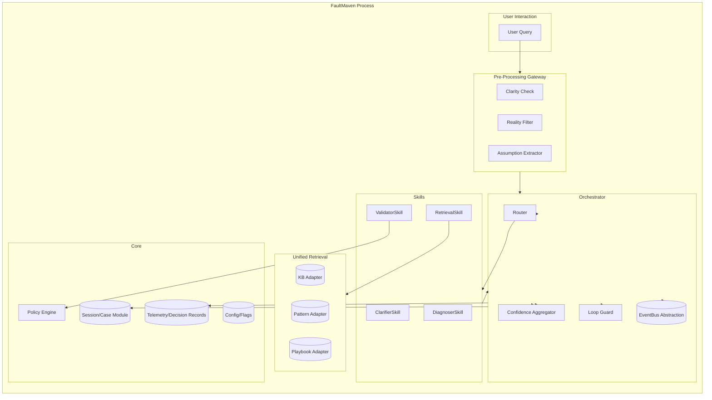
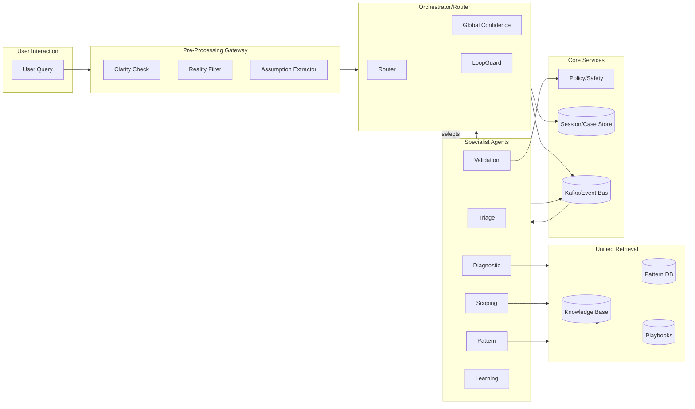

# FaultMaven Architecture Decision Guide

## Overview

This document consolidates the architectural blueprints for FaultMaven, providing clear guidance on the system's evolution from the current modular monolith to a microservice architecture when scale demands it.

**Current Status**: FaultMaven is implemented as a **modular monolith** with microservice-ready interfaces.

**Future Path**: Service boundaries are designed for extraction to microservices when justified by scale.

## Current Implementation: Modular Monolith

### Executive Summary

- Build a modular monolith now with strong boundaries and stable internal contracts so each module can be extracted into a microservice later without redesign.
- Keep all components in-process, communicating via interfaces and an abstract event bus (in-memory impl by default, Kafka-capable later).
- Preserve the lean skill-graph execution model (Gateway → Router → Skills → Confidence/LoopGuard → Retrieval/Policy), but as modules.

### Goals and Non-Functional Constraints

- **Reliability**: timeouts, fallbacks, circuit breakers at module boundaries (in-process) with fast failure
- **Efficiency**: per-turn budgets (time/tokens/calls) enforced by Orchestrator/Router; minimal fan-out
- **Scalability-ready**: stateless modules, DI wiring, abstract event bus and storage ports; no hard cross-module imports
- **Observability**: unified tracing and decision records; module-scoped logs
- **Safety**: Policy checks before risky actions; structured confirmations

### Module Architecture



## Future Architecture: Microservices Blueprint

### When to Migrate

Migrate to microservices when you experience:
- **Scale Pressure**: Individual components need independent scaling
- **Team Growth**: Multiple teams need to work on different services independently
- **Performance Requirements**: Specific services need dedicated optimization
- **Fault Isolation**: Need to isolate failures in specific components

### Target Microservice Architecture



## Migration Strategy

### Service Extraction Order

1. **Session/Case Service** (Low complexity - minimal external dependencies)
2. **Gateway Processing Service** (Low complexity - stateless processing)
3. **Global Confidence Service** (Medium complexity - model serving)
4. **Unified Retrieval Service** (Medium complexity - federated search)
5. **Orchestrator/Router Service** (High complexity - central coordination)
6. **Specialist Agents** (High complexity - business logic distribution)
7. **Policy/Safety Service** (Medium complexity - governance)

### Deployment Mode Configuration

```yaml
# deployment.yaml
deployment:
  mode: 'monolith'  # or 'microservices' or 'hybrid'
  
  services:
    orchestrator:
      mode: 'local'     # 'local' or 'remote'
      url: null         # only for remote mode
    
    confidence:
      mode: 'local'
      url: null
      
    retrieval:
      mode: 'remote'    # Can be mixed for hybrid deployments
      url: 'http://retrieval-service:8080'

  event_bus:
    type: 'in_process'  # 'in_process' or 'kafka'
    kafka:
      brokers: ['localhost:9092']
      schema_registry: 'http://localhost:8081'
```

## Implementation Phases

### Phase 1: Modular Monolith Foundation (Current)
- Interface-based dependency injection
- Clean architecture layer separation
- Service contracts that work both locally and distributed
- Event bus abstraction (in-memory)

### Phase 2: Service Boundary Hardening
- Enhance interface contracts
- Implement health monitoring
- Add circuit breakers and timeouts
- Create deployment mode switching

### Phase 3: Selective Service Extraction
- Extract services based on actual scale needs
- Implement distributed event bus (Kafka)
- Add service discovery and load balancing
- Maintain backward compatibility

## Decision Matrix

| Consideration | Modular Monolith | Microservices |
|---------------|------------------|----------------|
| **Development Speed** | ✅ Fast | ⚠️ Slower |
| **Deployment Complexity** | ✅ Simple | ❌ Complex |
| **Independent Scaling** | ❌ Limited | ✅ Full |
| **Team Autonomy** | ❌ Shared Codebase | ✅ Independent |
| **Operational Overhead** | ✅ Low | ❌ High |
| **Fault Isolation** | ⚠️ Limited | ✅ Strong |
| **Transaction Complexity** | ✅ Simple | ❌ Distributed |
| **Data Consistency** | ✅ ACID | ⚠️ Eventual |

## Recommendations

### Start with Modular Monolith (Current Approach)
- ✅ **Correct choice for current scale**
- ✅ **Faster development and deployment**
- ✅ **Easier debugging and testing**
- ✅ **Lower operational complexity**

### Migrate to Microservices When
- ❗ **Individual services need independent scaling**
- ❗ **Multiple teams working on different domains**
- ❗ **Fault isolation becomes critical**
- ❗ **Performance bottlenecks require service-specific optimization**

## Configuration and Feature Flags

### Current Feature Flags
```yaml
# Modular monolith components (recommended: enabled)
gateway: true
router: true
confidence_scoring: true
loop_guard: true
clarifier_skill: true
retrieval_skill: true
diagnoser_skill: true
validator_skill: true
policy_enforcement: strict

# Microservice extraction (recommended: disabled)
microservice_routes_enabled: false
kafka_enabled: false
external_event_bus: false
```

### Environment Variables
```bash
# Core module controls
FAULTMAVEN_GATEWAY=1
FAULTMAVEN_ROUTER=1
FAULTMAVEN_CONFIDENCE=1
FAULTMAVEN_LOOP_GUARD=1

# Deployment mode
FAULTMAVEN_MICROSERVICES_ENABLED=0
FAULTMAVEN_EVENTBUS=memory
FAULTMAVEN_DEBUG=0
```

## Conclusion

FaultMaven's architecture is designed for evolution. The current modular monolith provides the right balance of simplicity and scalability for the current phase, while the well-defined service boundaries enable future migration to microservices when justified by scale requirements.

**Key Principle**: *Architecture should follow scale, not precede it.*