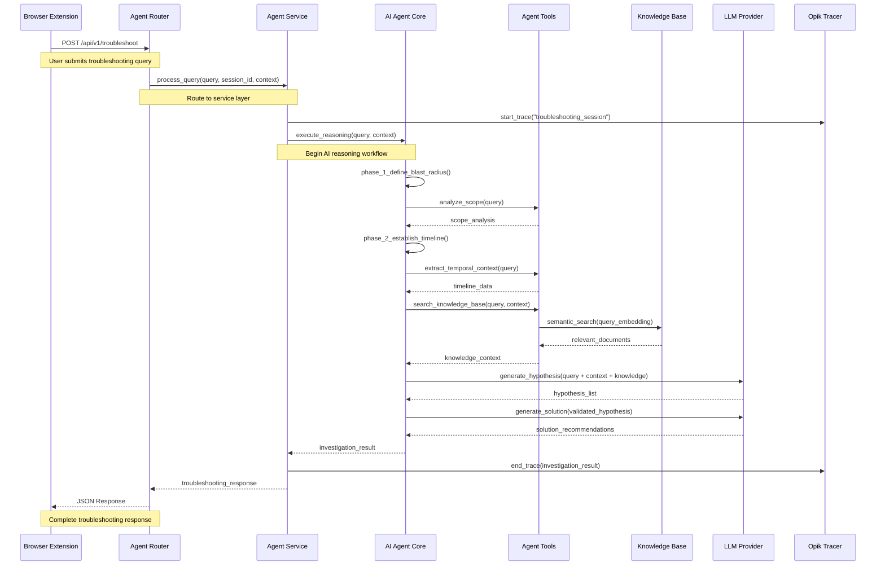
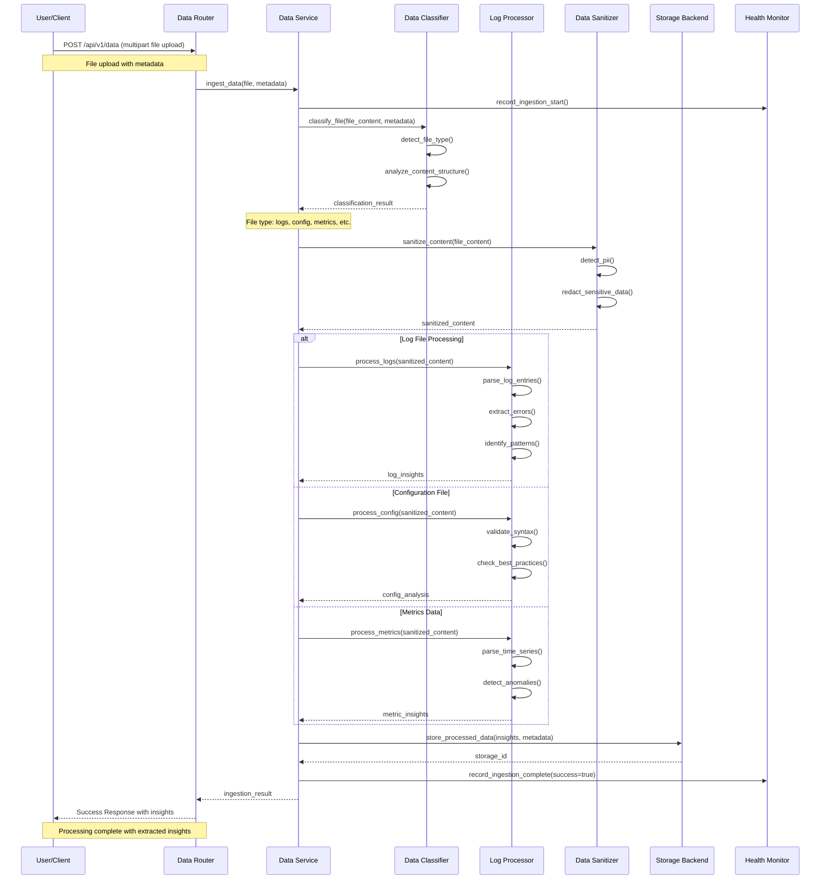
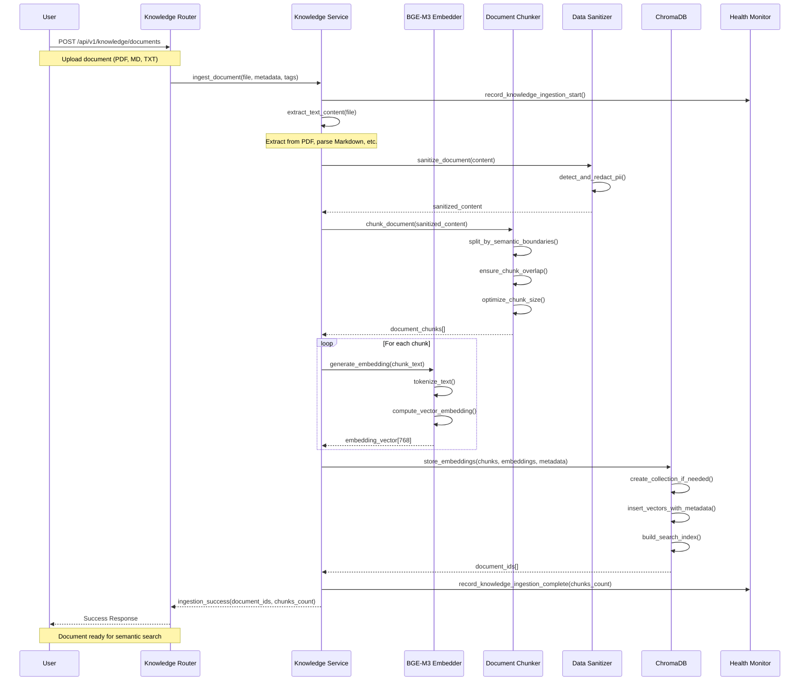
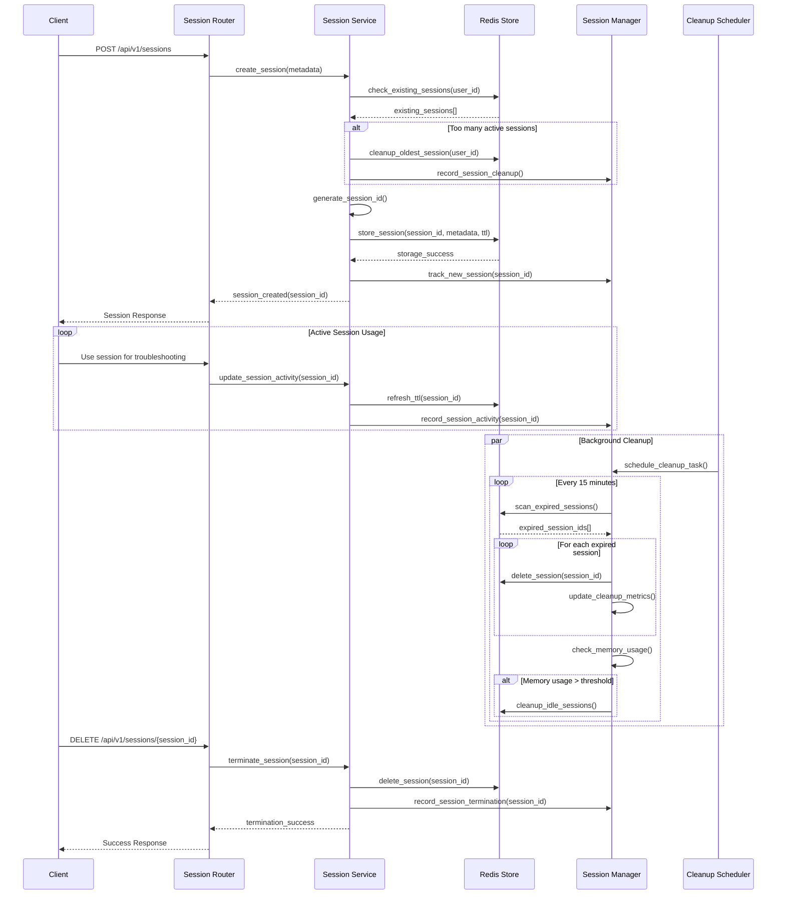
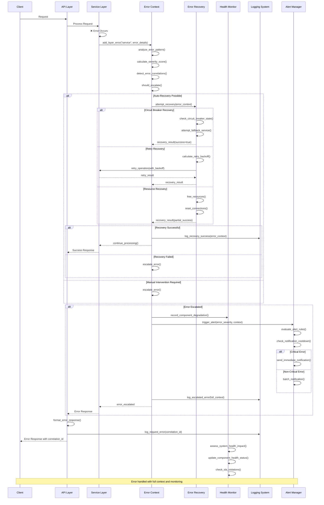
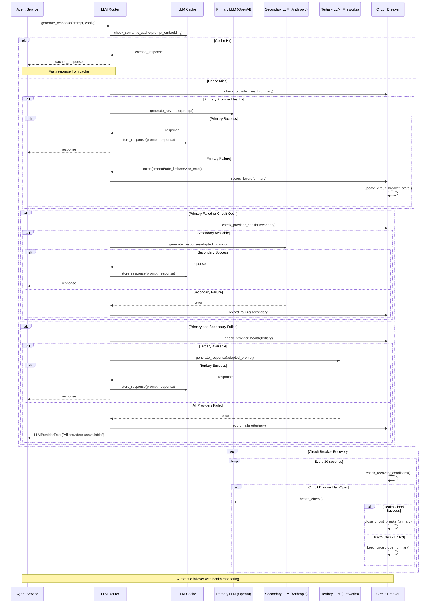
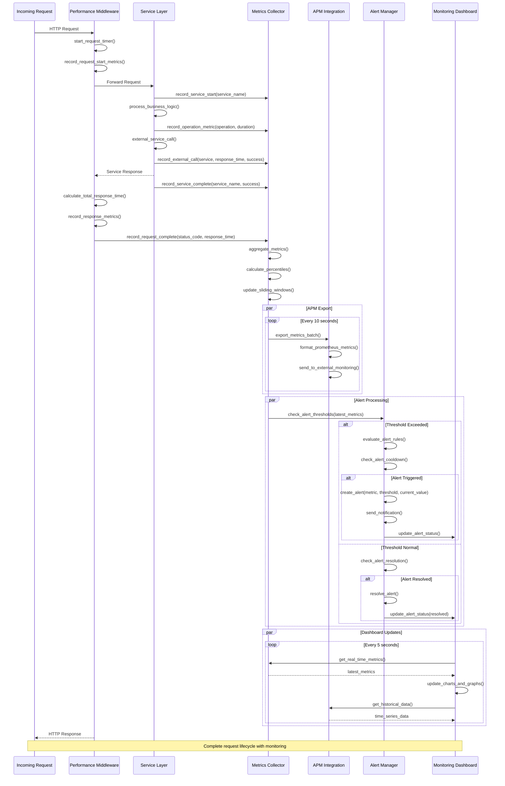
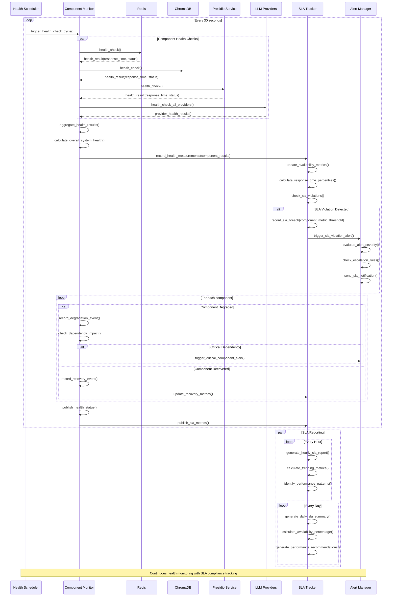

# Component Interaction Patterns

This document details the interaction patterns between components in the FaultMaven system, showing how data flows through the architecture for different use cases.

## Agent Query Processing Flow

The core troubleshooting workflow demonstrates how the AI agent processes user queries through multiple layers.

## Data Ingestion Flow

Shows how uploaded files are processed through the data pipeline with classification and security.

## Knowledge Base Document Ingestion

Demonstrates how documents are processed and stored in the vector database for RAG operations.

## Session Management Lifecycle

Shows how user sessions are created, maintained, and cleaned up across the system.

## Error Handling and Recovery Flow

Demonstrates how errors are detected, contextualized, and recovered across the system.

## LLM Provider Failover Flow

Shows how the system handles LLM provider failures with automatic failover and caching.

## Performance Monitoring Flow

Demonstrates how performance metrics are collected and monitored across all system components.

## Health Monitoring and SLA Tracking

Shows how component health is continuously monitored and SLA compliance is tracked.

## Inter-Component Communication Patterns

### Synchronous Communication
- **HTTP REST APIs**: Client-server communication with request/response pattern
- **Direct Method Calls**: In-process communication between layers via dependency injection
- **Database Queries**: Synchronous data retrieval with connection pooling

### Asynchronous Communication
- **Background Processing**: File processing and data ingestion in separate tasks
- **Event-Driven Updates**: Health monitoring and metrics collection
- **Batch Operations**: Session cleanup and maintenance operations

### Error Propagation
- **Context Preservation**: Error context flows through all layers with correlation IDs
- **Graceful Degradation**: System continues operating with reduced functionality during failures
- **Circuit Breaker Pattern**: Automatic failover and recovery for external services

### Performance Optimization
- **Caching Layers**: Multiple levels of caching for improved response times
- **Connection Pooling**: Efficient resource utilization for external services
- **Lazy Loading**: On-demand initialization of expensive resources

These interaction patterns demonstrate how FaultMaven maintains high availability, performance, and reliability through sophisticated error handling, monitoring, and recovery mechanisms.