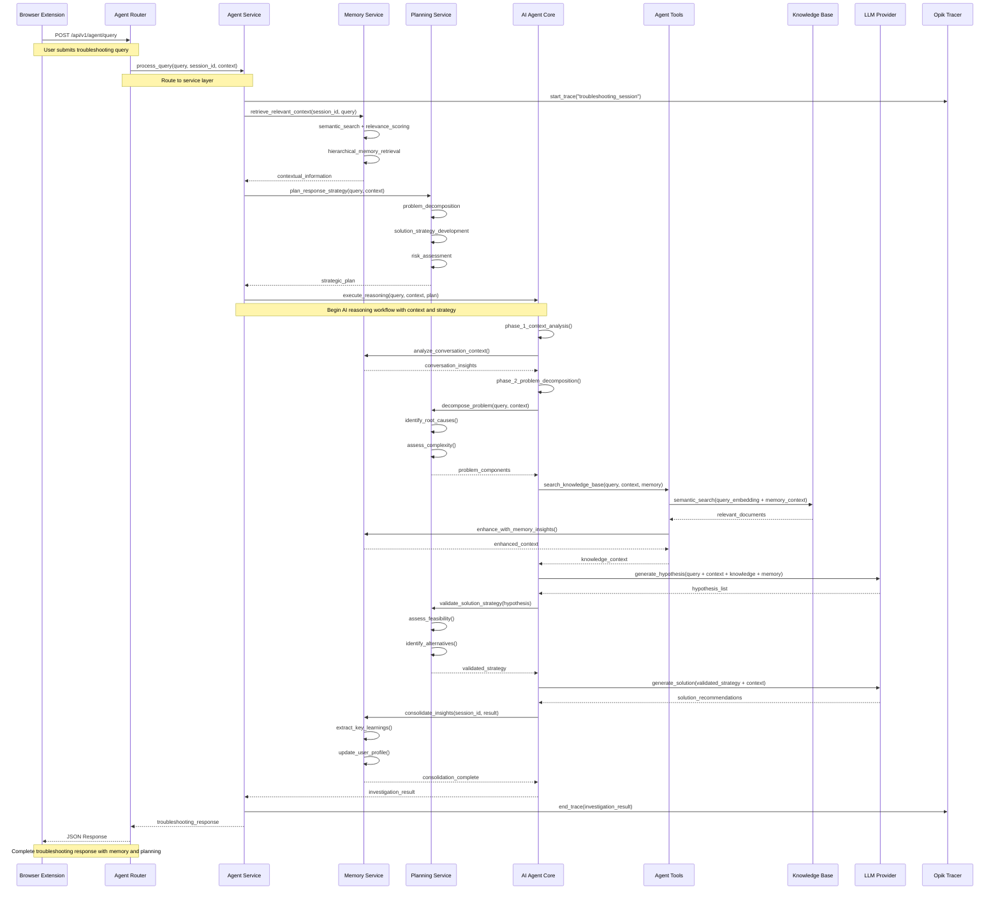
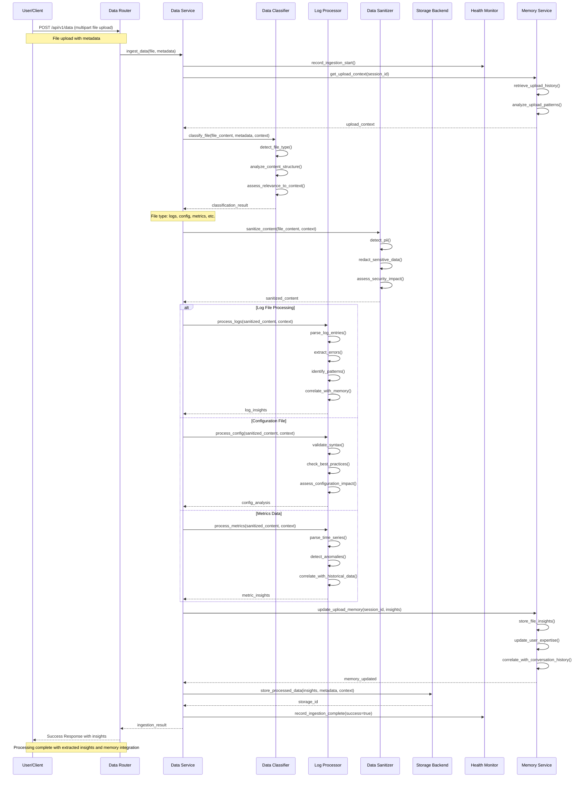
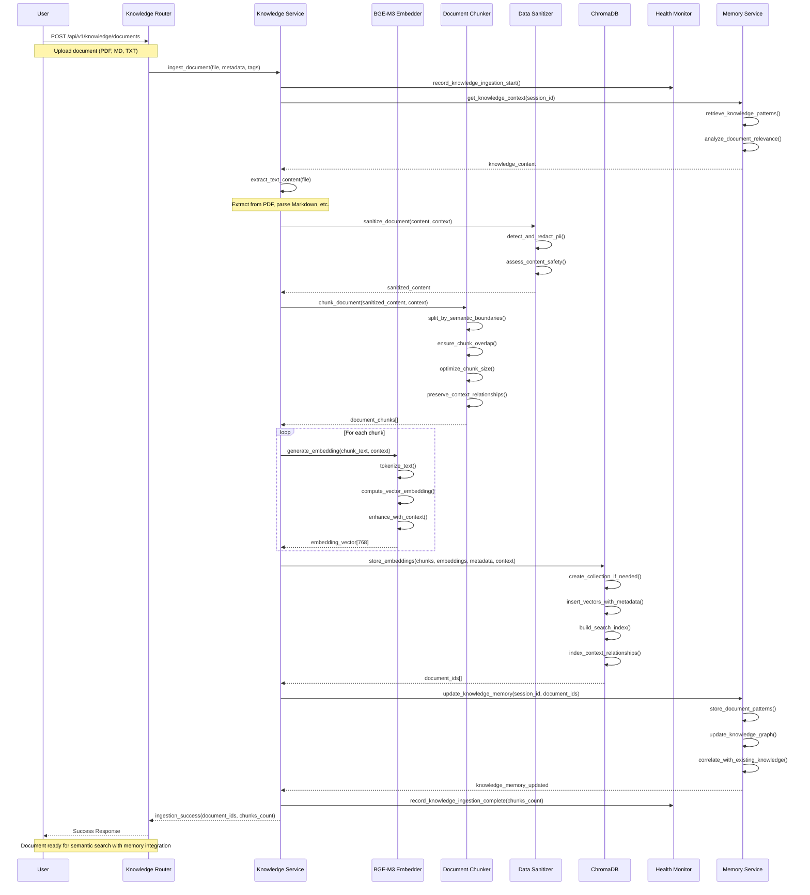
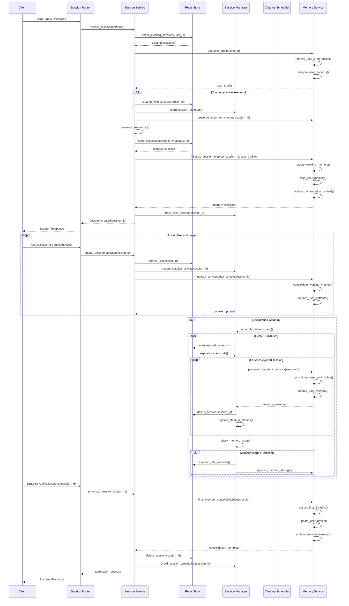
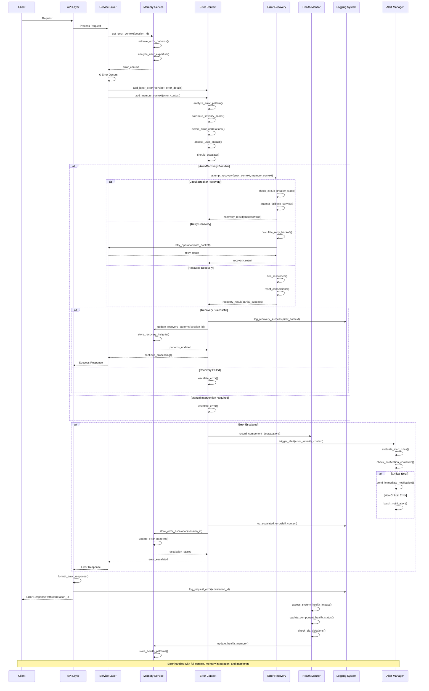
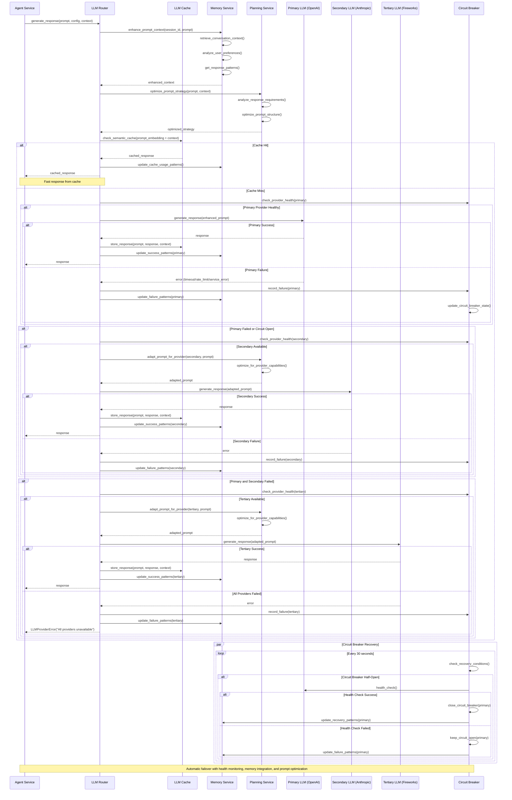
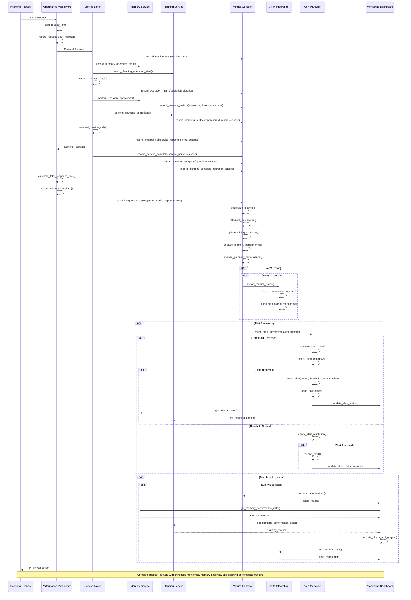
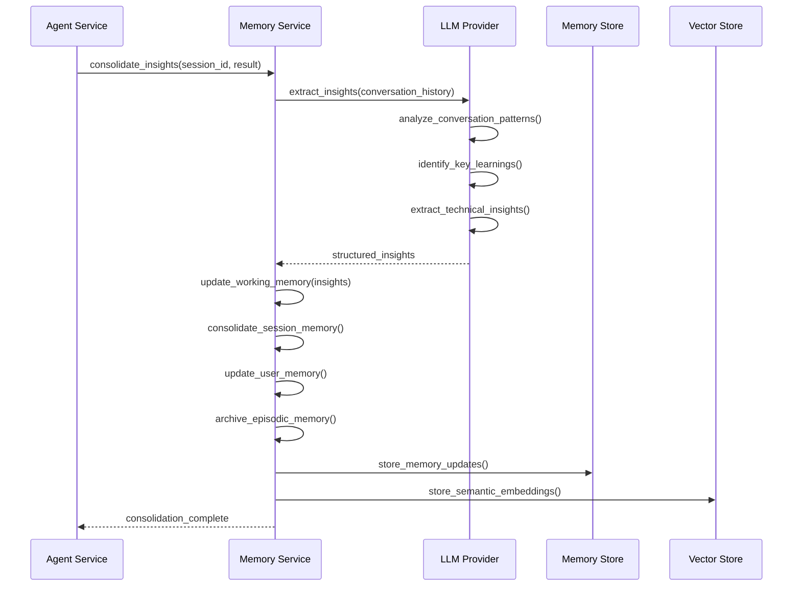
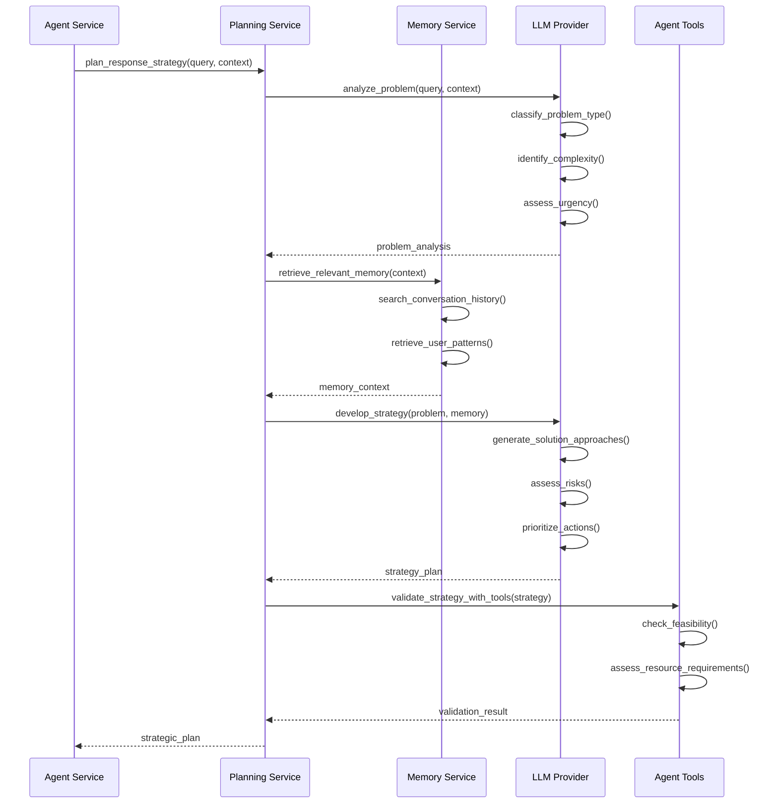

# Component Interaction Patterns v2.0

This document details the interaction patterns between components in the FaultMaven system, showing how data flows through the architecture for different use cases. The system now features advanced intelligent communication capabilities including memory management, strategic planning, and dynamic prompting.

## Intelligent Agent Query Processing Flow

The core troubleshooting workflow demonstrates how the AI agent processes user queries through multiple layers with memory, planning, and context awareness.

## Enhanced Data Ingestion Flow

Shows how uploaded files are processed through the data pipeline with classification, security, and memory integration.

## Enhanced Knowledge Base Document Ingestion

Demonstrates how documents are processed and stored in the vector database for RAG operations with memory integration.

## Enhanced Session Management Lifecycle

Shows how user sessions are created, maintained, and cleaned up across the system with memory integration.

## Enhanced Error Handling and Recovery Flow

Demonstrates how errors are detected, contextualized, and recovered across the system with memory integration.

## Enhanced LLM Provider Failover Flow

Shows how the system handles LLM provider failures with automatic failover, caching, and memory-aware prompt optimization.

## Enhanced Performance Monitoring Flow

Demonstrates how performance metrics are collected and monitored across all system components with memory and planning analytics.

## Enhanced Health Monitoring and SLA Tracking

Shows how component health is continuously monitored and SLA compliance is tracked with memory and planning system integration.

```mermaid
sequenceDiagram
    participant Scheduler as Health Scheduler
    participant Monitor as Component Monitor
    participant Redis as Redis
    participant ChromaDB as ChromaDB
    participant Presidio as Presidio Service
    participant LLM as LLM Providers
    participant Memory as Memory System
    participant Planning as Planning System
    participant SLA as SLA Tracker
    participant Alert as Alert Manager
    
    %% Continuous Health Monitoring
    loop Every 30 seconds
        Scheduler->>Monitor: trigger_health_check_cycle()
        
        %% Check Each Component
        par Component Health Checks
            Monitor->>Redis: health_check()
            Redis-->>Monitor: health_result(response_time, status)
            
            Monitor->>ChromaDB: health_check()
            ChromaDB-->>Monitor: health_result(response_time, status)
            
            Monitor->>Presidio: health_check()
            Presidio-->>Monitor: health_result(response_time, status)
            
            Monitor->>LLM: health_check_all_providers()
            LLM-->>Monitor: provider_health_results[]
            
            %% Memory System Health
            Monitor->>Memory: health_check()
            Memory->>Memory: check_memory_operations()
            Memory->>Memory: validate_memory_integrity()
            Memory-->>Monitor: memory_health_result
            
            %% Planning System Health
            Monitor->>Planning: health_check()
            Planning->>Planning: check_planning_operations()
            Planning->>Planning: validate_planning_integrity()
            Planning-->>Monitor: planning_health_result
        end
        
        %% Process Health Results
        Monitor->>Monitor: aggregate_health_results()
        Monitor->>Monitor: calculate_overall_system_health()
        
        %% Enhanced SLA Tracking
        Monitor->>SLA: record_health_measurements(component_results)
        SLA->>SLA: update_availability_metrics()
        SLA->>SLA: calculate_response_time_percentiles()
        SLA->>SLA: check_sla_violations()
        SLA->>SLA: track_memory_performance_sla()
        SLA->>SLA: track_planning_performance_sla()
        
        alt SLA Violation Detected
            SLA->>SLA: record_sla_breach(component, metric, threshold)
            SLA->>Alert: trigger_sla_violation_alert()
            
            Alert->>Alert: evaluate_alert_severity()
            Alert->>Alert: check_escalation_rules()
            Alert->>Alert: send_sla_notification()
        end
        
        %% Component-Specific Actions with Memory and Planning
        loop For each component
            alt Component Degraded
                Monitor->>Monitor: record_degradation_event()
                Monitor->>Monitor: check_dependency_impact()
                
                alt Critical Dependency
                    Monitor->>Alert: trigger_critical_component_alert()
                end
                
                %% Memory and Planning Degradation Handling
                alt Memory System Degraded
                    Monitor->>Memory: initiate_degradation_recovery()
                    Memory->>Memory: switch_to_fallback_mode()
                    Monitor->>Alert: trigger_memory_degradation_alert()
                end
                
                alt Planning System Degraded
                    Monitor->>Planning: initiate_degradation_recovery()
                    Planning->>Planning: switch_to_fallback_mode()
                    Monitor->>Alert: trigger_planning_degradation_alert()
                end
            else Component Recovered
                Monitor->>Monitor: record_recovery_event()
                Monitor->>SLA: update_recovery_metrics()
                
                %% Memory and Planning Recovery
                alt Memory System Recovered
                    Monitor->>Memory: restore_full_functionality()
                    Monitor->>Alert: resolve_memory_degradation_alert()
                end
                
                alt Planning System Recovered
                    Monitor->>Planning: restore_full_functionality()
                    Monitor->>Alert: resolve_planning_degradation_alert()
                end
            end
        end
        
        %% Enhanced Health Status Publication
        Monitor->>Monitor: publish_health_status()
        Monitor->>SLA: publish_sla_metrics()
        Monitor->>Memory: publish_memory_health_status()
        Monitor->>Planning: publish_planning_health_status()
    end
    
    %% Enhanced SLA Reporting
    par SLA Reporting
        loop Every Hour
            SLA->>SLA: generate_hourly_sla_report()
            SLA->>SLA: calculate_trending_metrics()
            SLA->>SLA: identify_performance_patterns()
            SLA->>SLA: analyze_memory_performance_trends()
            SLA->>SLA: analyze_planning_performance_trends()
        end
        
        loop Every Day
            SLA->>SLA: generate_daily_sla_summary()
            SLA->>SLA: calculate_availability_percentage()
            SLA->>SLA: generate_performance_recommendations()
            SLA->>SLA: generate_memory_optimization_recommendations()
            SLA->>SLA: generate_planning_optimization_recommendations()
        end
    end
    
    note over Scheduler,Alert: Continuous health monitoring with SLA compliance tracking, memory system integration, and planning system monitoring
```

## Memory and Planning System Interactions

### Memory Consolidation Flow

### Planning System Flow

## Inter-Component Communication Patterns

### Synchronous Communication
- **HTTP REST APIs**: Client-server communication with request/response pattern
- **Direct Method Calls**: In-process communication between layers via dependency injection
- **Database Queries**: Synchronous data retrieval with connection pooling
- **Memory Operations**: Synchronous memory retrieval and context building
- **Planning Operations**: Synchronous strategy development and validation

### Asynchronous Communication
- **Background Processing**: File processing and data ingestion in separate tasks
- **Event-Driven Updates**: Health monitoring and metrics collection
- **Batch Operations**: Session cleanup and maintenance operations
- **Memory Consolidation**: Background insight extraction and learning
- **Planning Optimization**: Background strategy refinement and improvement

### Error Propagation
- **Context Preservation**: Error context flows through all layers with correlation IDs
- **Memory Integration**: Error patterns are stored and analyzed for future prevention
- **Graceful Degradation**: System continues operating with reduced functionality during failures
- **Circuit Breaker Pattern**: Automatic failover and recovery for external services
- **Planning Fallbacks**: Alternative strategies when primary planning fails

### Performance Optimization
- **Caching Layers**: Multiple levels of caching for improved response times
- **Memory Caching**: Hierarchical memory caching with semantic search
- **Planning Caching**: Strategy caching with problem similarity
- **Connection Pooling**: Efficient resource utilization for external services
- **Lazy Loading**: On-demand initialization of expensive resources
- **Memory Optimization**: Automatic memory cleanup and relevance scoring

### Memory-Aware Communication
- **Context Injection**: Memory context automatically injected into all operations
- **Pattern Recognition**: Communication patterns analyzed and optimized
- **User Adaptation**: Communication style adapted based on user memory
- **Learning Integration**: All interactions contribute to system learning
- **Predictive Communication**: Anticipate user needs based on memory patterns

### Planning-Driven Communication
- **Strategic Responses**: All responses guided by strategic planning
- **Context-Aware Planning**: Planning considers full conversation context
- **Adaptive Strategies**: Strategies evolve based on user feedback
- **Risk-Aware Communication**: Communication considers potential risks
- **Success Metrics**: Communication effectiveness measured and optimized

These enhanced interaction patterns demonstrate how FaultMaven maintains high availability, performance, and reliability through sophisticated error handling, monitoring, recovery mechanisms, and intelligent communication capabilities. The system now features memory-aware processing, strategic planning, and continuous learning that make it truly intelligent and adaptive.