# Critical Concepts and Relationships: Session, Client, User, and Case

**Version:** 1.0
**Date:** 2025-09-27
**Purpose:** Define foundational concepts that both frontend and backend must understand identically

## Overview

This document establishes the authoritative definitions for the core concepts in FaultMaven's architecture: **Session**, **Client**, **User**, and **Case**. These concepts are foundational to the system's design and **must be understood identically by both frontend and backend teams** to prevent architectural violations and API contract issues.

## Core Definitions

### 1. **User**
- **Definition**: A person who uses FaultMaven for troubleshooting
- **Identifier**: `user_id` (string)
- **Persistence**: Permanent entity in the system
- **Ownership**: Users **own** cases directly

### 2. **Client**
- **Definition**: A specific device/browser instance from which a user accesses FaultMaven
- **Identifier**: `client_id` (UUID v4, persisted in localStorage)
- **Examples**:
  - User's work laptop browser
  - User's personal desktop browser
  - User's mobile device browser
- **Persistence**: Persists across browser sessions via localStorage
- **Purpose**: Enables session resumption and multi-device support

### 3. **Session**
- **Definition**: An authenticated connection between a specific user and client
- **Identifier**: `session_id` (UUID v4)
- **Formula**: `Session = User + Client + Authentication Context`
- **Purpose**: Provides authentication and temporary state management
- **Lifecycle**: Temporary (configurable TTL, typically 30 minutes to 24 hours)

### 4. **Case**
- **Definition**: A persistent troubleshooting investigation with conversation history
- **Identifier**: `case_id` (UUID v4)
- **Purpose**: Long-term investigation tracking and conversation persistence
- **Lifecycle**: Permanent (30+ days, can be archived)
- **Ownership**: Directly owned by users (`case.owner_id = user_id`)

## Relationships

### Direct Relationships

```mermaid
graph TB
    User[👤 User] -->|owns| Case[📁 Case]
    User[👤 User] -->|authenticates via| Client[💻 Client]
    Client[💻 Client] -->|creates| Session[🔒 Session]

    classDef user fill:#e3f2fd
    classDef client fill:#f3e5f5
    classDef session fill:#e8f5e8
    classDef case fill:#fff3e0

    class User user
    class Client client
    class Session session
    class Case case
```



1. **User ↔ Case**: Users directly own cases
   - `case.owner_id = user_id`
   - One user can have multiple cases
   - Cases persist beyond session lifecycle

2. **User ↔ Client**: Users authenticate via specific clients
   - `(user_id, client_id)` combination is unique
   - Multiple clients per user supported (multi-device)
   - Client persists across browser restarts

3. **Client ↔ Session**: Clients create sessions for authentication
   - `session = f(user_id, client_id, auth_context)`
   - One active session per (user, client) pair
   - Session provides authentication context

### Indirect Relationships

```mermaid
graph TB
    Session[🔒 Session] -.->|authenticates| User[👤 User]
    User[👤 User] -->|owns| Case[📁 Case]
    Session[🔒 Session] -.->|can access| Case[📁 Case]

    classDef direct stroke:#2196F3,stroke-width:3px
    classDef indirect stroke:#FF9800,stroke-width:2px,stroke-dasharray: 5 5

    class User,Case direct
    class Session indirect
```



1. **Session ↔ Case**: Indirect relationship through user ownership
   - Sessions authenticate users
   - Authenticated users can access their cases
   - **Formula**: `Session → User → User's Cases`

## Implementation Patterns

### Session Management

```typescript
// Frontend: Client ID Generation and Persistence
class ClientSessionManager {
  private static getClientId(): string {
    let clientId = localStorage.getItem('faultmaven_client_id');
    if (!clientId) {
      clientId = crypto.randomUUID();
      localStorage.setItem('faultmaven_client_id', clientId);
    }
    return clientId;
  }

  static async createSession(userId: string): Promise<SessionResponse> {
    const response = await fetch('/api/v1/sessions', {
      method: 'POST',
      body: JSON.stringify({
        client_id: this.getClientId(),  // Persistent client identifier
        timeout_minutes: 30
      })
    });
    return response.json();
  }
}
```

```python
# Backend: Session Creation with Client Binding
async def create_session(
    user_id: str,
    client_id: Optional[str] = None
) -> Session:
    # Try to resume existing session for this (user, client) pair
    if client_id and user_id:
        existing_session_id = await session_store.find_by_user_and_client(
            user_id, client_id
        )
        if existing_session_id:
            return await session_store.get_session(existing_session_id)

    # Create new session bound to (user, client)
    session = Session(
        session_id=str(uuid4()),
        user_id=user_id,
        client_id=client_id,
        created_at=datetime.utcnow()
    )

    # Index by (user_id, client_id) for resumption
    if client_id:
        await session_store.create_client_index(user_id, client_id, session.session_id)

    return session
```

### Case Access Control

```python
# Backend: Session-Based Case Access
@router.get("/api/v1/sessions/{session_id}/cases")
async def get_session_cases(
    session_id: str,
    current_user: DevUser = Depends(require_authentication)
):
    """
    Get user's cases accessible via this session's authentication.

    Architecture:
    Session → User → User's Cases (indirect relationship)
    """
    # Session provides authentication context → User ID
    user_id = current_user.user_id

    # Return all cases owned by the authenticated user
    user_cases = await case_service.list_user_cases(user_id, filters)

    # No additional filtering needed - session authenticates access to all user's cases
    return CaseConverter.entities_to_api_list(user_cases)
```

### Multi-Session Support

```mermaid
sequenceDiagram
    participant U as User
    participant L as Laptop Browser
    participant M as Mobile Browser
    participant B as Backend
    participant R as Redis

    Note over U,R: Multi-Device Session Management

    U->>L: Login from laptop
    L->>B: POST /sessions {client_id: "laptop-uuid"}
    B->>R: Store (user_id, laptop-uuid) → session_1
    B-->>L: session_1

    U->>M: Login from mobile
    M->>B: POST /sessions {client_id: "mobile-uuid"}
    B->>R: Store (user_id, mobile-uuid) → session_2
    B-->>M: session_2

    Note over L,M: Both sessions active simultaneously

    L->>B: GET /sessions/session_1/cases
    B->>R: session_1 → user_id → user's cases
    B-->>L: User's cases

    M->>B: GET /sessions/session_2/cases
    B->>R: session_2 → user_id → user's cases
    B-->>M: Same user's cases

    Note over U,R: Same cases accessible from both devices
```



## API Consistency Requirements

### Endpoint Behavior Specification

Both case-access endpoints **MUST** return identical results for the same user:

```http
GET /api/v1/cases
Authorization: Bearer <token>

GET /api/v1/sessions/{session_id}/cases
Authorization: Bearer <token>
```

**Expected Behavior**:
- Both endpoints authenticate the same user
- Both return the same set of cases (owned by that user)
- Both return `session_id: null` in case objects (cases not bound to sessions)
- Both apply the same filtering, pagination, and sorting

### Data Model Consistency

```typescript
// API Response Model (consistent across endpoints)
interface CaseAPI {
  case_id: string;
  title: string;
  status: CaseStatus;
  priority: CasePriority;
  owner_id: string;           // User who owns the case
  session_id: null;           // Always null - cases not bound to sessions
  created_at: string;         // ISO 8601 UTC
  updated_at: string;         // ISO 8601 UTC
  message_count: number;
}
```

## Common Anti-Patterns (AVOID)

### ❌ **Case-Session Binding**
```python
# WRONG: Trying to bind cases to specific sessions
class Case:
    session_ids: Set[str]           # ❌ Violates architecture
    current_session_id: str         # ❌ Cases aren't session-specific

# WRONG: Filtering cases by session binding
session_cases = [
    case for case in user_cases
    if session_id in case.session_ids  # ❌ Incorrect relationship
]
```

### ❌ **Session-Independent Cases**
```python
# WRONG: Cases that exist without user context
class Case:
    owner_id: Optional[str] = None  # ❌ Cases must have owners
```

### ❌ **Single Session Per User**
```python
# WRONG: Replacing existing sessions
async def create_session(user_id: str):
    # Delete any existing sessions for user  # ❌ Prevents multi-device
    await session_store.delete_user_sessions(user_id)
    return new_session
```

## Correct Patterns (FOLLOW)

### ✅ **Proper Session Management**
```python
# CORRECT: Multi-session support with client binding
async def create_session(user_id: str, client_id: str) -> Session:
    # Check for existing session for this (user, client) pair
    existing = await session_store.find_by_user_and_client(user_id, client_id)
    if existing:
        return await session_store.get_session(existing)  # Resume

    # Create new session for this specific client
    return await session_store.create_session(user_id, client_id)
```

### ✅ **Proper Case Architecture**
```python
# CORRECT: Cases owned by users, accessed via session authentication
class Case:
    case_id: str
    title: str
    owner_id: str                   # ✅ Direct user ownership
    # No session-binding fields     # ✅ Clean architecture

# CORRECT: Session-based case access
async def get_user_cases_via_session(session_id: str) -> List[Case]:
    user_id = await session_store.get_user_id(session_id)  # Session → User
    return await case_store.get_cases_by_owner(user_id)     # User → Cases
```

### ✅ **Proper Frontend Integration**
```typescript
// CORRECT: Client-based session management
class FaultMavenClient {
  private clientId = this.getOrCreateClientId();

  async createSession(): Promise<Session> {
    const response = await fetch('/api/v1/sessions', {
      method: 'POST',
      body: JSON.stringify({
        client_id: this.clientId  // ✅ Enable session resumption
      })
    });

    const session = await response.json();
    if (session.session_resumed) {
      console.log('Resumed existing session');  // ✅ Handle resumption
    }
    return session;
  }

  async getUserCases(): Promise<Case[]> {
    // Both endpoints return identical results
    const endpoint = this.sessionId
      ? `/api/v1/sessions/${this.sessionId}/cases`   // Via session auth
      : '/api/v1/cases';                             // Direct auth

    const response = await fetch(endpoint, {
      headers: { Authorization: `Bearer ${this.token}` }
    });
    return response.json();
  }
}
```

## Testing Verification

### Frontend Testing Checklist

```typescript
describe('Session-Case Relationship', () => {
  test('should return identical cases from both endpoints', async () => {
    const directCases = await client.getUserCases();
    const sessionCases = await client.getSessionCases(sessionId);

    expect(directCases).toEqual(sessionCases);  // ✅ Must be identical
  });

  test('should support multi-device sessions', async () => {
    const session1 = await client1.createSession(); // Device 1
    const session2 = await client2.createSession(); // Device 2

    expect(session1.session_id).not.toBe(session2.session_id); // ✅ Different sessions

    const cases1 = await client1.getSessionCases(session1.session_id);
    const cases2 = await client2.getSessionCases(session2.session_id);

    expect(cases1).toEqual(cases2);  // ✅ Same user's cases from both devices
  });

  test('should resume sessions with same client_id', async () => {
    const session1 = await client.createSession();
    // Simulate browser restart
    const session2 = await client.createSession(); // Same client_id

    expect(session1.session_id).toBe(session2.session_id);  // ✅ Session resumed
    expect(session2.session_resumed).toBe(true);
  });
});
```

### Backend Testing Checklist

```python
async def test_session_case_architecture():
    """Test correct session-case relationships"""
    user_id = "user123"
    client_id_1 = "device1"
    client_id_2 = "device2"

    # Create sessions for different devices
    session1 = await session_service.create_session(user_id, client_id_1)
    session2 = await session_service.create_session(user_id, client_id_2)

    assert session1.session_id != session2.session_id  # Different sessions
    assert session1.user_id == session2.user_id        # Same user

    # Create case owned by user
    case = await case_service.create_case(
        title="Test Case",
        owner_id=user_id  # Direct ownership
    )

    # Both sessions should access the same user's cases
    cases_via_session1 = await case_service.get_session_cases(session1.session_id)
    cases_via_session2 = await case_service.get_session_cases(session2.session_id)

    assert cases_via_session1 == cases_via_session2  # Identical results
    assert case.case_id in [c.case_id for c in cases_via_session1]
```

## Migration Guide

### From Incorrect Implementation

If you currently have session-bound cases, follow this migration:

1. **Remove Session Binding Fields**:
```python
# Remove these fields from Case model
- session_ids: Set[str]
- current_session_id: str
```

2. **Update Case Store**:
```python
# Remove session tracking logic
- session tracking in save/load operations
- session filtering in list operations
```

3. **Fix API Endpoints**:
```python
# Change session cases endpoint from:
session_cases = filter_cases_by_session(user_cases, session_id)  # ❌
# To:
session_cases = user_cases  # ✅ Session provides auth, returns user's cases
```

4. **Update Frontend**:
```typescript
// Ensure consistent API consumption
const cases = await fetch('/api/v1/cases');  // Direct
const sessionCases = await fetch(`/api/v1/sessions/${sessionId}/cases`);  // Via session
// Both should return identical results
```

## Conclusion

These concepts form the foundation of FaultMaven's architecture:

- **Sessions** provide authentication context tied to specific user-client pairs
- **Cases** are permanent resources owned directly by users
- **The relationship is indirect**: Session → User → User's Cases
- **Multiple concurrent sessions** per user are supported (multi-device)
- **Session resumption** is enabled through persistent client IDs

Both frontend and backend teams must implement these concepts consistently to ensure proper system operation and prevent architectural violations.

## References

- [SESSION_CLIENT_ID_INTEGRATION.md](../api/SESSION_CLIENT_ID_INTEGRATION.md) - Technical implementation details
- [SYSTEM_ARCHITECTURE.md](./SYSTEM_ARCHITECTURE.md) - Overall system architecture
- [CASE_MANAGEMENT_COMPONENTS.md](../../faultmaven-copilot/CASE_MANAGEMENT_COMPONENTS.md) - Frontend component architecture

---

**This document is authoritative** - any implementation that deviates from these definitions should be considered incorrect and require refactoring.