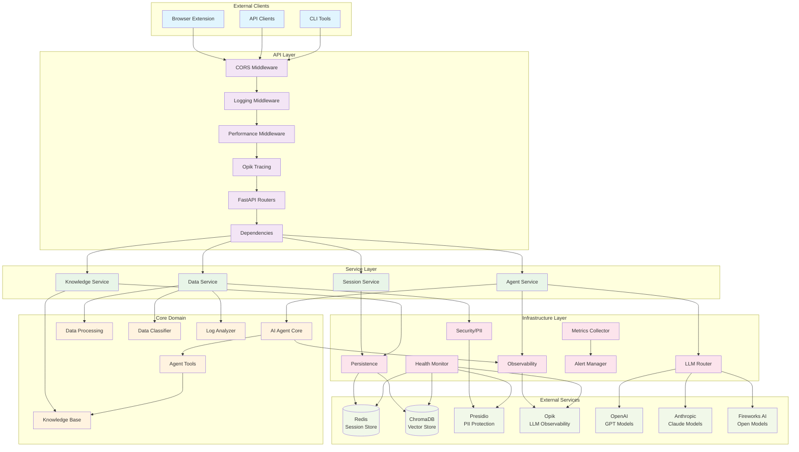
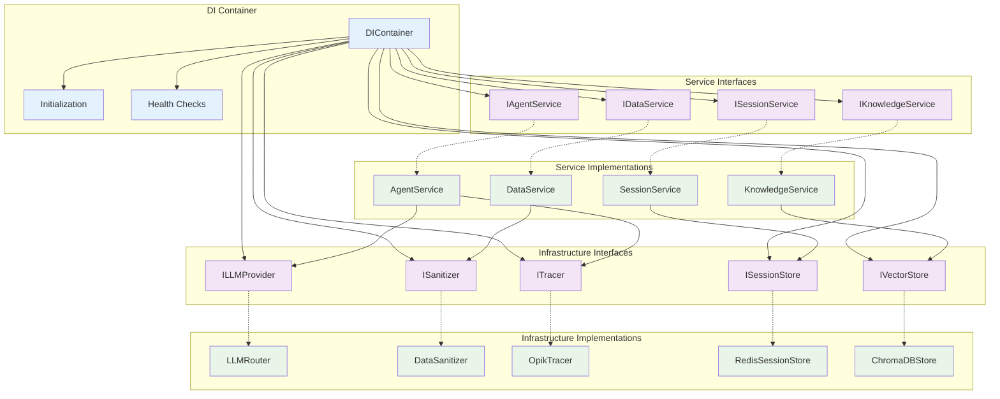
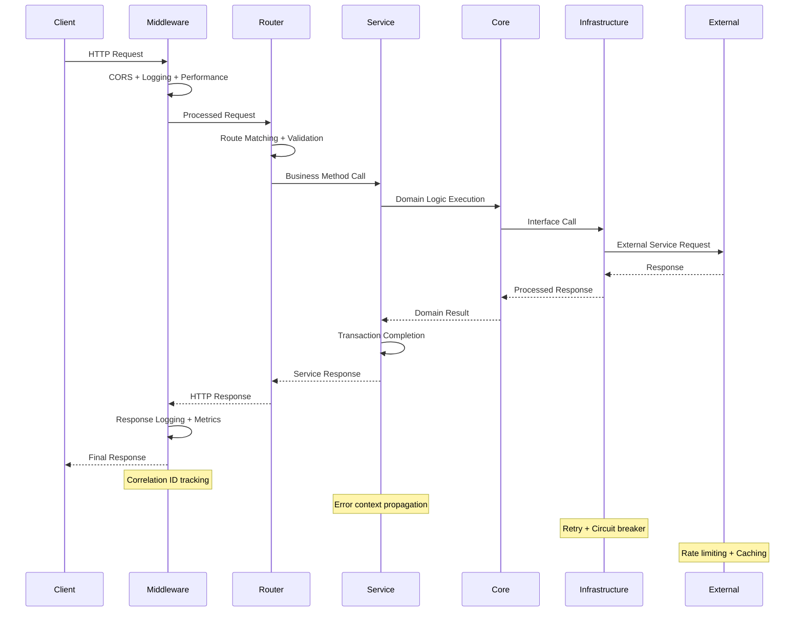

# FaultMaven System Architecture

## Overview

FaultMaven implements a sophisticated clean architecture pattern with dependency injection, interface-based design, and comprehensive observability. The system is designed as a privacy-first, AI-powered troubleshooting assistant that scales horizontally and integrates seamlessly with existing DevOps toolchains.

## Architecture Diagram



## Layer Responsibilities

### API Layer
**Purpose**: Handle HTTP requests and responses with comprehensive middleware processing

**Components**:
- **CORS Middleware**: Cross-origin resource sharing for browser extension compatibility
- **Logging Middleware**: Unified request/response logging with correlation IDs
- **Performance Middleware**: Real-time performance tracking and metrics collection
- **Opik Tracing**: LLM operation tracing and observability
- **FastAPI Routers**: RESTful endpoint handlers with OpenAPI documentation
- **Dependencies**: Dependency injection and request context management

**Key Files**:
- `faultmaven/api/v1/routes/` - Endpoint implementations
- `faultmaven/api/middleware/` - Middleware implementations
- `faultmaven/api/v1/dependencies.py` - DI configuration

### Service Layer  
**Purpose**: Business logic orchestration and transaction management

**Components**:
- **Agent Service**: AI reasoning workflow orchestration
- **Data Service**: File upload and data processing coordination
- **Knowledge Service**: Document ingestion and retrieval management
- **Session Service**: Multi-turn conversation state management

**Key Files**:
- `faultmaven/services/agent_service.py` - AI agent orchestration
- `faultmaven/services/data_service.py` - Data processing workflows
- `faultmaven/services/knowledge_service.py` - Knowledge base operations
- `faultmaven/services/session_service.py` - Session lifecycle management

**Design Patterns**:
- Interface-based dependency injection
- Transaction boundary management
- Error context propagation
- Async/await throughout

### Core Domain
**Purpose**: Core business logic and domain models

**Components**:
- **AI Agent Core**: Multi-phase troubleshooting reasoning engine
- **Data Processing**: Log analysis and insight extraction
- **Knowledge Base**: RAG-enabled document retrieval
- **Agent Tools**: Knowledge search and web search capabilities
- **Data Classifier**: Automatic file type and content detection
- **Log Analyzer**: Structured log parsing and anomaly detection

**Key Files**:
- `faultmaven/core/agent/` - AI reasoning engine
- `faultmaven/core/processing/` - Data analysis algorithms
- `faultmaven/core/knowledge/` - Knowledge management
- `faultmaven/tools/` - Agent tool implementations

**AI Reasoning Doctrine**:
1. **Define Blast Radius** - Scope impact assessment
2. **Establish Timeline** - Temporal analysis
3. **Formulate Hypothesis** - Root cause theories
4. **Validate Hypothesis** - Evidence gathering
5. **Propose Solution** - Actionable recommendations

### Infrastructure Layer
**Purpose**: External service integrations and cross-cutting concerns

**Components**:
- **LLM Router**: Multi-provider routing with failover and caching
- **Security/PII**: Data sanitization and privacy protection
- **Observability**: Comprehensive tracing and metrics collection
- **Persistence**: Database abstraction and session storage
- **Health Monitor**: Component health checking and SLA tracking
- **Metrics Collector**: Performance metrics aggregation
- **Alert Manager**: Real-time alerting and notification

**Key Files**:
- `faultmaven/infrastructure/llm/` - LLM provider implementations
- `faultmaven/infrastructure/security/` - PII redaction and sanitization
- `faultmaven/infrastructure/observability/` - Tracing and metrics
- `faultmaven/infrastructure/persistence/` - Data storage abstractions
- `faultmaven/infrastructure/health/` - Health monitoring
- `faultmaven/infrastructure/monitoring/` - Performance monitoring

## Dependency Injection Architecture



## Data Flow Architecture



## Key Design Patterns

### 1. Interface Segregation Principle
Every dependency is injected as an interface, enabling:
- Easy testing with mocks
- Runtime provider swapping
- Zero-downtime deployments
- Clean separation of concerns

```python
# Example: LLM Provider Interface
class ILLMProvider(ABC):
    @abstractmethod
    async def generate_response(self, prompt: str, **kwargs) -> str:
        pass
    
    @abstractmethod
    async def get_embedding(self, text: str) -> List[float]:
        pass
```

### 2. Dependency Inversion Principle
High-level modules depend on abstractions, not concretions:

```python
# Service depends on interface, not implementation
class AgentService:
    def __init__(self, llm_provider: ILLMProvider, tracer: ITracer):
        self._llm = llm_provider  # Interface
        self._tracer = tracer    # Interface
```

### 3. Command Query Separation
Clear separation between commands (state changes) and queries:

```python
# Query - read-only operation
async def get_session_info(session_id: str) -> SessionInfo

# Command - state-changing operation  
async def create_session(metadata: dict) -> str
```

### 4. Single Responsibility Principle
Each component has one well-defined responsibility:

- **Agent Service**: Orchestrates AI reasoning workflows
- **Data Service**: Manages file upload and processing
- **Knowledge Service**: Handles document ingestion and retrieval
- **Session Service**: Manages conversation state

### 5. Error Context Propagation
Comprehensive error context flows through all layers:

```python
# Error context with automatic recovery
try:
    result = await service.process_request(data)
except ServiceException as e:
    error_context.add_layer_error("service", e)
    recovery_result = await error_recovery.attempt_recovery()
    if recovery_result.success:
        return recovery_result.data
    raise
```

## Performance Characteristics

### Response Time Targets
- **API Endpoints**: < 200ms (excluding LLM processing)
- **File Upload**: < 5s for files up to 10MB
- **Knowledge Search**: < 100ms for vector similarity
- **Session Operations**: < 50ms for state management
- **Health Checks**: < 10ms for component status

### Throughput Capabilities
- **Concurrent Requests**: 100+ simultaneous requests
- **Session Capacity**: 1000+ active sessions
- **File Processing**: 10+ concurrent uploads
- **Knowledge Base**: 10,000+ documents with sub-second search

### Memory Usage
- **Baseline**: ~200MB application memory
- **Per Session**: ~1-5MB depending on conversation history
- **File Processing**: ~2x file size during processing
- **ML Models**: ~500MB for BGE-M3 embeddings

### Storage Requirements
- **Session Data**: Redis with configurable TTL
- **Knowledge Base**: ChromaDB vector storage
- **File Uploads**: Temporary storage with automatic cleanup
- **Logs**: Structured JSON with log rotation

## Scalability Considerations

### Horizontal Scaling
- **Stateless Design**: All application state in external stores
- **Load Balancing**: Standard HTTP load balancers supported
- **Session Affinity**: Not required due to Redis-based sessions
- **Database Scaling**: ChromaDB and Redis both horizontally scalable

### Caching Strategy
- **LLM Response Caching**: Semantic similarity-based caching
- **Knowledge Base**: Vector similarity caching with embeddings
- **Session Data**: Redis-based distributed caching
- **File Processing**: Results cached by content hash

### Resource Management
- **Connection Pooling**: Configurable pool sizes for all external services
- **Rate Limiting**: Per-client and per-endpoint rate limiting
- **Circuit Breakers**: Automatic failover for external service failures
- **Backpressure**: Request queuing with overflow protection

### Monitoring and Observability
- **Distributed Tracing**: Full request tracing with Opik integration
- **Metrics Collection**: Real-time performance metrics
- **Health Monitoring**: Component-level health checks with SLA tracking
- **Alerting**: Configurable alerts for performance degradation

## Security Architecture

### Data Privacy
- **PII Redaction**: Automatic detection and redaction using Presidio
- **Data Sanitization**: All data sanitized before external processing
- **Encryption**: Data encrypted in transit and at rest
- **Audit Logging**: Comprehensive audit trail for all operations

### Authentication (Future)
- **API Key Authentication**: Planned for production deployment
- **JWT Tokens**: Support for bearer token authentication
- **Role-Based Access**: Planned RBAC implementation
- **Rate Limiting**: Per-authentication-context rate limiting

### Network Security
- **CORS Configuration**: Restrictive CORS policies for browser security
- **Input Validation**: Comprehensive input validation and sanitization
- **Output Encoding**: Safe output encoding to prevent injection attacks
- **Error Handling**: Safe error responses without information disclosure

## Deployment Architecture

### Container Strategy
- **Single Container**: Monolithic deployment for simplicity
- **Multi-Stage Build**: Optimized Docker images with dependency caching
- **Health Checks**: Container health checks for orchestration
- **Graceful Shutdown**: Proper signal handling for zero-downtime deployments

### External Dependencies
- **Redis**: Session storage and caching (required)
- **ChromaDB**: Vector database for knowledge base (required)
- **Presidio**: PII redaction service (required)
- **Opik**: LLM observability (optional)
- **LLM Providers**: OpenAI, Anthropic, or Fireworks AI (at least one required)

### Configuration Management
- **Environment Variables**: All configuration via environment variables
- **Configuration Validation**: Startup-time configuration validation
- **Feature Flags**: Runtime feature toggles for safe deployments
- **Secrets Management**: External secret injection support

### High Availability
- **Stateless Design**: Enables multiple instance deployment
- **External State**: All persistent state in external services
- **Health Monitoring**: Continuous health monitoring with automatic recovery
- **Circuit Breakers**: Automatic failover for external service outages

This architecture provides a robust, scalable, and maintainable foundation for the FaultMaven AI troubleshooting platform, with clear separation of concerns and comprehensive observability.