# FaultMaven System Architecture v2.0

## Overview

FaultMaven implements a sophisticated clean architecture pattern with dependency injection, interface-based design, and comprehensive observability. The system features a modern v3.1.0 schema-driven API that provides intent-driven responses, evidence-based troubleshooting, and structured state management. Designed as a privacy-first, AI-powered troubleshooting assistant that scales horizontally and integrates seamlessly with existing DevOps toolchains.

**Key Architectural Principles:**
- **7-Component Agentic Framework**: Modern AI agent architecture with Plan→Execute→Observe→Re-plan cycles
- **Interface-Based Dependencies**: Clean architecture with dependency injection and interface compliance
- **Multi-Dimensional Query Processing**: Intent, complexity, domain, and urgency classification
- **Persistent State Management**: Redis-backed conversation memory with execution planning
- **Comprehensive Security**: PII protection, guardrails, and policy enforcement
- **Enterprise-Grade Reliability**: Circuit breakers, error handling, and fallback strategies

## Architecture Diagram

```mermaid
graph TB
    subgraph "External Clients"
        BE[Browser Extension]
        API_CLIENT[API Clients]
        CURL[CLI Tools]
    end
    
    subgraph "API Layer"
        CORS[CORS Middleware]
        LOG[Logging Middleware]
        PERF[Performance Middleware]
        OPIK[Opik Tracing]
        ROUTE[FastAPI Routers]
        DEP[Dependencies]
    end
    
    subgraph "Service Layer"
        AS[Agent Service]
        DS[Data Service]
        KS[Knowledge Service]
        SS[Session Service]
    end
    
    subgraph "Agentic Framework"
        AWE[Business Logic & Workflow Engine]
        ASM[State & Session Manager]
        ACE[Query Classification Engine]
        ATB[Tool & Skill Broker]
        AGL[Guardrails & Policy Layer]
        ARS[Response Synthesizer]
        AEM[Error Handling & Fallback Manager]
    end
    
    subgraph "Core Domain"
        AGENT[AI Agent Core]
        PROC[Data Processing]
        KB[Knowledge Base]
        TOOLS[Agent Tools]
        CLASS[Data Classifier]
        LOG_ANALYZER[Log Analyzer]
        PROMPT[Prompt Engine]
    end
    
    subgraph "Infrastructure Layer"
        LLM[LLM Router]
        SEC[Security/PII]
        OBS[Observability]
        PERSIST[Persistence]
        HEALTH[Health Monitor]
        METRICS[Metrics Collector]
        ALERT[Alert Manager]
        CACHE[Memory Cache]
    end
    
    subgraph "External Services"
        REDIS[(Redis<br/>Session Store)]
        CHROMA[(ChromaDB<br/>Vector Store)]
        PRESIDIO[Presidio<br/>PII Protection]
        OPIK_SVC[Opik<br/>LLM Observability]
        OPENAI[OpenAI<br/>GPT Models]
        ANTHROPIC[Anthropic<br/>Claude Models]
        FIREWORKS[Fireworks AI<br/>Open Models]
    end
    
    %% Client connections
    BE --> CORS
    API_CLIENT --> CORS
    CURL --> CORS
    
    %% Middleware stack
    CORS --> LOG
    LOG --> PERF
    PERF --> OPIK
    OPIK --> ROUTE
    ROUTE --> DEP
    
    %% Service routing
    DEP --> AS
    DEP --> DS
    DEP --> KS
    DEP --> SS
    
    %% Core domain connections
    AS --> AGENT
    AS --> AWE
    DS --> PROC
    DS --> CLASS
    DS --> LOG_ANALYZER
    KS --> KB
    SS --> PERSIST
    
    %% Agentic framework connections
    AWE --> ASM
    AWE --> ACE
    AWE --> ATB
    AWE --> AGL
    AWE --> ARS
    AWE --> AEM
    ASM --> CACHE
    
    %% Agent tools
    AGENT --> TOOLS
    TOOLS --> KB
    
    %% Infrastructure connections
    AS --> LLM
    AS --> OBS
    DS --> SEC
    KS --> PERSIST
    AGENT --> OBS
    AWE --> LLM
    AWE --> OBS
    ASM --> PERSIST
    ACE --> LLM
    ATB --> KB
    AGL --> SEC
    ARS --> LLM
    
    %% External service connections
    LLM --> OPENAI
    LLM --> ANTHROPIC
    LLM --> FIREWORKS
    SEC --> PRESIDIO
    OBS --> OPIK_SVC
    PERSIST --> REDIS
    PERSIST --> CHROMA
    CACHE --> REDIS
    
    %% Health and monitoring
    HEALTH --> REDIS
    HEALTH --> CHROMA
    HEALTH --> PRESIDIO
    HEALTH --> OPIK_SVC
    METRICS --> ALERT
    
    %% Styling
    classDef external fill:#e1f5fe
    classDef api fill:#f3e5f5
    classDef service fill:#e8f5e8
    classDef core fill:#fff3e0
    classDef infra fill:#fce4ec
    classDef storage fill:#f1f8e9
    
    class BE,API_CLIENT,CURL external
    class CORS,LOG,PERF,OPIK,ROUTE,DEP api
    class AS,DS,KS,SS service
    class AWE,ASM,ACE,ATB,AGL,ARS,AEM agentic
    class AGENT,PROC,KB,TOOLS,CLASS,LOG_ANALYZER core
    class LLM,SEC,OBS,PERSIST,HEALTH,METRICS,ALERT,CACHE infra
    class REDIS,CHROMA,PRESIDIO,OPIK_SVC,OPENAI,ANTHROPIC,FIREWORKS storage
```



## Layer Responsibilities

### API Layer
**Purpose**: Handle HTTP requests and responses with comprehensive middleware processing

**Components**:
- **CORS Middleware**: Cross-origin resource sharing for browser extension compatibility
- **Logging Middleware**: Unified request/response logging with correlation IDs and context extraction
- **Performance Middleware**: Real-time performance tracking and metrics collection
- **Opik Tracing**: LLM operation tracing and observability
- **FastAPI Routers**: RESTful endpoint handlers with OpenAPI documentation
- **Dependencies**: Dependency injection and request context management

**Key Files**:
- `faultmaven/api/v1/routes/` - Endpoint implementations
- `faultmaven/api/middleware/` - Middleware implementations
- `faultmaven/api/v1/dependencies.py` - DI configuration

**Advanced Features**:
- **Context-Aware Logging**: Automatic extraction of session_id and conversation context
- **Performance Profiling**: Detailed timing analysis for optimization
- **Request Correlation**: End-to-end request tracking across all layers

### Service Layer  
**Purpose**: Business logic orchestration and transaction management

**Components**:
- **Agent Service**: AI reasoning workflow orchestration with agentic framework integration
- **Data Service**: File upload and data processing coordination
- **Knowledge Service**: Document ingestion and retrieval management
- **Session Service**: Multi-turn conversation state management

**Key Files**:
- `faultmaven/services/agent.py` - AI agent orchestration
- `faultmaven/services/data.py` - Data processing workflows
- `faultmaven/services/knowledge.py` - Knowledge base operations
- `faultmaven/services/session.py` - Session lifecycle management

### Agentic Framework
**Purpose**: Modern 7-component AI agent architecture implementing Plan→Execute→Observe→Re-plan cycles

**Components**:
- **Business Logic & Workflow Engine**: Main orchestrator managing all agentic components
- **State & Session Manager**: Persistent memory backbone with execution planning
- **Query Classification Engine**: Multi-dimensional query analysis (intent, complexity, domain, urgency)
- **Tool & Skill Broker**: Dynamic capability discovery and orchestration
- **Guardrails & Policy Layer**: Multi-layer security validation and PII protection
- **Response Synthesizer**: Multi-source response assembly with quality validation
- **Error Handling & Fallback Manager**: Comprehensive error recovery with circuit breakers

**Key Files**:
- `faultmaven/services/agentic/workflow_engine.py` - Main orchestrator
- `faultmaven/services/agentic/state_manager.py` - Memory and state management
- `faultmaven/services/agentic/classification_engine.py` - Query processing
- `faultmaven/services/agentic/tool_broker.py` - Tool orchestration
- `faultmaven/services/agentic/guardrails_layer.py` - Security and validation
- `faultmaven/services/agentic/response_synthesizer.py` - Response assembly
- `faultmaven/services/agentic/error_manager.py` - Error handling
- `faultmaven/models/agentic.py` - Core interfaces and models

**Design Patterns**:
- Interface-based dependency injection
- Transaction boundary management
- Error context propagation
- Async/await throughout
- Memory-aware processing
- Planning-driven execution

### Core Domain
**Purpose**: Core business logic and domain models

**Components**:
- **AI Agent Core**: Multi-phase troubleshooting reasoning engine integrated with agentic framework
- **Data Processing**: Log analysis and insight extraction
- **Knowledge Base**: RAG-enabled document retrieval with semantic search
- **Agent Tools**: Knowledge search and web search capabilities  
- **Data Classifier**: Automatic file type and content detection
- **Log Analyzer**: Structured log parsing and anomaly detection

**Key Files**:
- `faultmaven/core/agent/` - AI reasoning engine
- `faultmaven/core/processing/` - Data analysis algorithms
- `faultmaven/core/knowledge/` - Knowledge management
- `faultmaven/tools/` - Agent tool implementations

**AI Reasoning Doctrine** (5-Phase SRE):
1. **Define Blast Radius** - Scope the impact and affected systems
2. **Establish Timeline** - Understand when issues started and progression
3. **Formulate Hypothesis** - Generate potential causes based on evidence
4. **Validate Hypothesis** - Test theories with additional evidence gathering
5. **Propose Solution** - Recommend fixes with risk assessment

### Infrastructure Layer
**Purpose**: External service integrations and cross-cutting concerns

**Components**:
- **LLM Router**: Multi-provider routing with failover and automatic provider selection
- **Security/PII**: Data sanitization and privacy protection with Presidio integration
- **Observability**: Comprehensive tracing and metrics collection with Opik integration
- **Persistence**: Database abstraction and session storage with Redis and ChromaDB
- **Health Monitor**: Component health checking and SLA tracking
- **Metrics Collector**: Performance metrics aggregation
- **Alert Manager**: Real-time alerting and notification
- **Cache**: Redis-backed caching for session and state management

**Key Files**:
- `faultmaven/infrastructure/llm/` - LLM provider implementations
- `faultmaven/infrastructure/security/` - PII redaction and sanitization
- `faultmaven/infrastructure/observability/` - Tracing and metrics
- `faultmaven/infrastructure/persistence/` - Data storage abstractions
- `faultmaven/infrastructure/health/` - Health monitoring
- `faultmaven/infrastructure/monitoring/` - Performance monitoring
- `faultmaven/infrastructure/memory/` - Memory storage and retrieval
- `faultmaven/infrastructure/redis_client.py` - Lightweight Redis client factory

**Architecture Principle**: Infrastructure layer differentiates between internal and external service clients:
- **Internal Infrastructure** (Redis session storage): Uses lightweight `create_redis_client()` for high-frequency operations
- **External Service Monitoring** (API calls, LLM providers): Uses comprehensive `BaseExternalClient` with full logging and monitoring

## Advanced Communication Architecture

### Memory Management System


**Memory Types**:
- **Working Memory**: Current conversation context (sliding window)
- **Session Memory**: Session-specific insights and learnings
- **User Memory**: Long-term user preferences and expertise patterns
- **Episodic Memory**: Past troubleshooting cases and resolutions

**Key Features**:
- **Semantic Embeddings**: Context-aware memory retrieval
- **Memory Consolidation**: LLM-powered insight extraction
- **Decay Mechanisms**: Time-based relevance scoring
- **Cross-Session Learning**: Persistent user understanding

### Advanced Prompting System


**Prompt Features**:
- **Multi-Layer Architecture**: Comprehensive instruction building
- **Dynamic Optimization**: Quality-based prompt improvement
- **Version Management**: A/B testing and performance tracking
- **Context Injection**: Memory-aware prompt enhancement

### Strategic Planning System


**Planning Features**:
- **Problem Decomposition**: LLM-powered problem breakdown
- **Strategic Planning**: Multi-phase solution development
- **Risk Assessment**: Comprehensive risk analysis and mitigation
- **Alternative Solutions**: Multiple approach evaluation

## Dependency Injection Architecture


## Data Flow Architecture


## v3.1.0 Schema Architecture

### Schema-Driven API Design

The v3.1.0 schema introduces a modern, intent-driven API architecture that provides structured responses with evidence attribution, state management, and intelligent communication:

```mermaid
graph TB
    subgraph "Client Layer"
        CLIENT[Browser Extension/API Client]
        REQUEST[QueryRequest]
    end
    
    subgraph "API Gateway"
        ENDPOINT[POST /api/v1/agent/query]
        VALIDATION[Request Validation]
        ROUTING[Route to AgentService]
    end
    
    subgraph "Service Processing"
        AGENT_SVC[AgentService.process_query]
        MEMORY[Memory Context Retrieval]
        PLANNING[Strategic Planning]
        SANITIZE[Data Sanitization]
        CASE_GEN[Case ID Generation]
        AI_PROCESSING[AI Agent Processing]
        RESPONSE_FORMAT[Response Formatting]
    end
    
    subgraph "Response Construction"
        CONTENT[Content Generation]
        RESPONSE_TYPE[ResponseType Determination]
        VIEW_STATE[ViewState Construction]
        SOURCES[Source Attribution]
        PLAN[Plan Generation (if applicable)]
        MEMORY_UPDATE[Memory Consolidation]
    end
    
    subgraph "v3.1.0 Response"
        SCHEMA_VER[schema_version: "3.1.0"]
        AGENT_RESPONSE[AgentResponse]
        CLIENT_UPDATE[Client State Update]
    end
    
    CLIENT --> REQUEST
    REQUEST --> ENDPOINT
    ENDPOINT --> VALIDATION
    VALIDATION --> ROUTING
    ROUTING --> AGENT_SVC
    
    AGENT_SVC --> MEMORY
    AGENT_SVC --> PLANNING
    AGENT_SVC --> SANITIZE
    AGENT_SVC --> CASE_GEN
    AGENT_SVC --> AI_PROCESSING
    AI_PROCESSING --> RESPONSE_FORMAT
    
    RESPONSE_FORMAT --> CONTENT
    RESPONSE_FORMAT --> RESPONSE_TYPE
    RESPONSE_FORMAT --> VIEW_STATE
    RESPONSE_FORMAT --> SOURCES
    RESPONSE_FORMAT --> PLAN
    RESPONSE_FORMAT --> MEMORY_UPDATE
    
    CONTENT --> SCHEMA_VER
    RESPONSE_TYPE --> SCHEMA_VER
    VIEW_STATE --> SCHEMA_VER
    SOURCES --> SCHEMA_VER
    PLAN --> SCHEMA_VER
    MEMORY_UPDATE --> SCHEMA_VER
    
    SCHEMA_VER --> AGENT_RESPONSE
    AGENT_RESPONSE --> CLIENT_UPDATE
```

### Core Schema Components

#### 1. Session vs Case Architecture


**Session Management**:
- **Purpose**: Temporary visitor context for browser sessions
- **Lifecycle**: Short-lived, expires after inactivity
- **Scope**: Multiple investigations within single user session
- **Storage**: Redis-backed with TTL
- **Memory Integration**: Automatic context consolidation and learning

**Case Management**:
- **Purpose**: Persistent investigation tracking
- **Lifecycle**: Long-lived, persists for audit and follow-up
- **Scope**: Single investigation from query to resolution
- **Storage**: Database-backed for persistence
- **Memory Integration**: Episodic memory for future reference

#### 2. Response Type Architecture


The ResponseType enum enables explicit intent communication:
- **ANSWER**: Direct response to user's question → Conversational UI
- **PLAN_PROPOSAL**: Multi-step troubleshooting plan → Structured action UI
- **CLARIFICATION_REQUEST**: Agent needs more information → Input form UI
- **CONFIRMATION_REQUEST**: Agent needs user approval → Confirmation dialog UI

#### 3. Evidence Attribution Architecture


**Source Types**:
- **knowledge_base**: From ingested documentation and runbooks
- **log_file**: From uploaded system logs and metrics
- **web_search**: From external research and documentation
- **memory_insights**: From previous conversation analysis

**Evidence Structure**:
```json
{
  "type": "knowledge_base",
  "name": "database_troubleshooting.md", 
  "snippet": "Connection pool exhaustion occurs when activeCount equals maxActive...",
  "relevance_score": 0.95,
  "confidence": 0.9
}
```

#### 4. ViewState Management Architecture

```mermaid
graph TB
    subgraph "ViewState Components"
        SESSION_ID[session_id]
        CASE_ID[case_id]
        SUMMARY[running_summary]
        UPLOADED[uploaded_data[]]
        MEMORY_CONTEXT[memory_context]
        PLANNING_STATE[planning_state]
    end
    
    subgraph "State Synchronization"
        BACKEND_STATE[Backend State]
        VIEW_STATE[ViewState Snapshot]
        FRONTEND_SYNC[Frontend Synchronization]
    end
    
    subgraph "Client Benefits"
        NO_EXTRA_CALLS[No Additional API Calls]
        CONSISTENT_UI[Consistent UI State]
        CONTEXT_PRESERVATION[Context Preservation]
        INTELLIGENT_UI[Intelligent UI Adaptation]
    end
    
    SESSION_ID --> VIEW_STATE
    CASE_ID --> VIEW_STATE
    SUMMARY --> VIEW_STATE
    UPLOADED --> VIEW_STATE
    MEMORY_CONTEXT --> VIEW_STATE
    PLANNING_STATE --> VIEW_STATE
    
    BACKEND_STATE --> VIEW_STATE
    VIEW_STATE --> FRONTEND_SYNC
    
    FRONTEND_SYNC --> NO_EXTRA_CALLS
    FRONTEND_SYNC --> CONSISTENT_UI
    FRONTEND_SYNC --> CONTEXT_PRESERVATION
    FRONTEND_SYNC --> INTELLIGENT_UI
```

ViewState eliminates the need for separate API calls by providing:
- **Current session context**: Active session identifier
- **Investigation tracking**: Case ID for persistent investigation
- **Progress summary**: Human-readable investigation status
- **Uploaded data context**: List of files available for analysis
- **Memory context**: Relevant conversation history and insights
- **Planning state**: Current troubleshooting strategy and progress

### Data Flow Architecture


### Schema Validation Architecture


**Validation Rules**:
- **Plan Consistency**: `plan` field only allowed for `PLAN_PROPOSAL` responses
- **Schema Version**: Always "3.1.0" for new responses
- **Required Fields**: All mandatory fields must be present and valid
- **Source Types**: Source type must match SourceType enum values
- **Memory Integration**: Memory context must be valid and accessible
- **Planning State**: Planning state must be consistent with response type

## Key Design Patterns

### 1. Interface Segregation Principle
Every dependency is injected as an interface, enabling:
- Easy testing with mocks
- Runtime provider swapping
- Zero-downtime deployments
- Clean separation of concerns

```python
# Example: Memory Service Interface
class IMemoryService(ABC):
    @abstractmethod
    async def retrieve_context(self, session_id: str, query: str) -> ConversationContext:
        pass
    
    @abstractmethod
    async def consolidate_insights(self, session_id: str, result: dict) -> bool:
        pass
    
    @abstractmethod
    async def get_user_profile(self, session_id: str) -> UserProfile:
        pass
```

### 2. Dependency Inversion Principle
High-level modules depend on abstractions, not concretions:

```python
# Service depends on interface, not implementation
class AgentService:
    def __init__(
        self, 
        llm_provider: ILLMProvider, 
        tracer: ITracer,
        memory_service: IMemoryService,
        planning_service: IPlanningService
    ):
        self._llm = llm_provider        # Interface
        self._tracer = tracer          # Interface
        self._memory = memory_service  # Interface
        self._planning = planning_service  # Interface
```

### 3. Command Query Separation
Clear separation between commands (state changes) and queries:

```python
# Query - read-only operation
async def get_session_info(session_id: str) -> SessionInfo

# Command - state-changing operation  
async def create_session(metadata: dict) -> str

# Memory operations
async def retrieve_context(session_id: str, query: str) -> ConversationContext  # Query
async def consolidate_insights(session_id: str, result: dict) -> bool          # Command
```

### 4. Single Responsibility Principle
Each component has one well-defined responsibility:

- **Agent Service**: Orchestrates AI reasoning workflows with memory and planning
- **Data Service**: Manages file upload and processing
- **Knowledge Service**: Handles document ingestion and retrieval
- **Session Service**: Manages conversation state
- **Memory Service**: Manages hierarchical memory and context consolidation
- **Planning Service**: Manages strategic planning and problem decomposition

### 5. Error Context Propagation
Comprehensive error context flows through all layers:

```python
# Error context with automatic recovery
try:
    result = await service.process_request(data)
except ServiceException as e:
    error_context.add_layer_error("service", e)
    error_context.add_memory_context(memory_service.get_context())
    recovery_result = await error_recovery.attempt_recovery()
    if recovery_result.success:
        return recovery_result.data
    raise
```

## Performance Characteristics

### Response Time Targets
- **API Endpoints**: < 200ms (excluding LLM processing)
- **Memory Retrieval**: < 50ms for context retrieval
- **Planning Operations**: < 100ms for strategy development
- **File Upload**: < 5s for files up to 10MB
- **Knowledge Search**: < 100ms for vector similarity
- **Session Operations**: < 50ms for state management
- **Health Checks**: < 10ms for component status

### Throughput Capabilities
- **Concurrent Requests**: 100+ simultaneous requests
- **Session Capacity**: 1000+ active sessions
- **Memory Operations**: 500+ concurrent memory operations
- **Planning Operations**: 200+ concurrent planning operations
- **File Processing**: 10+ concurrent uploads
- **Knowledge Base**: 10,000+ documents with sub-second search

### Memory Usage
- **Baseline**: ~300MB application memory
- **Per Session**: ~2-8MB depending on conversation history
- **Memory Cache**: ~100MB for active memory operations
- **File Processing**: ~2x file size during processing
- **ML Models**: ~500MB for BGE-M3 embeddings

### Storage Requirements
- **Session Data**: Redis with configurable TTL
- **Knowledge Base**: ChromaDB vector storage
- **Memory Storage**: Redis with semantic indexing
- **File Uploads**: Temporary storage with automatic cleanup
- **Logs**: Structured JSON with log rotation

## Scalability Considerations

### Horizontal Scaling
- **Stateless Design**: All application state in external stores
- **Load Balancing**: Standard HTTP load balancers supported
- **Session Affinity**: Not required due to Redis-based sessions
- **Memory Distribution**: Distributed memory caching across instances
- **Database Scaling**: ChromaDB and Redis both horizontally scalable

### Caching Strategy
- **LLM Response Caching**: Semantic similarity-based caching
- **Knowledge Base**: Vector similarity caching with embeddings
- **Session Data**: Redis-based distributed caching
- **Memory Cache**: Hierarchical caching with semantic search
- **Planning Cache**: Strategy caching with problem similarity
- **File Processing**: Results cached by content hash

### Resource Management
- **Connection Pooling**: Configurable pool sizes for all external services
- **Rate Limiting**: Per-client and per-endpoint rate limiting
- **Circuit Breakers**: Automatic failover for external service failures
- **Backpressure**: Request queuing with overflow protection
- **Memory Management**: Automatic memory cleanup and optimization

### Monitoring and Observability
- **Distributed Tracing**: Full request tracing with Opik integration
- **Metrics Collection**: Real-time performance metrics
- **Health Monitoring**: Component-level health checks with SLA tracking
- **Alerting**: Configurable alerts for performance degradation
- **Memory Analytics**: Memory usage and performance analytics
- **Planning Analytics**: Planning effectiveness and quality metrics

## Security Architecture

### Data Privacy
- **PII Redaction**: Automatic detection and redaction using Presidio
- **Data Sanitization**: All data sanitized before external processing
- **Memory Privacy**: Sensitive data excluded from memory consolidation
- **Encryption**: Data encrypted in transit and at rest
- **Audit Logging**: Comprehensive audit trail for all operations

### Authentication (Future Enhancement)
- **API Key Authentication**: High priority for production deployment
- **JWT Tokens**: Support for bearer token authentication
- **Role-Based Access**: Medium priority RBAC implementation
- **Rate Limiting**: Per-authentication-context rate limiting

### Network Security
- **CORS Configuration**: Restrictive CORS policies for browser security
- **Input Validation**: Comprehensive input validation and sanitization
- **Output Encoding**: Safe output encoding to prevent injection attacks
- **Error Handling**: Safe error responses without information disclosure

## Deployment Architecture

### Container Strategy
- **Single Container**: Monolithic deployment for simplicity
- **Multi-Stage Build**: Optimized Docker images with dependency caching
- **Health Checks**: Container health checks for orchestration
- **Graceful Shutdown**: Proper signal handling for zero-downtime deployments

### External Dependencies
- **Redis**: Session storage, caching, and memory management (required)
  - **Session Storage**: Uses lightweight Redis client for high-frequency session operations
  - **Memory Cache**: Optimized for minimal logging overhead on internal operations
- **ChromaDB**: Vector database for knowledge base (required)
- **Presidio**: PII redaction service (required)
- **Opik**: LLM observability (optional)
- **LLM Providers**: OpenAI, Anthropic, or Fireworks AI (at least one required)

### Configuration Management
- **Environment Variables**: All configuration via environment variables
- **Configuration Validation**: Startup-time configuration validation
- **Feature Flags**: Runtime feature toggles for safe deployments
- **Secrets Management**: External secret injection support

### High Availability
- **Stateless Design**: Enables multiple instance deployment
- **External State**: All persistent state in external services
- **Health Monitoring**: Continuous health monitoring with automatic recovery
- **Circuit Breakers**: Automatic failover for external service outages
- **Memory Redundancy**: Distributed memory storage for high availability

## Implementation Module Mapping

This section documents how each architectural component maps to specific Python modules within the `/faultmaven/` directory structure.

### API Layer Components

**FastAPI Application & Middleware**
- **Module**: `main.py` - FastAPI application setup, middleware registration, health endpoints
- **Middleware**: `api/middleware/` - Request processing middleware
  - `logging.py` - Request/response logging with correlation IDs
  - `performance.py` - Performance tracking and metrics collection
  - `intelligent_protection.py` - Multi-phase client protection system
  - `trailing_slash.py` - URL normalization and redirect prevention
  - `contract_probe.py` - API contract compliance monitoring

**API Routes & Dependencies**
- **Routes**: `api/v1/routes/` - RESTful endpoint implementations
  - `case.py` - Case persistence and conversation management
  - `data.py` - File upload and data processing endpoints  
  - `knowledge.py` - Knowledge base operations and search
  - `session.py` - Session lifecycle management
  - `auth.py` - Authentication endpoints
  - `jobs.py` - Background job management
  - `protection.py` - Protection system monitoring
- **Dependencies**: `api/v1/dependencies.py` - Dependency injection configuration

### Service Layer Components

**Core Business Services**
- **Agent Service**: `services/agent.py` - AI agent orchestration and reasoning workflows
- **Data Service**: `services/data.py` - File processing with memory-aware capabilities
- **Knowledge Service**: `services/knowledge.py` - Document ingestion and semantic search
- **Session Service**: `services/session.py` - Multi-turn conversation state management
- **Case Service**: `services/case.py` - Case lifecycle and persistence management

**Supporting Services**
- **Gateway Service**: `services/gateway.py` - Request routing and processing coordination
- **Job Service**: `services/job.py` - Background task management and scheduling
- **Analytics Service**: `services/analytics_dashboard.py` - Metrics aggregation and analysis
- **Confidence Service**: `services/confidence.py` - Response confidence scoring

**Service Utilities**
- **Base Service**: `services/base.py` - Abstract base class with common service patterns
- **Case Converter**: `services/converters/case_converter.py` - Case model transformations

### Agentic Framework Components

**7-Component Architecture** (`services/agentic/`)
- **Business Logic Workflow Engine**: `workflow_engine.py` - Main orchestrator implementing Plan→Execute→Observe→Re-plan cycles
- **State & Session Manager**: `state_manager.py` - Persistent memory backbone with Redis storage
- **Query Classification Engine**: `classification_engine.py` - Multi-dimensional query analysis (intent, complexity, domain, urgency)
- **Tool & Skill Broker**: `tool_broker.py` - Dynamic capability discovery and orchestration
- **Guardrails & Policy Layer**: `guardrails_layer.py` - Multi-layer security validation and PII protection
- **Response Synthesizer**: `response_synthesizer.py` - Multi-source response assembly with quality validation
- **Error Fallback Manager**: `error_manager.py` - Comprehensive error recovery with circuit breakers

### Core Domain Components

**AI Agent & Reasoning**
- **Agent Core**: `core/agent/` - Multi-phase troubleshooting reasoning engine
  - `agent.py` - LangGraph-based agent implementation
  - `doctrine.py` - 5-phase SRE troubleshooting methodology
- **Reasoning Engine**: `core/reasoning/enhanced_workflows.py` - Advanced reasoning workflows
- **Planning System**: `core/planning/` - Strategic planning and problem decomposition
  - `planning_engine.py` - Core planning orchestration
  - `strategy_planner.py` - Strategic approach development
  - `risk_assessor.py` - Risk analysis and mitigation planning
  - `problem_decomposer.py` - Complex problem breakdown

**Memory & Knowledge Management**
- **Memory System**: `core/memory/` - Hierarchical memory management
  - `memory_manager.py` - Memory lifecycle and consolidation
  - `hierarchical_memory.py` - Multi-tier memory architecture
- **Knowledge Base**: `core/knowledge/` - RAG-enabled document management
  - `ingestion.py` - Document processing and embedding generation
  - `advanced_retrieval.py` - Semantic search with context awareness

**Data Processing**
- **Classification**: `core/processing/classifier.py` - Automatic content type detection
- **Log Analysis**: `core/processing/log_analyzer.py` - Structured log parsing and anomaly detection
- **Pattern Learning**: `core/processing/pattern_learner.py` - ML-based pattern recognition

**Orchestration & Coordination**
- **Orchestrator**: `core/orchestrator/` - Service coordination and routing
  - `router.py` - Request routing logic
  - `skill_registry.py` - Skill management and discovery
- **Troubleshooting Orchestrator**: `core/orchestration/troubleshooting_orchestrator.py` - End-to-end workflow coordination
- **Loop Guard**: `core/loop_guard/loop_guard.py` - Circular dependency and infinite loop prevention
- **Gateway**: `core/gateway/gateway.py` - Core gateway operations

### Infrastructure Layer Components

**External Service Integrations**
- **LLM Router**: `infrastructure/llm/` - Multi-provider LLM routing
  - `router.py` - Provider selection and failover logic
  - `enhanced_router.py` - Advanced routing with optimization
  - `providers/` - Individual LLM provider implementations
    - `registry.py` - Centralized provider configuration
    - `openai_provider.py`, `anthropic.py`, `fireworks_provider.py`, etc.
- **Persistence Layer**: `infrastructure/persistence/` - Data storage abstractions
  - `redis_session_store.py` - Session storage with Redis
  - `redis_case_store.py` - Case persistence
  - `chromadb_store.py` - Vector database integration
- **Security & Privacy**: `infrastructure/security/` - Data protection and sanitization
  - `redaction.py` - PII detection and redaction with Presidio integration
  - `enhanced_security_assessment.py` - Comprehensive security analysis

**Cross-Cutting Concerns**
- **Observability**: `infrastructure/observability/` - Tracing and metrics collection
  - `tracing.py` - Distributed tracing with Opik integration
  - `metrics_collector.py` - Performance metrics aggregation
  - `performance_monitoring.py` - Real-time performance analysis
  - `startup.py` - Observability system initialization
- **Logging System**: `infrastructure/logging/` - Unified logging architecture
  - `config.py` - Logging configuration and setup
  - `unified.py` - Centralized logging coordination
  - `coordinator.py` - Log management and correlation
- **Health Monitoring**: `infrastructure/health/` - Component health and SLA tracking
  - `component_monitor.py` - Individual component health checks
  - `sla_tracker.py` - Service level agreement monitoring

**Protection & Monitoring**
- **Protection System**: `infrastructure/protection/` - Multi-layer client protection
  - `protection_coordinator.py` - Protection system orchestration
  - `anomaly_detector.py` - ML-based anomaly detection
  - `behavioral_analyzer.py` - User behavior pattern analysis
  - `reputation_engine.py` - Client reputation management
  - `smart_circuit_breaker.py` - Intelligent circuit breaking
  - `rate_limiter.py` - Advanced rate limiting
- **Monitoring & Alerting**: `infrastructure/monitoring/` - System monitoring
  - `alerting.py` - Alert management and notification
  - `apm_integration.py` - Application performance monitoring
  - `sla_monitor.py` - SLA compliance monitoring
  - `protection_monitoring.py` - Protection system monitoring

**Caching & Performance**
- **Intelligent Caching**: `infrastructure/caching/intelligent_cache.py` - Multi-tier caching system
- **Model Cache**: `infrastructure/model_cache.py` - ML model caching and optimization
- **Telemetry**: `infrastructure/telemetry/decision_recorder.py` - Decision tracking and analysis

### Agent Tools & Capabilities

**Tool System** (`tools/`)
- **Knowledge Base Tool**: `knowledge_base.py` - RAG operations and document search
- **Enhanced Knowledge Tool**: `enhanced_knowledge_tool.py` - Advanced knowledge capabilities
- **Web Search Tool**: `web_search.py` - External search integration
- **Tool Registry**: `registry.py` - Dynamic tool registration and management

### Data Models & Interfaces

**Interface Definitions** (`models/`)
- **Core Interfaces**: `interfaces.py` - Service and infrastructure interfaces
- **Case Interfaces**: `interfaces_case.py` - Case management interfaces  
- **Agentic Interfaces**: `agentic.py` - Agentic framework component interfaces
- **API Models**: `api.py` - v3.1.0 schema models (ResponseType, ViewState, Source)
- **Domain Models**: Core business models and data structures
- **Microservice Contracts**: `microservice_contracts/` - Inter-service communication contracts

### Configuration & Dependency Injection

**System Configuration**
- **Settings Management**: `config/settings.py` - Unified configuration system
- **Feature Flags**: `config/feature_flags.py` - Runtime feature toggles
- **Protection Config**: `config/protection.py` - Protection system configuration

**Dependency Injection**
- **DI Container**: `container.py` - Centralized service management with health monitoring
- **Service Registration**: Comprehensive service lifecycle management with 35+ registered services

### Legacy & Skills

**Skills System** (`skills/`) - Agent capability implementations
- `clarifier.py` - Query clarification capabilities
- `diagnoser.py` - Problem diagnosis skills
- `validator.py` - Solution validation capabilities

**Legacy Support**
- `session_management.py` - Legacy session management (being phased out)
- `exceptions.py` - Custom exception definitions

This mapping provides a comprehensive view of how FaultMaven's architectural components are implemented across the Python module structure, enabling developers to quickly locate and understand the codebase organization.