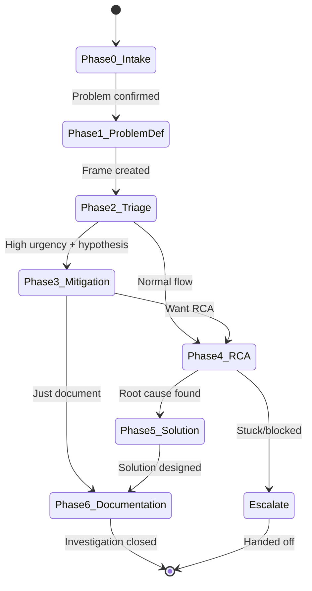
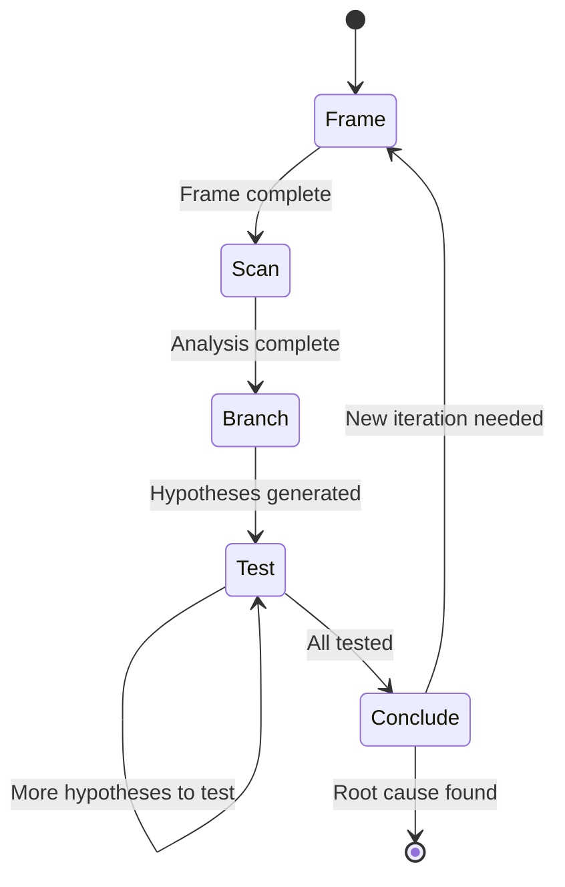

# FaultMaven Agent Orchestration Design v2.0

**Version:** 2.0  
**Date:** 2025-10-09  
**Status:** Design Specification  
**Companion Document:** OODA-Based Prompt Engineering Architecture v2.0

---

## Executive Summary

This document specifies the **agent orchestration layer** that manages FaultMaven's runtime behavior. While the prompt engineering document defines *what* to say to the LLM, this document defines *how* the agent operates:

- **State management** across conversation turns
- **Phase transitions** and OODA loop control
- **Decision routing** to select appropriate prompts
- **Memory management** with hot/warm/cold tiers
- **Evidence and hypothesis tracking**
- **Escalation and error handling**

### Architecture at a Glance

```
┌─────────────────────────────────────────────────────────────┐
│                    User Interface Layer                      │
│                   (Chat, Commands, Evidence)                 │
└────────────────────┬────────────────────────────────────────┘
                     │
┌────────────────────▼────────────────────────────────────────┐
│                 Orchestration Controller                     │
│  ┌──────────────────────────────────────────────────────┐  │
│  │  1. Input Handler                                     │  │
│  │  2. State Manager                                     │  │
│  │  3. Decision Router                                   │  │
│  │  4. Prompt Assembler                                  │  │
│  │  5. LLM Interface                                     │  │
│  │  6. Response Parser                                   │  │
│  │  7. State Updater                                     │  │
│  └──────────────────────────────────────────────────────┘  │
└────────────────────┬────────────────────────────────────────┘
                     │
┌────────────────────▼────────────────────────────────────────┐
│                    Persistence Layer                         │
│     (Investigation State, Memory, Evidence, Hypotheses)      │
└─────────────────────────────────────────────────────────────┘
```

---

## Table of Contents

1. [Core Components](#core-components)
2. [State Management](#state-management)
3. [Phase Transition Logic](#phase-transition-logic)
4. [OODA Loop Control](#ooda-loop-control)
5. [Decision Router](#decision-router)
6. [Memory Management](#memory-management)
7. [Evidence Tracking](#evidence-tracking)
8. [Hypothesis Management](#hypothesis-management)
9. [Response Processing](#response-processing)
10. [Escalation Logic](#escalation-logic)
11. [Error Handling](#error-handling)
12. [Implementation Patterns](#implementation-patterns)
13. [Testing Strategy](#testing-strategy)

---

## Core Components

### 1. Orchestration Controller

**Responsibility**: Main coordinator for all agent operations

```python
class OrchestrationController:
    """
    Main controller that orchestrates the entire agent workflow
    """
    
    def __init__(self):
        self.state_manager = StateManager()
        self.decision_router = DecisionRouter()
        self.prompt_assembler = PromptAssembler()
        self.llm_interface = LLMInterface()
        self.response_parser = ResponseParser()
        self.memory_manager = MemoryManager()
        self.evidence_tracker = EvidenceTracker()
        self.hypothesis_manager = HypothesisManager()
        
    async def process_user_input(
        self, 
        user_input: str, 
        investigation_id: str
    ) -> AgentResponse:
        """
        Main entry point for processing user input
        
        Flow:
        1. Load current state
        2. Parse user input
        3. Update state with new input
        4. Route to appropriate handler
        5. Assemble prompt
        6. Call LLM
        7. Parse response
        8. Update state
        9. Persist state
        10. Return response to user
        """
        # 1. Load current investigation state
        state = await self.state_manager.load_state(investigation_id)
        
        # 2. Parse user input (detect intent, extract data)
        parsed_input = self.parse_input(user_input, state)
        
        # 3. Update state with user input
        state = self.state_manager.update_with_input(state, parsed_input)
        
        # 4. Route decision (which prompt to use)
        routing_decision = self.decision_router.route(state, parsed_input)
        
        # 5. Assemble prompt based on routing
        prompt = self.prompt_assembler.assemble(
            state=state,
            routing_decision=routing_decision
        )
        
        # 6. Call LLM
        llm_response = await self.llm_interface.generate(
            prompt=prompt,
            state=state
        )
        
        # 7. Parse LLM response
        parsed_response = self.response_parser.parse(
            llm_response=llm_response,
            expected_format=routing_decision.response_format
        )
        
        # 8. Update state based on response
        updated_state = await self.process_response(
            state=state,
            parsed_response=parsed_response
        )
        
        # 9. Persist updated state
        await self.state_manager.save_state(updated_state)
        
        # 10. Return formatted response
        return self.format_response(parsed_response, updated_state)
```

---

## State Management

### Agent State Model

```python
from dataclasses import dataclass, field
from typing import Optional, List, Dict
from datetime import datetime
from enum import Enum

class AgentMode(Enum):
    CONSULTANT = "consultant"
    INVESTIGATOR = "investigator"

class InvestigationMode(Enum):
    ACTIVE_INCIDENT = "active_incident"
    POST_MORTEM = "post_mortem"

class UrgencyLevel(Enum):
    LOW = "low"
    MEDIUM = "medium"
    HIGH = "high"
    CRITICAL = "critical"

class OODAStep(Enum):
    FRAME = "frame"
    SCAN = "scan"
    BRANCH = "branch"
    TEST = "test"
    CONCLUDE = "conclude"

@dataclass
class AnomalyFrame:
    """Structured representation of the problem"""
    statement: str
    affected_components: List[str]
    affected_scope: str
    severity: str
    confidence: float
    last_updated: datetime
    revision_history: List[Dict] = field(default_factory=list)

@dataclass
class Hypothesis:
    """A testable root cause theory"""
    hypothesis_id: str
    statement: str
    category: str  # deployment, infrastructure, code, configuration, external
    likelihood: float
    supporting_evidence: List[str]  # evidence_ids
    contradicting_evidence: List[str]
    validation_steps: List[str]
    tested: bool = False
    test_result: Optional[str] = None  # supports, refutes, inconclusive
    created_at: datetime = field(default_factory=datetime.utcnow)

@dataclass
class EvidenceItem:
    """A piece of evidence collected during investigation"""
    evidence_id: str
    label: str
    description: str
    category: str  # symptoms, scope, timeline, infrastructure, code
    content: str  # Actual evidence data (logs, metrics, etc.)
    source: str  # How it was obtained
    collected_at: datetime
    relevance_score: float = 1.0
    related_hypotheses: List[str] = field(default_factory=list)

@dataclass
class OODAIteration:
    """Tracks one complete OODA cycle"""
    iteration_number: int
    started_at: datetime
    completed_at: Optional[datetime] = None
    
    # Steps completed in this iteration
    frame_completed: bool = False
    scan_completed: bool = False
    branch_completed: bool = False
    test_completed: bool = False
    conclude_completed: bool = False
    
    # Results
    anomaly_frame_updates: Optional[AnomalyFrame] = None
    evidence_analyzed: List[str] = field(default_factory=list)
    hypotheses_generated: List[str] = field(default_factory=list)
    hypotheses_tested: List[str] = field(default_factory=list)
    key_insight: Optional[str] = None
    
    # Progress tracking
    confidence_progression: List[float] = field(default_factory=list)
    category_tests: Dict[str, int] = field(default_factory=dict)

@dataclass
class PhaseExecution:
    """Tracks execution of a lifecycle phase"""
    phase_number: int
    phase_name: str
    started_at: datetime
    completed_at: Optional[datetime] = None
    
    # OODA iterations within this phase
    ooda_iterations: List[OODAIteration] = field(default_factory=list)
    
    # Phase-specific outputs
    outputs: Dict = field(default_factory=dict)
    
    # Completion criteria
    completion_criteria_met: List[str] = field(default_factory=list)
    completion_criteria_pending: List[str] = field(default_factory=list)

@dataclass
class AgentState:
    """
    Complete state of an investigation session
    """
    # Identity
    investigation_id: str
    created_at: datetime
    updated_at: datetime
    
    # Agent Configuration
    agent_mode: AgentMode = AgentMode.CONSULTANT
    investigation_mode: Optional[InvestigationMode] = None
    urgency_level: Optional[UrgencyLevel] = None
    
    # Lifecycle Progress
    current_phase: int = 0
    phase_history: List[PhaseExecution] = field(default_factory=list)
    
    # OODA Progress (for Phase 4 RCA)
    current_ooda_step: Optional[OODAStep] = None
    current_ooda_iteration: int = 0
    ooda_iterations: List[OODAIteration] = field(default_factory=list)
    
    # Problem Definition
    problem_statement: Optional[str] = None
    anomaly_frame: Optional[AnomalyFrame] = None
    
    # Investigation Data
    evidence_items: Dict[str, EvidenceItem] = field(default_factory=dict)
    hypotheses: Dict[str, Hypothesis] = field(default_factory=dict)
    
    # Root Cause
    root_cause_identified: bool = False
    root_cause: Optional[Dict] = None
    
    # Solution
    solution_designed: bool = False
    solution: Optional[Dict] = None
    mitigation_applied: Optional[Dict] = None
    
    # Memory (for prompt context)
    conversation_history: List[Dict] = field(default_factory=list)
    
    # Progress Tracking
    iterations_without_progress: int = 0
    same_category_test_count: Dict[str, int] = field(default_factory=dict)
    
    # Escalation
    escalation_recommended: bool = False
    escalation_reason: Optional[str] = None
    
    # Metadata
    user_id: str = ""
    tags: List[str] = field(default_factory=list)
    
    def get_current_phase_execution(self) -> Optional[PhaseExecution]:
        """Get the current phase execution object"""
        if self.phase_history and self.phase_history[-1].phase_number == self.current_phase:
            return self.phase_history[-1]
        return None
    
    def get_current_ooda_iteration(self) -> Optional[OODAIteration]:
        """Get the current OODA iteration object"""
        if self.ooda_iterations and not self.ooda_iterations[-1].completed_at:
            return self.ooda_iterations[-1]
        return None
    
    def get_active_hypotheses(self) -> List[Hypothesis]:
        """Get hypotheses that haven't been conclusively refuted"""
        return [h for h in self.hypotheses.values() 
                if not h.tested or h.test_result != "refutes"]
    
    def get_evidence_coverage_score(self) -> float:
        """Calculate how much evidence we have (0.0-1.0)"""
        required_categories = {"symptoms", "scope", "timeline"}
        collected_categories = {e.category for e in self.evidence_items.values()}
        coverage = len(required_categories & collected_categories) / len(required_categories)
        return min(coverage + (len(self.evidence_items) * 0.05), 1.0)
```

### StateManager Implementation

```python
class StateManager:
    """
    Manages loading, updating, and persisting investigation state
    """
    
    def __init__(self, persistence: PersistenceLayer):
        self.persistence = persistence
        
    async def load_state(self, investigation_id: str) -> AgentState:
        """Load investigation state from persistence"""
        state_data = await self.persistence.load(investigation_id)
        if state_data:
            return AgentState(**state_data)
        else:
            # New investigation
            return self.create_new_state(investigation_id)
    
    def create_new_state(self, investigation_id: str) -> AgentState:
        """Create a new investigation state"""
        return AgentState(
            investigation_id=investigation_id,
            created_at=datetime.utcnow(),
            updated_at=datetime.utcnow(),
            agent_mode=AgentMode.CONSULTANT,
            current_phase=0
        )
    
    async def save_state(self, state: AgentState) -> None:
        """Persist state to storage"""
        state.updated_at = datetime.utcnow()
        await self.persistence.save(state.investigation_id, state)
    
    def update_with_input(
        self, 
        state: AgentState, 
        parsed_input: ParsedInput
    ) -> AgentState:
        """Update state based on user input"""
        
        # Add to conversation history
        state.conversation_history.append({
            "timestamp": datetime.utcnow(),
            "role": "user",
            "content": parsed_input.raw_input,
            "intent": parsed_input.intent,
            "parsed_data": parsed_input.extracted_data
        })
        
        # If user provided evidence, add it
        if parsed_input.intent == "provide_evidence":
            self._add_evidence(state, parsed_input.extracted_data)
        
        # If user confirmed something, update state
        if parsed_input.intent == "confirm":
            self._handle_confirmation(state, parsed_input.extracted_data)
        
        return state
    
    def _add_evidence(self, state: AgentState, evidence_data: Dict) -> None:
        """Add evidence item to state"""
        evidence_id = f"ev-{len(state.evidence_items) + 1:03d}"
        evidence = EvidenceItem(
            evidence_id=evidence_id,
            label=evidence_data.get("label", "User-provided evidence"),
            description=evidence_data.get("description", ""),
            category=evidence_data.get("category", "symptoms"),
            content=evidence_data.get("content", ""),
            source="user",
            collected_at=datetime.utcnow()
        )
        state.evidence_items[evidence_id] = evidence
    
    def _handle_confirmation(self, state: AgentState, confirmation_data: Dict) -> None:
        """Handle user confirmations (phase complete, framing correct, etc.)"""
        if confirmation_data.get("type") == "phase_complete":
            phase_exec = state.get_current_phase_execution()
            if phase_exec:
                phase_exec.completed_at = datetime.utcnow()
```

---

## Phase Transition Logic

### Phase State Machine

```python
class PhaseTransitionEngine:
    """
    Manages transitions between lifecycle phases
    """
    
    # Phase transition rules
    PHASE_TRANSITIONS = {
        0: [1],  # Intake → Problem Definition
        1: [2],  # Problem Definition → Triage
        2: [3, 4],  # Triage → Mitigation OR RCA
        3: [4, 6],  # Mitigation → RCA OR Documentation
        4: [5],  # RCA → Solution
        5: [6],  # Solution → Documentation
        6: []  # Documentation → End
    }
    
    def can_transition(
        self, 
        state: AgentState, 
        target_phase: int
    ) -> tuple[bool, Optional[str]]:
        """
        Check if transition to target phase is allowed
        
        Returns:
            (allowed, reason_if_not_allowed)
        """
        current_phase = state.current_phase
        
        # Check if target is valid next phase
        if target_phase not in self.PHASE_TRANSITIONS[current_phase]:
            return False, f"Cannot transition from phase {current_phase} to {target_phase}"
        
        # Check completion criteria
        criteria_met = self.check_completion_criteria(state, current_phase)
        if not criteria_met:
            return False, f"Phase {current_phase} completion criteria not met"
        
        return True, None
    
    def check_completion_criteria(
        self, 
        state: AgentState, 
        phase: int
    ) -> bool:
        """Check if phase completion criteria are met"""
        
        if phase == 0:  # Intake
            return (
                state.problem_statement is not None and
                state.urgency_level is not None
            )
        
        elif phase == 1:  # Problem Definition
            return (
                state.anomaly_frame is not None and
                state.anomaly_frame.confidence >= 0.6 and
                len(state.evidence_items) >= 2
            )
        
        elif phase == 2:  # Triage
            return (
                len(state.hypotheses) >= 2 or
                state.escalation_recommended
            )
        
        elif phase == 3:  # Mitigation
            return (
                state.mitigation_applied is not None
            )
        
        elif phase == 4:  # RCA
            return (
                state.root_cause_identified and
                state.root_cause is not None and
                state.root_cause.get("confidence", 0) >= 0.7
            )
        
        elif phase == 5:  # Solution
            return (
                state.solution_designed and
                state.solution is not None
            )
        
        elif phase == 6:  # Documentation
            return True  # Always allowed to complete
        
        return False
    
    def transition(
        self, 
        state: AgentState, 
        target_phase: int
    ) -> AgentState:
        """Execute phase transition"""
        
        # Validate transition
        allowed, reason = self.can_transition(state, target_phase)
        if not allowed:
            raise ValueError(f"Invalid phase transition: {reason}")
        
        # Complete current phase
        current_phase_exec = state.get_current_phase_execution()
        if current_phase_exec and not current_phase_exec.completed_at:
            current_phase_exec.completed_at = datetime.utcnow()
        
        # Start new phase
        state.current_phase = target_phase
        new_phase_exec = PhaseExecution(
            phase_number=target_phase,
            phase_name=self.get_phase_name(target_phase),
            started_at=datetime.utcnow()
        )
        state.phase_history.append(new_phase_exec)
        
        # Initialize phase-specific state
        self._initialize_phase_state(state, target_phase)
        
        return state
    
    def _initialize_phase_state(self, state: AgentState, phase: int) -> None:
        """Initialize phase-specific state variables"""
        
        if phase == 4:  # RCA - Initialize OODA
            state.current_ooda_step = OODAStep.FRAME
            state.current_ooda_iteration = 1
            # Start first OODA iteration
            state.ooda_iterations.append(
                OODAIteration(
                    iteration_number=1,
                    started_at=datetime.utcnow()
                )
            )
    
    @staticmethod
    def get_phase_name(phase: int) -> str:
        """Get human-readable phase name"""
        names = {
            0: "Intake",
            1: "Problem Definition",
            2: "Triage",
            3: "Mitigation",
            4: "Root Cause Analysis",
            5: "Solution Design",
            6: "Documentation"
        }
        return names.get(phase, "Unknown")
    
    def recommend_next_phase(self, state: AgentState) -> int:
        """
        Recommend next phase based on current state
        
        Logic:
        - Phase 2 → Phase 3 if urgency high/critical AND actionable hypothesis
        - Phase 2 → Phase 4 if normal urgency OR need deeper analysis
        - Phase 3 → Phase 4 if user wants RCA
        - Phase 3 → Phase 6 if just documenting mitigation
        """
        current_phase = state.current_phase
        
        if current_phase == 2:  # After Triage
            # Check urgency and hypothesis quality
            if state.urgency_level in [UrgencyLevel.HIGH, UrgencyLevel.CRITICAL]:
                # Check if we have actionable hypothesis
                top_hypothesis = self._get_top_hypothesis(state)
                if top_hypothesis and top_hypothesis.likelihood >= 0.7:
                    return 3  # Mitigation first
            return 4  # Default to RCA
        
        elif current_phase == 3:  # After Mitigation
            # If user wants to understand root cause, go to RCA
            # Otherwise, document and close
            return 4  # Default to RCA (let user decide)
        
        else:
            # Default: next sequential phase
            possible = self.PHASE_TRANSITIONS[current_phase]
            return possible[0] if possible else current_phase
    
    def _get_top_hypothesis(self, state: AgentState) -> Optional[Hypothesis]:
        """Get hypothesis with highest likelihood"""
        active = state.get_active_hypotheses()
        if not active:
            return None
        return max(active, key=lambda h: h.likelihood)
```

---

## OODA Loop Control

### OODA State Machine

```python
class OODAController:
    """
    Manages OODA loop execution within RCA phase
    """
    
    # OODA step transitions
    OODA_TRANSITIONS = {
        OODAStep.FRAME: [OODAStep.SCAN],
        OODAStep.SCAN: [OODAStep.BRANCH],
        OODAStep.BRANCH: [OODAStep.TEST],
        OODAStep.TEST: [OODAStep.CONCLUDE, OODAStep.TEST],  # Can test multiple hypotheses
        OODAStep.CONCLUDE: [OODAStep.FRAME, None]  # Next iteration or complete
    }
    
    def __init__(self):
        self.max_iterations = 10
        self.progress_threshold = 3  # Iterations without progress before re-framing
    
    def advance_ooda_step(
        self, 
        state: AgentState, 
        step_result: Dict
    ) -> AgentState:
        """Advance to next OODA step based on current step result"""
        
        current_step = state.current_ooda_step
        current_iteration = state.get_current_ooda_iteration()
        
        if not current_iteration:
            raise ValueError("No active OODA iteration")
        
        # Mark current step complete
        self._mark_step_complete(current_iteration, current_step, step_result)
        
        # Determine next step
        next_step = self._determine_next_step(state, current_step, step_result)
        
        if next_step is None:
            # OODA iteration complete
            current_iteration.completed_at = datetime.utcnow()
            state.current_ooda_step = None
            return state
        
        if next_step == OODAStep.FRAME and current_step != OODAStep.FRAME:
            # Starting new iteration
            self._start_new_iteration(state)
        else:
            # Continue current iteration
            state.current_ooda_step = next_step
        
        return state
    
    def _mark_step_complete(
        self, 
        iteration: OODAIteration, 
        step: OODAStep, 
        result: Dict
    ) -> None:
        """Mark OODA step as complete and store results"""
        
        if step == OODAStep.FRAME:
            iteration.frame_completed = True
            if result.get("anomaly_frame_update"):
                iteration.anomaly_frame_updates = result["anomaly_frame_update"]
        
        elif step == OODAStep.SCAN:
            iteration.scan_completed = True
            if result.get("evidence_analyzed"):
                iteration.evidence_analyzed = result["evidence_analyzed"]
        
        elif step == OODAStep.BRANCH:
            iteration.branch_completed = True
            if result.get("hypotheses_generated"):
                iteration.hypotheses_generated = result["hypotheses_generated"]
        
        elif step == OODAStep.TEST:
            iteration.test_completed = True
            if result.get("hypothesis_tested"):
                iteration.hypotheses_tested.append(result["hypothesis_tested"])
        
        elif step == OODAStep.CONCLUDE:
            iteration.conclude_completed = True
            if result.get("key_insight"):
                iteration.key_insight = result["key_insight"]
    
    def _determine_next_step(
        self, 
        state: AgentState, 
        current_step: OODAStep, 
        step_result: Dict
    ) -> Optional[OODAStep]:
        """Determine next OODA step based on current step result"""
        
        if current_step == OODAStep.TEST:
            # Check if more hypotheses to test
            untested = self._get_untested_hypotheses(state)
            if untested and step_result.get("continue_testing"):
                return OODAStep.TEST  # Test next hypothesis
            else:
                return OODAStep.CONCLUDE  # Move to conclusion
        
        elif current_step == OODAStep.CONCLUDE:
            # Check if root cause identified
            if step_result.get("root_cause_identified"):
                return None  # OODA complete
            
            # Check iteration limit
            if state.current_ooda_iteration >= self.max_iterations:
                # Too many iterations, recommend escalation
                state.escalation_recommended = True
                state.escalation_reason = f"Unable to identify root cause after {self.max_iterations} iterations"
                return None
            
            # Start new iteration
            return OODAStep.FRAME
        
        else:
            # Standard progression
            possible_next = self.OODA_TRANSITIONS[current_step]
            return possible_next[0] if possible_next else None
    
    def _start_new_iteration(self, state: AgentState) -> None:
        """Start a new OODA iteration"""
        state.current_ooda_iteration += 1
        state.current_ooda_step = OODAStep.FRAME
        
        new_iteration = OODAIteration(
            iteration_number=state.current_ooda_iteration,
            started_at=datetime.utcnow()
        )
        state.ooda_iterations.append(new_iteration)
    
    def _get_untested_hypotheses(self, state: AgentState) -> List[Hypothesis]:
        """Get hypotheses that haven't been tested yet"""
        return [h for h in state.hypotheses.values() if not h.tested]
    
    def detect_anchoring(self, state: AgentState) -> tuple[bool, Optional[str]]:
        """
        Detect if agent is stuck testing same category repeatedly
        
        Returns:
            (anchoring_detected, forced_category)
        """
        # Count tests by category
        category_counts = state.same_category_test_count
        
        # If any category tested 4+ times without success
        for category, count in category_counts.items():
            if count >= 4:
                # Force different category
                tested_categories = set(category_counts.keys())
                all_categories = {"deployment", "infrastructure", "code", "configuration", "external"}
                untested = all_categories - tested_categories
                
                if untested:
                    forced_category = list(untested)[0]
                    return True, forced_category
                else:
                    # All categories tested, pick least tested
                    least_tested = min(all_categories - {category}, 
                                     key=lambda c: category_counts.get(c, 0))
                    return True, least_tested
        
        return False, None
    
    def detect_progress_stall(self, state: AgentState) -> bool:
        """Detect if investigation is not making progress"""
        
        # Check if confidence has increased in last 3 iterations
        if len(state.ooda_iterations) >= 3:
            last_3 = state.ooda_iterations[-3:]
            confidences = []
            for iteration in last_3:
                if iteration.confidence_progression:
                    confidences.append(iteration.confidence_progression[-1])
            
            if len(confidences) >= 3:
                # Check if confidence is stagnant or decreasing
                if confidences[-1] <= confidences[0]:
                    return True
        
        return False
```

---

## Decision Router

### Routing Logic

```python
@dataclass
class RoutingDecision:
    """Decision about which prompt to use"""
    prompt_category: str  # "consultant", "phase_1", "ooda_frame", etc.
    prompt_tier: str  # "light", "medium", "full"
    response_format: str  # Expected response structure
    context_requirements: List[str]  # What context to include
    
class DecisionRouter:
    """
    Routes requests to appropriate prompts based on state
    """
    
    def route(
        self, 
        state: AgentState, 
        parsed_input: ParsedInput
    ) -> RoutingDecision:
        """
        Main routing logic
        
        Decision tree:
        1. Agent mode (consultant vs investigator)
        2. If investigator: current phase
        3. If phase uses OODA: current OODA step
        4. Prompt tier based on urgency/complexity
        """
        
        # 1. Check agent mode
        if state.agent_mode == AgentMode.CONSULTANT:
            return self._route_consultant_mode(state, parsed_input)
        
        # 2. Investigator mode - route by phase
        return self._route_investigator_mode(state, parsed_input)
    
    def _route_consultant_mode(
        self, 
        state: AgentState, 
        parsed_input: ParsedInput
    ) -> RoutingDecision:
        """Route for consultant mode"""
        
        # Check if should offer mode switch
        problem_signals = self._detect_problem_signals(parsed_input)
        
        return RoutingDecision(
            prompt_category="consultant",
            prompt_tier="light",
            response_format="consultant_response",
            context_requirements=["problem_signals", "recent_history"]
        )
    
    def _route_investigator_mode(
        self, 
        state: AgentState, 
        parsed_input: ParsedInput
    ) -> RoutingDecision:
        """Route for investigator mode"""
        
        phase = state.current_phase
        
        # Phase-specific routing
        if phase == 0:
            return self._route_phase_0(state, parsed_input)
        elif phase == 1:
            return self._route_phase_1(state, parsed_input)
        elif phase == 2:
            return self._route_phase_2(state, parsed_input)
        elif phase == 3:
            return self._route_phase_3(state, parsed_input)
        elif phase == 4:
            return self._route_phase_4_rca(state, parsed_input)
        elif phase == 5:
            return self._route_phase_5(state, parsed_input)
        elif phase == 6:
            return self._route_phase_6(state, parsed_input)
        
        raise ValueError(f"Unknown phase: {phase}")
    
    def _route_phase_4_rca(
        self, 
        state: AgentState, 
        parsed_input: ParsedInput
    ) -> RoutingDecision:
        """Route for Phase 4 (RCA) - includes OODA step routing"""
        
        ooda_step = state.current_ooda_step
        
        if ooda_step is None:
            # Starting RCA phase
            ooda_step = OODAStep.FRAME
        
        # Determine prompt tier based on urgency
        tier = self._determine_prompt_tier(state)
        
        # Map OODA step to prompt category
        ooda_prompt_map = {
            OODAStep.FRAME: "ooda_frame",
            OODAStep.SCAN: "ooda_scan",
            OODAStep.BRANCH: "ooda_branch",
            OODAStep.TEST: "ooda_test",
            OODAStep.CONCLUDE: "ooda_conclude"
        }
        
        return RoutingDecision(
            prompt_category=f"phase_4_{ooda_prompt_map[ooda_step]}",
            prompt_tier=tier,
            response_format=f"rca_{ooda_step.value}_response",
            context_requirements=[
                "anomaly_frame",
                "evidence_summary",
                "hypothesis_summary",
                "ooda_history",
                "hot_memory",
                "warm_memory"
            ]
        )
    
    def _determine_prompt_tier(self, state: AgentState) -> str:
        """
        Determine prompt verbosity tier
        
        Tiers:
        - light: Minimal guidance (consultant mode, simple queries)
        - medium: Standard guidance (normal investigations)
        - full: Comprehensive guidance (complex investigations, teaching moments)
        """
        
        if state.agent_mode == AgentMode.CONSULTANT:
            return "light"
        
        # Check complexity factors
        complexity_score = 0
        
        # Factor 1: Number of hypotheses
        if len(state.hypotheses) > 5:
            complexity_score += 1
        
        # Factor 2: OODA iterations
        if state.current_ooda_iteration > 5:
            complexity_score += 1
        
        # Factor 3: Evidence diversity
        evidence_categories = {e.category for e in state.evidence_items.values()}
        if len(evidence_categories) >= 4:
            complexity_score += 1
        
        # Factor 4: Urgency (higher urgency = less verbose)
        if state.urgency_level in [UrgencyLevel.HIGH, UrgencyLevel.CRITICAL]:
            complexity_score -= 1
        
        if complexity_score >= 2:
            return "full"
        elif complexity_score <= 0:
            return "light"
        else:
            return "medium"
    
    def _detect_problem_signals(self, parsed_input: ParsedInput) -> Dict:
        """Detect problem signals in user input"""
        
        strong_signals = [
            "error", "broken", "failing", "not working", "crash", "down",
            "production", "urgent", "critical", "outage"
        ]
        
        weak_signals = [
            "weird", "slow", "sometimes", "acting strange", "intermittent"
        ]
        
        text_lower = parsed_input.raw_input.lower()
        
        has_strong = any(signal in text_lower for signal in strong_signals)
        has_weak = any(signal in text_lower for signal in weak_signals)
        
        if has_strong:
            signal_strength = "strong"
        elif has_weak:
            signal_strength = "weak"
        else:
            signal_strength = "none"
        
        return {
            "signal_strength": signal_strength,
            "has_problem": has_strong or has_weak
        }
```

---

## Memory Management

### Memory Tier System

```python
class MemoryManager:
    """
    Manages conversation memory with hot/warm/cold tiers
    """
    
    def __init__(self):
        self.hot_memory_size = 2  # Last 2 OODA iterations
        self.warm_memory_size = 3  # Iterations 3-5
        # Cold memory: Everything older (summarized)
    
    def get_memory_context(
        self, 
        state: AgentState, 
        max_tokens: int = 600
    ) -> Dict:
        """
        Build memory context for prompt
        
        Returns:
            {
                "hot_memory": [...],   # Full detail
                "warm_memory": [...],  # Medium detail
                "cold_summary": "..."  # Brief summary
            }
        """
        
        # Get hot memory (most recent)
        hot = self._get_hot_memory(state)
        
        # Get warm memory
        warm = self._get_warm_memory(state)
        
        # Get cold summary
        cold = self._get_cold_summary(state)
        
        return {
            "hot_memory": hot,
            "warm_memory": warm,
            "cold_summary": cold
        }
    
    def _get_hot_memory(self, state: AgentState) -> List[Dict]:
        """Get last 2 OODA iterations with full detail"""
        
        recent_iterations = state.ooda_iterations[-self.hot_memory_size:]
        
        hot_memory = []
        for iteration in recent_iterations:
            hot_memory.append({
                "iteration": iteration.iteration_number,
                "steps_completed": self._get_completed_steps(iteration),
                "hypotheses_generated": iteration.hypotheses_generated,
                "hypotheses_tested": iteration.hypotheses_tested,
                "key_findings": iteration.key_insight,
                "confidence_change": self._calc_confidence_change(iteration)
            })
        
        return hot_memory
    
    def _get_warm_memory(self, state: AgentState) -> List[Dict]:
        """Get iterations 3-5 with medium detail"""
        
        if len(state.ooda_iterations) <= self.hot_memory_size:
            return []
        
        start_idx = max(0, len(state.ooda_iterations) - self.hot_memory_size - self.warm_memory_size)
        end_idx = len(state.ooda_iterations) - self.hot_memory_size
        
        warm_iterations = state.ooda_iterations[start_idx:end_idx]
        
        warm_memory = []
        for iteration in warm_iterations:
            warm_memory.append({
                "iteration": iteration.iteration_number,
                "key_insight": iteration.key_insight,
                "hypotheses_count": len(iteration.hypotheses_generated),
                "tests_count": len(iteration.hypotheses_tested)
            })
        
        return warm_memory
    
    def _get_cold_summary(self, state: AgentState) -> str:
        """Get brief summary of older iterations"""
        
        if len(state.ooda_iterations) <= (self.hot_memory_size + self.warm_memory_size):
            return ""
        
        old_iterations_count = len(state.ooda_iterations) - self.hot_memory_size - self.warm_memory_size
        total_hypotheses = sum(
            len(it.hypotheses_generated) 
            for it in state.ooda_iterations[:old_iterations_count]
        )
        
        return (
            f"Earlier investigation: {old_iterations_count} iterations completed, "
            f"{total_hypotheses} hypotheses explored"
        )
    
    @staticmethod
    def _get_completed_steps(iteration: OODAIteration) -> List[str]:
        """Get list of completed OODA steps in iteration"""
        steps = []
        if iteration.frame_completed:
            steps.append("frame")
        if iteration.scan_completed:
            steps.append("scan")
        if iteration.branch_completed:
            steps.append("branch")
        if iteration.test_completed:
            steps.append("test")
        if iteration.conclude_completed:
            steps.append("conclude")
        return steps
    
    @staticmethod
    def _calc_confidence_change(iteration: OODAIteration) -> float:
        """Calculate confidence change in iteration"""
        if len(iteration.confidence_progression) < 2:
            return 0.0
        return iteration.confidence_progression[-1] - iteration.confidence_progression[0]
```

---

## Evidence Tracking

### Evidence Management

```python
class EvidenceTracker:
    """
    Manages evidence collection and organization
    """
    
    def __init__(self):
        self.evidence_categories = {
            "symptoms", "scope", "timeline", 
            "infrastructure", "code", "configuration"
        }
    
    def add_evidence(
        self, 
        state: AgentState, 
        evidence_data: Dict
    ) -> str:
        """
        Add evidence item to investigation
        
        Returns:
            evidence_id
        """
        evidence_id = f"ev-{len(state.evidence_items) + 1:03d}"
        
        evidence = EvidenceItem(
            evidence_id=evidence_id,
            label=evidence_data["label"],
            description=evidence_data["description"],
            category=evidence_data.get("category", "symptoms"),
            content=evidence_data.get("content", ""),
            source=evidence_data.get("source", "user"),
            collected_at=datetime.utcnow()
        )
        
        state.evidence_items[evidence_id] = evidence
        
        return evidence_id
    
    def link_evidence_to_hypothesis(
        self, 
        state: AgentState, 
        evidence_id: str, 
        hypothesis_id: str
    ) -> None:
        """Create link between evidence and hypothesis"""
        
        if evidence_id in state.evidence_items:
            evidence = state.evidence_items[evidence_id]
            if hypothesis_id not in evidence.related_hypotheses:
                evidence.related_hypotheses.append(hypothesis_id)
    
    def calculate_coverage_score(self, state: AgentState) -> float:
        """
        Calculate evidence coverage (0.0-1.0)
        
        Good coverage means we have evidence from multiple categories
        """
        if not state.evidence_items:
            return 0.0
        
        # Core categories needed
        core_categories = {"symptoms", "scope", "timeline"}
        collected_categories = {e.category for e in state.evidence_items.values()}
        
        # Base score: core categories coverage
        core_coverage = len(core_categories & collected_categories) / len(core_categories)
        
        # Bonus: additional evidence items
        bonus = min(len(state.evidence_items) * 0.05, 0.3)
        
        return min(core_coverage + bonus, 1.0)
    
    def get_evidence_summary(self, state: AgentState) -> Dict:
        """Get summary of collected evidence"""
        
        by_category = {}
        for evidence in state.evidence_items.values():
            if evidence.category not in by_category:
                by_category[evidence.category] = []
            by_category[evidence.category].append({
                "id": evidence.evidence_id,
                "label": evidence.label,
                "collected_at": evidence.collected_at
            })
        
        return {
            "total_count": len(state.evidence_items),
            "by_category": by_category,
            "coverage_score": self.calculate_coverage_score(state),
            "missing_categories": self.evidence_categories - set(by_category.keys())
        }
    
    def prioritize_evidence_requests(
        self, 
        state: AgentState, 
        potential_requests: List[Dict]
    ) -> List[Dict]:
        """
        Prioritize which evidence to request based on current gaps
        
        Priority:
        1. Core categories (symptoms, scope, timeline) if missing
        2. Categories that support top hypothesis
        3. Categories with no evidence yet
        """
        
        # Get current coverage
        collected_categories = {e.category for e in state.evidence_items.values()}
        core_categories = {"symptoms", "scope", "timeline"}
        
        def priority_score(request: Dict) -> int:
            category = request.get("category", "symptoms")
            score = 0
            
            # Highest priority: missing core categories
            if category in core_categories and category not in collected_categories:
                score += 100
            
            # High priority: supports top hypothesis
            top_hypothesis = self._get_top_hypothesis(state)
            if top_hypothesis and category in self._hypothesis_category_mapping(top_hypothesis):
                score += 50
            
            # Medium priority: category not yet collected
            if category not in collected_categories:
                score += 25
            
            return score
        
        # Sort by priority
        sorted_requests = sorted(
            potential_requests, 
            key=priority_score, 
            reverse=True
        )
        
        # Return top 3
        return sorted_requests[:3]
    
    @staticmethod
    def _get_top_hypothesis(state: AgentState) -> Optional[Hypothesis]:
        """Get hypothesis with highest likelihood"""
        active = state.get_active_hypotheses()
        return max(active, key=lambda h: h.likelihood) if active else None
    
    @staticmethod
    def _hypothesis_category_mapping(hypothesis: Hypothesis) -> Set[str]:
        """Map hypothesis category to relevant evidence categories"""
        mapping = {
            "deployment": {"timeline", "code", "configuration"},
            "infrastructure": {"infrastructure", "scope"},
            "code": {"symptoms", "code"},
            "configuration": {"configuration", "timeline"},
            "external": {"symptoms", "timeline", "infrastructure"}
        }
        return mapping.get(hypothesis.category, set())
```

---

## Hypothesis Management

### Hypothesis Lifecycle

```python
class HypothesisManager:
    """
    Manages hypothesis generation, testing, and tracking
    """
    
    def add_hypothesis(
        self, 
        state: AgentState, 
        hypothesis_data: Dict
    ) -> str:
        """
        Add new hypothesis to investigation
        
        Returns:
            hypothesis_id
        """
        hypothesis_id = f"hyp-{len(state.hypotheses) + 1:03d}"
        
        hypothesis = Hypothesis(
            hypothesis_id=hypothesis_id,
            statement=hypothesis_data["statement"],
            category=hypothesis_data["category"],
            likelihood=hypothesis_data["likelihood"],
            supporting_evidence=hypothesis_data.get("supporting_evidence", []),
            contradicting_evidence=hypothesis_data.get("contradicting_evidence", []),
            validation_steps=hypothesis_data.get("validation_steps", [])
        )
        
        state.hypotheses[hypothesis_id] = hypothesis
        
        # Update category test count
        category = hypothesis.category
        if category not in state.same_category_test_count:
            state.same_category_test_count[category] = 0
        
        return hypothesis_id
    
    def update_hypothesis_after_test(
        self, 
        state: AgentState, 
        hypothesis_id: str, 
        test_result: Dict
    ) -> None:
        """Update hypothesis after testing"""
        
        if hypothesis_id not in state.hypotheses:
            raise ValueError(f"Hypothesis {hypothesis_id} not found")
        
        hypothesis = state.hypotheses[hypothesis_id]
        
        # Mark as tested
        hypothesis.tested = True
        hypothesis.test_result = test_result["outcome"]  # supports, refutes, inconclusive
        
        # Update likelihood
        confidence_delta = test_result.get("confidence_delta", 0.0)
        new_likelihood = max(0.0, min(1.0, hypothesis.likelihood + confidence_delta))
        hypothesis.likelihood = new_likelihood
        
        # Update category test count
        if hypothesis.test_result != "supports":
            state.same_category_test_count[hypothesis.category] += 1
        else:
            # Reset count if we found supporting evidence
            state.same_category_test_count[hypothesis.category] = 0
    
    def get_hypothesis_summary(self, state: AgentState) -> Dict:
        """Get summary of all hypotheses"""
        
        active = state.get_active_hypotheses()
        
        by_category = {}
        for hyp in state.hypotheses.values():
            if hyp.category not in by_category:
                by_category[hyp.category] = []
            by_category[hyp.category].append({
                "id": hyp.hypothesis_id,
                "statement": hyp.statement,
                "likelihood": hyp.likelihood,
                "tested": hyp.tested,
                "result": hyp.test_result
            })
        
        return {
            "total_count": len(state.hypotheses),
            "active_count": len(active),
            "by_category": by_category,
            "top_hypothesis": self._format_hypothesis(max(active, key=lambda h: h.likelihood)) if active else None
        }
    
    def check_category_diversity(self, state: AgentState) -> Dict:
        """Check if hypotheses cover diverse categories"""
        
        categories_tested = set(h.category for h in state.hypotheses.values())
        all_categories = {"deployment", "infrastructure", "code", "configuration", "external"}
        
        return {
            "categories_tested": list(categories_tested),
            "categories_untested": list(all_categories - categories_tested),
            "diversity_score": len(categories_tested) / len(all_categories)
        }
    
    def rank_hypotheses(self, state: AgentState) -> List[Hypothesis]:
        """Rank active hypotheses by likelihood"""
        active = state.get_active_hypotheses()
        return sorted(active, key=lambda h: h.likelihood, reverse=True)
    
    def select_next_hypothesis_to_test(
        self, 
        state: AgentState
    ) -> Optional[Hypothesis]:
        """
        Select next hypothesis to test
        
        Strategy:
        1. Untested hypotheses with highest likelihood
        2. Avoid same category if anchoring detected
        3. Prioritize diverse categories
        """
        untested = [h for h in state.hypotheses.values() if not h.tested]
        
        if not untested:
            return None
        
        # Check for anchoring
        anchoring_detected, forced_category = self._check_anchoring(state)
        
        if anchoring_detected:
            # Filter to forced category
            category_hypotheses = [h for h in untested if h.category == forced_category]
            if category_hypotheses:
                return max(category_hypotheses, key=lambda h: h.likelihood)
        
        # No anchoring, select highest likelihood
        return max(untested, key=lambda h: h.likelihood)
    
    def _check_anchoring(self, state: AgentState) -> tuple[bool, Optional[str]]:
        """Check if investigation is anchored on one category"""
        
        category_counts = state.same_category_test_count
        
        for category, count in category_counts.items():
            if count >= 3:
                # Anchoring detected
                all_categories = {"deployment", "infrastructure", "code", "configuration", "external"}
                tested_categories = set(category_counts.keys())
                untested = all_categories - tested_categories
                
                if untested:
                    return True, list(untested)[0]
                else:
                    # All tested, pick least tested
                    least_tested = min(
                        all_categories - {category},
                        key=lambda c: category_counts.get(c, 0)
                    )
                    return True, least_tested
        
        return False, None
    
    @staticmethod
    def _format_hypothesis(hypothesis: Hypothesis) -> Dict:
        """Format hypothesis for display"""
        return {
            "id": hypothesis.hypothesis_id,
            "statement": hypothesis.statement,
            "category": hypothesis.category,
            "likelihood": hypothesis.likelihood,
            "tested": hypothesis.tested,
            "result": hypothesis.test_result
        }
```

---

## Response Processing

### Response Parser

```python
class ResponseParser:
    """
    Parse and validate LLM responses
    """
    
    def parse(
        self, 
        llm_response: str, 
        expected_format: str
    ) -> Dict:
        """
        Parse LLM response based on expected format
        
        Returns:
            Parsed response dictionary
        """
        
        # Try to extract JSON from response
        json_match = self._extract_json(llm_response)
        
        if json_match:
            try:
                parsed = json.loads(json_match)
                return self._validate_response(parsed, expected_format)
            except json.JSONDecodeError:
                # JSON parsing failed, fall back to text extraction
                pass
        
        # Fallback: text-based extraction
        return self._extract_from_text(llm_response, expected_format)
    
    def _extract_json(self, response: str) -> Optional[str]:
        """Extract JSON from markdown code blocks"""
        
        # Pattern: ```json ... ```
        json_pattern = r'```json\s*(.*?)\s*```'
        matches = re.findall(json_pattern, response, re.DOTALL)
        
        if matches:
            return matches[0]
        
        # Try without code block
        # Look for { ... } pattern
        brace_pattern = r'\{.*\}'
        matches = re.findall(brace_pattern, response, re.DOTALL)
        
        if matches:
            # Return longest match (likely the full JSON)
            return max(matches, key=len)
        
        return None
    
    def _validate_response(
        self, 
        parsed: Dict, 
        expected_format: str
    ) -> Dict:
        """Validate parsed response has required fields"""
        
        required_fields = self._get_required_fields(expected_format)
        
        for field in required_fields:
            if field not in parsed:
                raise ValueError(f"Missing required field: {field}")
        
        return parsed
    
    def _get_required_fields(self, format_type: str) -> List[str]:
        """Get required fields for response format"""
        
        format_requirements = {
            "consultant_response": ["answer", "has_problem_signal"],
            "phase_1_response": ["answer", "anomaly_frame", "evidence_requests"],
            "phase_2_response": ["answer", "hypotheses"],
            "rca_frame_response": ["anomaly_frame_update", "next_ooda_step"],
            "rca_scan_response": ["evidence_analysis", "next_ooda_step"],
            "rca_branch_response": ["hypotheses", "next_ooda_step"],
            "rca_test_response": ["test_result", "next_ooda_step"],
            "rca_conclude_response": ["root_cause_identified"]
        }
        
        return format_requirements.get(format_type, ["answer"])
    
    def _extract_from_text(self, response: str, expected_format: str) -> Dict:
        """Fallback: extract key information from text"""
        
        # Basic extraction for critical fields
        extracted = {
            "answer": response,
            "parse_fallback": True
        }
        
        # Try to extract specific fields
        if "phase_complete" in expected_format.lower():
            if "phase complete" in response.lower() or "✅" in response:
                extracted["phase_complete"] = True
        
        return extracted
```

### State Updater

```python
class StateUpdater:
    """
    Updates investigation state based on LLM responses
    """
    
    def update_from_response(
        self, 
        state: AgentState, 
        parsed_response: Dict
    ) -> AgentState:
        """
        Apply response updates to state
        
        Updates can include:
        - Anomaly frame changes
        - New hypotheses
        - Evidence requests
        - Phase completion
        - OODA step completion
        """
        
        # Update anomaly frame
        if "anomaly_frame" in parsed_response:
            state.anomaly_frame = self._update_anomaly_frame(
                state.anomaly_frame,
                parsed_response["anomaly_frame"]
            )
        
        if "anomaly_frame_update" in parsed_response:
            state.anomaly_frame = self._update_anomaly_frame(
                state.anomaly_frame,
                parsed_response["anomaly_frame_update"]
            )
        
        # Add new hypotheses
        if "hypotheses" in parsed_response:
            for hyp_data in parsed_response["hypotheses"]:
                # Check if already exists
                existing = self._find_hypothesis(state, hyp_data["statement"])
                if not existing:
                    self._add_hypothesis(state, hyp_data)
        
        # Handle test results
        if "test_result" in parsed_response:
            self._update_hypothesis_test(state, parsed_response["test_result"])
        
        # Handle root cause identification
        if parsed_response.get("root_cause_identified"):
            state.root_cause_identified = True
            state.root_cause = parsed_response.get("root_cause")
        
        # Update phase completion
        if parsed_response.get("phase_complete"):
            phase_exec = state.get_current_phase_execution()
            if phase_exec:
                phase_exec.completed_at = datetime.utcnow()
        
        # Update OODA step completion
        if "next_ooda_step" in parsed_response:
            # This will be handled by OODAController
            pass
        
        # Update conversation history
        state.conversation_history.append({
            "timestamp": datetime.utcnow(),
            "role": "assistant",
            "content": parsed_response.get("answer", ""),
            "parsed_response": parsed_response
        })
        
        return state
    
    def _update_anomaly_frame(
        self, 
        current: Optional[AnomalyFrame], 
        update: Dict
    ) -> AnomalyFrame:
        """Update or create anomaly frame"""
        
        if current is None:
            return AnomalyFrame(
                statement=update["statement"],
                affected_components=update.get("affected_components", []),
                affected_scope=update.get("affected_scope", ""),
                severity=update.get("severity", "medium"),
                confidence=update.get("confidence", 0.5),
                last_updated=datetime.utcnow()
            )
        else:
            # Update existing frame
            if update.get("statement") and update["statement"] != current.statement:
                current.revision_history.append({
                    "timestamp": datetime.utcnow(),
                    "old_statement": current.statement,
                    "new_statement": update["statement"],
                    "reason": update.get("revision_reason", "Refined based on new evidence")
                })
                current.statement = update["statement"]
            
            if "confidence" in update:
                current.confidence = update["confidence"]
            
            if "severity" in update:
                current.severity = update["severity"]
            
            current.last_updated = datetime.utcnow()
            
            return current
```

---

## Escalation Logic

### Escalation Detection

```python
class EscalationManager:
    """
    Detects when to escalate and manages escalation logic
    """
    
    def should_escalate(self, state: AgentState) -> tuple[bool, Optional[str]]:
        """
        Determine if investigation should be escalated
        
        Returns:
            (should_escalate, reason)
        """
        
        # Reason 1: Too many iterations without progress
        if state.current_ooda_iteration >= 10:
            return True, "Unable to identify root cause after 10 OODA iterations"
        
        # Reason 2: Critical evidence blocked
        if self._is_critical_evidence_blocked(state):
            return True, "Critical evidence required but inaccessible"
        
        # Reason 3: Multiple mitigation attempts failed (Phase 3)
        if state.current_phase == 3:
            mitigation_attempts = self._count_mitigation_attempts(state)
            if mitigation_attempts >= 3:
                return True, f"{mitigation_attempts} mitigation attempts failed"
        
        # Reason 4: User explicitly requested escalation
        last_input = state.conversation_history[-1] if state.conversation_history else None
        if last_input and "escalate" in last_input.get("content", "").lower():
            return True, "User requested escalation"
        
        # Reason 5: Investigation stalled (no confidence increase in 3 iterations)
        if self._is_investigation_stalled(state):
            return True, "No progress in last 3 iterations"
        
        return False, None
    
    def generate_escalation_context(self, state: AgentState) -> Dict:
        """
        Generate context for escalation handoff
        """
        
        return {
            "problem_summary": state.anomaly_frame.statement if state.anomaly_frame else state.problem_statement,
            "severity": state.anomaly_frame.severity if state.anomaly_frame else "unknown",
            "investigation_duration": self._calculate_duration(state),
            "evidence_collected": len(state.evidence_items),
            "hypotheses_tested": sum(1 for h in state.hypotheses.values() if h.tested),
            "current_phase": state.current_phase,
            "ooda_iterations": state.current_ooda_iteration,
            "mitigation_attempted": state.mitigation_applied is not None,
            "recommended_escalation_target": self._determine_escalation_target(state),
            "summary_for_escalation": self._generate_escalation_summary(state)
        }
    
    def _is_critical_evidence_blocked(self, state: AgentState) -> bool:
        """Check if critical evidence is blocked"""
        
        # Check conversation history for evidence request failures
        for entry in reversed(state.conversation_history[-5:]):
            if "cannot access" in entry.get("content", "").lower():
                return True
            if "permission denied" in entry.get("content", "").lower():
                return True
            if "no access" in entry.get("content", "").lower():
                return True
        
        return False
    
    def _count_mitigation_attempts(self, state: AgentState) -> int:
        """Count mitigation attempts in Phase 3"""
        
        count = 0
        for entry in state.conversation_history:
            if "mitigation" in entry.get("content", "").lower():
                count += 1
        
        return count
    
    def _is_investigation_stalled(self, state: AgentState) -> bool:
        """Check if investigation is not making progress"""
        
        if len(state.ooda_iterations) < 3:
            return False
        
        last_3 = state.ooda_iterations[-3:]
        
        # Check if any hypothesis likelihood increased
        for iteration in last_3:
            if iteration.key_insight and "increased confidence" in iteration.key_insight:
                return False
        
        return True
    
    def _determine_escalation_target(self, state: AgentState) -> str:
        """Determine who/what to escalate to"""
        
        # Based on affected components and evidence gaps
        if state.anomaly_frame:
            components = state.anomaly_frame.affected_components
            
            if any("database" in c.lower() for c in components):
                return "Database Team / DBA"
            
            if any("network" in c.lower() for c in components):
                return "Network Operations / Infrastructure Team"
            
            if any("kubernetes" in c.lower() or "k8s" in c.lower() for c in components):
                return "Platform Team / SRE"
        
        # Default
        return "Senior SRE / On-Call Lead"
    
    def _generate_escalation_summary(self, state: AgentState) -> str:
        """Generate concise summary for escalation"""
        
        summary_parts = []
        
        # Problem
        if state.anomaly_frame:
            summary_parts.append(f"Problem: {state.anomaly_frame.statement}")
        
        # What we've tried
        hypotheses_tested = [h for h in state.hypotheses.values() if h.tested]
        if hypotheses_tested:
            summary_parts.append(f"Hypotheses tested: {len(hypotheses_tested)}")
            for h in hypotheses_tested[:3]:
                summary_parts.append(f"  - {h.statement} ({h.test_result})")
        
        # What's blocking
        if self._is_critical_evidence_blocked(state):
            summary_parts.append("Blocked: Cannot access required evidence")
        
        # Current status
        if state.mitigation_applied:
            summary_parts.append(f"Status: Mitigation applied, service {'stable' if state.investigation_mode == InvestigationMode.POST_MORTEM else 'unstable'}")
        
        return "\n".join(summary_parts)
    
    @staticmethod
    def _calculate_duration(state: AgentState) -> str:
        """Calculate investigation duration"""
        delta = datetime.utcnow() - state.created_at
        hours = delta.seconds // 3600
        minutes = (delta.seconds % 3600) // 60
        
        if hours > 0:
            return f"{hours}h {minutes}m"
        else:
            return f"{minutes}m"
```

---

## Error Handling

### Error Recovery Strategies

```python
class ErrorHandler:
    """
    Handles errors and edge cases in agent orchestration
    """
    
    def handle_llm_error(
        self, 
        error: Exception, 
        state: AgentState
    ) -> AgentResponse:
        """Handle LLM API errors"""
        
        if isinstance(error, RateLimitError):
            return AgentResponse(
                answer="I'm experiencing rate limiting. Let me try again in a moment...",
                should_retry=True,
                retry_delay_seconds=5
            )
        
        elif isinstance(error, TimeoutError):
            return AgentResponse(
                answer="The request timed out. This might be due to a complex prompt. Let me simplify and try again.",
                should_retry=True,
                use_simpler_prompt=True
            )
        
        elif isinstance(error, AuthenticationError):
            return AgentResponse(
                answer="Authentication error. Please contact support.",
                should_retry=False,
                escalate=True
            )
        
        else:
            # Unknown error
            return AgentResponse(
                answer=f"I encountered an unexpected error: {str(error)}. Let me try again.",
                should_retry=True,
                retry_count=state.retry_count + 1
            )
    
    def handle_parsing_error(
        self, 
        response: str, 
        expected_format: str
    ) -> Dict:
        """Handle response parsing errors"""
        
        # Log the parsing failure
        logging.warning(f"Failed to parse response in format {expected_format}")
        
        # Return minimal valid response
        return {
            "answer": response,
            "parse_error": True,
            "raw_response": response,
            "expected_format": expected_format
        }
    
    def handle_state_corruption(
        self, 
        state: AgentState
    ) -> AgentState:
        """Handle corrupted state"""
        
        # Validate and fix state
        fixed_state = state
        
        # Ensure phase is valid
        if state.current_phase < 0 or state.current_phase > 6:
            logging.error(f"Invalid phase {state.current_phase}, resetting to 0")
            fixed_state.current_phase = 0
        
        # Ensure OODA step is valid for current phase
        if state.current_phase != 4 and state.current_ooda_step is not None:
            logging.warning(f"OODA step set in phase {state.current_phase}, clearing")
            fixed_state.current_ooda_step = None
        
        # Ensure anomaly frame confidence is in range
        if state.anomaly_frame and (state.anomaly_frame.confidence < 0 or state.anomaly_frame.confidence > 1):
            logging.warning(f"Invalid confidence {state.anomaly_frame.confidence}, clamping")
            fixed_state.anomaly_frame.confidence = max(0.0, min(1.0, state.anomaly_frame.confidence))
        
        return fixed_state
    
    def handle_infinite_loop(
        self, 
        state: AgentState
    ) -> tuple[bool, AgentResponse]:
        """Detect and handle infinite loops"""
        
        # Check for same state repeating
        if len(state.conversation_history) >= 5:
            last_5_responses = [
                entry.get("parsed_response", {}).get("next_ooda_step") 
                for entry in state.conversation_history[-5:]
                if entry.get("role") == "assistant"
            ]
            
            # If same OODA step repeated 5 times
            if len(set(last_5_responses)) == 1 and last_5_responses[0] is not None:
                return True, AgentResponse(
                    answer="I seem to be stuck in a loop. Let me try a different approach.",
                    force_phase_transition=True,
                    recommended_action="escalate"
                )
        
        return False, None
```

---

## Implementation Patterns

### Complete Flow Example

```python
class FaultMavenAgent:
    """
    Complete agent implementation
    """
    
    def __init__(self):
        self.orchestrator = OrchestrationController()
        self.phase_transition_engine = PhaseTransitionEngine()
        self.ooda_controller = OODAController()
        self.escalation_manager = EscalationManager()
        self.error_handler = ErrorHandler()
    
    async def process_message(
        self, 
        user_message: str, 
        investigation_id: Optional[str] = None
    ) -> Dict:
        """
        Main entry point for processing user messages
        
        Complete flow:
        1. Load/create investigation state
        2. Parse user input
        3. Check for escalation conditions
        4. Route to appropriate handler
        5. Generate LLM response
        6. Update state
        7. Check for phase transitions
        8. Persist state
        9. Return response
        """
        
        try:
            # 1. Load or create investigation
            if investigation_id is None:
                investigation_id = self._generate_investigation_id()
            
            state = await self.orchestrator.state_manager.load_state(investigation_id)
            
            # Validate state integrity
            state = self.error_handler.handle_state_corruption(state)
            
            # 2. Parse user input
            parsed_input = self._parse_user_input(user_message, state)
            
            # 3. Check escalation conditions
            should_escalate, escalation_reason = self.escalation_manager.should_escalate(state)
            if should_escalate:
                return self._handle_escalation(state, escalation_reason)
            
            # 4. Check for infinite loops
            is_looping, loop_response = self.error_handler.handle_infinite_loop(state)
            if is_looping:
                return self._format_response(loop_response, state)
            
            # 5. Process with orchestrator
            response = await self.orchestrator.process_user_input(
                user_input=user_message,
                investigation_id=investigation_id
            )
            
            # 6. Reload state (updated by orchestrator)
            state = await self.orchestrator.state_manager.load_state(investigation_id)
            
            # 7. Check if phase transition should occur
            if self._should_transition_phase(state):
                next_phase = self.phase_transition_engine.recommend_next_phase(state)
                
                # Ask user for confirmation
                if self._requires_user_confirmation(state, next_phase):
                    response.add_question(
                        f"Phase {state.current_phase} complete. "
                        f"Would you like to proceed to Phase {next_phase} ({self.phase_transition_engine.get_phase_name(next_phase)})?"
                    )
                else:
                    # Auto-transition
                    state = self.phase_transition_engine.transition(state, next_phase)
                    await self.orchestrator.state_manager.save_state(state)
            
            # 8. Check if OODA step should advance
            if state.current_phase == 4 and state.current_ooda_step:
                if self._should_advance_ooda_step(state):
                    step_result = self._extract_step_result(response)
                    state = self.ooda_controller.advance_ooda_step(state, step_result)
                    await self.orchestrator.state_manager.save_state(state)
            
            # 9. Return formatted response
            return self._format_response(response, state)
        
        except Exception as e:
            # Handle unexpected errors
            logging.error(f"Error processing message: {str(e)}", exc_info=True)
            error_response = self.error_handler.handle_llm_error(e, state)
            return self._format_response(error_response, state)
    
    def _parse_user_input(self, message: str, state: AgentState) -> ParsedInput:
        """Parse and classify user input"""
        
        # Detect intent
        intent = self._classify_intent(message, state)
        
        # Extract structured data
        extracted_data = self._extract_data(message, intent)
        
        return ParsedInput(
            raw_input=message,
            intent=intent,
            extracted_data=extracted_data
        )
    
    def _classify_intent(self, message: str, state: AgentState) -> str:
        """
        Classify user intent
        
        Intents:
        - provide_evidence: User is providing requested evidence
        - confirm: User confirming something
        - question: User asking a question
        - command: User issuing a command
        - problem_statement: User describing a problem
        """
        
        message_lower = message.lower()
        
        # Check for evidence indicators
        if state.agent_mode == AgentMode.INVESTIGATOR:
            # Check if we recently requested evidence
            last_response = state.conversation_history[-1] if state.conversation_history else None
            if last_response and "evidence_requests" in str(last_response):
                # Likely providing evidence
                if any(indicator in message_lower for indicator in ["here", "output", "log", "result", "shows"]):
                    return "provide_evidence"
        
        # Check for confirmations
        if any(word in message_lower for word in ["yes", "confirm", "correct", "agreed", "proceed"]):
            return "confirm"
        
        # Check for questions
        if "?" in message or message_lower.startswith(("what", "how", "why", "when", "where", "who")):
            return "question"
        
        # Check for problem signals
        if any(signal in message_lower for signal in ["error", "broken", "failing", "down", "not working"]):
            return "problem_statement"
        
        return "general"
    
    def _extract_data(self, message: str, intent: str) -> Dict:
        """Extract structured data from message based on intent"""
        
        if intent == "provide_evidence":
            return {
                "content": message,
                "type": "user_provided"
            }
        
        elif intent == "confirm":
            return {
                "confirmed": True
            }
        
        return {}
    
    def _should_transition_phase(self, state: AgentState) -> bool:
        """Check if phase should transition"""
        
        # Check completion criteria
        criteria_met = self.phase_transition_engine.check_completion_criteria(
            state, 
            state.current_phase
        )
        
        if not criteria_met:
            return False
        
        # Check if current phase is marked complete
        phase_exec = state.get_current_phase_execution()
        if phase_exec and phase_exec.completed_at:
            return True
        
        return False
    
    def _requires_user_confirmation(self, state: AgentState, next_phase: int) -> bool:
        """Check if phase transition requires user confirmation"""
        
        # Always ask for confirmation when:
        # - Moving from Mitigation to RCA (user choice)
        # - Moving from RCA to Solution (confirm root cause)
        # - Moving to Documentation (close investigation)
        
        if state.current_phase == 3 and next_phase in [4, 6]:
            return True  # After mitigation, ask user
        
        if state.current_phase == 4 and next_phase == 5:
            return True  # Confirm root cause before solution
        
        if next_phase == 6:
            return True  # Always confirm before closing
        
        return False
    
    def _should_advance_ooda_step(self, state: AgentState) -> bool:
        """Check if OODA step should advance"""
        
        # Check if current step is complete
        current_iteration = state.get_current_ooda_iteration()
        if not current_iteration:
            return False
        
        current_step = state.current_ooda_step
        
        step_complete_map = {
            OODAStep.FRAME: current_iteration.frame_completed,
            OODAStep.SCAN: current_iteration.scan_completed,
            OODAStep.BRANCH: current_iteration.branch_completed,
            OODAStep.TEST: current_iteration.test_completed,
            OODAStep.CONCLUDE: current_iteration.conclude_completed
        }
        
        return step_complete_map.get(current_step, False)
    
    def _extract_step_result(self, response: AgentResponse) -> Dict:
        """Extract OODA step result from response"""
        
        return {
            "anomaly_frame_update": response.get("anomaly_frame"),
            "evidence_analyzed": response.get("evidence_analysis"),
            "hypotheses_generated": response.get("hypotheses", []),
            "hypothesis_tested": response.get("test_result"),
            "root_cause_identified": response.get("root_cause_identified", False),
            "key_insight": response.get("key_insight")
        }
    
    def _handle_escalation(self, state: AgentState, reason: str) -> Dict:
        """Handle escalation scenario"""
        
        context = self.escalation_manager.generate_escalation_context(state)
        
        return {
            "answer": f"⚠️ **Escalation Recommended**\n\n"
                     f"Reason: {reason}\n\n"
                     f"**Investigation Summary:**\n"
                     f"{context['summary_for_escalation']}\n\n"
                     f"**Recommended Contact:** {context['recommended_escalation_target']}\n\n"
                     f"You can share this conversation with them for context.",
            "escalation": True,
            "escalation_context": context,
            "state": state
        }
    
    @staticmethod
    def _format_response(response: AgentResponse, state: AgentState) -> Dict:
        """Format response for user interface"""
        
        return {
            "message": response.answer,
            "investigation_id": state.investigation_id,
            "current_phase": state.current_phase,
            "phase_name": PhaseTransitionEngine.get_phase_name(state.current_phase),
            "ooda_step": state.current_ooda_step.value if state.current_ooda_step else None,
            "evidence_requests": response.get("evidence_requests", []),
            "hypotheses": response.get("hypotheses", []),
            "metadata": {
                "agent_mode": state.agent_mode.value,
                "urgency": state.urgency_level.value if state.urgency_level else None,
                "investigation_mode": state.investigation_mode.value if state.investigation_mode else None,
                "root_cause_identified": state.root_cause_identified
            }
        }
    
    @staticmethod
    def _generate_investigation_id() -> str:
        """Generate unique investigation ID"""
        import uuid
        return f"inv-{uuid.uuid4().hex[:12]}"
```

---

## Testing Strategy

### Unit Tests

```python
class TestOrchestrationController:
    """Unit tests for orchestration controller"""
    
    def test_consultant_mode_problem_detection(self):
        """Test that consultant mode detects problem signals"""
        controller = OrchestrationController()
        state = AgentState(
            investigation_id="test-001",
            created_at=datetime.utcnow(),
            updated_at=datetime.utcnow()
        )
        
        # Strong problem signal
        parsed_input = ParsedInput(
            raw_input="Production API is down with 500 errors!",
            intent="problem_statement",
            extracted_data={}
        )
        
        routing = controller.decision_router.route(state, parsed_input)
        
        assert routing.prompt_category == "consultant"
        # Should offer mode switch
    
    def test_phase_transition_validation(self):
        """Test phase transition validation"""
        engine = PhaseTransitionEngine()
        state = AgentState(
            investigation_id="test-002",
            created_at=datetime.utcnow(),
            updated_at=datetime.utcnow(),
            current_phase=0
        )
        
        # Phase 0 → Phase 1 without meeting criteria
        can_transition, reason = engine.can_transition(state, 1)
        assert not can_transition
        assert "completion criteria not met" in reason
        
        # Add required fields
        state.problem_statement = "API errors"
        state.urgency_level = UrgencyLevel.HIGH
        
        can_transition, reason = engine.can_transition(state, 1)
        assert can_transition
    
    def test_ooda_step_advancement(self):
        """Test OODA step advancement logic"""
        controller = OODAController()
        state = AgentState(
            investigation_id="test-003",
            created_at=datetime.utcnow(),
            updated_at=datetime.utcnow(),
            current_phase=4,
            current_ooda_step=OODAStep.FRAME,
            current_ooda_iteration=1
        )
        
        # Start iteration
        state.ooda_iterations.append(
            OODAIteration(
                iteration_number=1,
                started_at=datetime.utcnow()
            )
        )
        
        # Complete FRAME step
        step_result = {
            "anomaly_frame_update": {
                "statement": "Test problem",
                "confidence": 0.8
            }
        }
        
        updated_state = controller.advance_ooda_step(state, step_result)
        
        assert updated_state.current_ooda_step == OODAStep.SCAN
        assert updated_state.ooda_iterations[0].frame_completed
    
    def test_hypothesis_anchoring_detection(self):
        """Test detection of hypothesis anchoring"""
        controller = OODAController()
        state = AgentState(
            investigation_id="test-004",
            created_at=datetime.utcnow(),
            updated_at=datetime.utcnow(),
            same_category_test_count={"deployment": 4}
        )
        
        anchoring_detected, forced_category = controller.detect_anchoring(state)
        
        assert anchoring_detected
        assert forced_category in ["infrastructure", "code", "configuration", "external"]
        assert forced_category != "deployment"
    
    def test_evidence_coverage_calculation(self):
        """Test evidence coverage score calculation"""
        tracker = EvidenceTracker()
        state = AgentState(
            investigation_id="test-005",
            created_at=datetime.utcnow(),
            updated_at=datetime.utcnow()
        )
        
        # No evidence
        assert tracker.calculate_coverage_score(state) == 0.0
        
        # Add symptoms evidence
        state.evidence_items["ev-001"] = EvidenceItem(
            evidence_id="ev-001",
            label="Error logs",
            description="500 errors",
            category="symptoms",
            content="...",
            source="user",
            collected_at=datetime.utcnow()
        )
        
        # Add scope evidence
        state.evidence_items["ev-002"] = EvidenceItem(
            evidence_id="ev-002",
            label="Affected regions",
            description="All regions",
            category="scope",
            content="...",
            source="user",
            collected_at=datetime.utcnow()
        )
        
        # Add timeline evidence
        state.evidence_items["ev-003"] = EvidenceItem(
            evidence_id="ev-003",
            label="Started time",
            description="14:20 UTC",
            category="timeline",
            content="...",
            source="user",
            collected_at=datetime.utcnow()
        )
        
        coverage = tracker.calculate_coverage_score(state)
        assert coverage >= 1.0  # All core categories covered
    
    def test_escalation_detection(self):
        """Test escalation condition detection"""
        manager = EscalationManager()
        state = AgentState(
            investigation_id="test-006",
            created_at=datetime.utcnow(),
            updated_at=datetime.utcnow(),
            current_ooda_iteration=11  # Over limit
        )
        
        should_escalate, reason = manager.should_escalate(state)
        
        assert should_escalate
        assert "10 OODA iterations" in reason
```

### Integration Tests

```python
class TestEndToEndFlow:
    """Integration tests for complete flows"""
    
    async def test_active_incident_flow(self):
        """Test complete active incident flow"""
        agent = FaultMavenAgent()
        
        # 1. User reports problem
        response1 = await agent.process_message(
            "Production API is returning 500 errors!",
            investigation_id=None
        )
        
        investigation_id = response1["investigation_id"]
        
        # Should be in consultant mode, offering to switch
        assert "troubleshoot" in response1["message"].lower() or "investigate" in response1["message"].lower()
        
        # 2. User confirms wanting help
        response2 = await agent.process_message(
            "Yes, please help me troubleshoot",
            investigation_id=investigation_id
        )
        
        # Should transition to investigator mode, Phase 1
        assert response2["current_phase"] == 1
        assert "evidence" in response2["message"].lower()
        
        # 3. User provides evidence
        response3 = await agent.process_message(
            "The errors started at 14:20 UTC. Logs show TimeoutException connecting to database.",
            investigation_id=investigation_id
        )
        
        # Should be analyzing evidence, generating hypotheses
        assert response3["current_phase"] in [1, 2]
        
        # 4. User provides more evidence
        response4 = await agent.process_message(
            "We deployed v2.3.1 at 14:18 UTC, about 2 minutes before errors started.",
            investigation_id=investigation_id
        )
        
        # Should generate deployment-related hypothesis
        assert response4["hypotheses"] or response4["current_phase"] == 3
    
    async def test_post_mortem_flow(self):
        """Test post-mortem investigation flow"""
        agent = FaultMavenAgent()
        
        # 1. User asks about past incident
        response1 = await agent.process_message(
            "Can you help me analyze the database timeout incident from last Tuesday?",
            investigation_id=None
        )
        
        investigation_id = response1["investigation_id"]
        
        # Should offer post-mortem mode
        assert "post" in response1["message"].lower() or "analyze" in response1["message"].lower()
        
        # 2. User provides context
        response2 = await agent.process_message(
            "Yes. The incident lasted from 14:20 to 15:30 UTC. "
            "Database queries were timing out. We mitigated by rolling back deployment.",
            investigation_id=investigation_id
        )
        
        # Should be in Phase 1, framing problem
        assert response2["current_phase"] >= 1
        assert response2["metadata"]["investigation_mode"] == "post_mortem"
```

### Performance Tests

```python
class TestPerformance:
    """Performance and scalability tests"""
    
    async def test_state_persistence_performance(self):
        """Test state save/load performance"""
        manager = StateManager(persistence=MockPersistence())
        
        # Create large state
        state = AgentState(
            investigation_id="perf-test",
            created_at=datetime.utcnow(),
            updated_at=datetime.utcnow()
        )
        
        # Add many evidence items
        for i in range(100):
            state.evidence_items[f"ev-{i:03d}"] = EvidenceItem(
                evidence_id=f"ev-{i:03d}",
                label=f"Evidence {i}",
                description="Test",
                category="symptoms",
                content="Large content " * 100,
                source="test",
                collected_at=datetime.utcnow()
            )
        
        # Measure save time
        start = time.time()
        await manager.save_state(state)
        save_time = time.time() - start
        
        assert save_time < 0.5  # Should save in <500ms
        
        # Measure load time
        start = time.time()
        loaded_state = await manager.load_state("perf-test")
        load_time = time.time() - start
        
        assert load_time < 0.3  # Should load in <300ms
        assert len(loaded_state.evidence_items) == 100
    
    async def test_prompt_assembly_performance(self):
        """Test prompt assembly performance"""
        assembler = PromptAssembler()
        
        # Create state with substantial context
        state = self._create_large_state()
        
        # Measure assembly time
        start = time.time()
        prompt = assembler.assemble_prompt(state)
        assembly_time = time.time() - start
        
        assert assembly_time < 0.1  # Should assemble in <100ms
        
        # Check token count
        token_count = self._estimate_tokens(prompt)
        assert token_count < 3000  # Should stay under 3k tokens
```

---

## Deployment Considerations

### System Requirements

```yaml
runtime:
  python_version: "3.10+"
  memory: "2GB minimum, 4GB recommended"
  cpu: "2 cores minimum"
  
dependencies:
  - openai >= 1.0.0  # or anthropic >= 0.5.0
  - pydantic >= 2.0.0
  - asyncio
  - redis >= 4.0.0  # For state persistence
  - fastapi >= 0.100.0  # For API
  
optional:
  - prometheus-client  # For monitoring
  - sentry-sdk  # For error tracking
```

### Configuration

```python
@dataclass
class AgentConfig:
    """Agent configuration"""
    
    # LLM Settings
    llm_provider: str = "openai"  # or "anthropic"
    llm_model: str = "gpt-4-turbo"
    llm_temperature: float = 0.7
    llm_max_tokens: int = 2000
    llm_timeout_seconds: int = 30
    
    # OODA Settings
    max_ooda_iterations: int = 10
    progress_stall_threshold: int = 3
    anchoring_detection_threshold: int = 4
    
    # Memory Settings
    hot_memory_size: int = 2
    warm_memory_size: int = 3
    max_conversation_history: int = 50
    
    # Escalation Settings
    auto_escalate_after_iterations: int = 10
    auto_escalate_on_mitigation_failures: int = 3
    
    # Persistence Settings
    persistence_backend: str = "redis"  # or "postgres", "mongodb"
    persistence_host: str = "localhost"
    persistence_port: int = 6379
    
    # Performance Settings
    enable_caching: bool = True
    cache_ttl_seconds: int = 3600
    max_concurrent_investigations: int = 100
    
    # Monitoring Settings
    enable_metrics: bool = True
    enable_tracing: bool = True
    log_level: str = "INFO"
```

### Monitoring & Observability

```python
class AgentMetrics:
    """Metrics for monitoring agent performance"""
    
    def __init__(self):
        self.investigation_counter = Counter(
            'faultmaven_investigations_total',
            'Total investigations started'
        )
        
        self.phase_duration = Histogram(
            'faultmaven_phase_duration_seconds',
            'Time spent in each phase',
            ['phase']
        )
        
        self.ooda_iterations = Histogram(
            'faultmaven_ooda_iterations',
            'Number of OODA iterations per investigation'
        )
        
        self.root_cause_success_rate = Counter(
            'faultmaven_root_cause_identified_total',
            'Investigations where root cause was identified'
        )
        
        self.escalation_rate = Counter(
            'faultmaven_escalations_total',
            'Investigations escalated',
            ['reason']
        )
        
        self.llm_latency = Histogram(
            'faultmaven_llm_latency_seconds',
            'LLM API call latency'
        )
        
        self.evidence_coverage = Histogram(
            'faultmaven_evidence_coverage',
            'Evidence coverage score'
        )
    
    def record_investigation_start(self):
        """Record new investigation"""
        self.investigation_counter.inc()
    
    def record_phase_duration(self, phase: int, duration: float):
        """Record time spent in phase"""
        self.phase_duration.labels(phase=phase).observe(duration)
    
    def record_root_cause_found(self, success: bool):
        """Record root cause identification"""
        if success:
            self.root_cause_success_rate.inc()
```

---

## Appendix A: State Machine Diagrams

### Phase Transition State Machine



### OODA Loop State Machine



---

## Appendix B: Data Models Reference

### Complete State Schema

```json
{
  "investigation_id": "inv-abc123def456",
  "created_at": "2025-10-09T14:20:00Z",
  "updated_at": "2025-10-09T15:30:00Z",
  
  "agent_mode": "investigator",
  "investigation_mode": "active_incident",
  "urgency_level": "high",
  
  "current_phase": 4,
  "phase_history": [
    {
      "phase_number": 1,
      "phase_name": "Problem Definition",
      "started_at": "2025-10-09T14:20:00Z",
      "completed_at": "2025-10-09T14:25:00Z",
      "outputs": {}
    }
  ],
  
  "current_ooda_step": "test",
  "current_ooda_iteration": 2,
  
  "problem_statement": "API returning 500 errors",
  "anomaly_frame": {
    "statement": "API timing out connecting to database",
    "affected_components": ["api-service", "database"],
    "affected_scope": "All regions, 100% of requests",
    "severity": "critical",
    "confidence": 0.85,
    "last_updated": "2025-10-09T14:25:00Z"
  },
  
  "evidence_items": {
    "ev-001": {
      "evidence_id": "ev-001",
      "label": "Error logs",
      "category": "symptoms",
      "content": "...",
      "collected_at": "2025-10-09T14:22:00Z"
    }
  },
  
  "hypotheses": {
    "hyp-001": {
      "hypothesis_id": "hyp-001",
      "statement": "Connection leak in v2.3.1",
      "category": "code",
      "likelihood": 0.85,
      "tested": true,
      "test_result": "supports"
    }
  },
  
  "root_cause_identified": true,
  "root_cause": {
    "statement": "Connection leak in database client",
    "confidence": 0.90
  }
}
```

---

## Document Control

| Version | Date | Author | Changes |
|---------|------|--------|---------|
| 2.0 | 2025-10-09 | System Architect | Initial orchestration design for OODA-based system |

**Review Status**: Draft - Pending Implementation  
**Next Review**: After implementation and testing  
**Approved By**: [Pending]

---

END OF DOCUMENT