## **FaultMaven Comprehensive Workflow Diagram**

Based on my analysis of the updated codebase, here's a comprehensive workflow diagram showing the relationships and interactions between all existing FaultMaven modules:

```mermaid
graph TB
    subgraph "Client Layer"
        BE[Browser Extension]
        API_CLIENT[API Clients]
        CURL[CLI Tools]
    end
    
    subgraph "API Gateway Layer"
        MAIN[main.py<br/>FastAPI App]
        CORS[CORS Middleware]
        LOG[Logging Middleware]
        PERF[Performance Middleware]
        PROT[Protection Middleware]
        OPIK[Opik Tracing]
        ROUTE[FastAPI Routers]
        DEP[Dependencies]
    end
    
    subgraph "Service Layer"
        AS[Agent Service]
        DS[Data Service]
        KS[Knowledge Service]
        SS[Session Service]
        CS[Case Service]
        JS[Job Service]
        GS[Gateway Service]
        CONF[Confidence Service]
        ANAL[Analytics Service]
    end
    
    subgraph "Agentic Framework (7 Components)"
        AWE[Business Logic & Workflow Engine<br/>workflow_engine.py]
        ASM[State & Session Manager<br/>state_manager.py]
        ACE[Query Classification Engine<br/>classification_engine.py]
        ATB[Tool & Skill Broker<br/>tool_broker.py]
        AGL[Guardrails & Policy Layer<br/>guardrails_layer.py]
        ARS[Response Synthesizer<br/>response_synthesizer.py]
        AEM[Error Handling & Fallback Manager<br/>error_manager.py]
    end
    
    subgraph "Core Domain Layer"
        AGENT[AI Agent Core<br/>agent.py]
        DOCTRINE[5-Phase SRE Doctrine<br/>doctrine.py]
        MEMORY[Memory Manager<br/>memory_manager.py]
        PLANNING[Planning Engine<br/>planning_engine.py]
        REASONING[Enhanced Workflows<br/>enhanced_workflows.py]
        ORCHESTRATOR[Troubleshooting Orchestrator<br/>troubleshooting_orchestrator.py]
        LOOP_GUARD[Loop Guard<br/>loop_guard.py]
    end
    
    subgraph "Data Processing Layer"
        CLASSIFIER[Data Classifier<br/>classifier.py]
        LOG_ANALYZER[Log Analyzer<br/>log_analyzer.py]
        PATTERN_LEARNER[Pattern Learner<br/>pattern_learner.py]
        CONFIDENCE[Confidence Aggregator<br/>aggregator.py]
    end
    
    subgraph "Knowledge Management Layer"
        KB_INGESTION[Knowledge Ingestion<br/>ingestion.py]
        KB_RETRIEVAL[Advanced Retrieval<br/>advanced_retrieval.py]
        VECTOR_STORE[Vector Store<br/>chromadb_store.py]
    end
    
    subgraph "Infrastructure Layer"
        LLM[LLM Router<br/>router.py]
        REDIS[Redis Client<br/>redis_client.py]
        SECURITY[Security & PII<br/>redaction.py]
        OBS[Observability<br/>tracing.py]
        HEALTH[Health Monitor<br/>component_monitor.py]
        METRICS[Metrics Collector<br/>metrics_collector.py]
        ALERT[Alert Manager<br/>alerting.py]
        CACHE[Intelligent Cache<br/>intelligent_cache.py]
    end
    
    subgraph "Protection & Monitoring Layer"
        PROT_COORD[Protection Coordinator<br/>protection_coordinator.py]
        ANOMALY[Anomaly Detector<br/>anomaly_detector.py]
        BEHAVIOR[Behavioral Analyzer<br/>behavioral_analyzer.py]
        REPUTATION[Reputation Engine<br/>reputation_engine.py]
        CIRCUIT[Smart Circuit Breaker<br/>smart_circuit_breaker.py]
        RATE_LIMIT[Rate Limiter<br/>rate_limiter.py]
    end
    
    subgraph "Tool System"
        KB_TOOL[Knowledge Base Tool<br/>knowledge_base.py]
        ENH_KB_TOOL[Enhanced Knowledge Tool<br/>enhanced_knowledge_tool.py]
        WEB_TOOL[Web Search Tool<br/>web_search.py]
        TOOL_REGISTRY[Tool Registry<br/>registry.py]
    end
    
    subgraph "External Services"
        REDIS_EXT[(Redis<br/>Session Store)]
        CHROMA_EXT[(ChromaDB<br/>Vector Store)]
        PRESIDIO_EXT[Presidio<br/>PII Protection]
        OPIK_EXT[Opik<br/>LLM Observability]
        OPENAI_EXT[OpenAI<br/>GPT Models]
        ANTHROPIC_EXT[Anthropic<br/>Claude Models]
        FIREWORKS_EXT[Fireworks AI<br/>Open Models]
    end
    
    subgraph "Dependency Injection"
        CONTAINER[DI Container<br/>container.py]
        SETTINGS[Settings<br/>settings.py]
        FEATURE_FLAGS[Feature Flags<br/>feature_flags.py]
    end
    
    %% Client connections
    BE --> CORS
    API_CLIENT --> CORS
    CURL --> CORS
    
    %% Middleware stack
    CORS --> LOG
    LOG --> PERF
    PERF --> PROT
    PROT --> OPIK
    OPIK --> ROUTE
    ROUTE --> DEP
    
    %% Service routing
    DEP --> AS
    DEP --> DS
    DEP --> KS
    DEP --> SS
    DEP --> CS
    DEP --> JS
    DEP --> GS
    
    %% Agentic framework orchestration
    AS --> AWE
    AWE --> ASM
    AWE --> ACE
    AWE --> ATB
    AWE --> AGL
    AWE --> ARS
    AWE --> AEM
    
    %% Core domain connections
    AS --> AGENT
    AS --> DOCTRINE
    AS --> MEMORY
    AS --> PLANNING
    AS --> REASONING
    AS --> ORCHESTRATOR
    AS --> LOOP_GUARD
    
    %% Data processing
    DS --> CLASSIFIER
    DS --> LOG_ANALYZER
    DS --> PATTERN_LEARNER
    DS --> CONFIDENCE
    
    %% Knowledge management
    KS --> KB_INGESTION
    KS --> KB_RETRIEVAL
    KS --> VECTOR_STORE
    
    %% Tool system
    ATB --> KB_TOOL
    ATB --> ENH_KB_TOOL
    ATB --> WEB_TOOL
    ATB --> TOOL_REGISTRY
    
    %% Infrastructure connections
    AS --> LLM
    AS --> OBS
    DS --> SECURITY
    KS --> VECTOR_STORE
    SS --> REDIS
    ASM --> REDIS
    AWE --> LLM
    AWE --> OBS
    ACE --> LLM
    ATB --> KB_TOOL
    AGL --> SECURITY
    ARS --> LLM
    
    %% Protection system
    PROT --> PROT_COORD
    PROT_COORD --> ANOMALY
    PROT_COORD --> BEHAVIOR
    PROT_COORD --> REPUTATION
    PROT_COORD --> CIRCUIT
    PROT_COORD --> RATE_LIMIT
    
    %% Health and monitoring
    HEALTH --> REDIS_EXT
    HEALTH --> CHROMA_EXT
    HEALTH --> PRESIDIO_EXT
    HEALTH --> OPIK_EXT
    METRICS --> ALERT
    
    %% External service connections
    LLM --> OPENAI_EXT
    LLM --> ANTHROPIC_EXT
    LLM --> FIREWORKS_EXT
    SECURITY --> PRESIDIO_EXT
    OBS --> OPIK_EXT
    REDIS --> REDIS_EXT
    VECTOR_STORE --> CHROMA_EXT
    
    %% Dependency injection
    CONTAINER --> AS
    CONTAINER --> DS
    CONTAINER --> KS
    CONTAINER --> SS
    CONTAINER --> CS
    CONTAINER --> LLM
    CONTAINER --> SECURITY
    CONTAINER --> OBS
    CONTAINER --> HEALTH
    CONTAINER --> METRICS
    CONTAINER --> AWE
    CONTAINER --> ASM
    CONTAINER --> ACE
    CONTAINER --> ATB
    CONTAINER --> AGL
    CONTAINER --> ARS
    CONTAINER --> AEM
    
    %% Settings and configuration
    SETTINGS --> CONTAINER
    FEATURE_FLAGS --> CONTAINER
    
    %% Styling
    classDef client fill:#e1f5fe
    classDef api fill:#f3e5f5
    classDef service fill:#e8f5e8
    classDef agentic fill:#fff3e0
    classDef core fill:#fce4ec
    classDef infra fill:#f1f8e9
    classDef protection fill:#ffebee
    classDef tools fill:#e0f2f1
    classDef external fill:#f3e5f5
    classDef di fill:#e8eaf6
    
    class BE,API_CLIENT,CURL client
    class MAIN,CORS,LOG,PERF,PROT,OPIK,ROUTE,DEP api
    class AS,DS,KS,SS,CS,JS,GS,CONF,ANAL service
    class AWE,ASM,ACE,ATB,AGL,ARS,AEM agentic
    class AGENT,DOCTRINE,MEMORY,PLANNING,REASONING,ORCHESTRATOR,LOOP_GUARD,CLASSIFIER,LOG_ANALYZER,PATTERN_LEARNER,CONFIDENCE,KB_INGESTION,KB_RETRIEVAL core
    class LLM,REDIS,SECURITY,OBS,HEALTH,METRICS,ALERT,CACHE infra
    class PROT_COORD,ANOMALY,BEHAVIOR,REPUTATION,CIRCUIT,RATE_LIMIT protection
    class KB_TOOL,ENH_KB_TOOL,WEB_TOOL,TOOL_REGISTRY tools
    class REDIS_EXT,CHROMA_EXT,PRESIDIO_EXT,OPIK_EXT,OPENAI_EXT,ANTHROPIC_EXT,FIREWORKS_EXT external
    class CONTAINER,SETTINGS,FEATURE_FLAGS di
```



## **Key Architectural Layers and Data Flows**

### **1. Request Processing Flow**
```
Client → CORS → Logging → Performance → Protection → Opik → Router → Dependencies → Services
```

### **2. Agentic Framework Orchestration**
```
Agent Service → Workflow Engine → [State Manager, Classification Engine, Tool Broker, Guardrails, Response Synthesizer, Error Manager]
```

### **3. Core Domain Processing**
```
Workflow Engine → AI Agent → 5-Phase SRE Doctrine → Memory Manager → Planning Engine → Enhanced Workflows
```

### **4. Data Processing Pipeline**
```
Data Service → Classifier → Log Analyzer → Pattern Learner → Confidence Aggregator
```

### **5. Knowledge Management Flow**
```
Knowledge Service → Ingestion → Vector Store → Advanced Retrieval → Tool System
```

### **6. Protection & Monitoring**
```
Protection Middleware → Coordinator → [Anomaly Detector, Behavioral Analyzer, Reputation Engine, Circuit Breaker, Rate Limiter]
```

### **7. Infrastructure Integration**
```
Services → LLM Router → External Providers
Services → Redis → Session Storage
Services → ChromaDB → Vector Storage
Services → Presidio → PII Protection
Services → Opik → Observability
```

## **Critical Data Flows**

### **Query Processing Flow**
1. **Client Request** → API Gateway → Middleware Stack
2. **Agent Service** → Workflow Engine → Classification Engine
3. **Workflow Engine** → Tool Broker → Knowledge Base Tool
4. **Response Synthesis** → Guardrails Validation → Client Response

### **Memory Management Flow**
1. **State Manager** → Redis → Session Storage
2. **Memory Manager** → Hierarchical Memory → Context Retrieval
3. **Planning Engine** → Strategic Planning → Execution Plans

### **Error Handling Flow**
1. **Error Manager** → Circuit Breaker → Fallback Strategies
2. **Protection System** → Anomaly Detection → Rate Limiting
3. **Health Monitor** → SLA Tracking → Alert Management

### **Tool Execution Flow**
1. **Tool Broker** → Tool Registry → Capability Discovery
2. **Knowledge Base Tool** → Vector Store → Semantic Search
3. **Web Search Tool** → External APIs → Result Aggregation

## **Strengths of the Current Architecture**

1. **Clean Separation of Concerns**: Each layer has well-defined responsibilities
2. **Comprehensive Agentic Framework**: 7-component architecture with full orchestration
3. **Robust Error Handling**: Multi-layer error management with circuit breakers
4. **Advanced Protection**: Sophisticated client protection and monitoring
5. **Flexible Tool System**: Dynamic tool discovery and execution
6. **Comprehensive Observability**: Full tracing, metrics, and health monitoring
7. **Dependency Injection**: Clean, testable, and maintainable code structure
8. **Memory Management**: Hierarchical memory with context-aware retrieval
9. **Strategic Planning**: Intelligent workflow planning and adaptation
10. **External Service Integration**: Seamless integration with multiple providers

This architecture represents a sophisticated, production-ready system with comprehensive capabilities for AI-powered troubleshooting, robust error handling, and advanced monitoring and protection mechanisms.


