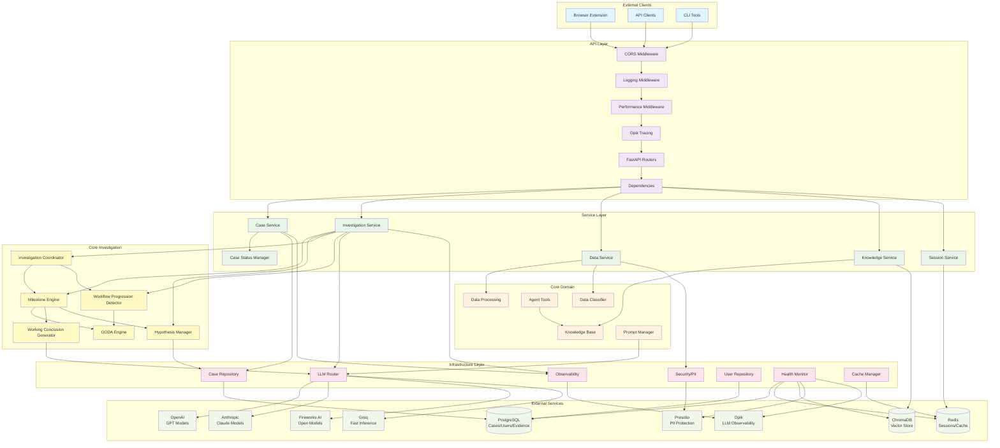
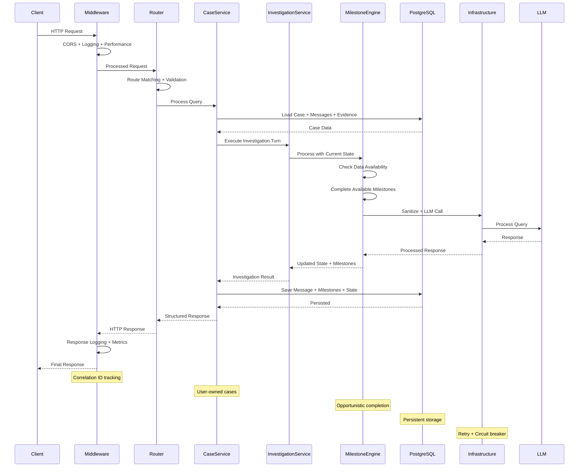
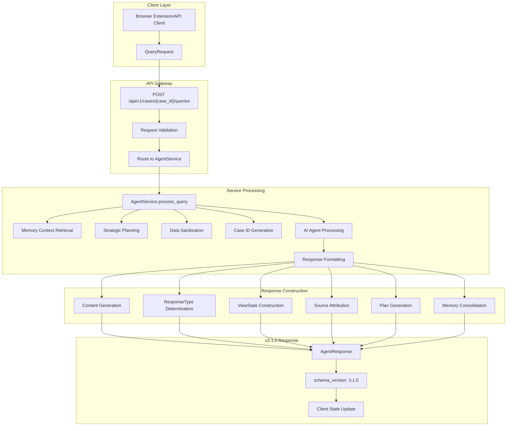
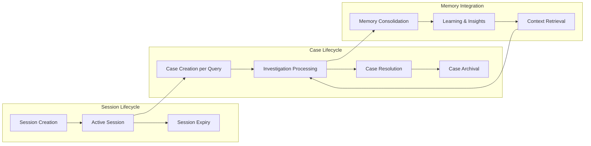
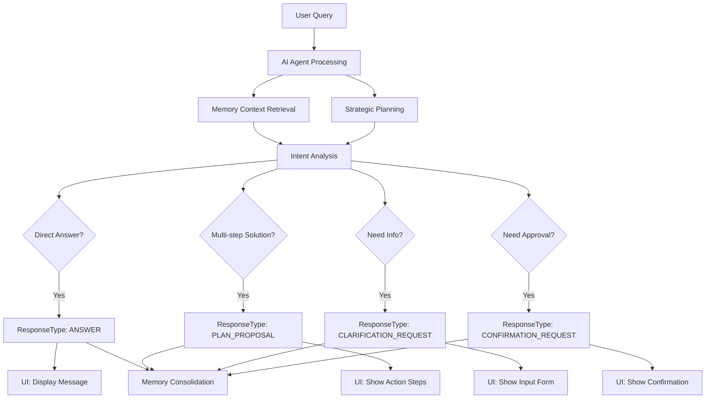
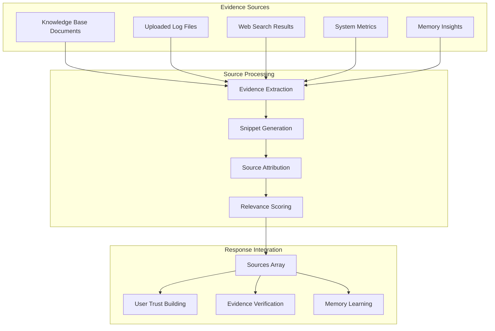
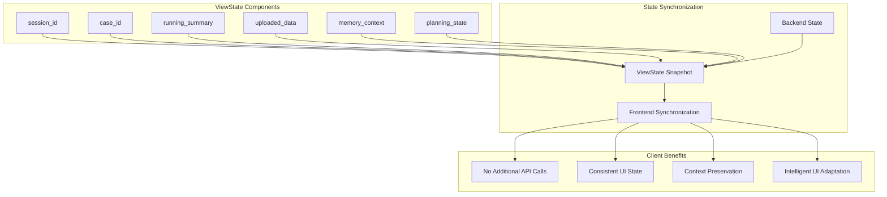
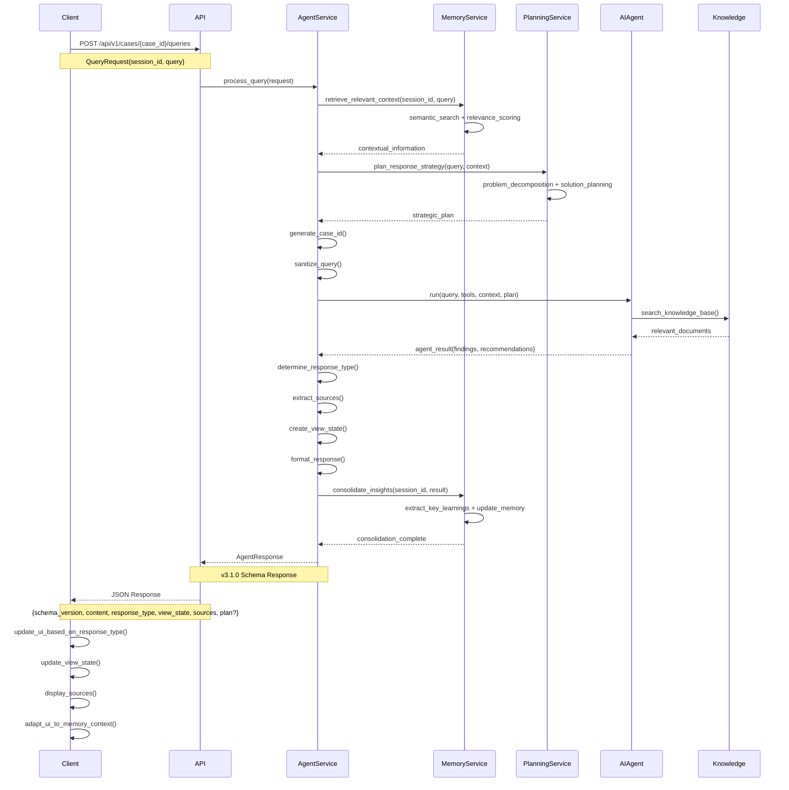
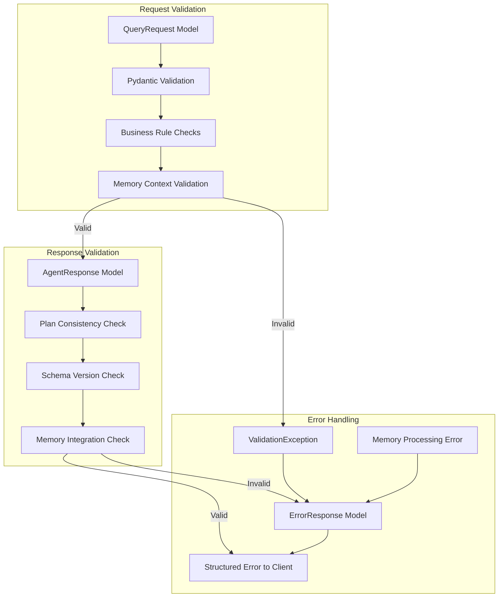

# FaultMaven System Architecture Overview v3.0

> **System Overview**
>
> FaultMaven is an AI-powered troubleshooting copilot with milestone-based investigation, PostgreSQL persistence, and multi-LLM support.
>
> **Core Architecture**:
> - **Storage**: PostgreSQL (persistent cases/users) + Redis (ephemeral sessions) + ChromaDB (vectors)
> - **Investigation**: Milestone-based opportunistic completion with MilestoneEngine
> - **Case Model**: User-owned cases with multi-session continuity
> - **LLM Support**: OpenAI, Anthropic, Fireworks AI, Groq with automatic failover
> - **Security**: PII redaction (Presidio) + RBAC authorization + guardrails
>
> **Key Design Documents**:
> - [Milestone-Based Investigation Framework](./milestone-based-investigation-framework.md) - Investigation engine design
> - [Case Storage Design](./case-storage-design.md) - PostgreSQL schema (10 tables)
> - [Prompt Engineering Guide](./prompt-engineering-guide.md) - Prompting system
> - [Knowledge Base Architecture](./knowledge-base-architecture.md) - RAG system (3 vector stores)

## Overview

FaultMaven implements a sophisticated clean architecture pattern with dependency injection, interface-based design, and comprehensive observability. The system features a modern v3.1.0 schema-driven API that provides intent-driven responses, evidence-based troubleshooting, and structured state management. Designed as a privacy-first, AI-powered troubleshooting assistant that scales horizontally and integrates seamlessly with existing DevOps toolchains.

**Key Architectural Principles:**
- **PostgreSQL Hybrid Storage**: Normalized 10-table schema for persistent case data + Redis for ephemeral sessions/cache
- **Milestone-Based Investigation**: Opportunistic task completion based on data availability, not rigid phases (see [Investigation Architecture](./milestone-based-investigation-framework.md))
- **User-Owned Cases**: Cases owned by users, not sessions - enables long-term tracking and multi-session continuity
- **MilestoneEngine**: Core investigation orchestrator with opportunistic task completion
- **Turn-Based Progress Tracking**: Milestone completions with workflow progression detection and loopback prevention
- **Dual Engagement Modes**: Consultant Mode (CONSULTING status) and Lead Investigator (INVESTIGATING status) for natural interaction
- **Hypothesis Management**: Opportunistic capture + systematic generation with confidence tracking
- **Evidence-Centric Troubleshooting**: Structured evidence collection with platform-specific extractors
- **Interface-Based Dependencies**: Clean architecture with dependency injection and interface compliance
- **Comprehensive Security**: PII protection, RBAC authorization, guardrails, and policy enforcement
- **Enterprise-Grade Reliability**: Circuit breakers, error handling, and fallback strategies
- **Multi-LLM Support**: OpenAI, Anthropic, Fireworks AI, Groq with automatic failover
- **Industry-Standard Message Schema**: `created_at`, `author_id`, `turn_number`, `token_count` following Rails/Django/GitHub conventions

## Architecture Diagram

config:
  theme: neutral
  layout: elk
  look: classic



## Layer Responsibilities

### API Layer
**Purpose**: Handle HTTP requests and responses with comprehensive middleware processing

**Components**:
- **CORS Middleware**: Cross-origin resource sharing for browser extension compatibility
- **Logging Middleware**: Unified request/response logging with correlation IDs and context extraction
- **Performance Middleware**: Real-time performance tracking and metrics collection
- **Opik Tracing**: LLM operation tracing and observability
- **FastAPI Routers**: RESTful endpoint handlers with OpenAPI documentation
- **Dependencies**: Dependency injection and request context management

**Key Files**:
- `faultmaven/api/v1/routes/` - Endpoint implementations
- `faultmaven/api/middleware/` - Middleware implementations
- `faultmaven/api/v1/dependencies.py` - DI configuration

**Advanced Features**:
- **Context-Aware Logging**: Automatic extraction of session_id and conversation context
- **Performance Profiling**: Detailed timing analysis for optimization
- **Request Correlation**: End-to-end request tracking across all layers

### Service Layer
**Purpose**: Business logic orchestration and transaction management

**Components**:
- **Case Service**: Case lifecycle management and state transitions (CONSULTING → INVESTIGATING → RESOLVED/CLOSED)
- **Investigation Service**: Milestone-based investigation orchestration with MilestoneEngine integration
- **Case Status Manager**: Case status state machine with transition validation
- **Data Service**: File upload and data processing coordination with platform-specific extractors
- **Knowledge Service**: Document ingestion and retrieval management across three KB types
- **Session Service**: Multi-session per user with client-based resumption, decoupled from cases

**Key Files**:
- `faultmaven/services/domain/case_service.py` - Case management
- `faultmaven/services/domain/investigation_service.py` - Investigation workflows
- `faultmaven/services/domain/case_status_manager.py` - Status management
- `faultmaven/services/domain/data_service.py` - Data processing
- `faultmaven/services/domain/knowledge_service.py` - KB operations
- `faultmaven/services/domain/session_service.py` - Session lifecycle

**Design Note**: Investigation Service orchestrates milestone-based workflows through MilestoneEngine. Cases are user-owned resources, independent of session lifecycle. See [Milestone-Based Investigation Framework](./milestone-based-investigation-framework.md) for complete design.

### Core Investigation
**Purpose**: Milestone-based investigation engine with opportunistic task completion

**Components**:
- **MilestoneEngine**: State-driven investigation workflow completing tasks based on data availability
- **HypothesisManager**: Dual-mode hypothesis handling (opportunistic capture + systematic generation)
- **InvestigationCoordinator**: Orchestrates milestone-based workflows and OODA integration
- **WorkflowProgressionDetector**: Detects forward progress vs circular conversations (loopback detection)
- **OODAEngine**: OODA integration for adaptive reasoning cycles
- **WorkingConclusionGenerator**: Synthesizes conclusions from completed milestones
- **Phase Loopback Detector**: Prevents infinite loops within investigation stages

**Key Files**:
- `faultmaven/core/investigation/milestone_engine.py` - Main investigation engine
- `faultmaven/core/investigation/hypothesis_manager.py` - Hypothesis tracking
- `faultmaven/core/investigation/investigation_coordinator.py` - Workflow orchestration
- `faultmaven/core/investigation/workflow_progression_detector.py` - Progress detection
- `faultmaven/core/investigation/ooda_engine.py` - OODA integration
- `faultmaven/core/investigation/working_conclusion_generator.py` - Conclusion synthesis
- `faultmaven/core/investigation/phase_loopback.py` - Loop prevention

**Design Principles**:
- Opportunistic completion - complete tasks when data available
- No artificial phase barriers
- Turn-based progress tracking
- Milestone-driven state transitions
- Data-driven task selection

### Core Domain
**Purpose**: Core business logic and domain models

**Components**:
- **Investigation Engine**: Milestone-based troubleshooting with opportunistic completion (see Core Investigation section above)
- **Data Processing**: Log analysis and insight extraction with platform-specific extractors
- **Knowledge Base**: RAG-enabled document retrieval with semantic search across three distinct vector store systems (User KB, Global KB, Case Evidence Store)
- **Agent Tools**: Three specialized Q&A tools for stateless document retrieval, plus web search capabilities
- **Data Classifier**: Automatic file type and content detection
- **Prompt Manager**: Centralized prompt assembly and optimization

**Key Files**:
- `faultmaven/core/investigation/` - Milestone-based investigation engine
- `faultmaven/core/processing/` - Data analysis algorithms
- `faultmaven/core/knowledge/` - Knowledge management
- `faultmaven/tools/` - Agent tool implementations (KB-neutral Q&A tools with Strategy Pattern)
- `faultmaven/prompts/` - Prompt engineering (investigation/, phase prompts)

**Investigation Model**: FaultMaven implements **milestone-based investigation** where the agent completes tasks opportunistically based on data availability rather than following rigid phases. Case Status (CONSULTING/INVESTIGATING/RESOLVED/CLOSED) tracks user-facing lifecycle. Investigation Stages (Understanding/Diagnosing/Resolving) provide optional progress detail computed from milestones. See [Milestone-Based Investigation Framework](./milestone-based-investigation-framework.md) for complete methodology.

**Knowledge Base Architecture**: FaultMaven implements **three completely separate vector storage systems** with distinct purposes, lifecycles, and ownership models:
- **User Knowledge Base** (per-user permanent storage) - Personal runbooks and procedures
- **Global Knowledge Base** (system-wide permanent storage) - Admin-managed troubleshooting reference
- **Case Evidence Store** (ephemeral case-specific storage) - Temporary evidence uploaded during active investigations

The knowledge base uses a **KB-neutral Strategy Pattern** where one core DocumentQATool class works with all three KB types through injected KBConfig strategies. This enables adding new KB types without modifying core code. See [Knowledge Base Architecture](./knowledge-base-architecture.md) for storage layer details (ChromaDB collections, Strategy Pattern, lifecycle management), [Q&A Tools Design](./qa-tools-design.md) for access layer details (KB-neutral RAG retrieval, tool wrappers, DocumentQATool implementation), and [Vector Database Operations](./vector-database-operations.md) for operational procedures (ingestion pipelines, query flows, admin workflows).

### Infrastructure Layer
**Purpose**: External service integrations and cross-cutting concerns

**Components**:
- **LLM Router**: Multi-provider routing with failover (OpenAI, Anthropic, Fireworks, Groq)
- **Security/PII**: Data sanitization and privacy protection with Presidio integration + RBAC
- **Observability**: Comprehensive tracing and metrics collection with Opik integration
- **Persistence**: PostgreSQL hybrid storage + Redis ephemeral + ChromaDB vectors
  - **PostgreSQL**: Primary relational database for cases, evidence, organizations, teams, and sharing infrastructure
  - **Redis**: Session storage, caching, and memory management
  - **ChromaDB**: Vector database for knowledge base and document embeddings
- **Case Repository**: PostgreSQLHybridCaseRepository (10-table normalized schema with sharing support)
- **User Repository**: User and authentication storage in PostgreSQL
- **Organization Repository**: Organization and RBAC management
- **Team Repository**: Team collaboration management
- **KB Document Repository**: Knowledge base document sharing
- **Health Monitor**: Component health checking and SLA tracking
- **Metrics Collector**: Performance metrics aggregation
- **Alert Manager**: Real-time alerting and notification
- **Cache**: Redis-backed caching for sessions and performance

**Key Files**:
- `faultmaven/infrastructure/llm/` - LLM provider implementations (including groq_provider.py)
- `faultmaven/infrastructure/security/` - PII redaction and RBAC authorization
- `faultmaven/infrastructure/observability/` - Tracing and metrics
- `faultmaven/infrastructure/persistence/` - Storage layer implementations
  - `postgresql_hybrid_case_repository.py` - PostgreSQL case storage with sharing support
  - `organization_repository.py` - Organization and RBAC management
  - `team_repository.py` - Team collaboration management
  - `kb_document_repository.py` - Knowledge base document sharing
  - `case_repository.py` - Repository interface
  - `user_repository.py` - User storage
  - `redis_session_store.py` - Session management
  - `inmemory_*_store.py` - Testing implementations
- `faultmaven/infrastructure/health/` - Health monitoring
- `faultmaven/infrastructure/monitoring/` - Performance monitoring
- `faultmaven/infrastructure/redis_client.py` - Lightweight Redis client factory

**Database Schema**: Production-ready PostgreSQL schema definitions in `docs/schema/`:
- `001_initial_hybrid_schema.sql` - Base schema (10 normalized tables)
- `002_add_case_sharing.sql` - Case sharing infrastructure (case_participants table)
- `003_enterprise_user_schema.sql` - Organizations, teams, RBAC (8 tables, 7 roles, 19 permissions)
- `004_kb_sharing_infrastructure.sql` - Knowledge base sharing (5 tables with visibility levels)

**Architecture Principle**: Hybrid storage strategy with clear separation:
- **PostgreSQL** (Persistent): Cases, messages, evidence, hypotheses, milestones, users, auth, organizations, teams, sharing
- **Redis** (Ephemeral): Sessions, cache, temporary working state
- **ChromaDB** (Vectors): Knowledge base embeddings (3 separate collections)

## Dependency Injection Architecture

> **Detailed Design**: See [Dependency Injection Design](./dependency-injection-design.md) for complete system design

```mermaid
graph TB
    subgraph "DI Container"
        CONT[DIContainer]
        INIT[Initialization]
        HEALTH[Health Checks]
        MEMORY[Memory Management]
    end
    
    subgraph "Service Interfaces"
        IAGENT[IAgentService]
        IDATA[IDataService]
        IKNOWLEDGE[IKnowledgeService]
        ISESSION[ISessionService]
        IMEMORY[IMemoryService]
        IPLANNING[IPlanningService]
    end
    
    subgraph "Infrastructure Interfaces"
        ILLM[ILLMProvider]
        ISAN[ISanitizer]
        ITRACE[ITracer]
        ISTORE[ISessionStore]
        IVECTOR[IVectorStore]
        ICACHE[IMemoryCache]
    end
    
    subgraph "Service Implementations"
        AGENT_IMPL[AgentService]
        DATA_IMPL[DataService]
        KNOWLEDGE_IMPL[KnowledgeService]
        SESSION_IMPL[SessionService]
        MEMORY_IMPL[MemoryService]
        PLANNING_IMPL[PlanningService]
    end
    
    subgraph "Infrastructure Implementations"
        LLM_IMPL[LLMRouter]
        SAN_IMPL[DataSanitizer]
        TRACE_IMPL[OpikTracer]
        STORE_IMPL[RedisSessionStore]
        VECTOR_IMPL[ChromaDBStore]
        CACHE_IMPL[RedisMemoryCache]
    end
    
    %% Container relationships
    CONT --> INIT
    CONT --> HEALTH
    CONT --> MEMORY
    
    %% Service interfaces
    CONT --> IAGENT
    CONT --> IDATA
    CONT --> IKNOWLEDGE
    CONT --> ISESSION
    CONT --> IMEMORY
    CONT --> IPLANNING
    
    %% Infrastructure interfaces
    CONT --> ILLM
    CONT --> ISAN
    CONT --> ITRACE
    CONT --> ISTORE
    CONT --> IVECTOR
    CONT --> ICACHE
    
    %% Implementation bindings
    IAGENT -.-> AGENT_IMPL
    IDATA -.-> DATA_IMPL
    IKNOWLEDGE -.-> KNOWLEDGE_IMPL
    ISESSION -.-> SESSION_IMPL
    IMEMORY -.-> MEMORY_IMPL
    IPLANNING -.-> PLANNING_IMPL
    
    ILLM -.-> LLM_IMPL
    ISAN -.-> SAN_IMPL
    ITRACE -.-> TRACE_IMPL
    ISTORE -.-> STORE_IMPL
    IVECTOR -.-> VECTOR_IMPL
    ICACHE -.-> CACHE_IMPL
    
    %% Service dependencies
    AGENT_IMPL --> ILLM
    AGENT_IMPL --> ITRACE
    AGENT_IMPL --> IMEMORY
    AGENT_IMPL --> IPLANNING
    DATA_IMPL --> ISAN
    KNOWLEDGE_IMPL --> IVECTOR
    SESSION_IMPL --> ISTORE
    MEMORY_IMPL --> ICACHE
    PLANNING_IMPL --> ILLM
    
    classDef container fill:#e3f2fd
    classDef interface fill:#f3e5f5
    classDef implementation fill:#e8f5e8
    
    class CONT,INIT,HEALTH,MEMORY container
    class IAGENT,IDATA,IKNOWLEDGE,ISESSION,IMEMORY,IPLANNING,ILLM,ISAN,ITRACE,ISTORE,IVECTOR,ICACHE interface
    class AGENT_IMPL,DATA_IMPL,KNOWLEDGE_IMPL,SESSION_IMPL,MEMORY_IMPL,PLANNING_IMPL,LLM_IMPL,SAN_IMPL,TRACE_IMPL,STORE_IMPL,VECTOR_IMPL,CACHE_IMPL implementation
```



**Service Interfaces**:
- `IAgentService` - AI reasoning orchestration
- `IDataService` - Data processing
- `IKnowledgeService` - Knowledge base operations
- `ISessionService` - Session management
- `IMemoryService` - Memory operations
- `IPlanningService` - Strategic planning

**Infrastructure Interfaces**:
- `ILLMProvider` - LLM provider abstraction
- `ISanitizer` - Data sanitization
- `ITracer` - Distributed tracing
- `ISessionStore` - Session persistence
- `IVectorStore` - Vector database
- `IMemoryCache` - Memory caching

**Benefits**:
- Easy testing with mocks
- Runtime provider swapping
- Zero-downtime deployments
- Clean separation of concerns

## Data Flow Architecture

> **Detailed Design**: See [Data Flow Architecture](./data-flow-architecture.md) for complete request lifecycle



**High-Level Flow**:
1. **Client Request** → API Gateway with middleware processing
2. **Case Service** → Load case from PostgreSQL (messages, evidence, milestones)
3. **Investigation Service** → Orchestrate milestone-based investigation
4. **Milestone Engine** → Complete tasks based on data availability
5. **LLM Processing** → Generate responses via infrastructure layer
6. **State Persistence** → Save updated state to PostgreSQL
7. **Response Assembly** → Format and return structured response

**Special Flows**:
- **Lead Investigator Mode**: Milestone-based investigation with opportunistic completion
- **Evidence Collection**: Platform-specific extractors for logs, metrics, configs
- **Hypothesis Management**: Dual-mode (opportunistic capture + systematic generation)
- **Workflow Progression**: Loopback detection prevents circular conversations
- **Case Status Transitions**: CONSULTING → INVESTIGATING → RESOLVED/CLOSED

See [Milestone-Based Investigation Framework](./milestone-based-investigation-framework.md) for detailed investigation flow scenarios.

## v3.1.0 Schema Architecture

> **Note**: Complete API schema specification is documented in this section below. All schema contracts, data models, and integration examples are included here.

### Schema-Driven API Design

The v3.1.0 schema introduces a modern, intent-driven API architecture that provides structured responses with evidence attribution, state management, and intelligent communication:



### Core Schema Components

#### 1. Session vs Case Architecture



**Session Management**:
- **Purpose**: Client-based authentication and session continuity
- **Lifecycle**: Configurable TTL with automatic cleanup and resumption support
- **Scope**: Multiple concurrent sessions per user (one per client/device)
- **Storage**: Redis-backed with multi-index (user_id, client_id) → session_id mapping
- **Client Resumption**: Same client_id can resume sessions across browser restarts
- **Multi-Device Support**: Independent sessions per device for same user

**Case Management**:
- **Purpose**: Persistent investigation tracking with collaboration support
- **Lifecycle**: Long-lived, persists for audit and follow-up
- **Scope**: Single investigation from query to resolution
- **Storage**: PostgreSQL database-backed for persistence (see `docs/schema/` for schema definitions)
- **Sharing Capabilities**:
  - Individual user sharing with role-based access (owner, collaborator, viewer)
  - Team-based sharing for organizational collaboration
  - Organization-wide visibility with RBAC permissions
  - Audit trail for all sharing actions
- **Memory Integration**: Episodic memory for future reference
- **Multi-Tenancy**: Organizations and teams with Row-Level Security (RLS)

#### 2. Response Type Architecture



The ResponseType enum enables explicit intent communication:
- **ANSWER**: Direct response to user's question → Conversational UI
- **PLAN_PROPOSAL**: Multi-step troubleshooting plan → Structured action UI
- **CLARIFICATION_REQUEST**: Agent needs more information → Input form UI
- **CONFIRMATION_REQUEST**: Agent needs user approval → Confirmation dialog UI

#### 3. Evidence Attribution Architecture



**Source Types**:
- **knowledge_base**: From ingested documentation and runbooks
- **log_file**: From uploaded system logs and metrics
- **web_search**: From external research and documentation
- **memory_insights**: From previous conversation analysis

**Evidence Structure**:
```json
{
  "type": "knowledge_base",
  "name": "database_troubleshooting.md", 
  "snippet": "Connection pool exhaustion occurs when activeCount equals maxActive...",
  "relevance_score": 0.95,
  "confidence": 0.9
}
```

#### 4. ViewState Management Architecture



ViewState eliminates the need for separate API calls by providing:
- **Current session context**: Active session identifier
- **Investigation tracking**: Case ID for persistent investigation
- **Progress summary**: Human-readable investigation status
- **Uploaded data context**: List of files available for analysis
- **Memory context**: Relevant conversation history and insights
- **Planning state**: Current troubleshooting strategy and progress

**Investigation Extensions** (when in Lead Investigator mode):
- `lifecycle_progress` - Current phase (0-6), entry point, completion status
- `ooda_progress` - Active OODA steps, iteration count, hypothesis status
- `evidence_status` - Pending/complete/blocked evidence requests

See [Investigation Phases Framework - ViewState](./investigation-phases-and-ooda-integration.md#agent-response-format-v320) for complete structure and usage examples.

### Data Flow Architecture



### Schema Validation Architecture



**Validation Rules**:
- **Plan Consistency**: `plan` field only allowed for `PLAN_PROPOSAL` responses
- **Schema Version**: Always "3.1.0" for new responses
- **Required Fields**: All mandatory fields must be present and valid
- **Source Types**: Source type must match SourceType enum values
- **Memory Integration**: Memory context must be valid and accessible
- **Planning State**: Planning state must be consistent with response type

## Key Design Patterns

> **Detailed Guide**: See [Design Patterns Guide](./design-patterns-guide.md) for complete implementation examples

### 1. Interface Segregation Principle
Every dependency is injected as an interface, enabling:
- Easy testing with mocks
- Runtime provider swapping
- Zero-downtime deployments
- Clean separation of concerns

```python
# Example: Memory Service Interface
class IMemoryService(ABC):
    @abstractmethod
    async def retrieve_context(self, session_id: str, query: str) -> ConversationContext:
        pass
    
    @abstractmethod
    async def consolidate_insights(self, session_id: str, result: dict) -> bool:
        pass
    
    @abstractmethod
    async def get_user_profile(self, session_id: str) -> UserProfile:
        pass
```

### 2. Dependency Inversion Principle
High-level modules depend on abstractions, not concretions:

```python
# Service depends on interface, not implementation
class AgentService:
    def __init__(
        self, 
        llm_provider: ILLMProvider, 
        tracer: ITracer,
        memory_service: IMemoryService,
        planning_service: IPlanningService
    ):
        self._llm = llm_provider        # Interface
        self._tracer = tracer          # Interface
        self._memory = memory_service  # Interface
        self._planning = planning_service  # Interface
```

### 3. Command Query Separation
Clear separation between commands (state changes) and queries:

```python
# Query - read-only operation
async def get_session_info(session_id: str) -> SessionInfo

# Command - state-changing operation  
async def create_session(metadata: dict) -> str

# Memory operations
async def retrieve_context(session_id: str, query: str) -> ConversationContext  # Query
async def consolidate_insights(session_id: str, result: dict) -> bool          # Command
```

### 4. Single Responsibility Principle
Each component has one well-defined responsibility:

- **Agent Service**: Orchestrates AI reasoning workflows with memory and planning
- **Data Service**: Manages file upload and processing
- **Knowledge Service**: Handles document ingestion and retrieval
- **Session Service**: Manages conversation state
- **Memory Service**: Manages hierarchical memory and context consolidation
- **Planning Service**: Manages strategic planning and problem decomposition

### 5. Error Context Propagation
Comprehensive error context flows through all layers:

```python
# Error context with automatic recovery
try:
    result = await service.process_request(data)
except ServiceException as e:
    error_context.add_layer_error("service", e)
    error_context.add_memory_context(memory_service.get_context())
    recovery_result = await error_recovery.attempt_recovery()
    if recovery_result.success:
        return recovery_result.data
    raise
```

### 6. Multi-Tenancy and Collaboration

**Enterprise SaaS Architecture** with organizations, teams, and role-based access control:

**Organizations**: Workspace-level isolation with Row-Level Security (RLS)
- Multi-tenant data isolation using PostgreSQL RLS policies
- Subscription tiers: FREE (5 members), PRO (50 members), ENTERPRISE (unlimited)
- Organization-wide permissions and resource quotas

**Teams**: Sub-organization collaboration groups
- Team-based case sharing and collaboration
- Team-specific knowledge base access
- Flexible team membership and roles

**Role-Based Access Control (RBAC)**:
- 7 system roles: owner, admin, member, viewer, team lead
- 19 permissions across 5 resources (cases, knowledge_base, organization, users, teams)
- SQL-function based permission checks for performance
- Hierarchical permission inheritance

**Sharing Infrastructure**:
- **Case Sharing**: Individual user (owner/collaborator/viewer), team, organization-wide
- **KB Sharing**: Private, shared, team-scoped, organization-scoped with read/write permissions
- **Audit Trail**: Complete audit logging for all sharing actions and permission changes

**Implementation**:
```python
# Organization service with RBAC enforcement
class OrganizationService:
    async def add_member(self, org_id: str, user_id: str, role_id: str, added_by: str):
        # Check permission
        has_permission = await self.repository.user_has_permission(
            added_by, org_id, "users.write"
        )
        if not has_permission:
            raise ValidationException("User lacks permission to add members")

        # Check capacity against org plan
        org = await self.repository.get_organization(org_id)
        if len(members) >= org.max_members:
            raise ValidationException(f"Organization at capacity")

        # Add member with audit logging
        return await self.repository.add_member(org_id, user_id, role_id)
```

**Database Schema**: See `docs/schema/` for complete PostgreSQL schema definitions:
- `002_add_case_sharing.sql` - Case collaboration infrastructure
- `003_enterprise_user_schema.sql` - Organizations, teams, RBAC
- `004_kb_sharing_infrastructure.sql` - Knowledge base sharing

## Performance Characteristics

> **Detailed Specification**: See [Performance and Scalability](./performance-and-scalability.md) for complete benchmarks and optimization strategies

### Response Time Targets
- **API Endpoints**: < 200ms (excluding LLM processing)
- **Memory Retrieval**: < 50ms for context retrieval
- **Planning Operations**: < 100ms for strategy development
- **File Upload**: < 5s for files up to 10MB
- **Knowledge Search**: < 100ms for vector similarity
- **Session Operations**: < 50ms for state management
- **Health Checks**: < 10ms for component status

### Throughput Capabilities
- **Concurrent Requests**: 100+ simultaneous requests
- **Session Capacity**: 1000+ active sessions
- **Memory Operations**: 500+ concurrent operations
- **Planning Operations**: 200+ concurrent operations
- **File Processing**: 10+ concurrent uploads
- **Knowledge Base**: 10,000+ documents with sub-second search

### Memory Usage
- **Baseline**: ~300MB application memory
- **Per Session**: ~2-8MB depending on conversation history
- **Memory Cache**: ~100MB for active operations
- **File Processing**: ~2x file size during processing
- **ML Models**: ~500MB for BGE-M3 embeddings

### Storage Requirements
- **Session Data**: Redis with configurable TTL
- **Knowledge Base**: ChromaDB vector storage
- **Memory Storage**: Redis with semantic indexing
- **Investigation State**: Redis with hierarchical compression (~1.6KB vs 4.5KB uncompressed)
- **File Uploads**: Temporary storage with automatic cleanup
- **Logs**: Structured JSON with log rotation

## Scalability Considerations

### Horizontal Scaling
- **Stateless Design**: All application state in external stores
- **Load Balancing**: Standard HTTP load balancers supported
- **Session Affinity**: Not required due to Redis-based sessions
- **Memory Distribution**: Distributed memory caching across instances
- **Database Scaling**: ChromaDB and Redis both horizontally scalable

### Caching Strategy
- **LLM Response Caching**: Semantic similarity-based caching
- **Knowledge Base**: Vector similarity caching with embeddings
- **Session Data**: Redis-based distributed caching
- **Memory Cache**: Hierarchical caching with semantic search
- **Planning Cache**: Strategy caching with problem similarity
- **File Processing**: Results cached by content hash

### Resource Management
- **Connection Pooling**: Configurable pool sizes for all external services
- **Rate Limiting**: Per-client and per-endpoint rate limiting
- **Circuit Breakers**: Automatic failover for external service failures
- **Backpressure**: Request queuing with overflow protection
- **Memory Management**: Automatic cleanup and compression

### Monitoring and Observability
- **Distributed Tracing**: Full request tracing with Opik integration
- **Metrics Collection**: Real-time performance metrics
- **Health Monitoring**: Component-level health checks with SLA tracking
- **Alerting**: Configurable alerts for performance degradation
- **Memory Analytics**: Memory usage and performance analytics
- **Planning Analytics**: Planning effectiveness and quality metrics

## Security Architecture

> **Detailed Specification**: See [Security and Deployment](./security-and-deployment.md) for complete security policies and deployment strategies

### Data Privacy
- **PII Redaction**: Automatic detection and redaction using Presidio
- **Data Sanitization**: All data sanitized before external processing
- **Memory Privacy**: Sensitive data excluded from memory consolidation
- **Encryption**: Data encrypted in transit and at rest
- **Audit Logging**: Comprehensive audit trail for all operations

### Authentication and Authorization

**Status**: ✅ **IMPLEMENTED** (Token-based auth with RBAC)

#### Authentication System
- **Token-Based Authentication**: UUID tokens with SHA-256 hashing
- **Token Lifecycle**: 24-hour expiration with automatic cleanup
- **Storage**: Redis-backed with user profiles and token metadata
- **User Management**: CLI tools and API endpoints for user administration

#### Authorization (RBAC)
- **Role-Based Access Control**: Two-tier role system (user, admin)
- **Regular Users**: Can search/read Global KB, manage own User KB
- **Admin Users**: Can manage Global KB (upload, update, delete)
- **Endpoint Protection**: Server-side role validation on all admin operations
- **Frontend Integration**: Roles included in login response for UI decisions

#### Implementation Details
See [Authentication Design](./authentication-design.md#role-based-access-control) for complete system design and [Role-Based Access Control](../security/role-based-access-control.md) for user management and integration guide.

#### User Management
- **CLI Tools**: Scripts for listing, creating, promoting users (see `scripts/auth/`)
- **API Endpoints**: `POST /auth/dev-login`, `POST /auth/dev-register`, `GET /auth/me`
- **Role Assignment**: Programmatic role management via user store API

#### Future Enhancements
- **API Key Authentication**: High priority for production deployment
- **OAuth2/OIDC**: Enterprise SSO integration (Auth0/Clerk)
- **Multi-Factor Authentication**: Enhanced security for production
- **Rate Limiting**: Per-user and per-role rate limiting

### Network Security
- **CORS Configuration**: Restrictive CORS policies for browser security
- **Input Validation**: Comprehensive input validation and sanitization
- **Output Encoding**: Safe output encoding to prevent injection attacks
- **Error Handling**: Safe error responses without information disclosure

## Deployment Architecture

### Container Strategy
- **Single Container**: Monolithic deployment for simplicity
- **Multi-Stage Build**: Optimized Docker images with dependency caching
- **Health Checks**: Container health checks for orchestration
- **Graceful Shutdown**: Proper signal handling for zero-downtime deployments

### External Dependencies
- **PostgreSQL**: Primary relational database for persistent storage (required)
  - **Case Storage**: Cases, messages, evidence, hypotheses, milestones
  - **User Management**: Users, authentication, organizations, teams
  - **Sharing Infrastructure**: Case participants, team members, KB permissions
- **Redis**: Session storage, caching, and memory management (required)
  - **Session Storage**: Uses lightweight Redis client for high-frequency session operations
  - **Memory Cache**: Optimized for minimal logging overhead on internal operations
- **ChromaDB**: Vector database for knowledge base (required)
- **Presidio**: PII redaction service (required)
- **Opik**: LLM observability (optional)
- **LLM Providers**: OpenAI, Anthropic, or Fireworks AI (at least one required)

### Configuration Management
- **Environment Variables**: All configuration via environment variables
- **Configuration Validation**: Startup-time configuration validation
- **Feature Flags**: Runtime feature toggles for safe deployments
- **Secrets Management**: External secret injection support

### High Availability
- **Stateless Design**: Enables multiple instance deployment
- **External State**: All persistent state in external services
- **Health Monitoring**: Continuous health monitoring with automatic recovery
- **Circuit Breakers**: Automatic failover for external service outages
- **Memory Redundancy**: Distributed memory storage for high availability

## Implementation Module Mapping

> **Detailed Reference**: See [Implementation Module Mapping](./implementation-module-mapping.md) for complete file-by-file breakdown

This section provides a high-level mapping of architectural components to Python modules within the `/faultmaven/` directory structure.

### API Layer
- `main.py` - FastAPI application
- `api/middleware/` - Request processing middleware
- `api/v1/routes/` - RESTful endpoints
  - `case.py` - Case management endpoints
  - `organizations.py` - Organization management endpoints (15 endpoints)
  - `teams.py` - Team collaboration endpoints (11 endpoints)
  - `auth.py` - Authentication endpoints
  - `data.py`, `knowledge.py`, `session.py` - Core functionality
- `api/v1/dependencies.py` - DI configuration
- `api/v1/auth_dependencies.py` - Authentication dependencies

### Service Layer
- `services/domain/case_service.py` - Case management
- `services/domain/investigation_service.py` - Investigation orchestration
- `services/domain/case_status_manager.py` - Status state machine
- `services/domain/data_service.py` - File processing
- `services/domain/knowledge_service.py` - Document management
- `services/domain/session_service.py` - Session lifecycle
- `services/domain/organization_service.py` - Organization and RBAC management
- `services/domain/team_service.py` - Team collaboration management
- `services/adapters/case_ui_adapter.py` - UI data transformation
- `services/converters/case_converter.py` - Case data mapping

### Core Investigation
- `core/investigation/milestone_engine.py` - Main investigation engine
- `core/investigation/hypothesis_manager.py` - Hypothesis tracking
- `core/investigation/investigation_coordinator.py` - Workflow orchestration
- `core/investigation/workflow_progression_detector.py` - Progress detection
- `core/investigation/ooda_engine.py` - OODA integration
- `core/investigation/working_conclusion_generator.py` - Conclusion synthesis
- `core/investigation/phase_loopback.py` - Loop prevention
- `core/investigation/engagement_modes.py` - Mode switching
- `core/investigation/phases.py` - Phase definitions
- `core/investigation/strategy_selector.py` - Strategy selection
- `core/investigation/memory_manager.py` - Memory integration

### Core Domain
- `core/investigation/` - Milestone-based investigation (see above)
- `core/processing/` - Data analysis
- `core/knowledge/` - Knowledge base management
- `tools/` - Agent capabilities (KB-neutral Q&A tools)
- `prompts/` - Prompt engineering

### Infrastructure
- `infrastructure/llm/` - LLM providers (OpenAI, Anthropic, Fireworks, Groq)
- `infrastructure/security/` - PII protection + RBAC
- `infrastructure/observability/` - Tracing and metrics
- `infrastructure/persistence/` - Hybrid storage layer
  - `postgresql_hybrid_case_repository.py` - PostgreSQL storage with sharing support
  - `case_repository.py` - Repository interface
  - `user_repository.py` - User storage
  - `organization_repository.py` - Organization and RBAC management
  - `team_repository.py` - Team collaboration management
  - `kb_document_repository.py` - Knowledge base document sharing
  - `redis_session_store.py` - Session management
  - `inmemory_*_store.py` - Testing implementations
- `infrastructure/health/` - Health monitoring
- `infrastructure/monitoring/` - Performance monitoring

### Data Models
- `models/interfaces.py` - Service interfaces
- `models/interfaces_case.py` - Case repository interface
- `models/interfaces_user.py` - Organization and team interfaces
- `models/interfaces_kb.py` - Knowledge base sharing interfaces
- `models/case.py` - Case models
- `models/case_ui.py` - UI models
- `models/api.py` - v3.1.0 schema models
- `models/api_models.py` - Additional API models
- `models/investigation.py` - Investigation models
- `models/llm_schemas.py` - LLM structured output
- `models/evidence.py` - Evidence tracking
- `models/common.py` - Shared models

### Configuration
- `config/settings.py` - Unified configuration
- `config/feature_flags.py` - Runtime toggles
- `container.py` - DI container

## Data Preprocessing System

> **STATUS**: 🟡 DESIGNED - Implementation in Progress
> **Detailed Specification**: [`data-preprocessing-design.md`](./data-preprocessing-design.md)

### Overview

Comprehensive **data preprocessing pipeline** transforms uploaded files into LLM-ready summaries:

**3-Step Pipeline**:
1. **Classify**: Identify data type (LOG_FILE, METRICS_DATA, ERROR_REPORT, CONFIG_FILE, etc.)
2. **Preprocess**: Domain-specific processing → LLM-ready summary (~8K chars)
3. **LLM Analysis**: AI agent analyzes preprocessed summary → Conversational response

**Key Features:**
- **8 Data Types**: Logs, errors, configs, metrics, profiling, traces, docs, screenshots
- **Custom Preprocessors**: Domain-specific knowledge extraction using Python libraries
- **Plain Text Summaries**: 5-8K character summaries optimized for LLM context
- **Direct Context Injection**: Preprocessed summaries injected into LLM system prompt
- **Security Scanning**: Automatic PII/secret detection and redaction

**Data Submission Flow**:
- **Path 1 (Explicit)**: `POST /api/v1/cases/{case_id}/data` - Dedicated file upload
- **Path 2 (Implicit)**: `POST /api/v1/cases/{case_id}/queries` - Auto-detect large pastes (>10K chars)

**Implementation Status**:
- ✅ Classification: DataClassifier with pattern matching
- ⚠️ Preprocessing: Design complete, implementation pending
- ✅ LLM Integration: AgentService ready for preprocessed input

For complete specifications, see:
- [Data Preprocessing Design v4.0](./data-preprocessing-design.md) - Complete system design
- [Data Submission Design v3.1](./data-submission-design.md) - Upload flow and dual-path routing

---

## Related Documentation

This section provides a complete navigation map to all FaultMaven design documents, **organized to mirror the actual code structure** for easy navigation during implementation.

---

### 1. Requirements and Specifications

**What the System Must Do**:
- [`System Requirements Specification (SRS) v2.0`](../system-requirements-specification.md) - 62 requirements: Response Types, Case Management, Conversation Intelligence, Performance, Security, Compliance
- [`Case and Session Concepts v2.0`](./case-and-session-concepts.md) - 🎯 Fundamental concepts: 4-concept model (User, Client, Session, Case), multi-session architecture, relationship diagrams, anti-patterns, testing verification

---

### 2. Service Layer Design

**Code Location**: `faultmaven/services/`  
**Update Frequency**: 🔥 HIGH (business logic evolves frequently)

#### Domain Services (`services/domain/`)

Core business services implementing case, data, knowledge, investigation, and session management:

- [`Milestone-Based Investigation Framework v2.0`](./milestone-based-investigation-framework.md) - ✅ **IMPLEMENTED** - Authoritative investigation design (used by investigation_service.py, case_service.py): Opportunistic completion, milestone tracking, case status lifecycle, turn-based progress
- [`Case Storage Design`](./case-storage-design.md) - ✅ **IMPLEMENTED** - PostgreSQL schema specification (10 tables): cases, messages, evidence, hypotheses, milestones, users, auth
- [`Redis Usage Design`](./redis-usage-design.md) - ✅ **IMPLEMENTED** - Hybrid storage strategy: PostgreSQL (persistent) vs Redis (ephemeral), usage guidelines
- [`Session Management Specification v1.0`](./specifications/session-management-spec.md) - Multi-session architecture (session_service.py): Client-based resumption, user-owned cases, Redis storage
- [`Data Preprocessing Design v4.0`](./data-preprocessing-design.md) - Complete preprocessing system (data_service.py): 3-step pipeline, 8 data types, platform-specific extractors, LLM integration
- [`Knowledge Base Architecture v4.0`](./knowledge-base-architecture.md) - 🟢 **PRODUCTION READY** - Storage layer (knowledge_service.py): Three distinct vector stores (User KB, Global KB, Case Evidence), KB-neutral Strategy Pattern with KBConfig, ChromaDB collections, lifecycle management
- [`Q&A Tools Design v3.1`](./qa-tools-design.md) - 🟢 **PRODUCTION READY** - Access layer (core/tools/): KB-neutral RAG retrieval, three tool wrappers (AnswerFromCaseEvidence, AnswerFromUserKB, AnswerFromGlobalKB), DocumentQATool implementation
- [`Prompt Engineering Guide`](./prompt-engineering-guide.md) - ✅ **IMPLEMENTED** - Current prompting system: Investigation prompts, engagement modes, OODA guidance, loopback detection

#### Core Investigation (`core/investigation/`)

Milestone-based investigation engine:

- [`Milestone-Based Investigation Framework v2.0`](./milestone-based-investigation-framework.md) - Complete design document covering MilestoneEngine, HypothesisManager, WorkflowProgressionDetector, and all investigation components

#### Supporting Services

- [`Error Handling and Recovery`](./error-handling-and-recovery.md) - Error patterns: LLM errors, state corruption, infinite loops, recovery strategies
- [`Analytics and Confidence Services`](./analytics-and-confidence-services.md) - 📝 *To create* - Analytics (analytics/): Confidence scoring, dashboard aggregation
- [`Conversation Intelligence Design`](./conversation-intelligence-design.md) - 📝 *To create* - Dialogue management: Circular detection, progress measurement, dead-end prevention

---

### 3. API Layer Design

**Code Location**: `faultmaven/api/`, `faultmaven/models/api.py`  
**Update Frequency**: 🔥 HIGH (API evolves with features)

#### API Schema and Contracts

- [`Schema v3.1.0 Design`](./schema-v3-design.md) - 📝 *To create* **CRITICAL** - API contracts (models/api.py): AgentResponse, ViewState, Source attribution, validation
- [`Data Flow Architecture`](./data-flow-architecture.md) - 📝 *To create* - Request lifecycle: Middleware pipeline, service orchestration, response assembly
- [`API Contracts and Integration`](./api-contracts-and-integration.md) - 📝 *To create* - REST endpoints (api/v1/routes/): Error codes, versioning, backward compatibility

#### Middleware and Routes

- [`Middleware Architecture`](./middleware-architecture.md) - 📝 *To create* - Middleware stack (api/middleware/): Logging, performance, protection, rate limiting, request ID
- [`Data Submission Design v3.1`](./data-submission-design.md) - Data upload handling (routes/case.py): Dual-path routing, pattern detection, conversational responses

---

### 4. Core Domain Design

**Code Location**: `faultmaven/core/`  
**Update Frequency**: 🔶 MEDIUM (stable domain logic)

#### Investigation Engine

- [`Milestone-Based Investigation Framework v2.0`](./milestone-based-investigation-framework.md) - Core investigation engine (core/investigation/): MilestoneEngine, HypothesisManager, WorkflowProgressionDetector, opportunistic task completion

#### Data Processing and Analysis

- [`Log Analysis and Classification`](./log-analysis-and-classification.md) - 📝 *To create* - Log processing (core/processing/): Parser, anomaly detection, pattern learning
- [`Data Classification System`](./data-classification-system.md) - 📝 *To create* - File classification (core/processing/classifier.py): Type detection, content analysis

#### Knowledge Management

- [`Knowledge Base Architecture v4.0`](./knowledge-base-architecture.md) - Storage layer (core/knowledge/): Three distinct vector stores, Strategy Pattern, ChromaDB collections
- [`Q&A Tools Design v3.1`](./qa-tools-design.md) - Access layer (core/tools/): KB-neutral RAG retrieval, three tool wrappers, DocumentQATool implementation

---

### 5. Infrastructure Layer Design

**Code Location**: `faultmaven/infrastructure/`  
**Update Frequency**: 🔶 MEDIUM (infrastructure more stable)

#### LLM and AI Infrastructure (`infrastructure/llm/`)

- [`LLM Provider Integration`](./llm-provider-integration.md) - 📝 *To create* **HIGH PRIORITY** - Provider abstraction: Multi-provider routing, failover, cost tracking, registry

#### Persistence and Storage (`infrastructure/persistence/`)

- [`Persistence Layer Design`](./persistence-layer-design.md) - 📝 *To create* - Data storage: Redis (session, case), ChromaDB (vectors), durability, backup

#### Observability (`infrastructure/observability/`, `infrastructure/monitoring/`)

- [`Observability and Tracing`](./observability-and-tracing.md) - 📝 *To create* **HIGH PRIORITY** - Monitoring stack: Opik tracing, metrics collection, APM integration, alerting

#### Security and Protection (`infrastructure/security/`, `infrastructure/protection/`)

- [`Authentication Design`](./authentication-design.md) - ✅ **IMPLEMENTED** - Auth implementation (infrastructure/auth/): Token management, user store, RBAC
- [`Role-Based Access Control`](../security/role-based-access-control.md) - ✅ **IMPLEMENTED** - RBAC system: User roles, permissions, management tools, frontend integration
- [`Security Architecture and Policies`](./security-architecture-and-policies.md) - 📝 *To create* - Security (infrastructure/security/): PII redaction (Presidio), data sanitization
- [`Protection Systems`](./protection-systems.md) - 📝 *To create* - Protection (infrastructure/protection/): Rate limiting, circuit breakers, anomaly detection, reputation engine

#### Health and Caching (`infrastructure/health/`, `infrastructure/caching/`)

- [`Health Monitoring and SLA`](./health-monitoring-and-sla.md) - 📝 *To create* - Health system: Component monitors, SLA tracking
- [`Caching and Memory`](./caching-and-memory.md) - 📝 *To create* - Cache systems: Intelligent caching, model cache, memory management

#### Logging (`infrastructure/logging/`)

- [`Logging Architecture`](./logging-architecture.md) - 📝 *To create* - Unified logging: Configuration, coordination, correlation IDs

---

### 6. Data Models and Interfaces

**Code Location**: `faultmaven/models/`  
**Update Frequency**: 🔥 HIGH (models evolve with features)

- [`Data Models Reference`](./data-models-reference.md) - 📝 *To create* - Core models: api.py (API schema), agentic.py (framework), case.py, evidence.py, interfaces.py
- [`Interface Definitions`](./interface-definitions.md) - 📝 *To create* - Service interfaces: IAgentService, IDataService, IKnowledgeService, infrastructure interfaces
- [`Dependency Injection System`](./dependency-injection-system.md) - ✅ Design document - DI container (container.py): Service registration, interface bindings, lifecycle

---

### 7. Configuration and Deployment

**Code Location**: `faultmaven/config/`, deployment  
**Update Frequency**: 🔷 LOW (stable operational configs)

- [`Configuration Management`](./specifications/CONFIGURATION_MANAGEMENT_SPEC.md) - Settings system (config/settings.py): Environment-based, centralized thresholds
- [`Feature Flags System`](./feature-flags-system.md) - 📝 *To create* - Runtime toggles (config/feature_flags.py): Safe deployments, A/B testing
- [`Performance and Scalability Design`](./performance-and-scalability.md) - 📝 *To create* - Performance architecture: Response times, throughput, horizontal scaling, caching
- [`Deployment Architecture`](./deployment-architecture.md) - 📝 *To create* - Deployment strategy: Container, dependencies, HA, graceful shutdown
- [`Compliance and Data Governance`](./compliance-and-data-governance.md) - 📝 *To create* - Regulatory compliance: GDPR/CCPA, retention policies, audit

---

### 8. Implementation Reference

**Code Organization and Patterns**  
**Update Frequency**: 🔶 MEDIUM (updates with refactoring)

- [`Implementation Module Mapping`](./implementation-module-mapping.md) - 📝 *To create* **HIGH PRIORITY** - Complete breakdown: All modules, file responsibilities, dependency graph
- [`Design Patterns Guide`](./design-patterns-guide.md) - 📝 *To create* - Pattern implementations: Interface segregation, DI, CQRS, error propagation (with code)
- [`Service Layer Patterns`](./service-patterns.md) - Service patterns: Base service, transaction boundaries, error handling
- [`Interface-Based Design Guide`](./interface-based-design.md) - Interface guidelines: Contract design, implementation patterns

---

### 9. Developer Guides

**Onboarding and Best Practices**  
**Update Frequency**: 🔷 LOW (stable guides)

- [`Developer Guide`](./developer-guide.md) - Getting started, development setup, workflow
- [`Token Estimation Guide`](../development/TOKEN_ESTIMATION.md) - Token counting, cost optimization, provider-specific tokenizers
- [`Container Usage Guide`](./container-usage-guide.md) - DI container usage, service registration, dependency resolution
- [`Testing Guide`](./testing-guide.md) - Test strategy, fixtures, mocking, integration tests
- [`Testing Investigation Framework`](../how-to/testing-investigation-framework.md) - Testing strategies for investigation phases, OODA, hypotheses, evidence tracking
- [`Operational Configuration`](../how-to/operational-configuration.md) - System requirements, configuration, monitoring, deployment

---

### 10. Evolution and Historical Context

**Historical Reference**  
**Update Frequency**: 🔷 LOW (historical record)

**Architecture Evolution**:
- [`Configuration System Refactor`](./configuration-system-refactor-design.md) - Configuration centralization evolution

**Archived Architecture** (Historical Reference):
- [`Doctor-Patient Prompting v1.0`](./archive/DOCTOR_PATIENT_PROMPTING_ARCHITECTURE.md) - 🗄️ Original prompting (superseded by OODA framework v3.2.0)
- [`Sub-Agent Architecture v1.0`](./archive/SUB_AGENT_ARCHITECTURE.md) - 🗄️ Multi-agent coordination patterns (superseded by phase handlers)
- [`System Architecture v1.0`](./archive/SYSTEM_ARCHITECTURE.md) - 🗄️ Original architecture (superseded by Architecture Overview v2.0)


---

### Documentation Navigation

**📋 Complete Document Map**:
- [`Documentation Map and Status`](./documentation-map.md) - Full navigation with creation priorities, dependencies, statistics

**Update Frequency Guide**:
- 🔥 **HIGH** - Sections 2 (Services), 3 (API), 6 (Models) - Frequent updates as features evolve
- 🔶 **MEDIUM** - Sections 4 (Core), 5 (Infrastructure), 8 (Implementation) - Periodic updates
- 🔷 **LOW** - Sections 1 (Requirements), 7 (Config/Deploy), 9 (Guides), 10 (Evolution) - Stable

**Code-to-Docs Mapping**:
```
faultmaven/services/domain/     → Section 2 (Domain Services)
faultmaven/services/agentic/    → Section 2 (Agentic Framework)  
faultmaven/services/evidence/   → Section 2 (Evidence Collection Design)
faultmaven/api/                 → Section 3 (API Layer)
faultmaven/core/                → Section 4 (Core Domain)
faultmaven/infrastructure/      → Section 5 (Infrastructure)
faultmaven/models/              → Section 6 (Data Models)
faultmaven/config/              → Section 7 (Configuration)
```

**Status Legend**:
- ✅ **Exists** - Document created and maintained
- 📝 **To be created** - Document planned, bucket created
- 🔄 **Legacy** - Historical document (in services/agentic/doctor_patient/ for reference)
- 🎯 **Authoritative** - Source of truth for specific domain
- 🔥🔶🔷 **Update Frequency** - HIGH/MEDIUM/LOW change rate

---

**Document Version**: 3.0
**Last Updated**: 2025-11-12
**Status**: Master Architecture Document - System Specification

