# FaultMaven System Architecture Overview v2.0

## Overview

FaultMaven implements a sophisticated clean architecture pattern with dependency injection, interface-based design, and comprehensive observability. The system features a modern v3.1.0 schema-driven API that provides intent-driven responses, evidence-based troubleshooting, and structured state management. Designed as a privacy-first, AI-powered troubleshooting assistant that scales horizontally and integrates seamlessly with existing DevOps toolchains.

**Key Architectural Principles:**
- **OODA Investigation Framework (v3.2.0)**: 7-phase investigation lifecycle with flexible Observe-Orient-Decide-Act cycles (see [Investigation Phases and OODA Integration](./investigation-phases-and-ooda-integration.md))
- **Dual Engagement Modes**: Consultant (Phase 0) and Lead Investigator (Phases 1-6) for natural user interaction
- **Adaptive OODA Intensity**: Light, Medium, Full iteration cycles matched to phase complexity
- **Hierarchical Memory System**: 64% token reduction with Hot/Warm/Cold/Persistent tiers
- **Hypothesis Confidence Management**: Automatic decay (0.85^n) prevents anchoring bias
- **Evidence-Centric Troubleshooting**: Structured evidence collection with 5-dimensional classification
- **Interface-Based Dependencies**: Clean architecture with dependency injection and interface compliance
- **Persistent State Management**: Redis-backed investigation state with automatic compression
- **Comprehensive Security**: PII protection, guardrails, and policy enforcement
- **Enterprise-Grade Reliability**: Circuit breakers, error handling, and fallback strategies
- **Multi-LLM Support**: OpenAI, Anthropic, Fireworks AI with automatic failover

## Architecture Diagram

config:
  theme: neutral
  layout: elk
  look: classic

```mermaid
flowchart TB
 subgraph subGraph0["External Clients"]
        BE["Browser Extension"]
        API_CLIENT["API Clients"]
        CURL["CLI Tools"]
  end
 subgraph subGraph1["API Layer"]
        CORS["CORS Middleware"]
        LOG["Logging Middleware"]
        PERF["Performance Middleware"]
        OPIK["Opik Tracing"]
        ROUTE["FastAPI Routers"]
        DEP["Dependencies"]
  end
 subgraph subGraph2["Service Layer"]
        AS["Agent Service"]
        DS["Data Service"]
        KS["Knowledge Service"]
        SS["Session Service"]
  end
 subgraph subGraph3["Agentic Framework"]
        AWE["Business Logic & Workflow Engine"]
        ASM["State & Session Manager"]
        ACE["Query Classification Engine"]
        ATB["Tool & Skill Broker"]
        AGL["Guardrails & Policy Layer"]
        ARS["Response Synthesizer"]
        AEM["Error Handling & Fallback Manager"]
  end
 subgraph subGraph4["Core Domain"]
        AGENT["AI Agent Core"]
        PROC["Data Processing"]
        KB["Knowledge Base"]
        TOOLS["Agent Tools"]
        CLASS["Data Classifier"]
        LOG_ANALYZER["Log Analyzer"]
        PROMPT["Prompt Engine"]
  end
 subgraph subGraph5["Infrastructure Layer"]
        LLM["LLM Router"]
        SEC["Security/PII"]
        OBS["Observability"]
        PERSIST["Persistence"]
        HEALTH["Health Monitor"]
        METRICS["Metrics Collector"]
        ALERT["Alert Manager"]
        CACHE["Memory Cache"]
  end
 subgraph subGraph6["External Services"]
        REDIS[("Redis<br>Session Store")]
        CHROMA[("ChromaDB<br>Vector Store")]
        PRESIDIO["Presidio<br>PII Protection"]
        OPIK_SVC["Opik<br>LLM Observability"]
        OPENAI["OpenAI<br>GPT Models"]
        ANTHROPIC["Anthropic<br>Claude Models"]
        FIREWORKS["Fireworks AI<br>Open Models"]
  end
    BE --> CORS
    API_CLIENT --> CORS
    CURL --> CORS
    CORS --> LOG
    LOG --> PERF
    PERF --> OPIK
    OPIK --> ROUTE
    ROUTE --> DEP
    DEP --> AS & DS & KS & SS
    AS --> AGENT & AWE & LLM & OBS
    DS --> PROC & CLASS & LOG_ANALYZER & SEC
    KS --> KB & PERSIST
    SS --> PERSIST
    AWE --> ASM & ACE & ATB & AGL & ARS & AEM & LLM & OBS
    ASM --> CACHE & PERSIST
    AGENT --> TOOLS & OBS
    TOOLS --> KB
    ACE --> LLM
    ATB --> KB
    AGL --> SEC
    ARS --> LLM
    LLM --> OPENAI & ANTHROPIC & FIREWORKS
    SEC --> PRESIDIO
    OBS --> OPIK_SVC
    PERSIST --> REDIS & CHROMA
    CACHE --> REDIS
    HEALTH --> REDIS & CHROMA & PRESIDIO & OPIK_SVC
    METRICS --> ALERT
     BE:::external
     API_CLIENT:::external
     CURL:::external
     CORS:::api
     LOG:::api
     PERF:::api
     OPIK:::api
     ROUTE:::api
     DEP:::api
     AS:::service
     DS:::service
     KS:::service
     SS:::service
     AWE:::agentic
     ASM:::agentic
     ACE:::agentic
     ATB:::agentic
     AGL:::agentic
     ARS:::agentic
     AEM:::agentic
     AGENT:::core
     PROC:::core
     KB:::core
     TOOLS:::core
     CLASS:::core
     LOG_ANALYZER:::core
     LLM:::infra
     SEC:::infra
     OBS:::infra
     PERSIST:::infra
     HEALTH:::infra
     METRICS:::infra
     ALERT:::infra
     CACHE:::infra
     REDIS:::storage
     CHROMA:::storage
     PRESIDIO:::storage
     OPIK_SVC:::storage
     OPENAI:::storage
     ANTHROPIC:::storage
     FIREWORKS:::storage
    classDef external fill:#e1f5fe
    classDef api fill:#f3e5f5
    classDef service fill:#e8f5e8
    classDef core fill:#fff3e0
    classDef infra fill:#fce4ec
    classDef storage fill:#f1f8e9
```

## Recent Infrastructure Enhancements (2025-10-10)

### 1. Investigation Phases and OODA Integration Framework

**Status**: ✅ DESIGNED (Implementation roadmap defined)

FaultMaven implements a sophisticated **investigation process framework** for systematic incident resolution:

**High-Level Overview**:
- **Investigation Phases**: 7 phases (0-6) defining strategic progression (Intake → Blast Radius → Timeline → Hypothesis → Validation → Solution → Document)
- **OODA Framework**: 4 tactical steps (Observe → Orient → Decide → Act) executing within each phase
- **Adaptive Intensity**: Dynamically scales OODA iterations from 1-2 (simple) to 6+ (complex) based on case complexity
- **Engagement Modes**: Consultant (Q&A) and Lead Investigator (active troubleshooting)
- **Investigation Strategies**: Active Incident (speed) vs Post-Mortem (thoroughness)

**Key Benefits**:
- Natural investigation flow matching human reasoning patterns
- Flexible entry points based on incident context and urgency
- Hierarchical state management preventing token explosion (64% reduction)
- Evidence-driven hypothesis testing with cognitive bias prevention
- Adaptive resource allocation based on problem complexity

**Detailed Documentation**: See [Investigation Phases and OODA Integration Framework v2.1](./investigation-phases-and-ooda-integration.md) for:
- Complete 7-phase model (0-indexed) with OODA step integration
- Engagement mode transition logic and problem signal detection
- User journey scenarios (4 common patterns)
- State management architecture with token budgets
- Hypothesis confidence decay and anchoring detection
- Evidence overload handling (3-stage pipeline)
- Implementation roadmap (8-week plan)

**Evidence Collection**: See [Evidence Collection and Tracking Design v2.1](./evidence-collection-and-tracking-design.md) for complete evidence schemas, classification system, and agent behaviors

### 2. Typed Context System

**Status**: ✅ IMPLEMENTED

FaultMaven now uses a strongly-typed `QueryContext` model instead of loose dictionaries for passing context between components.

**Benefits**:
- **Type Safety**: IDE autocomplete and static type checking
- **Validation**: Pydantic automatically validates data structure
- **Clearer Intent**: Explicit fields document what context is needed
- **Better Errors**: Invalid context caught at creation time, not runtime

**Usage**:
```python
from faultmaven.models.agentic import QueryContext

context = QueryContext(
    session_id="abc-123",
    case_id="case-456",
    conversation_history="User: Hello\nAssistant: Hi there",
    same_provider_for_response=True
)

classification = await engine.classify_query(query, context)
```

**Developer Documentation**: [Context Management Guide](../development/context-management.md)

### 3. Accurate Token Estimation

**Status**: ✅ IMPLEMENTED

Provider-specific tokenizers replace character-based estimation (±20% error) with exact token counts.

**Supported Providers**:
- **OpenAI**: tiktoken with cl100k_base encoding
- **Anthropic**: Official Anthropic tokenizer
- **Fireworks**: tiktoken (most models are OpenAI-compatible)
- **Fallback**: Character-based for unsupported providers

**Usage**:
```python
from faultmaven.utils.token_estimation import estimate_tokens, estimate_prompt_tokens

# Single text
tokens = estimate_tokens(text, provider="fireworks", model="llama-v3p1-405b-instruct")

# Complete prompt breakdown
breakdown = estimate_prompt_tokens(
    system_prompt=system,
    user_message=query,
    conversation_history=history,
    provider="fireworks"
)
# Returns: {"system": 210, "user": 15, "history": 340, "total": 565}
```

**Impact**:
- **Cost Optimization**: Accurate token tracking prevents overages
- **Context Management**: Stay within model context limits
- **Performance Monitoring**: Track token usage patterns by response type and complexity

**Developer Documentation**: [Token Estimation Guide](../development/token-estimation.md)

### 4. Centralized Configuration

**Status**: ✅ IMPLEMENTED

All conversation and classification thresholds centralized in `ConversationThresholds` configuration class.

**Configurable Thresholds**:
```bash
# Conversation limits
MAX_CLARIFICATIONS=3
MAX_CONVERSATION_TURNS=20
MAX_CONVERSATION_TOKENS=4000

# Token budgets
CONTEXT_TOKEN_BUDGET=4000
SYSTEM_PROMPT_MAX_TOKENS=500
PATTERN_TEMPLATE_MAX_TOKENS=300

# Classification thresholds
PATTERN_CONFIDENCE_THRESHOLD=0.7
CONFIDENCE_OVERRIDE_THRESHOLD=0.4
SELF_CORRECTION_MIN_CONFIDENCE=0.4
SELF_CORRECTION_MAX_CONFIDENCE=0.7
```

**Benefits**:
- **Single Source of Truth**: No hardcoded magic numbers
- **Environment-Based**: Different values per environment (dev/staging/prod)
- **Runtime Adjustable**: Change thresholds without code changes
- **Consistent Behavior**: Same thresholds used across all components

**Usage**:
```python
from faultmaven.config.settings import get_settings

settings = get_settings()

# Access thresholds
if clarifications >= settings.thresholds.max_clarifications:
    return escalate()

if confidence < settings.thresholds.pattern_confidence_threshold:
    use_llm_classification()
```

### 5. Enhanced Prompt Validation

**Status**: ✅ IMPLEMENTED

Prompt assembly now includes input validation to catch errors early.

**Validations**:
- Base system prompt cannot be empty
- Response type must be ResponseType enum
- Warning if prompt exceeds 2000 chars (~500 tokens)

**Example Error**:
```python
# This will raise ValueError
assemble_intelligent_prompt(
    base_system_prompt="",  # Invalid!
    response_type=ResponseType.ANSWER
)
# ValueError: base_system_prompt cannot be empty
```

### 6. Improved Documentation

**Status**: ✅ IMPLEMENTED

Standardized docstrings across all prompts modules with consistent format:
- Summary line
- Args with types
- Returns with structure
- Examples showing actual usage
- Deprecation warnings where applicable

**Example**:
```python
def get_tiered_prompt(response_type: str = "ANSWER", complexity: str = "simple") -> str:
    """Get optimized system prompt based on response type and complexity

    Implements tiered prompt loading for token efficiency (81% reduction):
    - ANSWER/INFO responses: Minimal prompt (30 tokens)
    - Simple troubleshooting: Brief prompt (90 tokens)
    - Moderate/Complex troubleshooting: Standard prompt (210 tokens)

    Args:
        response_type: ResponseType value (ANSWER, PLAN_PROPOSAL, etc.)
        complexity: Query complexity (simple, moderate, complex)

    Returns:
        Optimized system prompt string

    Examples:
        >>> get_tiered_prompt("ANSWER", "simple")
        'You are FaultMaven, an expert SRE...'  # 30 tokens
    """
```

## Layer Responsibilities

### API Layer
**Purpose**: Handle HTTP requests and responses with comprehensive middleware processing

**Components**:
- **CORS Middleware**: Cross-origin resource sharing for browser extension compatibility
- **Logging Middleware**: Unified request/response logging with correlation IDs and context extraction
- **Performance Middleware**: Real-time performance tracking and metrics collection
- **Opik Tracing**: LLM operation tracing and observability
- **FastAPI Routers**: RESTful endpoint handlers with OpenAPI documentation
- **Dependencies**: Dependency injection and request context management

**Key Files**:
- `faultmaven/api/v1/routes/` - Endpoint implementations
- `faultmaven/api/middleware/` - Middleware implementations
- `faultmaven/api/v1/dependencies.py` - DI configuration

**Advanced Features**:
- **Context-Aware Logging**: Automatic extraction of session_id and conversation context
- **Performance Profiling**: Detailed timing analysis for optimization
- **Request Correlation**: End-to-end request tracking across all layers

### Service Layer  
**Purpose**: Business logic orchestration and transaction management

**Components**:
- **Agent Service**: AI reasoning workflow orchestration with investigation phases and OODA framework integration
- **Data Service**: File upload and data processing coordination
- **Knowledge Service**: Document ingestion and retrieval management
- **Session Service**: Multi-session per user state management with client-based session resumption

**Key Files**:
- `faultmaven/services/agent.py` - AI agent orchestration
- `faultmaven/services/data.py` - Data processing workflows
- `faultmaven/services/knowledge.py` - Knowledge base operations
- `faultmaven/services/session.py` - Session lifecycle management

**Design Note**: Agent Service integrates with the investigation phases framework for systematic troubleshooting. See [Investigation Phases and OODA Integration Framework](./investigation-phases-and-ooda-integration.md) for integration details.

### Agentic Framework
**Purpose**: Modern 7-component AI agent architecture implementing Plan→Execute→Observe→Re-plan cycles

**Components**:
- **Business Logic & Workflow Engine**: Main orchestrator managing all agentic components
- **State & Session Manager**: Persistent memory backbone with execution planning
- **Query Classification Engine**: Multi-dimensional query analysis (intent, complexity, domain, urgency)
- **Tool & Skill Broker**: Dynamic capability discovery and orchestration
- **Guardrails & Policy Layer**: Multi-layer security validation and PII protection
- **Response Synthesizer**: Multi-source response assembly with quality validation
- **Error Handling & Fallback Manager**: Comprehensive error recovery with circuit breakers

**Key Files**:
- `faultmaven/services/agentic/workflow_engine.py` - Main orchestrator
- `faultmaven/services/agentic/state_manager.py` - Memory and state management
- `faultmaven/services/agentic/classification_engine.py` - Query processing
- `faultmaven/services/agentic/tool_broker.py` - Tool orchestration
- `faultmaven/services/agentic/guardrails_layer.py` - Security and validation
- `faultmaven/services/agentic/response_synthesizer.py` - Response assembly
- `faultmaven/services/agentic/error_manager.py` - Error handling
- `faultmaven/models/agentic.py` - Core interfaces and models

**Design Patterns**:
- Interface-based dependency injection
- Transaction boundary management
- Error context propagation
- Async/await throughout
- Memory-aware processing
- Planning-driven execution

### Core Domain
**Purpose**: Core business logic and domain models

**Components**:
- **AI Agent Core**: Multi-phase troubleshooting reasoning engine
- **Data Processing**: Log analysis and insight extraction
- **Knowledge Base**: RAG-enabled document retrieval with semantic search
- **Agent Tools**: Knowledge search and web search capabilities  
- **Data Classifier**: Automatic file type and content detection
- **Log Analyzer**: Structured log parsing and anomaly detection

**Key Files**:
- `faultmaven/core/agent/` - AI reasoning engine
- `faultmaven/core/processing/` - Data analysis algorithms
- `faultmaven/core/knowledge/` - Knowledge management
- `faultmaven/tools/` - Agent tool implementations

**AI Reasoning**: FaultMaven implements a **7-phase investigation lifecycle** (Phases 0-6) for systematic troubleshooting. Investigation phases provide strategic structure while OODA steps (Observe, Orient, Decide, Act) provide tactical flexibility through adaptive iterations. See [Investigation Phases and OODA Integration Framework](./investigation-phases-and-ooda-integration.md) for complete methodology.

### Infrastructure Layer
**Purpose**: External service integrations and cross-cutting concerns

**Components**:
- **LLM Router**: Multi-provider routing with failover and automatic provider selection
- **Security/PII**: Data sanitization and privacy protection with Presidio integration
- **Observability**: Comprehensive tracing and metrics collection with Opik integration
- **Persistence**: Database abstraction and session storage with Redis and ChromaDB
- **Health Monitor**: Component health checking and SLA tracking
- **Metrics Collector**: Performance metrics aggregation
- **Alert Manager**: Real-time alerting and notification
- **Cache**: Redis-backed caching for session and state management

**Key Files**:
- `faultmaven/infrastructure/llm/` - LLM provider implementations
- `faultmaven/infrastructure/security/` - PII redaction and sanitization
- `faultmaven/infrastructure/observability/` - Tracing and metrics
- `faultmaven/infrastructure/persistence/` - Data storage abstractions
- `faultmaven/infrastructure/health/` - Health monitoring
- `faultmaven/infrastructure/monitoring/` - Performance monitoring
- `faultmaven/infrastructure/memory/` - Memory storage and retrieval
- `faultmaven/infrastructure/redis_client.py` - Lightweight Redis client factory

**Architecture Principle**: Infrastructure layer differentiates between internal and external service clients:
- **Internal Infrastructure** (Redis session storage): Uses lightweight `create_redis_client()` for high-frequency operations
- **External Service Monitoring** (API calls, LLM providers): Uses comprehensive `BaseExternalClient` with full logging and monitoring

## Advanced Communication Architecture

> **Detailed Design**: See [Memory Management Architecture](./memory-management-architecture.md) for complete system design

### Memory Management System

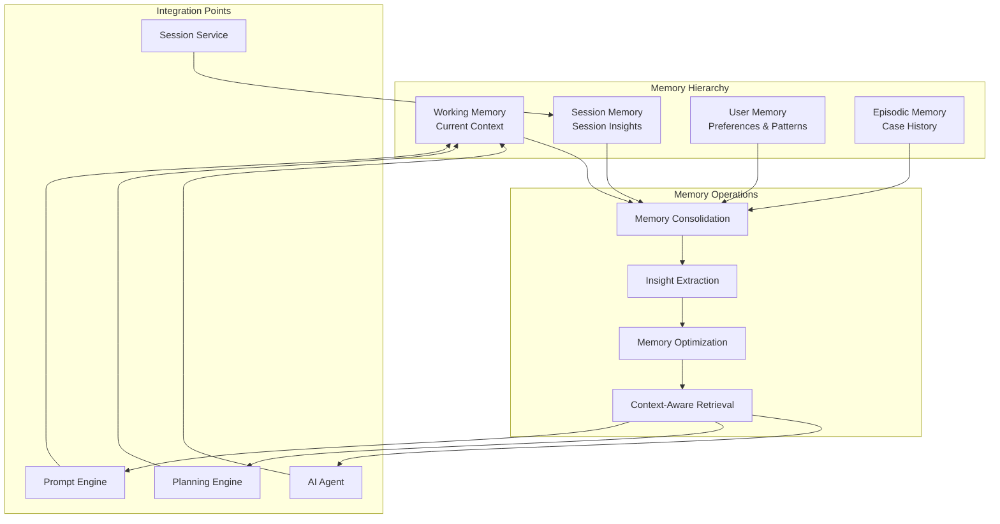

**Memory Types**:
- **Working Memory**: Current conversation context (sliding window)
- **Session Memory**: Session-specific insights and learnings
- **User Memory**: Long-term user preferences and expertise patterns
- **Episodic Memory**: Past troubleshooting cases and resolutions

**Key Features**:
- **Semantic Embeddings**: Context-aware memory retrieval
- **Memory Consolidation**: LLM-powered insight extraction
- **Decay Mechanisms**: Time-based relevance scoring
- **Cross-Session Learning**: Persistent user understanding

**Memory Optimization**: For investigation state management, FaultMaven uses a **hot/warm/cold tiered compression** strategy that reduces token usage from 4,500+ to ~1,600 tokens (64% reduction). See [Investigation Phases Framework - State Management](./investigation-phases-and-ooda-integration.md#state-management-architecture) for details.

### Advanced Prompting System

> **Detailed Design**: See [Prompt Engineering Architecture](./prompt-engineering-architecture.md) for complete system design

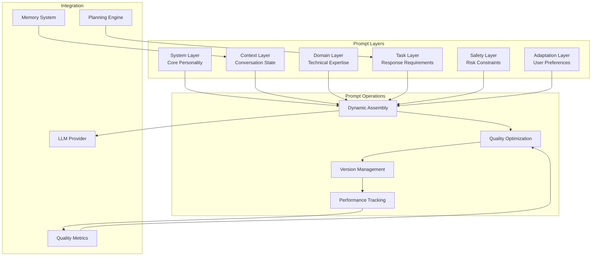

**Prompt Features**:
- **Multi-Layer Architecture**: System, context, domain, task, safety, and adaptation layers
- **Dynamic Optimization**: Quality-based prompt improvement
- **Version Management**: A/B testing and performance tracking
- **Context Injection**: Memory-aware prompt enhancement
- **Phase-Aware Prompts**: Different prompts for different investigation phases
- **Token Optimization**: Tiered prompts achieve 81% token reduction

### Strategic Planning System

> **Detailed Design**: See [Planning System Architecture](./planning-system-architecture.md) for complete system design

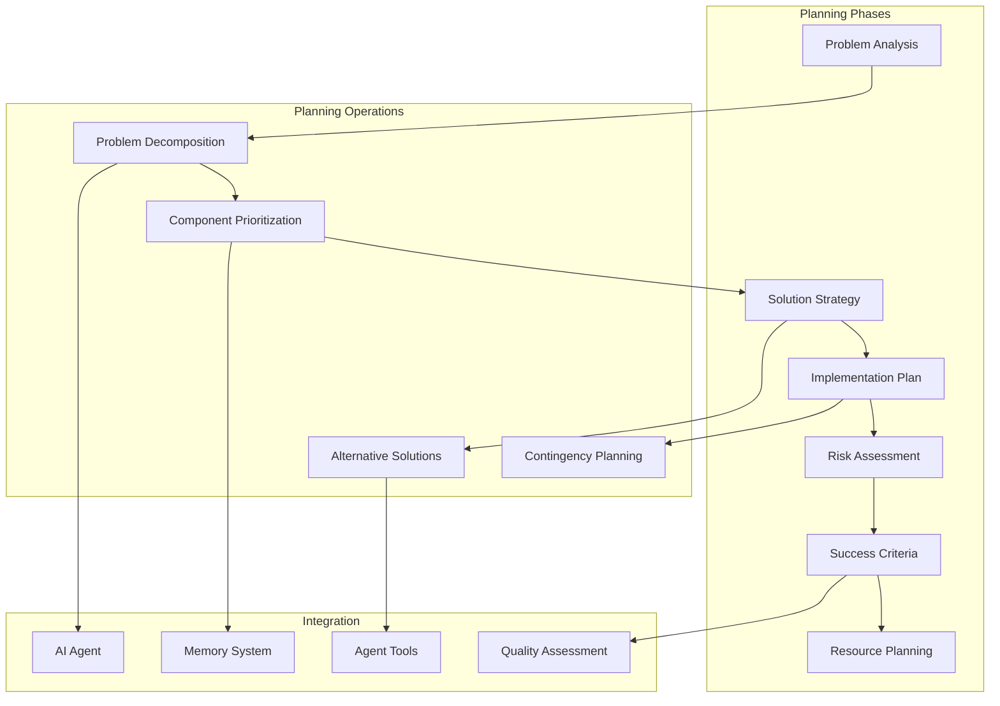

**Planning Features**:
- **Problem Decomposition**: LLM-powered problem breakdown
- **Strategic Planning**: Multi-phase solution development
- **Risk Assessment**: Comprehensive risk analysis and mitigation
- **Alternative Solutions**: Multiple approach evaluation
- **Adaptive Execution**: Planning adjusts based on investigation progress

## Dependency Injection Architecture

> **Detailed Design**: See [Dependency Injection Design](./dependency-injection-design.md) for complete system design

```mermaid
graph TB
    subgraph "DI Container"
        CONT[DIContainer]
        INIT[Initialization]
        HEALTH[Health Checks]
        MEMORY[Memory Management]
    end
    
    subgraph "Service Interfaces"
        IAGENT[IAgentService]
        IDATA[IDataService]
        IKNOWLEDGE[IKnowledgeService]
        ISESSION[ISessionService]
        IMEMORY[IMemoryService]
        IPLANNING[IPlanningService]
    end
    
    subgraph "Infrastructure Interfaces"
        ILLM[ILLMProvider]
        ISAN[ISanitizer]
        ITRACE[ITracer]
        ISTORE[ISessionStore]
        IVECTOR[IVectorStore]
        ICACHE[IMemoryCache]
    end
    
    subgraph "Service Implementations"
        AGENT_IMPL[AgentService]
        DATA_IMPL[DataService]
        KNOWLEDGE_IMPL[KnowledgeService]
        SESSION_IMPL[SessionService]
        MEMORY_IMPL[MemoryService]
        PLANNING_IMPL[PlanningService]
    end
    
    subgraph "Infrastructure Implementations"
        LLM_IMPL[LLMRouter]
        SAN_IMPL[DataSanitizer]
        TRACE_IMPL[OpikTracer]
        STORE_IMPL[RedisSessionStore]
        VECTOR_IMPL[ChromaDBStore]
        CACHE_IMPL[RedisMemoryCache]
    end
    
    %% Container relationships
    CONT --> INIT
    CONT --> HEALTH
    CONT --> MEMORY
    
    %% Service interfaces
    CONT --> IAGENT
    CONT --> IDATA
    CONT --> IKNOWLEDGE
    CONT --> ISESSION
    CONT --> IMEMORY
    CONT --> IPLANNING
    
    %% Infrastructure interfaces
    CONT --> ILLM
    CONT --> ISAN
    CONT --> ITRACE
    CONT --> ISTORE
    CONT --> IVECTOR
    CONT --> ICACHE
    
    %% Implementation bindings
    IAGENT -.-> AGENT_IMPL
    IDATA -.-> DATA_IMPL
    IKNOWLEDGE -.-> KNOWLEDGE_IMPL
    ISESSION -.-> SESSION_IMPL
    IMEMORY -.-> MEMORY_IMPL
    IPLANNING -.-> PLANNING_IMPL
    
    ILLM -.-> LLM_IMPL
    ISAN -.-> SAN_IMPL
    ITRACE -.-> TRACE_IMPL
    ISTORE -.-> STORE_IMPL
    IVECTOR -.-> VECTOR_IMPL
    ICACHE -.-> CACHE_IMPL
    
    %% Service dependencies
    AGENT_IMPL --> ILLM
    AGENT_IMPL --> ITRACE
    AGENT_IMPL --> IMEMORY
    AGENT_IMPL --> IPLANNING
    DATA_IMPL --> ISAN
    KNOWLEDGE_IMPL --> IVECTOR
    SESSION_IMPL --> ISTORE
    MEMORY_IMPL --> ICACHE
    PLANNING_IMPL --> ILLM
    
    classDef container fill:#e3f2fd
    classDef interface fill:#f3e5f5
    classDef implementation fill:#e8f5e8
    
    class CONT,INIT,HEALTH,MEMORY container
    class IAGENT,IDATA,IKNOWLEDGE,ISESSION,IMEMORY,IPLANNING,ILLM,ISAN,ITRACE,ISTORE,IVECTOR,ICACHE interface
    class AGENT_IMPL,DATA_IMPL,KNOWLEDGE_IMPL,SESSION_IMPL,MEMORY_IMPL,PLANNING_IMPL,LLM_IMPL,SAN_IMPL,TRACE_IMPL,STORE_IMPL,VECTOR_IMPL,CACHE_IMPL implementation
```

**Service Interfaces**:
- `IAgentService` - AI reasoning orchestration
- `IDataService` - Data processing
- `IKnowledgeService` - Knowledge base operations
- `ISessionService` - Session management
- `IMemoryService` - Memory operations
- `IPlanningService` - Strategic planning

**Infrastructure Interfaces**:
- `ILLMProvider` - LLM provider abstraction
- `ISanitizer` - Data sanitization
- `ITracer` - Distributed tracing
- `ISessionStore` - Session persistence
- `IVectorStore` - Vector database
- `IMemoryCache` - Memory caching

**Benefits**:
- Easy testing with mocks
- Runtime provider swapping
- Zero-downtime deployments
- Clean separation of concerns

## Data Flow Architecture

> **Detailed Design**: See [Data Flow Architecture](./data-flow-architecture.md) for complete request lifecycle

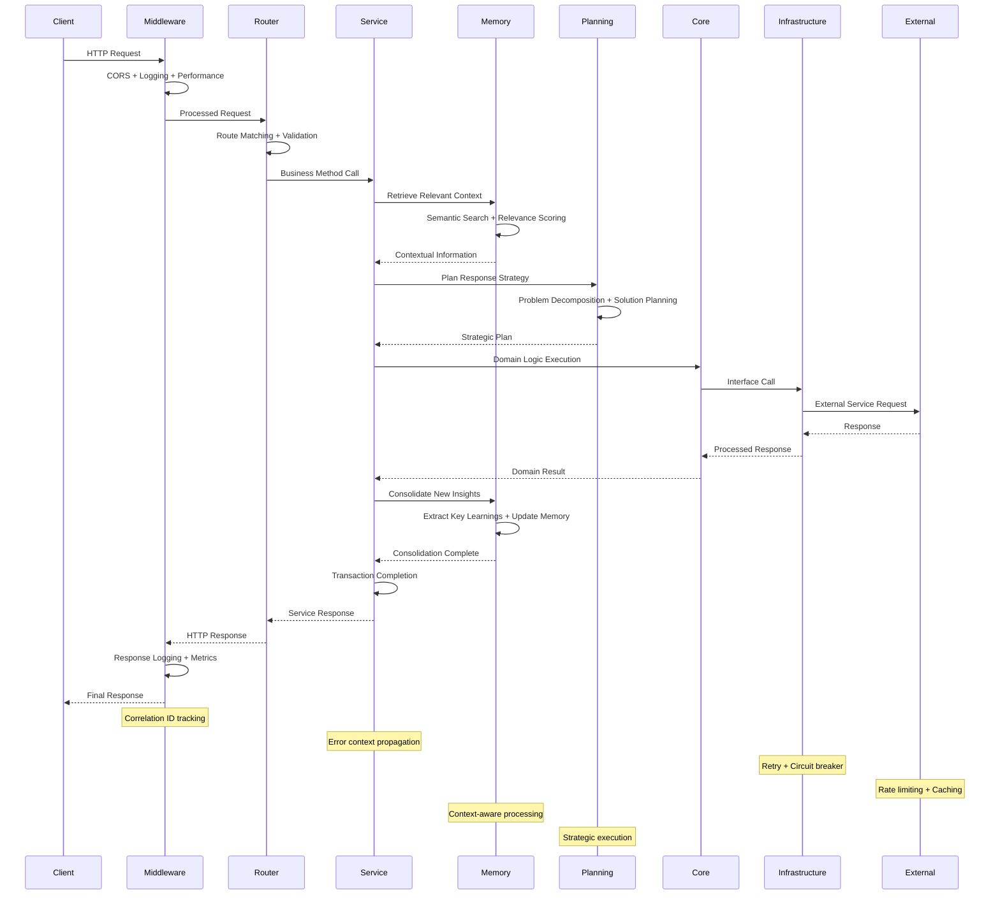

**High-Level Flow**:
1. **Client Request** → API Gateway with middleware processing
2. **Service Layer** → Business logic orchestration
3. **Memory Retrieval** → Semantic search for relevant context
4. **Strategic Planning** → Problem decomposition and solution planning
5. **Core Execution** → Domain logic with tool usage
6. **Memory Consolidation** → Extract insights and update memory
7. **Response Assembly** → Format and return structured response

**Special Flows**:
- **Lead Investigator Mode**: Activates investigation phases with OODA framework for systematic troubleshooting
- **Evidence Collection**: Intelligent extraction from large files (3-stage pipeline)
- **Hypothesis Management**: Confidence tracking with anchoring prevention

See [Investigation Phases Framework - User Journeys](./investigation-phases-and-ooda-integration.md#user-journey-scenarios) for detailed investigation flow scenarios.

## v3.1.0 Schema Architecture

> **Detailed Design**: See [Schema v3.1.0 Design](./schema-v3-design.md) for complete API contracts and integration examples

### Schema-Driven API Design

The v3.1.0 schema introduces a modern, intent-driven API architecture that provides structured responses with evidence attribution, state management, and intelligent communication:

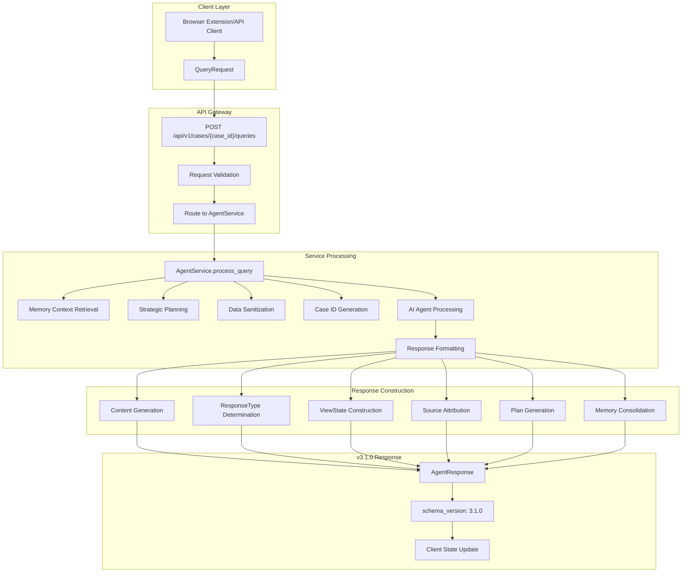

### Core Schema Components

#### 1. Session vs Case Architecture

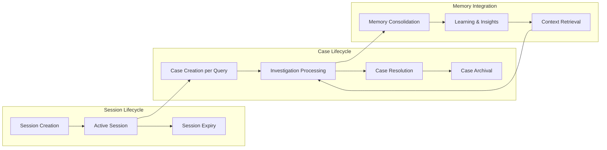

**Session Management**:
- **Purpose**: Client-based authentication and session continuity
- **Lifecycle**: Configurable TTL with automatic cleanup and resumption support
- **Scope**: Multiple concurrent sessions per user (one per client/device)
- **Storage**: Redis-backed with multi-index (user_id, client_id) → session_id mapping
- **Client Resumption**: Same client_id can resume sessions across browser restarts
- **Multi-Device Support**: Independent sessions per device for same user

**Case Management**:
- **Purpose**: Persistent investigation tracking
- **Lifecycle**: Long-lived, persists for audit and follow-up
- **Scope**: Single investigation from query to resolution
- **Storage**: Database-backed for persistence
- **Memory Integration**: Episodic memory for future reference

#### 2. Response Type Architecture

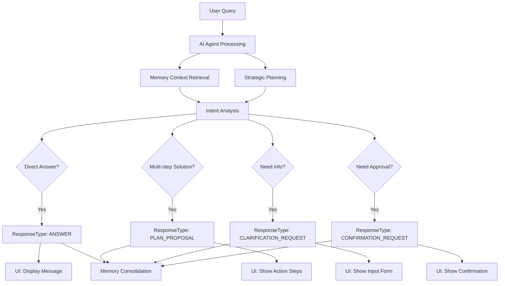

The ResponseType enum enables explicit intent communication:
- **ANSWER**: Direct response to user's question → Conversational UI
- **PLAN_PROPOSAL**: Multi-step troubleshooting plan → Structured action UI
- **CLARIFICATION_REQUEST**: Agent needs more information → Input form UI
- **CONFIRMATION_REQUEST**: Agent needs user approval → Confirmation dialog UI

#### 3. Evidence Attribution Architecture

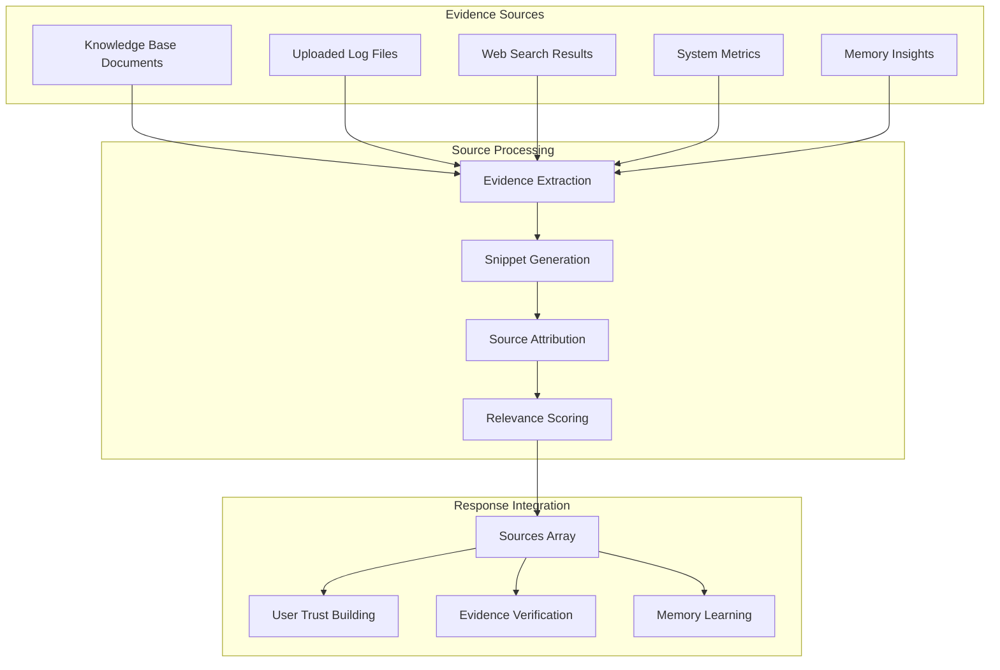

**Source Types**:
- **knowledge_base**: From ingested documentation and runbooks
- **log_file**: From uploaded system logs and metrics
- **web_search**: From external research and documentation
- **memory_insights**: From previous conversation analysis

**Evidence Structure**:
```json
{
  "type": "knowledge_base",
  "name": "database_troubleshooting.md", 
  "snippet": "Connection pool exhaustion occurs when activeCount equals maxActive...",
  "relevance_score": 0.95,
  "confidence": 0.9
}
```

#### 4. ViewState Management Architecture

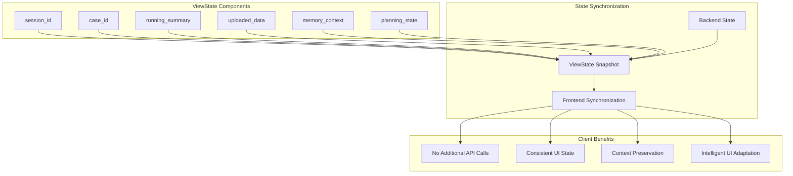

ViewState eliminates the need for separate API calls by providing:
- **Current session context**: Active session identifier
- **Investigation tracking**: Case ID for persistent investigation
- **Progress summary**: Human-readable investigation status
- **Uploaded data context**: List of files available for analysis
- **Memory context**: Relevant conversation history and insights
- **Planning state**: Current troubleshooting strategy and progress

**Investigation Extensions** (when in Lead Investigator mode):
- `lifecycle_progress` - Current phase (0-6), entry point, completion status
- `ooda_progress` - Active OODA steps, iteration count, hypothesis status
- `evidence_status` - Pending/complete/blocked evidence requests

See [Investigation Phases Framework - ViewState](./investigation-phases-and-ooda-integration.md#agent-response-format-v320) for complete structure and usage examples.

### Data Flow Architecture

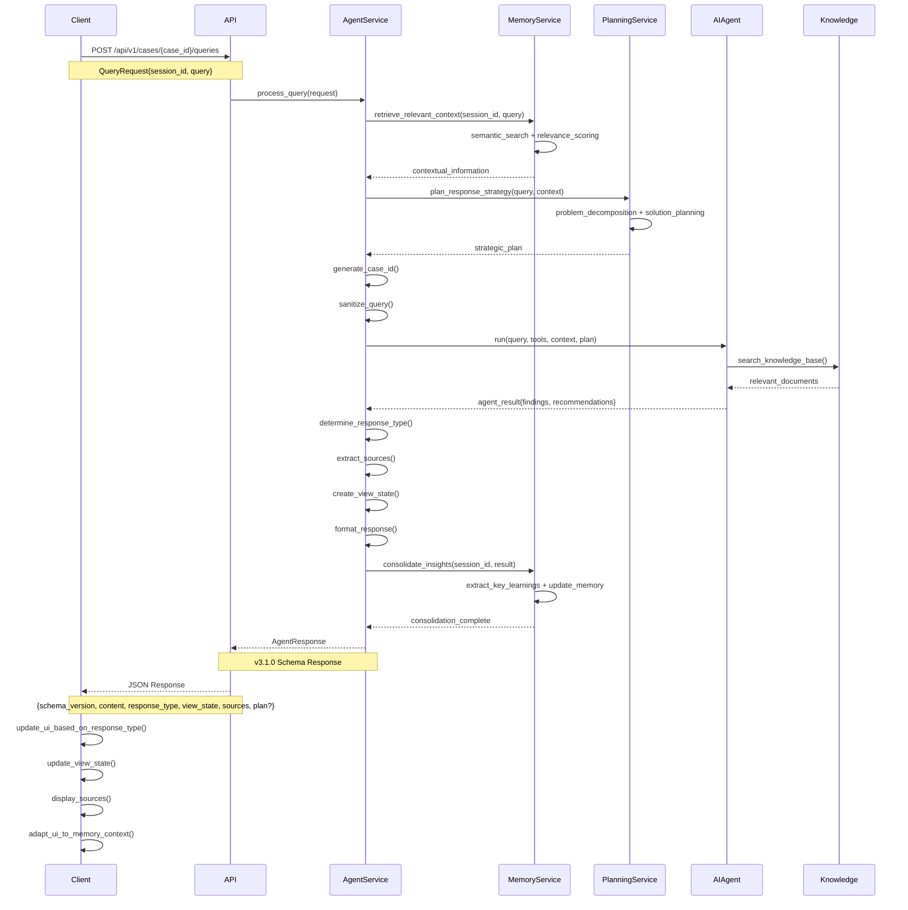

### Schema Validation Architecture

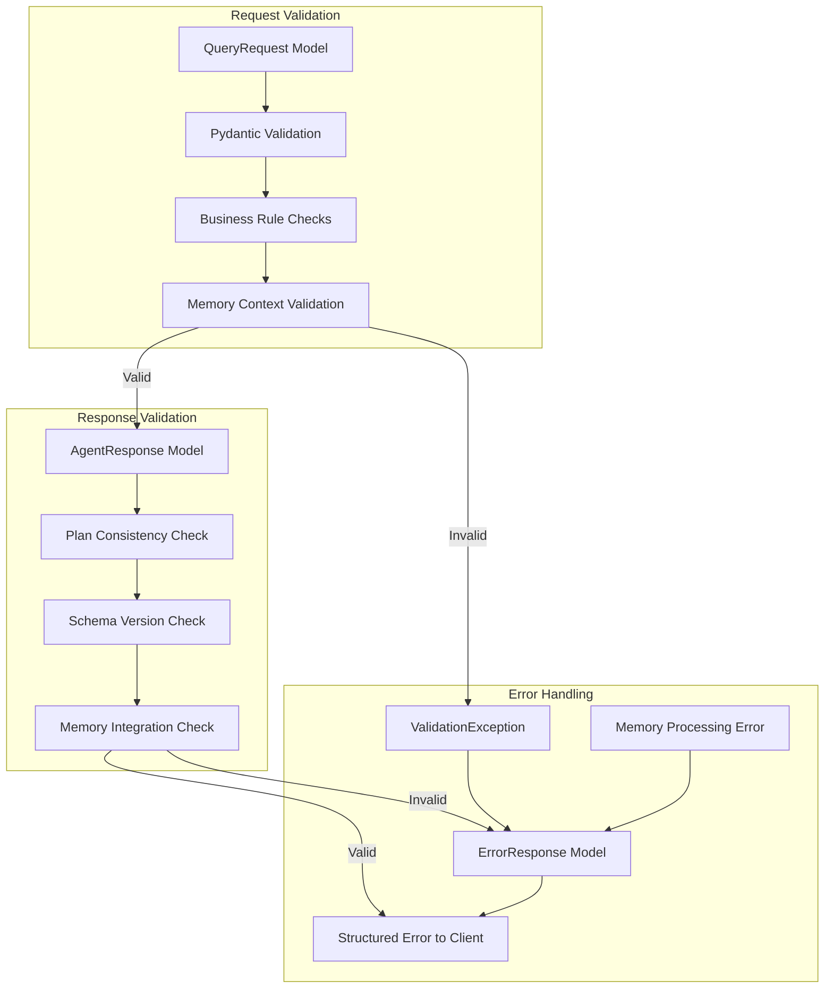

**Validation Rules**:
- **Plan Consistency**: `plan` field only allowed for `PLAN_PROPOSAL` responses
- **Schema Version**: Always "3.1.0" for new responses
- **Required Fields**: All mandatory fields must be present and valid
- **Source Types**: Source type must match SourceType enum values
- **Memory Integration**: Memory context must be valid and accessible
- **Planning State**: Planning state must be consistent with response type

## Key Design Patterns

> **Detailed Guide**: See [Design Patterns Guide](./design-patterns-guide.md) for complete implementation examples

### 1. Interface Segregation Principle
Every dependency is injected as an interface, enabling:
- Easy testing with mocks
- Runtime provider swapping
- Zero-downtime deployments
- Clean separation of concerns

```python
# Example: Memory Service Interface
class IMemoryService(ABC):
    @abstractmethod
    async def retrieve_context(self, session_id: str, query: str) -> ConversationContext:
        pass
    
    @abstractmethod
    async def consolidate_insights(self, session_id: str, result: dict) -> bool:
        pass
    
    @abstractmethod
    async def get_user_profile(self, session_id: str) -> UserProfile:
        pass
```

### 2. Dependency Inversion Principle
High-level modules depend on abstractions, not concretions:

```python
# Service depends on interface, not implementation
class AgentService:
    def __init__(
        self, 
        llm_provider: ILLMProvider, 
        tracer: ITracer,
        memory_service: IMemoryService,
        planning_service: IPlanningService
    ):
        self._llm = llm_provider        # Interface
        self._tracer = tracer          # Interface
        self._memory = memory_service  # Interface
        self._planning = planning_service  # Interface
```

### 3. Command Query Separation
Clear separation between commands (state changes) and queries:

```python
# Query - read-only operation
async def get_session_info(session_id: str) -> SessionInfo

# Command - state-changing operation  
async def create_session(metadata: dict) -> str

# Memory operations
async def retrieve_context(session_id: str, query: str) -> ConversationContext  # Query
async def consolidate_insights(session_id: str, result: dict) -> bool          # Command
```

### 4. Single Responsibility Principle
Each component has one well-defined responsibility:

- **Agent Service**: Orchestrates AI reasoning workflows with memory and planning
- **Data Service**: Manages file upload and processing
- **Knowledge Service**: Handles document ingestion and retrieval
- **Session Service**: Manages conversation state
- **Memory Service**: Manages hierarchical memory and context consolidation
- **Planning Service**: Manages strategic planning and problem decomposition

### 5. Error Context Propagation
Comprehensive error context flows through all layers:

```python
# Error context with automatic recovery
try:
    result = await service.process_request(data)
except ServiceException as e:
    error_context.add_layer_error("service", e)
    error_context.add_memory_context(memory_service.get_context())
    recovery_result = await error_recovery.attempt_recovery()
    if recovery_result.success:
        return recovery_result.data
    raise
```

## Performance Characteristics

> **Detailed Specification**: See [Performance and Scalability](./performance-and-scalability.md) for complete benchmarks and optimization strategies

### Response Time Targets
- **API Endpoints**: < 200ms (excluding LLM processing)
- **Memory Retrieval**: < 50ms for context retrieval
- **Planning Operations**: < 100ms for strategy development
- **File Upload**: < 5s for files up to 10MB
- **Knowledge Search**: < 100ms for vector similarity
- **Session Operations**: < 50ms for state management
- **Health Checks**: < 10ms for component status

### Throughput Capabilities
- **Concurrent Requests**: 100+ simultaneous requests
- **Session Capacity**: 1000+ active sessions
- **Memory Operations**: 500+ concurrent operations
- **Planning Operations**: 200+ concurrent operations
- **File Processing**: 10+ concurrent uploads
- **Knowledge Base**: 10,000+ documents with sub-second search

### Memory Usage
- **Baseline**: ~300MB application memory
- **Per Session**: ~2-8MB depending on conversation history
- **Memory Cache**: ~100MB for active operations
- **File Processing**: ~2x file size during processing
- **ML Models**: ~500MB for BGE-M3 embeddings

### Storage Requirements
- **Session Data**: Redis with configurable TTL
- **Knowledge Base**: ChromaDB vector storage
- **Memory Storage**: Redis with semantic indexing
- **Investigation State**: Redis with hierarchical compression (~1.6KB vs 4.5KB uncompressed)
- **File Uploads**: Temporary storage with automatic cleanup
- **Logs**: Structured JSON with log rotation

## Scalability Considerations

### Horizontal Scaling
- **Stateless Design**: All application state in external stores
- **Load Balancing**: Standard HTTP load balancers supported
- **Session Affinity**: Not required due to Redis-based sessions
- **Memory Distribution**: Distributed memory caching across instances
- **Database Scaling**: ChromaDB and Redis both horizontally scalable

### Caching Strategy
- **LLM Response Caching**: Semantic similarity-based caching
- **Knowledge Base**: Vector similarity caching with embeddings
- **Session Data**: Redis-based distributed caching
- **Memory Cache**: Hierarchical caching with semantic search
- **Planning Cache**: Strategy caching with problem similarity
- **File Processing**: Results cached by content hash

### Resource Management
- **Connection Pooling**: Configurable pool sizes for all external services
- **Rate Limiting**: Per-client and per-endpoint rate limiting
- **Circuit Breakers**: Automatic failover for external service failures
- **Backpressure**: Request queuing with overflow protection
- **Memory Management**: Automatic cleanup and compression

### Monitoring and Observability
- **Distributed Tracing**: Full request tracing with Opik integration
- **Metrics Collection**: Real-time performance metrics
- **Health Monitoring**: Component-level health checks with SLA tracking
- **Alerting**: Configurable alerts for performance degradation
- **Memory Analytics**: Memory usage and performance analytics
- **Planning Analytics**: Planning effectiveness and quality metrics

## Security Architecture

> **Detailed Specification**: See [Security and Deployment](./security-and-deployment.md) for complete security policies and deployment strategies

### Data Privacy
- **PII Redaction**: Automatic detection and redaction using Presidio
- **Data Sanitization**: All data sanitized before external processing
- **Memory Privacy**: Sensitive data excluded from memory consolidation
- **Encryption**: Data encrypted in transit and at rest
- **Audit Logging**: Comprehensive audit trail for all operations

### Authentication (Future Enhancement)
- **API Key Authentication**: High priority for production deployment
- **JWT Tokens**: Support for bearer token authentication
- **Role-Based Access**: Medium priority RBAC implementation
- **Rate Limiting**: Per-authentication-context rate limiting

### Network Security
- **CORS Configuration**: Restrictive CORS policies for browser security
- **Input Validation**: Comprehensive input validation and sanitization
- **Output Encoding**: Safe output encoding to prevent injection attacks
- **Error Handling**: Safe error responses without information disclosure

## Deployment Architecture

### Container Strategy
- **Single Container**: Monolithic deployment for simplicity
- **Multi-Stage Build**: Optimized Docker images with dependency caching
- **Health Checks**: Container health checks for orchestration
- **Graceful Shutdown**: Proper signal handling for zero-downtime deployments

### External Dependencies
- **Redis**: Session storage, caching, and memory management (required)
  - **Session Storage**: Uses lightweight Redis client for high-frequency session operations
  - **Memory Cache**: Optimized for minimal logging overhead on internal operations
- **ChromaDB**: Vector database for knowledge base (required)
- **Presidio**: PII redaction service (required)
- **Opik**: LLM observability (optional)
- **LLM Providers**: OpenAI, Anthropic, or Fireworks AI (at least one required)

### Configuration Management
- **Environment Variables**: All configuration via environment variables
- **Configuration Validation**: Startup-time configuration validation
- **Feature Flags**: Runtime feature toggles for safe deployments
- **Secrets Management**: External secret injection support

### High Availability
- **Stateless Design**: Enables multiple instance deployment
- **External State**: All persistent state in external services
- **Health Monitoring**: Continuous health monitoring with automatic recovery
- **Circuit Breakers**: Automatic failover for external service outages
- **Memory Redundancy**: Distributed memory storage for high availability

## Session Architecture Evolution

### Multi-Session Per User Design

FaultMaven implements **client-based session management** enabling multiple concurrent sessions per user:

**Key Features**:
- Multiple concurrent sessions per user (one per client/device)
- Session resumption across browser restarts (same client_id)
- Multi-device support (independent sessions per device)
- Multi-tab sharing (same client_id across tabs)

**Technical Implementation**:
- Optional `client_id` field in SessionCreateRequest
- Redis multi-index: (user_id, client_id) → session_id mapping
- Enhanced SessionService with client-based lookup
- API responses include `session_resumed` flag

**Frontend Integration**:
- Generate persistent `client_id` using `crypto.randomUUID()` stored in `localStorage`
- Include `client_id` in all session creation requests
- Handle both new session creation and existing session resumption
- Support collaborative multi-tab experience with shared session state

## Implementation Module Mapping

> **Detailed Reference**: See [Implementation Module Mapping](./implementation-module-mapping.md) for complete file-by-file breakdown

This section provides a high-level mapping of architectural components to Python modules within the `/faultmaven/` directory structure.

### API Layer
- `main.py` - FastAPI application
- `api/middleware/` - Request processing middleware
- `api/v1/routes/` - RESTful endpoints
- `api/v1/dependencies.py` - DI configuration

### Service Layer
- `services/agent.py` - AI agent orchestration
- `services/data.py` - File processing
- `services/knowledge.py` - Document management
- `services/session.py` - Session lifecycle
- `services/case.py` - Case management

### Agentic Framework
- `services/agentic/workflow_engine.py` - Main orchestrator
- `services/agentic/state_manager.py` - State management
- `services/agentic/classification_engine.py` - Query classification
- `services/agentic/tool_broker.py` - Tool orchestration
- `services/agentic/guardrails_layer.py` - Security
- `services/agentic/response_synthesizer.py` - Response assembly
- `services/agentic/error_manager.py` - Error handling

### Core Domain
- `core/agent/` - AI reasoning engine
- `core/processing/` - Data analysis
- `core/knowledge/` - Knowledge base
- `core/planning/` - Strategic planning
- `core/memory/` - Memory management
- `tools/` - Agent capabilities

### Infrastructure
- `infrastructure/llm/` - LLM providers
- `infrastructure/security/` - PII protection
- `infrastructure/observability/` - Tracing and metrics
- `infrastructure/persistence/` - Data storage
- `infrastructure/health/` - Health monitoring
- `infrastructure/monitoring/` - Performance monitoring

### Data Models
- `models/interfaces.py` - Service interfaces
- `models/agentic.py` - Agentic framework models
- `models/api.py` - v3.1.0 schema models

### Configuration
- `config/settings.py` - Unified configuration
- `config/feature_flags.py` - Runtime toggles
- `container.py` - DI container

## Data Submission Handling

> **STATUS**: ✅ IMPLEMENTED (2025-10-03)
> **Detailed Specification**: [`data-submission-design.md`](./data-submission-design.md)

### Overview

Intelligent **data submission detection** for handling large log dumps:

**Key Features:**
- **10K Character Hard Limit**: Auto-route to data upload
- **6 Pattern Categories**: Timestamps, log levels, stack traces, etc.
- **Dual Processing**: Async (>10K) vs Sync (<10K)
- **Case Association**: Full case_id and user_id tracking

**Implementation**:
- Detection logic in `classification_engine.py`
- API contract changes in `openapi.locked.yaml`
- Background processing in `case.py`
- Context propagation in `data_service.py`

For complete specifications, see [Data Submission Design](./data-submission-design.md).

---

## Related Documentation

This section provides a complete navigation map to all FaultMaven design documents, **organized to mirror the actual code structure** for easy navigation during implementation.

---

### 1. Requirements and Specifications

**What the System Must Do**:
- [`System Requirements Specification (SRS) v2.0`](../system-requirements-specification.md) - 62 requirements: Response Types, Case Management, Conversation Intelligence, Performance, Security, Compliance
- [`Case and Session Concepts v2.0`](./case-and-session-concepts.md) - 🎯 Fundamental concepts: 4-concept model (User, Client, Session, Case), multi-session architecture, relationship diagrams, anti-patterns, testing verification

---

### 2. Service Layer Design

**Code Location**: `faultmaven/services/`  
**Update Frequency**: 🔥 HIGH (business logic evolves frequently)

#### Domain Services (`services/domain/`)

Core business services implementing case, data, knowledge, planning, and session management:

- [`Investigation Phases and OODA Integration Framework v2.1`](./investigation-phases-and-ooda-integration.md) - 🎯 Investigation process (used by case_service, planning_service): 7-phase lifecycle (0-6), OODA steps, engagement modes, state management
- [`Evidence Collection and Tracking Design v2.1`](./evidence-collection-and-tracking-design.md) - 🎯 Evidence data models (used by case_service): Schemas, 5D classification, strategies, agent behaviors  
- [`Case Lifecycle Management v1.0`](./case-lifecycle-management.md) - Case status state machine (case_service.py): 7 states, transition rules, stall detection
- [`Session Management Specification v1.0`](../specifications/session-management-spec.md) - Multi-session architecture (session_service.py): Client-based resumption, OODA state persistence, Redis storage
- [`Data Processing Pipeline Design`](./data-processing-pipeline.md) - 📝 *To create* - File processing (data_service.py): Classification, insight extraction, async workflows
- [`Knowledge Base Architecture`](./knowledge-base-architecture.md) - 📝 *To create* - Document management (knowledge_service.py): RAG, ingestion, semantic search
- [`Planning System Architecture`](./planning-system-architecture.md) - 📝 *To create* - Strategic planning (planning_service.py): Problem decomposition, risk assessment

#### Agentic Framework (`services/agentic/`)

AI agent framework with orchestration, engines, management, and safety:

- [`Investigation Phases and OODA Integration Framework`](./investigation-phases-and-ooda-integration.md) - ✅ **IMPLEMENTED** (v3.2.0) - 7-phase investigation with OODA engine, phase handlers, and adaptive reasoning
- [`Phase-Specific Agent Implementation`](./phase-specific-agent-implementation.md) - 📝 *To create* - Sub-agent architecture (doctor_patient/sub_agents/): intake, blast_radius, timeline, hypothesis, validation, solution agents
- [`Prompt Engineering Architecture`](./prompt-engineering-architecture.md) - 📝 Prompting system: Multi-layer assembly, optimization, phase-aware selection

#### Evidence Services (`services/evidence/`)

Evidence collection implementation:

- Evidence Collection Design (above) covers: classification.py, lifecycle.py, stall_detection.py

#### Supporting Services

- [`Error Handling and Recovery`](./error-handling-and-recovery.md) - Error patterns: LLM errors, state corruption, infinite loops, recovery strategies
- [`Analytics and Confidence Services`](./analytics-and-confidence-services.md) - 📝 *To create* - Analytics (analytics/): Confidence scoring, dashboard aggregation
- [`Conversation Intelligence Design`](./conversation-intelligence-design.md) - 📝 *To create* - Dialogue management: Circular detection, progress measurement, dead-end prevention

---

### 3. API Layer Design

**Code Location**: `faultmaven/api/`, `faultmaven/models/api.py`  
**Update Frequency**: 🔥 HIGH (API evolves with features)

#### API Schema and Contracts

- [`Schema v3.1.0 Design`](./schema-v3-design.md) - 📝 *To create* **CRITICAL** - API contracts (models/api.py): AgentResponse, ViewState, Source attribution, validation
- [`Data Flow Architecture`](./data-flow-architecture.md) - 📝 *To create* - Request lifecycle: Middleware pipeline, service orchestration, response assembly
- [`API Contracts and Integration`](./api-contracts-and-integration.md) - 📝 *To create* - REST endpoints (api/v1/routes/): Error codes, versioning, backward compatibility

#### Middleware and Routes

- [`Middleware Architecture`](./middleware-architecture.md) - 📝 *To create* - Middleware stack (api/middleware/): Logging, performance, protection, rate limiting, request ID
- [`Data Submission Design`](./data-submission-design.md) - Data upload handling (routes/data.py): 10K limit, pattern detection, async processing

---

### 4. Core Domain Design

**Code Location**: `faultmaven/core/`  
**Update Frequency**: 🔶 MEDIUM (stable domain logic)

#### Agent and Reasoning

- Investigation Phases Framework (Section 2) covers core agent reasoning
- [`Agent Doctrine and Reasoning`](./agent-doctrine-and-reasoning.md) - 📝 *To create* - SRE methodology (core/agent/): 5-phase doctrine, reasoning workflows

#### Data Processing and Analysis

- [`Log Analysis and Classification`](./log-analysis-and-classification.md) - 📝 *To create* - Log processing (core/processing/): Parser, anomaly detection, pattern learning
- [`Data Classification System`](./data-classification-system.md) - 📝 *To create* - File classification (core/processing/classifier.py): Type detection, content analysis

#### Knowledge Management

- Knowledge Base Architecture (Section 2) covers core/knowledge/

---

### 5. Infrastructure Layer Design

**Code Location**: `faultmaven/infrastructure/`  
**Update Frequency**: 🔶 MEDIUM (infrastructure more stable)

#### LLM and AI Infrastructure (`infrastructure/llm/`)

- [`LLM Provider Integration`](./llm-provider-integration.md) - 📝 *To create* **HIGH PRIORITY** - Provider abstraction: Multi-provider routing, failover, cost tracking, registry

#### Persistence and Storage (`infrastructure/persistence/`)

- [`Persistence Layer Design`](./persistence-layer-design.md) - 📝 *To create* - Data storage: Redis (session, case), ChromaDB (vectors), durability, backup

#### Observability (`infrastructure/observability/`, `infrastructure/monitoring/`)

- [`Observability and Tracing`](./observability-and-tracing.md) - 📝 *To create* **HIGH PRIORITY** - Monitoring stack: Opik tracing, metrics collection, APM integration, alerting

#### Security and Protection (`infrastructure/security/`, `infrastructure/protection/`)

- [`Authentication Design`](./authentication-design.md) - Auth implementation (infrastructure/auth/): Token management, user store
- [`Authorization and Access Control`](./authorization-and-access-control.md) - 📝 *To create* - RBAC: Permissions, case ownership validation
- [`Security Architecture and Policies`](./security-architecture-and-policies.md) - 📝 *To create* - Security (infrastructure/security/): PII redaction (Presidio), data sanitization
- [`Protection Systems`](./protection-systems.md) - 📝 *To create* - Protection (infrastructure/protection/): Rate limiting, circuit breakers, anomaly detection, reputation engine

#### Health and Caching (`infrastructure/health/`, `infrastructure/caching/`)

- [`Health Monitoring and SLA`](./health-monitoring-and-sla.md) - 📝 *To create* - Health system: Component monitors, SLA tracking
- [`Caching and Memory`](./caching-and-memory.md) - 📝 *To create* - Cache systems: Intelligent caching, model cache, memory management

#### Logging (`infrastructure/logging/`)

- [`Logging Architecture`](./logging-architecture.md) - 📝 *To create* - Unified logging: Configuration, coordination, correlation IDs

---

### 6. Data Models and Interfaces

**Code Location**: `faultmaven/models/`  
**Update Frequency**: 🔥 HIGH (models evolve with features)

- [`Data Models Reference`](./data-models-reference.md) - 📝 *To create* - Core models: api.py (API schema), agentic.py (framework), case.py, evidence.py, interfaces.py
- [`Interface Definitions`](./interface-definitions.md) - 📝 *To create* - Service interfaces: IAgentService, IDataService, IKnowledgeService, infrastructure interfaces
- [`Dependency Injection Design`](./dependency-injection-design.md) - 📝 *To create* - DI container (container.py): Service registration, interface bindings, lifecycle

---

### 7. Configuration and Deployment

**Code Location**: `faultmaven/config/`, deployment  
**Update Frequency**: 🔷 LOW (stable operational configs)

- [`Configuration Management`](../specifications/CONFIGURATION_MANAGEMENT_SPEC.md) - Settings system (config/settings.py): Environment-based, centralized thresholds
- [`Feature Flags System`](./feature-flags-system.md) - 📝 *To create* - Runtime toggles (config/feature_flags.py): Safe deployments, A/B testing
- [`Performance and Scalability Design`](./performance-and-scalability.md) - 📝 *To create* - Performance architecture: Response times, throughput, horizontal scaling, caching
- [`Deployment Architecture`](./deployment-architecture.md) - 📝 *To create* - Deployment strategy: Container, dependencies, HA, graceful shutdown
- [`Compliance and Data Governance`](./compliance-and-data-governance.md) - 📝 *To create* - Regulatory compliance: GDPR/CCPA, retention policies, audit

---

### 8. Implementation Reference

**Code Organization and Patterns**  
**Update Frequency**: 🔶 MEDIUM (updates with refactoring)

- [`Implementation Module Mapping`](./implementation-module-mapping.md) - 📝 *To create* **HIGH PRIORITY** - Complete breakdown: All modules, file responsibilities, dependency graph
- [`Design Patterns Guide`](./design-patterns-guide.md) - 📝 *To create* - Pattern implementations: Interface segregation, DI, CQRS, error propagation (with code)
- [`Service Layer Patterns`](./service-patterns.md) - Service patterns: Base service, transaction boundaries, error handling
- [`Interface-Based Design Guide`](./interface-based-design.md) - Interface guidelines: Contract design, implementation patterns

---

### 9. Developer Guides

**Onboarding and Best Practices**  
**Update Frequency**: 🔷 LOW (stable guides)

- [`Developer Guide`](./developer-guide.md) - Getting started, development setup, workflow
- [`Token Estimation Guide`](../development/token-estimation.md) - Token counting, cost optimization, provider-specific tokenizers
- [`Container Usage Guide`](./container-usage-guide.md) - DI container usage, service registration, dependency resolution
- [`Testing Guide`](./testing-guide.md) - Test strategy, fixtures, mocking, integration tests
- [`Testing Investigation Framework`](../guides/testing-investigation-framework.md) - Testing strategies for investigation phases, OODA, hypotheses, evidence tracking
- [`Operational Configuration`](../guides/operational-configuration.md) - System requirements, configuration, monitoring, deployment

---

### 10. Evolution and Historical Context

**Historical Reference**  
**Update Frequency**: 🔷 LOW (historical record)

**Architecture Evolution**:
- [`Configuration System Refactor`](./configuration-system-refactor-design.md) - Configuration centralization evolution

**Legacy Architecture** (Reference Only):
- [`Doctor-Patient Prompting v1.0`](./DOCTOR_PATIENT_PROMPTING_ARCHITECTURE.md) - 🔄 Original prompting (Phase 0-5 sub-agents in services/agentic/doctor_patient/)
- [`Sub-Agent Architecture v1.0`](./SUB_AGENT_ARCHITECTURE.md) - 🔄 Multi-agent coordination patterns
- [`System Architecture v1.0`](./SYSTEM_ARCHITECTURE.md) - 🔄 Original architecture (superseded by Architecture Overview v2.0)


---

### Documentation Navigation

**📋 Complete Document Map**:
- [`Documentation Map and Status`](./documentation-map.md) - Full navigation with creation priorities, dependencies, statistics

**Update Frequency Guide**:
- 🔥 **HIGH** - Sections 2 (Services), 3 (API), 6 (Models) - Frequent updates as features evolve
- 🔶 **MEDIUM** - Sections 4 (Core), 5 (Infrastructure), 8 (Implementation) - Periodic updates
- 🔷 **LOW** - Sections 1 (Requirements), 7 (Config/Deploy), 9 (Guides), 10 (Evolution) - Stable

**Code-to-Docs Mapping**:
```
faultmaven/services/domain/     → Section 2 (Domain Services)
faultmaven/services/agentic/    → Section 2 (Agentic Framework)  
faultmaven/services/evidence/   → Section 2 (Evidence Collection Design)
faultmaven/api/                 → Section 3 (API Layer)
faultmaven/core/                → Section 4 (Core Domain)
faultmaven/infrastructure/      → Section 5 (Infrastructure)
faultmaven/models/              → Section 6 (Data Models)
faultmaven/config/              → Section 7 (Configuration)
```

**Status Legend**:
- ✅ **Exists** - Document created and maintained
- 📝 **To be created** - Document planned, bucket created
- 🔄 **Legacy** - Historical document (in services/agentic/doctor_patient/ for reference)
- 🎯 **Authoritative** - Source of truth for specific domain
- 🔥🔶🔷 **Update Frequency** - HIGH/MEDIUM/LOW change rate

---

**Document Version**: 2.0  
**Last Updated**: 2025-10-11  
**Status**: Master Architecture Document - Organized by actual code structure for easy implementation navigation

