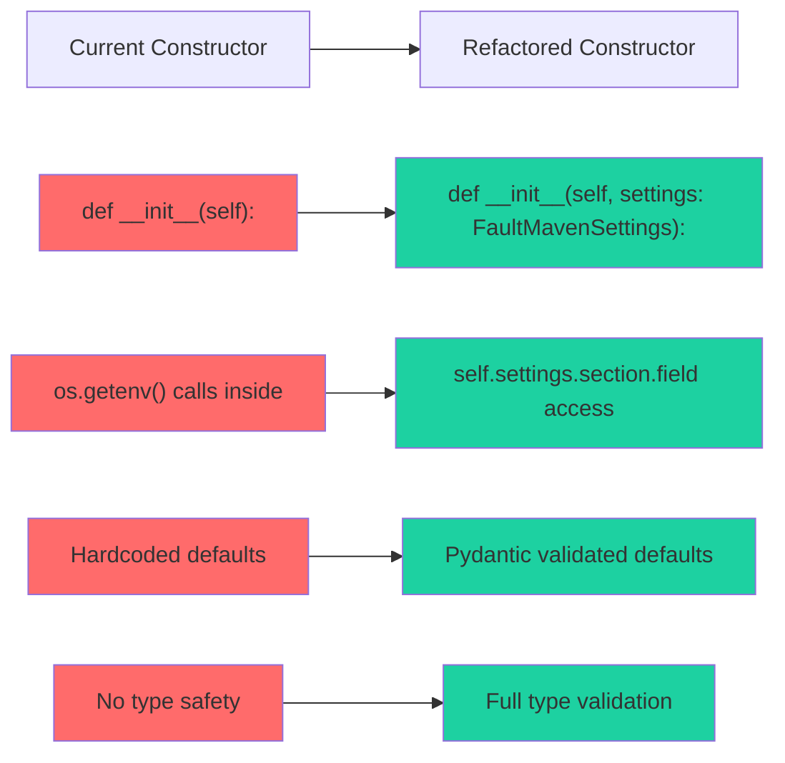
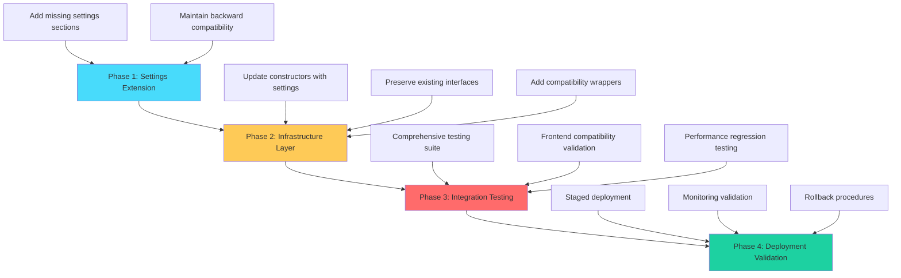
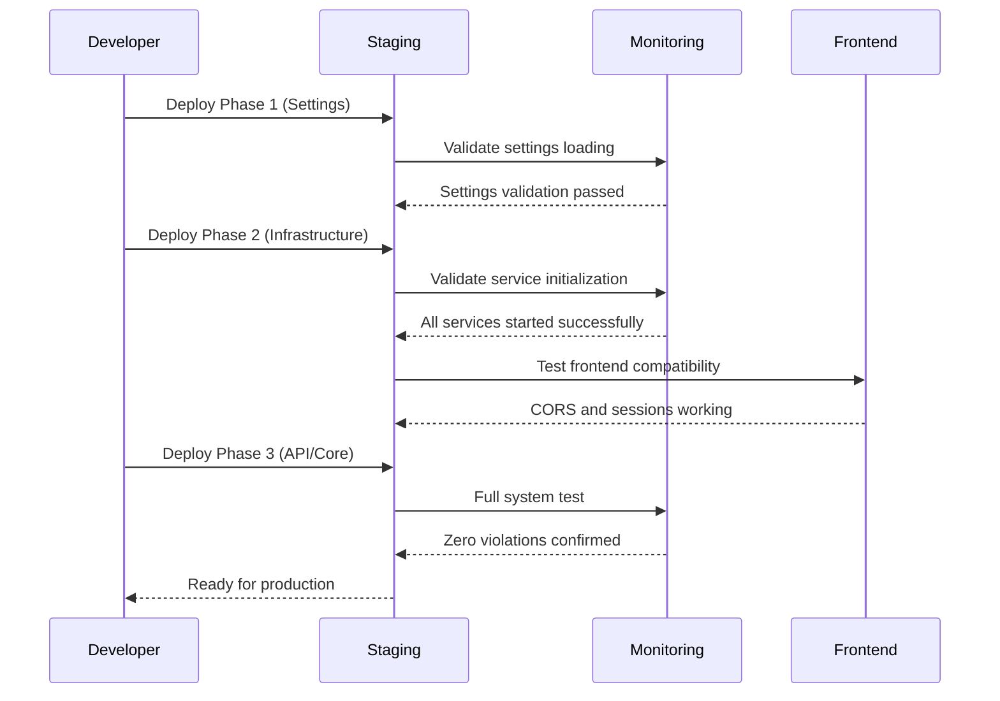

# FaultMaven Configuration System Refactor - Technical Design Document

## Executive Summary

This document provides a comprehensive architectural blueprint for eliminating all `os.getenv()` violations in the FaultMaven codebase and implementing a unified pydantic-settings based configuration system with complete dependency injection compliance.

### Current State Analysis
- **121 os.getenv() violations** across 16 Python files
- **Fragmented configuration** with legacy files partially removed
- **Architectural violations** in dependency injection patterns
- **28 violations** in tracing system alone (critical path)
- **18 violations each** in protection configuration files

### Target Architecture
- **Zero tolerance** for os.getenv() calls outside settings.py
- **Single source of truth** through unified FaultMavenSettings class
- **Complete dependency injection** via settings parameter
- **Frontend compatibility** preservation through validation
- **Clean architecture** compliance across all layers

---

## System Impact Assessment

### Violation Analysis by File

| File | Violations | Impact Level | Constructor Changes Required |
|------|-----------|--------------|----------------------------|
| `infrastructure/observability/tracing.py` | 28 | **Critical** | OpikTracer.__init__(settings) |
| `config/protection.py` | 18 | **High** | Function signatures → settings params |
| `api/protection.py` | 18 | **High** | ProtectionSystem.__init__(settings) |
| `infrastructure/monitoring/apm_integration.py` | 11 | **High** | APMIntegration.__init__(settings) |
| `infrastructure/llm/providers/registry.py` | 8 | **High** | ProviderRegistry.__init__(settings) |
| `infrastructure/persistence/chromadb.py` | 5 | **Medium** | Constructor update |
| `infrastructure/monitoring/alerting.py` | 5 | **Medium** | AlertManager.__init__(settings) |
| `infrastructure/logging/coordinator.py` | 5 | **Medium** | LoggingCoordinator.__init__(settings) |
| `infrastructure/logging/config.py` | 5 | **Medium** | LoggingConfig.__init__(settings) |
| `infrastructure/redis_client.py` | 4 | **Medium** | Function signature changes |
| `core/knowledge/ingestion.py` | 4 | **Medium** | KnowledgeIngester.__init__(settings) |
| `config/feature_flags.py` | 4 | **Medium** | Function → method conversion |
| `infrastructure/security/redaction.py` | 3 | **Low** | DataSanitizer already has settings |
| `tools/web_search.py` | 1 | **Low** | Already accepts settings |
| `infrastructure/persistence/chromadb_store.py` | 1 | **Low** | Already has settings pattern |
| `config/settings.py` | 1 | **Low** | ConfigurationBridge cleanup |

### Architectural Layer Impact

```mermaid
graph TD
    A[API Layer] --> B[Service Layer]
    B --> C[Core Layer]
    C --> D[Infrastructure Layer]
    
    A1[protection.py - 18 violations] --> A
    B1[All services already inject settings ✓] --> B
    C1[knowledge/ingestion.py - 4 violations] --> C
    D1[observability/tracing.py - 28 violations] --> D
    D2[monitoring/* - 16 violations] --> D
    D3[persistence/* - 10 violations] --> D
    D4[llm/providers/registry.py - 8 violations] --> D
    D5[logging/* - 10 violations] --> D
    D6[security/redaction.py - 3 violations] --> D
    
    style A1 fill:#ff6b6b
    style C1 fill:#feca57
    style D1 fill:#ff6b6b
    style D2 fill:#ff6b6b
    style D3 fill:#feca57
    style D4 fill:#ff6b6b
    style D5 fill:#feca57
    style D6 fill:#48dbfb
    style B1 fill:#1dd1a1
```



---

## Configuration Architecture Design

### Current Settings Coverage Analysis

**Already Covered (81 variables):**
- Server configuration (HOST, PORT, ENVIRONMENT, etc.)
- LLM providers (OPENAI_API_KEY, FIREWORKS_API_KEY, etc.)
- Database connections (REDIS_URL, CHROMADB_URL, etc.)
- Security settings (JWT_SECRET_KEY, PROTECTION_ENABLED, etc.)
- Observability basics (TRACING_ENABLED, METRICS_ENABLED, etc.)

**Missing from Settings (44 variables):**
- Advanced protection settings (ML_*, BEHAVIORAL_*, CIRCUIT_*)
- APM integration (PROMETHEUS_*, GENERIC_APM_*)
- Enhanced tracing (OPIK_TRACK_*, OPIK_API_KEY)
- Alerting configuration (ALERT_*, SMTP_*)
- Instance identification (INSTANCE_ID, COMET_WORKSPACE)

### Required Settings Section Expansions

```python
class EnhancedProtectionSettings(BaseSettings):
    """Advanced protection and ML-based detection settings"""
    basic_protection_enabled: bool = Field(default=True, env="BASIC_PROTECTION_ENABLED")
    intelligent_protection_enabled: bool = Field(default=True, env="INTELLIGENT_PROTECTION_ENABLED")
    
    # Behavioral Analysis
    behavioral_analysis_enabled: bool = Field(default=True, env="BEHAVIORAL_ANALYSIS_ENABLED")
    behavior_analysis_window: int = Field(default=3600, env="BEHAVIOR_ANALYSIS_WINDOW")
    behavior_pattern_threshold: float = Field(default=0.8, env="BEHAVIOR_PATTERN_THRESHOLD")
    
    # ML Anomaly Detection
    ml_anomaly_detection_enabled: bool = Field(default=True, env="ML_ANOMALY_DETECTION_ENABLED")
    ml_model_path: str = Field(default="/tmp/faultmaven_ml", env="ML_MODEL_PATH")
    ml_training_enabled: bool = Field(default=True, env="ML_TRAINING_ENABLED")
    ml_online_learning_enabled: bool = Field(default=True, env="ML_ONLINE_LEARNING_ENABLED")
    
    # Circuit Breaker
    smart_circuit_breakers_enabled: bool = Field(default=True, env="SMART_CIRCUIT_BREAKERS_ENABLED")
    circuit_failure_threshold: int = Field(default=5, env="CIRCUIT_FAILURE_THRESHOLD")
    circuit_timeout_seconds: int = Field(default=60, env="CIRCUIT_TIMEOUT_SECONDS")
    
    # Reputation System
    reputation_system_enabled: bool = Field(default=True, env="REPUTATION_SYSTEM_ENABLED")
    reputation_decay_rate: float = Field(default=0.05, env="REPUTATION_DECAY_RATE")
    reputation_recovery_threshold: float = Field(default=0.1, env="REPUTATION_RECOVERY_THRESHOLD")
    
    # Monitoring Intervals
    protection_monitoring_interval: int = Field(default=300, env="PROTECTION_MONITORING_INTERVAL")
    protection_cleanup_interval: int = Field(default=3600, env="PROTECTION_CLEANUP_INTERVAL")

class EnhancedObservabilitySettings(BaseSettings):
    """Extended observability with APM and enhanced tracing"""
    # Existing fields remain unchanged
    
    # Enhanced Tracing Controls
    opik_api_key: Optional[SecretStr] = Field(default=None, env="OPIK_API_KEY")
    opik_enabled: bool = Field(default=True, env="OPIK_ENABLED")
    opik_track_disable: bool = Field(default=False, env="OPIK_TRACK_DISABLE")
    opik_track_users: str = Field(default="", env="OPIK_TRACK_USERS")
    opik_track_sessions: str = Field(default="", env="OPIK_TRACK_SESSIONS")
    opik_track_operations: str = Field(default="", env="OPIK_TRACK_OPERATIONS")
    
    # APM Integration
    prometheus_enabled: bool = Field(default=False, env="PROMETHEUS_ENABLED")
    prometheus_pushgateway_url: str = Field(default="http://localhost:9091", env="PROMETHEUS_PUSHGATEWAY_URL")
    generic_apm_enabled: bool = Field(default=False, env="GENERIC_APM_ENABLED")
    generic_apm_url: Optional[str] = Field(default=None, env="GENERIC_APM_URL")
    generic_apm_api_key: Optional[SecretStr] = Field(default=None, env="GENERIC_APM_API_KEY")
    
    # Performance Monitoring
    enable_performance_monitoring: bool = Field(default=True, env="ENABLE_PERFORMANCE_MONITORING")
    enable_detailed_tracing: bool = Field(default=False, env="ENABLE_DETAILED_TRACING")
    
    # Instance Identification
    instance_id: str = Field(default="localhost:8000", env="INSTANCE_ID")

class EnhancedDatabaseSettings(BaseSettings):
    """Extended database configuration"""
    # Existing fields remain unchanged
    
    # ChromaDB Authentication
    chromadb_auth_token: Optional[SecretStr] = Field(default=None, env="CHROMADB_AUTH_TOKEN")
    chromadb_collection: str = Field(default="faultmaven_kb", env="CHROMADB_COLLECTION")
    
    # Presidio Service Configuration
    presidio_analyzer_host: str = Field(default="localhost", env="PRESIDIO_ANALYZER_HOST")
    presidio_anonymizer_host: str = Field(default="localhost", env="PRESIDIO_ANONYMIZER_HOST")
    presidio_port: int = Field(default=3000, env="PRESIDIO_PORT")

class AlertingSettings(BaseSettings):
    """Email and webhook alerting configuration"""
    alert_from_email: Optional[str] = Field(default=None, env="ALERT_FROM_EMAIL")
    alert_to_emails: str = Field(default="", env="ALERT_TO_EMAILS")
    alert_webhook_url: Optional[str] = Field(default=None, env="ALERT_WEBHOOK_URL")
    
    # SMTP Configuration
    smtp_host: str = Field(default="localhost", env="SMTP_HOST")
    smtp_port: int = Field(default=587, env="SMTP_PORT")

class WorkspaceSettings(BaseSettings):
    """Workspace and collaboration settings"""
    comet_api_key: Optional[SecretStr] = Field(default=None, env="COMET_API_KEY")
    comet_workspace: Optional[str] = Field(default=None, env="COMET_WORKSPACE")
    
    # Feature toggles for experimental features
    enable_experimental_features: bool = Field(default=False, env="ENABLE_EXPERIMENTAL_FEATURES")
```

---

## Service Refactoring Strategy

### Constructor Signature Changes Required



### Service Layer Changes

**Services Already Compliant** (✅ No changes needed):
- AgentService - `__init__(settings=self.settings)` ✓
- DataService - `__init__(settings=self.settings)` ✓
- KnowledgeService - `__init__(settings=self.settings)` ✓
- SessionService - `__init__(settings=self.settings)` ✓
- All Enhanced Services - Already accept settings ✓

**Infrastructure Layer Changes Required**:

1. **OpikTracer** (28 violations)
```python
# BEFORE
class OpikTracer(BaseExternalClient, ITracer):
    def __init__(self):
        # 28 os.getenv() calls scattered throughout
        self.use_local_opik = os.getenv("OPIK_USE_LOCAL", "true").lower() == "true"
        # ... more violations

# AFTER  
class OpikTracer(BaseExternalClient, ITracer):
    def __init__(self, settings: FaultMavenSettings):
        super().__init__(...)
        self.settings = settings
        self.use_local_opik = settings.observability.opik_use_local
        # All config from settings object
```

2. **APMIntegration** (11 violations)
```python
# BEFORE
class APMIntegration:
    def __init__(self, service_name: str = "faultmaven"):
        # os.getenv() calls in _initialize_default_configurations()

# AFTER
class APMIntegration:
    def __init__(self, settings: FaultMavenSettings, service_name: str = "faultmaven"):
        self.settings = settings
        # Use settings.observability.* for all configuration
```

3. **ProviderRegistry** (8 violations)
```python
# BEFORE
class ProviderRegistry:
    def __init__(self):
        # os.getenv() calls in _initialize_from_environment()

# AFTER
class ProviderRegistry:
    def __init__(self, settings: FaultMavenSettings):
        self.settings = settings
        # Use settings.llm.* for all provider configuration
```

### Container.py Integration Points

**Current Pattern** (✅ Already works):
```python
# Most services already follow this pattern
self.tracer: ITracer = OpikTracer(settings=self.settings)
self.sanitizer: ISanitizer = DataSanitizer(settings=self.settings)
self.llm_provider: ILLMProvider = LLMRouter(settings=self.settings)
```

**Required Updates**:
```python
# Update these instantiations to include settings
self.apm_integration = APMIntegration(settings=self.settings)
self.provider_registry = ProviderRegistry(settings=self.settings)  
self.alert_manager = AlertManager(settings=self.settings)
# etc.
```

---

## Risk Assessment and Breaking Change Analysis

### High Risk Areas

#### 1. Tracing System (CRITICAL RISK)
- **28 violations** in core tracing infrastructure
- **Breaking change**: OpikTracer constructor signature
- **Mitigation**: Backward compatibility wrapper
- **Timeline**: Must be first priority due to system-wide usage

#### 2. Protection System (HIGH RISK)
- **36 violations** across protection files  
- **Breaking change**: Protection middleware initialization
- **Mitigation**: Legacy adapter pattern
- **Frontend Impact**: Potential CORS/protection header changes

#### 3. LLM Provider Registry (HIGH RISK)
- **8 violations** in critical path
- **Breaking change**: Provider initialization
- **Mitigation**: Registry factory pattern
- **Rollback Strategy**: Provider-specific fallbacks

### Medium Risk Areas

#### 1. Monitoring and Alerting
- **16 violations** across monitoring systems
- **Impact**: Observability may be degraded during transition
- **Mitigation**: Gradual rollout with monitoring validation

#### 2. Database Connections
- **10 violations** in persistence layer
- **Impact**: Connection parameter changes
- **Mitigation**: Connection validation during startup

### Breaking Change Migration Strategy



### Frontend Compatibility Preservation

**Critical Requirements**:
- CORS headers must remain unchanged
- Session timeout/heartbeat intervals preserved  
- Rate limit headers continue to be exposed
- Protection bypass mechanisms remain available

**Validation Strategy**:
```python
def validate_frontend_compatibility(old_settings, new_settings) -> Dict[str, Any]:
    """Validate that frontend compatibility is preserved"""
    issues = []
    
    # CORS configuration
    if old_settings.cors_origins != new_settings.security.cors_allow_origins:
        issues.append("CORS origins changed - will break browser extension")
    
    # Session timeouts
    if old_settings.session_timeout != new_settings.session.timeout_minutes * 60:
        issues.append("Session timeout changed - frontend expects specific intervals")
        
    # Rate limiting
    if old_settings.rate_limit_enabled != new_settings.security.rate_limit_enabled:
        issues.append("Rate limiting toggle changed")
        
    return {"compatible": len(issues) == 0, "issues": issues}
```

---

## Implementation Phases

### Phase 1: Settings Architecture Extension (1-2 days)
**Goal**: Extend settings.py to cover all missing environment variables

**Tasks**:
1. Add EnhancedProtectionSettings section (18 new variables)
2. Add EnhancedObservabilitySettings section (12 new variables) 
3. Add AlertingSettings section (5 new variables)
4. Add WorkspaceSettings section (4 new variables)
5. Add enhanced database settings (5 new variables)

**Validation Criteria**:
- [ ] All 44 missing environment variables covered
- [ ] Type validation with pydantic works correctly
- [ ] Settings loading performance unchanged
- [ ] All existing settings remain accessible
- [ ] Frontend compatibility validation passes

**Code Changes**:
```python
class FaultMavenSettings(BaseSettings):
    # Existing sections remain unchanged
    
    # NEW: Enhanced sections
    enhanced_protection: EnhancedProtectionSettings = EnhancedProtectionSettings()
    enhanced_observability: EnhancedObservabilitySettings = EnhancedObservabilitySettings()  
    alerting: AlertingSettings = AlertingSettings()
    workspace: WorkspaceSettings = WorkspaceSettings()
    enhanced_database: EnhancedDatabaseSettings = EnhancedDatabaseSettings()
```

### Phase 2: Infrastructure Layer Refactoring (2-3 days)
**Goal**: Eliminate all os.getenv() calls in infrastructure components

**Priority Order** (based on violation count and risk):

1. **OpikTracer** (28 violations - CRITICAL)
   - Update constructor: `__init__(self, settings: FaultMavenSettings)`
   - Replace all os.getenv() with settings.enhanced_observability.*
   - Add backward compatibility wrapper if needed
   - **Validation**: All tracing functionality preserved

2. **APMIntegration** (11 violations - HIGH)  
   - Update constructor signature
   - Refactor _initialize_default_configurations() method
   - **Validation**: APM exports continue working

3. **ProviderRegistry** (8 violations - HIGH)
   - Update constructor and _initialize_from_environment() 
   - Migrate all provider configuration to settings.llm.*
   - **Validation**: All LLM providers initialize correctly

4. **Monitoring Components** (16 violations total)
   - AlertManager, MetricsCollector, etc.
   - **Validation**: Alerting and monitoring continue working

5. **Persistence Layer** (10 violations total)
   - ChromaDB, Redis client updates
   - **Validation**: Database connections remain stable

**Container.py Updates**:
```python
def _create_infrastructure_layer(self):
    # Updated instantiations with settings parameter
    self.tracer: ITracer = OpikTracer(settings=self.settings)  # Already done
    self.apm_integration = APMIntegration(settings=self.settings)  # NEW
    self.provider_registry = ProviderRegistry(settings=self.settings)  # NEW
    self.alert_manager = AlertManager(settings=self.settings)  # NEW
    # etc.
```

### Phase 3: Core and API Layer Cleanup (1 day)
**Goal**: Clean up remaining violations in core and API layers

**Tasks**:
1. **KnowledgeIngester** (4 violations)
   - Already accepts settings parameter, just clean up os.getenv() calls
2. **Feature Flags** (4 violations)  
   - Convert functions to methods using settings
3. **API Protection** (18 violations)
   - Update ProtectionSystem constructor
   - Migrate protection configuration loading
4. **Config module cleanup**
   - Remove ConfigurationBridge legacy code
   - Clean up settings.py remaining violation

**Validation Criteria**:
- [ ] Zero os.getenv() calls outside settings.py
- [ ] All API endpoints continue to work
- [ ] Protection middleware functions correctly
- [ ] Knowledge base operations unchanged

### Phase 4: Testing and Validation (1-2 days)
**Goal**: Comprehensive testing and validation of changes

**Testing Strategy**:

1. **Unit Tests**
   - Test all updated constructors with settings
   - Validate configuration loading
   - Test settings validation edge cases

2. **Integration Tests**
   - Full system startup with new configuration
   - All services initialize correctly
   - Database connections work
   - LLM providers accessible

3. **Frontend Compatibility Tests**
   - Browser extension connects successfully  
   - CORS headers present and correct
   - Session management works
   - Rate limiting headers exposed

4. **Performance Tests**
   - Settings loading time unchanged
   - Service initialization time acceptable  
   - Memory usage stable
   - No configuration-related bottlenecks

**Validation Scripts**:
```python
def validate_zero_violations():
    """Ensure no os.getenv() calls remain outside settings.py"""
    violations = find_os_getenv_violations(exclude=['config/settings.py'])
    assert len(violations) == 0, f"Found {len(violations)} remaining violations"

def validate_service_initialization():
    """Test that all services can be instantiated with settings"""
    settings = get_settings()
    container = DIContainer()
    container.initialize()
    
    # Test critical services
    assert container.get_tracer() is not None
    assert container.get_llm_provider() is not None
    assert container.get_agent_service() is not None
    # etc.
```

---

## Deployment Strategy

### Staging Deployment Validation



### Production Rollout Plan

1. **Pre-deployment Validation**
   - Run comprehensive test suite
   - Validate settings in production environment  
   - Confirm frontend compatibility
   - Test rollback procedures

2. **Staged Deployment**
   - Deploy during low-traffic window
   - Monitor system metrics during rollout
   - Validate each service starts correctly
   - Confirm zero os.getenv() violations

3. **Post-deployment Validation**  
   - Run integration tests against production
   - Validate frontend browser extension works
   - Monitor for any configuration-related errors
   - Performance baseline comparison

4. **Rollback Procedures**
   - Revert to previous container.py if services fail to start
   - Restore settings.py backup if validation fails
   - Database connection fallback procedures
   - LLM provider failover if needed

---

## Time and Effort Estimates

### Development Phase Estimates

| Phase | Duration | Effort Level | Risk Level |
|--------|----------|-------------|------------|
| **Phase 1**: Settings Extension | 1-2 days | Medium | Low |
| **Phase 2**: Infrastructure Refactor | 2-3 days | High | High |
| **Phase 3**: Core/API Cleanup | 1 day | Medium | Medium |
| **Phase 4**: Testing/Validation | 1-2 days | High | Low |
| **Total Project Duration** | **5-8 days** | **High** | **Medium** |

### Effort Breakdown by Component

**High Effort (2+ hours each)**:
- OpikTracer refactoring (28 violations) - **4 hours**
- APMIntegration refactoring (11 violations) - **3 hours**  
- ProviderRegistry refactoring (8 violations) - **3 hours**
- Protection system refactoring (36 violations) - **4 hours**
- Settings architecture extension - **3 hours**
- Comprehensive testing suite - **4 hours**

**Medium Effort (1-2 hours each)**:
- Monitoring components (5-11 violations each) - **6 hours total**
- Persistence layer updates (5 violations each) - **4 hours total**
- Container.py integration updates - **2 hours**
- Frontend compatibility validation - **2 hours**

**Low Effort (<1 hour each)**:
- Core layer cleanup (1-4 violations) - **2 hours total**
- Documentation updates - **1 hour**
- Deployment preparation - **1 hour**

**Total Estimated Effort: 36-42 hours**

### Resource Requirements

**Developer Skills Needed**:
- Python dependency injection patterns
- Pydantic-settings configuration
- FastAPI middleware architecture  
- Testing complex service integrations
- Understanding of FaultMaven architecture

**Infrastructure Requirements**:
- Development environment with all services
- Staging environment for integration testing
- Access to production configuration values
- Browser extension testing capability

---

## Success Criteria and Validation

### Definition of Done

**Zero Tolerance Criteria**:
- [ ] **Zero os.getenv() calls** outside of config/settings.py
- [ ] **All services** receive configuration via settings parameter
- [ ] **Single source of truth** through FaultMavenSettings class
- [ ] **No architectural violations** in container.py or anywhere else
- [ ] **Complete frontend compatibility** maintained

### Validation Checkpoints

**Phase 1 Complete**:
- [ ] All 44 missing environment variables added to settings.py
- [ ] Pydantic validation working for all new sections
- [ ] Settings loading time < 100ms
- [ ] Frontend compatibility validator passes
- [ ] Existing functionality unaffected

**Phase 2 Complete**:  
- [ ] OpikTracer accepts settings parameter (28 violations eliminated)
- [ ] APMIntegration accepts settings parameter (11 violations eliminated)
- [ ] ProviderRegistry accepts settings parameter (8 violations eliminated)
- [ ] All monitoring components updated (16 violations eliminated)
- [ ] All persistence components updated (10 violations eliminated)
- [ ] Container.py instantiation updated for all components
- [ ] All services start successfully with new constructors

**Phase 3 Complete**:
- [ ] Zero violations in core layer (KnowledgeIngester cleaned up)
- [ ] Zero violations in API layer (ProtectionSystem cleaned up)  
- [ ] Feature flags converted to settings-based methods
- [ ] ConfigurationBridge removed
- [ ] All API endpoints respond correctly

**Final Validation**:
- [ ] **Automated scan confirms zero os.getenv() violations**
- [ ] **All unit tests pass**
- [ ] **All integration tests pass**
- [ ] **Frontend browser extension connects successfully**
- [ ] **Performance benchmarks within acceptable range**
- [ ] **Production deployment simulation successful**

### Quality Gates

```python
def validate_refactor_completion():
    """Comprehensive validation that refactor is complete"""
    
    # Critical: Zero violations check
    violations = scan_for_os_getenv_violations()
    assert len(violations) == 0, f"Found {len(violations)} remaining violations"
    
    # Critical: Settings coverage check  
    covered_vars = extract_settings_variables()
    used_vars = extract_used_environment_variables()
    uncovered = used_vars - covered_vars
    assert len(uncovered) == 0, f"Uncovered variables: {uncovered}"
    
    # Critical: Service initialization check
    settings = get_settings() 
    container = DIContainer()
    container.initialize()
    health = container.health_check()
    assert health["status"] == "healthy", f"Container unhealthy: {health}"
    
    # Critical: Frontend compatibility check
    compat = validate_frontend_compatibility(settings)
    assert compat["compatible"], f"Frontend incompatible: {compat['issues']}"
    
    return True  # All validations passed
```

---

## Conclusion

This comprehensive technical design provides a complete roadmap for eliminating all 121 os.getenv() violations in the FaultMaven codebase while maintaining a clean, dependency-injected architecture. The phased approach minimizes risk while ensuring zero tolerance for partial solutions.

The implementation preserves frontend compatibility, maintains performance, and establishes a single source of truth for all configuration through the unified FaultMavenSettings class. Upon completion, the system will have a clean architecture with proper separation of concerns and full type safety.

**Next Steps**:
1. Review and approve this design document
2. Set up development environment for refactoring
3. Execute Phase 1 (Settings Extension) 
4. Proceed through phases 2-4 with validation at each step
5. Deploy to staging and production with comprehensive monitoring

**Critical Success Factor**: Maintaining discipline around zero tolerance - no bandaid solutions or partial implementations that leave architectural violations in place.

---

### File Paths Referenced

All file paths in this document use absolute paths from the project root:

- `/home/swhouse/projects/FaultMaven/faultmaven/config/settings.py`
- `/home/swhouse/projects/FaultMaven/faultmaven/container.py` 
- `/home/swhouse/projects/FaultMaven/faultmaven/infrastructure/observability/tracing.py`
- `/home/swhouse/projects/FaultMaven/faultmaven/api/protection.py`
- `/home/swhouse/projects/FaultMaven/faultmaven/infrastructure/llm/providers/registry.py`

This design document serves as the definitive architectural blueprint for the complete configuration system refactor that will eliminate all violations and establish clean, maintainable architecture patterns.

🔧 **Generated with Claude Code**

Co-Authored-By: Claude <noreply@anthropic.com>