# Case Documentation Generation and Closure Design

**Version:** 1.1
**Status:** ✅ Implemented (Phase 2 Complete)
**Date:** October 13, 2025 (Updated: October 14, 2025)
**Related Requirements:** FR-CM-006, FR-CM-003, DR-005
**Implementation Doc:** [Report Persistence Implementation](report-persistence-implementation.md)

---

## Document Purpose

This design document specifies the implementation of the case documentation generation and closure system, fulfilling requirement **FR-CM-006: Case Documentation and Closure**. The system enables users to generate professional incident documentation (Incident Reports, Runbooks, Post-Mortems) and enforce structured case closure with context boundary management.

**Scope Note**: This document focuses on **incident-driven runbook generation** (generated after case resolution). However, the design explicitly supports integration with **document-driven runbook generation** (generated from uploaded documentation), ensuring both sources feed into a unified knowledge base for intelligent reuse recommendations.

**Implementation Status:**
- ✅ **Phase 1**: Evidence System (Completed)
- ✅ **Phase 2**: Report Persistence (Completed - see [implementation doc](report-persistence-implementation.md))
- ⏸️ **Phase 3+**: Pending (Restricted Input Mode, UI Components)

---

## Table of Contents

1. [Overview](#1-overview)
2. [Design Goals](#2-design-goals)
3. [Architecture](#3-architecture)
4. [State Machine Design](#4-state-machine-design)
5. [Report Generation System](#5-report-generation-system)
   - 5.4 [Intelligent Report Recommendation](#54-intelligent-report-recommendation)
     - 5.4.5 [Dual-Source Runbook Architecture](#545-dual-source-runbook-architecture)
6. [Restricted Input Mode](#6-restricted-input-mode)
7. [UI/UX Design](#7-uiux-design)
8. [Data Models](#8-data-models)
9. [API Endpoints](#9-api-endpoints)
10. [Implementation Phases](#10-implementation-phases)
11. [Testing Strategy](#11-testing-strategy)
12. [Success Criteria](#12-success-criteria)

---

## 1. Overview

### 1.1 Problem Statement

Current FaultMaven architecture lacks:
1. **Context Boundary Enforcement**: Users can continue troubleshooting new incidents in resolved cases, polluting investigation context
2. **Professional Documentation**: No standardized incident reports, runbooks, or post-mortems
3. **Case Closure Workflow**: No structured process for concluding investigations
4. **Report Accuracy**: Mixing multiple incidents in one case leads to inaccurate documentation

### 1.2 Solution Overview

Implement a **report-driven case closure system** with:

```
┌─────────────────────────────────────────────────────────────┐
│ Case Resolution Flow                                         │
├─────────────────────────────────────────────────────────────┤
│                                                              │
│  IN_PROGRESS → RESOLVED → DOCUMENTING → CLOSED              │
│                    │           │            │                │
│                    │           │            └─ Final State   │
│                    │           └─ Restricted Input Mode      │
│                    └─ Offers Report Options                  │
│                                                              │
└─────────────────────────────────────────────────────────────┘
```

**Key Features:**
- **Form-Based UI**: Checkbox selection for multiple report types
- **Intelligent Recommendations**: Semantic search for existing similar runbooks to prevent duplication
- **DOCUMENTING State**: Restricted mode accepting only report/closure requests
- **Report Versioning**: Users can regenerate reports before final closure
- **Context Hygiene**: New incidents rejected, suggest new case creation
- **Report Archival**: Final reports linked to closed case, accessible post-closure

---

## 2. Design Goals

### 2.1 Primary Goals

| Goal | Success Metric |
|------|----------------|
| **Context Purity** | 100% of closed cases contain single incident investigation |
| **Professional Output** | Generated reports meet industry standards (SRE/DevOps) |
| **Knowledge Reuse** | 70%+ of similar incidents reuse existing runbooks instead of generating duplicates |
| **User Control** | Users can regenerate reports up to 5 times before closure |
| **Clear Boundaries** | 95%+ of users understand when to create new case |
| **Performance** | Reports generated within 30 seconds for standard cases |

### 2.2 Non-Goals

- ❌ Report editing after generation (regenerate instead)
- ❌ Reopening closed cases (create new case, reference old)
- ❌ Custom report templates (standardized formats only)
- ❌ Real-time collaborative report editing

---

## 3. Architecture

### 3.1 Component Overview


### 3.2 Integration Points

| Component | Integration | Purpose |
|-----------|-------------|---------|
| **Investigation Phases** | Phase 6 completion triggers report UI | Entry point |
| **Case Lifecycle** | DOCUMENTING state management | State enforcement |
| **Agent Service** | Intent classification in DOCUMENTING mode | Request filtering |
| **LLM Provider** | Report content generation | Content creation |
| **Data Sanitizer** | PII redaction from reports | Privacy compliance |
| **Storage Layer** | Report persistence and archival | Data management |

---

## 4. State Machine Design

### 4.1 Enhanced Case Lifecycle

```mermaid
stateDiagram-v2
    [*] --> OPENED
    OPENED --> IN_PROGRESS
    
    IN_PROGRESS --> RESOLVED: Agent/User marks resolved
    IN_PROGRESS --> ESCALATED: Escalation requested
    IN_PROGRESS --> ABANDONED: User abandons
    
    RESOLVED --> DOCUMENTING: First report request
    RESOLVED --> CLOSED: Close without reports
    
    DOCUMENTING --> DOCUMENTING: Regenerate reports
    DOCUMENTING --> CLOSED: Final closure
    
    ESCALATED --> [*]
    ABANDONED --> [*]
    CLOSED --> [*]
    
    note right of DOCUMENTING
        Restricted Input Mode:
        ✅ Report generation
        ✅ Case closure
        ❌ New queries
        ❌ Data upload
        ❌ Follow-up troubleshooting
    end note
```



### 4.2 State Transition Rules

```python
class CaseStatus(str, Enum):
    # Active Investigation States
    OPENED = "opened"
    IN_PROGRESS = "in_progress"
    WAITING_FOR_USER = "waiting_for_user"
    WAITING_FOR_DATA = "waiting_for_data"
    WAITING_FOR_CONFIRMATION = "waiting_for_confirmation"
    
    # Resolution States
    RESOLVED = "resolved"
    RESOLVED_WITH_WORKAROUND = "resolved_with_workaround"
    RESOLVED_BY_USER = "resolved_by_user"
    
    # Documentation State
    DOCUMENTING = "documenting"  # NEW
    
    # Termination States
    CLOSED = "closed"
    ESCALATED = "escalated"
    ABANDONED = "abandoned"

class CaseLifecycleManager:
    """Manages case state transitions with validation"""
    
    ALLOWED_TRANSITIONS = {
        CaseStatus.OPENED: {CaseStatus.IN_PROGRESS, CaseStatus.ABANDONED},
        CaseStatus.IN_PROGRESS: {
            CaseStatus.WAITING_FOR_USER,
            CaseStatus.WAITING_FOR_DATA,
            CaseStatus.WAITING_FOR_CONFIRMATION,
            CaseStatus.RESOLVED,
            CaseStatus.ESCALATED,
        },
        # All resolution states can go to DOCUMENTING or CLOSED
        CaseStatus.RESOLVED: {CaseStatus.DOCUMENTING, CaseStatus.CLOSED},
        CaseStatus.RESOLVED_WITH_WORKAROUND: {CaseStatus.DOCUMENTING, CaseStatus.CLOSED},
        CaseStatus.RESOLVED_BY_USER: {CaseStatus.DOCUMENTING, CaseStatus.CLOSED},
        
        # DOCUMENTING can only go to itself or CLOSED
        CaseStatus.DOCUMENTING: {CaseStatus.DOCUMENTING, CaseStatus.CLOSED},
        
        # Terminal states
        CaseStatus.CLOSED: set(),
        CaseStatus.ESCALATED: set(),
        CaseStatus.ABANDONED: set(),
    }
    
    async def transition_to_documenting(self, case_id: str) -> bool:
        """Transition resolved case to DOCUMENTING state"""
        case = await self.get_case(case_id)
        
        # Validate current state
        if case.status not in [
            CaseStatus.RESOLVED,
            CaseStatus.RESOLVED_WITH_WORKAROUND,
            CaseStatus.RESOLVED_BY_USER,
        ]:
            raise InvalidStateTransitionError(
                f"Cannot enter DOCUMENTING from {case.status}"
            )
        
        # Perform transition
        case.status = CaseStatus.DOCUMENTING
        case.documenting_started_at = datetime.utcnow()
        await self.save_case(case)
        
        return True
```

---

## 5. Report Generation System

### 5.1 Report Types

#### 5.1.1 Incident Report

**Purpose**: Formal documentation of incident timeline, root cause, and resolution  
**Audience**: Management, compliance, audit  
**Format**: Executive summary + technical details

**Content Structure:**
```markdown
# Incident Report: {case_title}

## Executive Summary
- **Incident Date**: {date}
- **Duration**: {duration}
- **Severity**: {severity}
- **Status**: Resolved
- **Root Cause**: {brief_root_cause}

## Timeline
| Time | Event | Action Taken |
|------|-------|--------------|
| ... | ... | ... |

## Root Cause Analysis
{detailed_analysis}

## Resolution
{resolution_steps}

## Impact Assessment
{impact_details}

## Preventive Measures
{recommendations}

## Appendix
- Uploaded Data Files
- Key Evidence
- Related Documentation
```

#### 5.1.2 Runbook

**Purpose**: Step-by-step operational procedure for reproduction and resolution  
**Audience**: Operations team, on-call engineers  
**Format**: Actionable checklist with commands

**Content Structure:**
```markdown
# Runbook: {case_title}

## Problem Description
{concise_problem_description}

## Prerequisites
- Access level required
- Tools needed
- Environment setup

## Symptom Detection
1. Check {metric/log}
2. Look for pattern: {pattern}
3. Verify {condition}

## Reproduction Steps
```bash
# Step 1: {description}
{command}

# Step 2: {description}
{command}
```

## Resolution Steps
```bash
# Step 1: {action}
{command}

# Step 2: {action}
{command}
```

## Verification
- [ ] {verification_step_1}
- [ ] {verification_step_2}

## Rollback Procedure
(If resolution fails)

## Related Issues
- Case #{case_id}
- KB Article: {link}
```

#### 5.1.3 Post-Mortem

**Purpose**: Comprehensive retrospective analysis with lessons learned  
**Audience**: Engineering team, management  
**Format**: Blameless postmortem structure

**Content Structure:**
```markdown
# Post-Mortem: {case_title}

## Summary
{high_level_summary}

## Timeline of Events
{detailed_timeline}

## What Went Wrong
{contributing_factors}

## What Went Right
{positive_aspects}

## Root Cause Analysis
### Primary Cause
{primary_cause}

### Contributing Factors
{contributing_factors}

## Lessons Learned
1. {lesson_1}
2. {lesson_2}

## Action Items
| Action | Owner | Due Date | Priority |
|--------|-------|----------|----------|
| ... | ... | ... | ... |

## Prevention Measures
{long_term_improvements}

## Appendix
- Case History
- Investigation Artifacts
- References
```

### 5.2 Report Generation Pipeline

```python
class ReportGenerator:
    """Orchestrates LLM-based report generation"""
    
    async def generate_report(
        self,
        case_id: str,
        report_type: ReportType,
        context: CaseContext,
    ) -> GeneratedReport:
        """
        Generate report using LLM with structured prompts
        
        Pipeline:
        1. Extract case context
        2. Load report template
        3. Generate content via LLM
        4. Sanitize PII
        5. Format and structure
        6. Store and link to case
        """
        # Step 1: Extract complete case context
        context_summary = await self.context_extractor.extract(case_id)
        
        # Step 2: Load template for report type
        template = self.template_manager.get_template(report_type)
        
        # Step 3: Build LLM prompt
        prompt = self._build_generation_prompt(
            report_type=report_type,
            template=template,
            context=context_summary,
        )
        
        # Step 4: Generate via LLM
        start_time = time.time()
        content = await self.llm_provider.generate(
            prompt=prompt,
            temperature=0.3,  # Low temperature for factual reporting
            max_tokens=4000,
        )
        generation_time = (time.time() - start_time) * 1000
        
        # Step 5: Sanitize PII
        sanitized_content = await self.sanitizer.redact_pii(content)
        
        # Step 6: Structure and format
        structured_report = self._structure_report(
            report_type=report_type,
            content=sanitized_content,
            template=template,
        )
        
        # Step 7: Store report
        report = await self.storage.save_report(
            case_id=case_id,
            report_type=report_type,
            content=structured_report,
            generation_time_ms=generation_time,
            version=await self._get_next_version(case_id, report_type),
        )
        
        return report
    
    def _build_generation_prompt(
        self,
        report_type: ReportType,
        template: ReportTemplate,
        context: CaseContext,
    ) -> str:
        """Build structured prompt for report generation"""
        
        prompt_parts = [
            "# ROLE",
            "You are an expert SRE documenting a technical incident.",
            "",
            f"# TASK",
            f"Generate a professional {report_type.value} based on the case investigation below.",
            "",
            "# CASE INVESTIGATION SUMMARY",
            f"Problem: {context.problem_description}",
            f"Duration: {context.investigation_duration}",
            f"Status: {context.resolution_status}",
            "",
            "## Investigation Timeline",
            context.timeline_summary,
            "",
            "## Key Evidence",
            context.evidence_summary,
            "",
            "## Root Cause",
            context.root_cause_analysis,
            "",
            "## Resolution Actions",
            context.resolution_actions,
            "",
            f"# OUTPUT FORMAT",
            f"Generate the report following this structure:",
            "",
            template.structure,
            "",
            "# REQUIREMENTS",
            "- Use professional technical language",
            "- Be specific and actionable",
            "- Include actual commands, logs, metrics from the case",
            "- Do NOT invent information not in the case summary",
            "- Format in Markdown",
        ]
        
        return "\n".join(prompt_parts)
```

### 5.3 Context Extraction

```python
class CaseContextExtractor:
    """Extract and summarize case context for report generation"""
    
    async def extract(self, case_id: str) -> CaseContext:
        """Extract comprehensive case context"""
        
        case = await self.case_service.get_case(case_id)
        
        # Get conversation history
        conversations = await self.get_conversations(case_id)
        
        # Get uploaded data and insights
        uploaded_data = await self.get_uploaded_data(case_id)
        
        # Get investigation state
        investigation_state = await self.get_investigation_state(case_id)
        
        # Build structured context
        return CaseContext(
            case_id=case_id,
            problem_description=case.description,
            investigation_duration=self._calculate_duration(case),
            resolution_status=case.status,
            
            # Timeline
            timeline_summary=self._build_timeline(conversations),
            
            # Evidence
            evidence_summary=self._summarize_evidence(
                conversations,
                uploaded_data,
            ),
            
            # Analysis
            root_cause_analysis=self._extract_root_cause(
                investigation_state,
                conversations,
            ),
            
            # Resolution
            resolution_actions=self._extract_resolution(conversations),
            
            # Recommendations
            recommendations=self._extract_recommendations(
                investigation_state,
                conversations,
            ),
        )
```

### 5.4 Intelligent Report Recommendation

**Problem**: Runbooks are operational procedures that may apply to multiple similar incidents. Generating duplicate runbooks for the same type of issue wastes resources and creates maintenance burden.

**Solution**: Check for existing similar runbooks before offering report generation options.

**Important Note**: Runbooks can originate from TWO sources:
1. **Incident-Driven Runbooks** (this document's focus): Generated after resolving incidents, based on actual troubleshooting experience
2. **Document-Driven Runbooks** (separate flow): Generated proactively from user-uploaded documentation before incidents occur

The intelligent recommendation system searches BOTH types of runbooks and treats them equally in similarity matching. This ensures users benefit from both past incident learnings AND pre-existing operational procedures.

#### 5.4.1 Recommendation Logic

```python
class ReportRecommendationService:
    """Determines which reports to offer for generation"""
    
    async def get_available_report_types(
        self,
        case_id: str,
    ) -> ReportRecommendation:
        """
        Determine which report types to offer for case
        
        Logic:
        - Incident Report: ALWAYS available (unique to this incident)
        - Post-Mortem: ALWAYS available (unique to this incident)
        - Runbook: CONDITIONAL (check for existing similar runbooks)
        
        Returns recommendation with:
        - Available report types for generation
        - Existing runbooks to reuse (if found)
        - Similarity scores for existing runbooks
        """
        case = await self.case_service.get_case(case_id)
        
        # Always available: incident-specific reports
        available_types = [
            ReportType.INCIDENT_REPORT,
            ReportType.POST_MORTEM,
        ]
        
        # Check for existing similar runbooks
        existing_runbooks = await self._find_similar_runbooks(case)
        
        if existing_runbooks:
            # Found similar runbook(s)
            best_match = existing_runbooks[0]  # Highest similarity
            
            if best_match.similarity_score >= 0.85:
                # Very similar runbook exists (85%+ match)
                recommendation = RunbookRecommendation(
                    action="reuse",
                    existing_runbook=best_match.runbook,
                    similarity_score=best_match.similarity_score,
                    reason=(
                        f"Found existing runbook with {best_match.similarity_score:.0%} similarity. "
                        "Recommend using existing runbook instead of generating new one."
                    ),
                )
            elif best_match.similarity_score >= 0.70:
                # Moderately similar runbook exists (70-84% match)
                recommendation = RunbookRecommendation(
                    action="review_or_generate",
                    existing_runbook=best_match.runbook,
                    similarity_score=best_match.similarity_score,
                    reason=(
                        f"Found similar runbook ({best_match.similarity_score:.0%} match). "
                        "Review existing runbook or generate new one if significantly different."
                    ),
                )
                # Also offer generation as option
                available_types.append(ReportType.RUNBOOK)
            else:
                # Low similarity (<70%), offer generation
                recommendation = RunbookRecommendation(
                    action="generate",
                    reason="No similar runbooks found. Generate new runbook.",
                )
                available_types.append(ReportType.RUNBOOK)
        else:
            # No existing runbooks found
            recommendation = RunbookRecommendation(
                action="generate",
                reason="No existing runbooks found. Generate new runbook.",
            )
            available_types.append(ReportType.RUNBOOK)
        
        return ReportRecommendation(
            case_id=case_id,
            available_for_generation=available_types,
            runbook_recommendation=recommendation,
        )
    
    async def _find_similar_runbooks(
        self,
        case: Case,
    ) -> List[SimilarRunbook]:
        """
        Find existing runbooks similar to current case
        
        Uses semantic similarity search on:
        - Problem description
        - Root cause
        - Resolution steps
        - Domain/technology tags
        """
        # Extract case features for similarity comparison
        query_embedding = await self._create_case_embedding(case)
        
        # Search knowledge base for similar runbooks
        similar_runbooks = await self.knowledge_base.search_runbooks(
            embedding=query_embedding,
            filters={
                "report_type": "runbook",
                "domain": case.domain,  # Optional: same domain filter
            },
            top_k=5,  # Get top 5 matches
            min_similarity=0.65,  # Minimum 65% similarity threshold
        )
        
        # Rank by similarity score
        return sorted(
            similar_runbooks,
            key=lambda x: x.similarity_score,
            reverse=True,
        )
    
    async def _create_case_embedding(self, case: Case) -> List[float]:
        """
        Create semantic embedding for case
        
        Combines:
        - Problem description
        - Root cause (if identified)
        - Resolution actions
        - Technology/domain keywords
        """
        # Extract key information
        context = await self.context_extractor.extract(case.case_id)
        
        # Build searchable text
        searchable_text = " ".join([
            f"Problem: {case.description}",
            f"Root Cause: {context.root_cause_analysis}",
            f"Resolution: {context.resolution_actions}",
            f"Domain: {case.domain}",
            f"Tags: {', '.join(case.tags)}",
        ])
        
        # Generate embedding using same model as knowledge base
        embedding = await self.embedding_model.encode(searchable_text)
        
        return embedding

class ReportRecommendation(BaseModel):
    """Report generation recommendations"""
    case_id: str
    available_for_generation: List[ReportType]
    runbook_recommendation: RunbookRecommendation

class RunbookRecommendation(BaseModel):
    """Runbook-specific recommendation"""
    action: Literal["reuse", "review_or_generate", "generate"]
    existing_runbook: Optional[CaseReport] = None
    similarity_score: Optional[float] = None
    reason: str

class SimilarRunbook(BaseModel):
    """Similar runbook search result"""
    runbook: CaseReport
    similarity_score: float
    case_title: str
    case_id: str
```

#### 5.4.2 Knowledge Base Integration

```python
class RunbookSource(str, Enum):
    """Source of runbook generation"""
    INCIDENT_DRIVEN = "incident_driven"  # Generated from resolved incidents
    DOCUMENT_DRIVEN = "document_driven"  # Generated from uploaded docs

class RunbookKnowledgeBase:
    """
    Knowledge base for runbook similarity search
    
    Supports TWO runbook sources:
    1. Incident-driven: Generated after case resolution (this document)
    2. Document-driven: Generated from uploaded documentation (separate flow)
    
    Both types indexed and searched uniformly for maximum knowledge reuse.
    """
    
    async def search_runbooks(
        self,
        embedding: List[float],
        filters: Dict[str, Any],
        top_k: int = 5,
        min_similarity: float = 0.65,
    ) -> List[SimilarRunbook]:
        """
        Search for similar runbooks using semantic similarity
        
        Searches BOTH incident-driven and document-driven runbooks.
        Uses ChromaDB for vector similarity search.
        """
        # Query vector database
        results = await self.vector_store.query(
            query_embeddings=[embedding],
            where=filters,
            n_results=top_k,
        )
        
        # Filter by minimum similarity
        similar_runbooks = []
        for i, doc in enumerate(results['documents'][0]):
            similarity = results['distances'][0][i]
            
            if similarity >= min_similarity:
                # Get full runbook metadata
                runbook = await self.get_runbook_by_id(
                    results['ids'][0][i]
                )
                
                similar_runbooks.append(
                    SimilarRunbook(
                        runbook=runbook,
                        similarity_score=similarity,
                        case_title=results['metadatas'][0][i]['case_title'],
                        case_id=results['metadatas'][0][i]['case_id'],
                    )
                )
        
        return similar_runbooks
    
    async def index_runbook(
        self, 
        runbook: CaseReport,
        source: RunbookSource = RunbookSource.INCIDENT_DRIVEN,
    ) -> None:
        """
        Index runbook for future similarity search
        
        Supports BOTH runbook sources:
        - Incident-driven: Called after case resolution (default)
        - Document-driven: Called from document processing flow
        
        Both types stored with identical structure for uniform search.
        """
        # Extract case context (if incident-driven)
        if source == RunbookSource.INCIDENT_DRIVEN:
            case = await self.case_service.get_case(runbook.case_id)
            case_title = case.title
            domain = case.domain
            tags = case.tags
        else:
            # Document-driven: metadata from document upload
            case_title = runbook.metadata.get("document_title", "N/A")
            domain = runbook.metadata.get("domain", "general")
            tags = runbook.metadata.get("tags", [])
        
        # Create embedding for runbook content
        embedding = await self.embedding_model.encode(
            runbook.content  # Use full runbook content
        )
        
        # Store in vector database with source metadata
        await self.vector_store.add(
            embeddings=[embedding],
            documents=[runbook.content],
            ids=[runbook.report_id],
            metadatas=[{
                "report_id": runbook.report_id,
                "case_id": runbook.case_id,
                "case_title": case_title,
                "report_type": "runbook",
                "runbook_source": source.value,  # Track origin
                "domain": domain,
                "tags": tags,
                "created_at": runbook.generated_at.isoformat(),
            }],
        )
    
    async def index_document_derived_runbook(
        self,
        runbook_content: str,
        document_title: str,
        domain: str,
        tags: List[str],
    ) -> str:
        """
        Convenience method for indexing document-driven runbooks
        
        Called from knowledge base ingestion flow when processing
        user-uploaded operational documentation.
        
        Returns: runbook_id for reference
        """
        # Create runbook record
        runbook = CaseReport(
            report_id=str(uuid.uuid4()),
            case_id="doc-derived",  # Special marker for document-derived
            report_type=ReportType.RUNBOOK,
            title=f"Runbook: {document_title}",
            content=runbook_content,
            format="markdown",
            generation_status=ReportStatus.COMPLETED,
            generated_at=datetime.utcnow(),
            generation_time_ms=0,  # Pre-generated
            is_current=True,
            version=1,
            linked_to_closure=False,  # Not tied to any case closure
            metadata={
                "document_title": document_title,
                "domain": domain,
                "tags": tags,
                "source": "document_driven",
            },
        )
        
        # Index for similarity search
        await self.index_runbook(
            runbook=runbook,
            source=RunbookSource.DOCUMENT_DRIVEN,
        )
        
        return runbook.report_id
```

#### 5.4.3 Updated UI Flow with Recommendations

```typescript
interface ReportSelectionWithRecommendations extends ReportSelectionUIProps {
  recommendations: ReportRecommendation;
}

const EnhancedReportSelectionUI: React.FC<ReportSelectionWithRecommendations> = ({
  caseId,
  caseTitle,
  investigationSummary,
  recommendations,
}) => {
  const [selectedReports, setSelectedReports] = useState<ReportType[]>([]);
  const [showExistingRunbook, setShowExistingRunbook] = useState(false);
  
  const runbookRec = recommendations.runbook_recommendation;
  
  return (
    <Modal title="Case Resolution - Generate Documentation" size="large">
      {/* Always available reports */}
      <div className="report-selection">
        <h4>Select documentation to generate:</h4>
        
        <Checkbox
          checked={selectedReports.includes('incident_report')}
          onChange={() => toggleReport('incident_report')}
        >
          <strong>Incident Report</strong>
          <p className="description">
            Timeline, root cause, resolution actions, and recommendations.
          </p>
        </Checkbox>
        
        <Checkbox
          checked={selectedReports.includes('post_mortem')}
          onChange={() => toggleReport('post_mortem')}
        >
          <strong>Post-Mortem</strong>
          <p className="description">
            Comprehensive retrospective with lessons learned.
          </p>
        </Checkbox>
        
        {/* Conditional Runbook Section */}
        {runbookRec.action === "reuse" && runbookRec.existing_runbook && (
          <div className="runbook-reuse-recommendation">
            <div className="recommendation-header">
              <CheckCircleIcon className="success" />
              <div>
                <strong>Existing Runbook Found</strong>
                <p className="match-score">
                  {(runbookRec.similarity_score! * 100).toFixed(0)}% similarity match
                </p>
              </div>
            </div>
            
            <p className="recommendation-reason">{runbookRec.reason}</p>
            
            <div className="existing-runbook-preview">
              <h5>{runbookRec.existing_runbook.title}</h5>
              <div className="metadata">
                {/* Show source-appropriate metadata */}
                {runbookRec.existing_runbook.metadata?.source === 'document_driven' ? (
                  <>
                    <span className="badge document-driven">
                      📄 From Documentation
                    </span>
                    <span>Document: {runbookRec.existing_runbook.metadata.document_title}</span>
                  </>
                ) : (
                  <>
                    <span className="badge incident-driven">
                      🔧 From Incident Resolution
                    </span>
                    <span>Case: {runbookRec.existing_runbook.case_id}</span>
                  </>
                )}
                <span>Created: {formatDate(runbookRec.existing_runbook.generated_at)}</span>
              </div>
              <Button
                variant="secondary"
                onClick={() => setShowExistingRunbook(true)}
              >
                <EyeIcon /> View Existing Runbook
              </Button>
            </div>
            
            <div className="info-note">
              <InfoIcon />
              <span>
                Using existing runbook reduces duplication and ensures consistency.
                You can still generate a new runbook if this one doesn't fit.
              </span>
            </div>
          </div>
        )}
        
        {runbookRec.action === "review_or_generate" && runbookRec.existing_runbook && (
          <div className="runbook-review-recommendation">
            <div className="recommendation-header">
              <WarningIcon className="warning" />
              <div>
                <strong>Similar Runbook Found</strong>
                <p className="match-score">
                  {(runbookRec.similarity_score! * 100).toFixed(0)}% similarity match
                </p>
              </div>
            </div>
            
            <p className="recommendation-reason">{runbookRec.reason}</p>
            
            <div className="options">
              <Button
                variant="secondary"
                onClick={() => setShowExistingRunbook(true)}
              >
                Review Existing Runbook
              </Button>
              <span className="or-divider">or</span>
              <Checkbox
                checked={selectedReports.includes('runbook')}
                onChange={() => toggleReport('runbook')}
              >
                <strong>Generate New Runbook</strong>
                <p className="description">
                  If existing runbook doesn't cover this scenario.
                </p>
              </Checkbox>
            </div>
          </div>
        )}
        
        {runbookRec.action === "generate" && (
          <Checkbox
            checked={selectedReports.includes('runbook')}
            onChange={() => toggleReport('runbook')}
          >
            <strong>Runbook</strong>
            <p className="description">
              Step-by-step reproduction and resolution procedure.
              {runbookRec.existing_runbook === null && (
                <span className="badge">No similar runbooks found</span>
              )}
            </p>
          </Checkbox>
        )}
      </div>
      
      {/* Action Buttons */}
      <div className="actions">
        <Button
          variant="primary"
          disabled={selectedReports.length === 0}
          onClick={handleGenerateReports}
        >
          Generate Selected Reports ({selectedReports.length})
        </Button>
        
        {runbookRec.action === "reuse" && runbookRec.existing_runbook && (
          <Button
            variant="secondary"
            onClick={() => handleUseExistingRunbook(runbookRec.existing_runbook)}
          >
            Use Existing Runbook
          </Button>
        )}
      </div>
    </Modal>
  );
};
```

#### 5.4.4 API Endpoint Update

```python
@router.get("/api/v1/cases/{case_id}/report-recommendations")
async def get_report_recommendations(
    case_id: str,
    session_id: str = Header(...),
    recommendation_service: ReportRecommendationService = Depends(),
) -> ReportRecommendation:
    """
    Get intelligent report recommendations for case
    
    Returns:
    - Always available: Incident Report, Post-Mortem
    - Conditional: Runbook (based on similarity search)
    
    This endpoint should be called when case enters RESOLVED state
    to present smart report options to user.
    """
    # Validate case is in resolved state
    case = await case_service.get_case(case_id)
    
    if case.status not in [
        CaseStatus.RESOLVED,
        CaseStatus.RESOLVED_WITH_WORKAROUND,
        CaseStatus.RESOLVED_BY_USER,
    ]:
        raise InvalidCaseStateError(
            f"Cannot get report recommendations for case in {case.status} state"
        )
    
    # Get intelligent recommendations
    recommendations = await recommendation_service.get_available_report_types(
        case_id=case_id
    )
    
    return recommendations
```

#### 5.4.5 Dual-Source Runbook Architecture

**Architecture Diagram: Two Runbook Flows → One Knowledge Base**


**Key Integration Points:**

1. **Unified Storage**: Both runbook types use identical `CaseReport` data model
2. **Uniform Indexing**: Same embedding model and vector database (ChromaDB)
3. **Equal Search**: Similarity search finds best match regardless of source
4. **Source Transparency**: UI shows runbook origin (incident vs. document) for user context
5. **Bidirectional Benefits**: 
   - Incident-driven runbooks benefit from document-driven procedures
   - Document-driven runbooks validated/updated by incident resolutions

**Integration with Knowledge Base Ingestion:**

The document-driven flow integrates with existing knowledge base system:

```python
# In knowledge_service.py (separate from this design)
async def ingest_operational_document(
    self,
    document_content: str,
    document_type: DocumentType,
    metadata: Dict[str, Any],
) -> IngestResult:
    """
    Ingest operational documentation
    
    If document type is RUNBOOK or OPERATIONAL_GUIDE,
    automatically index in runbook knowledge base for
    incident similarity matching.
    """
    if document_type in [DocumentType.RUNBOOK, DocumentType.OPERATIONAL_GUIDE]:
        # Extract/generate runbook from documentation
        runbook_content = await self._extract_runbook(document_content)
        
        # Index in runbook knowledge base
        runbook_id = await self.runbook_kb.index_document_derived_runbook(
            runbook_content=runbook_content,
            document_title=metadata.get("title"),
            domain=metadata.get("domain"),
            tags=metadata.get("tags", []),
        )
        
        return IngestResult(
            success=True,
            runbook_id=runbook_id,
            indexed_for_similarity=True,
        )
```

#### 5.4.6 Workflow Integration (Incident-Driven)

```mermaid
sequenceDiagram
    participant User
    participant Frontend
    participant API
    participant RecommendationService
    participant KnowledgeBase
    participant ReportService
    
    Note over User,ReportService: Case enters RESOLVED state (Incident-Driven Flow)
    
    Frontend->>API: GET /cases/{id}/report-recommendations
    API->>RecommendationService: get_available_report_types(case_id)
    
    RecommendationService->>RecommendationService: Extract case features
    RecommendationService->>KnowledgeBase: search_runbooks(embedding)
    KnowledgeBase-->>RecommendationService: similar_runbooks (if any)
    
    alt High Similarity (≥85%)
        RecommendationService-->>API: recommend "reuse existing"
        API-->>Frontend: Show existing runbook
        Frontend->>User: Display existing runbook option
        User->>Frontend: Choose to use existing
        Frontend->>API: Link existing runbook to case
    else Moderate Similarity (70-84%)
        RecommendationService-->>API: recommend "review or generate"
        API-->>Frontend: Show both options
        Frontend->>User: Present choice
        User->>Frontend: Select generate new
        Frontend->>API: POST /cases/{id}/reports
    else Low/No Similarity (<70%)
        RecommendationService-->>API: recommend "generate"
        API-->>Frontend: Offer generation
        Frontend->>User: Show runbook checkbox
        User->>Frontend: Select runbook
        Frontend->>API: POST /cases/{id}/reports
    end
    
    API->>ReportService: generate_report(runbook)
    ReportService-->>API: new_runbook
    API->>KnowledgeBase: index_runbook(new_runbook)
    API-->>Frontend: Report generated
```



---

## 6. Restricted Input Mode

### 6.1 Intent Classification in DOCUMENTING State

```python
class DocumentingStateHandler:
    """Handle queries when case is in DOCUMENTING state"""
    
    ALLOWED_INTENTS = {
        "generate_report",
        "regenerate_report",
        "close_case",
        "download_report",
    }
    
    async def handle_query(
        self,
        case_id: str,
        query: str,
    ) -> AgentResponse:
        """
        Handle user query in DOCUMENTING state
        
        Behavior:
        - If report/closure request → process
        - If new incident/question → reject with guidance
        """
        # Classify intent
        intent = await self.intent_classifier.classify(query)
        
        if intent.type in self.ALLOWED_INTENTS:
            # Process allowed request
            return await self._process_allowed_request(
                case_id,
                intent,
                query,
            )
        else:
            # Reject and guide user
            return self._build_rejection_response(intent.type)
    
    def _build_rejection_response(
        self,
        detected_intent: str,
    ) -> AgentResponse:
        """Build helpful rejection message"""
        
        messages = {
            "new_incident": (
                "🚫 **This case is in documentation mode**\n\n"
                "It looks like you're reporting a new incident. "
                "This case is currently being closed and cannot accept new investigations.\n\n"
                "**Options:**\n"
                "1. **Create a new case** for the new incident (recommended)\n"
                "2. **Close this case** and start fresh\n\n"
                "Would you like me to help you create a new case?"
            ),
            "data_upload": (
                "🚫 **This case is in documentation mode**\n\n"
                "Additional data uploads are not accepted after resolution. "
                "The case investigation is complete.\n\n"
                "**Options:**\n"
                "1. **Generate reports** from existing investigation\n"
                "2. **Close this case** if documentation not needed\n"
                "3. **Create new case** if this is a different issue"
            ),
            "follow_up_question": (
                "🚫 **This case is in documentation mode**\n\n"
                "Follow-up troubleshooting is not available after resolution. "
                "This ensures report accuracy.\n\n"
                "**Options:**\n"
                "1. **Review generated reports** for investigation summary\n"
                "2. **Close this case** and create new case if issue persists\n"
                "3. **Generate documentation** before closing"
            ),
        }
        
        message = messages.get(
            detected_intent,
            "🚫 This case is in documentation mode. "
            "Only report generation and case closure are allowed."
        )
        
        return AgentResponse(
            schema_version="3.1.0",
            content=message,
            response_type=ResponseType.INFO,
            view_state=ViewState(
                case_status="documenting",
                available_actions=["generate_reports", "close_case"],
            ),
            sources=[],
            plan=None,
        )
```

### 6.2 Request Validation Middleware

```python
class DocumentingModeMiddleware:
    """API middleware to enforce DOCUMENTING state restrictions"""
    
    async def validate_request(
        self,
        case_id: str,
        endpoint: str,
        request_data: dict,
    ) -> ValidationResult:
        """
        Validate API requests for cases in DOCUMENTING state
        
        Allowed Endpoints:
        - POST /api/v1/cases/{case_id}/reports
        - POST /api/v1/cases/{case_id}/close
        - GET /api/v1/cases/{case_id}/reports
        
        Blocked Endpoints:
        - POST /api/v1/cases/{case_id}/queries (except closure-related)
        - POST /api/v1/cases/{case_id}/data
        """
        case = await self.case_service.get_case(case_id)
        
        if case.status != CaseStatus.DOCUMENTING:
            # Not in DOCUMENTING state, allow all operations
            return ValidationResult(allowed=True)
        
        # Check if endpoint allowed in DOCUMENTING state
        if endpoint in self.ALLOWED_DOCUMENTING_ENDPOINTS:
            return ValidationResult(allowed=True)
        
        # Block with explanation
        return ValidationResult(
            allowed=False,
            error_message=(
                f"Case {case_id} is in DOCUMENTING state. "
                "Only report generation and closure allowed."
            ),
            suggested_action="create_new_case",
        )
```

---

## 7. UI/UX Design

### 7.1 Report Selection Interface

**Trigger**: Case enters RESOLVED state

**UI Component**: Modal dialog with form

```typescript
interface ReportSelectionUIProps {
  caseId: string;
  caseTitle: string;
  investigationSummary: string;
}

const ReportSelectionUI: React.FC<ReportSelectionUIProps> = ({
  caseId,
  caseTitle,
  investigationSummary,
}) => {
  const [selectedReports, setSelectedReports] = useState<ReportType[]>([]);
  const [isGenerating, setIsGenerating] = useState(false);
  
  return (
    <Modal title="Case Resolution - Generate Documentation" size="large">
      {/* Summary */}
      <div className="summary-section">
        <h3>✅ Investigation Complete</h3>
        <p>{investigationSummary}</p>
      </div>
      
      {/* Report Options */}
      <div className="report-selection">
        <h4>Select documentation to generate:</h4>
        
        <Checkbox
          checked={selectedReports.includes('incident_report')}
          onChange={() => toggleReport('incident_report')}
        >
          <strong>Incident Report</strong>
          <p className="description">
            Timeline, root cause, resolution actions, and recommendations.
            Best for management and compliance.
          </p>
        </Checkbox>
        
        <Checkbox
          checked={selectedReports.includes('runbook')}
          onChange={() => toggleReport('runbook')}
        >
          <strong>Runbook</strong>
          <p className="description">
            Step-by-step reproduction and resolution procedure.
            Best for operations team and on-call engineers.
          </p>
        </Checkbox>
        
        <Checkbox
          checked={selectedReports.includes('post_mortem')}
          onChange={() => toggleReport('post_mortem')}
        >
          <strong>Post-Mortem</strong>
          <p className="description">
            Comprehensive retrospective with lessons learned.
            Best for team learning and process improvement.
          </p>
        </Checkbox>
      </div>
      
      {/* Action Buttons */}
      <div className="actions">
        <Button
          variant="primary"
          disabled={selectedReports.length === 0 || isGenerating}
          onClick={handleGenerateReports}
        >
          {isGenerating ? (
            <>
              <Spinner /> Generating Reports...
            </>
          ) : (
            `Generate Selected Reports (${selectedReports.length})`
          )}
        </Button>
        
        <Button
          variant="secondary"
          onClick={handleCloseWithoutReports}
        >
          Close Case Without Reports
        </Button>
      </div>
      
      {/* Info Note */}
      <div className="info-note">
        <InfoIcon />
        <span>
          You can regenerate reports after reviewing them.
          Case will remain open until you explicitly close it.
        </span>
      </div>
    </Modal>
  );
};
```

### 7.2 DOCUMENTING State UI

**Display**: Banner + restricted input field

```typescript
const DocumentingStateBanner: React.FC<{caseId: string}> = ({caseId}) => {
  return (
    <div className="documenting-state-banner">
      <div className="banner-content">
        <DocumentIcon />
        <div>
          <strong>Documentation Mode</strong>
          <p>
            This case is being closed. You can regenerate reports or close the case.
            New incidents should be reported in a new case.
          </p>
        </div>
      </div>
      
      <div className="available-actions">
        <Button onClick={() => openReportRegenerationDialog()}>
          Regenerate Reports
        </Button>
        <Button onClick={() => openClosureDialog()}>
          Close Case
        </Button>
      </div>
    </div>
  );
};

const DocumentingStateInputField: React.FC = () => {
  return (
    <div className="input-field-disabled">
      <input
        type="text"
        placeholder="Case is in documentation mode - Only report/closure requests accepted"
        disabled={true}
      />
      <div className="help-text">
        To report a new incident, <a href="#" onClick={createNewCase}>create a new case</a>
      </div>
    </div>
  );
};
```

### 7.3 Report Preview and Download

```typescript
const ReportPreviewUI: React.FC<{
  reports: GeneratedReport[];
  caseId: string;
}> = ({reports, caseId}) => {
  return (
    <div className="report-preview">
      <h3>Generated Reports</h3>
      
      {reports.map(report => (
        <div key={report.report_id} className="report-card">
          <div className="report-header">
            <ReportTypeIcon type={report.report_type} />
            <h4>{formatReportType(report.report_type)}</h4>
            <span className="version">v{report.version}</span>
          </div>
          
          <div className="report-metadata">
            <span>Generated: {formatDate(report.generated_at)}</span>
            <span>Size: {formatSize(report.content.length)}</span>
          </div>
          
          <div className="report-actions">
            <Button onClick={() => viewReport(report)}>
              <EyeIcon /> Preview
            </Button>
            <Button onClick={() => downloadReport(report, 'markdown')}>
              <DownloadIcon /> Download (MD)
            </Button>
            <Button onClick={() => downloadReport(report, 'pdf')}>
              <DownloadIcon /> Download (PDF)
            </Button>
          </div>
        </div>
      ))}
      
      <div className="final-actions">
        <Button
          variant="secondary"
          onClick={() => openReportRegenerationDialog()}
        >
          Regenerate Reports
        </Button>
        <Button
          variant="primary"
          onClick={() => closeCaseWithReports()}
        >
          Close Case with These Reports
        </Button>
      </div>
    </div>
  );
};
```

---

## 8. Data Models

### 8.1 Report Entity (from DR-005)

```python
class ReportType(str, Enum):
    INCIDENT_REPORT = "incident_report"
    RUNBOOK = "runbook"
    POST_MORTEM = "post_mortem"

class ReportStatus(str, Enum):
    GENERATING = "generating"
    COMPLETED = "completed"
    FAILED = "failed"

class CaseReport(BaseModel):
    """Case report data model (DR-005)"""
    
    report_id: str = Field(..., description="UUID v4")
    case_id: str = Field(..., description="Foreign key to Case")
    report_type: ReportType = Field(..., description="Type of report")
    title: str = Field(..., description="Report title")
    content: str = Field(..., description="Full report content (Markdown)")
    format: str = Field(default="markdown", description="Output format")
    generation_status: ReportStatus = Field(..., description="Generation status")
    generated_at: datetime = Field(..., description="Generation timestamp")
    generation_time_ms: int = Field(..., description="Time taken to generate")
    is_current: bool = Field(..., description="Latest version for this type")
    version: int = Field(..., description="Version number")
    linked_to_closure: bool = Field(default=False, description="Linked at closure")
    metadata: Optional[Dict[str, Any]] = Field(None, description="Generation metadata")
    
    class Config:
        json_schema_extra = {
            "example": {
                "report_id": "550e8400-e29b-41d4-a716-446655440000",
                "case_id": "case-123",
                "report_type": "incident_report",
                "title": "Incident Report: Database Connection Timeout",
                "content": "# Incident Report...",
                "format": "markdown",
                "generation_status": "completed",
                "generated_at": "2025-10-13T10:30:00Z",
                "generation_time_ms": 12500,
                "is_current": True,
                "version": 2,
                "linked_to_closure": False,
            }
        }

# Note: Metadata field supports DUAL runbook sources
class RunbookMetadata(BaseModel):
    """
    Metadata structure for runbook reports
    
    Supports TWO runbook sources:
    1. Incident-driven: Generated from case resolution
    2. Document-driven: Generated from uploaded documentation
    """
    source: Literal["incident_driven", "document_driven"]
    
    # For incident-driven runbooks
    case_context: Optional[Dict[str, Any]] = Field(
        None,
        description="Case investigation context",
    )
    
    # For document-driven runbooks
    document_title: Optional[str] = Field(
        None,
        description="Source document title",
    )
    original_document_id: Optional[str] = Field(
        None,
        description="Reference to uploaded document",
    )
    
    # Common metadata
    domain: str = Field(..., description="Technology domain")
    tags: List[str] = Field(default_factory=list, description="Classification tags")
    llm_model: Optional[str] = Field(None, description="LLM model used for generation")
```

### 8.2 Case Update

```python
class Case(BaseModel):
    """Enhanced Case model with DOCUMENTING state support"""
    
    # Existing fields...
    case_id: str
    user_id: str
    title: str
    description: str
    status: CaseStatus  # Now includes DOCUMENTING
    
    # New fields for documentation
    documenting_started_at: Optional[datetime] = Field(
        None,
        description="When case entered DOCUMENTING state"
    )
    report_generation_count: int = Field(
        default=0,
        description="Number of report generation requests"
    )
    max_report_regenerations: int = Field(
        default=5,
        description="Maximum allowed report regenerations"
    )
```

---

## 9. API Endpoints

### 9.1 Generate Reports

```python
@router.post("/api/v1/cases/{case_id}/reports")
async def generate_reports(
    case_id: str,
    request: ReportGenerationRequest,
    session_id: str = Header(...),
    report_service: ReportGenerationService = Depends(),
) -> ReportGenerationResponse:
    """
    Generate case documentation reports
    
    Behavior:
    - If case in RESOLVED → transition to DOCUMENTING
    - If case in DOCUMENTING → regenerate reports (versioning)
    - If case in other states → reject with error
    """
    # Validate case state
    case = await case_service.get_case(case_id)
    
    if case.status in [CaseStatus.RESOLVED, CaseStatus.RESOLVED_WITH_WORKAROUND, CaseStatus.RESOLVED_BY_USER]:
        # First report request → transition to DOCUMENTING
        await case_lifecycle.transition_to_documenting(case_id)
    elif case.status == CaseStatus.DOCUMENTING:
        # Regeneration request → check limit
        if case.report_generation_count >= case.max_report_regenerations:
            raise ReportGenerationLimitExceededError(
                f"Maximum {case.max_report_regenerations} regenerations allowed"
            )
    else:
        raise InvalidCaseStateError(
            f"Cannot generate reports from {case.status} state"
        )
    
    # Generate requested reports
    generated_reports = []
    for report_type in request.report_types:
        report = await report_service.generate_report(
            case_id=case_id,
            report_type=report_type,
        )
        generated_reports.append(report)
    
    # Update case
    await case_service.increment_report_generation_count(case_id)
    
    return ReportGenerationResponse(
        case_id=case_id,
        reports=generated_reports,
        remaining_regenerations=case.max_report_regenerations - case.report_generation_count - 1,
    )

class ReportGenerationRequest(BaseModel):
    report_types: List[ReportType] = Field(
        ...,
        description="Types of reports to generate",
        min_items=1,
        max_items=3,
    )

class ReportGenerationResponse(BaseModel):
    case_id: str
    reports: List[CaseReport]
    remaining_regenerations: int
```

### 9.2 Close Case

```python
@router.post("/api/v1/cases/{case_id}/close")
async def close_case(
    case_id: str,
    request: CaseClosureRequest,
    session_id: str = Header(...),
    case_service: CaseService = Depends(),
) -> CaseClosureResponse:
    """
    Close case and archive with optional reports
    
    Behavior:
    - Mark latest reports as linked_to_closure=true
    - Transition case to CLOSED
    - Archive case data
    - Preserve reports for download
    """
    case = await case_service.get_case(case_id)
    
    # Validate case can be closed
    if case.status not in [
        CaseStatus.RESOLVED,
        CaseStatus.RESOLVED_WITH_WORKAROUND,
        CaseStatus.RESOLVED_BY_USER,
        CaseStatus.DOCUMENTING,
    ]:
        raise InvalidCaseStateError(
            f"Cannot close case in {case.status} state"
        )
    
    # Link latest reports to closure
    if case.status == CaseStatus.DOCUMENTING:
        await report_service.link_latest_reports_to_closure(case_id)
    
    # Transition to CLOSED
    await case_lifecycle.transition_to_closed(
        case_id=case_id,
        closure_note=request.closure_note,
    )
    
    # Get archived reports
    linked_reports = await report_service.get_closure_linked_reports(case_id)
    
    return CaseClosureResponse(
        case_id=case_id,
        closed_at=datetime.utcnow(),
        archived_reports=linked_reports,
        download_available_until=datetime.utcnow() + timedelta(days=90),
    )

class CaseClosureRequest(BaseModel):
    closure_note: Optional[str] = Field(
        None,
        description="Optional closure note",
        max_length=500,
    )

class CaseClosureResponse(BaseModel):
    case_id: str
    closed_at: datetime
    archived_reports: List[CaseReport]
    download_available_until: datetime
```

### 9.3 Get Reports

```python
@router.get("/api/v1/cases/{case_id}/reports")
async def get_case_reports(
    case_id: str,
    session_id: str = Header(...),
    include_history: bool = Query(False, description="Include all versions"),
    report_service: ReportGenerationService = Depends(),
) -> List[CaseReport]:
    """
    Get case reports
    
    By default returns only latest version per type.
    Set include_history=true to get all versions.
    """
    if include_history:
        return await report_service.get_all_reports(case_id)
    else:
        return await report_service.get_latest_reports(case_id)

@router.get("/api/v1/cases/{case_id}/reports/{report_id}/download")
async def download_report(
    case_id: str,
    report_id: str,
    format: str = Query("markdown", description="Output format: markdown, pdf"),
    report_service: ReportGenerationService = Depends(),
) -> FileResponse:
    """
    Download report in specified format
    
    Supports:
    - markdown: Original Markdown file
    - pdf: Generated PDF (requires conversion)
    """
    report = await report_service.get_report(report_id)
    
    if format == "pdf":
        pdf_content = await report_service.convert_to_pdf(report)
        return FileResponse(
            content=pdf_content,
            media_type="application/pdf",
            filename=f"{report.report_type}_{report.case_id}_v{report.version}.pdf",
        )
    else:
        return FileResponse(
            content=report.content,
            media_type="text/markdown",
            filename=f"{report.report_type}_{report.case_id}_v{report.version}.md",
        )
```

---

## 10. Implementation Phases

**Implementation Scope**: This 6-week plan covers **incident-driven** report generation and case closure. The knowledge base infrastructure built here will support future **document-driven** runbook generation (separate implementation), as both flows use the same `RunbookKnowledgeBase` for unified similarity search.

---

### Phase 0: Foundation (Week 1)

**Goal**: Core infrastructure setup

**Tasks:**
- [ ] Add `DOCUMENTING` state to `CaseStatus` enum
- [ ] Update case lifecycle state machine
- [ ] Add `documenting_started_at`, `report_generation_count` fields to Case model
- [ ] Create `CaseReport` model (DR-005)
- [ ] Update database schema with migrations
- [ ] Add unit tests for state transitions

**Deliverables:**
- Updated data models
- Database migrations
- Basic state machine tests

---

### Phase 1: Report Generation Engine (Week 2-3)

**Goal**: LLM-powered report generation with intelligent recommendations

**Tasks:**
- [ ] Create `ReportGenerator` service
- [ ] Implement `CaseContextExtractor` for context summarization
- [ ] Create report templates (Incident Report, Runbook, Post-Mortem)
- [ ] Implement `TemplateManager`
- [ ] Build LLM prompt construction
- [ ] Integrate PII sanitizer for reports
- [ ] Add report storage and versioning logic
- [ ] Create `ReportRecommendationService` for intelligent suggestions
- [ ] Implement `RunbookKnowledgeBase` for similarity search
- [ ] Add runbook indexing after generation
- [ ] Unit tests for report generation and recommendations

**Deliverables:**
- Report generation service
- 3 report templates
- Context extraction logic
- Intelligent recommendation system
- Runbook knowledge base integration
- Test reports from sample cases

---

### Phase 2: State Management and API (Week 3-4)

**Goal**: DOCUMENTING state enforcement and APIs

**Tasks:**
- [ ] Implement `CaseLifecycleManager.transition_to_documenting()`
- [ ] Create `DocumentingStateHandler` for query filtering
- [ ] Implement `DocumentingModeMiddleware`
- [ ] Create API endpoint: `GET /api/v1/cases/{case_id}/report-recommendations` (NEW)
- [ ] Create API endpoint: `POST /api/v1/cases/{case_id}/reports`
- [ ] Create API endpoint: `POST /api/v1/cases/{case_id}/close`
- [ ] Create API endpoint: `GET /api/v1/cases/{case_id}/reports`
- [ ] Create API endpoint: `GET /api/v1/cases/{case_id}/reports/{report_id}/download`
- [ ] Integration tests for state transitions
- [ ] Integration tests for recommendation system
- [ ] API tests for all endpoints

**Deliverables:**
- State management logic
- 5 API endpoints (including recommendations)
- Middleware enforcement
- Integration tests

---

### Phase 3: Frontend UI (Week 4-5)

**Goal**: User-facing report UI with intelligent recommendations

**Tasks:**
- [ ] Create `EnhancedReportSelectionUI` modal component with recommendations
- [ ] Implement existing runbook preview dialog
- [ ] Create `DocumentingStateBanner` component
- [ ] Create `ReportPreviewUI` component
- [ ] Implement report download handlers
- [ ] Add "Generate Reports" button to RESOLVED state
- [ ] Show documenting state restrictions in UI
- [ ] Add report regeneration dialog
- [ ] Handle recommendation UI states (reuse/review/generate)
- [ ] Frontend integration tests

**Deliverables:**
- 4 React components (including recommendation UI)
- Existing runbook preview and comparison
- Report download functionality
- UI/UX for documentation flow with smart suggestions

---

### Phase 4: Testing and Refinement (Week 5-6)

**Goal**: End-to-end testing and polish

**Tasks:**
- [ ] End-to-end test: Complete resolution → report generation → closure flow
- [ ] Test report quality with sample cases
- [ ] Test recommendation system with similar incidents
- [ ] Verify similarity scoring accuracy (≥85% high match, 70-84% moderate)
- [ ] Test runbook reuse workflow
- [ ] Test state enforcement (reject new incidents in DOCUMENTING)
- [ ] Performance testing (30-second generation target, <500ms recommendation)
- [ ] Load testing (concurrent report generation)
- [ ] Security testing (PII redaction verification)
- [ ] User acceptance testing
- [ ] Bug fixes and refinements

**Deliverables:**
- Comprehensive test suite
- Recommendation system validation
- Performance benchmarks
- Security validation
- Bug fixes

---

### Phase 5: Documentation and Launch (Week 6)

**Goal**: Documentation and production readiness

**Tasks:**
- [ ] Update user documentation with report generation guide
- [ ] Create operational runbook for report system
- [ ] Add monitoring and alerting for report generation
- [ ] Create dashboards for report metrics
- [ ] Train team on new workflow
- [ ] Production deployment
- [ ] Post-launch monitoring

**Deliverables:**
- User documentation
- Operational runbook
- Monitoring dashboards
- Production deployment

---

## 11. Testing Strategy

### 11.1 Unit Tests

**Report Generation:**
```python
async def test_generate_incident_report():
    """Test incident report generation"""
    # Setup
    case_id = "test-case-123"
    case_context = create_sample_context()
    
    # Execute
    report = await report_generator.generate_report(
        case_id=case_id,
        report_type=ReportType.INCIDENT_REPORT,
        context=case_context,
    )
    
    # Assert
    assert report.report_type == ReportType.INCIDENT_REPORT
    assert "Timeline" in report.content
    assert "Root Cause" in report.content
    assert "Resolution" in report.content
    assert report.generation_time_ms < 30000  # 30 seconds

async def test_pii_sanitization_in_reports():
    """Ensure PII redacted from reports"""
    case_context = create_context_with_pii()
    
    report = await report_generator.generate_report(
        case_id="test",
        report_type=ReportType.INCIDENT_REPORT,
        context=case_context,
    )
    
    # Verify no PII in report
    assert "john.doe@example.com" not in report.content
    assert "[EMAIL REDACTED]" in report.content
```

**State Machine:**
```python
async def test_transition_to_documenting():
    """Test transition from RESOLVED to DOCUMENTING"""
    case = create_test_case(status=CaseStatus.RESOLVED)
    
    result = await lifecycle_manager.transition_to_documenting(case.case_id)
    
    assert result is True
    updated_case = await get_case(case.case_id)
    assert updated_case.status == CaseStatus.DOCUMENTING
    assert updated_case.documenting_started_at is not None

async def test_cannot_transition_from_in_progress_to_documenting():
    """Test invalid state transition blocked"""
    case = create_test_case(status=CaseStatus.IN_PROGRESS)
    
    with pytest.raises(InvalidStateTransitionError):
        await lifecycle_manager.transition_to_documenting(case.case_id)
```

### 11.2 Integration Tests

**End-to-End Flow:**
```python
async def test_complete_documentation_flow():
    """Test full flow: resolution → reports → closure"""
    # Create case and resolve
    case_id = await create_and_resolve_case()
    
    # Generate reports
    response = await client.post(
        f"/api/v1/cases/{case_id}/reports",
        json={"report_types": ["incident_report", "runbook"]},
    )
    assert response.status_code == 200
    assert len(response.json()["reports"]) == 2
    
    # Verify case in DOCUMENTING state
    case = await get_case(case_id)
    assert case.status == CaseStatus.DOCUMENTING
    
    # Attempt new incident (should be rejected)
    response = await client.post(
        f"/api/v1/cases/{case_id}/queries",
        json={"query": "New problem: database is down"},
    )
    assert "documentation mode" in response.json()["content"].lower()
    
    # Close case
    response = await client.post(f"/api/v1/cases/{case_id}/close")
    assert response.status_code == 200
    
    # Verify closure
    case = await get_case(case_id)
    assert case.status == CaseStatus.CLOSED
    
    # Verify reports linked
    reports = await get_case_reports(case_id)
    assert all(r.linked_to_closure for r in reports)
```

### 11.3 Performance Tests

```python
async def test_report_generation_performance():
    """Ensure reports generated within 30 seconds"""
    case_id = create_large_case()  # Complex case with lots of data
    
    start = time.time()
    reports = await report_generator.generate_report(
        case_id=case_id,
        report_type=ReportType.POST_MORTEM,
    )
    duration = time.time() - start
    
    assert duration < 30.0  # Must complete within 30 seconds

async def test_concurrent_report_generation():
    """Test handling multiple report requests simultaneously"""
    case_ids = [f"case-{i}" for i in range(10)]
    
    # Generate reports concurrently
    tasks = [
        report_generator.generate_report(case_id, ReportType.INCIDENT_REPORT)
        for case_id in case_ids
    ]
    
    start = time.time()
    reports = await asyncio.gather(*tasks)
    duration = time.time() - start
    
    assert len(reports) == 10
    assert all(r.generation_status == ReportStatus.COMPLETED for r in reports)
    assert duration < 60.0  # All 10 should complete within 60 seconds
```

---

## 12. Success Criteria

### 12.1 Functional Success

| Criterion | Measurement | Target |
|-----------|-------------|--------|
| **Report Generation** | Reports successfully generated from resolved cases | 100% |
| **State Enforcement** | New incidents rejected in DOCUMENTING state | 100% |
| **Report Quality** | Reports contain all required sections | 95%+ |
| **Context Preservation** | Cases contain single incident investigation | 100% |
| **Versioning** | Users can regenerate reports | 100% |

### 12.2 Performance Success

| Criterion | Measurement | Target |
|-----------|-------------|--------|
| **Generation Time** | Time to generate standard report | < 30 seconds |
| **Generation Time (Complex)** | Time for complex case with 50+ exchanges | < 60 seconds |
| **Concurrent Generation** | Handle 10 concurrent report requests | < 60 seconds total |
| **Download Speed** | Time to download report | < 2 seconds |

### 12.3 Quality Success

| Criterion | Measurement | Target |
|-----------|-------------|--------|
| **PII Protection** | PII properly redacted from reports | 100% |
| **Report Accuracy** | Information in reports matches case | 95%+ |
| **User Satisfaction** | Users find reports useful | 80%+ satisfaction |
| **Compliance** | Reports meet regulatory requirements | 100% |

### 12.4 User Experience Success

| Criterion | Measurement | Target |
|-----------|-------------|--------|
| **Workflow Clarity** | Users understand when to generate reports | 90%+ comprehension |
| **State Understanding** | Users understand DOCUMENTING restrictions | 85%+ comprehension |
| **Error Recovery** | Users successfully create new case after rejection | 95%+ |
| **Report Utility** | Generated reports used by operations team | 70%+ adoption |

---

## 13. Future Enhancements

### 13.1 Post-V1 Features

**Priority 1 (Next Release):**
- Custom report templates per organization
- Report sharing with team members
- Email delivery of reports
- Scheduled report generation

**Priority 2 (Future):**
- Real-time collaborative report editing
- Report comparison (diff between versions)
- Automatic report generation on case closure
- Integration with ticketing systems (JIRA, ServiceNow)

**Priority 3 (Long-term):**
- Machine learning for report quality improvement
- Automatic root cause detection
- Pattern recognition across multiple incidents
- Predictive incident analysis

---

## References

- [System Requirements Specification v2.1](../system-requirements-specification.md) - FR-CM-006
- [Case Lifecycle Management Design](./case-lifecycle-management.md) - State machine details
- [Investigation Phases and OODA Integration](./investigation-phases-and-ooda-integration.md) - Phase 6 integration
- [Schema v3.1.0 Design](./schema-v3-design.md) - API response formats
- **[Report Persistence Implementation](report-persistence-implementation.md) - ✅ Phase 2 Implementation Details**

---

## Implementation References

### Phase 2: Report Persistence (✅ Completed)

For detailed implementation documentation, see [Report Persistence Implementation](report-persistence-implementation.md).

**Key Implementation Files:**
- **Storage Layer:** [redis_report_store.py](../../faultmaven/infrastructure/persistence/redis_report_store.py)
- **Concurrency Control:** [report_lock_manager.py](../../faultmaven/infrastructure/concurrency/report_lock_manager.py)
- **Service Layer:** [report_generation_service.py](../../faultmaven/services/domain/report_generation_service.py)
- **API Endpoints:** [case.py](../../faultmaven/api/v1/routes/case.py) (lines 2471-2715)
- **Integration Tests:** [test_redis_report_store.py](../../tests/infrastructure/test_redis_report_store.py)

**Architectural Decisions Implemented:**
1. **Data Lifecycle Strategy**
   - ✅ Runbooks: Independent lifecycle (persist beyond case)
   - ✅ Incident Reports & Post-Mortems: Cascade delete with case
   - See [case_service.py:743-756](../../faultmaven/services/domain/case_service.py)

2. **Concurrency Control**
   - ✅ Application-level distributed locking via Redis
   - ✅ 300-second timeout prevents deadlocks
   - See [report_lock_manager.py](../../faultmaven/infrastructure/concurrency/report_lock_manager.py)

3. **Storage Architecture**
   - ✅ Hybrid Redis (metadata) + ChromaDB (content)
   - ✅ Report versioning (up to 5 versions per type)
   - ✅ 90-day retention after case closure

4. **API Endpoints**
   - ✅ GET /cases/{id}/reports (retrieve with history)
   - ✅ GET /cases/{id}/reports/{id}/download (markdown export)
   - ✅ POST /cases/{id}/close (link reports to closure)

5. **Observability**
   - ✅ Opik tracing on all operations
   - ✅ Structured logging with contextual metrics
   - ✅ Performance tracking (generation_time_ms, report_count)

**Test Coverage:** 13 integration tests covering storage, versioning, data lifecycle, and error handling.

---

**Document Version**: 1.1
**Last Updated**: 2025-10-14
**Status**: ✅ Phase 2 Implemented - Phase 3+ Pending


