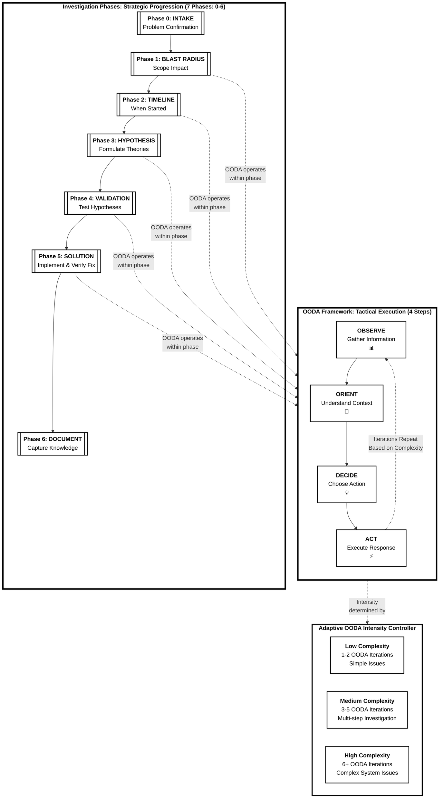
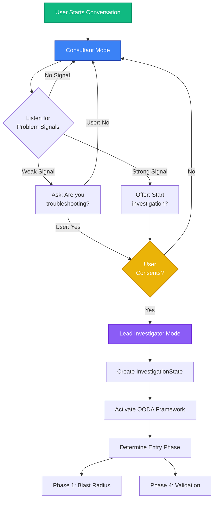
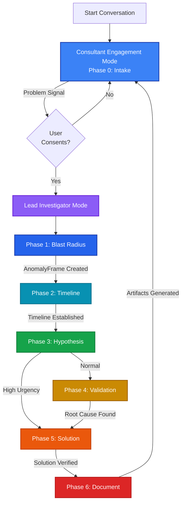

# Investigation Phases and OODA Integration Framework
## Process Framework Design & Integration Specification v2.1

**Document Type:** Process Framework Design
**Version:** 2.1
**Last Updated:** 2025-10-11
**Status:** ✅ **IMPLEMENTED** (v3.2.0)
**Foundation Document:** FaultMaven System Requirements Specification v2.0

## Implementation Status

**Implementation Date:** 2025-10-11
**Implementation Version:** v3.2.0
**Status:** Complete and integrated

**Implementation Summary:**
- ✅ All 7 investigation phases implemented (Intake through Document)
- ✅ OODA engine with adaptive intensity control
- ✅ Dual engagement modes (Consultant, Lead Investigator)
- ✅ 7 phase handlers with complete OODA cycle execution
- ✅ Hierarchical memory system with 64% token reduction
- ✅ Hypothesis manager with confidence decay
- ✅ PhaseOrchestrator for state management
- ✅ Integration with agent service and API layer
- ✅ 32 comprehensive tests (unit + integration)

**Implementation Files:**
- Models: `faultmaven/models/investigation.py`
- Core Framework: `faultmaven/core/investigation/*.py`
- Phase Handlers: `faultmaven/services/agentic/phase_handlers/*.py`
- Orchestration: `faultmaven/services/agentic/orchestration/*.py`
- Tests: `tests/core/investigation/`, `tests/integration/`


**Related Documents:**
- API Contract: [`openapi.locked.yaml`](../api/openapi.locked.yaml) - Authoritative API specification

---

## Document Scope and Authority

### What This Document Covers

This document specifies the **investigation process framework**:

**Investigation Phases** (Process Structure):
- 7 Investigation Phases (0-6) defining WHAT to focus on at each stage
- Phase transition rules and advancement triggers
- Engagement modes (Consultant vs Lead Investigator)
- Phase-based investigation entry points

**OODA Integration** (Tactical Execution):
- OODA Steps (Observe, Orient, Decide, Act) defining HOW to investigate
- OODA Step activation per investigation phase
- Adaptive iteration intensity (1-2 simple, 3-5 medium, 6+ complex)
- OODA-driven hypothesis testing and validation

**State Management** (Framework Architecture):
- InvestigationState hierarchy structure
- Hypothesis tracking and confidence management
- Memory compression (hot/warm/cold tiers)
- Anchoring prevention and bias detection

**Performance Optimization**:
- Token budget management (64% reduction)
- Memory compression strategies
- Redis storage optimization

### What This Document Does NOT Cover

**Evidence Collection Details** (see separate design):
- EvidenceRequest schemas and structures → [Evidence Collection Design](./evidence-collection-and-tracking-design.md)
- Evidence classification algorithms → Evidence Collection Design
- Evidence lifecycle states → Evidence Collection Design
- Investigation strategies (Active/Post-Mortem) → Evidence Collection Design
- Agent prompt templates → Evidence Collection Design

**Case Management** (see separate design):
- Case status state machine → [Case Lifecycle Management](./case-lifecycle-management.md)
- Case transition rules → Case Lifecycle Management

### Related Design Documents

- **[Evidence Collection and Tracking Design](./evidence-collection-and-tracking-design.md)** - Implements Evidence Layer of InvestigationState, defines data schemas and agent behaviors for evidence collection
- **[Case Lifecycle Management](./case-lifecycle-management.md)** - Defines case status states and transitions (orthogonal to investigation phases)

---

## Table of Contents

1. [Executive Summary](#executive-summary)
2. [Framework Architecture Overview](#framework-architecture-overview)
3. [Investigation Phase Model](#investigation-phase-model)
4. [Engagement Mode System](#engagement-mode-system)
5. [Phase-to-OODA Integration](#phase-to-ooda-integration)
6. [User Journey Scenarios](#user-journey-scenarios)
7. [State Management Architecture](#state-management-architecture)
8. [Data Structure Design](#data-structure-design)
9. [Performance & Optimization](#performance--optimization)
10. [Implementation Roadmap](#implementation-roadmap)

---

## Executive Summary

This document provides the **process framework design** for FaultMaven's investigation system, which integrates:

1. **Investigation Phases (Strategic)**: 7 phases (0-6) providing structural progression through incident resolution
2. **OODA Framework (Tactical)**: 4 steps (Observe, Orient, Decide, Act) providing adaptive investigation methodology within each phase

**Key Innovation**: The frameworks **complement rather than conflict**:
- **Investigation Phases determine WHAT** to focus on (problem framing, RCA, mitigation, documentation)
- **OODA Steps determine HOW** to investigate (which steps active, iteration intensity)

This design enables:
- Natural investigation flow matching human reasoning
- Flexible entry points based on incident context
- Engagement mode switching (Consultant vs Lead Investigator)
- Adaptive OODA iteration intensity per investigation phase
- Hierarchical state management preventing token explosion
- Evidence-driven hypothesis testing with anchoring prevention

**Foundation**: This framework design builds upon the requirements defined in **FaultMaven System Requirements Specification v2.0**.

---

## Framework Architecture Overview

### Investigation Phases and OODA Integration Framework



### Framework Relationship

The investigation system integrates two complementary frameworks:

**Investigation Phases (Strategic Progression)**:
- **What**: 7 phases (0-6) defining investigation focus per stage
- **Structure**: Linear progression through problem-solving stages
- **Purpose**: Determines investigation objectives and transitions
- **Indexing**: 0-indexed (Phase 0 = Intake through Phase 6 = Document)

**OODA Framework (Tactical Execution)**:
- **What**: 4 steps (Observe, Orient, Decide, Act) defining investigation method
- **Structure**: Iterative cycles within each investigation phase
- **Purpose**: Adaptive evidence gathering and hypothesis testing
- **Execution**: Variable iterations based on complexity (1-2 simple, 6+ complex)

**Key Principle**: 
- **Investigation Phases = WHAT** to focus on (problem framing, RCA, mitigation, documentation)
- **OODA Steps = HOW** to investigate (evidence gathering, analysis method)
- **OODA Iterations = HOW MUCH** investigation depth (adaptive intensity)

---

## Investigation Phase Model

### Complete Phase Definitions (Phases 0-6)

FaultMaven uses a **7-phase investigation framework** (0-indexed):

| Investigation Phase | OODA Steps Active | Intensity | Iterations | Primary Goal |
|-------------------|-------------------|-----------|-----------|--------------|
| **Phase 0: Intake** | None | N/A | 0 | Problem confirmation and consent |
| **Phase 1: Blast Radius** | Observe, Orient | Light | 1-2 | Scope impact assessment |
| **Phase 2: Timeline** | Observe, Orient | Light | 1-2 | When issue started/changed |
| **Phase 3: Hypothesis** | Observe, Orient, Decide | Medium | 2-3 | Formulate root cause theories |
| **Phase 4: Validation** | All 4 steps | Full | 3-6+ | Systematic hypothesis testing |
| **Phase 5: Solution** | Decide, Act, Orient | Medium | 2-4 | Apply fix and verify effectiveness |
| **Phase 6: Document** | Orient (synthesis) | Light | 1 | Generate artifacts and learnings |

**Phase Indexing**: All phases use **0-based indexing** (Phase 0 through Phase 6) consistently across all system components.

**Evidence Collection Scope**: Investigation Phases 0-5 involve active evidence collection and tracking. Phase 6 synthesizes findings into artifacts. See [Evidence Collection and Tracking Design](./evidence-collection-and-tracking-design.md) for evidence-related data models and behaviors.

### OODA Step Definitions

**Observe** 📊:
- Gather raw data and evidence
- Monitor system state and metrics
- Collect user reports and symptoms
- Document environmental context

**Orient** 🧭:
- Analyze collected information
- Identify patterns and anomalies
- Build mental model of situation
- Contextualize within system knowledge

**Decide** 💡:
- Generate hypotheses or action options
- Evaluate likelihood and risk
- Prioritize investigation paths
- Select next action

**Act** ⚡:
- Execute chosen action/test
- Apply mitigation or fix
- Validate hypothesis
- Collect results and feedback

### Adaptive Intensity Controller

The framework dynamically adjusts OODA cycle intensity based on:

**Complexity Factors**:
- Problem scope (single service vs multi-system)
- Symptom clarity (clear vs ambiguous)
- Evidence availability (rich vs sparse)
- Time pressure (emergency vs post-mortem)
- Hypothesis confidence (high vs low)

**Intensity Levels**:

1. **Low Complexity** (1-2 cycles):
   - Clear symptoms
   - Single component affected
   - Known issue patterns
   - Quick validation possible
   - Example: Service restart resolved crash

2. **Medium Complexity** (3-5 cycles):
   - Multiple components involved
   - Need pattern analysis
   - Several viable hypotheses
   - Multi-step testing required
   - Example: Performance degradation investigation

3. **High Complexity** (6+ cycles):
   - System-wide impact
   - Ambiguous symptoms
   - Complex interactions
   - Multiple failed hypotheses
   - Example: Cascading failure root cause

---

## Engagement Mode System

### Two Engagement Modes

FaultMaven operates in two distinct **engagement modes** based on investigation state:

**Terminology Note**: "Engagement Mode" (Consultant vs Lead Investigator) is distinct from "Investigation Strategy" (Active Incident vs Post-Mortem). See [Evidence Collection Design - Investigation Strategies](./evidence-collection-and-tracking-design.md#investigation-strategies) for strategy selection and behaviors.

#### 1. Consultant Mode (Default)

**Persona**: Expert colleague providing guidance  
**Active In**: Phase 0 (Intake) - No active investigation  
**Interaction Style**: Reactive, follows user lead  
**Primary Function**: Answer questions, explain concepts, detect problem signals

**Behavior**:
- Responds to technical questions
- Provides explanations with suggested actions
- Listens for problem signals (keywords, urgency indicators)
- Never assumes user has an incident
- Offers to transition to investigation mode when appropriate

**Example Interaction**:
```
User: "What causes database connection timeouts?"

Agent (Consultant): "Connection timeouts typically occur when:
1. Connection pool exhaustion (all connections in use)
2. Network latency between application and database
3. Long-running queries blocking new connections
4. Database server overloaded

Suggested Actions:
• Learn about connection pooling configuration
• Understand timeout troubleshooting
• [I'm experiencing timeouts now] ← Problem signal
```

#### 2. Lead Investigator Mode

**Persona**: War room lead driving incident resolution  
**Active In**: Phases 1-6 (Active investigation)  
**Interaction Style**: Proactive, guides methodology  
**Primary Function**: Execute OODA iterations, manage investigation state

**Behavior**:
- Generates evidence requests with acquisition guidance
- Tracks hypothesis lifecycle and confidence
- Detects cognitive biases (anchoring)
- Manages phase transitions
- Provides investigation status and progress
- Recommends escalation when needed

**Example Interaction**:
```
Agent (Lead Investigator): "🕵️ Testing Hypothesis #2

Hypothesis: Database connection pool exhausted
Likelihood: 85%

Evidence Request #3:
📊 Connection Pool Metrics

What I need:
Current connections vs max pool size

How to get it:
$ SHOW STATUS LIKE 'Threads_connected';
$ SHOW VARIABLES LIKE 'max_connections';

Expected: Threads_connected should be near max_connections
```

### Mode Transition Flow



### Problem Signal Detection

**Weak Signals** (Ask for confirmation):
- Keywords: "issue", "problem", "weird", "slow", "unusual"
- Uncertainty: "not sure if this is a problem"
- Passive voice: "something is happening"
- Questions about troubleshooting: "how do I debug...?"

**Strong Signals** (Offer mode switch immediately):
- Keywords: "down", "crash", "alert", "error", "failing", "broken", "outage"
- Urgency indicators: "production", "users affected", "emergency", "critical"
- File upload with logs/metrics
- Specific incident description with timeline
- SRE/oncall context: "I'm on call and..."

**Example Transitions**:

| User Input | Signal Type | Agent Response |
|------------|-------------|----------------|
| "What is Redis persistence?" | None | Stay in Consultant, answer question |
| "Our Redis seems slower than usual" | Weak | Ask: "Are you troubleshooting an issue?" |
| "Production Redis down! Connection timeouts" | Strong | Offer: "Start troubleshooting session?" |
| "Getting 500 errors, alerts firing!" | Strong | Immediately offer investigation mode |

---

## Phase-to-OODA Integration

### Phase 0: Intake (No OODA)

**Investigation Goal**: Problem confirmation and investigation consent  
**OODA Status**: Inactive  
**Engagement Mode**: Consultant  
**Behavior**: Pure Q&A, listen for problem signals, create ProblemConfirmation

```
User: "How does Kubernetes autoscaling work?"

Agent (Consultant Mode): [Explains concept with examples]

Suggested Actions:
• Learn about HPA configuration
• See example deployment YAML
• Ask about troubleshooting autoscaling issues
```

**State**: No investigation object created  
**Output**: ProblemConfirmation (if problem detected) - See [Evidence Collection Design](./evidence-collection-and-tracking-design.md#problemconfirmation)

**Phase Completion Trigger**: User consents to formal investigation

**Transition**: Advance to Phase 1 (Blast Radius), switch to Lead Investigator Mode

---

### Phase 1: Blast Radius

**Investigation Goal**: Scope impact assessment  
**OODA Steps Active**: Observe 📊, Orient 🧭  
**Intensity**: Light (1-2 iterations)  
**Entry Point**: User consented to investigation (from Phase 0)

**OODA Execution**:

**Iteration 1: Observe & Orient**

1. **Observe** 📊:
   - Agent asks structured questions:
     - What's broken? (symptom)
     - Who's affected? (scope)
     - How many affected? (blast radius)
     - How severe? (urgency)

2. **Orient** 🧭:
   - Agent creates `AnomalyFrame`:
     ```python
     AnomalyFrame(
         statement="API returning 500 errors",
         affected_components=["api-service"],
         affected_scope="EU region users",
         started_at="2025-10-08T14:03:00Z",
         severity="high",
         confidence=0.7  # Provisional
     )
     ```
   - Confirms understanding with user
   - Generates initial evidence requests (symptoms, scope)

**Phase Completion Trigger**: Blast radius defined and confirmed

**Transition**: Advance to Phase 2 (Timeline)

---

### Phase 2: Timeline

**Investigation Goal**: Establish temporal context - when issue started/changed  
**OODA Steps Active**: Observe 📊, Orient 🧭  
**Intensity**: Light (1-2 iterations)  
**Focus**: Timeline reconstruction and recent changes

**OODA Execution**:

**Iteration 1: Timeline Observation**

1. **Observe** 📊:
   - Request timeline evidence:
     - When did issue start? (timestamp)
     - When first noticed vs actually started?
     - Recent changes (deployments, config changes, traffic patterns)
     - Event sequence leading to issue

2. **Orient** 🧭:
   - Build timeline of events
   - Identify correlation between changes and symptoms
   - Assess temporal patterns
   - Update AnomalyFrame with timeline data

**Evidence Focus**: TIMELINE and CHANGES categories (see [Evidence Collection Design](./evidence-collection-and-tracking-design.md#evidencecategory))

**Phase Completion Trigger**: Timeline established

**Transition**: Advance to Phase 3 (Hypothesis)

---

### Phase 3: Hypothesis

**Investigation Goal**: Formulate root cause theories  
**OODA Steps Active**: Observe 📊, Orient 🧭, Decide 💡  
**Intensity**: Medium (2-3 iterations)  
**Focus**: Generate testable hypotheses

**OODA Execution**:

**Iteration 1: Hypothesis Formation**

1. **Observe** 📊:
   - Review all collected evidence (symptoms, scope, timeline)
   - Identify patterns and correlations
   - Note anomalies in system state

2. **Orient** 🧭:
   - Analyze evidence in context of system architecture
   - Identify causal relationships
   - Build mental model of failure modes

3. **Decide** 💡:
   - Generate initial hypotheses (2-4 theories)
   - Rank by likelihood based on evidence
   - Identify evidence needed to test each hypothesis

**Example Hypothesis Generation**:
```
Hypothesis #1 (85% likelihood): Database connection pool exhaustion
- Supporting: High connection count, timeout errors
- Missing: Pool size configuration

Hypothesis #2 (60% likelihood): Recent deployment introduced memory leak
- Supporting: Deployment 8 minutes before incident
- Missing: Memory profiling data

Hypothesis #3 (30% likelihood): Traffic spike overwhelmed capacity
- Supporting: N/A
- Refuting: Traffic logs show normal load
```

**Urgency Check**:
- If **HIGH/CRITICAL** urgency → May skip to Phase 5 (Solution - Mitigation)
- If **NORMAL** urgency → Continue to Phase 4 (Validation)

---

### Phase 4: Validation

**Investigation Goal**: Systematic hypothesis testing to find root cause  
**OODA Steps Active**: All 4 steps (full OODA iterations)  
**Intensity**: Full depth (3-6+ iterations expected)  
**Focus**: Evidence-driven hypothesis validation

**OODA Execution** (Full Methodology):

**Iteration 1**:

1. **Observe** 📊:
   - Request targeted evidence for top hypothesis
   - Monitor for new symptoms
   - Track environmental changes

2. **Orient** 🧭:
   - Analyze new evidence against hypothesis
   - Update confidence scores
   - Refine mental model

3. **Decide** 💡:
   - Choose hypothesis to test
   - Design validation experiment
   - Identify required evidence

4. **Act** ⚡:
   - Execute hypothesis test
   - Collect test results
   - Document findings

**Confidence Evaluation**:
- If confidence ≥ 70% → Root cause found, advance to Phase 5
- If confidence < 70% → Continue to Iteration 2

**Iteration 2** (if needed):
- Re-observe with refined focus
- Re-orient based on new findings
- Generate alternative hypotheses if anchoring detected
- Test next most likely theory

**Anchoring Prevention**:
- If testing same hypothesis category 4+ times → Force alternatives
- If no progress in 3 iterations → Trigger re-framing
- Confidence decay: Hypotheses lose confidence without validation

**Example Root Cause Conclusion**:
```
✅ Root Cause Found

Cause: Memory leak in user session caching feature
Confidence: 75% (Medium-High)

Supporting Evidence:
✓ OutOfMemoryError 8 min after deployment
✓ Memory usage 60% → 98% spike correlates with deployment
✓ Service restart cleared issue (supports memory theory)
✓ Code review found unclosed session cache entries

Missing Evidence:
✗ Heap dump during incident
✗ Memory profiler timeline

Alternative Explanations Refuted:
✗ Traffic spike (15% likely) - Normal traffic in logs
✗ Database issue (10% likely) - DB metrics normal

Caveats:
- 90% confidence achievable with heap dump
- Assuming no concurrent configuration changes
```

**Phase Completion**: Root cause identified with ≥70% confidence

**Transition**: Advance to Phase 5 (Solution)

---

### Phase 5: Solution

**Investigation Goal**: Implement solution, verify effectiveness, and restore service  
**OODA Steps Active**: Decide 💡, Act ⚡, Orient 🧭 (for verification)  
**Intensity**: Medium (2-4 iterations)  
**Focus**: Solution application and verification

**Note**: Phase 5 incorporates both solution implementation AND verification (combines former Resolve + Verify phases)

**OODA Execution**:

**Cycle 1: Solution Implementation**

1. **Decide** 💡:
   - Propose solution options:
     ```
     Option 1: Hot fix (patch memory leak) - 30 min
     Option 2: Rollback deployment - 5 min  
     Option 3: Increase heap memory - 10 min (workaround)
     ```
   - Evaluate risk/benefit for each
   - Recommend primary approach

2. **Act** ⚡:
   - User applies chosen solution
   - Monitor for resolution confirmation
   - Track metrics: error rate, memory usage, latency

**Iteration 2-4: Verification** (integrated within Phase 5)

1. **Act** ⚡:
   - Execute verification tests
   - Monitor system for stability period (15-30 min)
   - Check for side effects

2. **Orient** 🧭:
   - Analyze post-fix metrics
   - Confirm no regressions
   - Verify scope of fix

**Success Criteria**:
- ✅ Primary symptom resolved
- ✅ Error rate returns to baseline
- ✅ System metrics stabilize
- ✅ No new errors introduced
- ✅ User experience restored
- ✅ Monitoring alerts cleared

**If Solution Fails**:
- Try alternative option
- After 3 failures → Recommend escalation

**Phase Completion**: Solution applied and verified effective

**Transition**: Advance to Phase 6 (Document)

---

### Phase 6: Document

**Lifecycle Goal**: Capture learnings and generate artifacts  
**OODA Steps Active**: Orient 🧭 (synthesis mode)  
**Intensity**: Light (1 cycle)  
**Focus**: Knowledge capture

**OODA Execution**:

1. **Orient** 🧭 (Modified for documentation):
   - Synthesize investigation timeline
   - Extract key learnings
   - Identify improvement opportunities
   - Generate artifacts

**Artifact Options**:

**Option 1: Incident Report**
- Timeline of events
- Evidence collected
- Hypotheses tested
- Root cause conclusion
- Solution applied
- Prevention measures

**Option 2: Runbook** (if missing)
- Issue identification (symptoms)
- Diagnostic procedure
- Resolution steps
- Validation checklist

**Option 3: Post-Mortem** (for major incidents)
- Full incident report content
- Impact analysis
- Lessons learned
- Action items for improvement

**User Choice**: Generate artifacts or close case

**Status Update**: RESOLVED → CLOSED

---

## User Journey Scenarios

### Scenario 1: Quick Question (Phase 0 Only)

**Context**: User learning, no incident

```
User: "What causes database connection timeouts?"

Agent (Consultant Mode):
"Database connection timeouts typically occur when:
1. Connection pool exhaustion (all connections in use)
2. Network latency between app and database
3. Long-running queries blocking connections
4. Database server overloaded

Suggested Actions:
• Learn about connection pool configuration
• Understand timeout troubleshooting techniques
• [I'm experiencing timeouts now] ← Problem signal
```

**Flow**: Stays in Phase 0 (Intake), no investigation activated

---

### Scenario 2: Normal Investigation Flow

**Context**: User notices anomaly, unsure of severity

```
Phase 0 (Intake - Consultant Mode):
User: "CPU usage looks higher than normal, not sure why"

Agent: 🩺 "It sounds like you might be investigating an issue.
Would you like me to start a formal troubleshooting session?"

User: "Yes, let's investigate"

Phase 1 (Blast Radius - Mode Switch to Lead Investigator):
Agent: "🕵️ Investigation started.

Let's assess the scope and impact:
• What CPU % are you seeing vs normal baseline?
• When did you first notice the increase?
• Which services/servers are affected?"

User: "Seeing 70-80% vs normal 40%, started ~1 hour ago,
only production API servers"

Agent: "📋 AnomalyFrame Created:

🎯 Problem: Elevated CPU on production API servers
📊 Baseline: 40% → Current: 70-80%
⏰ Started: ~1 hour ago
⚠️ Severity: Medium
📍 Scope: Production API servers only

Phase 2 (Timeline):
Let's establish the timeline:

Evidence Request #1: Recent changes correlation
Check: Last deployment time, config changes in last 2 hours

Evidence Request #2: CPU timeline
$ sar -u 1 10  # CPU usage trend

Phase 3 (Hypothesis):
[Generate hypotheses based on evidence]

Phase 4 (Validation):
[Test hypotheses systematically]

[Investigation continues through phases]
```

---

### Scenario 3: Critical Incident (Phase Skipping)

**Context**: Production outage, emergency

```
Phase 0 → Phase 1 (Fast Entry):
User: "🚨 API down! Getting 500 errors, alerts firing!"

Agent: "🚨 CRITICAL INCIDENT DETECTED

Starting emergency troubleshooting.

Phase 1 (Blast Radius - Quick Assessment):
🎯 Problem: API service down (500 errors)
🔴 Impact: All API requests affected
⚠️ Severity: CRITICAL
📍 Scope: All API endpoints

Phase 5 (SKIP Phases 2-4, jump to Solution - Mitigation):
Let's stabilize first, diagnose later.

Mitigation Options (fastest first):
1. 🔄 Restart API service - 2 min
2. ↩️ Rollback last deployment - 5 min
3. 📈 Scale up replicas - 3 min

Which to try first?

Meanwhile, quick evidence:
📋 Get error logs: tail -100 /var/log/api.log
📊 Check recent changes: deployment history
"

User: "Restarting now..."
[2 minutes]
User: "Back up! Errors stopped"

Phase 6 (Document):
Agent: "✅ Service restored

Incident Summary:
Duration: 8 minutes
Fix: Service restart
Root Cause: Unknown (requires RCA)

Next Steps:
• [Schedule RCA] - Return to Phase 2-4 for thorough analysis
• [Close case] - Skip RCA
"
```

**Note**: Critical incidents allow **phase skipping** (Phase 0→1→5→6) for speed. Full investigation phases (2-4) can be executed later as post-mortem.

---

### Scenario 4: Post-Incident RCA

**Context**: Service restored, need analysis

```
Phase 0 (Intake):
User: "Had to rollback deployment yesterday. Need RCA"

Agent: "That's a post-incident root cause analysis.
Start RCA session?"

User: "Yes"

Phase 1-2 (Quick Framing):
Agent: "🕵️ Root Cause Analysis started.

Background:
• What was the symptom/failure?
• When did it occur?
• What triggered the rollback?

[Creates AnomalyFrame and timeline from incident]

Phase 4 (Validation - Direct entry for post-mortem, full OODA):
Agent: "Now let's find root cause systematically.

[Full OODA iterations with deep investigation]

Iteration 1: Observe → Orient → Decide → Act
[Test Hypothesis #1]

Iteration 2: Re-observe → Re-orient → Decide → Act
[Test Hypothesis #2]

Iteration 3: Evidence synthesis → Root cause identified
Confidence: 75%

Phase 5 (Solution):
Design permanent fix based on root cause
Apply fix if possible, or create action items

Phase 6 (Document):
Generate comprehensive post-mortem document with:
- Incident timeline
- Root cause analysis
- Lessons learned
- Prevention measures
```

**Note**: Post-incident RCA can skip or abbreviate Phases 1-3 since problem is already known, jumping directly to Phase 4 (Validation) for systematic root cause analysis.

---

## State Management Architecture

### Hierarchical State Structure

```python
InvestigationState (Root)
├── Metadata Layer
│   ├── investigation_id: str
│   ├── session_id: str
│   ├── user_id: str
│   ├── created_at: datetime
│   ├── last_updated: datetime
│   ├── current_turn: int
│   └── engagement_mode: Literal["consultant", "investigator"]
│
├── Lifecycle Layer
│   ├── current_phase: int  # 0-6 (Phase 0: Intake through Phase 6: Document)
│   ├── phase_name: str  # "intake", "blast_radius", "timeline", "hypothesis", "validation", "solution", "document"
│   ├── entry_phase: int  # Where investigation started (typically 0 or 1)
│   ├── case_status: CaseStatus  # See case-lifecycle-management.md
│   ├── urgency_level: UrgencyLevel
│   ├── investigation_strategy: Literal["active_incident", "post_mortem"]  # See evidence-collection-and-tracking-design.md
│   └── phase_history: List[PhaseTransition]
│
├── OODA Engine Layer
│   ├── ooda_active: bool
│   ├── current_step: OODAStep  # "observe", "orient", "decide", "act"
│   ├── current_iteration: int
│   ├── anomaly_frame: Optional[AnomalyFrame]  # Created in Phase 1 (Blast Radius)
│   ├── hypotheses: List[Hypothesis]
│   ├── tests_performed: List[HypothesisTest]
│   ├── iterations: List[OODAIteration]
│   ├── anchoring_detected: bool
│   ├── forced_alternatives_at_turn: List[int]
│   └── confidence_trajectory: List[float]
│
├── Evidence Layer  # SCHEMAS DEFINED IN evidence-collection-and-tracking-design.md
│   ├── evidence_requests: List[EvidenceRequest]  # See Evidence Collection Design for complete schema
│   ├── evidence_provided: List[EvidenceProvided]  # See Evidence Collection Design for complete schema
│   ├── evidence_coverage_score: float  # 0.0-1.0
│   ├── critical_evidence_blocked: List[str]
│   └── evidence_timeline: List[EvidenceEvent]
│
└── Memory Layer
    ├── hot_memory: HotMemory  # Last 2 iterations, full fidelity (~500 tokens)
    ├── warm_memory: WarmMemory  # Iterations 3-5, summarized (~300 tokens)
    ├── cold_memory: ColdMemory  # Older iterations, key facts only (~100 tokens)
    └── persistent_insights: List[str]  # Always accessible (~100 tokens)
```

**Layer Ownership**:
- **Metadata, Lifecycle, OODA Engine, Memory Layers**: Defined in this document
- **Evidence Layer**: Data models defined in [Evidence Collection and Tracking Design](./evidence-collection-and-tracking-design.md)
- **Case Status**: State machine defined in [Case Lifecycle Management](./case-lifecycle-management.md)

### Token Budget Management

**Problem**: Unmanaged state grows to 4,500+ tokens, causing:
- Context window overflow
- Slow processing
- High costs
- Poor LLM performance

**Solution**: Hierarchical memory with compression

```python
class HierarchicalMemory:
    """
    Token budget: ~1,600 tokens total (vs 4,500+ unmanaged)
    Compression: 64% reduction
    """
    
    # Hot Memory: Full fidelity (~500 tokens)
    hot_memory: List[OODAIteration] = []  # Last 2 iterations
    
    # Warm Memory: Summarized (~300 tokens)
    warm_snapshots: List[MemorySnapshot] = []  # Iterations 3-5
    
    # Cold Memory: Key facts (~100 tokens)
    cold_snapshots: List[MemorySnapshot] = []  # Older iterations
    
    # Persistent: Always accessible (~100 tokens)
    persistent_insights: List[str] = []
    
    def compress(self, current_turn: int):
        """Triggered every 3 turns"""
        if current_turn % 3 != 0:
            return
            
        # Keep last 2 iterations in hot memory (full detail)
        self.hot_memory = self.iterations[-2:]
        
        # Summarize iterations 3-5 for warm memory
        for iter in self.iterations[-5:-2]:
            snapshot = await self.llm_summarize(
                iteration=iter,
                max_tokens=100,
                focus="key_decisions_and_evidence_changes"
            )
            self.warm_snapshots.append(snapshot)
        
        # Extract key facts for cold memory
        for iter in self.iterations[:-5]:
            facts = self.extract_key_facts(iter)
            self.cold_snapshots.append(facts)
        
        # Prune to limits
        self.warm_snapshots = self.warm_snapshots[-3:]
        self.cold_snapshots = self.cold_snapshots[-5:]
```

### Evidence Overload Handling

**Problem**: Large log files (10MB+) contain 99% noise, 1% signal

**Solution**: Intelligent 3-stage extraction pipeline

```
Stage 1: Streaming Scan (Heuristic)
┌─────────────────────────────────────┐
│ • Read line-by-line                 │
│ • Filter by timestamp window        │
│ • Match error keywords              │
│ • Stop at 1000 relevant lines       │
│ Result: 10MB → ~100KB               │
└─────────────────────────────────────┘
                ↓
Stage 2: Semantic Filtering (Embedding)
┌─────────────────────────────────────┐
│ • Embed anomaly description         │
│ • Embed filtered chunks             │
│ • Cosine similarity > 0.6           │
│ • Keep top 50 most relevant         │
│ Result: ~100KB → ~50KB              │
└─────────────────────────────────────┘
                ↓
Stage 3: LLM Summarization (Pattern)
┌─────────────────────────────────────┐
│ • Extract error patterns            │
│ • Build event timeline              │
│ • Identify anomalies                │
│ • Structured summary                │
│ Result: ~50KB structured data       │
└─────────────────────────────────────┘
```

**Performance**: 10MB file processed in <5 seconds

---

## Data Structure Design

### Core State Objects

#### AnomalyFrame
```python
@dataclass
class AnomalyFrame:
    """Formal problem definition created in Phase 1 (Blast Radius) via OODA Orient step"""
    
    statement: str  # "API returning 500 errors"
    affected_components: List[str]  # ["api-service", "database"]
    affected_scope: str  # "EU region users"
    started_at: datetime
    severity: Literal["low", "medium", "high", "critical"]
    confidence: float  # 0.0-1.0, can be revised
    revision_count: int = 0
    framed_at_turn: int
    revised_at_turns: List[int] = field(default_factory=list)
```

**Relationship to ProblemConfirmation**:
- **ProblemConfirmation** (Phase 0): Informal problem triage, user consent gate
- **AnomalyFrame** (Phase 1): Formal structured problem definition for investigation

See [Evidence Collection Design - Problem Definition Stages](./evidence-collection-and-tracking-design.md#problem-definition-stages) for ProblemConfirmation schema.

#### Hypothesis
```python
@dataclass
class Hypothesis:
    """Theory about root cause, managed through OODA cycles"""
    
    hypothesis_id: str
    statement: str  # "Database connection pool exhausted"
    category: str  # "infrastructure", "code", "config", etc.
    
    # Confidence management
    likelihood: float  # Current confidence (0.0-1.0)
    initial_likelihood: float  # Original confidence
    confidence_trajectory: List[Tuple[int, float]]  # (turn, confidence)
    
    # Status tracking
    status: Literal["pending", "testing", "validated", "refuted", "retired"]
    created_at_turn: int
    last_updated_turn: int
    
    # Evidence linkage
    supporting_evidence: List[str]  # Evidence IDs
    refuting_evidence: List[str]
    
    # Anchoring prevention
    iterations_without_progress: int = 0
    last_progress_at_turn: Optional[int] = None
    retirement_reason: Optional[str] = None

    def apply_confidence_decay(self, current_turn: int) -> float:
        """Decay confidence if no progress"""
        turns_since_progress = current_turn - (self.last_progress_at_turn or self.created_at_turn)
        
        if turns_since_progress >= 2:
            decay_factor = 0.85 ** self.iterations_without_progress
            self.likelihood = self.initial_likelihood * decay_factor
            
            if self.likelihood < 0.3:
                self.status = "retired"
                self.retirement_reason = "Confidence decayed below threshold"
        
        return self.likelihood
```

#### EvidenceRequest

Evidence requests are generated during OODA **Observe** steps and tracked across iterations.

**Complete Schema**: See [Evidence Collection Design - EvidenceRequest](./evidence-collection-and-tracking-design.md#evidencerequest) for authoritative data model.

**Framework Usage (Key Fields)**:
```python
@dataclass
class EvidenceRequest:
    """Request for specific evidence - FULL SCHEMA in evidence-collection-and-tracking-design.md"""
    
    request_id: str
    label: str
    description: str
    category: EvidenceCategory  # 7 categories: SYMPTOMS, TIMELINE, CHANGES, CONFIGURATION, SCOPE, METRICS, ENVIRONMENT
    
    # Acquisition guidance (AcquisitionGuidance schema in Evidence Collection Design)
    guidance: AcquisitionGuidance
    
    # Lifecycle tracking
    status: EvidenceStatus  # 5 states: PENDING, PARTIAL, COMPLETE, BLOCKED, OBSOLETE
    created_at_turn: int
    completeness: float  # 0.0-1.0
    
    # OODA integration
    requested_by_ooda_step: OODAStep  # Which OODA step generated this
    for_hypothesis_id: Optional[str] = None  # Links evidence to hypothesis testing
    priority: int  # 1=critical, 2=important, 3=nice-to-have
```

**Key Concepts**:
- **Generation**: Created during OODA Observe step to gather specific data
- **Tracking**: Persists in InvestigationState.evidence_layer
- **Status Lifecycle**: Updated as user provides evidence (see Evidence Collection Design)
- **Hypothesis Linkage**: Evidence tests specific hypotheses in Phase 4 (Validation)
- **Complete Documentation**: Full schema, categories, and lifecycle in Evidence Collection Design

#### OODAIteration
```python
@dataclass
class OODAIteration:
    """One complete OODA cycle"""
    
    iteration_id: str
    iteration_number: int
    phase: int  # Which lifecycle phase
    
    # Timing
    started_at_turn: int
    completed_at_turn: Optional[int] = None
    duration_turns: int = 0
    
    # Steps executed
    steps_completed: List[OODAStep]
    steps_skipped: List[OODAStep] = field(default_factory=list)
    
    # State changes
    anomaly_refined: bool = False
    new_evidence_collected: int = 0
    hypotheses_generated: int = 0
    hypotheses_tested: int = 0
    hypotheses_retired: int = 0
    
    # Progress tracking
    confidence_delta: float = 0.0  # Change in max hypothesis confidence
    new_insights: List[str] = field(default_factory=list)
    made_progress: bool = False
    stall_reason: Optional[str] = None
```

### Anchoring Detection & Prevention

```python
class AnchoringDetector:
    """Detects and prevents cognitive bias"""
    
    def detect_anchoring(
        self,
        hypotheses: List[Hypothesis],
        iterations: List[OODAIteration]
    ) -> Optional[str]:
        """
        Returns warning if anchoring detected
        """
        
        # Pattern 1: Same category tested 4+ times
        category_counts = {}
        for hyp in hypotheses:
            if hyp.status in ["testing", "tested"]:
                category_counts[hyp.category] = category_counts.get(hyp.category, 0) + 1
        
        max_category_count = max(category_counts.values()) if category_counts else 0
        if max_category_count >= 4:
            dominant = max(category_counts, key=category_counts.get)
            return f"Tested '{dominant}' hypotheses 4 times without resolution"
        
        # Pattern 2: No progress in last 3 iterations
        recent = iterations[-3:] if len(iterations) >= 3 else iterations
        if recent and all(not iter.made_progress for iter in recent):
            return "No progress in last 3 OODA iterations"
        
        # Pattern 3: High-confidence hypothesis failing repeatedly
        for hyp in hypotheses:
            if hyp.initial_likelihood > 0.8 and hyp.iterations_without_progress >= 3:
                return f"High-confidence hypothesis '{hyp.statement}' failing repeatedly"
        
        return None
    
    def force_alternatives(
        self,
        tested_categories: List[str]
    ) -> List[str]:
        """Generate hypotheses from different categories"""
        
        all_categories = [
            "infrastructure", "code", "configuration",
            "external_dependency", "client_side", "data",
            "network", "security", "resource_exhaustion"
        ]
        
        # Exclude heavily tested categories
        available = [cat for cat in all_categories if cat not in tested_categories]
        
        # Prioritize categories not yet tested
        return available[:3]  # Force top 3 untested categories
```

---

## Performance & Optimization

### Token Budget Allocation

| Component | Budget | Strategy |
|-----------|--------|----------|
| Hot Memory | 500 tokens | Full fidelity, last 2 iterations |
| Warm Memory | 300 tokens | LLM-summarized, iterations 3-5 |
| Cold Memory | 100 tokens | Key facts, older iterations |
| Persistent Insights | 100 tokens | Always accessible learnings |
| Evidence Requests | 300 tokens | Active requests only |
| Active Hypotheses | 200 tokens | Testing + pending statuses |
| Metadata | 100 tokens | IDs, timestamps, flags |
| **Total** | **~1,600 tokens** | vs 4,500+ unmanaged (64% reduction) |

### Redis Storage Strategy

```python
# Hot state: Fast access
redis_key = f"investigation:{inv_id}:hot"
redis.setex(
    redis_key,
    ttl=3600,  # 1 hour
    value={
        "current_phase": 4,
        "ooda_step": "test",
        "active_hypotheses": [...],  # IDs only
        "pending_evidence": [...]
    }
)

# Full state: PostgreSQL for durability
db.execute(
    "UPDATE investigations SET state = %s WHERE id = %s",
    (full_state.json(), inv_id)
)

# Memory tiers: Redis with graduated TTL
redis.set(f"investigation:{inv_id}:hot", hot_memory, ex=3600)    # 1 hour
redis.set(f"investigation:{inv_id}:warm", warm_memory, ex=7200)  # 2 hours
redis.set(f"investigation:{inv_id}:cold", cold_memory, ex=86400) # 24 hours
```

### Performance Benchmarks

**20-Iteration Investigation**:

| Metric | Unmanaged | Hierarchical | Improvement |
|--------|-----------|--------------|-------------|
| Total Tokens | 4,500 | 1,600 | 64% ↓ |
| Redis Memory | 2.8 MB | 1.0 MB | 64% ↓ |
| LLM Cost/Turn | $0.045 | $0.016 | 64% ↓ |
| Processing Time | 3.2s | 1.8s | 44% ↓ |
| Context Window | 78% full | 32% full | 59% ↓ |

---

## Implementation Roadmap

### Phase 1: Core Structures (Weeks 1-2)

**Deliverables**:
- [ ] `InvestigationState` unified model with all layers
- [ ] `OODAEngineState` with iteration tracking
- [ ] `Hypothesis` with confidence decay algorithm
- [ ] Phase-to-OODA mapping configuration
- [ ] Mode transition logic (Consultant ↔ Lead Investigator)
- [ ] Problem signal detection system

**Validation**: Track investigation from Phase 1 → Phase 7

---

### Phase 2: Memory System (Week 3)

**Deliverables**:
- [ ] `HierarchicalMemory` implementation
- [ ] Token budget manager with auto-compression
- [ ] LLM-powered warm memory summarization
- [ ] Cold memory key fact extraction
- [ ] Compression trigger (every 3 turns)
- [ ] Redis storage strategy

**Validation**: 20-iteration investigation under 1,600 tokens

---

### Phase 3: Intelligence Features (Week 4)

**Deliverables**:
- [ ] Anchoring detection system
- [ ] Confidence decay algorithm
- [ ] Forced alternative hypothesis generation
- [ ] Evidence-hypothesis linkage
- [ ] Refutation confirmation workflow
- [ ] Progress tracking and stall detection

**Validation**: Agent escapes wrong hypothesis within 4 iterations

---

### Phase 4: Evidence System (Week 5)

**Deliverables**:
- [ ] Evidence request generation with OODA context
- [ ] Evidence classification engine
- [ ] 3-stage extraction pipeline for large files
- [ ] Command safety validation
- [ ] Blocked evidence alternative paths
- [ ] Evidence completeness tracking

**Validation**: 10MB log file processed in <5 seconds

---

### Phase 5: API & UI Integration (Week 6)

**Deliverables**:
- [ ] Enhanced `ViewState` with OODA progress
- [ ] Navigation breadcrumb system
- [ ] Phase-OODA progress indicators
- [ ] Real-time investigation status
- [ ] Mode transition UI feedback
- [ ] Evidence request UI components

**Validation**: Frontend displays dual-loop progress clearly

---

### Phase 6: Testing & Refinement (Weeks 7-8)

**Deliverables**:
- [ ] End-to-end scenario testing (all 4 journey types)
- [ ] Performance benchmarking
- [ ] Memory leak detection
- [ ] Error recovery testing
- [ ] User acceptance testing
- [ ] Documentation and training materials

**Validation**: System handles all scenarios without state explosion

---

## Appendices

### A. OODA Step Activation Matrix

```
┌──────────────────────────┬─────────┬─────────┬─────────┬─────────┐
│ Investigation Phase      │ Observe │ Orient  │ Decide  │   Act   │
├──────────────────────────┼─────────┼─────────┼─────────┼─────────┤
│ Phase 0: Intake          │    ❌   │    ❌   │    ❌   │    ❌   │
│ Phase 1: Blast Radius    │    ✅   │    ✅   │    ❌   │    ❌   │
│ Phase 2: Timeline        │    ✅   │    ✅   │    ❌   │    ❌   │
│ Phase 3: Hypothesis      │    ✅   │    ✅   │    ✅   │    ⚠️   │
│ Phase 4: Validation      │    ✅   │    ✅   │    ✅   │    ✅   │
│ Phase 5: Solution        │    ⚠️   │    ✅   │    ✅   │    ✅   │
│ Phase 6: Document        │    ❌   │    ✅*  │    ❌   │    ❌   │
└──────────────────────────┴─────────┴─────────┴─────────┴─────────┘

Legend:
✅ = Primary use (full execution in OODA iterations)
⚠️ = Light use (abbreviated, not all iterations)
❌ = Not used
✅* = Modified (synthesis mode for artifact generation, not investigation)
```

### B. State Transition Diagram



### C. Agent Response Format (v3.2.0)

```json
{
  "schema_version": "3.2.0",
  "content": "Testing connection pool hypothesis...",
  "response_type": "ANSWER",
  "session_id": "sess-abc123",
  
  "view_state": {
    "case_id": "case-xyz789",
    "engagement_mode": "investigator",
    "investigation_strategy": "post_mortem",
    
    "lifecycle_progress": {
      "current_phase": 4,
      "phase_name": "validation",
      "entry_phase": 1,
      "phase_complete": false
    },
    
    "ooda_progress": {
      "is_active": true,
      "current_step": "act",
      "current_iteration": 2,
      "steps_completed": ["observe", "orient", "decide", "act"],
      "hypotheses_active": 2,
      "hypotheses_retired": 1,
      "tests_performed": 3,
      "confidence_current": 0.65,
      "made_progress_last_iteration": true
    },
    
    "evidence_status": {
      "requests_pending": 2,
      "requests_complete": 5,
      "requests_blocked": 1,
      "coverage_score": 0.72
    },
    
    "navigation": {
      "breadcrumb": [
        {"action": "Framed anomaly (Phase 1)", "turn": 2},
        {"action": "Established timeline (Phase 2)", "turn": 4},
        {"action": "Generated 3 hypotheses (Phase 3)", "turn": 6},
        {"action": "Testing hypothesis #2 (Phase 4)", "turn": 8}
      ],
      "next_action_hint": "If hypothesis fails, test alternative or regenerate"
    }
  },
  
  "evidence_requests": [...],
  "sources": [...]
}
```

**Field Updates**:
- `engagement_mode`: "consultant" | "investigator" (replaces old "agent_mode")
- `investigation_strategy`: "active_incident" | "post_mortem" (replaces old "investigation_mode")
- `current_phase`: 0-6 (0-indexed phases)
- `phase_name`: "intake" | "blast_radius" | "timeline" | "hypothesis" | "validation" | "solution" | "document"

---

**END OF DOCUMENT**

**Document Status**: Implementation Design Specification  
**Foundation**: FaultMaven System Requirements v2.0 - OODA Framework  
**Next Steps**: Begin Phase 1 implementation (Core Structures)  
**Review Cycle**: Weekly during implementation  
**Stakeholders**: Engineering team, Product, SRE users