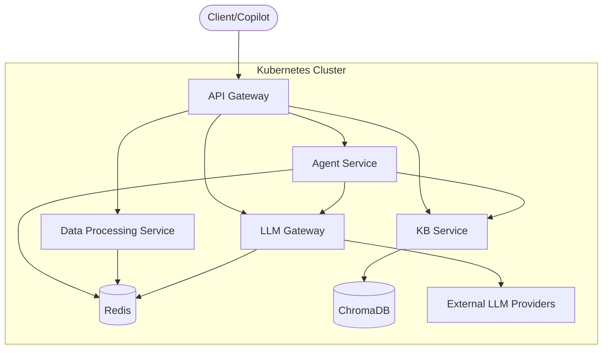

# FaultMaven Architectural Vision

This document outlines the target cloud-native microservice architecture for the FaultMaven platform. This architecture guides the modular design of the system, enabling scalability, resilience, and independent development.

## Guiding Principles

  * **Independent Scaling**: Each service is designed to be scaled independently based on its specific load profile (e.g., CPU-intensive data processing vs. memory-intensive agent workloads).
  * **Resilience by Design**: The architecture isolates failures. An issue in a non-critical service (like knowledge base ingestion) will not impact the core troubleshooting capabilities.
  * **Privacy & Security**: A "zero-trust" approach is assumed, where services only have access to what they need. A central `LLM Gateway` ensures all outbound data is sanitized.

## Target Architecture Overview

## Core Services

#### 1\. API Gateway

The single entry point for all client requests.

  * **Key Responsibilities**: Request routing, authentication, rate limiting, and request validation.
  * **Technology**: FastAPI.

#### 2\. Agent Service

The stateful "brain" of the application that orchestrates diagnostic workflows.

  * **Key Responsibilities**: Manages the reasoning loop via a LangGraph state machine, executes the SRE troubleshooting doctrine, and coordinates tool use.
  * **Technology**: LangGraph, LangChain Tools.

#### 3\. Data Processing Service

A stateless service that handles the ingestion and analysis of user-submitted evidence.

  * **Key Responsibilities**: Classifies incoming data, extracts insights from logs and metrics, and queues documents for knowledge base ingestion.
  * **Technology**: Pandas, Scikit-learn, PyOD.

#### 4\. LLM Gateway

A unified, secure interface to all external language model providers.

  * **Key Responsibilities**: Abstracts away provider-specific logic, routes requests to the best model (e.g., primary, fallback), handles semantic caching, and enforces PII redaction.
  * **Technology**: Tenacity (for retries), Presidio.

#### 5\. Knowledge Base Service

Manages all Retrieval-Augmented Generation (RAG) operations.

  * **Key Responsibilities**: Provides a query interface for the Agent Service and manages an asynchronous pipeline for ingesting, chunking, and embedding new documents.
  * **Technology**: ChromaDB, Sentence-Transformers.

## Key Design Patterns

  * **State Management**: To enable horizontal scaling, application services like the Agent are **stateless**. All session state is externalized and managed in a shared **Redis** instance, which acts as the single source of truth for conversational context.
  * **Inter-Service Communication**: The architecture uses a mix of communication patterns.
      * **Synchronous REST/HTTP**: Used for immediate request/response interactions between the API Gateway and other services.
      * **Asynchronous Messaging**: A message queue (e.g., Redis Streams) is used to decouple long-running tasks like document ingestion, ensuring the API remains responsive.
  * **Security**: A **zero-trust** network is enforced via Kubernetes Network Policies, ensuring services can only communicate with explicitly authorized peers.

## Implementation Note

This architecture represents our target state that currently guides the modular design of the monolithic application. We're incrementally evolving toward this structure using the **Strangler Fig pattern** while maintaining stability and deployment flexibility.