# FaultMaven System Architecture v2.0

## Overview

FaultMaven implements a sophisticated clean architecture pattern with dependency injection, interface-based design, and comprehensive observability. The system features a modern v3.1.0 schema-driven API that provides intent-driven responses, evidence-based troubleshooting, and structured state management. Designed as a privacy-first, AI-powered troubleshooting assistant that scales horizontally and integrates seamlessly with existing DevOps toolchains.

**Key Architectural Principles:**
- **7-Component Agentic Framework**: Modern AI agent architecture with Plan→Execute→Observe→Re-plan cycles
- **Adaptive Dual-Loop Troubleshooting Framework**: 7-phase strategic lifecycle with OODA tactical execution
- **Interface-Based Dependencies**: Clean architecture with dependency injection and interface compliance
- **Multi-Dimensional Query Processing**: Intent, complexity, domain, and urgency classification
- **Persistent State Management**: Redis-backed conversation memory with execution planning
- **Comprehensive Security**: PII protection, guardrails, and policy enforcement
- **Enterprise-Grade Reliability**: Circuit breakers, error handling, and fallback strategies
- **Typed Context System**: Strongly-typed QueryContext for type safety and validation
- **Accurate Token Estimation**: Provider-specific tokenizers for cost optimization
- **Centralized Configuration**: Unified settings management with environment-based overrides

## Architecture Diagram


## Recent Infrastructure Enhancements (2025-10-09)

### 1. Adaptive Dual-Loop Troubleshooting Framework

**Status**: ✅ DESIGNED (Implementation roadmap defined)

FaultMaven now implements a **dual-framework architecture** that combines strategic lifecycle progression with tactical OODA execution:

**Framework Components**:

1. **Outer Loop (Strategic - 7 Lifecycle Phases)**:
   - Phase 1: **Intake** - Initial triage and problem detection
   - Phase 2: **Detect** - Identify and scope the problem
   - Phase 3: **Engage** - Gather context and initial evidence
   - Phase 4: **Diagnose** - Root cause analysis with deep investigation
   - Phase 5: **Resolve** - Implement solution and restore service
   - Phase 6: **Verify** - Confirm resolution effectiveness
   - Phase 7: **Document** - Capture learnings and generate artifacts

2. **Inner Loop (Tactical - OODA Cycles)**:
   - **Observe** 📊: Gather information and evidence
   - **Orient** 🧭: Understand context and patterns
   - **Decide** 💡: Choose action or hypothesis
   - **Act** ⚡: Execute and collect results

3. **Adaptive Intensity Controller**:
   - **Low Complexity**: 1-2 OODA cycles (simple issues)
   - **Medium Complexity**: 3-5 OODA cycles (multi-step investigation)
   - **High Complexity**: 6+ OODA cycles (complex system issues)

**Key Innovation**: 
- **Lifecycle determines WHAT** to focus on (mitigation vs RCA vs documentation)
- **OODA determines HOW** to investigate (fast vs thorough, which steps active)

**Benefits**:
- Natural investigation flow matching human reasoning
- Flexible entry points based on incident context
- Mode-based interaction (Consultant vs Lead Investigator)
- Adaptive OODA usage per lifecycle phase
- Hierarchical state management preventing token explosion

**Visual Representation**:

```mermaid
graph TB
    subgraph OUTER["Outer Loop: Strategic Lifecycle (7 Phases)"]
        direction LR
        P1[["1. INTAKE<br/>Initial Triage"]]
        P2[["2. DETECT<br/>Identify Problem"]]
        P3[["3. ENGAGE<br/>Understand Context"]]
        P4[["4. DIAGNOSE<br/>Analyze Root Cause"]]
        P5[["5. RESOLVE<br/>Implement Solution"]]
        P6[["6. VERIFY<br/>Confirm Resolution"]]
        P7[["7. DOCUMENT<br/>Capture Knowledge"]]
        
        P1 --> P2 --> P3 --> P4 --> P5 --> P6 --> P7
    end
    
    subgraph INNER["Inner Loop: Tactical OODA Cycles"]
        direction TB
        O["OBSERVE<br/>Gather Info 📊"]
        R["ORIENT<br/>Context 🧭"]
        D["DECIDE<br/>Action 💡"]
        A["ACT<br/>Execute ⚡"]
        
        O --> R --> D --> A
        A -.->|Cycle Repeats| O
    end
    
    subgraph ADAPTIVE["Adaptive Intensity Controller"]
        LOW["Low: 1-2 cycles"]
        MED["Medium: 3-5 cycles"]
        HIGH["High: 6+ cycles"]
    end
    
    P2 -.->|OODA within phase| INNER
    P3 -.->|OODA within phase| INNER
    P4 -.->|OODA within phase| INNER
    P5 -.->|OODA within phase| INNER
    P6 -.->|OODA within phase| INNER
    
    INNER -.->|Intensity| ADAPTIVE
    
    style OUTER fill:#1e3a8a,stroke:#3b82f6,stroke-width:4px,color:#fff
    style INNER fill:#6b21a8,stroke:#a855f7,stroke-width:4px,color:#fff
    style ADAPTIVE fill:#064e3b,stroke:#10b981,stroke-width:3px,color:#fff
```


**Documentation**: 
- Foundation: [`FaultMaven System Requirements v2.0 - OODA Framework`](../requirements/SYSTEM_REQUIREMENTS_V2.md)
- Implementation: [`FaultMaven Adaptive Dual-Loop Framework - Implementation Design v2.0`](./ADAPTIVE_DUAL_LOOP_FRAMEWORK.md)

### 2. Two-Mode Conversational Architecture

**Status**: ✅ DESIGNED (Part of Dual-Loop Framework)

FaultMaven operates in two distinct modes based on investigation state:

**Consultant Mode (Default)**:
- **Active in**: Phase 1 (Intake)
- **Persona**: Expert colleague providing guidance
- **Interaction**: Reactive, follows user lead
- **Behavior**: Answer questions, detect problem signals, offer mode transition
- **OODA Status**: Inactive

**Lead Investigator Mode**:
- **Active in**: Phases 2-7 (Investigation)
- **Persona**: War room lead driving resolution
- **Interaction**: Proactive, guides methodology
- **Behavior**: Execute OODA cycles, manage hypotheses, track evidence, recommend escalation
- **OODA Status**: Active with phase-appropriate intensity

**Mode Transition Flow**:
```
User Query → Consultant Mode
    ↓
Problem Signal Detected?
    ↓ (Yes)
Ask/Offer Investigation Mode
    ↓
User Consents?
    ↓ (Yes)
Lead Investigator Mode
    ↓
Create Case → Activate OODA → Determine Entry Phase
```

**Problem Signal Detection**:
- **Weak Signals**: Keywords like "issue", "problem", "weird" → Ask for confirmation
- **Strong Signals**: Keywords like "down", "crash", "error", urgency indicators → Offer immediately

### 3. Typed Context System

**Status**: ✅ IMPLEMENTED

FaultMaven now uses a strongly-typed `QueryContext` model instead of loose dictionaries for passing context between components.

**Benefits**:
- **Type Safety**: IDE autocomplete and static type checking
- **Validation**: Pydantic automatically validates data structure
- **Clearer Intent**: Explicit fields document what context is needed
- **Better Errors**: Invalid context caught at creation time, not runtime

**Usage**:
```python
from faultmaven.models.agentic import QueryContext

context = QueryContext(
    session_id="abc-123",
    case_id="case-456",
    conversation_history="User: Hello\nAssistant: Hi there",
    same_provider_for_response=True
)

classification = await engine.classify_query(query, context)
```

**Developer Documentation**: [Context Management Guide](../development/CONTEXT_MANAGEMENT.md)

### 4. Accurate Token Estimation

**Status**: ✅ IMPLEMENTED

Provider-specific tokenizers replace character-based estimation (±20% error) with exact token counts.

**Supported Providers**:
- **OpenAI**: tiktoken with cl100k_base encoding
- **Anthropic**: Official Anthropic tokenizer
- **Fireworks**: tiktoken (most models are OpenAI-compatible)
- **Fallback**: Character-based for unsupported providers

**Usage**:
```python
from faultmaven.utils.token_estimation import estimate_tokens, estimate_prompt_tokens

# Single text
tokens = estimate_tokens(text, provider="fireworks", model="llama-v3p1-405b-instruct")

# Complete prompt breakdown
breakdown = estimate_prompt_tokens(
    system_prompt=system,
    user_message=query,
    conversation_history=history,
    provider="fireworks"
)
# Returns: {"system": 210, "user": 15, "history": 340, "total": 565}
```

**Impact**:
- **Cost Optimization**: Accurate token tracking prevents overages
- **Context Management**: Stay within model context limits
- **Performance Monitoring**: Track token usage patterns by response type and complexity

**Developer Documentation**: [Token Estimation Guide](../development/TOKEN_ESTIMATION.md)

### 5. Centralized Configuration

**Status**: ✅ IMPLEMENTED

All conversation and classification thresholds centralized in `ConversationThresholds` configuration class.

**Configurable Thresholds**:
```bash
# Conversation limits
MAX_CLARIFICATIONS=3
MAX_CONVERSATION_TURNS=20
MAX_CONVERSATION_TOKENS=4000

# Token budgets
CONTEXT_TOKEN_BUDGET=4000
SYSTEM_PROMPT_MAX_TOKENS=500
PATTERN_TEMPLATE_MAX_TOKENS=300

# Classification thresholds
PATTERN_CONFIDENCE_THRESHOLD=0.7
CONFIDENCE_OVERRIDE_THRESHOLD=0.4
SELF_CORRECTION_MIN_CONFIDENCE=0.4
SELF_CORRECTION_MAX_CONFIDENCE=0.7
```

**Benefits**:
- **Single Source of Truth**: No hardcoded magic numbers
- **Environment-Based**: Different values per environment (dev/staging/prod)
- **Runtime Adjustable**: Change thresholds without code changes
- **Consistent Behavior**: Same thresholds used across all components

**Usage**:
```python
from faultmaven.config.settings import get_settings

settings = get_settings()

# Access thresholds
if clarifications >= settings.thresholds.max_clarifications:
    return escalate()

if confidence < settings.thresholds.pattern_confidence_threshold:
    use_llm_classification()
```

### 6. Enhanced Prompt Validation

**Status**: ✅ IMPLEMENTED

Prompt assembly now includes input validation to catch errors early.

**Validations**:
- Base system prompt cannot be empty
- Response type must be ResponseType enum
- Warning if prompt exceeds 2000 chars (~500 tokens)

**Example Error**:
```python
# This will raise ValueError
assemble_intelligent_prompt(
    base_system_prompt="",  # Invalid!
    response_type=ResponseType.ANSWER
)
# ValueError: base_system_prompt cannot be empty
```

### 7. Improved Documentation

**Status**: ✅ IMPLEMENTED

Standardized docstrings across all prompts modules with consistent format:
- Summary line
- Args with types
- Returns with structure
- Examples showing actual usage
- Deprecation warnings where applicable

**Example**:
```python
def get_tiered_prompt(response_type: str = "ANSWER", complexity: str = "simple") -> str:
    """Get optimized system prompt based on response type and complexity

    Implements tiered prompt loading for token efficiency (81% reduction):
    - ANSWER/INFO responses: Minimal prompt (30 tokens)
    - Simple troubleshooting: Brief prompt (90 tokens)
    - Moderate/Complex troubleshooting: Standard prompt (210 tokens)

    Args:
        response_type: ResponseType value (ANSWER, PLAN_PROPOSAL, etc.)
        complexity: Query complexity (simple, moderate, complex)

    Returns:
        Optimized system prompt string

    Examples:
        >>> get_tiered_prompt("ANSWER", "simple")
        'You are FaultMaven, an expert SRE...'  # 30 tokens
    """
```

## Layer Responsibilities

### API Layer
**Purpose**: Handle HTTP requests and responses with comprehensive middleware processing

**Components**:
- **CORS Middleware**: Cross-origin resource sharing for browser extension compatibility
- **Logging Middleware**: Unified request/response logging with correlation IDs and context extraction
- **Performance Middleware**: Real-time performance tracking and metrics collection
- **Opik Tracing**: LLM operation tracing and observability
- **FastAPI Routers**: RESTful endpoint handlers with OpenAPI documentation
- **Dependencies**: Dependency injection and request context management

**Key Files**:
- `faultmaven/api/v1/routes/` - Endpoint implementations
- `faultmaven/api/middleware/` - Middleware implementations
- `faultmaven/api/v1/dependencies.py` - DI configuration

**Advanced Features**:
- **Context-Aware Logging**: Automatic extraction of session_id and conversation context
- **Performance Profiling**: Detailed timing analysis for optimization
- **Request Correlation**: End-to-end request tracking across all layers

### Service Layer  
**Purpose**: Business logic orchestration and transaction management

**Components**:
- **Agent Service**: AI reasoning workflow orchestration with agentic framework and dual-loop integration
- **Data Service**: File upload and data processing coordination
- **Knowledge Service**: Document ingestion and retrieval management
- **Session Service**: Multi-session per user state management with client-based session resumption

**Key Files**:
- `faultmaven/services/agent.py` - AI agent orchestration with dual-loop framework
- `faultmaven/services/data.py` - Data processing workflows
- `faultmaven/services/knowledge.py` - Knowledge base operations
- `faultmaven/services/session.py` - Session lifecycle management

### Agentic Framework
**Purpose**: Modern 7-component AI agent architecture implementing Plan→Execute→Observe→Re-plan cycles

**Components**:
- **Business Logic & Workflow Engine**: Main orchestrator managing all agentic components and dual-loop execution
- **State & Session Manager**: Persistent memory backbone with execution planning and OODA state tracking
- **Query Classification Engine**: Multi-dimensional query analysis (intent, complexity, domain, urgency)
- **Tool & Skill Broker**: Dynamic capability discovery and orchestration
- **Guardrails & Policy Layer**: Multi-layer security validation and PII protection
- **Response Synthesizer**: Multi-source response assembly with quality validation
- **Error Handling & Fallback Manager**: Comprehensive error recovery with circuit breakers

**Key Files**:
- `faultmaven/services/agentic/workflow_engine.py` - Main orchestrator with dual-loop integration
- `faultmaven/services/agentic/state_manager.py` - Memory and OODA state management
- `faultmaven/services/agentic/classification_engine.py` - Query processing
- `faultmaven/services/agentic/tool_broker.py` - Tool orchestration
- `faultmaven/services/agentic/guardrails_layer.py` - Security and validation
- `faultmaven/services/agentic/response_synthesizer.py` - Response assembly
- `faultmaven/services/agentic/error_manager.py` - Error handling
- `faultmaven/models/agentic.py` - Core interfaces and models

**Design Patterns**:
- Interface-based dependency injection
- Transaction boundary management
- Error context propagation
- Async/await throughout
- Memory-aware processing
- Planning-driven execution
- Dual-loop framework integration

### Adaptive Dual-Loop Framework
**Purpose**: Strategic lifecycle progression with tactical OODA execution

**Framework Components**:

1. **7-Phase Lifecycle (Outer Loop - Strategic)**:
   - Provides high-level structure for incident progression
   - Determines investigation focus (mitigation, RCA, documentation)
   - Linear progression with explicit phase transitions
   - Maps to incident management best practices

2. **OODA Cycles (Inner Loop - Tactical)**:
   - Provides adaptive investigation methodology
   - Executes within each lifecycle phase
   - Iterative cycles based on case complexity
   - Enables dynamic problem-solving and hypothesis testing

3. **Adaptive Intensity Controller**:
   - Dynamically adjusts OODA cycle intensity
   - Based on complexity factors (scope, clarity, evidence, urgency)
   - Scales from 1-2 cycles (simple) to 6+ cycles (complex)

**Phase-to-OODA Integration**:

| Phase | OODA Steps Active | Intensity | Goal |
|-------|-------------------|-----------|------|
| 1. Intake | None | N/A | Initial triage |
| 2. Detect | Observe, Orient | Light | Scope problem |
| 3. Engage | Observe, Orient, Decide | Medium | Gather context |
| 4. Diagnose | All 4 steps | Full | Deep RCA |
| 5. Resolve | Decide, Act | Fast | Implement fix |
| 6. Verify | Act, Orient | Medium | Confirm resolution |
| 7. Document | Orient (synthesis) | Light | Capture learnings |

**Key Files**:
- `faultmaven/services/agentic/workflow_engine.py` - Lifecycle orchestration
- `faultmaven/services/agentic/state_manager.py` - OODA state tracking
- `faultmaven/models/agentic.py` - Dual-loop interfaces

**State Management**:
```python
class InvestigationState:
    # Lifecycle Layer
    current_phase: int  # 1-7
    phase_name: str
    entry_phase: int
    
    # OODA Engine Layer
    ooda_active: bool
    current_step: OODAStep
    current_iteration: int
    anomaly_frame: Optional[AnomalyFrame]
    hypotheses: List[Hypothesis]
    
    # Memory Layer (Hierarchical)
    hot_memory: HotMemory    # Last 2 iterations
    warm_memory: WarmMemory  # Iterations 3-5, summarized
    cold_memory: ColdMemory  # Older, key facts only
```

**Documentation**:
- [`FaultMaven System Requirements v2.0 - OODA Framework`](../requirements/SYSTEM_REQUIREMENTS_V2.md)
- [`Adaptive Dual-Loop Framework - Implementation Design v2.0`](./ADAPTIVE_DUAL_LOOP_FRAMEWORK.md)

### Core Domain
**Purpose**: Core business logic and domain models

**Components**:
- **AI Agent Core**: Multi-phase troubleshooting reasoning engine integrated with dual-loop framework
- **Data Processing**: Log analysis and insight extraction
- **Knowledge Base**: RAG-enabled document retrieval with semantic search
- **Agent Tools**: Knowledge search and web search capabilities  
- **Data Classifier**: Automatic file type and content detection
- **Log Analyzer**: Structured log parsing and anomaly detection

**Key Files**:
- `faultmaven/core/agent/` - AI reasoning engine with dual-loop integration
- `faultmaven/core/processing/` - Data analysis algorithms
- `faultmaven/core/knowledge/` - Knowledge management
- `faultmaven/tools/` - Agent tool implementations

**AI Reasoning Doctrine** (7-Phase Adaptive Lifecycle):
1. **Intake** - Initial triage and problem detection
2. **Detect** - Identify and scope the problem
3. **Engage** - Gather context and initial evidence
4. **Diagnose** - Root cause analysis with OODA cycles
5. **Resolve** - Implement solution and restore service
6. **Verify** - Confirm resolution effectiveness
7. **Document** - Capture learnings and generate artifacts

### Infrastructure Layer
**Purpose**: External service integrations and cross-cutting concerns

**Components**:
- **LLM Router**: Multi-provider routing with failover and automatic provider selection
- **Security/PII**: Data sanitization and privacy protection with Presidio integration
- **Observability**: Comprehensive tracing and metrics collection with Opik integration
- **Persistence**: Database abstraction and session storage with Redis and ChromaDB
- **Health Monitor**: Component health checking and SLA tracking
- **Metrics Collector**: Performance metrics aggregation
- **Alert Manager**: Real-time alerting and notification
- **Cache**: Redis-backed caching for session, state, and OODA memory management

**Key Files**:
- `faultmaven/infrastructure/llm/` - LLM provider implementations
- `faultmaven/infrastructure/security/` - PII redaction and sanitization
- `faultmaven/infrastructure/observability/` - Tracing and metrics
- `faultmaven/infrastructure/persistence/` - Data storage abstractions
- `faultmaven/infrastructure/health/` - Health monitoring
- `faultmaven/infrastructure/monitoring/` - Performance monitoring
- `faultmaven/infrastructure/memory/` - Memory storage and retrieval with OODA state
- `faultmaven/infrastructure/redis_client.py` - Lightweight Redis client factory

**Architecture Principle**: Infrastructure layer differentiates between internal and external service clients:
- **Internal Infrastructure** (Redis session storage, OODA state): Uses lightweight `create_redis_client()` for high-frequency operations
- **External Service Monitoring** (API calls, LLM providers): Uses comprehensive `BaseExternalClient` with full logging and monitoring

## Advanced Communication Architecture

### Memory Management System


**Memory Types**:
- **Working Memory**: Current conversation context (sliding window)
- **Session Memory**: Session-specific insights and learnings
- **User Memory**: Long-term user preferences and expertise patterns
- **Episodic Memory**: Past troubleshooting cases and resolutions
- **OODA Memory**: Investigation state with hierarchical compression (hot/warm/cold)

**OODA Memory Management**:
- **Hot Memory**: Last 2 OODA iterations, full fidelity (~500 tokens)
- **Warm Memory**: Iterations 3-5, LLM-summarized (~300 tokens)
- **Cold Memory**: Older iterations, key facts only (~100 tokens)
- **Persistent Insights**: Always accessible learnings (~100 tokens)
- **Total Budget**: ~1,600 tokens (vs 4,500+ unmanaged, 64% reduction)

**Key Features**:
- **Semantic Embeddings**: Context-aware memory retrieval
- **Memory Consolidation**: LLM-powered insight extraction
- **Decay Mechanisms**: Time-based relevance scoring
- **Cross-Session Learning**: Persistent user understanding
- **OODA State Compression**: Automatic compression every 3 turns

### Advanced Prompting System


**Prompt Features**:
- **Multi-Layer Architecture**: Comprehensive instruction building with lifecycle and OODA context
- **Dynamic Optimization**: Quality-based prompt improvement
- **Version Management**: A/B testing and performance tracking
- **Context Injection**: Memory-aware prompt enhancement with OODA state
- **Phase-Specific Prompts**: Tailored prompts for each lifecycle phase
- **OODA-Aware Prompts**: Investigation step-specific guidance

### Strategic Planning System


**Planning Features**:
- **Problem Decomposition**: LLM-powered problem breakdown
- **Strategic Planning**: Multi-phase solution development with lifecycle awareness
- **Risk Assessment**: Comprehensive risk analysis and mitigation
- **Alternative Solutions**: Multiple approach evaluation
- **Phase Mapping**: Strategic phase selection based on context
- **OODA Intensity Planning**: Adaptive cycle planning based on complexity

## Dependency Injection Architecture


## Data Flow Architecture


## v3.1.0 Schema Architecture

### Schema-Driven API Design

The v3.1.0 schema introduces a modern, intent-driven API architecture that provides structured responses with evidence attribution, state management, intelligent communication, and dual-loop investigation tracking:

```mermaid
graph TB
    subgraph "Client Layer"
        CLIENT[Browser Extension/API Client]
        REQUEST[QueryRequest]
    end
    
    subgraph "API Gateway"
        ENDPOINT[POST /api/v1/cases/{case_id}/queries]
        VALIDATION[Request Validation]
        ROUTING[Route to AgentService]
    end
    
    subgraph "Service Processing"
        AGENT_SVC[AgentService.process_query]
        MEMORY[Memory Context Retrieval]
        LIFECYCLE[Lifecycle Phase Detection]
        OODA_CHECK[OODA State Retrieval]
        PLANNING[Strategic Planning]
        SANITIZE[Data Sanitization]
        CASE_GEN[Case ID Generation]
        AI_PROCESSING[AI Agent Processing]
        RESPONSE_FORMAT[Response Formatting]
    end
    
    subgraph "Dual-Loop Execution"
        PHASE_EXEC[Phase Execution]
        OODA_EXEC[OODA Cycle Execution]
        INTENSITY[Adaptive Intensity]
        HYPOTHESIS[Hypothesis Management]
        EVIDENCE[Evidence Tracking]
    end
    
    subgraph "Response Construction"
        CONTENT[Content Generation]
        RESPONSE_TYPE[ResponseType Determination]
        VIEW_STATE[ViewState Construction]
        SOURCES[Source Attribution]
        PLAN[Plan Generation]
        MEMORY_UPDATE[Memory Consolidation]
        OODA_STATE[OODA State Update]
    end
    
    subgraph "v3.1.0 Response"
        SCHEMA_VER[schema_version: 3.1.0]
        AGENT_RESPONSE[AgentResponse]
        CLIENT_UPDATE[Client State Update]
    end
    
    CLIENT --> REQUEST
    REQUEST --> ENDPOINT
    ENDPOINT --> VALIDATION
    VALIDATION --> ROUTING
    ROUTING --> AGENT_SVC
    
    AGENT_SVC --> MEMORY
    AGENT_SVC --> LIFECYCLE
    AGENT_SVC --> OODA_CHECK
    AGENT_SVC --> PLANNING
    AGENT_SVC --> SANITIZE
    AGENT_SVC --> CASE_GEN
    AGENT_SVC --> AI_PROCESSING
    
    AI_PROCESSING --> PHASE_EXEC
    PHASE_EXEC --> OODA_EXEC
    OODA_EXEC --> INTENSITY
    INTENSITY --> HYPOTHESIS
    HYPOTHESIS --> EVIDENCE
    EVIDENCE --> RESPONSE_FORMAT
    
    RESPONSE_FORMAT --> CONTENT
    RESPONSE_FORMAT --> RESPONSE_TYPE
    RESPONSE_FORMAT --> VIEW_STATE
    RESPONSE_FORMAT --> SOURCES
    RESPONSE_FORMAT --> PLAN
    RESPONSE_FORMAT --> MEMORY_UPDATE
    RESPONSE_FORMAT --> OODA_STATE
    
    CONTENT --> AGENT_RESPONSE
    RESPONSE_TYPE --> AGENT_RESPONSE
    VIEW_STATE --> AGENT_RESPONSE
    SOURCES --> AGENT_RESPONSE
    PLAN --> AGENT_RESPONSE
    MEMORY_UPDATE --> AGENT_RESPONSE
    OODA_STATE --> AGENT_RESPONSE
    
    AGENT_RESPONSE --> SCHEMA_VER
    SCHEMA_VER --> CLIENT_UPDATE
```

### Core Schema Components

#### 1. Session vs Case Architecture


**Session Management**:
- **Purpose**: Client-based authentication and session continuity
- **Lifecycle**: Configurable TTL with automatic cleanup and resumption support
- **Scope**: Multiple concurrent sessions per user (one per client/device)
- **Storage**: Redis-backed with multi-index (user_id, client_id) → session_id mapping
- **Client Resumption**: Same client_id can resume sessions across browser restarts
- **Multi-Device Support**: Independent sessions per device for same user

**Case Management**:
- **Purpose**: Persistent investigation tracking with dual-loop state
- **Lifecycle**: Long-lived, persists for audit and follow-up
- **Scope**: Single investigation from query to resolution
- **Storage**: Database-backed for persistence with OODA state
- **Memory Integration**: Episodic memory with OODA compression for future reference
- **Dual-Loop Tracking**: Phase progression and OODA cycle history

#### 2. Response Type Architecture


The ResponseType enum enables explicit intent communication with dual-loop awareness:
- **ANSWER**: Direct response to user's question → Conversational UI
- **PLAN_PROPOSAL**: Multi-step troubleshooting plan → Structured action UI
- **CLARIFICATION_REQUEST**: Agent needs more information → Input form UI
- **CONFIRMATION_REQUEST**: Agent needs user approval → Confirmation dialog UI
- **EVIDENCE_REQUEST**: Agent needs specific evidence (OODA-driven) → Evidence guidance UI

#### 3. Evidence Attribution Architecture


**Source Types**:
- **knowledge_base**: From ingested documentation and runbooks
- **log_file**: From uploaded system logs and metrics
- **web_search**: From external research and documentation
- **memory_insights**: From previous conversation analysis
- **ooda_investigation**: From OODA cycle evidence collection

**Evidence Structure with OODA Context**:
```json
{
  "type": "ooda_investigation",
  "name": "connection_pool_metrics", 
  "snippet": "Connection pool at 45% utilization (expected >90% for exhaustion)",
  "relevance_score": 0.95,
  "confidence": 0.9,
  "ooda_context": {
    "hypothesis_id": "hyp-pool-exhaustion",
    "evidence_type": "refuting",
    "requested_in_step": "test",
    "iteration": 2
  }
}
```

#### 4. ViewState Management Architecture


ViewState eliminates the need for separate API calls by providing:
- **Current session context**: Active session identifier
- **Investigation tracking**: Case ID for persistent investigation
- **Progress summary**: Human-readable investigation status
- **Uploaded data context**: List of files available for analysis
- **Memory context**: Relevant conversation history and insights
- **Planning state**: Current troubleshooting strategy and progress
- **Lifecycle progress**: Current phase, entry phase, completion status
- **OODA progress**: Active/inactive, current step, iteration, hypothesis count, confidence

**Enhanced ViewState with Dual-Loop Tracking**:
```json
{
  "session_id": "sess-abc123",
  "case_id": "case-xyz789",
  "investigation_mode": "active_incident",
  
  "lifecycle_progress": {
    "current_phase": 4,
    "phase_name": "Diagnose",
    "entry_phase": 2,
    "phase_complete": false
  },
  
  "ooda_progress": {
    "is_active": true,
    "current_step": "act",
    "current_iteration": 2,
    "steps_completed": ["observe", "orient", "decide", "act"],
    "hypotheses_active": 2,
    "hypotheses_retired": 1,
    "tests_performed": 3,
    "confidence_current": 0.65,
    "made_progress_last_iteration": true
  },
  
  "evidence_status": {
    "requests_pending": 2,
    "requests_complete": 5,
    "requests_blocked": 1,
    "coverage_score": 0.72
  }
}
```

### Data Flow Architecture


### Schema Validation Architecture


**Validation Rules**:
- **Plan Consistency**: `plan` field only allowed for `PLAN_PROPOSAL` responses
- **Schema Version**: Always "3.1.0" for new responses
- **Required Fields**: All mandatory fields must be present and valid
- **Source Types**: Source type must match SourceType enum values
- **Memory Integration**: Memory context must be valid and accessible
- **Planning State**: Planning state must be consistent with response type
- **Lifecycle State**: Phase progression must be valid and consistent
- **OODA State**: OODA state must match current lifecycle phase constraints
- **Hypothesis Integrity**: Hypothesis confidence and evidence linkage must be valid
- **Evidence Completeness**: Evidence requests must have valid acquisition guidance

## Key Design Patterns

### 1. Interface Segregation Principle
Every dependency is injected as an interface, enabling:
- Easy testing with mocks
- Runtime provider swapping
- Zero-downtime deployments
- Clean separation of concerns

```python
# Example: Lifecycle Service Interface
class ILifecycleService(ABC):
    @abstractmethod
    async def assess_intensity(self, complexity: ComplexityLevel) -> OODAIntensity:
        pass
    
    @abstractmethod
    async def compress_state(self, state: OODAState) -> CompressedState:
        pass
```

### 2. Dependency Inversion Principle
High-level modules depend on abstractions, not concretions:

```python
# Service depends on interface, not implementation
class AgentService:
    def __init__(
        self, 
        llm_provider: ILLMProvider, 
        tracer: ITracer,
        memory_service: IMemoryService,
        planning_service: IPlanningService,
        lifecycle_service: ILifecycleService,
        ooda_engine: IOODAEngine
    ):
        self._llm = llm_provider            # Interface
        self._tracer = tracer              # Interface
        self._memory = memory_service      # Interface
        self._planning = planning_service  # Interface
        self._lifecycle = lifecycle_service # Interface
        self._ooda = ooda_engine           # Interface
```

### 3. Command Query Separation
Clear separation between commands (state changes) and queries:

```python
# Query - read-only operation
async def get_session_info(session_id: str) -> SessionInfo
async def get_lifecycle_phase(case_id: str) -> LifecyclePhase
async def get_ooda_state(case_id: str) -> OODAState

# Command - state-changing operation  
async def create_session(metadata: dict) -> str
async def transition_phase(case_id: str, new_phase: LifecyclePhase) -> bool
async def execute_ooda_cycle(case_id: str, plan: OODAPlan) -> OODAResult

# Memory operations
async def retrieve_context(session_id: str, query: str) -> ConversationContext  # Query
async def consolidate_insights(session_id: str, result: dict) -> bool          # Command
```

### 4. Single Responsibility Principle
Each component has one well-defined responsibility:

- **Agent Service**: Orchestrates AI reasoning workflows with dual-loop integration
- **Data Service**: Manages file upload and processing
- **Knowledge Service**: Handles document ingestion and retrieval
- **Session Service**: Manages conversation state
- **Memory Service**: Manages hierarchical memory and context consolidation with OODA compression
- **Planning Service**: Manages strategic planning and problem decomposition with OODA intensity selection
- **Lifecycle Service**: Manages 7-phase lifecycle progression and mode transitions
- **OODA Engine**: Executes tactical OODA cycles with adaptive intensity

### 5. Error Context Propagation
Comprehensive error context flows through all layers:

```python
# Error context with automatic recovery and dual-loop awareness
try:
    result = await service.process_request(data)
except ServiceException as e:
    error_context.add_layer_error("service", e)
    error_context.add_memory_context(memory_service.get_context())
    error_context.add_lifecycle_context(lifecycle_service.get_phase())
    error_context.add_ooda_context(ooda_engine.get_state())
    recovery_result = await error_recovery.attempt_recovery()
    if recovery_result.success:
        return recovery_result.data
    raise
```

## Performance Characteristics

### Response Time Targets
- **API Endpoints**: < 200ms (excluding LLM processing)
- **Memory Retrieval**: < 50ms for context retrieval
- **OODA State Retrieval**: < 30ms for state loading
- **Planning Operations**: < 100ms for strategy development
- **File Upload**: < 5s for files up to 10MB
- **Knowledge Search**: < 100ms for vector similarity
- **Session Operations**: < 50ms for state management
- **Health Checks**: < 10ms for component status
- **Lifecycle Transition**: < 40ms for phase changes
- **OODA Cycle Execution**: 1-5s per cycle (LLM-dependent)

### Throughput Capabilities
- **Concurrent Requests**: 100+ simultaneous requests
- **Session Capacity**: 1000+ active sessions
- **Memory Operations**: 500+ concurrent memory operations
- **Planning Operations**: 200+ concurrent planning operations
- **OODA Cycles**: 50+ concurrent OODA executions
- **File Processing**: 10+ concurrent uploads
- **Knowledge Base**: 10,000+ documents with sub-second search

### Memory Usage
- **Baseline**: ~300MB application memory
- **Per Session**: ~2-8MB depending on conversation history
- **Memory Cache**: ~100MB for active memory operations
- **OODA State Cache**: ~50MB for active investigations
- **File Processing**: ~2x file size during processing
- **ML Models**: ~500MB for BGE-M3 embeddings

### Storage Requirements
- **Session Data**: Redis with configurable TTL
- **Knowledge Base**: ChromaDB vector storage
- **Memory Storage**: Redis with semantic indexing
- **OODA State**: Redis with hierarchical compression (~1.6KB per investigation vs 4.5KB uncompressed)
- **File Uploads**: Temporary storage with automatic cleanup
- **Logs**: Structured JSON with log rotation

## Scalability Considerations

### Horizontal Scaling
- **Stateless Design**: All application state in external stores
- **Load Balancing**: Standard HTTP load balancers supported
- **Session Affinity**: Not required due to Redis-based sessions
- **Memory Distribution**: Distributed memory caching across instances
- **OODA State Distribution**: Distributed OODA state storage
- **Database Scaling**: ChromaDB and Redis both horizontally scalable

### Caching Strategy
- **LLM Response Caching**: Semantic similarity-based caching
- **Knowledge Base**: Vector similarity caching with embeddings
- **Session Data**: Redis-based distributed caching
- **Memory Cache**: Hierarchical caching with semantic search
- **OODA State Cache**: Hot/warm/cold tiered caching (64% compression)
- **Planning Cache**: Strategy caching with problem similarity
- **File Processing**: Results cached by content hash

### Resource Management
- **Connection Pooling**: Configurable pool sizes for all external services
- **Rate Limiting**: Per-client and per-endpoint rate limiting
- **Circuit Breakers**: Automatic failover for external service failures
- **Backpressure**: Request queuing with overflow protection
- **Memory Management**: Automatic memory cleanup and OODA state compression
- **OODA Cycle Limits**: Configurable max cycles per phase to prevent runaway investigations

### Monitoring and Observability
- **Distributed Tracing**: Full request tracing with Opik integration
- **Metrics Collection**: Real-time performance metrics
- **Health Monitoring**: Component-level health checks with SLA tracking
- **Alerting**: Configurable alerts for performance degradation
- **Memory Analytics**: Memory usage and performance analytics
- **Planning Analytics**: Planning effectiveness and quality metrics
- **Lifecycle Tracking**: Phase transition metrics and timing
- **OODA Analytics**: Cycle execution metrics, hypothesis success rates, confidence trajectories

## Security Architecture

### Data Privacy
- **PII Redaction**: Automatic detection and redaction using Presidio
- **Data Sanitization**: All data sanitized before external processing
- **Memory Privacy**: Sensitive data excluded from memory consolidation and OODA state
- **Encryption**: Data encrypted in transit and at rest
- **Audit Logging**: Comprehensive audit trail for all operations including lifecycle transitions and OODA cycles

### Authentication (Future Enhancement)
- **API Key Authentication**: High priority for production deployment
- **JWT Tokens**: Support for bearer token authentication
- **Role-Based Access**: Medium priority RBAC implementation
- **Rate Limiting**: Per-authentication-context rate limiting

### Network Security
- **CORS Configuration**: Restrictive CORS policies for browser security
- **Input Validation**: Comprehensive input validation and sanitization
- **Output Encoding**: Safe output encoding to prevent injection attacks
- **Error Handling**: Safe error responses without information disclosure

## Deployment Architecture

### Container Strategy
- **Single Container**: Monolithic deployment for simplicity
- **Multi-Stage Build**: Optimized Docker images with dependency caching
- **Health Checks**: Container health checks for orchestration
- **Graceful Shutdown**: Proper signal handling for zero-downtime deployments

### External Dependencies
- **Redis**: Session storage, caching, memory management, and OODA state storage (required)
  - **Session Storage**: Uses lightweight Redis client for high-frequency session operations
  - **Memory Cache**: Optimized for minimal logging overhead on internal operations
  - **OODA State**: Hierarchical storage with compression (hot/warm/cold tiers)
- **ChromaDB**: Vector database for knowledge base (required)
- **Presidio**: PII redaction service (required)
- **Opik**: LLM observability (optional)
- **LLM Providers**: OpenAI, Anthropic, or Fireworks AI (at least one required)

### Configuration Management
- **Environment Variables**: All configuration via environment variables
- **Configuration Validation**: Startup-time configuration validation
- **Feature Flags**: Runtime feature toggles for safe deployments
- **Secrets Management**: External secret injection support

### High Availability
- **Stateless Design**: Enables multiple instance deployment
- **External State**: All persistent state in external services
- **Health Monitoring**: Continuous health monitoring with automatic recovery
- **Circuit Breakers**: Automatic failover for external service outages
- **Memory Redundancy**: Distributed memory storage for high availability
- **OODA State Replication**: Redis replication for OODA state resilience

## Session Architecture Evolution

### Multi-Session Per User Design

FaultMaven now implements **client-based session management** enabling multiple concurrent sessions per user:

**Key Changes**:
- **Before**: Single session per user (new sessions replaced old ones)
- **After**: Multiple concurrent sessions per user (one per client/device)
- **Session Resumption**: Same client can resume sessions across browser restarts
- **Multi-Device Support**: Each device maintains independent session for same user
- **Multi-Tab Sharing**: Same client_id across tabs enables session sharing

**Technical Implementation**:
- **SessionCreateRequest**: Optional `client_id` field for session resumption
- **Redis Multi-Index**: Atomic (user_id, client_id) → session_id mapping operations
- **Enhanced SessionService**: Client-based session lookup and resumption logic
- **API Responses**: Include `session_resumed` flag and enhanced status messages

**Frontend Integration**:
- Generate persistent `client_id` using `crypto.randomUUID()` stored in `localStorage`
- Include `client_id` in all session creation requests
- Handle both new session creation and existing session resumption
- Support collaborative multi-tab experience with shared session state

## Implementation Module Mapping

This section documents how each architectural component maps to specific Python modules within the `/faultmaven/` directory structure.

### API Layer Components

**FastAPI Application & Middleware**
- **Module**: `main.py` - FastAPI application setup, middleware registration, health endpoints
- **Middleware**: `api/middleware/` - Request processing middleware
  - `logging.py` - Request/response logging with correlation IDs
  - `performance.py` - Performance tracking and metrics collection
  - `intelligent_protection.py` - Multi-phase client protection system
  - `trailing_slash.py` - URL normalization and redirect prevention
  - `contract_probe.py` - API contract compliance monitoring

**API Routes & Dependencies**
- **Routes**: `api/v1/routes/` - RESTful endpoint implementations
  - `case.py` - Case persistence and conversation management
  - `data.py` - File upload and data processing endpoints  
  - `knowledge.py` - Knowledge base operations and search
  - `session.py` - Session lifecycle management
  - `auth.py` - Authentication endpoints
  - `jobs.py` - Background job management
  - `protection.py` - Protection system monitoring
- **Dependencies**: `api/v1/dependencies.py` - Dependency injection configuration

### Service Layer Components

**Core Business Services**
- **Agent Service**: `services/agent.py` - AI agent orchestration with dual-loop framework integration
- **Data Service**: `services/data.py` - File processing with memory-aware capabilities
- **Knowledge Service**: `services/knowledge.py` - Document ingestion and semantic search
- **Session Service**: `services/session.py` - Multi-session per user with client-based resumption management
- **Case Service**: `services/case.py` - Case lifecycle and persistence management with dual-loop state tracking

**Supporting Services**
- **Gateway Service**: `services/gateway.py` - Request routing and processing coordination
- **Job Service**: `services/job.py` - Background task management and scheduling
- **Analytics Service**: `services/analytics_dashboard.py` - Metrics aggregation and analysis
- **Confidence Service**: `services/confidence.py` - Response confidence scoring

**Service Utilities**
- **Base Service**: `services/base.py` - Abstract base class with common service patterns
- **Case Converter**: `services/converters/case_converter.py` - Case model transformations

### Agentic Framework Components

**7-Component Architecture** (`services/agentic/`)
- **Business Logic Workflow Engine**: `workflow_engine.py` - Main orchestrator implementing Plan→Execute→Observe→Re-plan cycles with dual-loop integration
- **State & Session Manager**: `state_manager.py` - Persistent memory backbone with Redis storage and OODA state management
- **Query Classification Engine**: `classification_engine.py` - Multi-dimensional query analysis (intent, complexity, domain, urgency)
- **Tool & Skill Broker**: `tool_broker.py` - Dynamic capability discovery and orchestration
- **Guardrails & Policy Layer**: `guardrails_layer.py` - Multi-layer security validation and PII protection
- **Response Synthesizer**: `response_synthesizer.py` - Multi-source response assembly with quality validation
- **Error Fallback Manager**: `error_manager.py` - Comprehensive error recovery with circuit breakers

### Adaptive Dual-Loop Framework Components

**Lifecycle Management** (`services/lifecycle/` - proposed structure)
- **Lifecycle Manager**: `lifecycle_manager.py` - 7-phase lifecycle orchestration
- **Phase Detector**: `phase_detector.py` - Mode detection and phase determination
- **Phase Transition**: `phase_transition.py` - Phase progression logic
- **Mode Manager**: `mode_manager.py` - Consultant vs Lead Investigator mode handling

**OODA Engine** (`services/ooda/` - proposed structure)
- **OODA Engine**: `ooda_engine.py` - Tactical OODA cycle execution
- **Adaptive Controller**: `adaptive_controller.py` - Intensity assessment and cycle planning
- **Hypothesis Manager**: `hypothesis_manager.py` - Hypothesis lifecycle and confidence management
- **Evidence Tracker**: `evidence_tracker.py` - Evidence request and collection management
- **Anchoring Detector**: `anchoring_detector.py` - Cognitive bias detection and prevention

**State Models** (`models/`)
- **Investigation State**: `investigation_state.py` - Unified investigation state model
- **Lifecycle Models**: `lifecycle.py` - Phase and mode definitions
- **OODA Models**: `ooda.py` - OODA step, iteration, and hypothesis models
- **Evidence Models**: `evidence.py` - Evidence request and attribution models

### Core Domain Components

**AI Agent & Reasoning**
- **Agent Core**: `core/agent/` - Multi-phase troubleshooting reasoning engine with dual-loop integration
  - `agent.py` - LangGraph-based agent implementation
  - `doctrine.py` - 7-phase adaptive troubleshooting methodology (updated from 5-phase SRE)
- **Reasoning Engine**: `core/reasoning/enhanced_workflows.py` - Advanced reasoning workflows with OODA integration
- **Planning System**: `core/planning/` - Strategic planning and problem decomposition with OODA awareness
  - `planning_engine.py` - Core planning orchestration
  - `strategy_planner.py` - Strategic approach development with lifecycle context
  - `risk_assessor.py` - Risk analysis and mitigation planning
  - `problem_decomposer.py` - Complex problem breakdown with OODA cycle planning

**Memory & Knowledge Management**
- **Memory System**: `core/memory/` - Hierarchical memory management with OODA compression
  - `memory_manager.py` - Memory lifecycle and consolidation with OODA state
  - `hierarchical_memory.py` - Multi-tier memory architecture (hot/warm/cold)
  - `ooda_memory.py` - OODA-specific memory compression and retrieval
- **Knowledge Base**: `core/knowledge/` - RAG-enabled document management
  - `ingestion.py` - Document processing and embedding generation
  - `advanced_retrieval.py` - Semantic search with context awareness

**Data Processing**
- **Classification**: `core/processing/classifier.py` - Automatic content type detection
- **Log Analysis**: `core/processing/log_analyzer.py` - Structured log parsing and anomaly detection
- **Pattern Learning**: `core/processing/pattern_learner.py` - ML-based pattern recognition

**Orchestration & Coordination**
- **Orchestrator**: `core/orchestrator/` - Service coordination and routing
  - `router.py` - Request routing logic
  - `skill_registry.py` - Skill management and discovery
- **Troubleshooting Orchestrator**: `core/orchestration/troubleshooting_orchestrator.py` - End-to-end workflow coordination with dual-loop execution
- **Loop Guard**: `core/loop_guard/loop_guard.py` - Circular dependency and infinite loop prevention
- **Gateway**: `core/gateway/gateway.py` - Core gateway operations

### Infrastructure Layer Components

**External Service Integrations**
- **LLM Router**: `infrastructure/llm/` - Multi-provider LLM routing
  - `router.py` - Provider selection and failover logic
  - `enhanced_router.py` - Advanced routing with optimization
  - `providers/` - Individual LLM provider implementations
    - `registry.py` - Centralized provider configuration
    - `openai_provider.py`, `anthropic.py`, `fireworks_provider.py`, etc.
- **Persistence Layer**: `infrastructure/persistence/` - Data storage abstractions
  - `redis_session_store.py` - Session storage with Redis
  - `redis_case_store.py` - Case persistence with dual-loop state
  - `redis_ooda_store.py` - OODA state storage with compression
  - `chromadb_store.py` - Vector database integration
- **Security & Privacy**: `infrastructure/security/` - Data protection and sanitization
  - `redaction.py` - PII detection and redaction with Presidio integration
  - `enhanced_security_assessment.py` - Comprehensive security analysis

**Cross-Cutting Concerns**
- **Observability**: `infrastructure/observability/` - Tracing and metrics collection
  - `tracing.py` - Distributed tracing with Opik integration
  - `metrics_collector.py` - Performance metrics aggregation
  - `performance_monitoring.py` - Real-time performance analysis
  - `startup.py` - Observability system initialization
- **Logging System**: `infrastructure/logging/` - Unified logging architecture
  - `config.py` - Logging configuration and setup
  - `unified.py` - Centralized logging coordination
  - `coordinator.py` - Log management and correlation
- **Health Monitoring**: `infrastructure/health/` - Component health and SLA tracking
  - `component_monitor.py` - Individual component health checks
  - `sla_tracker.py` - Service level agreement monitoring

**Protection & Monitoring**
- **Protection System**: `infrastructure/protection/` - Multi-layer client protection
  - `protection_coordinator.py` - Protection system orchestration
  - `anomaly_detector.py` - ML-based anomaly detection
  - `behavioral_analyzer.py` - User behavior pattern analysis
  - `reputation_engine.py` - Client reputation management
  - `smart_circuit_breaker.py` - Intelligent circuit breaking
  - `rate_limiter.py` - Advanced rate limiting
- **Monitoring & Alerting**: `infrastructure/monitoring/` - System monitoring
  - `alerting.py` - Alert management and notification
  - `apm_integration.py` - Application performance monitoring
  - `sla_monitor.py` - SLA compliance monitoring
  - `protection_monitoring.py` - Protection system monitoring

**Caching & Performance**
- **Intelligent Caching**: `infrastructure/caching/intelligent_cache.py` - Multi-tier caching system
- **Model Cache**: `infrastructure/model_cache.py` - ML model caching and optimization
- **Telemetry**: `infrastructure/telemetry/decision_recorder.py` - Decision tracking and analysis

### Agent Tools & Capabilities

**Tool System** (`tools/`)
- **Knowledge Base Tool**: `knowledge_base.py` - RAG operations and document search
- **Enhanced Knowledge Tool**: `enhanced_knowledge_tool.py` - Advanced knowledge capabilities
- **Web Search Tool**: `web_search.py` - External search integration
- **Tool Registry**: `registry.py` - Dynamic tool registration and management

### Data Models & Interfaces

**Interface Definitions** (`models/`)
- **Core Interfaces**: `interfaces.py` - Service and infrastructure interfaces
- **Case Interfaces**: `interfaces_case.py` - Case management interfaces  
- **Agentic Interfaces**: `agentic.py` - Agentic framework component interfaces
- **Lifecycle Interfaces**: `lifecycle_interfaces.py` - Lifecycle and phase management interfaces (proposed)
- **OODA Interfaces**: `ooda_interfaces.py` - OODA engine and state interfaces (proposed)
- **API Models**: `api.py` - v3.1.0 schema models (ResponseType, ViewState, Source)
- **Domain Models**: Core business models and data structures
- **Microservice Contracts**: `microservice_contracts/` - Inter-service communication contracts

### Configuration & Dependency Injection

**System Configuration**
- **Settings Management**: `config/settings.py` - Unified configuration system
- **Feature Flags**: `config/feature_flags.py` - Runtime feature toggles
- **Protection Config**: `config/protection.py` - Protection system configuration
- **Dual-Loop Config**: `config/dual_loop.py` - Lifecycle and OODA configuration (proposed)

**Dependency Injection**
- **DI Container**: `container.py` - Centralized service management with health monitoring and dual-loop service registration
- **Service Registration**: Comprehensive service lifecycle management with 35+ registered services plus lifecycle and OODA services

### Legacy & Skills

**Skills System** (`skills/`) - Agent capability implementations
- `clarifier.py` - Query clarification capabilities
- `diagnoser.py` - Problem diagnosis skills
- `validator.py` - Solution validation capabilities

**Legacy Support**
- `session_management.py` - Legacy session management (being phased out)
- `exceptions.py` - Custom exception definitions

This mapping provides a comprehensive view of how FaultMaven's architectural components are implemented across the Python module structure, including the new Adaptive Dual-Loop Framework components, enabling developers to quickly locate and understand the codebase organization.

---

## Query Classification & Prompt Engineering (Phase 0)

> **STATUS**: ✅ IMPLEMENTED (2025-10-03)
> **Test Coverage**: 28/28 passing (100%)
> **Detailed Specification**: [`QUERY_CLASSIFICATION_AND_PROMPT_ENGINEERING.md`](./QUERY_CLASSIFICATION_AND_PROMPT_ENGINEERING.md)

### Overview

FaultMaven implements a **v3.0 Response-Format-Driven Classification System** where the taxonomy is designed backward from response requirements rather than forward from semantic categories.

**Key Features:**
- **17 Intent Taxonomy (incl. UNKNOWN fallback)**: Consolidated from 20 intents (removed redundancy)
- **9 ResponseType Formats**: Including VISUAL_DIAGRAM and COMPARISON_TABLE
- **47+ Weighted Patterns**: With exclusion rules for high accuracy
- **Multi-Dimensional Classification**: Intent, complexity, domain, urgency
- **7-Phase Lifecycle Awareness**: Classification considers current lifecycle phase
- **Mode-Based Prompts**: Different prompts for Consultant vs Lead Investigator modes
- **OODA-Aware Prompts**: Investigation step-specific prompt guidance
- **Token Optimization**: 81% reduction via tiered prompts

### Response-Format-Driven Design (v3.0)

```
10 Simple Answer Intents    → ResponseType.ANSWER
3  Structured Plan Intents   → ResponseType.PLAN_PROPOSAL
2  Visual Response Intents   → VISUAL_DIAGRAM, COMPARISON_TABLE
1  Diagnostic Intent         → Dynamic (workflow-driven with OODA)
1  Fallback                  → CLARIFICATION_REQUEST
─────────────────────────────────────────────────────────
17 Total Intents             → 9 Response Formats (1.89:1 ratio)
```

### Implementation Status

✅ **Classification Engine** (`classification_engine.py`)
- Pattern-based classification with weighted scoring (0.5-2.0)
- Multi-dimensional confidence framework (5 factors)
- Conditional LLM classification (4 modes)
- Lifecycle phase awareness
- 28/28 tests passing (100% coverage)

✅ **ResponseTypeSelector** (`response_type_selector.py`)
- Intent-to-response mapping (16→9)
- Confidence-based override logic
- Visual format support
- OODA-aware evidence request generation

✅ **Prompt Engineering** (from TECHNICAL_SPECIFICATIONS.md)
- PromptManager with template system
- Phase-specific prompts (7-phase lifecycle)
- Mode-based prompts (Consultant vs Lead Investigator)
- OODA step-specific prompts
- Few-shot examples and token budget management

For complete technical specifications, design principles, pattern definitions, and implementation guidance, see [`QUERY_CLASSIFICATION_AND_PROMPT_ENGINEERING.md`](./QUERY_CLASSIFICATION_AND_PROMPT_ENGINEERING.md).

---

## Data Submission Handling (Task 3)

> **STATUS**: ✅ IMPLEMENTED (2025-10-03)
> **Detailed Specification**: [`DATA_SUBMISSION_DESIGN.md`](./DATA_SUBMISSION_DESIGN.md)

### Overview

FaultMaven implements intelligent **data submission detection** to handle cases where users paste logs, stack traces, or metrics directly into the query box without questions. The system automatically routes large data dumps to the data upload endpoint while maintaining full case association.

**Key Features:**
- **10K Character Hard Limit**: Messages >10K auto-route to data upload (too large for LLM context)
- **6 Pattern Categories**: Timestamps, log levels, stack traces, structured data, server logs, metrics
- **Dual Processing Strategy**: Async (>10K chars with 202 response) vs Sync (<10K chars with 201 response)
- **Case Association**: All data linked to case_id and user_id (same ownership model as queries)
- **Zero New Intents**: Leverages existing architecture via metadata-based routing
- **OODA Integration**: Data analysis integrated with OODA evidence collection

### Implementation

**Detection Logic** (`classification_engine.py`):
- Hard limit: `len(query) > 10000` → immediate routing to data upload
- Pattern matching: 6 categories with weighted scores (1.5-2.5)
- Metadata-based routing: `suggested_route: "data_upload"` in classification result

**API Contract** (`openapi.locked.yaml`):
- `/api/v1/data/upload` now requires `case_id` parameter (BREAKING CHANGE)
- Ensures data ownership and case association
- Frontend implementation guide provided in `FRONTEND_DATA_UPLOAD_IMPLEMENTATION_REQUEST.md`

**Background Processing** (`case.py`):
- Large submissions (>10K): Async analysis with `_process_data_analysis()`
- Small submissions (<10K): Sync analysis with immediate insights
- Full context propagation: case_id, user_id, source, timestamp
- OODA evidence extraction and hypothesis linkage

**Context Propagation** (`data_service.py`):
- Context stored in uploaded_data response
- Merged into session metadata for tracking
- Enables case-based data retrieval and user ownership
- OODA evidence attribution

For complete implementation details, pattern definitions, API contract changes, testing scenarios, and frontend integration guide, see [`DATA_SUBMISSION_DESIGN.md`](./DATA_SUBMISSION_DESIGN.md).

---

## Related Documentation

### Foundation Documents
- [`FaultMaven System Requirements v2.0 - OODA Framework`](../requirements/SYSTEM_REQUIREMENTS_V2.md) - Comprehensive system requirements with 7-phase lifecycle and OODA methodology
- [`Adaptive Dual-Loop Framework - Implementation Design v2.0`](./ADAPTIVE_DUAL_LOOP_FRAMEWORK.md) - Detailed implementation design for dual-loop troubleshooting framework

### Technical Specifications
- [`Query Classification & Prompt Engineering`](./QUERY_CLASSIFICATION_AND_PROMPT_ENGINEERING.md) - Multi-dimensional classification system
- [`Data Submission Design`](./DATA_SUBMISSION_DESIGN.md) - Intelligent data routing and processing

### Implementation Guides
- [Context Management Guide](../development/CONTEXT_MANAGEMENT.md) - Typed context system usage
- [Token Estimation Guide](../development/TOKEN_ESTIMATION.md) - Provider-specific token counting

---

**Document Version**: 2.0  
**Last Updated**: 2025-10-09  
**Status**: Living Document - Updated with Adaptive Dual-Loop Framework integrationd
    async def determine_phase(self, context: QueryContext) -> LifecyclePhase:
        pass
    
    @abstractmethod
    async def check_phase_completion(self, state: InvestigationState) -> bool:
        pass
    
    @abstractmethod
    async def transition_phase(self, state: InvestigationState) -> LifecyclePhase:
        pass

# Example: OODA Engine Interface
class IOODAEngine(ABC):
    @abstractmethod
    async def execute_cycle(self, plan: OODAPlan, iteration: int) -> OODAResult:
        pass
    
    @abstractmetho