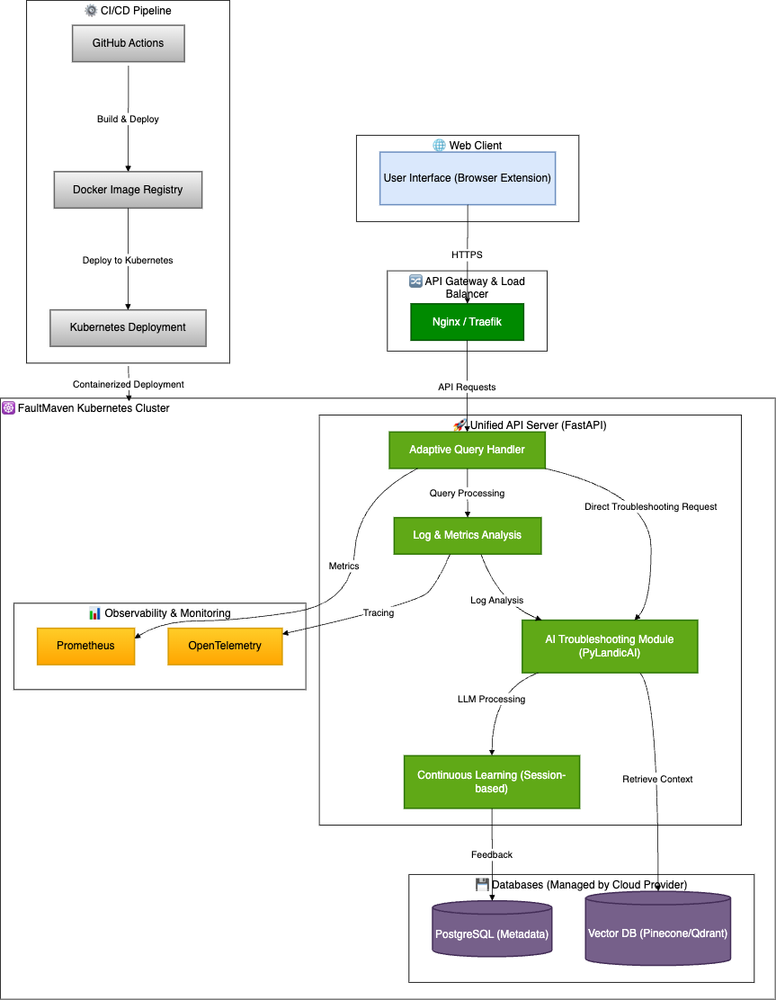

# FaultMaven Deployment Architecture

## 1. Introduction

### Purpose
This document outlines the deployment strategy for FaultMaven, detailing how its components are containerized, orchestrated, and managed in production environments. It defines infrastructure requirements, networking, security considerations, and scalability strategies.

### Scope
The deployment architecture focuses on the production deployment of FaultMaven and includes:
- **Containerization & Orchestration**
- **Infrastructure & Resource Allocation**
- **Networking & API Communication**
- **Scalability & High Availability**
- **Security & Compliance**

---

## 2. Deployment Model

### 2.1 Containerized Monolithic Architecture
FaultMaven is deployed as a **monolithic service** in its initial version, ensuring minimal inter-process communication overhead. The system can later be modularized into microservices if needed. The primary deployment model includes:

- **Docker Containers**: Each component runs inside a container.
- **Kubernetes (K8s) Orchestration**: For auto-scaling, self-healing, and service discovery.

### 2.2 Core Services & Containers
| Service | Description | Deployment |
|---------|------------|------------|
| **Unified API & Processing Server** | Handles all user requests, processes logs/metrics, and generates AI recommendations. | Single containerized FastAPI service |
| **Vector Database** | Stores short-term troubleshooting knowledge. | Hosted Pinecone / Qdrant |
| **Relational Database** | Stores metadata and system logs. | PostgreSQL |
| **Monitoring & Logging** | Observability tools for performance tracking. | Prometheus & OpenTelemetry |
| **Reverse Proxy & Load Balancer** | Handles external API requests. | Nginx / Traefik |

---

## 3. Networking & Communication

### 3.1 API Exposure & Routing
- **External API Access**: FaultMaven exposes APIs via **Nginx reverse proxy**.
- **Internal Communication**: All services communicate over **internal Kubernetes networking**.

### 3.2 Inter-Component Communication  
| Source | Destination | Protocol |
|--------|------------|----------|
| Web Client | Unified API Server | HTTPS |
| API Server | Vector Database | REST API |
| API Server | PostgreSQL | PostgreSQL Protocol |
| **Adaptive Query Handler** | **Log & Metrics Analysis** | In-process Call |
| **Adaptive Query Handler** | **AI Troubleshooting Module** | In-process Call |
| **Log & Metrics Analysis** | **AI Troubleshooting Module** | In-process Call |

---

## 4. Deployment Diagram (Updated with Grouped Containers)

---

## 5. Deployment Strategy

### 5.1 Initial Deployment (Monolithic Model)
- The entire **Unified API Server** runs as a **single container** in **Kubernetes**.
- All internal modules execute **in-process** (Adaptive Query Handler, Log Analysis, AI Processing).

### 5.2 Future Scalability (Microservices)
- If load increases, we can **split modules into separate services**.
- AI Processing can be **offloaded to dedicated GPU nodes**.

### 5.3 CI/CD Pipeline
- **GitHub Actions** handles automated builds and testing.
- **Docker images are deployed to a private container registry.**
- **Kubernetes applies rolling updates with zero downtime.**

---

## 6. Conclusion

This deployment architecture ensures that **FaultMaven is scalable, secure, and highly available**. The system is designed for **easy maintenance**, **flexible scaling**, and **robust security**, enabling engineers to troubleshoot production issues efficiently.
