# Deployment Architecture

## Overview

This document outlines the deployment architecture for **FaultMaven**, detailing how various system components are deployed, orchestrated, and managed in a **Kubernetes-based infrastructure**.

## Key Considerations

The deployment architecture is designed to:
- Ensure **scalability** by leveraging **containerized microservices** deployed on Kubernetes.
- Utilize **managed cloud services** for databases and monitoring to reduce operational overhead.
- Support **resilience and high availability** by implementing redundancy and failover mechanisms.
- Maintain **security best practices**, including API authentication, encrypted data storage, and network policies.

---

## Deployment Diagram

```mermaid
graph TD
  %% CI/CD Pipeline
  subgraph "CI/CD Pipeline 🛠️"
    A[GitHub Actions 🚀] -->|Build & Push| B[Container Registry 🗄️]
  end

  %% Kubernetes Cluster
  subgraph "Kubernetes Cluster ☸️"
    %% API Layer
    subgraph "API Layer 🔗"
      C[FastAPI Gateway 🚪] -->|Route Requests| D[Query Router 🔄]
      C -->|External API Calls| E[API Adapter Embedded 🔌]
    end

    %% AI Processing
    subgraph "AI Processing 🧠"
      D -->|Log Processing| F[Log Analysis Agent 📊]
      D -->|Troubleshooting| G[AI Agent PydanticAI 🤖]
    end

    %% Data Management
    subgraph "Data Management (Managed Services) 💾"
      H((Vector DB Qdrant 📚)) -->|Retrieve Context| G
      I((PostgreSQL RDS 🗄️)) -->|Store Logs| F
    end

    %% Observability & Monitoring
    subgraph "Observability & Monitoring (Managed Services) 🔍"
      J((Prometheus Operator 📈)) -->|Monitor| C
      K((Amazon OpenSearch 📊)) -->|Logs & Metrics| C
    end
  end

  %% Interconnections
  B -->|Pull Images| C
  K -->|Insights| C
```

---

## Component Breakdown

### **1. API Layer**
- **FastAPI Gateway** (Deployed as a Kubernetes service)
  - Handles requests from the **browser extension** and external integrations.
  - Routes queries to the **Query Router**.
  - Facilitates interaction with external services via the **Embedded API Adapter**.

- **Query Router**
  - Determines whether to direct a request to the **Log Analysis Agent** or the **AI Agent**.

- **Embedded API Adapter** (Part of the FastAPI service)
  - Connects FaultMaven to external **observability tools** (e.g., Splunk, Datadog).
  - Simplifies external API interactions without requiring an additional service.

### **2. AI Processing**
- **Log Analysis Agent**
  - Analyzes log data to extract insights and potential failure causes.
  - Stores structured log findings in PostgreSQL.

- **AI Agent (PydanticAI)**
  - Processes troubleshooting queries using **LLM-based reasoning**.
  - Retrieves historical data from the **Vector DB (Qdrant)**.

### **3. Data Management (Managed Services)**
- **Vector Database (Qdrant)**
  - Stores structured logs and historical problem-solving insights for contextual retrieval.

- **PostgreSQL RDS**
  - Stores raw and processed log data.
  - Serves as a relational database for system state tracking.

### **4. Observability & Monitoring (Managed Services)**
- **Prometheus Operator**
  - Collects metrics and performance data from FaultMaven components.

- **Amazon OpenSearch (Managed Elastic Stack)**
  - Centralized logging for deep analysis of system behavior and debugging.

### **5. CI/CD Pipeline**
- **GitHub Actions**
  - Automates code testing, container builds, and deployments.
  - Pushes built container images to the **Container Registry**.

- **Container Registry**
  - Stores built container images for deployment.
  - Kubernetes pulls these images for running services.

---

## Deployment Strategy

1. **Infrastructure as Code (IaC)**
   - Deployment is automated via Terraform and Kubernetes manifests.
   - All infrastructure components are defined in version-controlled configuration files.

2. **Service Orchestration**
   - Microservices are deployed as individual **Kubernetes pods**.
   - Kubernetes **ingress controllers** manage traffic routing.

3. **Scalability**
   - **AI Processing** and **API Services** can autoscale based on demand.
   - Kubernetes **Horizontal Pod Autoscaler (HPA)** manages scaling.

4. **Security Best Practices**
   - **Role-based access control (RBAC)** for Kubernetes services.
   - **API authentication** using JWT tokens.
   - **Data encryption** for logs and metrics.

---

## Future Enhancements

- **Auto-healing mechanisms** for failed services.
- **Further optimization of AI inference speeds** for low-latency responses.
- **Support for additional observability tools** as external API integrations.

---

This document serves as the foundation for **FaultMaven’s production deployment strategy**. Any updates or modifications should be version-controlled and reviewed periodically.

