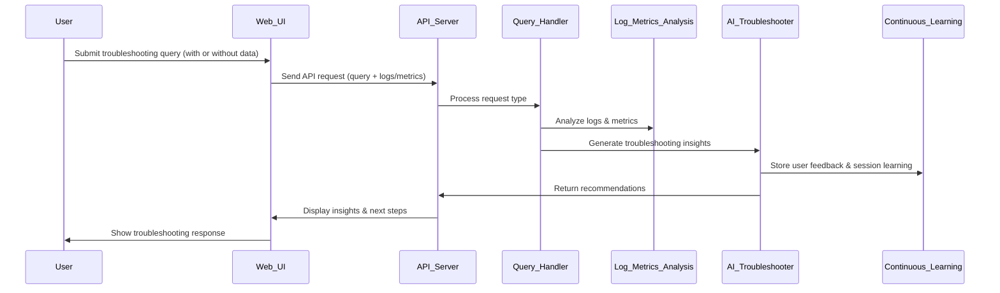

# FaultMaven Detailed Design Document

## 1. Introduction

### Purpose
This document provides an in-depth technical design for FaultMaven, detailing the implementation of each module, data structures, API specifications, processing workflows, error handling strategies, security measures, and testing strategies.

### Scope
FaultMaven is an AI-powered troubleshooting assistant that processes observability data and provides real-time, context-aware insights. This document covers:

- **Unified API & Query Handler**
- **Data Normalization Module**
- **Log & Metrics Analysis Module**
- **AI Troubleshooting Module**
- **Continuous Learning Module**
- **Observability & Monitoring Layer**
- **Security & CI/CD Strategy**

### Intended Audience
This document is intended for software engineers, architects, and developers involved in the implementation and maintenance of FaultMaven.

---

## 2. System Overview

### High-Level Architecture
FaultMaven consists of a **monolithic process** that handles all API requests from the web browser, processes observability data, and returns actionable troubleshooting insights. The key components are:

1. **Adaptive Query Handler** – Determines request type and routes it accordingly.
2. **Data Normalization Module** – Converts logs, metrics, and traces into a standardized format.
3. **Log & Metrics Analysis Module** – Extracts patterns and detects anomalies.
4. **AI Troubleshooting Module** – Generates troubleshooting recommendations using an LLM.
5. **Continuous Learning Module** – Adjusts recommendations based on user feedback.
6. **Observability & Monitoring Layer** – Logs API requests, tracks AI responses, and monitors system health.

### Technology Stack
- **Backend:** FastAPI (Python)
- **AI Processing:** OpenAI GPT-4 / PyLandicAI
- **Log Processing:** Elasticsearch, OpenSearch
- **Database:** PostgreSQL & Pinecone (Vector DB)
- **Monitoring & Tracing:** Prometheus, OpenTelemetry
- **Security:** OAuth2 Authentication, AES-256 Encryption
- **Deployment:** Docker, Kubernetes

---

## 3. User Interaction Flow

### Overview
FaultMaven’s troubleshooting workflow consists of six stages:

1. **User submits a troubleshooting request** (query-only, data-only, or both).
2. **API receives the request** and forwards it to the **Adaptive Query Handler**.
3. **Data Processing Modules analyze input** (logs, metrics, traces).
4. **AI Troubleshooting Module synthesizes results** and generates recommendations.
5. **User receives a structured response** with actionable insights.
6. **User feedback is collected** to refine recommendations (Continuous Learning Module).

### Sequence Diagram


### Detailed Breakdown

#### **1. User Request Submission**
- User enters a troubleshooting query through the **FaultMaven web interface**.
- The user may optionally provide logs, monitoring data, or traces.

#### **2. API Processing**
- The **Unified API Server** receives the request.
- The **Adaptive Query Handler** determines whether the request is:
  - **Query-only** (text-based query with no logs/metrics).
  - **Data-only** (logs or metrics but no query).
  - **Query + Data** (both provided).

#### **3. Data Processing & Analysis**
- If observability data is provided, the **Log & Metrics Analysis Module** extracts patterns, anomalies, and correlations.

#### **4. AI Troubleshooting Module Execution**
- The AI model (GPT-4 via **PyLandicAI**) generates **context-aware troubleshooting guidance**.
- If **similar past issues exist**, relevant insights are retrieved from the **Vector Database**.

#### **5. Response Delivery**
- The system generates a **structured response** with:
  - **Suggested next steps** for troubleshooting.
  - **Contextual insights** from past cases.
  - **Potential root causes** based on log and metrics analysis.

#### **6. User Feedback & Continuous Learning**
- The **Continuous Learning Module** collects **user feedback** (accept/reject recommendations).
- This feedback is used **within the same session** to refine responses dynamically.

---

## 4. API Design & Endpoints

### 4.1 Unified API & Query Handler
Handles all requests from the web client.

- **Endpoint:** `/api/query`
- **Request Example (JSON)**
  ```json
  {
      "user_id": "user_001",
      "query": "Why is my server CPU usage spiking?",
      "logs": ["Error: CPU threshold exceeded at 90%"],
      "metrics": {"cpu_usage": 92, "memory_usage": 78}
  }
  ```
- **Response Example**
  ```json
  {
      "recommendations": [
          "Check active processes using top or htop.",
          "Investigate recent deployments for performance regressions."
      ]
  }
  ```

---

## 5. Component Design & Processing Logic

### 5.1 Adaptive Query Handler
- **Determines request type (query-only, data-only, or combined).**
- **Routes request to the appropriate processing module.**

### 5.2 Data Normalization Module
- **Converts all incoming data into a standardized format.**

### 5.3 Log & Metrics Analysis Module
- **Uses statistical and ML-based methods to detect anomalies.**

### 5.4 AI Troubleshooting Module
- **Retrieves context from the vector database.**
- **Uses an LLM (GPT-4 via PyLandicAI) to generate recommendations.**

### 5.5 Continuous Learning Module
- **Implements session-based learning using real-time feedback.**

---

## 6. Security & Access Control

### 6.1 Authentication & Authorization
- **OAuth2-based API Authentication** for secure user access.
- **Role-Based Access Control (RBAC)** to restrict access levels.

### 6.2 Data Encryption
- **AES-256 encryption** for stored log data.
- **TLS 1.2+ encryption** for API communication.

### 6.3 Logging & Auditing
- Secure audit logs to track **user actions and system events**.

---

## 7. CI/CD Pipeline & Testing Strategy

### 7.1 Automated Testing
- **Unit tests** for individual AI agents.
- **Integration tests** for API endpoints.
- **End-to-end tests** using **Postman or Pytest**.

### 7.2 CI/CD Workflow
- **GitHub Actions** for automated builds and deployments.
- **Kubernetes-managed containerized deployments**.

---

## 8. Future Enhancements

- **Multimodal Input Support:** Screenshots and configuration files.
- **LLM Fine-Tuning:** Training on real-world logs.
- **On-Prem Deployments:** Cloud and self-hosted options.

---

## 9. Conclusion

This document provides the detailed technical specifications for FaultMaven’s architecture and processing logic. It ensures that every user request is processed efficiently in real time via a unified backend, with intelligent, adaptive troubleshooting and session-based continuous learning.


# 
#
#
# ---------


update 3/8/2025

Note: This is an addition to the existing detailed design document. It clearly defines the expected behavior and interaction model of FaultMaven. It highlights the importance of session management and contextual prompting in achieving the desired conversational troubleshooting experience. It also clearly separates the responsibilities of the client and server, making the design more understandable.

## Communication Protocol and Core Design Principles

This section outlines the communication protocol between the user (via the browser extension) and the FaultMaven backend, as well as the core design principles that guide the application's behavior.

### User-FaultMaven Communication Protocol

FaultMaven is designed to facilitate a context-aware, conversational troubleshooting experience.  The following rules govern the interaction between the user and the system:

1.  **Domain Focus:** FaultMaven is specialized for Site Reliability Engineering (SRE), DevOps, system administration, cloud computing, and related technical troubleshooting tasks.  It is designed to provide assistance within this domain. While general questions *can* be asked, they are treated as context-setting for subsequent, more specific troubleshooting queries. FaultMaven may politely decline to answer questions that are clearly outside of its domain of expertise.

2.  **Alternating Data and Queries:** The user interacts with FaultMaven by submitting either *data* (logs, metrics, web page content) or *queries*. There are no restrictions on the order or timing of these submissions.  The user can:
    *   Submit data first, then ask questions about it.
    *   Ask a general question first, then provide data for more specific analysis.
    *   Submit multiple sets of data and ask questions related to any or all of them within the same conversation.
    *   Ask a series of related questions without re-submitting data.

3.  **Data Submission and Immediate Feedback:** When data is submitted to the `/data` endpoint, FaultMaven:
    *   Processes the data (parsing, analysis, anomaly detection).
    *   Stores the *processed results* (and a reference to the raw data, if needed) in the user's session.
    *   Returns an *immediate* summary of the analysis to the user (e.g., "Log analysis complete. Detected 4 errors and 2 warnings."). This provides quick feedback *before* the user formulates a specific query.

4.  **Contextual Query Handling:** When a query is submitted to the `/query` endpoint, FaultMaven:
    *   Retrieves the user's session, including the conversation history and *all* previously submitted data.
    *   If data is present in the session, the query is treated as a *troubleshooting* query.  FaultMaven uses the `troubleshooting_prompt` and includes the *entire* accumulated, processed data from the session as context for the LLM.
    *   If *no* data is present in the session, the query is treated as a *general* question. FaultMaven uses the `general_query_prompt`.
    *   The conversation history is *always* included in the prompt, allowing the LLM to maintain context.

5.  **Session Management:**
    *   FaultMaven uses server-side session management to maintain context across multiple interactions.
    *   A unique `session_id` (UUID) is used to identify each conversation.
    *   The client (browser extension) is responsible for storing the `session_id` and sending it with each request in the `X-Session-ID` HTTP header.
    *   The server stores session data (conversation history, processed data) associated with each `session_id`.
    *   Sessions have a timeout period (currently 30 minutes of inactivity), after which the session data is deleted.
    *   The client can explicitly start a new conversation, clearing the `session_id` and effectively resetting the context.

6.  **LLM Interaction:**

    *   FaultMaven acts as an intermediary between the user and the LLM.
    *   FaultMaven is designed to be LLM-agnostic, supporting multiple LLM providers through an abstraction layer (`LLMProvider`).
    *    The LLM is always called with a prompt that includes:
        *   The current user query.
        *   The formatted conversation history (if any).
        *   Relevant processed data (if any).
    *   FaultMaven expects a raw string response.

### Core Design Principles

1. **Transparency:** FaultMaven aims to be a "smart assistant," *enhancing* the user's interaction with the LLM, not replacing it. The raw LLM responses are made available.
2. **Context is King:** Maintaining conversation context is paramount.  The session management system and contextual prompting are designed to ensure the LLM has access to all relevant information.
3. **Data-Driven Troubleshooting:** FaultMaven's primary value comes from its ability to process and analyze system data (logs, metrics), providing context that a general-purpose LLM lacks.
4. **Flexibility:** The system is designed to be flexible and extensible, supporting multiple data types, LLM providers, and future enhancements (like LLM chaining).
5. **User Control:** The user is in control of the conversation. They can submit data or queries at any time, and they can start new conversations when needed.
6. **Stateless LLM, Stateful Faultmaven:** FaultMaven leverages *stateless* LLM API calls, while providing a *stateful* conversational experience through its own session management.
7. **Security**: All data submitted by users are considered sensitive.

# 
#
#
# ---------


update 3/12/2025

## Data Processing and Analysis

FaultMaven employs a hybrid approach to data processing, combining traditional parsing and analysis with the contextual understanding of Large Language Models (LLMs). This section details the data processing pipeline, from ingestion to LLM interaction, and outlines future enhancements.

### Current Approach: Hybrid Pre-processing and LLM Interaction

The current data processing workflow consists of the following steps:

1.  **Data Ingestion:** FaultMaven accepts user-provided data through the browser extension via three methods:
    *   **Text Input:** Raw text data (e.g., log snippets) pasted directly into a text area.
    *   **File Upload:** Log files in common formats (e.g., `.txt`, `.log`, `.json`, `.csv`).  Uploaded files are read and their content treated as text.
    *   **URL Input:** A URL pointing to a web page containing relevant information (e.g., an error page, monitoring dashboard). The content of the page is fetched and the relevant text extracted.

2.  **Data Type Identification:** The `/data` endpoint in `app/query_processing.py` identifies the data type based on user selection (for text/file/URL) and, for files, uses the `content-type` header for validation.

3.  **Initial Parsing and Transformation (Preprocessing):**
    *   **Text and File Data:**  The content is treated as a single string.  Basic encoding validation (UTF-8) is performed for files.
    *   **URL Data:** The content is fetched using the `aiohttp` library (asynchronously).  The `BeautifulSoup4` library is used to parse the HTML and extract the main text content, removing `<script>` and `<style>` tags to avoid analyzing irrelevant code.
    *   At this stage, *all* data types are represented as strings.

4.  **Log Processing (Fluentd - Subprocess):**
    *   **Execution:**  FaultMaven utilizes the open-source log processor **Fluentd**, running it as a *subprocess* within the FastAPI application.  This avoids external service dependencies.  The data string is piped to Fluentd's standard input.
    *   **Configuration (`fluent.conf`):** A Fluentd configuration file (`app/fluent.conf`) defines the parsing rules. This configuration:
        *   Uses the `stdin` input plugin.
        *   Employs the `parser` filter with the `@type multiline` option to handle log entries that span multiple lines.
        *   Uses the `format_firstline` and `format1` directives within the `parser` filter to define regular expressions for:
            *   Identifying the start of a new log entry (typically based on a timestamp pattern).
            *   Extracting key fields (timestamp, log level, message) from each log entry using named capture groups.  *This is a crucial step, and the regular expressions must be carefully crafted and maintained to match the expected log formats.*
        *   Outputs the parsed log entries to `stdout` in JSON format.
    *   **Error Handling:** Errors from the Fluentd subprocess are captured, logged, and result in an appropriate HTTP error response to the user.
    *   **Output:**  Fluentd's output (a stream of JSON objects, each representing a parsed log entry) is captured by the Python code.

5.  **Preliminary Analysis (`log_metrics_analysis.py`):**
    *   The `process_logs_data` function in `app/log_metrics_analysis.py` receives the parsed log entries (the JSON output from Fluentd) as a list of dictionaries.
    *   It performs initial data analysis *without* directly interacting with an LLM. This step includes:
        *   **Aggregation:** Counting log messages by log level (INFO, WARNING, ERROR, etc.).
        *   **Extraction:**  Extracting all error messages.
        *   **Basic Anomaly Detection:**  Implementing basic anomaly detection (e.g., detecting spikes in error rates).  This could be extended to include more sophisticated statistical methods.
        *   **Metric Extraction:** (If metrics are present in the logs and parsed by Fluentd) Extracting numerical metric values (e.g., CPU usage, memory usage, response time) and calculating basic statistics (e.g., average, minimum, maximum).
    *   The function returns a dictionary (`log_insights`) containing the structured analysis results.

6.  **LLM-Powered Summary Generation (`ai_troubleshooting.py`):**
    *   The `process_data_summary` function in `app/ai_troubleshooting.py` is called *after* `process_logs_data`.
    *   It takes the `log_insights` dictionary as input.
    *    It uses function `format_log_data_for_summary` to format `log_insights` data into string.
    *   It constructs a prompt for the LLM using the `log_summary_prompt` template (defined in `config/settings.py`).  This prompt instructs the LLM to generate a concise, human-readable summary of the log analysis findings.
    *   It calls the LLM (via the `llm_provider`) to generate the summary.
    *   It returns the LLM-generated summary string.

7.  **Session Storage:**
    *   The *raw* data content, the structured `log_insights` from `process_logs_data`, *and* the LLM-generated summary (`llm_summary`) are all stored within the user's session data.  This allows subsequent queries within the same session to access both the raw data, the structured analysis, *and* the LLM's interpretation of the data. All submitted data within a session is stored.
    *   Session data is stored in an in-memory dictionary (`sessions`) keyed by a unique `session_id` (UUID). This dictionary is managed using FastAPI's dependency injection system for thread safety and testability.
    *   Session data includes:
        *   `history`: A list of dictionaries, each representing a turn in the conversation (user query, LLM response).
        *   `data`: A *list* of dictionaries. Each element in the list stores information from *one* data submission within the session.  Each data object contains:
            *   `type`: The data type ("text", "file", or "url").
            *   `content`: The raw data content (string).
            *   `summary`: The structured `log_insights` dictionary from `process_logs_data`.
            *   `llm_summary`: The LLM-generated summary string.
        *   `last_activity`: A timestamp of the last user interaction, used for session timeout.

8.  **Query Handling with Context (`query_processing.py`):**
    *   The `handle_query` function in `query_processing.py` retrieves the session data.
    *   If the session contains previously submitted data (`session["data"]` is not empty), the `process_query_with_logs` function in `app/ai_troubleshooting.py` is called. This function:
        *   Formats all accumulated data summaries using `format_data_summary` in `app/ai_troubleshooting.py`, which iterates over data stored and create a combined string.
        *   Constructs a prompt using the `troubleshooting_prompt` template, including the user's query, the formatted data summary, and the conversation history.
        *   Calls the LLM.
        *   Formats LLM's output using `format_llm_response` in `app/ai_troubleshooting.py`.
    *   If the session contains *no* previously submitted data, the `process_query` function is called, using the `general_query_prompt`.

9. **Server response**:

  * The `/data` endpoint returns a `DataResponse`.
  * The `/query` endpoint returns a `QueryResponse`.

## Future Enhancements

This section details potential future improvements and additions to FaultMaven, building upon the core functionality.

1.  **Persistent Session Storage (Redis):**

    *   **Motivation:** The in-memory session storage is not persistent. Switching to Redis will provide persistent sessions across server restarts.
    *   **Implementation:** Replace the `sessions` dictionary with a Redis client. Serialize session data as JSON for storage in Redis. Implement session timeout using Redis's built-in expiration capabilities.

2.  **Advanced Log Parsing:**

    *   **Customizable Parsing Rules:** Allow users to define custom parsing rules for their specific log formats, potentially through a user interface.  This would involve providing a way for users to specify regular expressions or other parsing logic.
    *   **Log Format Detection:** Implement automatic log format detection, reducing the need for manual configuration. This could involve heuristics or machine learning techniques.
    *   **Log Aggregation Tools:** Explore integration with more advanced log aggregation tools like Loki, providing a more scalable solution for very large log volumes.

3.  **Enhanced Anomaly Detection:**

    *   **Sophisticated Algorithms:** Implement more advanced anomaly detection algorithms, going beyond simple thresholding.  This could include:
        *   Time series analysis techniques (e.g., moving averages, exponential smoothing).
        *   Machine learning models (e.g., clustering, anomaly detection algorithms).
    *   **Dynamic Thresholds:**  Adapt anomaly detection thresholds dynamically based on historical data patterns.
    *   **User-Defined Anomalies:** Allow users to define custom anomaly detection rules based on their specific needs and knowledge.

4.  **Expanded Metric Support:**

    *   **Wider Range of Metrics:** Handle a broader range of metrics beyond basic averages. Include percentiles, histograms, and other statistical measures.
    *   **Visualization:** Integrate basic metric visualization capabilities directly into the FaultMaven sidebar (e.g., simple time-series charts).

5.  **LLM Chaining:**

    *   **Multi-Step Reasoning:** Implement LLM chaining to break down complex troubleshooting tasks into smaller, more manageable steps. This involves making multiple sequential calls to LLMs, using the output of one call as input to the next.
    *   **Example Chain:**  A potential chain could involve: (1) Summarizing the logs, (2) Identifying potential root causes based on the summary, (3) Suggesting solutions based on the identified root cause, (4) Generating diagnostic commands.
    *   **Chain Definition:** Develop a mechanism for users to define and customize their own LLM chains (e.g., through a configuration file or a UI).

6.  **Knowledge Base Integration:**

    *   **Common Errors and Solutions:** Create a knowledge base of common errors and solutions, potentially integrating with external resources (e.g., Stack Overflow, documentation).
    *   **Proactive Suggestions:** Use the knowledge base to provide proactive suggestions to the user, even before they explicitly ask a question.
    *   **Augment LLM Responses:** Use the knowledge base to supplement and validate the LLM's responses.

7.  **Automated Remediation (Advanced):**

    *   **Suggestion:** Suggest specific commands or scripts that the user can run to fix the problem.
    *   **Execution (with User Confirmation):**  With *explicit* user confirmation and appropriate safeguards, potentially allow FaultMaven to *execute* remediation actions.  This requires very careful security considerations.

8.  **User Interface Enhancements:**

    *   **Improved Conversation Display:** Enhance the visual presentation of the conversation history.
    *   **Copy to Clipboard:** Add buttons to copy queries, responses, or entire conversations.
    *   **Data Source Selection:** Improve the UI for selecting the data source (text, file, URL).
    *   **Syntax Highlighting:** Add syntax highlighting for log data displayed in the sidebar.
     * **Collapsible sections:** Organize the data.

9.  **Collaboration Features:**

    *   **Shared Sessions:**  Allow multiple users to collaborate on the same troubleshooting session.
    *   **Commenting/Annotation:** Allow users to add comments and annotations to the conversation history.

10. **Specialized AI Model (Long-Term):**

    *   **Fine-tuning:** Fine-tune a pre-trained LLM on a large corpus of SRE/DevOps related data (logs, documentation, troubleshooting guides). This would improve the accuracy and relevance of the LLM's responses for troubleshooting tasks.
    *   **Custom Model Training:** Train a smaller, specialized model from scratch specifically for troubleshooting. This could be more efficient than using a large, general-purpose LLM.

11. **Feedback and Continuous Learning:**

    *   **User Feedback:** Collect user feedback on the usefulness of FaultMaven's responses.
    *   **Reinforcement Learning:**  Use reinforcement learning techniques to improve the LLM's performance over time based on user feedback.

12. **Integration with Other Tools:**

    *   **Monitoring Systems:** Integrate with monitoring systems (Prometheus, Grafana, etc.) to automatically pull in relevant metrics and logs.
    *   **CI/CD Pipelines:** Integrate with CI/CD pipelines to automatically collect data and trigger troubleshooting workflows.
    * **Ticketing System:**

This enhanced section provides a more structured and detailed roadmap for FaultMaven's future development, aligning with the core principles and addressing potential challenges.  It covers both immediate improvements and long-term goals. The focus remains on building a practical, user-friendly tool that leverages the power of LLMs for efficient troubleshooting, while acknowledging the limitations and complexities of such a system.