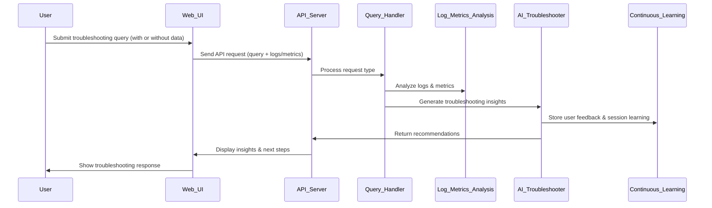

# FaultMaven Detailed Design Document

## 1. Introduction

### Purpose
This document provides an in-depth technical design for FaultMaven, detailing the implementation of each module, data structures, API specifications, processing workflows, error handling strategies, security measures, and testing strategies.

### Scope
FaultMaven is an AI-powered troubleshooting assistant that processes observability data and provides real-time, context-aware insights. This document covers:

- **Unified API & Query Handler**
- **Data Normalization Module**
- **Log & Metrics Analysis Module**
- **AI Troubleshooting Module**
- **Continuous Learning Module**
- **Observability & Monitoring Layer**
- **Security & CI/CD Strategy**

### Intended Audience
This document is intended for software engineers, architects, and developers involved in the implementation and maintenance of FaultMaven.

---

## 2. System Overview

### High-Level Architecture
FaultMaven consists of a **monolithic process** that handles all API requests from the web browser, processes observability data, and returns actionable troubleshooting insights. The key components are:

1. **Adaptive Query Handler** – Determines request type and routes it accordingly.
2. **Data Normalization Module** – Converts logs, metrics, and traces into a standardized format.
3. **Log & Metrics Analysis Module** – Extracts patterns and detects anomalies.
4. **AI Troubleshooting Module** – Generates troubleshooting recommendations using an LLM.
5. **Continuous Learning Module** – Adjusts recommendations based on user feedback.
6. **Observability & Monitoring Layer** – Logs API requests, tracks AI responses, and monitors system health.

### Technology Stack
- **Backend:** FastAPI (Python)
- **AI Processing:** OpenAI GPT-4 / PyLandicAI
- **Log Processing:** Elasticsearch, OpenSearch
- **Database:** PostgreSQL & Pinecone (Vector DB)
- **Monitoring & Tracing:** Prometheus, OpenTelemetry
- **Security:** OAuth2 Authentication, AES-256 Encryption
- **Deployment:** Docker, Kubernetes

---

## 3. User Interaction Flow

### Overview
FaultMaven’s troubleshooting workflow consists of six stages:

1. **User submits a troubleshooting request** (query-only, data-only, or both).
2. **API receives the request** and forwards it to the **Adaptive Query Handler**.
3. **Data Processing Modules analyze input** (logs, metrics, traces).
4. **AI Troubleshooting Module synthesizes results** and generates recommendations.
5. **User receives a structured response** with actionable insights.
6. **User feedback is collected** to refine recommendations (Continuous Learning Module).

### Sequence Diagram


### Detailed Breakdown

#### **1. User Request Submission**
- User enters a troubleshooting query through the **FaultMaven web interface**.
- The user may optionally provide logs, monitoring data, or traces.

#### **2. API Processing**
- The **Unified API Server** receives the request.
- The **Adaptive Query Handler** determines whether the request is:
  - **Query-only** (text-based query with no logs/metrics).
  - **Data-only** (logs or metrics but no query).
  - **Query + Data** (both provided).

#### **3. Data Processing & Analysis**
- If observability data is provided, the **Log & Metrics Analysis Module** extracts patterns, anomalies, and correlations.

#### **4. AI Troubleshooting Module Execution**
- The AI model (GPT-4 via **PyLandicAI**) generates **context-aware troubleshooting guidance**.
- If **similar past issues exist**, relevant insights are retrieved from the **Vector Database**.

#### **5. Response Delivery**
- The system generates a **structured response** with:
  - **Suggested next steps** for troubleshooting.
  - **Contextual insights** from past cases.
  - **Potential root causes** based on log and metrics analysis.

#### **6. User Feedback & Continuous Learning**
- The **Continuous Learning Module** collects **user feedback** (accept/reject recommendations).
- This feedback is used **within the same session** to refine responses dynamically.

---

## 4. API Design & Endpoints

### 4.1 Unified API & Query Handler
Handles all requests from the web client.

- **Endpoint:** `/api/query`
- **Request Example (JSON)**
  ```json
  {
      "user_id": "user_001",
      "query": "Why is my server CPU usage spiking?",
      "logs": ["Error: CPU threshold exceeded at 90%"],
      "metrics": {"cpu_usage": 92, "memory_usage": 78}
  }
  ```
- **Response Example**
  ```json
  {
      "recommendations": [
          "Check active processes using top or htop.",
          "Investigate recent deployments for performance regressions."
      ]
  }
  ```

---

## 5. Component Design & Processing Logic

### 5.1 Adaptive Query Handler
- **Determines request type (query-only, data-only, or combined).**
- **Routes request to the appropriate processing module.**

### 5.2 Data Normalization Module
- **Converts all incoming data into a standardized format.**

### 5.3 Log & Metrics Analysis Module
- **Uses statistical and ML-based methods to detect anomalies.**

### 5.4 AI Troubleshooting Module
- **Retrieves context from the vector database.**
- **Uses an LLM (GPT-4 via PyLandicAI) to generate recommendations.**

### 5.5 Continuous Learning Module
- **Implements session-based learning using real-time feedback.**

---

## 6. Security & Access Control

### 6.1 Authentication & Authorization
- **OAuth2-based API Authentication** for secure user access.
- **Role-Based Access Control (RBAC)** to restrict access levels.

### 6.2 Data Encryption
- **AES-256 encryption** for stored log data.
- **TLS 1.2+ encryption** for API communication.

### 6.3 Logging & Auditing
- Secure audit logs to track **user actions and system events**.

---

## 7. CI/CD Pipeline & Testing Strategy

### 7.1 Automated Testing
- **Unit tests** for individual AI agents.
- **Integration tests** for API endpoints.
- **End-to-end tests** using **Postman or Pytest**.

### 7.2 CI/CD Workflow
- **GitHub Actions** for automated builds and deployments.
- **Kubernetes-managed containerized deployments**.

---

## 8. Future Enhancements

- **Multimodal Input Support:** Screenshots and configuration files.
- **LLM Fine-Tuning:** Training on real-world logs.
- **On-Prem Deployments:** Cloud and self-hosted options.

---

## 9. Conclusion

This document provides the detailed technical specifications for FaultMaven’s architecture and processing logic. It ensures that every user request is processed efficiently in real time via a unified backend, with intelligent, adaptive troubleshooting and session-based continuous learning.

