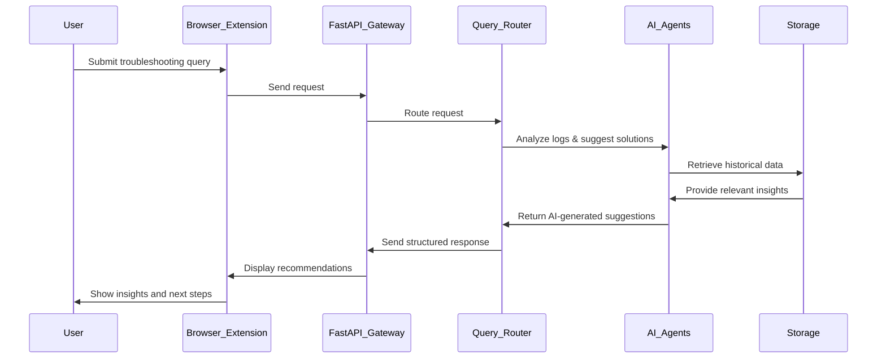

# FaultMaven Detailed Design Document

## 1. Overview
FaultMaven is an AI-powered troubleshooting assistant designed to enhance the incident resolution process by analyzing logs, metrics, and monitoring data in real-time. This document details the system's architecture, AI agent responsibilities, data processing, API interactions, security considerations, and testing strategy.

---

## 2. System Architecture
FaultMaven follows a **modular microservices architecture**, ensuring **scalability**, **fault tolerance**, and **real-time troubleshooting capabilities**. 

### **2.1 High-Level Architecture**
The architecture consists of the following key layers:
1. **User Interface (UI Layer)** – Browser extension to capture troubleshooting context.
2. **API Layer** – FastAPI Gateway to manage user interactions.
3. **AI Processing Layer** – AI agents for log analysis, troubleshooting, and context retrieval.
4. **Data Management Layer** – PostgreSQL for structured data and VectorDB for historical troubleshooting knowledge.
5. **Observability & Monitoring Layer** – Prometheus and OpenSearch for logging and performance monitoring.
6. **Deployment Layer** – Kubernetes-based deployment for scalability.

🚀 **Refer to the [System Architecture Document](./diagrams/system-architecture.png) for a visual overview.**

---

## 3. AI Agent Responsibilities
FaultMaven’s AI agents process troubleshooting data dynamically.

### **3.1 Query Router**
- Routes queries to the appropriate AI agent based on context.
- Ensures efficient processing of user requests.

### **3.2 Log Analysis Agent**
- Processes structured and unstructured logs.
- Extracts insights using machine learning-based anomaly detection.
- Integrates with **observability tools** such as **Splunk, Datadog, and Prometheus**.

### **3.3 Troubleshooting Agent**
- Uses AI reasoning to suggest root causes and guided investigation steps.
- Offers diagnostic commands for deeper troubleshooting.
- Prioritizes suggestions based on past successful resolutions.

### **3.4 Context Retrieval Agent**
- Retrieves **historical troubleshooting records** from VectorDB.
- Provides recommendations based on past **similar incidents**.

---

## 4. Data Flow & Processing
FaultMaven processes logs, metrics, and observability data **dynamically** as incidents occur.

### **4.1 Data Ingestion**
- Accepts **log files**, **pasted logs**, **monitoring data**, and **API integrations**.
- Uses **Kafka Stream Processing** for real-time ingestion.
- Supports **structured (JSON, CSV) and unstructured (text, logs)** formats.

### **4.2 Preprocessing Pipeline**
- Normalizes log formats to maintain consistency.
- Filters irrelevant data while retaining meaningful troubleshooting information.

### **4.3 AI-Driven Analysis**
- Queries AI agents to **extract insights** and **provide recommendations**.
- Utilizes **Retrieval-Augmented Generation (RAG)** for enhanced context awareness.

### **4.4 User Feedback Loop**
- Learns from **resolved incidents** to improve AI suggestions.
- Refines AI troubleshooting logic based on user actions.

---

## 5. API Specifications
FaultMaven exposes a **FastAPI-powered REST API** for user interactions.

### **5.1 API Endpoints**
| Endpoint              | Method | Description |
|-----------------------|--------|-------------|
| `/query`             | POST   | Accepts troubleshooting questions and routes them to AI agents. |
| `/logs/analyze`      | POST   | Processes logs and extracts key insights. |
| `/context/retrieve`  | GET    | Fetches historical troubleshooting data. |
| `/suggestions`       | GET    | Returns next-step troubleshooting actions. |

### **5.2 User Interaction Flow**

---

## 6. Database Schema & Data Model
### **6.1 PostgreSQL (Structured Data)**
- Stores **incident reports, log analysis results, troubleshooting recommendations**.
- Key Tables:
  - `incidents`: Stores metadata about incidents.
  - `logs`: Stores structured log entries.
  - `recommendations`: Tracks AI-generated troubleshooting suggestions.

### **6.2 Vector Database (Knowledge Retrieval)**
- Stores **historical troubleshooting insights**.
- Enables **semantic search** for similar past incidents.
- Indexing powered by **Qdrant or Pinecone**.

---

## 7. Security & Access Control
### **7.1 Authentication & Authorization**
- **OAuth2-based API Authentication** for secure user access.
- **Role-Based Access Control (RBAC)** to restrict access levels.

### **7.2 Data Encryption**
- **AES-256 encryption** for stored log data.
- **TLS 1.2+ encryption** for API communication.

### **7.3 Logging & Auditing**
- Secure audit logs to track **user actions and system events**.

---

## 8. Error Handling & Observability
### **8.1 Logging Strategy**
- **Structured logging** for all API calls and AI model outputs.
- **Log levels**: DEBUG, INFO, WARNING, ERROR.

### **8.2 Monitoring & Tracing**
- **Prometheus**: Real-time metrics collection.
- **OpenTelemetry**: Distributed tracing for request tracking.

---

## 9. CI/CD Pipeline & Development Workflow
### **9.1 Automated Testing**
- **Unit tests** for individual AI agents.
- **Integration tests** for API endpoints.
- **End-to-end tests** using **Postman or Pytest**.

### **9.2 CI/CD Workflow**
- **GitHub Actions** for automated builds and deployments.
- **Kubernetes-managed containerized deployments**.

---

## 10. Testing Strategy
### **10.1 Unit Testing**
- Test AI agent logic using **Pytest**.
- Validate log analysis results against mock datasets.

### **10.2 Integration Testing**
- Verify API functionality and interactions.

### **10.3 Performance Testing**
- Measure AI agent response time and database query efficiency.

---

## 11. Deployment Architecture
🚀 The **Deployment Architecture** is documented separately.  
Refer to the **[Deployment Architecture Document](./deployment_architecture.md)**.

---

## 12. Conclusion
FaultMaven is engineered to be **scalable, secure, and intelligent**, assisting engineers in resolving incidents faster and more effectively. The modular architecture, AI-driven insights, and robust observability make it a powerful tool for troubleshooting production issues. 🚀
