# FaultMaven System Architecture v2.0

## Overview

FaultMaven implements a sophisticated clean architecture pattern with dependency injection, interface-based design, and comprehensive observability. The system features a modern v3.1.0 schema-driven API that provides intent-driven responses, evidence-based troubleshooting, and structured state management. Designed as a privacy-first, AI-powered troubleshooting assistant that scales horizontally and integrates seamlessly with existing DevOps toolchains.

**Key Architectural Principles:**
- **7-Component Agentic Framework**: Modern AI agent architecture with Plan→Execute→Observe→Re-plan cycles
- **Adaptive Dual-Loop Troubleshooting**: Strategic 7-phase lifecycle with tactical OODA execution (see [Dual-Loop Framework Design](./ADAPTIVE_DUAL_LOOP_FRAMEWORK.md))
- **Interface-Based Dependencies**: Clean architecture with dependency injection and interface compliance
- **Multi-Dimensional Query Processing**: Intent, complexity, domain, and urgency classification
- **Persistent State Management**: Redis-backed conversation memory with hierarchical compression
- **Comprehensive Security**: PII protection, guardrails, and policy enforcement
- **Enterprise-Grade Reliability**: Circuit breakers, error handling, and fallback strategies
- **Typed Context System**: Strongly-typed QueryContext for type safety and validation
- **Accurate Token Estimation**: Provider-specific tokenizers for cost optimization
- **Centralized Configuration**: Unified settings management with environment-based overrides

## Architecture Diagram

```mermaid
graph TB
    subgraph "External Clients"
        BE[Browser Extension]
        API_CLIENT[API Clients]
        CURL[CLI Tools]
    end
    
    subgraph "API Layer"
        CORS[CORS Middleware]
        LOG[Logging Middleware]
        PERF[Performance Middleware]
        OPIK[Opik Tracing]
        ROUTE[FastAPI Routers]
        DEP[Dependencies]
    end
    
    subgraph "Service Layer"
        AS[Agent Service]
        DS[Data Service]
        KS[Knowledge Service]
        SS[Session Service]
    end
    
    subgraph "Agentic Framework"
        AWE[Business Logic & Workflow Engine]
        ASM[State & Session Manager]
        ACE[Query Classification Engine]
        ATB[Tool & Skill Broker]
        AGL[Guardrails & Policy Layer]
        ARS[Response Synthesizer]
        AEM[Error Handling & Fallback Manager]
    end
    
    subgraph "Core Domain"
        AGENT[AI Agent Core]
        PROC[Data Processing]
        KB[Knowledge Base]
        TOOLS[Agent Tools]
        CLASS[Data Classifier]
        LOG_ANALYZER[Log Analyzer]
        PROMPT[Prompt Engine]
    end
    
    subgraph "Infrastructure Layer"
        LLM[LLM Router]
        SEC[Security/PII]
        OBS[Observability]
        PERSIST[Persistence]
        HEALTH[Health Monitor]
        METRICS[Metrics Collector]
        ALERT[Alert Manager]
        CACHE[Memory Cache]
    end
    
    subgraph "External Services"
        REDIS[(Redis<br/>Session Store)]
        CHROMA[(ChromaDB<br/>Vector Store)]
        PRESIDIO[Presidio<br/>PII Protection]
        OPIK_SVC[Opik<br/>LLM Observability]
        OPENAI[OpenAI<br/>GPT Models]
        ANTHROPIC[Anthropic<br/>Claude Models]
        FIREWORKS[Fireworks AI<br/>Open Models]
    end
    
    %% Client connections
    BE --> CORS
    API_CLIENT --> CORS
    CURL --> CORS
    
    %% Middleware stack
    CORS --> LOG
    LOG --> PERF
    PERF --> OPIK
    OPIK --> ROUTE
    ROUTE --> DEP
    
    %% Service routing
    DEP --> AS
    DEP --> DS
    DEP --> KS
    DEP --> SS
    
    %% Core domain connections
    AS --> AGENT
    AS --> AWE
    DS --> PROC
    DS --> CLASS
    DS --> LOG_ANALYZER
    KS --> KB
    SS --> PERSIST
    
    %% Agentic framework connections
    AWE --> ASM
    AWE --> ACE
    AWE --> ATB
    AWE --> AGL
    AWE --> ARS
    AWE --> AEM
    ASM --> CACHE
    
    %% Agent tools
    AGENT --> TOOLS
    TOOLS --> KB
    
    %% Infrastructure connections
    AS --> LLM
    AS --> OBS
    DS --> SEC
    KS --> PERSIST
    AGENT --> OBS
    AWE --> LLM
    AWE --> OBS
    ASM --> PERSIST
    ACE --> LLM
    ATB --> KB
    AGL --> SEC
    ARS --> LLM
    
    %% External service connections
    LLM --> OPENAI
    LLM --> ANTHROPIC
    LLM --> FIREWORKS
    SEC --> PRESIDIO
    OBS --> OPIK_SVC
    PERSIST --> REDIS
    PERSIST --> CHROMA
    CACHE --> REDIS
    
    %% Health and monitoring
    HEALTH --> REDIS
    HEALTH --> CHROMA
    HEALTH --> PRESIDIO
    HEALTH --> OPIK_SVC
    METRICS --> ALERT
    
    %% Styling
    classDef external fill:#e1f5fe
    classDef api fill:#f3e5f5
    classDef service fill:#e8f5e8
    classDef core fill:#fff3e0
    classDef infra fill:#fce4ec
    classDef storage fill:#f1f8e9
    
    class BE,API_CLIENT,CURL external
    class CORS,LOG,PERF,OPIK,ROUTE,DEP api
    class AS,DS,KS,SS service
    class AWE,ASM,ACE,ATB,AGL,ARS,AEM agentic
    class AGENT,PROC,KB,TOOLS,CLASS,LOG_ANALYZER core
    class LLM,SEC,OBS,PERSIST,HEALTH,METRICS,ALERT,CACHE infra
    class REDIS,CHROMA,PRESIDIO,OPIK_SVC,OPENAI,ANTHROPIC,FIREWORKS storage
```



## Recent Infrastructure Enhancements (2025-10-09)

### 1. Adaptive Dual-Loop Troubleshooting Framework

**Status**: ✅ DESIGNED (Implementation roadmap defined)

FaultMaven implements a sophisticated **dual-framework architecture** for systematic incident resolution:

**High-Level Overview**:
- **Outer Loop**: 7-phase strategic lifecycle (Intake → Detect → Engage → Diagnose → Resolve → Verify → Document)
- **Inner Loop**: OODA tactical cycles (Observe → Orient → Decide → Act) executing within each phase
- **Adaptive Intensity**: Dynamically scales OODA cycles from 1-2 (simple) to 6+ (complex) based on case complexity
- **Two Modes**: Consultant mode (Q&A) and Lead Investigator mode (active troubleshooting)

**Key Benefits**:
- Natural investigation flow matching human reasoning patterns
- Flexible entry points based on incident context and urgency
- Hierarchical state management preventing token explosion (64% reduction)
- Evidence-driven hypothesis testing with cognitive bias prevention
- Adaptive resource allocation based on problem complexity

**Detailed Documentation**: See [Adaptive Dual-Loop Framework - Implementation Design v2.0](./ADAPTIVE_DUAL_LOOP_FRAMEWORK.md) for:
- Complete phase-to-OODA integration matrix
- Mode transition logic and problem signal detection
- User journey scenarios (4 common patterns)
- State management architecture with token budgets
- Hypothesis confidence decay and anchoring detection
- Evidence overload handling (3-stage pipeline)
- Implementation roadmap (8-week plan)

**Foundation**: Based on [FaultMaven System Requirements v2.0 - OODA Framework](../requirements/SYSTEM_REQUIREMENTS_V2.md)

### 2. Typed Context System

**Status**: ✅ IMPLEMENTED

FaultMaven now uses a strongly-typed `QueryContext` model instead of loose dictionaries for passing context between components.

**Benefits**:
- **Type Safety**: IDE autocomplete and static type checking
- **Validation**: Pydantic automatically validates data structure
- **Clearer Intent**: Explicit fields document what context is needed
- **Better Errors**: Invalid context caught at creation time, not runtime

**Usage**:
```python
from faultmaven.models.agentic import QueryContext

context = QueryContext(
    session_id="abc-123",
    case_id="case-456",
    conversation_history="User: Hello\nAssistant: Hi there",
    same_provider_for_response=True
)

classification = await engine.classify_query(query, context)
```

**Developer Documentation**: [Context Management Guide](../development/CONTEXT_MANAGEMENT.md)

### 3. Accurate Token Estimation

**Status**: ✅ IMPLEMENTED

Provider-specific tokenizers replace character-based estimation (±20% error) with exact token counts.

**Supported Providers**:
- **OpenAI**: tiktoken with cl100k_base encoding
- **Anthropic**: Official Anthropic tokenizer
- **Fireworks**: tiktoken (most models are OpenAI-compatible)
- **Fallback**: Character-based for unsupported providers

**Usage**:
```python
from faultmaven.utils.token_estimation import estimate_tokens, estimate_prompt_tokens

# Single text
tokens = estimate_tokens(text, provider="fireworks", model="llama-v3p1-405b-instruct")

# Complete prompt breakdown
breakdown = estimate_prompt_tokens(
    system_prompt=system,
    user_message=query,
    conversation_history=history,
    provider="fireworks"
)
# Returns: {"system": 210, "user": 15, "history": 340, "total": 565}
```

**Impact**:
- **Cost Optimization**: Accurate token tracking prevents overages
- **Context Management**: Stay within model context limits
- **Performance Monitoring**: Track token usage patterns by response type and complexity

**Developer Documentation**: [Token Estimation Guide](../development/TOKEN_ESTIMATION.md)

### 4. Centralized Configuration

**Status**: ✅ IMPLEMENTED

All conversation and classification thresholds centralized in `ConversationThresholds` configuration class.

**Configurable Thresholds**:
```bash
# Conversation limits
MAX_CLARIFICATIONS=3
MAX_CONVERSATION_TURNS=20
MAX_CONVERSATION_TOKENS=4000

# Token budgets
CONTEXT_TOKEN_BUDGET=4000
SYSTEM_PROMPT_MAX_TOKENS=500
PATTERN_TEMPLATE_MAX_TOKENS=300

# Classification thresholds
PATTERN_CONFIDENCE_THRESHOLD=0.7
CONFIDENCE_OVERRIDE_THRESHOLD=0.4
SELF_CORRECTION_MIN_CONFIDENCE=0.4
SELF_CORRECTION_MAX_CONFIDENCE=0.7
```

**Benefits**:
- **Single Source of Truth**: No hardcoded magic numbers
- **Environment-Based**: Different values per environment (dev/staging/prod)
- **Runtime Adjustable**: Change thresholds without code changes
- **Consistent Behavior**: Same thresholds used across all components

### 5. Enhanced Prompt Validation

**Status**: ✅ IMPLEMENTED

Prompt assembly now includes input validation to catch errors early.

**Validations**:
- Base system prompt cannot be empty
- Response type must be ResponseType enum
- Warning if prompt exceeds 2000 chars (~500 tokens)

### 6. Improved Documentation

**Status**: ✅ IMPLEMENTED

Standardized docstrings across all modules with consistent format:
- Summary line
- Args with types
- Returns with structure
- Examples showing actual usage
- Deprecation warnings where applicable

## Layer Responsibilities

### API Layer
**Purpose**: Handle HTTP requests and responses with comprehensive middleware processing

**Components**:
- **CORS Middleware**: Cross-origin resource sharing for browser extension compatibility
- **Logging Middleware**: Unified request/response logging with correlation IDs and context extraction
- **Performance Middleware**: Real-time performance tracking and metrics collection
- **Opik Tracing**: LLM operation tracing and observability
- **FastAPI Routers**: RESTful endpoint handlers with OpenAPI documentation
- **Dependencies**: Dependency injection and request context management

**Key Files**:
- `faultmaven/api/v1/routes/` - Endpoint implementations
- `faultmaven/api/middleware/` - Middleware implementations
- `faultmaven/api/v1/dependencies.py` - DI configuration

**Advanced Features**:
- **Context-Aware Logging**: Automatic extraction of session_id and conversation context
- **Performance Profiling**: Detailed timing analysis for optimization
- **Request Correlation**: End-to-end request tracking across all layers

### Service Layer  
**Purpose**: Business logic orchestration and transaction management

**Components**:
- **Agent Service**: AI reasoning workflow orchestration with dual-loop framework integration
- **Data Service**: File upload and data processing coordination
- **Knowledge Service**: Document ingestion and retrieval management
- **Session Service**: Multi-session per user state management with client-based session resumption

**Key Files**:
- `faultmaven/services/agent.py` - AI agent orchestration
- `faultmaven/services/data.py` - Data processing workflows
- `faultmaven/services/knowledge.py` - Knowledge base operations
- `faultmaven/services/session.py` - Session lifecycle management

**Design Note**: Agent Service integrates with the dual-loop framework for systematic troubleshooting. See [Adaptive Dual-Loop Framework](./ADAPTIVE_DUAL_LOOP_FRAMEWORK.md) for integration details.

### Agentic Framework
**Purpose**: Modern 7-component AI agent architecture implementing Plan→Execute→Observe→Re-plan cycles

**Components**:
- **Business Logic & Workflow Engine**: Main orchestrator managing all agentic components
- **State & Session Manager**: Persistent memory backbone with execution planning
- **Query Classification Engine**: Multi-dimensional query analysis (intent, complexity, domain, urgency)
- **Tool & Skill Broker**: Dynamic capability discovery and orchestration
- **Guardrails & Policy Layer**: Multi-layer security validation and PII protection
- **Response Synthesizer**: Multi-source response assembly with quality validation
- **Error Handling & Fallback Manager**: Comprehensive error recovery with circuit breakers

**Key Files**:
- `faultmaven/services/agentic/workflow_engine.py` - Main orchestrator
- `faultmaven/services/agentic/state_manager.py` - Memory and state management
- `faultmaven/services/agentic/classification_engine.py` - Query processing
- `faultmaven/services/agentic/tool_broker.py` - Tool orchestration
- `faultmaven/services/agentic/guardrails_layer.py` - Security and validation
- `faultmaven/services/agentic/response_synthesizer.py` - Response assembly
- `faultmaven/services/agentic/error_manager.py` - Error handling
- `faultmaven/models/agentic.py` - Core interfaces and models

**Design Patterns**:
- Interface-based dependency injection
- Transaction boundary management
- Error context propagation
- Async/await throughout
- Memory-aware processing
- Planning-driven execution

### Core Domain
**Purpose**: Core business logic and domain models

**Components**:
- **AI Agent Core**: Multi-phase troubleshooting reasoning engine
- **Data Processing**: Log analysis and insight extraction
- **Knowledge Base**: RAG-enabled document retrieval with semantic search
- **Agent Tools**: Knowledge search and web search capabilities  
- **Data Classifier**: Automatic file type and content detection
- **Log Analyzer**: Structured log parsing and anomaly detection

**Key Files**:
- `faultmaven/core/agent/` - AI reasoning engine
- `faultmaven/core/processing/` - Data analysis algorithms
- `faultmaven/core/knowledge/` - Knowledge management
- `faultmaven/tools/` - Agent tool implementations

**AI Reasoning**: FaultMaven implements a **7-phase Adaptive Lifecycle** for systematic troubleshooting. The phases provide strategic structure while OODA cycles provide tactical flexibility within each phase. See [Adaptive Dual-Loop Framework](./ADAPTIVE_DUAL_LOOP_FRAMEWORK.md) for complete methodology.

### Infrastructure Layer
**Purpose**: External service integrations and cross-cutting concerns

**Components**:
- **LLM Router**: Multi-provider routing with failover and automatic provider selection
- **Security/PII**: Data sanitization and privacy protection with Presidio integration
- **Observability**: Comprehensive tracing and metrics collection with Opik integration
- **Persistence**: Database abstraction and session storage with Redis and ChromaDB
- **Health Monitor**: Component health checking and SLA tracking
- **Metrics Collector**: Performance metrics aggregation
- **Alert Manager**: Real-time alerting and notification
- **Cache**: Redis-backed caching for session and state management

**Key Files**:
- `faultmaven/infrastructure/llm/` - LLM provider implementations
- `faultmaven/infrastructure/security/` - PII redaction and sanitization
- `faultmaven/infrastructure/observability/` - Tracing and metrics
- `faultmaven/infrastructure/persistence/` - Data storage abstractions
- `faultmaven/infrastructure/health/` - Health monitoring
- `faultmaven/infrastructure/monitoring/` - Performance monitoring
- `faultmaven/infrastructure/memory/` - Memory storage and retrieval
- `faultmaven/infrastructure/redis_client.py` - Lightweight Redis client factory

**Architecture Principle**: Infrastructure layer differentiates between internal and external service clients:
- **Internal Infrastructure** (Redis session storage): Uses lightweight `create_redis_client()` for high-frequency operations
- **External Service Monitoring** (API calls, LLM providers): Uses comprehensive `BaseExternalClient` with full logging and monitoring

## Advanced Communication Architecture

### Memory Management System

FaultMaven implements a **hierarchical memory architecture** with multiple tiers for efficient context management:

**Memory Types**:
- **Working Memory**: Current conversation context (sliding window)
- **Session Memory**: Session-specific insights and learnings
- **User Memory**: Long-term user preferences and expertise patterns
- **Episodic Memory**: Past troubleshooting cases and resolutions

**Key Features**:
- **Semantic Embeddings**: Context-aware memory retrieval
- **Memory Consolidation**: LLM-powered insight extraction
- **Decay Mechanisms**: Time-based relevance scoring
- **Cross-Session Learning**: Persistent user understanding

**Memory Optimization**: For investigation state management, FaultMaven uses a **hot/warm/cold tiered compression** strategy that reduces token usage from 4,500+ to ~1,600 tokens (64% reduction). See [Dual-Loop Framework - State Management](./ADAPTIVE_DUAL_LOOP_FRAMEWORK.md#state-management-architecture) for details.

### Advanced Prompting System

**Prompt Features**:
- **Multi-Layer Architecture**: System, context, domain, task, safety, and adaptation layers
- **Dynamic Optimization**: Quality-based prompt improvement
- **Version Management**: A/B testing and performance tracking
- **Context Injection**: Memory-aware prompt enhancement
- **Phase-Aware Prompts**: Different prompts for different investigation phases
- **Token Optimization**: Tiered prompts achieve 81% token reduction

### Strategic Planning System

**Planning Features**:
- **Problem Decomposition**: LLM-powered problem breakdown
- **Strategic Planning**: Multi-phase solution development
- **Risk Assessment**: Comprehensive risk analysis and mitigation
- **Alternative Solutions**: Multiple approach evaluation
- **Adaptive Execution**: Planning adjusts based on investigation progress

## Dependency Injection Architecture

FaultMaven uses a comprehensive **dependency injection container** that manages service lifecycles and promotes clean architecture:

**Service Interfaces**:
- `IAgentService` - AI reasoning orchestration
- `IDataService` - Data processing
- `IKnowledgeService` - Knowledge base operations
- `ISessionService` - Session management
- `IMemoryService` - Memory operations
- `IPlanningService` - Strategic planning

**Infrastructure Interfaces**:
- `ILLMProvider` - LLM provider abstraction
- `ISanitizer` - Data sanitization
- `ITracer` - Distributed tracing
- `ISessionStore` - Session persistence
- `IVectorStore` - Vector database
- `IMemoryCache` - Memory caching

**Benefits**:
- Easy testing with mocks
- Runtime provider swapping
- Zero-downtime deployments
- Clean separation of concerns

## Data Flow Architecture

**High-Level Flow**:
1. **Client Request** → API Gateway with middleware processing
2. **Service Layer** → Business logic orchestration
3. **Memory Retrieval** → Semantic search for relevant context
4. **Strategic Planning** → Problem decomposition and solution planning
5. **Core Execution** → Domain logic with tool usage
6. **Memory Consolidation** → Extract insights and update memory
7. **Response Assembly** → Format and return structured response

**Special Flows**:
- **Investigation Mode**: Activates dual-loop framework for systematic troubleshooting
- **Evidence Collection**: Intelligent extraction from large files (3-stage pipeline)
- **Hypothesis Management**: Confidence tracking with anchoring prevention

See [Dual-Loop Framework - Data Flow](./ADAPTIVE_DUAL_LOOP_FRAMEWORK.md#data-flow-architecture) for detailed investigation flow.

## v3.1.0 Schema Architecture

### Schema-Driven API Design

The v3.1.0 schema introduces a modern, intent-driven API architecture:

**Core Components**:
1. **Session vs Case Architecture**: Client-based sessions with persistent case tracking
2. **Response Type System**: 9 distinct response formats (ANSWER, PLAN_PROPOSAL, CLARIFICATION_REQUEST, etc.)
3. **Evidence Attribution**: Multi-source attribution with confidence scores
4. **ViewState Management**: Eliminates need for separate state API calls

**Key Features**:
- Intent-driven responses with explicit ResponseType enum
- Evidence-based troubleshooting with source attribution
- Structured state management with ViewState
- Investigation progress tracking
- Memory context integration

**Detailed Schema Documentation**: See v3.1.0 specification for complete API contracts and integration examples.

### Enhanced ViewState for Investigation Tracking

ViewState provides comprehensive investigation state to clients:

**Standard Fields**:
- `session_id` - Active session identifier
- `case_id` - Persistent investigation ID
- `running_summary` - Human-readable status
- `uploaded_data` - Available files for analysis
- `memory_context` - Relevant conversation history
- `planning_state` - Current troubleshooting strategy

**Investigation Extensions** (when in Lead Investigator mode):
- `lifecycle_progress` - Current phase, entry point, completion status
- `ooda_progress` - Active cycles, iteration count, hypothesis status
- `evidence_status` - Pending/complete/blocked evidence requests

See [Dual-Loop Framework - ViewState](./ADAPTIVE_DUAL_LOOP_FRAMEWORK.md#viewstate-management-architecture) for complete structure and usage examples.

## Key Design Patterns

### 1. Interface Segregation Principle
Every dependency is injected as an interface, enabling easy testing, runtime swapping, and clean separation.

### 2. Dependency Inversion Principle
High-level modules depend on abstractions, not concretions.

### 3. Command Query Separation
Clear separation between commands (state changes) and queries (read operations).

### 4. Single Responsibility Principle
Each component has one well-defined responsibility.

### 5. Error Context Propagation
Comprehensive error context flows through all layers with automatic recovery mechanisms.

## Performance Characteristics

### Response Time Targets
- **API Endpoints**: < 200ms (excluding LLM processing)
- **Memory Retrieval**: < 50ms for context retrieval
- **Planning Operations**: < 100ms for strategy development
- **File Upload**: < 5s for files up to 10MB
- **Knowledge Search**: < 100ms for vector similarity
- **Session Operations**: < 50ms for state management
- **Health Checks**: < 10ms for component status

### Throughput Capabilities
- **Concurrent Requests**: 100+ simultaneous requests
- **Session Capacity**: 1000+ active sessions
- **Memory Operations**: 500+ concurrent operations
- **File Processing**: 10+ concurrent uploads
- **Knowledge Base**: 10,000+ documents with sub-second search

### Memory Usage
- **Baseline**: ~300MB application memory
- **Per Session**: ~2-8MB depending on conversation history
- **Memory Cache**: ~100MB for active operations
- **File Processing**: ~2x file size during processing
- **ML Models**: ~500MB for BGE-M3 embeddings

### Storage Requirements
- **Session Data**: Redis with configurable TTL
- **Knowledge Base**: ChromaDB vector storage
- **Memory Storage**: Redis with semantic indexing
- **Investigation State**: Redis with hierarchical compression (~1.6KB vs 4.5KB uncompressed)
- **File Uploads**: Temporary storage with automatic cleanup
- **Logs**: Structured JSON with log rotation

## Scalability Considerations

### Horizontal Scaling
- **Stateless Design**: All application state in external stores
- **Load Balancing**: Standard HTTP load balancers supported
- **Session Affinity**: Not required due to Redis-based sessions
- **Memory Distribution**: Distributed memory caching across instances
- **Database Scaling**: ChromaDB and Redis both horizontally scalable

### Caching Strategy
- **LLM Response Caching**: Semantic similarity-based caching
- **Knowledge Base**: Vector similarity caching with embeddings
- **Session Data**: Redis-based distributed caching
- **Memory Cache**: Hierarchical caching with semantic search
- **Planning Cache**: Strategy caching with problem similarity
- **File Processing**: Results cached by content hash

### Resource Management
- **Connection Pooling**: Configurable pool sizes for all external services
- **Rate Limiting**: Per-client and per-endpoint rate limiting
- **Circuit Breakers**: Automatic failover for external service failures
- **Backpressure**: Request queuing with overflow protection
- **Memory Management**: Automatic cleanup and compression

### Monitoring and Observability
- **Distributed Tracing**: Full request tracing with Opik integration
- **Metrics Collection**: Real-time performance metrics
- **Health Monitoring**: Component-level health checks with SLA tracking
- **Alerting**: Configurable alerts for performance degradation
- **Memory Analytics**: Memory usage and performance analytics
- **Planning Analytics**: Planning effectiveness and quality metrics

## Security Architecture

### Data Privacy
- **PII Redaction**: Automatic detection and redaction using Presidio
- **Data Sanitization**: All data sanitized before external processing
- **Memory Privacy**: Sensitive data excluded from memory consolidation
- **Encryption**: Data encrypted in transit and at rest
- **Audit Logging**: Comprehensive audit trail for all operations

### Authentication (Future Enhancement)
- **API Key Authentication**: High priority for production deployment
- **JWT Tokens**: Support for bearer token authentication
- **Role-Based Access**: Medium priority RBAC implementation
- **Rate Limiting**: Per-authentication-context rate limiting

### Network Security
- **CORS Configuration**: Restrictive CORS policies for browser security
- **Input Validation**: Comprehensive input validation and sanitization
- **Output Encoding**: Safe output encoding to prevent injection attacks
- **Error Handling**: Safe error responses without information disclosure

## Deployment Architecture

### Container Strategy
- **Single Container**: Monolithic deployment for simplicity
- **Multi-Stage Build**: Optimized Docker images with dependency caching
- **Health Checks**: Container health checks for orchestration
- **Graceful Shutdown**: Proper signal handling for zero-downtime deployments

### External Dependencies
- **Redis**: Session storage, caching, and memory management (required)
- **ChromaDB**: Vector database for knowledge base (required)
- **Presidio**: PII redaction service (required)
- **Opik**: LLM observability (optional)
- **LLM Providers**: OpenAI, Anthropic, or Fireworks AI (at least one required)

### Configuration Management
- **Environment Variables**: All configuration via environment variables
- **Configuration Validation**: Startup-time configuration validation
- **Feature Flags**: Runtime feature toggles for safe deployments
- **Secrets Management**: External secret injection support

### High Availability
- **Stateless Design**: Enables multiple instance deployment
- **External State**: All persistent state in external services
- **Health Monitoring**: Continuous health monitoring with automatic recovery
- **Circuit Breakers**: Automatic failover for external service outages
- **Memory Redundancy**: Distributed memory storage for high availability

## Session Architecture Evolution

### Multi-Session Per User Design

FaultMaven implements **client-based session management** enabling multiple concurrent sessions per user:

**Key Features**:
- Multiple concurrent sessions per user (one per client/device)
- Session resumption across browser restarts (same client_id)
- Multi-device support (independent sessions per device)
- Multi-tab sharing (same client_id across tabs)

**Technical Implementation**:
- Optional `client_id` field in SessionCreateRequest
- Redis multi-index: (user_id, client_id) → session_id mapping
- Enhanced SessionService with client-based lookup
- API responses include `session_resumed` flag

## Implementation Module Mapping

High-level mapping of architectural components to Python modules:

### API Layer
- `main.py` - FastAPI application
- `api/middleware/` - Request processing middleware
- `api/v1/routes/` - RESTful endpoints
- `api/v1/dependencies.py` - DI configuration

### Service Layer
- `services/agent.py` - AI agent orchestration
- `services/data.py` - File processing
- `services/knowledge.py` - Document management
- `services/session.py` - Session lifecycle
- `services/case.py` - Case management

### Agentic Framework
- `services/agentic/workflow_engine.py` - Main orchestrator
- `services/agentic/state_manager.py` - State management
- `services/agentic/classification_engine.py` - Query classification
- `services/agentic/tool_broker.py` - Tool orchestration
- `services/agentic/guardrails_layer.py` - Security
- `services/agentic/response_synthesizer.py` - Response assembly
- `services/agentic/error_manager.py` - Error handling

### Core Domain
- `core/agent/` - AI reasoning engine
- `core/processing/` - Data analysis
- `core/knowledge/` - Knowledge base
- `core/planning/` - Strategic planning
- `core/memory/` - Memory management
- `tools/` - Agent capabilities

### Infrastructure
- `infrastructure/llm/` - LLM providers
- `infrastructure/security/` - PII protection
- `infrastructure/observability/` - Tracing and metrics
- `infrastructure/persistence/` - Data storage
- `infrastructure/health/` - Health monitoring
- `infrastructure/monitoring/` - Performance monitoring

### Data Models
- `models/interfaces.py` - Service interfaces
- `models/agentic.py` - Agentic framework models
- `models/api.py` - v3.1.0 schema models

### Configuration
- `config/settings.py` - Unified configuration
- `config/feature_flags.py` - Runtime toggles
- `container.py` - DI container

## Query Classification & Prompt Engineering

> **STATUS**: ✅ IMPLEMENTED (2025-10-03)
> **Test Coverage**: 28/28 passing (100%)
> **Detailed Specification**: [`QUERY_CLASSIFICATION_AND_PROMPT_ENGINEERING.md`](./QUERY_CLASSIFICATION_AND_PROMPT_ENGINEERING.md)

### Overview

FaultMaven implements a **v3.0 Response-Format-Driven Classification System**:

**Key Features:**
- **17 Intent Taxonomy** (consolidated from 20)
- **9 ResponseType Formats** (including VISUAL_DIAGRAM, COMPARISON_TABLE)
- **47+ Weighted Patterns** with exclusion rules
- **Multi-Dimensional Classification**: Intent, complexity, domain, urgency
- **Token Optimization**: 81% reduction via tiered prompts

**Implementation Status**:
- ✅ Classification Engine with pattern-based scoring
- ✅ ResponseTypeSelector with confidence-based override
- ✅ PromptManager with phase-specific templates
- ✅ 28/28 tests passing (100% coverage)

For complete specifications, see [Query Classification & Prompt Engineering](./QUERY_CLASSIFICATION_AND_PROMPT_ENGINEERING.md).

## Data Submission Handling

> **STATUS**: ✅ IMPLEMENTED (2025-10-03)
> **Detailed Specification**: [`DATA_SUBMISSION_DESIGN.md`](./DATA_SUBMISSION_DESIGN.md)

### Overview

Intelligent **data submission detection** for handling large log dumps:

**Key Features:**
- **10K Character Hard Limit**: Auto-route to data upload
- **6 Pattern Categories**: Timestamps, log levels, stack traces, etc.
- **Dual Processing**: Async (>10K) vs Sync (<10K)
- **Case Association**: Full case_id and user_id tracking

**Implementation**:
- Detection logic in `classification_engine.py`
- API contract changes in `openapi.locked.yaml`
- Background processing in `case.py`
- Context propagation in `data_service.py`

For complete specifications, see [Data Submission Design](./DATA_SUBMISSION_DESIGN.md).

---

## Related Documentation

### Foundation Documents
- [`FaultMaven System Requirements v2.0 - OODA Framework`](../requirements/SYSTEM_REQUIREMENTS_V2.md) - Comprehensive system requirements defining the 7-phase lifecycle, OODA methodology, ResponseType system, and all core contracts
- [`Adaptive Dual-Loop Framework - Implementation Design v2.0`](./ADAPTIVE_DUAL_LOOP_FRAMEWORK.md) - Detailed implementation design for the dual-loop troubleshooting framework including state management, user journeys, and roadmap

### Technical Specifications
- [`Query Classification & Prompt Engineering`](./QUERY_CLASSIFICATION_AND_PROMPT_ENGINEERING.md) - Multi-dimensional classification system with 17 intent taxonomy
- [`Data Submission Design`](./DATA_SUBMISSION_DESIGN.md) - Intelligent data routing and processing for large file submissions

### Implementation Guides
- [Context Management Guide](../development/CONTEXT_MANAGEMENT.md) - Typed context system usage and best practices
- [Token Estimation Guide](../development/TOKEN_ESTIMATION.md) - Provider-specific token counting for cost optimization

---

**Document Version**: 2.0  
**Last Updated**: 2025-10-09  
**Status**: Master Architecture Document - References sub-documents for detailed component designs