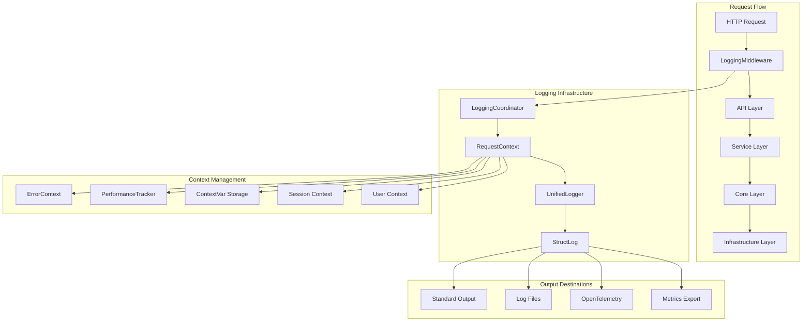
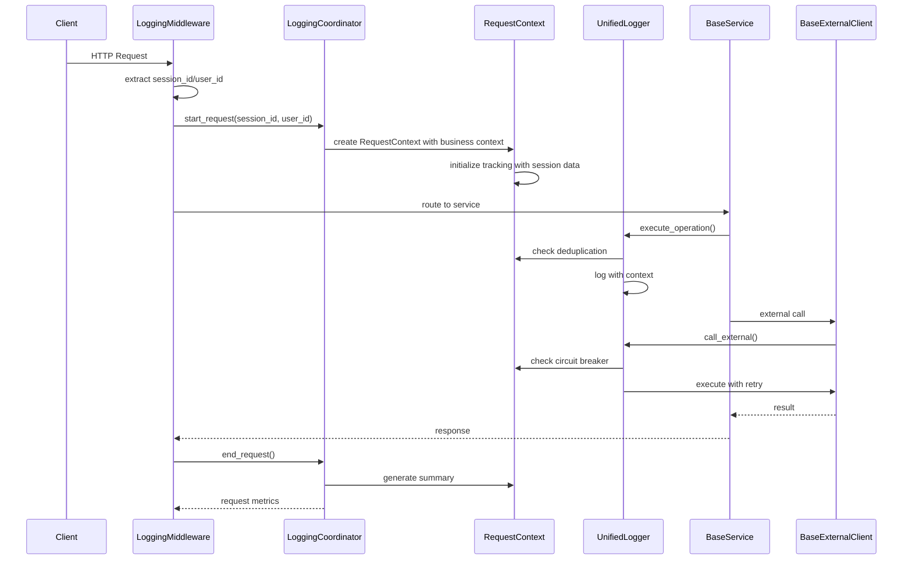
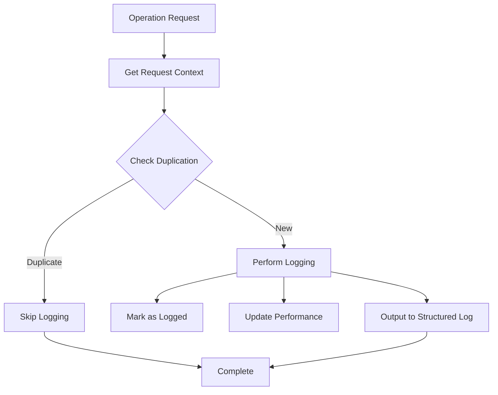
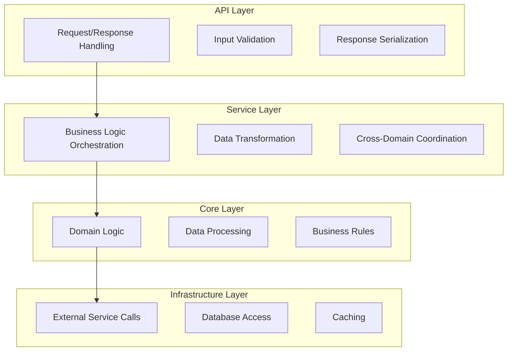
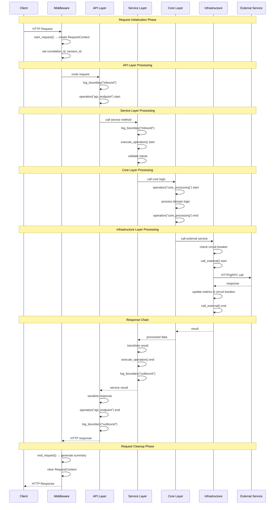
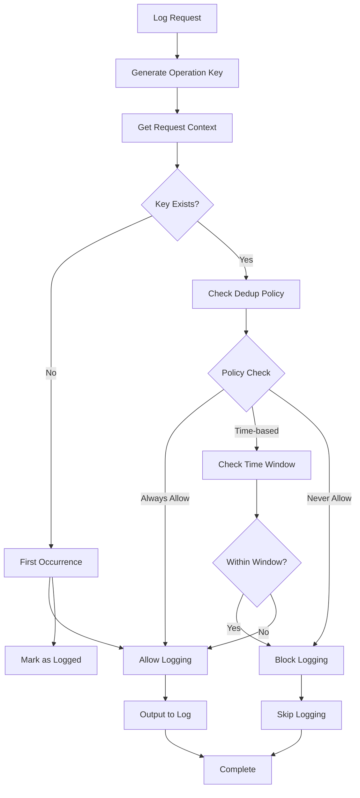

# FaultMaven Logging Strategy - Architecture Documentation

## Overview

This document provides detailed technical architecture documentation for the FaultMaven Improved Logging Strategy. It covers component interaction diagrams, layer boundaries, deduplication algorithms, context management, and performance considerations.

## Table of Contents

1. [System Architecture](#system-architecture)
2. [Component Details](#component-details)
3. [Layer Architecture](#layer-architecture)
4. [Request Lifecycle](#request-lifecycle)
5. [Deduplication Algorithms](#deduplication-algorithms)
6. [Context Management](#context-management)
7. [Performance Considerations](#performance-considerations)
8. [Integration Patterns](#integration-patterns)

## System Architecture

### High-Level Architecture Diagram



### Component Interaction Overview



## Component Details

### 1. LoggingCoordinator

**Purpose**: Central coordinator for request-scoped logging operations

```python
class LoggingCoordinator:
    """
    Manages the complete lifecycle of request logging.
    
    Responsibilities:
    - Initialize and cleanup request contexts
    - Coordinate between components
    - Generate request summaries
    - Manage context variable state
    """
    
    def __init__(self):
        self.context: Optional[RequestContext] = None
    
    def start_request(self, **initial_context) -> RequestContext:
        """Initialize request with context variables and tracking."""
        self.context = RequestContext(
            correlation_id=str(uuid.uuid4()),
            **initial_context
        )
        self.context.error_context = ErrorContext()
        self.context.performance_tracker = PerformanceTracker()
        
        # Set in thread-local context variable
        request_context.set(self.context)
        return self.context
    
    def end_request(self) -> Dict[str, Any]:
        """Clean up context and return request summary."""
        if not self.context:
            return {}
        
        summary = self._generate_summary()
        
        # Clean up context
        request_context.set(None)
        self.context = None
        
        return summary
```

**Key Features**:
- Thread-safe context management using `contextvars`
- Automatic correlation ID generation
- Request summary generation with metrics
- Clean resource management

### 2. RequestContext

**Purpose**: Single source of truth for request-scoped data

```python
@dataclass
class RequestContext:
    """
    Request-scoped context with deduplication and performance tracking.
    
    Architecture:
    - Immutable identification (correlation_id, session_id, etc.)
    - Mutable tracking (logged_operations, performance_tracker)
    - Error context for cascade prevention
    - Performance tracking with layer-specific thresholds
    """
    # Immutable request identification
    correlation_id: str = field(default_factory=lambda: str(uuid.uuid4()))
    session_id: Optional[str] = None
    user_id: Optional[str] = None
    investigation_id: Optional[str] = None
    agent_phase: Optional[str] = None
    start_time: datetime = field(default_factory=datetime.utcnow)
    
    # Mutable request state
    attributes: Dict[str, Any] = field(default_factory=dict)
    logged_operations: Set[str] = field(default_factory=set)
    error_context: Optional[ErrorContext] = None
    performance_tracker: Optional[PerformanceTracker] = None
```

**Context Data Flow**:
```
Request Start → Context Creation → Context Population → Operation Tracking → Request End
     ↓               ↓                    ↓                    ↓                ↓
Initialize      Set correlation      Add session/user    Track operations   Generate 
variables       ID and metadata      information         and performance    summary
```

### 3. UnifiedLogger

**Purpose**: Consistent logging interface across all application layers

```python
class UnifiedLogger:
    """
    Unified logging interface providing:
    - Operation context managers with timing
    - Service boundary logging
    - Automatic deduplication
    - Performance tracking
    - Error cascade prevention
    """
    
    def __init__(self, logger_name: str, layer: str):
        self.logger_name = logger_name
        self.layer = layer
        self.logger = get_logger(logger_name)
        self.coordinator = LoggingCoordinator()
```

**Logging Operation Flow**:


### 4. Base Classes Architecture

#### BaseService Architecture

```python
class BaseService(ABC):
    """
    Service layer base class providing:
    - Unified operation execution
    - Input validation patterns
    - Result transformation
    - Business event logging
    - Performance monitoring
    """
    
    async def execute_operation(
        self,
        operation_name: str,
        operation_func: Callable,
        *args,
        validate_inputs: Optional[Callable] = None,
        transform_result: Optional[Callable] = None,
        **kwargs
    ):
        """
        Standardized operation execution pattern:
        
        1. Log inbound service boundary
        2. Start operation context with timing
        3. Validate inputs if validator provided
        4. Execute operation function
        5. Transform result if transformer provided
        6. Log outbound service boundary
        7. Log business events
        8. Handle errors with cascade prevention
        """
```

#### BaseExternalClient Architecture

```python
class BaseExternalClient(ABC):
    """
    Infrastructure layer base class for EXTERNAL service integrations providing:
    - Circuit breaker protection
    - Retry mechanisms with exponential backoff
    - Response validation and transformation
    - Connection metrics tracking
    - Health monitoring
    - Comprehensive logging for external API monitoring
    
    Note: This is used for external service calls (LLM providers, APIs) that require
    full monitoring and logging. For internal infrastructure like Redis session 
    storage, use lightweight clients instead.
    """
    
    async def call_external(
        self,
        operation_name: str,
        call_func: Callable,
        *args,
        timeout: Optional[float] = None,
        retries: int = 0,
        **kwargs
    ):
        """
        External service call pattern:
        
        1. Check circuit breaker status
        2. Log inbound boundary
        3. Execute with retry logic
        4. Track connection metrics
        5. Update circuit breaker state
        6. Log outbound boundary
        7. Handle timeouts and failures
        """
```

#### Internal Infrastructure vs External Service Clients

**Architectural Principle**: The logging system distinguishes between internal infrastructure operations and external service monitoring:

```python
# INTERNAL INFRASTRUCTURE (Redis session storage)
# High-frequency operations, minimal logging overhead
class RedisSessionStore(ISessionStore):
    def __init__(self):
        # Uses lightweight Redis client - no verbose logging
        self.redis_client = create_redis_client()  # Simple factory function
    
    async def get(self, key: str) -> Optional[Dict]:
        # Direct Redis operations without comprehensive logging
        return await self.redis_client.get(f"{self.prefix}{key}")

# EXTERNAL SERVICE MONITORING (LLM providers, APIs)
# Lower-frequency operations, comprehensive monitoring needed
class LLMProvider(BaseExternalClient):
    async def generate_completion(self, prompt: str):
        # Uses BaseExternalClient with full logging, retries, circuit breakers
        return await self.call_external(
            "llm_completion",
            self._make_api_request,
            prompt,
            timeout=30.0,
            retries=3
        )
```

**Benefits of this separation**:
- **Performance**: Session operations don't generate excessive logs
- **Observability**: External service calls get full monitoring
- **Resource efficiency**: Internal operations use minimal overhead
- **Clear boundaries**: Explicit distinction between internal/external concerns

## Layer Architecture

### Layer Boundaries and Responsibilities



### Layer-Specific Logging Patterns

#### 1. API Layer Pattern
```python
# Characteristics:
# - Request/response boundary logging
# - Input validation logging
# - HTTP-specific context (method, endpoint, status)
# - Performance threshold: 100ms

@router.post("/api/v1/endpoint")
async def api_endpoint(request: RequestModel):
    logger.log_boundary("api_request", "inbound", {
        "method": "POST",
        "endpoint": "/api/v1/endpoint",
        "content_length": len(request.json())
    })
    
    async with logger.operation("api_endpoint", 
                               endpoint="/api/v1/endpoint") as ctx:
        # API logic here
        pass
```

#### 2. Service Layer Pattern
```python
# Characteristics:
# - Business operation logging
# - Cross-service coordination
# - Business event generation
# - Performance threshold: 500ms

class BusinessService(BaseService):
    async def business_operation(self, data):
        return await self.execute_operation(
            "business_operation",
            self._internal_business_logic,
            data,
            validate_inputs=self._validate_business_data,
            transform_result=self._transform_business_result
        )
```

#### 3. Core Layer Pattern
```python
# Characteristics:
# - Domain logic logging
# - Data processing tracking
# - Algorithm performance monitoring
# - Performance threshold: 300ms

async def core_processing(data):
    async with core_logger.operation("core_processing", 
                                   data_size=len(data)) as ctx:
        ctx["algorithm"] = "classification_v2"
        result = await classify_data(data)
        ctx["classification"] = result.classification
        return result
```

#### 4. Infrastructure Layer Pattern

**4a. External Service Pattern (Full Monitoring)**
```python
# Characteristics:
# - External service interaction logging
# - Circuit breaker status
# - Connection metrics
# - Performance threshold: 1000ms
# - Used for: LLM providers, external APIs, third-party services

class ExternalServiceClient(BaseExternalClient):
    async def external_operation(self, params):
        return await self.call_external(
            "external_api_call",
            self._make_api_request,
            params,
            timeout=10.0,
            retries=3,
            validate_response=self._validate_api_response
        )
```

**4b. Internal Infrastructure Pattern (Lightweight)**
```python
# Characteristics:
# - High-frequency internal operations
# - Minimal logging overhead
# - Direct client usage without BaseExternalClient
# - Performance threshold: 50ms
# - Used for: Redis session storage, internal caching, internal databases

class RedisSessionStore(ISessionStore):
    def __init__(self):
        # Lightweight Redis client for internal operations
        self.redis_client = create_redis_client()
    
    async def get(self, key: str) -> Optional[Dict]:
        # Direct operation - no comprehensive logging
        # Only application-level errors are logged, not every Redis call
        full_key = f"{self.prefix}{key}"
        data = await self.redis_client.get(full_key)
        return json.loads(data) if data else None
```

## Request Lifecycle

### Complete Request Processing Flow



### Performance Tracking Throughout Request

```python
# Request timeline with performance tracking
{
    "correlation_id": "req_12345",
    "request_timeline": {
        "start": "2024-01-15T10:30:45.123Z",
        "api_layer": {
            "start": "2024-01-15T10:30:45.125Z",
            "end": "2024-01-15T10:30:45.180Z", 
            "duration": 0.055,
            "threshold": 0.1,
            "violation": false
        },
        "service_layer": {
            "start": "2024-01-15T10:30:45.127Z",
            "end": "2024-01-15T10:30:45.175Z",
            "duration": 0.048,
            "threshold": 0.5, 
            "violation": false
        },
        "core_layer": {
            "start": "2024-01-15T10:30:45.130Z",
            "end": "2024-01-15T10:30:45.165Z",
            "duration": 0.035,
            "threshold": 0.3,
            "violation": false
        },
        "infrastructure_layer": {
            "start": "2024-01-15T10:30:45.135Z", 
            "end": "2024-01-15T10:30:45.160Z",
            "duration": 0.025,
            "threshold": 1.0,
            "violation": false
        },
        "end": "2024-01-15T10:30:45.182Z",
        "total_duration": 0.059
    }
}
```

## Deduplication Algorithms

### Operation Key Generation

```python
def generate_operation_key(
    layer: str, 
    operation_type: str, 
    operation_name: str, 
    direction: Optional[str] = None
) -> str:
    """
    Generate unique operation key for deduplication.
    
    Algorithm:
    1. Combine layer, operation_type, and operation_name
    2. Include direction for boundary operations
    3. Create deterministic hash
    4. Ensure uniqueness within request scope
    
    Examples:
    - "api.operation.process_query"
    - "service.boundary.user_service_call.inbound"
    - "infrastructure.external_call.redis_get"
    """
    components = [layer, operation_type, operation_name]
    if direction:
        components.append(direction)
    
    return ".".join(components)
```

### Deduplication Decision Tree



### Deduplication Policies

```python
class DeduplicationPolicy:
    """Configurable deduplication policies."""
    
    STRICT = "strict"           # No duplicates ever
    TIME_WINDOW = "time_window" # Allow after time window
    COUNT_BASED = "count_based" # Allow after N occurrences
    NONE = "none"              # No deduplication
    
    def __init__(self, policy: str = STRICT, **params):
        self.policy = policy
        self.params = params
    
    def should_allow_duplicate(
        self, 
        operation_key: str, 
        context: RequestContext
    ) -> bool:
        """Determine if duplicate logging should be allowed."""
        
        if self.policy == self.NONE:
            return True
        
        if self.policy == self.STRICT:
            return not context.has_logged(operation_key)
        
        if self.policy == self.TIME_WINDOW:
            last_logged = context.get_last_logged_time(operation_key)
            if not last_logged:
                return True
            
            window_seconds = self.params.get("window_seconds", 60)
            return (datetime.utcnow() - last_logged).seconds > window_seconds
        
        if self.policy == self.COUNT_BASED:
            count = context.get_operation_count(operation_key)
            max_count = self.params.get("max_count", 1)
            return count < max_count
        
        return False
```

## Context Management

### Enhanced Context Management (2025 Update)

FaultMaven's context management has been enhanced to include **session and user context continuity** across requests within the same session.

#### Context Components

1. **RequestContext**: Core context container with session/user data
   - `correlation_id`: Unique request identifier
   - `session_id`: Business session identifier (NEW)
   - `user_id`: User identifier from session lookup (NEW)  
   - `investigation_id`: Troubleshooting session identifier (NEW)
   - `agent_phase`: Current troubleshooting phase
   - `attributes`: Additional request metadata

2. **Session Context Integration**: 
   - LoggingMiddleware extracts `session_id` from requests
   - SessionService lookup provides `user_id` 
   - Context populated for entire request lifecycle
   - Enables session-aware tracing and logging

#### Context Population Flow


### ContextVar Implementation

```python
# Thread-safe context variable storage
from contextvars import ContextVar
from typing import Optional

# Global context variable for request context
request_context: ContextVar[Optional[RequestContext]] = ContextVar(
    'request_context',
    default=None
)

class ContextManager:
    """Manages context variables across async boundaries."""
    
    @staticmethod
    def set_context(context: RequestContext) -> None:
        """Set request context in current async context."""
        request_context.set(context)
    
    @staticmethod
    def get_context() -> Optional[RequestContext]:
        """Get current request context."""
        return request_context.get()
    
    @staticmethod
    def clear_context() -> None:
        """Clear current request context."""
        request_context.set(None)
    
    @staticmethod
    def copy_context() -> dict:
        """Copy current context for async task propagation."""
        return {
            'request_context': request_context.get()
        }
    
    @staticmethod
    def restore_context(context_copy: dict) -> None:
        """Restore context from copy."""
        if 'request_context' in context_copy:
            request_context.set(context_copy['request_context'])
```

### Context Propagation Patterns

#### 1. Automatic Propagation (Default)
```python
# Context automatically propagates through await calls
async def parent_function():
    # Context set here
    coordinator.start_request(session_id="123")
    
    # Context available in child function
    await child_function()

async def child_function():
    # Context automatically available
    ctx = request_context.get()
    logger.info("Child function", correlation_id=ctx.correlation_id)
```

#### 2. Manual Propagation for Background Tasks
```python
import asyncio
from contextvars import copy_context

async def create_background_task():
    # Copy current context
    current_context = copy_context()
    
    # Create task with context
    task = current_context.run(
        asyncio.create_task,
        background_operation()
    )
    
    return task

async def background_operation():
    # Context is available from parent
    ctx = request_context.get()
    logger.info("Background task", correlation_id=ctx.correlation_id)
```

#### 3. Context Isolation for Testing
```python
@pytest.fixture
async def isolated_context():
    """Provide isolated context for testing."""
    # Clear any existing context
    request_context.set(None)
    
    # Create test context
    coordinator = LoggingCoordinator()
    context = coordinator.start_request(session_id="test_session")
    
    yield context
    
    # Clean up after test
    coordinator.end_request()
    request_context.set(None)
```

## Performance Considerations

### Memory Usage Optimization

```python
class RequestContext:
    """Optimized for memory efficiency."""
    
    # Limit collections to prevent memory leaks
    MAX_LOGGED_OPERATIONS = 1000
    MAX_ATTRIBUTES_SIZE = 10000
    MAX_ERROR_HISTORY = 50
    
    def __post_init__(self):
        """Initialize with memory limits."""
        self._operation_count = 0
        self._attribute_size = 0
    
    def mark_logged(self, operation_key: str) -> None:
        """Mark operation as logged with memory management."""
        if self._operation_count >= self.MAX_LOGGED_OPERATIONS:
            # Remove oldest 10% of operations
            removal_count = self.MAX_LOGGED_OPERATIONS // 10
            oldest_operations = sorted(self.logged_operations)[:removal_count]
            for op in oldest_operations:
                self.logged_operations.discard(op)
            self._operation_count -= removal_count
        
        self.logged_operations.add(operation_key)
        self._operation_count += 1
    
    def set_attribute(self, key: str, value: Any) -> None:
        """Set attribute with size limits."""
        value_size = len(str(value))
        
        if self._attribute_size + value_size > self.MAX_ATTRIBUTES_SIZE:
            # Remove attributes to make space
            self._trim_attributes()
        
        self.attributes[key] = value
        self._attribute_size += value_size
```

### CPU Usage Optimization

```python
class PerformanceTracker:
    """Optimized performance tracking."""
    
    def __init__(self):
        # Pre-compile performance thresholds
        self.thresholds = {
            'api': float(os.getenv('LOG_PERF_THRESHOLD_API', '0.1')),
            'service': float(os.getenv('LOG_PERF_THRESHOLD_SERVICE', '0.5')),
            'core': float(os.getenv('LOG_PERF_THRESHOLD_CORE', '0.3')),
            'infrastructure': float(os.getenv('LOG_PERF_THRESHOLD_INFRASTRUCTURE', '1.0'))
        }
        
        # Use deque for efficient insertion/removal
        from collections import deque
        self.recent_timings = deque(maxlen=100)
    
    def record_timing(self, layer: str, operation: str, duration: float) -> tuple[bool, float]:
        """Optimized timing recording."""
        # Fast threshold lookup
        threshold = self.thresholds.get(layer, 1.0)
        exceeds_threshold = duration > threshold
        
        # Only store if needed for analysis
        if exceeds_threshold or len(self.recent_timings) < 50:
            self.recent_timings.append({
                'layer': layer,
                'operation': operation, 
                'duration': duration,
                'timestamp': time.time()
            })
        
        return exceeds_threshold, threshold
```

### I/O Optimization

```python
class AsyncLogBuffer:
    """Asynchronous log buffering for improved I/O performance."""
    
    def __init__(self, buffer_size: int = 1000, flush_interval: float = 1.0):
        self.buffer_size = buffer_size
        self.flush_interval = flush_interval
        self.buffer = []
        self.last_flush = time.time()
        self._lock = asyncio.Lock()
    
    async def add_log_entry(self, entry: dict) -> None:
        """Add log entry to buffer."""
        async with self._lock:
            self.buffer.append(entry)
            
            # Flush if buffer full or interval elapsed
            if (len(self.buffer) >= self.buffer_size or 
                time.time() - self.last_flush >= self.flush_interval):
                await self._flush_buffer()
    
    async def _flush_buffer(self) -> None:
        """Flush buffer to output."""
        if not self.buffer:
            return
        
        # Batch write to improve I/O performance
        batch = self.buffer[:]
        self.buffer.clear()
        self.last_flush = time.time()
        
        # Write batch asynchronously
        await self._write_batch(batch)
    
    async def _write_batch(self, entries: list) -> None:
        """Write batch of entries efficiently."""
        # Convert to newline-delimited JSON
        batch_content = '\n'.join(json.dumps(entry) for entry in entries) + '\n'
        
        # Async file write
        async with aiofiles.open('/app/logs/app.log', 'a') as f:
            await f.write(batch_content)
```

## Integration Patterns

### FastAPI Integration

```python
from fastapi import FastAPI, Request, Response
from faultmaven.api.middleware.logging import LoggingMiddleware

app = FastAPI()

# Add logging middleware first
app.add_middleware(LoggingMiddleware)

@app.middleware("http")
async def request_context_middleware(request: Request, call_next):
    """Ensure request context is available throughout request."""
    
    # Context is automatically created by LoggingMiddleware
    response = await call_next(request)
    
    # Context is automatically cleaned up by LoggingMiddleware
    return response
```

### Dependency Injection Integration

```python
from faultmaven.container import container
from faultmaven.services.base_service import BaseService

class IntegratedService(BaseService):
    """Service that integrates with DI container."""
    
    def __init__(self):
        super().__init__("integrated_service")
        
        # Get dependencies from container
        self.llm_provider = container.get_llm_provider()
        self.knowledge_service = container.get_knowledge_service()
        
        # Dependencies automatically have logging
        self.log_business_event(
            "service_dependencies_resolved",
            data={
                "llm_provider": type(self.llm_provider).__name__,
                "knowledge_service": type(self.knowledge_service).__name__
            }
        )
```

### OpenTelemetry Integration

```python
from opentelemetry import trace
from opentelemetry.propagate import inject, extract

class TracingIntegration:
    """Integration with OpenTelemetry tracing."""
    
    @staticmethod
    def start_span_with_logging_context(operation_name: str):
        """Start span with logging context correlation."""
        tracer = trace.get_tracer(__name__)
        
        # Get current logging context
        log_ctx = request_context.get()
        
        # Start span with correlation
        span = tracer.start_span(
            operation_name,
            attributes={
                'correlation_id': log_ctx.correlation_id if log_ctx else None,
                'session_id': log_ctx.session_id if log_ctx else None,
                'layer': 'service'
            }
        )
        
        return span
    
    @staticmethod
    def inject_trace_context(headers: dict) -> dict:
        """Inject trace context into headers for external calls."""
        inject(headers)
        return headers
    
    @staticmethod
    def extract_trace_context(headers: dict) -> None:
        """Extract trace context from incoming headers."""
        ctx = extract(headers)
        # Context is automatically set by OpenTelemetry
```

This architecture documentation provides the technical foundation for understanding, maintaining, and extending the FaultMaven logging system. The modular design ensures that each component has clear responsibilities while working together to provide comprehensive observability across all application layers.