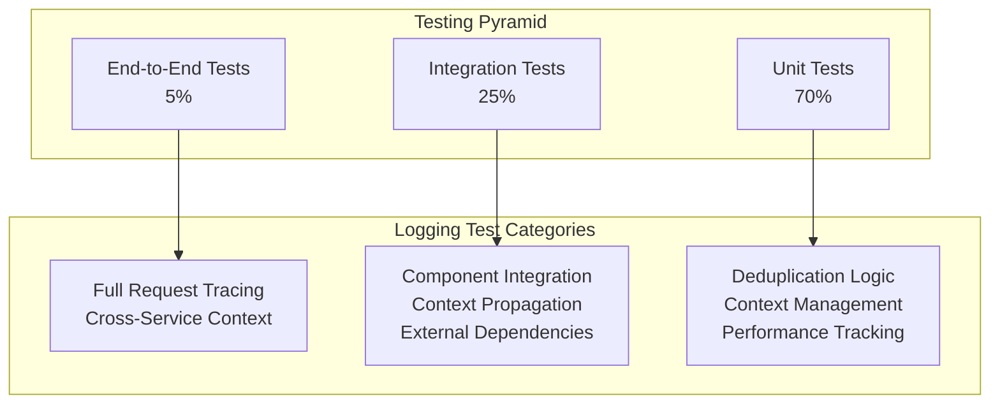

# FaultMaven Logging Strategy - Testing Guide

## Overview

This guide provides comprehensive testing strategies, patterns, and examples for the FaultMaven logging system. It covers unit testing, integration testing, performance testing, and mock strategies for all logging components.

## Table of Contents

1. [Testing Strategy Overview](#testing-strategy-overview)
2. [Unit Testing Patterns](#unit-testing-patterns)
3. [Integration Testing](#integration-testing)
4. [Performance Testing](#performance-testing)
5. [Mock Strategies](#mock-strategies)
6. [Test Fixtures and Utilities](#test-fixtures-and-utilities)
7. [Continuous Integration](#continuous-integration)
8. [Testing Best Practices](#testing-best-practices)

## Testing Strategy Overview

### Testing Pyramid for Logging



### Test Coverage Goals

| Component | Unit Test Coverage | Integration Coverage |
|-----------|-------------------|---------------------|
| LoggingCoordinator | 95% | 85% |
| RequestContext | 90% | 80% |
| UnifiedLogger | 90% | 85% |
| BaseService | 85% | 80% |
| BaseExternalClient | 85% | 80% |
| Performance Tracking | 95% | 70% |
| Error Handling | 90% | 85% |

## Unit Testing Patterns

### 1. Testing LoggingCoordinator

```python
import pytest
from unittest.mock import Mock, patch
from faultmaven.infrastructure.logging.coordinator import LoggingCoordinator, RequestContext

class TestLoggingCoordinator:
    """Unit tests for LoggingCoordinator."""
    
    @pytest.fixture
    def coordinator(self):
        """Provide a fresh coordinator for each test."""
        return LoggingCoordinator()
    
    def test_start_request_creates_context(self, coordinator):
        """Test that start_request creates and initializes context."""
        # Execute
        context = coordinator.start_request(
            session_id="test_session",
            user_id="test_user"
        )
        
        # Verify
        assert context is not None
        assert context.session_id == "test_session"
        assert context.user_id == "test_user"
        assert context.correlation_id is not None
        assert len(context.correlation_id) > 0
        assert context.error_context is not None
        assert context.performance_tracker is not None
    
    def test_end_request_generates_summary(self, coordinator):
        """Test that end_request generates proper summary."""
        # Setup
        context = coordinator.start_request(session_id="test")
        context.mark_logged("test_operation")
        
        # Execute  
        summary = coordinator.end_request()
        
        # Verify
        assert "correlation_id" in summary
        assert "duration_seconds" in summary
        assert "operations_logged" in summary
        assert summary["operations_logged"] == 1
        assert isinstance(summary["duration_seconds"], float)
        assert summary["duration_seconds"] >= 0
    
    def test_context_cleanup_after_end_request(self, coordinator):
        """Test that context is properly cleaned up."""
        # Setup
        coordinator.start_request(session_id="test")
        
        # Execute
        coordinator.end_request()
        
        # Verify
        assert coordinator.context is None
    
    @patch('faultmaven.infrastructure.logging.coordinator.request_context')
    def test_context_variable_management(self, mock_context_var, coordinator):
        """Test context variable is properly managed."""
        # Setup
        mock_context_var.set = Mock()
        mock_context_var.get = Mock(return_value=None)
        
        # Execute
        context = coordinator.start_request()
        coordinator.end_request()
        
        # Verify context variable interactions
        assert mock_context_var.set.call_count == 2  # Set context, then clear
        mock_context_var.set.assert_any_call(context)
        mock_context_var.set.assert_any_call(None)
```

### 2. Testing RequestContext Deduplication

```python
class TestRequestContextDeduplication:
    """Test deduplication logic in RequestContext."""
    
    @pytest.fixture
    def context(self):
        """Provide a fresh context for each test."""
        return RequestContext(correlation_id="test_correlation")
    
    def test_has_logged_returns_false_for_new_operation(self, context):
        """Test has_logged returns False for new operations."""
        assert not context.has_logged("new_operation")
    
    def test_has_logged_returns_true_after_marking(self, context):
        """Test has_logged returns True after marking operation as logged."""
        # Execute
        context.mark_logged("test_operation")
        
        # Verify
        assert context.has_logged("test_operation")
    
    def test_mark_logged_prevents_duplicates(self, context):
        """Test that marking prevents duplicate operations."""
        operation_key = "duplicate_test"
        
        # First call should be new
        assert not context.has_logged(operation_key)
        context.mark_logged(operation_key)
        
        # Second call should be duplicate
        assert context.has_logged(operation_key)
    
    def test_different_operations_logged_separately(self, context):
        """Test that different operations are tracked separately."""
        # Execute
        context.mark_logged("operation_a")
        
        # Verify
        assert context.has_logged("operation_a")
        assert not context.has_logged("operation_b")
        
        # Mark second operation
        context.mark_logged("operation_b")
        assert context.has_logged("operation_b")
    
    def test_operation_key_uniqueness(self, context):
        """Test that similar but different operation keys are distinct."""
        # Setup similar keys
        key1 = "api.operation.test"
        key2 = "api.operation.test.retry"
        key3 = "service.operation.test"
        
        # Execute
        context.mark_logged(key1)
        
        # Verify uniqueness
        assert context.has_logged(key1)
        assert not context.has_logged(key2)
        assert not context.has_logged(key3)
```

### 3. Testing Performance Tracking

```python
from faultmaven.infrastructure.logging.coordinator import PerformanceTracker
import time

class TestPerformanceTracker:
    """Test performance tracking functionality."""
    
    @pytest.fixture
    def tracker(self):
        """Provide a fresh performance tracker."""
        return PerformanceTracker()
    
    def test_default_thresholds_configured(self, tracker):
        """Test that default performance thresholds are set."""
        expected_thresholds = {
            'api': 0.1,
            'service': 0.5,
            'core': 0.3,
            'infrastructure': 1.0
        }
        
        assert tracker.thresholds == expected_thresholds
    
    def test_record_timing_below_threshold(self, tracker):
        """Test recording timing below threshold."""
        # Execute
        exceeds, threshold = tracker.record_timing("api", "fast_operation", 0.05)
        
        # Verify
        assert not exceeds
        assert threshold == 0.1
        assert "api.fast_operation" in tracker.layer_timings
        assert tracker.layer_timings["api.fast_operation"] == 0.05
    
    def test_record_timing_above_threshold(self, tracker):
        """Test recording timing above threshold."""
        # Execute
        exceeds, threshold = tracker.record_timing("api", "slow_operation", 0.15)
        
        # Verify
        assert exceeds
        assert threshold == 0.1
        assert tracker.layer_timings["api.slow_operation"] == 0.15
    
    def test_unknown_layer_uses_default_threshold(self, tracker):
        """Test that unknown layers use default threshold."""
        # Execute
        exceeds, threshold = tracker.record_timing("unknown", "operation", 0.8)
        
        # Verify
        assert threshold == 1.0  # Default threshold
        assert not exceeds
    
    def test_multiple_timings_same_operation(self, tracker):
        """Test recording multiple timings for same operation."""
        operation = "api.repeated_operation"
        
        # Record multiple timings
        tracker.record_timing("api", "repeated_operation", 0.05)
        tracker.record_timing("api", "repeated_operation", 0.08)
        
        # Verify latest timing is stored
        assert tracker.layer_timings[operation] == 0.08
```

### 4. Testing UnifiedLogger

```python
from unittest.mock import AsyncMock, Mock, patch
from faultmaven.infrastructure.logging.unified import UnifiedLogger

class TestUnifiedLogger:
    """Test UnifiedLogger functionality."""
    
    @pytest.fixture
    def logger(self):
        """Provide UnifiedLogger instance."""
        with patch('faultmaven.infrastructure.logging.unified.get_logger') as mock_get_logger:
            mock_structlog_logger = Mock()
            mock_get_logger.return_value = mock_structlog_logger
            
            unified_logger = UnifiedLogger("test.logger", "service")
            unified_logger.logger = mock_structlog_logger
            return unified_logger
    
    def test_log_boundary_with_context(self, logger):
        """Test boundary logging with request context."""
        # Setup context
        mock_context = Mock()
        mock_context.has_logged.return_value = False
        
        with patch('faultmaven.infrastructure.logging.unified.request_context') as mock_ctx_var:
            mock_ctx_var.get.return_value = mock_context
            
            # Execute
            logger.log_boundary("test_operation", "inbound", {"key": "value"})
            
            # Verify context check
            operation_key = "service.boundary.test_operation.inbound"
            mock_context.has_logged.assert_called_with(operation_key)
    
    @pytest.mark.asyncio
    async def test_operation_context_manager_success(self, logger):
        """Test operation context manager for successful operations."""
        # Setup
        mock_context = Mock()
        mock_context.has_logged.return_value = False
        mock_context.performance_tracker = Mock()
        mock_context.performance_tracker.record_timing.return_value = (False, 0.5)
        
        with patch('faultmaven.infrastructure.logging.unified.request_context') as mock_ctx_var:
            mock_ctx_var.get.return_value = mock_context
            
            # Execute
            async with logger.operation("test_operation", test_param="value") as ctx:
                ctx["result"] = "success"
                # Simulate some work
                pass
            
            # Verify timing was recorded
            mock_context.performance_tracker.record_timing.assert_called_once()
            args = mock_context.performance_tracker.record_timing.call_args[0]
            assert args[0] == "service"  # layer
            assert args[1] == "test_operation"  # operation
            assert isinstance(args[2], float)  # duration
    
    @pytest.mark.asyncio  
    async def test_operation_context_manager_error_handling(self, logger):
        """Test operation context manager error handling."""
        # Setup
        mock_context = Mock()
        mock_context.error_context = Mock()
        mock_context.error_context.should_log_error.return_value = True
        
        with patch('faultmaven.infrastructure.logging.unified.request_context') as mock_ctx_var:
            mock_ctx_var.get.return_value = mock_context
            
            # Execute and verify exception propagation
            test_exception = ValueError("Test error")
            
            with pytest.raises(ValueError):
                async with logger.operation("failing_operation") as ctx:
                    raise test_exception
            
            # Verify error was recorded in context
            mock_context.error_context.add_layer_error.assert_called_with("service", test_exception)
    
    def test_log_metric_with_tags(self, logger):
        """Test metric logging with tags."""
        # Setup
        mock_context = Mock()
        
        with patch('faultmaven.infrastructure.logging.unified.request_context') as mock_ctx_var:
            mock_ctx_var.get.return_value = mock_context
            with patch('faultmaven.infrastructure.logging.coordinator.LoggingCoordinator.log_once') as mock_log_once:
                
                # Execute
                logger.log_metric(
                    "test_metric", 
                    42, 
                    "count",
                    tags={"environment": "test"}
                )
                
                # Verify log_once was called with metric data
                mock_log_once.assert_called_once()
                call_args = mock_log_once.call_args[1]
                assert call_args["metric_name"] == "test_metric"
                assert call_args["metric_value"] == 42
                assert call_args["metric_tags"] == {"environment": "test"}
```

## Integration Testing

### 1. Testing Service Layer Integration

```python
import pytest
from unittest.mock import AsyncMock, Mock, patch
from faultmaven.services.base import BaseService
from faultmaven.infrastructure.logging.coordinator import LoggingCoordinator

class TestServiceIntegration:
    """Integration tests for BaseService with logging."""
    
    class TestService(BaseService):
        """Test service for integration testing."""
        
        def __init__(self):
            super().__init__("test_service")
        
        async def test_operation(self, data):
            """Test operation that processes data."""
            return {"processed": data, "status": "success"}
        
        async def failing_operation(self, data):
            """Test operation that fails."""
            raise ValueError("Operation failed")
    
    @pytest.fixture
    async def service_with_context(self):
        """Provide service with initialized request context."""
        coordinator = LoggingCoordinator()
        context = coordinator.start_request(session_id="integration_test")
        
        service = self.TestService()
        
        yield service, context, coordinator
        
        # Cleanup
        coordinator.end_request()
    
    @pytest.mark.asyncio
    async def test_execute_operation_success_flow(self, service_with_context):
        """Test successful operation execution with logging integration."""
        service, context, coordinator = service_with_context
        
        # Execute
        result = await service.execute_operation(
            "test_operation",
            service.test_operation,
            {"input": "data"}
        )
        
        # Verify result
        assert result == {"processed": {"input": "data"}, "status": "success"}
        
        # Verify logging integration
        assert len(context.logged_operations) > 0
        
        # Check for expected operation keys
        operation_keys = list(context.logged_operations)
        boundary_keys = [key for key in operation_keys if "boundary" in key]
        operation_lifecycle_keys = [key for key in operation_keys if "operation" in key]
        
        assert len(boundary_keys) >= 2  # inbound and outbound
        assert len(operation_lifecycle_keys) >= 2  # start and end
    
    @pytest.mark.asyncio
    async def test_execute_operation_error_handling(self, service_with_context):
        """Test error handling in operation execution."""
        service, context, coordinator = service_with_context
        
        # Execute and expect RuntimeError (wrapped by BaseService)
        with pytest.raises(RuntimeError) as exc_info:
            await service.execute_operation(
                "failing_operation",
                service.failing_operation,
                {"input": "data"}
            )
        
        # Verify error is wrapped with context
        assert "Service operation failed" in str(exc_info.value)
        assert "test_service.failing_operation" in str(exc_info.value)
        
        # Verify error context
        assert context.error_context is not None
        assert len(context.error_context.layer_errors) > 0
        assert "service" in context.error_context.layer_errors
    
    @pytest.mark.asyncio
    async def test_operation_timing_integration(self, service_with_context):
        """Test performance timing integration."""
        service, context, coordinator = service_with_context
        
        # Execute operation
        await service.execute_operation(
            "test_operation",
            service.test_operation,
            {"input": "data"}
        )
        
        # Verify performance tracking
        assert context.performance_tracker is not None
        assert len(context.performance_tracker.layer_timings) > 0
        
        # Check for service layer timing
        service_timings = {k: v for k, v in context.performance_tracker.layer_timings.items() 
                          if k.startswith("service.")}
        assert len(service_timings) > 0
        
        # Verify timing values are reasonable
        for timing in service_timings.values():
            assert 0 <= timing <= 10  # Should complete within 10 seconds
```

### 2. Testing Infrastructure Layer Integration

```python
from faultmaven.infrastructure.base_client import BaseExternalClient, CircuitBreakerError

class TestInfrastructureIntegration:
    """Integration tests for BaseExternalClient."""
    
    class TestExternalClient(BaseExternalClient):
        """Test client for integration testing."""
        
        def __init__(self, enable_circuit_breaker=True):
            super().__init__(
                "test_client",
                "TestService", 
                enable_circuit_breaker=enable_circuit_breaker,
                circuit_breaker_threshold=3,
                circuit_breaker_timeout=1
            )
        
        async def successful_call(self, data):
            """Mock successful external call."""
            return {"result": data, "status": "ok"}
        
        async def failing_call(self, data):
            """Mock failing external call."""
            raise ConnectionError("External service unavailable")
        
        async def slow_call(self, data):
            """Mock slow external call."""
            import asyncio
            await asyncio.sleep(0.1)
            return {"result": data, "status": "slow"}
    
    @pytest.fixture
    async def client_with_context(self):
        """Provide client with request context."""
        coordinator = LoggingCoordinator()
        context = coordinator.start_request(session_id="infra_test")
        
        client = self.TestExternalClient()
        
        yield client, context, coordinator
        
        coordinator.end_request()
    
    @pytest.mark.asyncio
    async def test_call_external_success_with_logging(self, client_with_context):
        """Test successful external call with logging integration."""
        client, context, coordinator = client_with_context
        
        # Execute
        result = await client.call_external(
            "test_call",
            client.successful_call,
            {"test": "data"}
        )
        
        # Verify result
        assert result == {"result": {"test": "data"}, "status": "ok"}
        
        # Verify logging
        assert len(context.logged_operations) > 0
        
        # Check for infrastructure layer operations
        infra_operations = [key for key in context.logged_operations 
                           if key.startswith("infrastructure.")]
        assert len(infra_operations) > 0
    
    @pytest.mark.asyncio
    async def test_circuit_breaker_integration(self, client_with_context):
        """Test circuit breaker integration with logging."""
        client, context, coordinator = client_with_context
        
        # Fail enough times to open circuit breaker
        for i in range(4):  # Threshold is 3, so 4th call should open
            try:
                await client.call_external(
                    "failing_call",
                    client.failing_call,
                    {"attempt": i}
                )
            except RuntimeError:
                pass  # Expected failure
        
        # Verify circuit breaker is open
        assert client.circuit_breaker.state == "open"
        
        # Next call should raise CircuitBreakerError
        with pytest.raises(CircuitBreakerError):
            await client.call_external(
                "blocked_call",
                client.successful_call,
                {"should": "fail"}
            )
        
        # Verify circuit breaker metrics
        assert client.connection_metrics["circuit_breaker_trips"] > 0
        assert client.connection_metrics["failed_calls"] >= 3
```

### 3. Testing Cross-Layer Context Propagation

```python
class TestContextPropagation:
    """Test context propagation across layers."""
    
    @pytest.fixture
    async def multi_layer_setup(self):
        """Setup multiple layers with context."""
        coordinator = LoggingCoordinator()
        context = coordinator.start_request(
            session_id="cross_layer_test",
            user_id="test_user"
        )
        
        # Create instances from different layers
        api_logger = get_unified_logger("test.api", "api")
        service = TestServiceIntegration.TestService()
        client = TestInfrastructureIntegration.TestExternalClient()
        
        yield {
            "coordinator": coordinator,
            "context": context,
            "api_logger": api_logger,
            "service": service,
            "client": client
        }
        
        coordinator.end_request()
    
    @pytest.mark.asyncio
    async def test_context_propagation_through_layers(self, multi_layer_setup):
        """Test that context propagates through all layers."""
        setup = multi_layer_setup
        
        # API layer logs
        async with setup["api_logger"].operation("api_request") as api_ctx:
            api_ctx["endpoint"] = "/test"
            
            # Service layer operation
            result = await setup["service"].execute_operation(
                "service_operation",
                setup["service"].test_operation,
                {"from": "api"}
            )
            
            # Infrastructure layer call
            external_result = await setup["client"].call_external(
                "external_call",
                setup["client"].successful_call,
                {"from": "service"}
            )
        
        # Verify all layers logged to same context
        context = setup["context"]
        
        # Should have operations from all layers
        api_operations = [k for k in context.logged_operations if ".api." in k]
        service_operations = [k for k in context.logged_operations if ".service." in k]
        infra_operations = [k for k in context.logged_operations if ".infrastructure." in k]
        
        assert len(api_operations) > 0
        assert len(service_operations) > 0  
        assert len(infra_operations) > 0
        
        # All operations should share same correlation ID
        assert context.correlation_id is not None
        assert context.session_id == "cross_layer_test"
        assert context.user_id == "test_user"
```

## Performance Testing

### 1. Load Testing Logging Performance

```python
import asyncio
import time
import statistics
from concurrent.futures import ThreadPoolExecutor

class TestLoggingPerformance:
    """Performance tests for logging system."""
    
    @pytest.mark.asyncio
    async def test_concurrent_request_performance(self):
        """Test performance with concurrent requests."""
        async def simulate_request():
            """Simulate a single request with logging."""
            coordinator = LoggingCoordinator()
            context = coordinator.start_request(session_id="perf_test")
            
            # Simulate API layer
            api_logger = get_unified_logger("perf.api", "api")
            async with api_logger.operation("api_request") as api_ctx:
                api_ctx["simulated"] = True
                
                # Simulate service calls
                for i in range(5):
                    service_logger = get_unified_logger("perf.service", "service")
                    async with service_logger.operation(f"service_op_{i}") as svc_ctx:
                        svc_ctx["iteration"] = i
                        
                        # Simulate some processing time
                        await asyncio.sleep(0.001)
            
            summary = coordinator.end_request()
            return summary["duration_seconds"]
        
        # Run concurrent requests
        concurrent_requests = 100
        start_time = time.time()
        
        tasks = [simulate_request() for _ in range(concurrent_requests)]
        durations = await asyncio.gather(*tasks)
        
        total_time = time.time() - start_time
        
        # Performance assertions
        assert total_time < 10  # Should complete in under 10 seconds
        assert statistics.mean(durations) < 1.0  # Average request under 1 second
        assert max(durations) < 2.0  # No request over 2 seconds
        
        print(f"\nPerformance Results:")
        print(f"Total time: {total_time:.2f}s")
        print(f"Requests/sec: {concurrent_requests / total_time:.1f}")
        print(f"Average duration: {statistics.mean(durations):.3f}s")
        print(f"95th percentile: {statistics.quantiles(durations, n=20)[18]:.3f}s")
    
    def test_memory_usage_under_load(self):
        """Test memory usage doesn't grow excessively."""
        import psutil
        import gc
        
        process = psutil.Process()
        initial_memory = process.memory_info().rss / 1024 / 1024  # MB
        
        # Create many contexts to test memory management
        contexts = []
        for i in range(1000):
            coordinator = LoggingCoordinator()
            context = coordinator.start_request(session_id=f"memory_test_{i}")
            
            # Add many operations to test deduplication limits
            for j in range(100):
                context.mark_logged(f"operation_{j}")
            
            contexts.append((coordinator, context))
        
        # Measure memory after context creation
        mid_memory = process.memory_info().rss / 1024 / 1024  # MB
        
        # Clean up contexts
        for coordinator, context in contexts:
            coordinator.end_request()
        
        # Force garbage collection
        gc.collect()
        
        final_memory = process.memory_info().rss / 1024 / 1024  # MB
        
        # Memory growth should be reasonable
        memory_growth = final_memory - initial_memory
        assert memory_growth < 100  # Less than 100MB growth
        
        print(f"\nMemory Usage:")
        print(f"Initial: {initial_memory:.1f}MB")
        print(f"Peak: {mid_memory:.1f}MB")  
        print(f"Final: {final_memory:.1f}MB")
        print(f"Growth: {memory_growth:.1f}MB")
    
    @pytest.mark.asyncio
    async def test_deduplication_performance(self):
        """Test performance of deduplication under load."""
        coordinator = LoggingCoordinator()
        context = coordinator.start_request(session_id="dedup_perf_test")
        
        # Test with many duplicate operations
        num_operations = 10000
        unique_operations = 100  # 1% unique, 99% duplicates
        
        start_time = time.time()
        
        for i in range(num_operations):
            operation_key = f"operation_{i % unique_operations}"
            context.mark_logged(operation_key)
            
            # Check deduplication
            is_duplicate = context.has_logged(operation_key)
            assert is_duplicate  # Should always be true after marking
        
        dedup_time = time.time() - start_time
        
        # Performance assertions
        assert dedup_time < 1.0  # Should complete in under 1 second
        assert len(context.logged_operations) == unique_operations  # Only unique stored
        
        coordinator.end_request()
        
        print(f"\nDeduplication Performance:")
        print(f"Operations processed: {num_operations}")
        print(f"Unique operations: {len(context.logged_operations)}")
        print(f"Processing time: {dedup_time:.3f}s")
        print(f"Operations/sec: {num_operations / dedup_time:.0f}")
```

## Mock Strategies

### 1. Mocking External Dependencies

```python
from unittest.mock import Mock, AsyncMock, patch
import pytest

class LoggingTestMocks:
    """Collection of mock strategies for logging components."""
    
    @staticmethod
    @pytest.fixture
    def mock_structlog_logger():
        """Mock structlog logger."""
        mock_logger = Mock()
        mock_logger.info = Mock()
        mock_logger.warning = Mock()
        mock_logger.error = Mock()
        mock_logger.debug = Mock()
        mock_logger.critical = Mock()
        return mock_logger
    
    @staticmethod
    @pytest.fixture
    def mock_request_context():
        """Mock request context with common behavior."""
        mock_context = Mock()
        mock_context.correlation_id = "test_correlation_123"
        mock_context.session_id = "test_session"
        mock_context.user_id = "test_user"
        mock_context.logged_operations = set()
        
        # Mock deduplication behavior
        def has_logged_side_effect(operation_key):
            return operation_key in mock_context.logged_operations
        
        def mark_logged_side_effect(operation_key):
            mock_context.logged_operations.add(operation_key)
        
        mock_context.has_logged.side_effect = has_logged_side_effect
        mock_context.mark_logged.side_effect = mark_logged_side_effect
        
        # Mock performance tracker
        mock_context.performance_tracker = Mock()
        mock_context.performance_tracker.record_timing.return_value = (False, 0.5)
        
        # Mock error context
        mock_context.error_context = Mock()
        mock_context.error_context.should_log_error.return_value = True
        
        return mock_context
    
    @staticmethod
    @pytest.fixture
    def mock_logging_coordinator():
        """Mock logging coordinator."""
        mock_coordinator = Mock()
        
        # Mock context creation
        mock_context = LoggingTestMocks.mock_request_context()
        mock_coordinator.start_request.return_value = mock_context
        mock_coordinator.end_request.return_value = {
            "correlation_id": "test_correlation_123",
            "duration_seconds": 0.123,
            "operations_logged": 5,
            "errors_encountered": 0,
            "performance_violations": 0
        }
        
        return mock_coordinator
    
    @staticmethod
    def mock_external_service_success():
        """Mock successful external service calls."""
        return AsyncMock(return_value={"status": "success", "data": "test_data"})
    
    @staticmethod
    def mock_external_service_failure():
        """Mock failing external service calls."""
        mock_service = AsyncMock()
        mock_service.side_effect = ConnectionError("Service unavailable")
        return mock_service
    
    @staticmethod
    def mock_external_service_timeout():
        """Mock timing out external service calls."""
        async def timeout_call(*args, **kwargs):
            import asyncio
            await asyncio.sleep(10)  # Will timeout if timeout < 10
        
        return AsyncMock(side_effect=timeout_call)
```

### 2. Integration Test Mocks

```python
class TestWithMocks:
    """Example tests using mock strategies."""
    
    def test_service_with_mock_dependencies(self, mock_request_context, mock_structlog_logger):
        """Test service with all dependencies mocked."""
        
        with patch('faultmaven.infrastructure.logging.unified.get_logger') as mock_get_logger:
            mock_get_logger.return_value = mock_structlog_logger
            
            with patch('faultmaven.infrastructure.logging.unified.request_context') as mock_ctx_var:
                mock_ctx_var.get.return_value = mock_request_context
                
                # Create service
                service = TestServiceIntegration.TestService()
                logger = service.logger
                
                # Test boundary logging
                logger.log_boundary("test_operation", "inbound", {"test": "data"})
                
                # Verify mocked interactions
                assert mock_request_context.has_logged.called
                mock_structlog_logger.info.assert_called()
    
    @pytest.mark.asyncio
    async def test_external_client_with_mock_service(self):
        """Test external client with mocked external service."""
        
        # Setup mocks
        mock_service = LoggingTestMocks.mock_external_service_success()
        
        # Create client
        client = TestInfrastructureIntegration.TestExternalClient()
        
        # Mock the request context
        coordinator = LoggingCoordinator()  # Real coordinator
        context = coordinator.start_request(session_id="mock_test")
        
        try:
            # Execute with mock
            result = await client.call_external(
                "mock_service_call",
                mock_service,
                {"test": "data"},
                timeout=1.0
            )
            
            # Verify mock was called
            mock_service.assert_called_once_with({"test": "data"})
            
            # Verify result
            assert result["status"] == "success"
            
        finally:
            coordinator.end_request()
```

## Test Fixtures and Utilities

### 1. Common Test Fixtures

```python
# conftest.py - Pytest configuration and shared fixtures

import pytest
import asyncio
from faultmaven.infrastructure.logging.coordinator import LoggingCoordinator

@pytest.fixture(scope="function")
def event_loop():
    """Create event loop for async tests."""
    loop = asyncio.new_event_loop()
    yield loop
    loop.close()

@pytest.fixture
async def logging_coordinator():
    """Provide a fresh logging coordinator."""
    coordinator = LoggingCoordinator()
    yield coordinator
    
    # Cleanup - ensure request is ended
    try:
        coordinator.end_request()
    except:
        pass  # May not have active request

@pytest.fixture
async def request_context_fixture():
    """Provide request context for testing."""
    coordinator = LoggingCoordinator()
    context = coordinator.start_request(
        session_id="fixture_test",
        user_id="test_user"
    )
    
    yield context
    
    # Cleanup
    coordinator.end_request()

@pytest.fixture
def isolated_logging_environment():
    """Provide isolated logging environment for tests."""
    # Clear any existing context
    from faultmaven.infrastructure.logging.coordinator import request_context
    original_context = request_context.get()
    request_context.set(None)
    
    yield
    
    # Restore original context
    request_context.set(original_context)

@pytest.fixture
async def performance_test_context():
    """Provide context optimized for performance testing."""
    coordinator = LoggingCoordinator()
    context = coordinator.start_request(session_id="perf_test")
    
    # Pre-populate with some operations to simulate realistic conditions
    for i in range(10):
        context.mark_logged(f"startup_operation_{i}")
    
    yield context, coordinator
    
    coordinator.end_request()
```

### 2. Test Utilities

```python
# test_utilities.py - Helper functions for testing

import time
import asyncio
from typing import Dict, Any, List
from contextlib import asynccontextmanager

class LoggingTestUtils:
    """Utilities for testing logging functionality."""
    
    @staticmethod
    def create_test_request_data() -> Dict[str, Any]:
        """Create realistic test request data."""
        return {
            "session_id": f"test_session_{int(time.time())}",
            "user_id": "test_user_123", 
            "investigation_id": f"inv_{int(time.time())}",
            "agent_phase": "define_blast_radius"
        }
    
    @staticmethod
    async def simulate_request_lifecycle(
        operations: List[Dict[str, Any]],
        include_errors: bool = False
    ) -> Dict[str, Any]:
        """
        Simulate a complete request lifecycle with specified operations.
        
        Args:
            operations: List of operation specs [{"layer": "api", "name": "test", "duration": 0.1}]
            include_errors: Whether to simulate errors
            
        Returns:
            Request summary
        """
        coordinator = LoggingCoordinator()
        context = coordinator.start_request(**LoggingTestUtils.create_test_request_data())
        
        try:
            for op in operations:
                layer = op.get("layer", "service")
                operation_name = op.get("name", "test_operation")
                duration = op.get("duration", 0.01)
                should_fail = op.get("fail", False) and include_errors
                
                # Get appropriate logger
                from faultmaven.infrastructure.logging.unified import get_unified_logger
                logger = get_unified_logger(f"test.{layer}", layer)
                
                # Execute operation
                if should_fail:
                    try:
                        async with logger.operation(operation_name) as ctx:
                            await asyncio.sleep(duration)
                            raise ValueError(f"Simulated error in {operation_name}")
                    except ValueError:
                        pass  # Expected error
                else:
                    async with logger.operation(operation_name) as ctx:
                        await asyncio.sleep(duration)
                        ctx["simulated"] = True
            
        finally:
            summary = coordinator.end_request()
        
        return summary
    
    @staticmethod
    def assert_operation_logged(context, layer: str, operation: str, direction: str = None):
        """Assert that a specific operation was logged."""
        if direction:
            operation_key = f"{layer}.boundary.{operation}.{direction}"
        else:
            operation_key = f"{layer}.operation.{operation}"
        
        logged_ops = [key for key in context.logged_operations if operation_key in key]
        assert len(logged_ops) > 0, f"Operation {operation_key} not found in logged operations"
    
    @staticmethod
    def assert_performance_tracking(context, layer: str, operation: str):
        """Assert that performance was tracked for operation."""
        if not context.performance_tracker:
            raise AssertionError("No performance tracker in context")
        
        timing_key = f"{layer}.{operation}"
        timing_keys = [key for key in context.performance_tracker.layer_timings.keys() 
                      if timing_key in key]
        
        assert len(timing_keys) > 0, f"No timing found for {layer}.{operation}"
        
        # Verify timing value is reasonable
        for key in timing_keys:
            duration = context.performance_tracker.layer_timings[key]
            assert 0 <= duration <= 60, f"Unreasonable duration {duration} for {key}"
    
    @staticmethod
    @asynccontextmanager
    async def isolated_context():
        """Provide completely isolated context for testing."""
        # Clear existing context
        from faultmaven.infrastructure.logging.coordinator import request_context
        original_context = request_context.get()
        request_context.set(None)
        
        coordinator = LoggingCoordinator()
        context = coordinator.start_request(session_id="isolated_test")
        
        try:
            yield context, coordinator
        finally:
            coordinator.end_request()
            request_context.set(original_context)
```

## Continuous Integration

### 1. GitHub Actions Workflow

```yaml
# .github/workflows/logging-tests.yml
name: Logging System Tests

on:
  push:
    branches: [ main, develop ]
    paths: 
      - 'faultmaven/infrastructure/logging/**'
      - 'faultmaven/services/base.py'
      - 'faultmaven/infrastructure/base_client.py'
  pull_request:
    branches: [ main ]

jobs:
  logging-unit-tests:
    runs-on: ubuntu-latest
    strategy:
      matrix:
        python-version: [3.11, 3.12]
    
    steps:
    - uses: actions/checkout@v4
    
    - name: Set up Python ${{ matrix.python-version }}
      uses: actions/setup-python@v4
      with:
        python-version: ${{ matrix.python-version }}
    
    - name: Install dependencies
      run: |
        python -m pip install --upgrade pip
        pip install -r requirements-test.txt
    
    - name: Run logging unit tests
      run: |
        pytest tests/infrastructure/logging/ \
          --cov=faultmaven.infrastructure.logging \
          --cov-report=xml \
          --cov-report=html \
          --cov-fail-under=85 \
          -v
    
    - name: Run base class tests
      run: |
        pytest tests/services/test_base.py \
               tests/infrastructure/test_base_client.py \
          --cov=faultmaven.services.base \
          --cov=faultmaven.infrastructure.base_client \
          --cov-report=xml \
          --cov-append \
          -v
    
    - name: Upload coverage reports
      uses: codecov/codecov-action@v3
      with:
        file: ./coverage.xml
        flags: logging
        name: logging-coverage
        fail_ci_if_error: true

  logging-integration-tests:
    runs-on: ubuntu-latest
    services:
      redis:
        image: redis:7-alpine
        ports:
          - 6379:6379
        options: >-
          --health-cmd "redis-cli ping"
          --health-interval 10s
          --health-timeout 5s
          --health-retries 5
    
    steps:
    - uses: actions/checkout@v4
    
    - name: Set up Python
      uses: actions/setup-python@v4
      with:
        python-version: 3.11
    
    - name: Install dependencies
      run: |
        python -m pip install --upgrade pip
        pip install -r requirements.txt
        pip install -r requirements-test.txt
    
    - name: Run integration tests
      env:
        REDIS_URL: redis://localhost:6379
        LOG_LEVEL: DEBUG
        LOG_ENABLE_PERFORMANCE_TRACKING: true
      run: |
        pytest tests/integration/logging/ \
          --cov=faultmaven \
          --cov-report=xml \
          -v -s

  logging-performance-tests:
    runs-on: ubuntu-latest
    
    steps:
    - uses: actions/checkout@v4
    
    - name: Set up Python
      uses: actions/setup-python@v4
      with:
        python-version: 3.11
    
    - name: Install dependencies
      run: |
        python -m pip install --upgrade pip
        pip install -r requirements.txt
        pip install -r requirements-test.txt
    
    - name: Run performance tests
      run: |
        pytest tests/performance/logging/ \
          --benchmark-only \
          --benchmark-json=benchmark.json \
          -v
    
    - name: Store benchmark result
      uses: benchmark-action/github-action-benchmark@v1
      with:
        tool: 'pytest'
        output-file-path: benchmark.json
        github-token: ${{ secrets.GITHUB_TOKEN }}
        auto-push: true
```

### 2. Test Configuration for CI

```python
# pytest.ini
[tool:pytest]
minversion = 7.0
addopts = 
    -ra
    --strict-markers
    --strict-config
    --cov-branch
    --cov-report=term-missing:skip-covered
    --cov-fail-under=85
python_files = tests/*.py test_*.py *_test.py
python_classes = Test*
python_functions = test_*
testpaths = tests
markers =
    unit: Unit tests
    integration: Integration tests  
    performance: Performance tests
    logging: Logging system tests
    slow: Slow running tests
filterwarnings =
    ignore::DeprecationWarning
    ignore::PendingDeprecationWarning
```

## Testing Best Practices

### 1. Test Organization

```python
# Organize tests by component and concern
tests/
├── infrastructure/
│   ├── logging/
│   │   ├── test_coordinator.py          # LoggingCoordinator tests
│   │   ├── test_request_context.py      # RequestContext tests  
│   │   ├── test_unified_logger.py       # UnifiedLogger tests
│   │   ├── test_performance_tracker.py  # Performance tracking tests
│   │   └── test_error_context.py        # Error handling tests
│   └── test_base_client.py              # BaseExternalClient tests
├── services/
│   └── test_base.py             # BaseService tests
├── integration/
│   ├── logging/
│   │   ├── test_cross_layer_context.py  # Context propagation tests
│   │   ├── test_service_integration.py  # Service layer integration
│   │   └── test_middleware_integration.py # Middleware integration
└── performance/
    └── logging/
        ├── test_concurrency.py         # Concurrent request tests
        ├── test_memory_usage.py        # Memory usage tests
        └── test_deduplication_perf.py  # Deduplication performance
```

### 2. Test Naming Conventions

```python
# Use descriptive test names that explain the scenario
class TestRequestContextDeduplication:
    def test_has_logged_returns_false_for_new_operation(self):
        """Test has_logged returns False for operations not yet logged."""
        pass
    
    def test_has_logged_returns_true_after_marking_operation(self):
        """Test has_logged returns True after operation is marked as logged."""
        pass
    
    def test_mark_logged_prevents_duplicate_operations(self):
        """Test that marking an operation prevents duplicate logging."""
        pass
    
    def test_different_operations_tracked_independently(self):
        """Test that different operations are tracked separately."""
        pass
```

### 3. Assertion Strategies

```python
# Use specific assertions with clear error messages
def test_context_propagation_with_clear_assertions(self):
    """Example of clear assertions for logging tests."""
    context = create_test_context()
    
    # Test specific behavior
    assert not context.has_logged("new_operation"), \
        "New operation should not be marked as logged"
    
    # Test state changes
    context.mark_logged("new_operation")
    assert context.has_logged("new_operation"), \
        "Operation should be marked as logged after calling mark_logged"
    
    # Test collections
    assert "new_operation" in context.logged_operations, \
        "Operation should be in logged_operations set"
    assert len(context.logged_operations) == 1, \
        f"Expected 1 logged operation, found {len(context.logged_operations)}"
    
    # Test performance expectations
    assert context.performance_tracker is not None, \
        "Performance tracker should be initialized"
    
    # Test with context about expected behavior
    exceeds, threshold = context.performance_tracker.record_timing("api", "test", 0.05)
    assert not exceeds, \
        f"0.05s should not exceed API threshold of {threshold}s"
```

### 4. Mock Verification

```python
# Verify mock interactions comprehensively
def test_service_logging_with_comprehensive_mock_verification(self):
    """Test service logging with thorough mock verification."""
    
    with patch('faultmaven.infrastructure.logging.unified.request_context') as mock_ctx:
        mock_context = Mock()
        mock_context.has_logged.return_value = False
        mock_ctx.get.return_value = mock_context
        
        logger = get_unified_logger("test", "service")
        logger.log_boundary("test_op", "inbound", {"key": "value"})
        
        # Verify mock was called correctly
        mock_ctx.get.assert_called_once()
        mock_context.has_logged.assert_called_once_with("service.boundary.test_op.inbound")
        
        # Verify mock state
        assert mock_context.has_logged.call_count == 1
        call_args = mock_context.has_logged.call_args[0]
        assert call_args[0] == "service.boundary.test_op.inbound"
```

This comprehensive testing guide provides the foundation for maintaining high-quality, reliable logging functionality across the FaultMaven application. Following these patterns ensures that the logging system remains robust and performs well under all conditions.