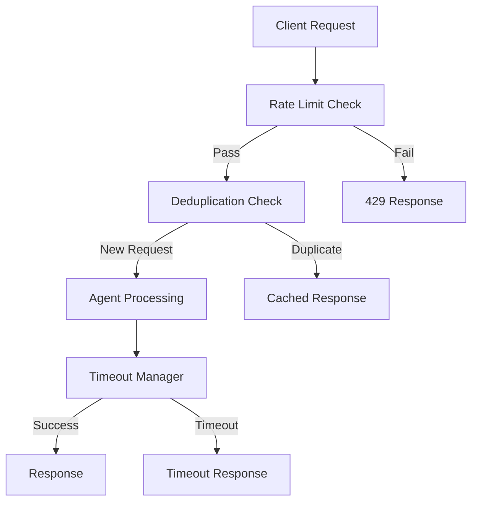

# Client Protection Implementation Guide

## Implementation Architecture

### Middleware Stack Order

```python
# FastAPI Middleware Stack (order matters!)
app.add_middleware(CORSMiddleware, ...)          # 1. CORS (outermost)
app.add_middleware(GZipMiddleware, ...)          # 2. Compression  
app.add_middleware(LoggingMiddleware, ...)       # 3. Request logging
app.add_middleware(RateLimitMiddleware, ...)     # 4. Rate limiting (NEW)
app.add_middleware(DeduplicationMiddleware, ...) # 5. Deduplication (NEW)
app.add_middleware(PerformanceMiddleware, ...)   # 6. Performance tracking
app.add_middleware(SystemOptimizationMiddleware, ...) # 7. System optimization
```

### Component Integration



## Directory Structure

```
faultmaven/
├── api/
│   └── middleware/
│       ├── rate_limiting.py      # NEW: Rate limiting middleware
│       ├── deduplication.py      # NEW: Request deduplication
│       └── timeout_manager.py    # NEW: Agent timeout management
├── infrastructure/
│   └── protection/
│       ├── __init__.py           # NEW: Protection module
│       ├── rate_limiter.py       # NEW: Rate limiting backend
│       ├── request_hasher.py     # NEW: Request hashing logic
│       └── timeout_handler.py    # NEW: Timeout handling
├── models/
│   └── protection.py            # NEW: Protection data models
├── config/
│   └── protection.py            # NEW: Protection configuration
└── docs/
    └── security/
        ├── client-protection.md  # ✅ Created
        └── implementation-guide.md # ✅ This file
```

## Implementation Steps

### Step 1: Core Infrastructure

1. **Create protection models and configuration**
2. **Implement Redis-backed rate limiter**
3. **Create request hashing utilities**
4. **Implement timeout management**

### Step 2: Middleware Implementation

1. **Rate limiting middleware**
2. **Deduplication middleware**  
3. **Timeout manager integration**
4. **Error handling and responses**

### Step 3: Integration

1. **Add middleware to FastAPI app**
2. **Configure dependencies and settings**
3. **Update container.py for DI**
4. **Add configuration to .env.example**

### Step 4: Testing & Validation

1. **Unit tests for each component**
2. **Integration tests for middleware stack**
3. **Load testing and performance validation**
4. **Security testing and attack simulation**

## Configuration Management

### Settings Hierarchy

1. **Environment Variables** (highest priority)
2. **Configuration files** (.env, config.yaml)
3. **Default values** (in code)
4. **Dynamic configuration** (Redis-based, future)

### Feature Flags

```python
class ProtectionSettings:
    # Global toggles
    RATE_LIMITING_ENABLED: bool = True
    DEDUPLICATION_ENABLED: bool = True
    TIMEOUT_MANAGEMENT_ENABLED: bool = True
    
    # Graceful degradation
    FAIL_OPEN_ON_REDIS_ERROR: bool = True
    FAIL_OPEN_ON_TIMEOUT_ERROR: bool = False
    
    # Development/testing
    DEBUG_PROTECTION: bool = False
    PROTECTION_BYPASS_HEADERS: List[str] = []
```

## Error Handling Strategy

### Exception Hierarchy

```python
class ProtectionError(Exception):
    """Base protection system error"""
    pass

class RateLimitError(ProtectionError):
    """Rate limit exceeded"""
    def __init__(self, retry_after: int, limit_type: str):
        self.retry_after = retry_after
        self.limit_type = limit_type

class DuplicateRequestError(ProtectionError):
    """Duplicate request detected"""
    def __init__(self, original_timestamp: datetime):
        self.original_timestamp = original_timestamp

class TimeoutError(ProtectionError):
    """Operation timeout"""
    def __init__(self, operation: str, timeout_duration: float):
        self.operation = operation
        self.timeout_duration = timeout_duration
```

### Error Response Format

```python
@dataclass
class ProtectionErrorResponse:
    error_type: str
    message: str
    retry_after: Optional[int] = None
    error_code: str = ""
    correlation_id: str = ""
    timestamp: str = ""
    suggestions: List[str] = field(default_factory=list)
```

## Performance Considerations

### Memory Usage

- **Rate limiting**: ~100 bytes per session per window
- **Deduplication**: ~64 bytes per unique request hash
- **Timeout tracking**: ~200 bytes per active operation

### CPU Overhead

- **Rate limiting**: ~0.1ms per request
- **Deduplication**: ~0.05ms per request (hashing)
- **Timeout management**: ~0.02ms per request

### Redis Usage

- **Keys**: Prefixed and namespaced (`fm:rl:`, `fm:dedup:`)
- **Memory**: ~1MB per 10K active sessions
- **Operations**: ~2-3 Redis calls per request

## Security Implementation Details

### Rate Limiting Security

```python
# Prevent timing attacks
def constant_time_compare(a: str, b: str) -> bool:
    """Constant time string comparison"""
    return hmac.compare_digest(a.encode(), b.encode())

# Prevent enumeration attacks  
def add_jitter(base_time: float) -> float:
    """Add random jitter to retry times"""
    return base_time + random.uniform(0, base_time * 0.1)
```

### Hash Security

```python
# Prevent hash collision attacks
def secure_hash(content: str, salt: str) -> str:
    """Cryptographically secure hashing with salt"""
    return hashlib.pbkdf2_hmac('sha256', 
                              content.encode(), 
                              salt.encode(), 
                              100000).hex()
```

## Monitoring Integration

### Metrics Collection

```python
# Prometheus metrics
protection_requests_total = Counter(
    'protection_requests_total',
    'Total protection checks',
    ['protection_type', 'result']
)

protection_duration_seconds = Histogram(
    'protection_duration_seconds',
    'Protection check duration',
    ['protection_type']
)
```

### Logging Standards

```python
# Structured logging format
{
    "event": "rate_limit_exceeded",
    "session_id": "abc123",
    "endpoint": "/api/v1/agent/query",
    "limit_type": "per_session",
    "current_count": 15,
    "limit": 10,
    "window": 60,
    "retry_after": 45,
    "timestamp": "2025-01-16T10:30:00Z",
    "correlation_id": "req_456"
}
```

## Testing Strategy

### Unit Test Coverage

- **Rate limiting algorithms**: 95%+
- **Hash generation**: 100%
- **Timeout mechanisms**: 90%+
- **Error handling**: 95%+

### Integration Test Scenarios

1. **Normal operation**: All protections pass
2. **Rate limit hit**: Proper 429 responses
3. **Duplicate detection**: Proper duplicate handling
4. **Timeout scenarios**: Graceful timeout handling
5. **Redis failures**: Graceful degradation
6. **High load**: Performance under stress

### Load Test Targets

- **1000 requests/second**: No protection failures
- **10K concurrent sessions**: Memory usage <100MB
- **Protection overhead**: <5ms per request
- **Redis response time**: <2ms 99th percentile

## Deployment Considerations

### Rolling Deployment

1. **Deploy with protections disabled**
2. **Verify application stability**
3. **Enable protections gradually**
4. **Monitor and tune thresholds**

### Rollback Plan

1. **Environment variable toggles**
2. **Redis key prefixing for isolation**
3. **Graceful degradation modes**
4. **Monitoring-based auto-rollback**

### Configuration Tuning

```python
# Production tuning guidelines
PRODUCTION_RATE_LIMITS = {
    "global": {"requests": 5000, "window": 60},        # Scale with capacity
    "per_session": {"requests": 20, "window": 60},     # Allow burst traffic
    "title_generation": {"requests": 2, "window": 300} # Slightly more lenient
}

# Development/testing
DEVELOPMENT_RATE_LIMITS = {
    "global": {"requests": 100, "window": 60},
    "per_session": {"requests": 50, "window": 60},     # More lenient for testing
    "title_generation": {"requests": 10, "window": 60} # Frequent testing
}
```