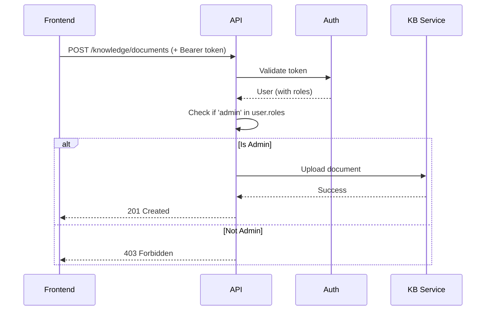

# Role-Based Access Control (RBAC)

## Overview

FaultMaven implements a role-based access control system to manage user permissions for Global Knowledge Base operations. This document describes the RBAC implementation, user management, and integration guidelines.

**Implementation Date:** October 2025
**Status:** ✅ Production Ready

---

## Table of Contents

1. [Quick Start](#quick-start)
2. [User Roles](#user-roles)
3. [Protected Endpoints](#protected-endpoints)
4. [User Management](#user-management)
5. [Frontend Integration](#frontend-integration)
6. [Security](#security)
7. [Testing](#testing)
8. [Migration Guide](#migration-guide)

---

## Quick Start

### For Administrators

**List all users:**
```bash
cd /home/swhouse/projects/FaultMaven
python scripts/auth/list_users.py
```

**Create admin user:**
```bash
python scripts/auth/create_user.py --username myadmin --role admin
```

**Promote existing user to admin:**
```bash
python scripts/auth/promote_to_admin.py username
```

### For Developers

**Check if user is admin in backend:**
```python
from faultmaven.api.v1.role_dependencies import require_admin

@router.post("/admin-endpoint")
async def admin_only(current_user: DevUser = Depends(require_admin)):
    # Only admins can access this
    ...
```

**Check if user is admin in frontend:**
```typescript
const isAdmin = user.roles.includes('admin');

{isAdmin && (
  <button onClick={uploadToGlobalKB}>Upload to Global KB</button>
)}
```

---

## User Roles

### 1. Regular User (`user` role)

**Default role for all users**

#### Permissions
- ✅ Login and authenticate
- ✅ Search Global Knowledge Base (read-only)
- ✅ List Global KB documents (read-only)
- ✅ View Global KB document details (read-only)
- ✅ Upload documents to their own User KB
- ✅ Manage their own User KB documents (create, update, delete)
- ✅ Create and manage troubleshooting cases
- ✅ Use all troubleshooting features

#### Restrictions
- ❌ Cannot upload to Global KB
- ❌ Cannot modify Global KB documents
- ❌ Cannot delete Global KB documents
- ❌ Cannot perform bulk operations on Global KB

### 2. Admin User (`user` + `admin` roles)

**Enhanced permissions for KB content management**

#### Additional Permissions
All regular user permissions, PLUS:
- ✅ Upload documents to Global KB
- ✅ Update Global KB documents
- ✅ Delete Global KB documents
- ✅ Bulk update operations on Global KB
- ✅ Bulk delete operations on Global KB

---

## Protected Endpoints

### Admin-Only Endpoints

All Global KB management endpoints require `admin` role:

| Method | Endpoint | Description | Required Role |
|--------|----------|-------------|---------------|
| POST | `/api/v1/knowledge/documents` | Upload document to Global KB | `admin` |
| PUT | `/api/v1/knowledge/documents/{id}` | Update Global KB document | `admin` |
| DELETE | `/api/v1/knowledge/documents/{id}` | Delete Global KB document | `admin` |
| POST | `/api/v1/knowledge/documents/bulk-update` | Bulk update documents | `admin` |
| POST | `/api/v1/knowledge/documents/bulk-delete` | Bulk delete documents | `admin` |
| POST | `/api/v1/kb/documents` | Upload (backward compat) | `admin` |
| PUT | `/api/v1/kb/documents/{id}` | Update (backward compat) | `admin` |
| DELETE | `/api/v1/kb/documents/{id}` | Delete (backward compat) | `admin` |

### Public Endpoints (All Authenticated Users)

These endpoints are accessible to all users (both `user` and `admin` roles):

| Method | Endpoint | Description | Required Role |
|--------|----------|-------------|---------------|
| POST | `/api/v1/knowledge/search` | Search Global KB | Any authenticated user |
| GET | `/api/v1/knowledge/documents` | List Global KB documents | Any authenticated user |
| GET | `/api/v1/knowledge/documents/{id}` | Get specific document | Any authenticated user |
| GET | `/api/v1/knowledge/stats` | Get KB statistics | Any authenticated user |
| POST | `/api/v1/users/{user_id}/kb/documents` | Upload to User KB | Owner or admin |
| GET | `/api/v1/users/{user_id}/kb/documents` | List User KB documents | Owner or admin |
| DELETE | `/api/v1/users/{user_id}/kb/documents/{id}` | Delete from User KB | Owner or admin |

---

## User Management

### Using Management Scripts

FaultMaven provides comprehensive CLI tools for user management located in `scripts/auth/`.

#### 1. List Users

**View all users with their roles:**
```bash
python scripts/auth/list_users.py
```

**Example Output:**
```
================================================================================
FaultMaven User Accounts
================================================================================

Found 5 user(s):

#    USERNAME             EMAIL                          ROLES                USER_ID
----------------------------------------------------------------------------------------------------
👑 1    admin@company.com    admin@company.com              admin                860e6629-1e12-4921...
   2    alice                alice@company.com              user                 225bae2f-f459-4a54...
   3    bob                  bob@company.com                user                 3a94f837-013e-4538...

================================================================================
Total: 3 user(s)
  Admins: 1
  Regular users: 2
================================================================================
```

👑 = Admin user

#### 2. Create User

**Interactive mode (prompts for all values):**
```bash
python scripts/auth/create_user.py --interactive
```

**Command-line mode:**
```bash
# Create regular user
python scripts/auth/create_user.py --username alice --role user

# Create admin user
python scripts/auth/create_user.py --username bob --role admin

# With custom email and display name
python scripts/auth/create_user.py \
  --username charlie \
  --email charlie@company.com \
  --display-name "Charlie Brown" \
  --role user
```

**Output:**
```
✅ User created successfully!

User Details:
  User ID: 657f11b1-5b97-4882-9801-a5bed1c3830c
  Username: alice
  Email: alice@company.com
  Display Name: Alice
  Roles: ['user']
  Created: 2025-10-23 12:34:56+00:00
```

#### 3. Promote to Admin

**Add admin role to existing user:**
```bash
python scripts/auth/promote_to_admin.py alice
```

**Output:**
```
✅ User promoted to admin successfully!

Updated roles: ['user', 'admin']

User 'alice' can now:
  ✅ Upload documents to Global KB
  ✅ Update Global KB documents
  ✅ Delete Global KB documents
  ✅ Perform bulk operations on Global KB
```

#### 4. Demote from Admin

**Remove admin role from user:**
```bash
python scripts/auth/demote_from_admin.py bob
```

**Output:**
```
✅ Admin role removed successfully!

Updated roles: ['user']

User 'bob' can no longer:
  ❌ Upload documents to Global KB
  ❌ Update Global KB documents
  ❌ Delete Global KB documents
```

### Using the API

#### Register New User
```bash
curl -X POST http://localhost:8000/api/v1/auth/dev-register \
  -H 'Content-Type: application/json' \
  -d '{"username": "alice"}'
```

**Response:**
```json
{
  "access_token": "550e8400-e29b-41d4-a716-446655440000",
  "token_type": "bearer",
  "expires_in": 86400,
  "session_id": "session-41afd36b...",
  "user": {
    "user_id": "user-123",
    "username": "alice",
    "email": "alice@dev.faultmaven.local",
    "display_name": "Alice",
    "roles": ["user"],
    "is_dev_user": true,
    "created_at": "2025-10-23T12:00:00Z"
  }
}
```

#### Login (Verify Roles)
```bash
curl -X POST http://localhost:8000/api/v1/auth/dev-login \
  -H 'Content-Type: application/json' \
  -d '{"username": "alice"}'
```

**Response includes roles:**
```json
{
  "user": {
    "roles": ["user", "admin"]
  }
}
```

#### Get Current User Profile
```bash
curl http://localhost:8000/api/v1/auth/me \
  -H 'Authorization: Bearer YOUR_TOKEN'
```

**Response:**
```json
{
  "user_id": "user-123",
  "username": "alice",
  "email": "alice@company.com",
  "display_name": "Alice Smith",
  "roles": ["user", "admin"],
  "is_dev_user": true,
  "created_at": "2025-10-23T12:00:00Z",
  "last_login": null,
  "token_count": 1
}
```

---

## Frontend Integration

### TypeScript Interfaces

```typescript
interface User {
  user_id: string;
  username: string;
  email: string;
  display_name: string;
  roles: string[];
  is_dev_user: boolean;
  created_at: string;
}

interface AuthResponse {
  access_token: string;
  token_type: "bearer";
  expires_in: number;
  session_id: string;
  user: User;
}
```

### Role Checking Utilities

```typescript
class RoleChecker {
  /**
   * Check if user has a specific role
   */
  hasRole(user: User, role: string): boolean {
    return user.roles?.includes(role) ?? false;
  }

  /**
   * Check if user has admin role
   */
  isAdmin(user: User): boolean {
    return this.hasRole(user, 'admin');
  }

  /**
   * Check if user can manage Global KB
   */
  canManageGlobalKB(user: User): boolean {
    return this.isAdmin(user);
  }

  /**
   * Check if user has any of the specified roles
   */
  hasAnyRole(user: User, roles: string[]): boolean {
    return roles.some(role => this.hasRole(user, role));
  }
}

// Usage
const roleChecker = new RoleChecker();
const canUpload = roleChecker.canManageGlobalKB(user);
```

### Conditional UI Rendering

```typescript
import { useState, useEffect } from 'react';

const KnowledgeBasePanel = () => {
  const [user, setUser] = useState<User | null>(null);
  const [isAdmin, setIsAdmin] = useState(false);

  useEffect(() => {
    // Fetch current user
    fetchCurrentUser().then(userData => {
      setUser(userData);
      setIsAdmin(userData.roles.includes('admin'));
    });
  }, []);

  if (!user) return <div>Loading...</div>;

  return (
    <div className="kb-panel">
      <h1>Knowledge Base</h1>

      {/* Admin-only section */}
      {isAdmin && (
        <div className="admin-section">
          <h2>Global KB Management</h2>
          <button onClick={handleUploadToGlobal}>
            Upload to Global KB
          </button>
          <button onClick={handleManageGlobal}>
            Manage Global KB
          </button>
        </div>
      )}

      {/* Available to all users */}
      <div className="user-section">
        <h2>Search Knowledge Base</h2>
        <SearchComponent />
      </div>

      <div className="user-section">
        <h2>My Knowledge Base</h2>
        <button onClick={handleUploadToUser}>
          Upload to My KB
        </button>
        <UserKBList userId={user.user_id} />
      </div>
    </div>
  );
};
```

### React Hook for Roles

```typescript
import { useEffect, useState } from 'react';

interface UseRolesReturn {
  user: User | null;
  isAdmin: boolean;
  hasRole: (role: string) => boolean;
  loading: boolean;
}

export function useRoles(): UseRolesReturn {
  const [user, setUser] = useState<User | null>(null);
  const [loading, setLoading] = useState(true);

  useEffect(() => {
    // Load user from auth state
    const loadUser = async () => {
      try {
        const response = await fetch('/api/v1/auth/me', {
          headers: {
            'Authorization': `Bearer ${getStoredToken()}`
          }
        });

        if (response.ok) {
          const userData = await response.json();
          setUser(userData);
        }
      } catch (error) {
        console.error('Failed to load user:', error);
      } finally {
        setLoading(false);
      }
    };

    loadUser();
  }, []);

  const hasRole = (role: string) => {
    return user?.roles?.includes(role) ?? false;
  };

  const isAdmin = user?.roles?.includes('admin') ?? false;

  return { user, isAdmin, hasRole, loading };
}

// Usage
const MyComponent = () => {
  const { user, isAdmin, hasRole, loading } = useRoles();

  if (loading) return <div>Loading...</div>;

  return (
    <div>
      <p>Welcome, {user?.display_name}</p>
      {isAdmin && <AdminPanel />}
      {hasRole('editor') && <EditorPanel />}
    </div>
  );
};
```

---

## Security

### Server-Side Validation

**All role checks are enforced server-side**. Frontend role checking is only for UI rendering convenience.

```python
# Backend enforcement
from faultmaven.api.v1.role_dependencies import require_admin

@router.post("/knowledge/documents")
async def upload_document(
    file: UploadFile,
    current_user: DevUser = Depends(require_admin)  # Enforced server-side
):
    """This endpoint is protected - admins only"""
    ...
```

### Authorization Flow



### Error Responses

#### 401 Unauthorized (No Token / Invalid Token)
```json
{
  "detail": "Not authenticated"
}
```

#### 403 Forbidden (Valid Token, Insufficient Permissions)
```json
{
  "error": "Forbidden",
  "message": "This operation requires administrator privileges",
  "required_role": "admin",
  "user_roles": ["user"]
}
```

### Security Best Practices

1. **Never trust frontend role checks** for security decisions
2. **Always validate roles** on the backend for protected operations
3. **Log all admin operations** with user ID for audit trails
4. **Roles require new token** - role changes need re-authentication
5. **Use HTTPS** in production to protect token transmission

### Audit Logging

All admin operations are logged:

```python
logger.warning(
    f"Authorization denied: User {user.user_id} ({user.username}) "
    f"attempted admin-only operation without admin role (roles: {user.roles})"
)

logger.info(f"Admin operation: User {user.user_id} uploaded document to Global KB")
```

---

## Testing

### Automated Testing

**Run RBAC tests:**
```bash
cd /home/swhouse/projects/FaultMaven
python scripts/test_rbac.py
```

**Expected output:**
```
✅ Regular user has 'user' role: True
✅ Regular user has 'admin' role: False
✅ Admin user has 'user' role: True
✅ Admin user has 'admin' role: True
✅ All role checks passed!
```

### Manual API Testing

**1. Create test users:**
```bash
python scripts/auth/create_user.py --username testuser --role user
python scripts/auth/create_user.py --username testadmin --role admin
```

**2. Login as regular user:**
```bash
curl -X POST http://localhost:8000/api/v1/auth/dev-login \
  -H 'Content-Type: application/json' \
  -d '{"username": "testuser"}' | jq
```

**3. Try to upload as regular user (should fail):**
```bash
curl -X POST http://localhost:8000/api/v1/knowledge/documents \
  -H 'Authorization: Bearer REGULAR_USER_TOKEN' \
  -F 'file=@test.txt' \
  -F 'title=Test' \
  -F 'document_type=reference'

# Expected: 403 Forbidden
```

**4. Login as admin:**
```bash
curl -X POST http://localhost:8000/api/v1/auth/dev-login \
  -H 'Content-Type: application/json' \
  -d '{"username": "testadmin"}' | jq
```

**5. Upload as admin (should succeed):**
```bash
curl -X POST http://localhost:8000/api/v1/knowledge/documents \
  -H 'Authorization: Bearer ADMIN_TOKEN' \
  -F 'file=@test.txt' \
  -F 'title=Test' \
  -F 'document_type=reference'

# Expected: 201 Created
```

---

## Migration Guide

### From Development to Production

When migrating to Auth0/Clerk for production:

#### 1. Map Roles to Auth0

```javascript
// Auth0 Rule to add roles to JWT
function addRolesToToken(user, context, callback) {
  const namespace = 'https://faultmaven.ai/';
  const assignedRoles = context.authorization.roles;

  // Map Auth0 roles to FaultMaven roles
  const faultmavenRoles = assignedRoles.map(role => {
    switch (role) {
      case 'Administrator': return 'admin';
      case 'User': return 'user';
      default: return 'user';
    }
  });

  context.idToken[namespace + 'roles'] = faultmavenRoles;
  context.accessToken[namespace + 'roles'] = faultmavenRoles;

  callback(null, user, context);
}
```

#### 2. Update Backend JWT Validation

```python
# Extract roles from JWT claims
def get_roles_from_jwt(token: str) -> List[str]:
    payload = jwt.decode(token, verify=False)
    roles = payload.get('https://faultmaven.ai/roles', ['user'])
    return roles

async def get_current_user_from_jwt(
    token: str = Depends(extract_bearer_token)
) -> User:
    auth0_user = await validate_jwt_token(token)
    roles = get_roles_from_jwt(token)

    user = User(
        user_id=auth0_user['sub'],
        email=auth0_user['email'],
        username=auth0_user.get('nickname'),
        roles=roles  # From JWT claims
    )

    return user
```

#### 3. Migrate User Roles

```python
# Migration script
async def migrate_user_roles_to_auth0():
    """Migrate existing user roles from Redis to Auth0"""
    users = await user_store.list_users(limit=1000)

    for user in users:
        # Assign roles in Auth0 via Management API
        auth0_roles = map_to_auth0_roles(user.roles)
        await assign_auth0_roles(user.email, auth0_roles)
```

### Backward Compatibility

The current RBAC implementation is designed for seamless migration:

✅ **Role model remains the same** (array of string roles)
✅ **API response format unchanged**
✅ **Frontend integration compatible**
✅ **Authorization decorators reusable**

Only the authentication backend changes (Redis → Auth0).

---

## Troubleshooting

### User can't access admin endpoints

**Symptoms:**
- User gets 403 Forbidden on Global KB operations
- User believes they should have admin access

**Diagnosis:**
```bash
# Check user's current roles
python scripts/auth/list_users.py | grep username

# Expected output shows roles
👑 1    username    email@company.com    admin    user-id
```

**Solution:**
```bash
# Promote user to admin
python scripts/auth/promote_to_admin.py username

# User must re-login to get updated roles in token
```

### Roles not appearing in API response

**Symptoms:**
- Login response doesn't include `roles` field
- Frontend can't check user roles

**Diagnosis:**
- Check API response models include `roles` field
- Verify backend returns roles in UserProfile

**Solution:**
- Ensure using updated `faultmaven/models/api_auth.py`
- Verify `UserProfile` model has `roles: List[str]` field

### Frontend shows admin UI to non-admins

**Symptoms:**
- Regular users see admin buttons
- But get 403 when clicking them

**Diagnosis:**
- Frontend role check logic may be incorrect
- Token may be stale with old roles

**Solution:**
```typescript
// Correct role checking
const isAdmin = user?.roles?.includes('admin') ?? false;

// Force token refresh
await authManager.refreshToken();
```

---

## Summary

- **Simple Role Model**: Just `user` and `admin` roles
- **Server-Side Enforcement**: All security checks on backend
- **User Management Tools**: CLI scripts for easy administration
- **Frontend Integration**: Roles included in login response
- **Production Ready**: Designed for Auth0/Clerk migration
- **Well Tested**: Comprehensive test coverage

For more details, see:
- [Authentication Design](../architecture/authentication-design.md)
- [User Management Scripts](../../scripts/auth/README.md)
- [Security Implementation Guide](./implementation-guide.md)
