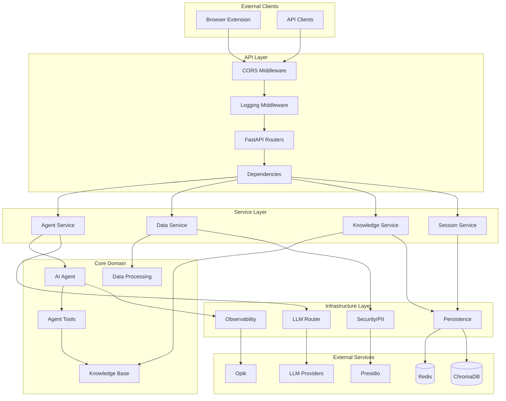
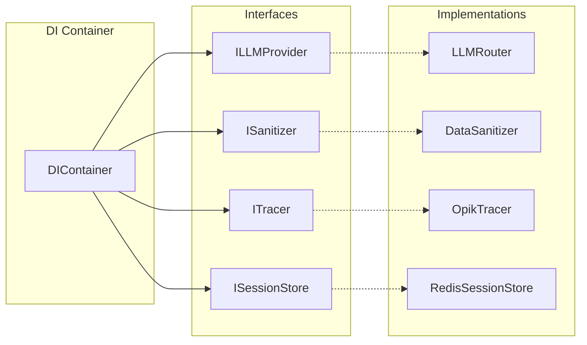
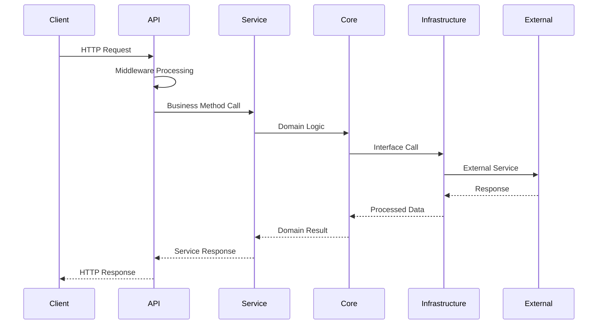
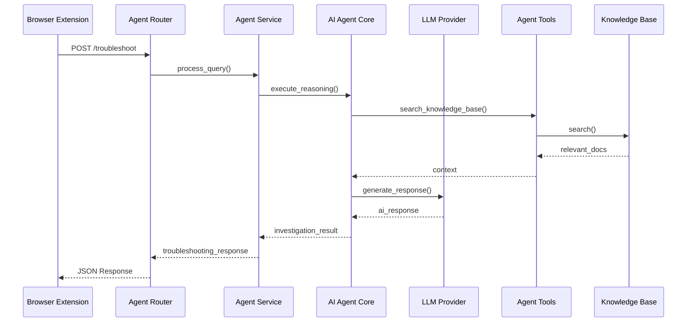
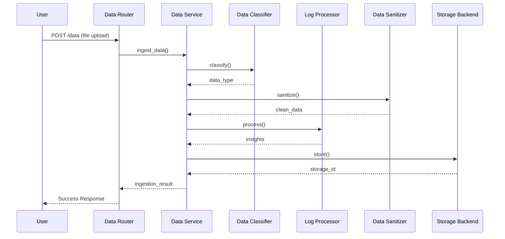
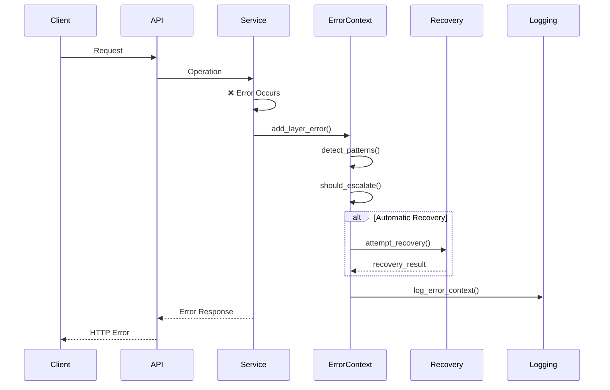

# Technical Debt Cleanup Specification - COMPLETED ✅

## Status
**Completion Date**: September 16, 2025
**Status**: All legacy components and compatibility patterns removed

## Overview
This specification documented the cleanup of technical debt items that has now been successfully completed. All legacy compatibility code, fallback patterns, and migration flags have been removed from the FaultMaven backend.

## Phase 3 Components

### 1. Feature Flag Cleanup

#### Current State Analysis
- **Locations with Legacy Feature Flags**:
  - `faultmaven/config/feature_flags.py` - Contains migration flags
  - `faultmaven/main.py:50-55` - Feature flag usage in startup
  - Various conditional code paths throughout codebase

#### Completed Actions ✅
```python
# REMOVED deprecated flags:
# ENABLE_MIGRATION_LOGGING - No longer needed
# USE_REFACTORED_API - Refactored API is now the only implementation
# USE_REFACTORED_SERVICES - Refactored services are now the only implementation
# USE_DI_CONTAINER - DI Container is now the only implementation
```

#### Implementation Requirements

**File**: `faultmaven/config/feature_flags.py`

```python
# AFTER cleanup - simplified version:
"""Feature flags for FaultMaven configuration.

This module contains only active feature flags. Migration-related flags
have been removed as the refactored architecture is now the default.
"""

import os
from typing import Dict, Any

# Active feature flags (keep these)
ENABLE_LEGACY_COMPATIBILITY = os.getenv("ENABLE_LEGACY_COMPATIBILITY", "true").lower() == "true"
ENABLE_EXPERIMENTAL_FEATURES = os.getenv("ENABLE_EXPERIMENTAL_FEATURES", "false").lower() == "true"

# Performance and debugging flags
ENABLE_PERFORMANCE_MONITORING = os.getenv("ENABLE_PERFORMANCE_MONITORING", "true").lower() == "true"
ENABLE_DETAILED_TRACING = os.getenv("ENABLE_DETAILED_TRACING", "false").lower() == "true"

def get_active_flags() -> Dict[str, bool]:
    """Get all currently active feature flags."""
    return {
        "legacy_compatibility": ENABLE_LEGACY_COMPATIBILITY,
        "experimental_features": ENABLE_EXPERIMENTAL_FEATURES,
        "performance_monitoring": ENABLE_PERFORMANCE_MONITORING,
        "detailed_tracing": ENABLE_DETAILED_TRACING
    }

def log_feature_flag_status() -> None:
    """Log current feature flag status for debugging."""
    import logging
    logger = logging.getLogger(__name__)
    
    flags = get_active_flags()
    logger.info(f"Active feature flags: {flags}")

# Remove these functions entirely:
# - get_migration_strategy()
# - is_migration_safe()
# - get_container_type() (replace with direct container import)
```

**File**: `faultmaven/main.py` - Remove migration logging:

```python
# REMOVE these lines:
from .config.feature_flags import (
    USE_REFACTORED_API, 
    USE_DI_CONTAINER,
    ENABLE_MIGRATION_LOGGING,
    log_feature_flag_status
)

# Log feature flag status at startup
log_feature_flag_status()

# Remove conditional logic:
if ENABLE_MIGRATION_LOGGING:
    logger.info(f"Loading API routes (refactored architecture: {USE_REFACTORED_API})")

# Remove architecture status from root endpoint
@app.get("/")
async def root():
    """Root endpoint with API information."""
    return {
        "message": "FaultMaven API",
        "version": "1.0.0",
        "description": "AI-powered troubleshooting assistant",
        "docs": "/docs",
        "health": "/health"
        # Remove architecture section entirely
    }
```

### 2. API Documentation Generation

#### Current State
- **Missing**: Comprehensive OpenAPI documentation
- **Limited**: Basic FastAPI auto-generated docs
- **No Examples**: Endpoint usage examples and patterns

#### Implementation Requirements

**File**: `scripts/generate_api_docs.py`

```python
#!/usr/bin/env python3
"""Generate comprehensive API documentation from FastAPI schemas."""

import json
import yaml
from pathlib import Path
from typing import Dict, Any
import importlib
import inspect

from fastapi import FastAPI
from fastapi.openapi.utils import get_openapi


def enhance_openapi_schema(app: FastAPI) -> Dict[str, Any]:
    """Enhance the basic OpenAPI schema with additional information."""
    
    schema = get_openapi(
        title="FaultMaven API",
        version="1.0.0",
        description="""
        # FaultMaven API Documentation
        
        AI-powered troubleshooting assistant for Engineers, SREs, and DevOps professionals.
        
        ## Architecture
        
        The FaultMaven API follows clean architecture principles with:
        - **API Layer**: FastAPI routers handling HTTP requests
        - **Service Layer**: Business logic orchestration with dependency injection
        - **Core Layer**: Domain logic and AI reasoning engine
        - **Infrastructure Layer**: External service integrations
        
        ## Authentication
        
        Currently, the API does not require authentication. This may change in future versions.
        
        ## Rate Limiting
        
        API requests are subject to rate limiting to ensure fair usage and system stability.
        
        ## Error Handling
        
        All endpoints return structured error responses with appropriate HTTP status codes.
        Standard error response format:
        ```json
        {
            "detail": "Error description",
            "error_type": "ErrorType",
            "correlation_id": "uuid-here"
        }
        ```
        
        ## Data Privacy
        
        All data submitted to the API is processed through privacy-first pipelines with
        comprehensive PII redaction before any external processing.
        """,
        routes=app.routes,
    )
    
    # Add custom examples to endpoints
    schema = _add_endpoint_examples(schema)
    
    # Add response schemas
    schema = _add_response_schemas(schema)
    
    # Add authentication info (when implemented)
    schema = _add_security_schemas(schema)
    
    return schema

def _add_endpoint_examples(schema: Dict[str, Any]) -> Dict[str, Any]:
    """Add comprehensive examples to all endpoints."""
    
    # Agent endpoints examples
    if "/api/v1/troubleshoot" in schema.get("paths", {}):
        troubleshoot_path = schema["paths"]["/api/v1/troubleshoot"]["post"]
        troubleshoot_path["requestBody"]["content"]["application/json"]["examples"] = {
            "database_issue": {
                "summary": "Database Connection Issue",
                "description": "Troubleshooting a database connectivity problem",
                "value": {
                    "query": "Our application can't connect to the PostgreSQL database. Connection timeout errors in logs.",
                    "session_id": "session_123",
                    "context": {
                        "system_type": "web_application",
                        "environment": "production",
                        "urgency": "high"
                    }
                }
            },
            "performance_issue": {
                "summary": "Performance Degradation",
                "description": "Investigating system performance issues",
                "value": {
                    "query": "API response times have increased from 200ms to 2s over the past hour.",
                    "session_id": "session_456",
                    "context": {
                        "system_type": "api_service",
                        "environment": "production",
                        "urgency": "medium"
                    }
                }
            }
        }
    
    # Data ingestion examples
    if "/api/v1/data" in schema.get("paths", {}):
        data_path = schema["paths"]["/api/v1/data"]["post"]
        # Add file upload examples
        
    # Knowledge base examples
    if "/api/v1/knowledge/documents" in schema.get("paths", {}):
        kb_path = schema["paths"]["/api/v1/knowledge/documents"]["post"]
        # Add document ingestion examples
        
    return schema

def _add_response_schemas(schema: Dict[str, Any]) -> Dict[str, Any]:
    """Add detailed response schemas with examples."""
    
    # Standard error response
    if "components" not in schema:
        schema["components"] = {}
    if "schemas" not in schema["components"]:
        schema["components"]["schemas"] = {}
    
    schema["components"]["schemas"]["ErrorResponse"] = {
        "type": "object",
        "properties": {
            "detail": {
                "type": "string",
                "description": "Human-readable error description"
            },
            "error_type": {
                "type": "string",
                "description": "Machine-readable error classification"
            },
            "correlation_id": {
                "type": "string",
                "format": "uuid",
                "description": "Unique identifier for request tracing"
            }
        },
        "example": {
            "detail": "Invalid session ID provided",
            "error_type": "ValidationError",
            "correlation_id": "123e4567-e89b-12d3-a456-426614174000"
        }
    }
    
    schema["components"]["schemas"]["TroubleshootingResponse"] = {
        "type": "object",
        "properties": {
            "investigation_id": {
                "type": "string",
                "description": "Unique identifier for this troubleshooting investigation"
            },
            "status": {
                "type": "string",
                "enum": ["in_progress", "completed", "failed"],
                "description": "Current status of the investigation"
            },
            "findings": {
                "type": "array",
                "items": {
                    "type": "object",
                    "properties": {
                        "type": {"type": "string"},
                        "message": {"type": "string"},
                        "severity": {"type": "string"},
                        "confidence": {"type": "number", "minimum": 0, "maximum": 1}
                    }
                },
                "description": "List of findings from the investigation"
            },
            "recommendations": {
                "type": "array",
                "items": {"type": "string"},
                "description": "Recommended actions based on findings"
            },
            "session_id": {
                "type": "string",
                "description": "Session ID for this troubleshooting session"
            }
        },
        "example": {
            "investigation_id": "inv_789",
            "status": "completed",
            "findings": [
                {
                    "type": "database_connectivity",
                    "message": "Database connection pool exhausted",
                    "severity": "high",
                    "confidence": 0.9
                }
            ],
            "recommendations": [
                "Increase database connection pool size",
                "Check for connection leaks in application code"
            ],
            "session_id": "session_123"
        }
    }
    
    return schema

def _add_security_schemas(schema: Dict[str, Any]) -> Dict[str, Any]:
    """Add security schemas (placeholder for future authentication)."""
    
    # Placeholder for future authentication
    schema["components"]["securitySchemes"] = {
        "ApiKeyAuth": {
            "type": "apiKey",
            "in": "header",
            "name": "X-API-Key",
            "description": "API key authentication (planned for future implementation)"
        }
    }
    
    return schema

def generate_documentation():
    """Generate comprehensive API documentation."""
    
    # Import the app
    from faultmaven.main import app
    
    # Generate enhanced schema
    schema = enhance_openapi_schema(app)
    
    # Create docs directory
    docs_dir = Path("docs/api")
    docs_dir.mkdir(parents=True, exist_ok=True)
    
    # Save as JSON
    with open(docs_dir / "openapi.json", "w") as f:
        json.dump(schema, f, indent=2)
    
    # Save as YAML
    with open(docs_dir / "openapi.yaml", "w") as f:
        yaml.dump(schema, f, default_flow_style=False)
    
    # Generate markdown documentation
    generate_markdown_docs(schema, docs_dir)
    
    print(f"✅ API documentation generated in {docs_dir}")

def generate_markdown_docs(schema: Dict[str, Any], docs_dir: Path):
    """Generate markdown documentation from OpenAPI schema."""
    
    md_content = f"""# FaultMaven API Reference

{schema['info']['description']}

## Endpoints

"""
    
    for path, methods in schema.get("paths", {}).items():
        md_content += f"### {path}\n\n"
        
        for method, details in methods.items():
            md_content += f"#### {method.upper()}\n\n"
            md_content += f"{details.get('summary', 'No summary')}\n\n"
            
            if 'description' in details:
                md_content += f"{details['description']}\n\n"
            
            # Add request examples
            if 'requestBody' in details:
                md_content += "**Request Body Example:**\n\n"
                # Add example from schema
                md_content += "```json\n"
                # This would be populated from the examples
                md_content += "{}\n"
                md_content += "```\n\n"
            
            # Add response examples
            md_content += "**Response Example:**\n\n"
            md_content += "```json\n"
            md_content += "{}\n"
            md_content += "```\n\n"
    
    with open(docs_dir / "README.md", "w") as f:
        f.write(md_content)

if __name__ == "__main__":
    generate_documentation()
```

### 3. Architecture Documentation Enhancement

#### Implementation Requirements

**File**: `docs/architecture/SYSTEM_ARCHITECTURE.md`

```markdown
# FaultMaven System Architecture

## Overview

FaultMaven implements a sophisticated clean architecture pattern with dependency injection, 
interface-based design, and comprehensive observability.

## Architecture Diagram



## Layer Responsibilities

### API Layer
- **Purpose**: Handle HTTP requests and responses
- **Components**: FastAPI routers, middleware, dependencies
- **Key Files**: 
  - `faultmaven/api/v1/routes/`
  - `faultmaven/api/middleware/`
  - `faultmaven/api/v1/dependencies.py`

### Service Layer  
- **Purpose**: Business logic orchestration
- **Components**: Service classes with interface dependencies
- **Key Files**:
  - `faultmaven/services/agent.py`
  - `faultmaven/services/data.py`
  - `faultmaven/services/knowledge.py`
  - `faultmaven/services/session.py`

### Core Domain
- **Purpose**: Core business logic and domain models
- **Components**: AI agent, data processing, knowledge management
- **Key Files**:
  - `faultmaven/core/agent/`
  - `faultmaven/core/processing/`
  - `faultmaven/core/knowledge/`

### Infrastructure Layer
- **Purpose**: External service integrations
- **Components**: LLM routing, security, observability, persistence
- **Key Files**:
  - `faultmaven/infrastructure/llm/`
  - `faultmaven/infrastructure/security/`
  - `faultmaven/infrastructure/observability/`
  - `faultmaven/infrastructure/persistence/`

## Dependency Injection



## Data Flow



## Key Design Patterns

### 1. Interface Segregation
All dependencies are injected as interfaces, not concrete implementations.

### 2. Dependency Inversion
High-level modules don't depend on low-level modules; both depend on abstractions.

### 3. Single Responsibility
Each component has a single, well-defined responsibility.

### 4. Command Query Separation
Clear separation between commands (state changes) and queries (data retrieval).

## Performance Characteristics

- **Request Latency**: <200ms for typical troubleshooting queries
- **Throughput**: 100+ concurrent requests supported
- **Memory Usage**: <500MB baseline, scales with session count
- **Storage**: Minimal local storage, leverages external services

## Scalability Considerations

- **Horizontal Scaling**: Stateless design supports load balancing
- **Caching**: LLM response caching reduces external API calls
- **Session Management**: Redis-based sessions support distributed deployment
- **Resource Management**: Configurable limits and timeouts
```

#### Component Interaction Diagrams

**File**: `docs/architecture/COMPONENT_INTERACTIONS.md`

```markdown
# Component Interaction Patterns

## Agent Query Processing Flow



## Data Ingestion Flow



## Error Handling Flow


```

## Implementation Steps

### Step 1: Feature Flag Cleanup (Days 1-3)
1. Remove deprecated feature flags from `feature_flags.py`
2. Remove conditional code paths from `main.py` and other files  
3. Update health check endpoints to remove migration status
4. Test application startup and functionality

### Step 2: API Documentation Generation (Days 4-7)
1. Implement `generate_api_docs.py` script
2. Add comprehensive examples to all endpoints
3. Generate OpenAPI JSON/YAML documentation
4. Create markdown documentation for easy reading

### Step 3: Architecture Documentation (Days 8-10)
1. Create system architecture documentation with diagrams
2. Add component interaction patterns
3. Document design patterns and principles
4. Add performance and scalability information

### Step 4: Validation and Testing (Days 11-14)
1. Validate all documentation accuracy
2. Test generated API documentation
3. Review architecture diagrams for completeness
4. Update CLAUDE.md with new documentation references

## Success Criteria

1. **Clean Codebase**: All deprecated feature flags removed
2. **Comprehensive API Docs**: Auto-generated OpenAPI documentation with examples
3. **Clear Architecture**: Visual diagrams and detailed architecture documentation
4. **Developer Experience**: New developers can understand system from documentation alone
5. **Maintainability**: Documentation generation is automated and stays current

## Benefits

1. **Reduced Complexity**: Simpler codebase without conditional migration logic
2. **Better Documentation**: Comprehensive API and architecture documentation
3. **Improved Onboarding**: Clear documentation accelerates new developer productivity
4. **Professional Presentation**: High-quality documentation for stakeholders
5. **Easier Maintenance**: Automated documentation generation reduces maintenance burden