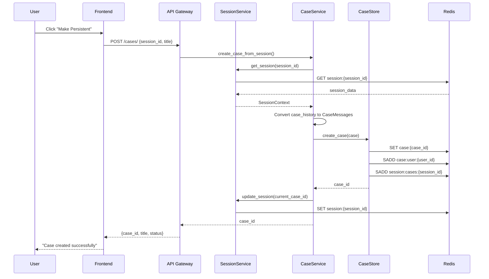
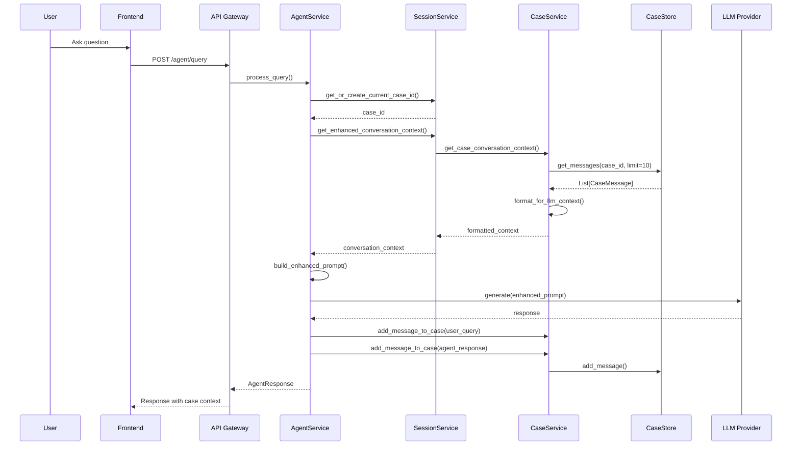

# Case Persistence System - Technical Design Document

## Executive Summary

This document presents a comprehensive technical design for implementing case persistence in FaultMaven, enabling cross-session conversation continuity and collaborative troubleshooting. The design extends the existing clean architecture while maintaining compatibility with current Redis-based session management.

### Key Objectives

- **Independent Case Lifecycle**: Cases persist 7-30 days vs 24-hour sessions
- **Cross-Session Continuity**: Resume troubleshooting conversations across multiple sessions
- **Collaborative Cases**: Share cases between users for team troubleshooting
- **Conversation History Management**: Maintain complete conversation context
- **Architectural Consistency**: Follow FaultMaven's interface-based dependency injection patterns

## Current Architecture Analysis

### Existing Session Management

The current system uses a session-centric model:

```
Session (24h TTL)
├── session_id: UUID
├── user_id: Optional[str]
├── current_case_id: Optional[str]
├── case_history: List[Dict]  # Embedded case data
├── data_uploads: List[str]
└── agent_state: Dict
```

**Limitations:**
- Case data is embedded within sessions
- Cases expire with sessions (24 hours)
- No cross-session case continuity
- No case sharing capabilities
- Case history is session-bound

### Integration Points

- **SessionManager**: Uses ISessionStore interface
- **SessionService**: Business logic layer
- **Redis**: Primary persistence via RedisSessionStore
- **Container**: Dependency injection pattern
- **API Layer**: FastAPI with router pattern

## Technical Architecture Design

### 1. Data Models

#### Core Case Models

```python
# File: faultmaven/models/case.py

from pydantic import BaseModel, Field
from typing import List, Optional, Dict, Any
from datetime import datetime
from enum import Enum

class CaseStatus(str, Enum):
    """Case lifecycle status"""
    ACTIVE = "active"
    PAUSED = "paused"
    RESOLVED = "resolved"
    ARCHIVED = "archived"

class CaseVisibility(str, Enum):
    """Case visibility and sharing settings"""
    PRIVATE = "private"        # Only creator can access
    SHARED = "shared"          # Explicitly shared users
    TEAM = "team"             # Team members can access
    PUBLIC = "public"         # Anyone can view (read-only)

class CaseParticipant(BaseModel):
    """Case participant with role and permissions"""
    user_id: str
    role: str = "collaborator"  # owner, collaborator, viewer
    joined_at: datetime
    permissions: Dict[str, bool] = Field(default_factory=lambda: {
        "read": True,
        "write": True,
        "share": False,
        "archive": False
    })

class CaseMessage(BaseModel):
    """Individual message in case conversation"""
    message_id: str
    case_id: str
    session_id: str  # Which session this message came from
    user_id: Optional[str]
    message_type: str = "user_query"  # user_query, agent_response, system_note
    content: str
    metadata: Dict[str, Any] = Field(default_factory=dict)
    created_at: datetime
    edited_at: Optional[datetime] = None

class CaseMetadata(BaseModel):
    """Case metadata and classification"""
    tags: List[str] = Field(default_factory=list)
    category: Optional[str] = None  # database, network, performance, etc.
    priority: str = "medium"  # low, medium, high, critical
    estimated_complexity: Optional[str] = None  # simple, moderate, complex
    related_systems: List[str] = Field(default_factory=list)
    
class Case(BaseModel):
    """Complete case model with full context"""
    case_id: str
    title: Optional[str] = None  # Auto-generated or user-provided
    description: Optional[str] = None  # Problem summary
    
    # Ownership and Collaboration
    created_by: str  # user_id of creator
    participants: List[CaseParticipant] = Field(default_factory=list)
    visibility: CaseVisibility = CaseVisibility.PRIVATE
    
    # Lifecycle
    status: CaseStatus = CaseStatus.ACTIVE
    created_at: datetime
    updated_at: datetime
    resolved_at: Optional[datetime] = None
    archived_at: Optional[datetime] = None
    
    # Content and Context
    messages: List[CaseMessage] = Field(default_factory=list)
    metadata: CaseMetadata = Field(default_factory=CaseMetadata)
    
    # Integration with existing system
    source_session_id: str  # Original session where case was created
    linked_sessions: List[str] = Field(default_factory=list)  # All sessions that accessed this case
    
    # Data and findings
    attached_data: List[str] = Field(default_factory=list)  # Data upload references
    key_findings: List[Dict[str, Any]] = Field(default_factory=list)
    solution_summary: Optional[str] = None
    
    # TTL and retention
    expires_at: Optional[datetime] = None  # Configurable retention (7-30 days)

class CaseSummary(BaseModel):
    """Lightweight case summary for listings"""
    case_id: str
    title: Optional[str]
    status: CaseStatus
    created_at: datetime
    updated_at: datetime
    created_by: str
    participant_count: int
    message_count: int
    category: Optional[str]
    priority: str
```

#### Session Integration Models

```python
# File: faultmaven/models/session_case.py

class SessionCaseLink(BaseModel):
    """Links sessions to cases with access context"""
    session_id: str
    case_id: str
    access_type: str = "owner"  # owner, collaborator, viewer
    first_accessed: datetime
    last_accessed: datetime
    message_count: int = 0  # Messages contributed from this session

class EnhancedSessionContext(BaseModel):
    """Extended session model with case relationships"""
    # Existing session fields
    session_id: str
    user_id: Optional[str]
    created_at: datetime
    last_activity: datetime
    data_uploads: List[str]
    agent_state: Optional[AgentState]
    
    # Enhanced case management
    current_case_id: Optional[str]
    accessible_cases: List[str] = Field(default_factory=list)  # Cases user can access
    recent_cases: List[str] = Field(default_factory=list)  # Recently accessed cases
    
    # Legacy compatibility
    case_history: List[Dict[str, Any]] = Field(default_factory=list)  # Maintains backward compatibility
```

### 2. Interface Design

#### Case Store Interface

```python
# File: faultmaven/models/interfaces.py (additions)

class ICaseStore(ABC):
    """Interface for case persistence operations"""
    
    @abstractmethod
    async def create_case(self, case: Case) -> str:
        """Create new case and return case_id"""
        pass
    
    @abstractmethod
    async def get_case(self, case_id: str) -> Optional[Case]:
        """Retrieve case by ID"""
        pass
    
    @abstractmethod
    async def update_case(self, case_id: str, updates: Dict[str, Any]) -> bool:
        """Update case fields"""
        pass
    
    @abstractmethod
    async def delete_case(self, case_id: str) -> bool:
        """Delete case permanently"""
        pass
    
    @abstractmethod
    async def list_user_cases(
        self, 
        user_id: str, 
        status_filter: Optional[List[CaseStatus]] = None,
        limit: int = 50,
        offset: int = 0
    ) -> List[CaseSummary]:
        """List cases accessible to user"""
        pass
    
    @abstractmethod
    async def add_message(self, case_id: str, message: CaseMessage) -> bool:
        """Add message to case"""
        pass
    
    @abstractmethod
    async def get_messages(
        self, 
        case_id: str, 
        limit: int = 50, 
        before_message_id: Optional[str] = None
    ) -> List[CaseMessage]:
        """Get case messages with pagination"""
        pass
    
    @abstractmethod
    async def add_participant(self, case_id: str, participant: CaseParticipant) -> bool:
        """Add participant to case"""
        pass
    
    @abstractmethod
    async def remove_participant(self, case_id: str, user_id: str) -> bool:
        """Remove participant from case"""
        pass
    
    @abstractmethod
    async def search_cases(
        self, 
        user_id: str, 
        query: str, 
        filters: Optional[Dict[str, Any]] = None
    ) -> List[CaseSummary]:
        """Search cases by content and metadata"""
        pass

class ICaseService(ABC):
    """Interface for case business logic operations"""
    
    @abstractmethod
    async def create_case_from_session(
        self, 
        session_id: str, 
        title: Optional[str] = None,
        description: Optional[str] = None
    ) -> str:
        """Create case from current session context"""
        pass
    
    @abstractmethod
    async def link_session_to_case(self, session_id: str, case_id: str) -> bool:
        """Link session to existing case"""
        pass
    
    @abstractmethod
    async def get_case_conversation_context(self, case_id: str, limit: int = 10) -> str:
        """Format case messages for LLM context"""
        pass
    
    @abstractmethod
    async def share_case(
        self, 
        case_id: str, 
        target_user_id: str, 
        role: str = "collaborator"
    ) -> bool:
        """Share case with another user"""
        pass
    
    @abstractmethod
    async def resolve_case(
        self, 
        case_id: str, 
        solution_summary: Optional[str] = None
    ) -> bool:
        """Mark case as resolved"""
        pass
```

### 3. Database Schema Design

#### Redis Schema Strategy

**Cases Collection:**
```
Key Pattern: "case:{case_id}"
Value: JSON serialized Case object
TTL: 7-30 days (configurable)

Key Pattern: "case:user:{user_id}"
Value: Set of case_ids accessible to user
TTL: Match longest case TTL

Key Pattern: "case:messages:{case_id}"
Value: List of CaseMessage objects (append-only)
TTL: Match case TTL

Key Pattern: "case:participants:{case_id}"
Value: Set of CaseParticipant objects
TTL: Match case TTL
```

**Session-Case Links:**
```
Key Pattern: "session:cases:{session_id}"
Value: Set of accessible case_ids
TTL: Match session TTL

Key Pattern: "case:sessions:{case_id}"
Value: Set of linked session_ids
TTL: Match case TTL
```

**Search and Indexing:**
```
Key Pattern: "case:index:user:{user_id}:status:{status}"
Value: Sorted set of case_ids by updated_at
TTL: 30 days

Key Pattern: "case:index:tag:{tag}"
Value: Set of case_ids with this tag
TTL: 30 days
```

#### Alternative: PostgreSQL Schema (Future Enhancement)

```sql
-- Cases table
CREATE TABLE cases (
    case_id UUID PRIMARY KEY,
    title VARCHAR(255),
    description TEXT,
    created_by UUID NOT NULL,
    status VARCHAR(20) DEFAULT 'active',
    visibility VARCHAR(20) DEFAULT 'private',
    created_at TIMESTAMP DEFAULT NOW(),
    updated_at TIMESTAMP DEFAULT NOW(),
    resolved_at TIMESTAMP,
    archived_at TIMESTAMP,
    expires_at TIMESTAMP,
    source_session_id UUID,
    metadata JSONB,
    solution_summary TEXT
);

-- Case participants
CREATE TABLE case_participants (
    case_id UUID REFERENCES cases(case_id) ON DELETE CASCADE,
    user_id UUID NOT NULL,
    role VARCHAR(20) DEFAULT 'collaborator',
    permissions JSONB,
    joined_at TIMESTAMP DEFAULT NOW(),
    PRIMARY KEY (case_id, user_id)
);

-- Case messages
CREATE TABLE case_messages (
    message_id UUID PRIMARY KEY,
    case_id UUID REFERENCES cases(case_id) ON DELETE CASCADE,
    session_id UUID,
    user_id UUID,
    message_type VARCHAR(20) DEFAULT 'user_query',
    content TEXT NOT NULL,
    metadata JSONB,
    created_at TIMESTAMP DEFAULT NOW(),
    edited_at TIMESTAMP
);

-- Session-case links
CREATE TABLE session_case_links (
    session_id UUID,
    case_id UUID REFERENCES cases(case_id) ON DELETE CASCADE,
    access_type VARCHAR(20),
    first_accessed TIMESTAMP DEFAULT NOW(),
    last_accessed TIMESTAMP DEFAULT NOW(),
    message_count INTEGER DEFAULT 0,
    PRIMARY KEY (session_id, case_id)
);

-- Indexes for performance
CREATE INDEX idx_cases_created_by ON cases(created_by);
CREATE INDEX idx_cases_status ON cases(status);
CREATE INDEX idx_cases_updated_at ON cases(updated_at DESC);
CREATE INDEX idx_case_messages_case_id ON case_messages(case_id, created_at);
CREATE INDEX idx_session_case_links_session ON session_case_links(session_id);
```

### 4. Implementation Architecture

#### Case Store Implementation

```python
# File: faultmaven/infrastructure/persistence/redis_case_store.py

import json
import uuid
from datetime import datetime, timedelta
from typing import List, Optional, Dict, Any
from faultmaven.models.interfaces import ICaseStore
from faultmaven.models.case import Case, CaseMessage, CaseParticipant, CaseSummary, CaseStatus
from faultmaven.infrastructure.redis_client import create_redis_client

class RedisCaseStore(ICaseStore):
    """Redis implementation of case persistence"""
    
    def __init__(self, redis_client=None, default_ttl_days: int = 30):
        self.redis_client = redis_client or create_redis_client()
        self.default_ttl = default_ttl_days * 24 * 3600  # Convert to seconds
        self.case_prefix = "case:"
        self.messages_prefix = "case:messages:"
        self.user_cases_prefix = "case:user:"
        self.session_cases_prefix = "session:cases:"
        self.case_sessions_prefix = "case:sessions:"
    
    async def create_case(self, case: Case) -> str:
        """Create new case with proper indexing"""
        case_key = f"{self.case_prefix}{case.case_id}"
        
        # Store main case object
        case_data = case.model_dump()
        await self.redis_client.set(
            case_key, 
            json.dumps(case_data, default=str), 
            ex=self.default_ttl
        )
        
        # Index for user access
        user_cases_key = f"{self.user_cases_prefix}{case.created_by}"
        await self.redis_client.sadd(user_cases_key, case.case_id)
        await self.redis_client.expire(user_cases_key, self.default_ttl)
        
        # Index for source session
        session_cases_key = f"{self.session_cases_prefix}{case.source_session_id}"
        await self.redis_client.sadd(session_cases_key, case.case_id)
        
        # Reverse index: case to sessions
        case_sessions_key = f"{self.case_sessions_prefix}{case.case_id}"
        await self.redis_client.sadd(case_sessions_key, case.source_session_id)
        await self.redis_client.expire(case_sessions_key, self.default_ttl)
        
        return case.case_id
    
    async def get_case(self, case_id: str) -> Optional[Case]:
        """Retrieve case with full data"""
        case_key = f"{self.case_prefix}{case_id}"
        case_data = await self.redis_client.get(case_key)
        
        if not case_data:
            return None
        
        try:
            case_dict = json.loads(case_data)
            
            # Load messages separately for better performance
            messages = await self.get_messages(case_id)
            case_dict['messages'] = [msg.model_dump() for msg in messages]
            
            return Case.model_validate(case_dict)
        except (json.JSONDecodeError, ValidationError) as e:
            logging.getLogger(__name__).error(f"Failed to deserialize case {case_id}: {e}")
            return None
    
    async def add_message(self, case_id: str, message: CaseMessage) -> bool:
        """Add message to case with efficient append"""
        messages_key = f"{self.messages_prefix}{case_id}"
        
        # Store message
        message_data = json.dumps(message.model_dump(), default=str)
        await self.redis_client.rpush(messages_key, message_data)
        await self.redis_client.expire(messages_key, self.default_ttl)
        
        # Update case last_updated timestamp
        case_key = f"{self.case_prefix}{case_id}"
        case_data = await self.redis_client.get(case_key)
        if case_data:
            case_dict = json.loads(case_data)
            case_dict['updated_at'] = datetime.utcnow().isoformat()
            await self.redis_client.set(
                case_key, 
                json.dumps(case_dict, default=str), 
                ex=self.default_ttl
            )
        
        return True
    
    async def get_messages(
        self, 
        case_id: str, 
        limit: int = 50, 
        before_message_id: Optional[str] = None
    ) -> List[CaseMessage]:
        """Get messages with pagination support"""
        messages_key = f"{self.messages_prefix}{case_id}"
        
        # Get messages (most recent first)
        raw_messages = await self.redis_client.lrange(messages_key, -limit, -1)
        raw_messages.reverse()  # Most recent first
        
        messages = []
        for raw_message in raw_messages:
            try:
                message_dict = json.loads(raw_message)
                message = CaseMessage.model_validate(message_dict)
                
                # Handle pagination
                if before_message_id and message.message_id == before_message_id:
                    break
                    
                messages.append(message)
            except (json.JSONDecodeError, ValidationError) as e:
                logging.getLogger(__name__).warning(f"Skipping invalid message: {e}")
                continue
        
        return messages
    
    async def list_user_cases(
        self, 
        user_id: str, 
        status_filter: Optional[List[CaseStatus]] = None,
        limit: int = 50,
        offset: int = 0
    ) -> List[CaseSummary]:
        """List cases accessible to user with filtering"""
        user_cases_key = f"{self.user_cases_prefix}{user_id}"
        case_ids = await self.redis_client.smembers(user_cases_key)
        
        summaries = []
        for case_id in case_ids:
            case = await self.get_case(case_id)
            if not case:
                continue
            
            # Apply status filter
            if status_filter and case.status not in status_filter:
                continue
            
            summary = CaseSummary(
                case_id=case.case_id,
                title=case.title,
                status=case.status,
                created_at=case.created_at,
                updated_at=case.updated_at,
                created_by=case.created_by,
                participant_count=len(case.participants),
                message_count=len(case.messages),
                category=case.metadata.category,
                priority=case.metadata.priority
            )
            summaries.append(summary)
        
        # Sort by updated_at (most recent first)
        summaries.sort(key=lambda x: x.updated_at, reverse=True)
        
        # Apply pagination
        return summaries[offset:offset + limit]
```

#### Case Service Implementation

```python
# File: faultmaven/services/case.py

from typing import Optional, List, Dict, Any
from datetime import datetime, timedelta
import uuid
import logging

from faultmaven.services.base import BaseService
from faultmaven.models.interfaces import ICaseStore, ICaseService, ISessionStore
from faultmaven.models.case import (
    Case, CaseMessage, CaseParticipant, CaseSummary, 
    CaseStatus, CaseVisibility, CaseMetadata
)
from faultmaven.models import SessionContext
from faultmaven.infrastructure.observability.tracing import trace

class CaseService(BaseService, ICaseService):
    """Case management service implementing business logic"""
    
    def __init__(
        self, 
        case_store: ICaseStore,
        session_store: ISessionStore,
        default_case_ttl_days: int = 30
    ):
        super().__init__("case_service")
        self.case_store = case_store
        self.session_store = session_store  
        self.default_ttl_days = default_case_ttl_days
    
    @trace("case_service_create_from_session")
    async def create_case_from_session(
        self, 
        session_id: str, 
        title: Optional[str] = None,
        description: Optional[str] = None
    ) -> str:
        """Create case from current session context"""
        self.logger.info(f"Creating case from session {session_id}")
        
        # Get session data
        session_data = await self.session_store.get(session_id)
        if not session_data:
            raise ValueError(f"Session {session_id} not found")
        
        # Generate case ID
        case_id = str(uuid.uuid4())
        current_time = datetime.utcnow()
        
        # Auto-generate title if not provided
        if not title:
            # Use first query from session as title base
            case_history = session_data.get('case_history', [])
            if case_history:
                first_query = None
                for item in case_history:
                    if item.get('action') == 'query_processed' and item.get('query'):
                        first_query = item['query']
                        break
                
                if first_query:
                    # Truncate and clean up for title
                    title = first_query[:60] + "..." if len(first_query) > 60 else first_query
                else:
                    title = f"Troubleshooting Case - {current_time.strftime('%Y-%m-%d %H:%M')}"
            else:
                title = f"Troubleshooting Case - {current_time.strftime('%Y-%m-%d %H:%M')}"
        
        # Create case object
        case = Case(
            case_id=case_id,
            title=title,
            description=description,
            created_by=session_data.get('user_id', 'anonymous'),
            participants=[
                CaseParticipant(
                    user_id=session_data.get('user_id', 'anonymous'),
                    role="owner",
                    joined_at=current_time,
                    permissions={
                        "read": True,
                        "write": True, 
                        "share": True,
                        "archive": True
                    }
                )
            ],
            visibility=CaseVisibility.PRIVATE,
            status=CaseStatus.ACTIVE,
            created_at=current_time,
            updated_at=current_time,
            source_session_id=session_id,
            linked_sessions=[session_id],
            expires_at=current_time + timedelta(days=self.default_ttl_days)
        )
        
        # Convert session case_history to case messages
        case_history = session_data.get('case_history', [])
        for item in case_history:
            if item.get('action') == 'query_processed' and item.get('query'):
                message = CaseMessage(
                    message_id=str(uuid.uuid4()),
                    case_id=case_id,
                    session_id=session_id,
                    user_id=session_data.get('user_id'),
                    message_type="user_query",
                    content=item['query'],
                    metadata={
                        'confidence_score': item.get('confidence_score', 0.0),
                        'original_timestamp': item.get('timestamp')
                    },
                    created_at=datetime.fromisoformat(item['timestamp'].replace('Z', '')) if item.get('timestamp') else current_time
                )
                case.messages.append(message)
        
        # Store case
        await self.case_store.create_case(case)
        
        # Update session to link to this case
        await self.session_store.set(
            session_id,
            {**session_data, 'current_case_id': case_id},
            ttl=24 * 3600  # Keep session TTL
        )
        
        self.logger.info(f"Created case {case_id} from session {session_id}")
        return case_id
    
    @trace("case_service_link_session")
    async def link_session_to_case(self, session_id: str, case_id: str) -> bool:
        """Link session to existing case"""
        try:
            # Verify case exists and user has access
            case = await self.case_store.get_case(case_id)
            if not case:
                self.logger.warning(f"Case {case_id} not found")
                return False
            
            # Get session data
            session_data = await self.session_store.get(session_id)
            if not session_data:
                self.logger.warning(f"Session {session_id} not found")
                return False
            
            user_id = session_data.get('user_id', 'anonymous')
            
            # Check if user has access to case
            has_access = False
            for participant in case.participants:
                if participant.user_id == user_id:
                    has_access = True
                    break
            
            if not has_access and case.visibility != CaseVisibility.PUBLIC:
                self.logger.warning(f"User {user_id} does not have access to case {case_id}")
                return False
            
            # Link session to case
            if session_id not in case.linked_sessions:
                case.linked_sessions.append(session_id)
                await self.case_store.update_case(case_id, {
                    'linked_sessions': case.linked_sessions,
                    'updated_at': datetime.utcnow()
                })
            
            # Update session current_case_id
            await self.session_store.set(
                session_id,
                {**session_data, 'current_case_id': case_id},
                ttl=24 * 3600
            )
            
            self.logger.info(f"Linked session {session_id} to case {case_id}")
            return True
            
        except Exception as e:
            self.logger.error(f"Failed to link session to case: {e}")
            return False
    
    @trace("case_service_get_conversation_context")
    async def get_case_conversation_context(self, case_id: str, limit: int = 10) -> str:
        """Format case messages for LLM context"""
        try:
            messages = await self.case_store.get_messages(case_id, limit=limit)
            
            if not messages:
                return ""
            
            # Format as conversation history
            formatted_lines = ["Previous conversation in this troubleshooting case:"]
            
            for i, message in enumerate(messages, 1):
                timestamp = message.created_at.strftime("%H:%M") if message.created_at else ""
                content = message.content.strip()
                
                if message.message_type == "user_query":
                    formatted_lines.append(f"{i}. [{timestamp}] User: {content}")
                elif message.message_type == "agent_response":
                    # Summarize agent responses for context
                    summary = content[:100] + "..." if len(content) > 100 else content
                    formatted_lines.append(f"{i}. [{timestamp}] Assistant: {summary}")
            
            formatted_lines.append("")  # Add spacing
            formatted_lines.append("Current query:")
            return "\n".join(formatted_lines)
            
        except Exception as e:
            self.logger.warning(f"Failed to format conversation context for case {case_id}: {e}")
            return ""
    
    @trace("case_service_add_message")
    async def add_message_to_case(
        self, 
        case_id: str, 
        content: str, 
        session_id: str,
        user_id: Optional[str] = None,
        message_type: str = "user_query",
        metadata: Optional[Dict[str, Any]] = None
    ) -> Optional[str]:
        """Add message to case conversation"""
        try:
            message = CaseMessage(
                message_id=str(uuid.uuid4()),
                case_id=case_id,
                session_id=session_id,
                user_id=user_id,
                message_type=message_type,
                content=content,
                metadata=metadata or {},
                created_at=datetime.utcnow()
            )
            
            success = await self.case_store.add_message(case_id, message)
            if success:
                self.logger.debug(f"Added message to case {case_id}")
                return message.message_id
            else:
                self.logger.warning(f"Failed to add message to case {case_id}")
                return None
                
        except Exception as e:
            self.logger.error(f"Error adding message to case {case_id}: {e}")
            return None
    
    @trace("case_service_share_case")
    async def share_case(
        self, 
        case_id: str, 
        target_user_id: str, 
        role: str = "collaborator"
    ) -> bool:
        """Share case with another user"""
        try:
            case = await self.case_store.get_case(case_id)
            if not case:
                return False
            
            # Check if user already has access
            for participant in case.participants:
                if participant.user_id == target_user_id:
                    self.logger.info(f"User {target_user_id} already has access to case {case_id}")
                    return True
            
            # Add new participant
            new_participant = CaseParticipant(
                user_id=target_user_id,
                role=role,
                joined_at=datetime.utcnow(),
                permissions={
                    "read": True,
                    "write": role in ["owner", "collaborator"],
                    "share": role == "owner",
                    "archive": role == "owner"
                }
            )
            
            success = await self.case_store.add_participant(case_id, new_participant)
            if success:
                self.logger.info(f"Shared case {case_id} with user {target_user_id} as {role}")
            
            return success
            
        except Exception as e:
            self.logger.error(f"Failed to share case {case_id}: {e}")
            return False
    
    @trace("case_service_resolve_case")
    async def resolve_case(
        self, 
        case_id: str, 
        solution_summary: Optional[str] = None
    ) -> bool:
        """Mark case as resolved"""
        try:
            current_time = datetime.utcnow()
            updates = {
                'status': CaseStatus.RESOLVED,
                'resolved_at': current_time,
                'updated_at': current_time
            }
            
            if solution_summary:
                updates['solution_summary'] = solution_summary
            
            success = await self.case_store.update_case(case_id, updates)
            if success:
                self.logger.info(f"Resolved case {case_id}")
            
            return success
            
        except Exception as e:
            self.logger.error(f"Failed to resolve case {case_id}: {e}")
            return False
```

### 5. Service Integration

#### Enhanced Session Service

```python
# File: faultmaven/services/session.py (additions)

class SessionService(BaseService):
    """Enhanced session service with case persistence integration"""
    
    def __init__(
        self,
        session_manager: SessionManager,
        case_service: Optional[ICaseService] = None,
        max_sessions_per_user: int = 10,
        inactive_threshold_hours: int = 24,
    ):
        super().__init__("session_service")
        self.session_manager = session_manager
        self.case_service = case_service
        self.max_sessions_per_user = max_sessions_per_user
        self.inactive_threshold = timedelta(hours=inactive_threshold_hours)
    
    @trace("session_service_create_persistent_case")
    async def create_persistent_case(
        self, 
        session_id: str, 
        title: Optional[str] = None,
        description: Optional[str] = None
    ) -> Optional[str]:
        """Create persistent case from session"""
        if not self.case_service:
            self.logger.warning("Case service not available")
            return None
        
        try:
            case_id = await self.case_service.create_case_from_session(
                session_id, title, description
            )
            
            # Record in session history
            case_record = {
                "action": "persistent_case_created",
                "case_id": case_id,
                "title": title,
                "timestamp": datetime.utcnow().isoformat() + 'Z'
            }
            
            await self.session_manager.add_case_history(session_id, case_record)
            self.logger.info(f"Created persistent case {case_id} for session {session_id}")
            return case_id
            
        except Exception as e:
            self.logger.error(f"Failed to create persistent case: {e}")
            return None
    
    @trace("session_service_resume_case")
    async def resume_case(self, session_id: str, case_id: str) -> bool:
        """Resume working on an existing case in this session"""
        if not self.case_service:
            self.logger.warning("Case service not available")
            return False
        
        try:
            success = await self.case_service.link_session_to_case(session_id, case_id)
            
            if success:
                # Record in session history
                case_record = {
                    "action": "case_resumed",
                    "case_id": case_id,
                    "timestamp": datetime.utcnow().isoformat() + 'Z'
                }
                
                await self.session_manager.add_case_history(session_id, case_record)
                await self.update_last_activity(session_id)
                
                self.logger.info(f"Resumed case {case_id} in session {session_id}")
            
            return success
            
        except Exception as e:
            self.logger.error(f"Failed to resume case {case_id}: {e}")
            return False
    
    @trace("session_service_get_case_context")
    async def get_enhanced_conversation_context(
        self, 
        session_id: str, 
        case_id: Optional[str] = None
    ) -> str:
        """Get enhanced conversation context from persistent case"""
        if not self.case_service or not case_id:
            # Fallback to session-level context
            return await self.format_conversation_context(session_id, case_id or "", limit=5)
        
        try:
            # Get context from persistent case
            case_context = await self.case_service.get_case_conversation_context(case_id, limit=10)
            
            if case_context:
                return case_context
            else:
                # Fallback to session-level context
                return await self.format_conversation_context(session_id, case_id, limit=5)
                
        except Exception as e:
            self.logger.warning(f"Failed to get case context: {e}")
            # Fallback to session-level context
            return await self.format_conversation_context(session_id, case_id or "", limit=5)
```

#### Enhanced Agent Service Integration

```python
# File: faultmaven/services/agent.py (modifications)

class AgentService(BaseService):
    """Enhanced agent service with case persistence"""
    
    def __init__(
        self,
        llm_provider: ILLMProvider,
        sanitizer: ISanitizer,
        tracer: ITracer,
        tools: List[BaseTool],
        session_service: Optional[SessionService] = None,
        case_service: Optional[ICaseService] = None
    ):
        super().__init__("agent_service")
        self.llm_provider = llm_provider
        self.sanitizer = sanitizer
        self.tracer = tracer
        self.tools = tools
        self.session_service = session_service
        self.case_service = case_service
    
    @trace("agent_service_process_query_with_cases")
    async def process_query(self, request: QueryRequest) -> AgentResponse:
        """Process query with case persistence support"""
        
        # Get or create case for session
        case_id = None
        if self.session_service:
            case_id = await self.session_service.get_or_create_current_case_id(request.session_id)
        
        # Get enhanced conversation context
        conversation_context = ""
        if self.session_service and case_id:
            conversation_context = await self.session_service.get_enhanced_conversation_context(
                request.session_id, case_id
            )
        
        # Sanitize input
        sanitized_query = self.sanitizer.sanitize(request.query)
        
        # Build enhanced prompt with case context
        enhanced_prompt = self._build_enhanced_prompt(
            sanitized_query, conversation_context, request.context
        )
        
        # Process with LLM
        with self.tracer.trace("llm_generate_with_case_context") as span:
            response_content = await self.llm_provider.generate(enhanced_prompt)
            span.set_attribute("case_id", case_id or "none")
            span.set_attribute("context_length", len(conversation_context))
        
        # Record message in case if available
        if self.case_service and case_id:
            # Add user query to case
            await self.case_service.add_message_to_case(
                case_id=case_id,
                content=request.query,
                session_id=request.session_id,
                user_id=request.context.get('user_id') if request.context else None,
                message_type="user_query"
            )
            
            # Add agent response to case
            await self.case_service.add_message_to_case(
                case_id=case_id,
                content=response_content,
                session_id=request.session_id,
                user_id=None,  # Agent response
                message_type="agent_response",
                metadata={"model": self.llm_provider.__class__.__name__}
            )
        
        # Build response
        return AgentResponse(
            content=response_content,
            response_type=ResponseType.ANSWER,
            view_state=ViewState(
                session_id=request.session_id,
                case_id=case_id or "",
                running_summary="Troubleshooting in progress",
                uploaded_data=[]
            )
        )
    
    def _build_enhanced_prompt(
        self, 
        query: str, 
        conversation_context: str, 
        request_context: Optional[Dict[str, Any]]
    ) -> str:
        """Build enhanced prompt with case conversation context"""
        prompt_parts = []
        
        # System prompt
        prompt_parts.append("""You are FaultMaven, an expert troubleshooting assistant. 
Your role is to help users diagnose and resolve technical issues using a systematic 5-phase approach:

1. Define Blast Radius - Understand the scope and impact
2. Establish Timeline - Determine when issues started  
3. Formulate Hypothesis - Generate potential causes
4. Validate Hypothesis - Test theories with evidence
5. Propose Solution - Recommend specific fixes

Provide clear, actionable guidance appropriate for the user's skill level.""")
        
        # Add conversation context if available
        if conversation_context:
            prompt_parts.append(f"\n{conversation_context}")
        
        # Add current query
        prompt_parts.append(f"\nUser Query: {query}")
        
        # Add any additional context
        if request_context:
            context_info = []
            for key, value in request_context.items():
                if key not in ['user_id', 'session_id']:  # Exclude PII
                    context_info.append(f"{key}: {value}")
            
            if context_info:
                prompt_parts.append(f"\nAdditional Context: {', '.join(context_info)}")
        
        prompt_parts.append("\nPlease provide a helpful response following the 5-phase troubleshooting approach:")
        
        return "\n".join(prompt_parts)
```

### 6. API Design

#### Case Management Endpoints

```python
# File: faultmaven/api/v1/routes/cases.py

from fastapi import APIRouter, HTTPException, Depends
from typing import List, Optional
from pydantic import BaseModel

from faultmaven.models.case import Case, CaseSummary, CaseStatus
from faultmaven.models.api import ErrorResponse, ErrorDetail
from faultmaven.api.v1.dependencies import get_case_service, get_session_service

router = APIRouter(prefix="/cases", tags=["cases"])

# Request/Response Models
class CreateCaseRequest(BaseModel):
    session_id: str
    title: Optional[str] = None
    description: Optional[str] = None

class CreateCaseResponse(BaseModel):
    case_id: str
    title: str
    status: str

class ResumeCaseRequest(BaseModel):
    session_id: str
    case_id: str

class ShareCaseRequest(BaseModel):
    target_user_id: str
    role: str = "collaborator"

class ResolveCaseRequest(BaseModel):
    solution_summary: Optional[str] = None

# Endpoints
@router.post("/", response_model=CreateCaseResponse)
async def create_case(
    request: CreateCaseRequest,
    case_service=Depends(get_case_service)
):
    """Create new persistent case from session"""
    try:
        case_id = await case_service.create_case_from_session(
            request.session_id, 
            request.title, 
            request.description
        )
        
        if not case_id:
            raise HTTPException(status_code=400, detail="Failed to create case")
        
        # Get case details for response
        case = await case_service.case_store.get_case(case_id)
        
        return CreateCaseResponse(
            case_id=case_id,
            title=case.title or "Untitled Case",
            status=case.status
        )
        
    except Exception as e:
        raise HTTPException(status_code=500, detail=str(e))

@router.post("/resume", response_model=dict)
async def resume_case(
    request: ResumeCaseRequest,
    session_service=Depends(get_session_service)
):
    """Resume working on existing case in session"""
    try:
        success = await session_service.resume_case(
            request.session_id, 
            request.case_id
        )
        
        if not success:
            raise HTTPException(status_code=400, detail="Failed to resume case")
        
        return {"success": True, "message": "Case resumed successfully"}
        
    except Exception as e:
        raise HTTPException(status_code=500, detail=str(e))

@router.get("/{case_id}", response_model=Case)
async def get_case(
    case_id: str,
    case_service=Depends(get_case_service)
):
    """Get case details"""
    try:
        case = await case_service.case_store.get_case(case_id)
        
        if not case:
            raise HTTPException(status_code=404, detail="Case not found")
        
        return case
        
    except Exception as e:
        raise HTTPException(status_code=500, detail=str(e))

@router.get("/user/{user_id}", response_model=List[CaseSummary])
async def list_user_cases(
    user_id: str,
    status: Optional[str] = None,
    limit: int = 50,
    offset: int = 0,
    case_service=Depends(get_case_service)
):
    """List cases accessible to user"""
    try:
        status_filter = None
        if status:
            try:
                status_filter = [CaseStatus(status)]
            except ValueError:
                raise HTTPException(status_code=400, detail="Invalid status")
        
        cases = await case_service.case_store.list_user_cases(
            user_id, status_filter, limit, offset
        )
        
        return cases
        
    except Exception as e:
        raise HTTPException(status_code=500, detail=str(e))

@router.post("/{case_id}/share", response_model=dict)
async def share_case(
    case_id: str,
    request: ShareCaseRequest,
    case_service=Depends(get_case_service)
):
    """Share case with another user"""
    try:
        success = await case_service.share_case(
            case_id, 
            request.target_user_id, 
            request.role
        )
        
        if not success:
            raise HTTPException(status_code=400, detail="Failed to share case")
        
        return {"success": True, "message": "Case shared successfully"}
        
    except Exception as e:
        raise HTTPException(status_code=500, detail=str(e))

@router.post("/{case_id}/resolve", response_model=dict)
async def resolve_case(
    case_id: str,
    request: ResolveCaseRequest,
    case_service=Depends(get_case_service)
):
    """Mark case as resolved"""
    try:
        success = await case_service.resolve_case(
            case_id, 
            request.solution_summary
        )
        
        if not success:
            raise HTTPException(status_code=400, detail="Failed to resolve case")
        
        return {"success": True, "message": "Case resolved successfully"}
        
    except Exception as e:
        raise HTTPException(status_code=500, detail=str(e))
```

### 7. Container Integration

#### Enhanced Dependency Injection

```python
# File: faultmaven/container.py (additions)

class DIContainer:
    """Enhanced container with case persistence"""
    
    def _create_infrastructure_layer(self):
        """Create infrastructure layer including case store"""
        super()._create_infrastructure_layer()
        
        # Case persistence
        from faultmaven.infrastructure.persistence.redis_case_store import RedisCaseStore
        
        try:
            self._case_store = RedisCaseStore(
                redis_client=self._redis_client,
                default_ttl_days=int(os.getenv('CASE_TTL_DAYS', '30'))
            )
            self.logger.info("✅ Case store initialized")
        except Exception as e:
            self.logger.warning(f"Case store initialization failed: {e}")
            from faultmaven.infrastructure.persistence.mock_case_store import MockCaseStore
            self._case_store = MockCaseStore()
    
    def _create_service_layer(self):
        """Create service layer with case service"""
        super()._create_service_layer()
        
        # Case service
        from faultmaven.services.domain.case_service import CaseService
        
        try:
            self._case_service = CaseService(
                case_store=self._case_store,
                session_store=self._session_store,
                default_case_ttl_days=int(os.getenv('CASE_TTL_DAYS', '30'))
            )
            
            # Inject case service into session service
            if hasattr(self._session_service, 'case_service'):
                self._session_service.case_service = self._case_service
            
            # Inject into agent service
            if hasattr(self._agent_service, 'case_service'):
                self._agent_service.case_service = self._case_service
                
            self.logger.info("✅ Case service initialized")
        except Exception as e:
            self.logger.warning(f"Case service initialization failed: {e}")
            self._case_service = None
    
    def get_case_service(self) -> ICaseService:
        """Get case service instance"""
        if not self._initialized:
            self.initialize()
        return getattr(self, '_case_service', None)
    
    def get_case_store(self) -> ICaseStore:
        """Get case store instance"""
        if not self._initialized:
            self.initialize()
        return getattr(self, '_case_store', None)
```

### 8. Data Flow Architecture

#### Case Creation Flow



#### Query Processing with Case Context



### 9. Testing Strategy

#### Unit Tests

```python
# File: tests/unit/test_case.py

import pytest
from unittest.mock import AsyncMock, MagicMock
from datetime import datetime

from faultmaven.services.domain.case_service import CaseService
from faultmaven.models.case import Case, CaseMessage, CaseStatus

@pytest.fixture
def mock_case_store():
    return AsyncMock()

@pytest.fixture
def mock_session_store():
    return AsyncMock()

@pytest.fixture
def case_service(mock_case_store, mock_session_store):
    return CaseService(
        case_store=mock_case_store,
        session_store=mock_session_store
    )

@pytest.mark.asyncio
async def test_create_case_from_session(case_service, mock_case_store, mock_session_store):
    """Test creating case from session"""
    # Setup
    session_id = "session_123"
    session_data = {
        'session_id': session_id,
        'user_id': 'user_456',
        'case_history': [
            {
                'action': 'query_processed',
                'query': 'Database is slow',
                'timestamp': '2025-01-15T10:30:00Z'
            }
        ]
    }
    
    mock_session_store.get.return_value = session_data
    mock_case_store.create_case.return_value = "case_789"
    
    # Execute
    case_id = await case_service.create_case_from_session(
        session_id, 
        title="Database Performance Issue"
    )
    
    # Verify
    assert case_id == "case_789"
    mock_case_store.create_case.assert_called_once()
    
    # Verify case object structure
    call_args = mock_case_store.create_case.call_args[0][0]
    assert isinstance(call_args, Case)
    assert call_args.title == "Database Performance Issue"
    assert call_args.created_by == 'user_456'
    assert call_args.source_session_id == session_id
    assert len(call_args.messages) == 1
    assert call_args.messages[0].content == "Database is slow"

@pytest.mark.asyncio
async def test_link_session_to_case(case_service, mock_case_store, mock_session_store):
    """Test linking session to existing case"""
    # Setup
    session_id = "session_123"
    case_id = "case_789"
    user_id = "user_456"
    
    mock_case = Case(
        case_id=case_id,
        created_by=user_id,
        participants=[],
        visibility="private",
        linked_sessions=[]
    )
    
    session_data = {
        'session_id': session_id,
        'user_id': user_id
    }
    
    mock_case_store.get_case.return_value = mock_case
    mock_session_store.get.return_value = session_data
    mock_case_store.update_case.return_value = True
    
    # Execute
    result = await case_service.link_session_to_case(session_id, case_id)
    
    # Verify
    assert result is True
    mock_case_store.update_case.assert_called_once()
    mock_session_store.set.assert_called_once()
```

#### Integration Tests

```python
# File: tests/integration/test_case_persistence_integration.py

import pytest
from datetime import datetime

from faultmaven.services.domain.case_service import CaseService
from faultmaven.infrastructure.persistence.redis_case_store import RedisCaseStore
from faultmaven.models.case import Case, CaseMessage

@pytest.mark.integration
@pytest.mark.asyncio
async def test_case_persistence_workflow(redis_client):
    """Test complete case persistence workflow"""
    # Setup
    case_store = RedisCaseStore(redis_client=redis_client)
    
    # Create case
    case = Case(
        case_id="test_case_123",
        title="Integration Test Case",
        created_by="test_user",
        created_at=datetime.utcnow(),
        updated_at=datetime.utcnow(),
        source_session_id="test_session_123"
    )
    
    case_id = await case_store.create_case(case)
    assert case_id == "test_case_123"
    
    # Retrieve case
    retrieved_case = await case_store.get_case(case_id)
    assert retrieved_case is not None
    assert retrieved_case.title == "Integration Test Case"
    
    # Add message
    message = CaseMessage(
        message_id="msg_123",
        case_id=case_id,
        session_id="test_session_123",
        user_id="test_user",
        content="Test message",
        created_at=datetime.utcnow()
    )
    
    success = await case_store.add_message(case_id, message)
    assert success is True
    
    # Retrieve messages
    messages = await case_store.get_messages(case_id)
    assert len(messages) == 1
    assert messages[0].content == "Test message"
    
    # Cleanup
    await case_store.delete_case(case_id)
```

### 10. Migration Strategy

#### Phase 1: Infrastructure Setup (Week 1)

1. **Data Models Implementation**
   - Create case models in `faultmaven/models/case.py`
   - Add interfaces to `faultmaven/models/interfaces.py`
   - Update `__init__.py` exports

2. **Redis Case Store Implementation**
   - Implement `RedisCaseStore` with full interface
   - Add Redis schema design
   - Create migration utilities

3. **Container Integration**
   - Update DIContainer with case store
   - Add configuration management
   - Implement graceful fallbacks

#### Phase 2: Core Services (Week 2)

1. **Case Service Implementation**
   - Complete CaseService with all business logic
   - Integration with existing SessionService
   - Comprehensive error handling

2. **Enhanced Session Service**
   - Add case creation and linking methods
   - Update conversation context handling
   - Maintain backward compatibility

3. **Agent Service Integration**
   - Update query processing with case context
   - Add message recording to cases
   - Enhanced prompt building

#### Phase 3: API and Frontend (Week 3)

1. **API Endpoints**
   - Implement case management routes
   - Add proper authentication and authorization
   - OpenAPI documentation updates

2. **Frontend Integration**
   - Update browser extension UI
   - Add case persistence controls
   - Implement case sharing interface

3. **Testing and Validation**
   - Comprehensive test suite
   - Performance testing
   - User acceptance testing

#### Phase 4: Production Deployment (Week 4)

1. **Performance Optimization**
   - Redis performance tuning
   - Query optimization
   - Memory usage optimization

2. **Monitoring and Observability**
   - Case persistence metrics
   - Performance monitoring
   - Error tracking and alerts

3. **Documentation and Training**
   - Update system documentation
   - Create user guides
   - Team training sessions

### 11. Performance Considerations

#### Memory Management

- **Case TTL**: Configurable 7-30 day retention
- **Message Pagination**: Limit message retrieval to prevent memory issues
- **Lazy Loading**: Load case messages separately from case metadata
- **Background Cleanup**: Automated expired case cleanup

#### Redis Optimization

- **Key Patterns**: Efficient key design for O(1) lookups
- **Data Structures**: Use appropriate Redis data types (Sets, Lists, Hashes)
- **Pipeline Operations**: Batch Redis operations for better performance
- **Index Management**: Maintain efficient user and status indexes

#### Scalability

- **Horizontal Scaling**: Design supports Redis Cluster
- **Read Replicas**: Support for read-only Redis instances
- **Caching Strategy**: Intelligent caching of frequently accessed cases
- **Background Processing**: Async processing for non-critical operations

### 12. Security and Privacy

#### Access Control

- **User-Based Access**: Cases owned by creators
- **Permission System**: Granular role-based permissions
- **Session Validation**: Verify session ownership before case access
- **PII Protection**: All case data sanitized through existing ISanitizer

#### Data Protection

- **Encryption**: Redis TLS support for data in transit
- **Data Sanitization**: Automatic PII redaction in case content
- **Audit Logging**: Track case access and modifications
- **Data Retention**: Configurable automatic expiration

## Implementation Checklist

### Core Infrastructure
- [ ] Case data models (Case, CaseMessage, CaseParticipant)
- [ ] ICaseStore and ICaseService interfaces
- [ ] RedisCaseStore implementation
- [ ] Container integration and dependency injection

### Services Layer
- [ ] CaseService with full business logic
- [ ] Enhanced SessionService integration
- [ ] AgentService case context integration
- [ ] Background cleanup processes

### API Layer
- [ ] Case management REST endpoints
- [ ] Authentication and authorization
- [ ] Request/response models
- [ ] Error handling and validation

### Testing
- [ ] Unit tests for all components
- [ ] Integration tests with Redis
- [ ] Performance testing
- [ ] Security testing

### Documentation
- [ ] API documentation updates
- [ ] System architecture documentation
- [ ] User guides and tutorials
- [ ] Migration guides

## Conclusion

This case persistence system design provides a robust foundation for cross-session conversation continuity while maintaining FaultMaven's clean architecture principles. The interface-based design ensures testability and extensibility, while the Redis-based implementation provides performance and scalability.

Key benefits:
- **Cross-session continuity**: Resume troubleshooting across sessions
- **Collaborative troubleshooting**: Share cases with team members
- **Enhanced context**: Improved conversation history management
- **Scalable architecture**: Supports high-volume usage patterns
- **Backward compatibility**: Maintains existing session functionality

The phased implementation approach minimizes risk while delivering incremental value, enabling teams to benefit from case persistence capabilities as soon as core infrastructure is deployed.