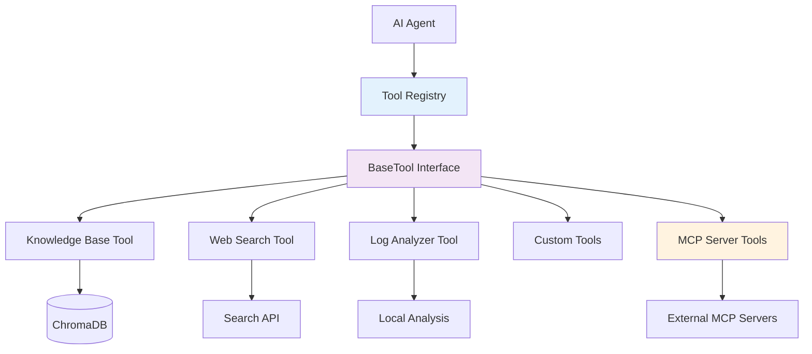

# FaultMaven Agent Tools

Session-level tools that the AI agent can invoke during active troubleshooting to provide services to end users.

## Overview

FaultMaven uses a **pluggable tool architecture** that allows the AI agent to access various capabilities during troubleshooting sessions. Tools are invoked based on investigation phase needs and can be added or removed without modifying core agent logic.

### What Are Agent Tools?

Agent tools are **discrete capabilities** that the AI can invoke to:
- Search for information (knowledge base, web)
- Analyze data (logs, metrics, traces)
- Generate artifacts (runbooks, post-mortems, reports)
- Execute operations (validation, testing, diagnostics)
- Integrate external services (MCP servers, APIs, CLI tools)

### Tool Architecture

FaultMaven implements a **pluggable tool system**:



**Key Features**:
- ✅ **Pluggable**: Add tools via decorator without modifying agent code
- ✅ **Interface-Based**: All tools implement `BaseTool` interface
- ✅ **Registry Pattern**: Tools self-register using `@register_tool("name")`
- ✅ **Dependency Injection**: Tools receive configuration and services
- ✅ **Privacy-First**: All tool inputs/outputs pass through PII sanitization
- ✅ **Extensible**: Support for direct tools, MCP servers, and external APIs

## Tool Categories

### 1. Knowledge & Search Tools
Tools for retrieving information from internal and external sources.

- **[Knowledge Base Search](./implemented/knowledge-base-tool.md)** ✅ - Internal runbooks and documentation
- **[Web Search](./implemented/web-search-tool.md)** ✅ - External technical documentation

### 2. Data Analysis Tools
Tools for processing and analyzing uploaded evidence.

- **[Log Analyzer](./implemented/log-analyzer-tool.md)** ✅ - Parse and analyze log files
- **[Data Classifier](./implemented/data-classifier-tool.md)** ✅ - Identify data types
- **[Metrics Analyzer](./planned/metrics-analyzer-tool.md)** 🔲 - Time-series metrics analysis
- **[Trace Analyzer](./planned/trace-analyzer-tool.md)** 🔲 - Distributed trace analysis

### 3. Document Generation Tools
Tools for creating artifacts from troubleshooting sessions.

- **[Document Generator](./planned/document-generator-tool.md)** 🟡 - Runbooks, post-mortems, summaries

### 4. System Operation Tools
Tools for executing diagnostic and validation operations.

- **[System Commands](./planned/system-commands-tool.md)** 🔲 - kubectl, curl, diagnostic CLIs
- **[Configuration Validator](./planned/config-validator-tool.md)** 🔲 - YAML/JSON validation
- **[Hypothesis Tester](./planned/hypothesis-tester-tool.md)** 🔲 - Automated validation tests

### 5. Integration Tools
Tools for connecting to external systems and protocols.

- **[MCP Server Tools](./integrations/mcp-integration.md)** 🔲 - Model Context Protocol servers
- **[Custom API Tools](./integrations/custom-api-tools.md)** 🔲 - REST/GraphQL integrations

## Status Legend

- ✅ **Implemented**: Production-ready and available
- 🟡 **Partial**: Prompts configured, implementation incomplete
- 🔲 **Planned**: Designed but not yet implemented
- 🔄 **In Progress**: Currently under development

## Quick Links

### For Users
- **[Tool Catalog](./tool-catalog.md)** - Complete list of available tools
- **[When Tools Are Used](./tool-usage-by-phase.md)** - Which tools are invoked in each investigation phase

### For Developers
- **[Developer Guide](./developer-guide.md)** - How to create new tools
- **[Tool Interface Specification](./architecture/tool-interface-spec.md)** - BaseTool interface details
- **[Tool Registry Design](./architecture/tool-registry-design.md)** - Registry pattern and discovery
- **[Tool Integration Patterns](./architecture/tool-integration-guide.md)** - Integration best practices

### For Integrators
- **[MCP Integration Guide](./integrations/mcp-integration.md)** - Consuming and exposing MCP servers
- **[External API Integration](./integrations/custom-api-tools.md)** - Adding external APIs as tools

## Core Principles

### 1. Privacy-First Invariant
**All tool executions follow this pattern**:
```
User Input → PII Sanitization → Tool Execution → Output Sanitization → User/LLM
```

External tools (web search, MCP servers) receive **double-sanitized** data to protect sensitive information.

### 2. Pluggable Architecture
Tools are **self-registering** and **auto-discovered**:

```python
@register_tool("custom_validator")
class CustomValidatorTool(BaseTool):
    async def execute(self, params: Dict[str, Any]) -> ToolResult:
        # Implementation
        pass
    
    def get_schema(self) -> Dict[str, Any]:
        # Schema definition
        pass
```

No changes to agent code required - tool is automatically available.

### 3. Phase-Aware Invocation
Tools are recommended based on investigation phase:

| Phase | Primary Tools |
|-------|---------------|
| **Phase 0: Intake** | Knowledge Base Search |
| **Phase 1: Blast Radius** | Knowledge Base, Data Classifier, Log Analyzer |
| **Phase 2: Timeline** | Log Analyzer, Metrics Analyzer |
| **Phase 3: Hypothesis** | Knowledge Base, Web Search |
| **Phase 4: Validation** | Hypothesis Tester, System Commands |
| **Phase 5: Solution** | Knowledge Base, Web Search, Config Validator |
| **Phase 6: Documentation** | Document Generator |

### 4. Standardized Results
All tools return `ToolResult` with consistent structure:

```python
@dataclass
class ToolResult:
    success: bool           # Execution succeeded?
    data: Any              # Tool output
    error: Optional[str]   # Error message if failed
```

## Tool Discovery

At startup, FaultMaven:
1. Scans `faultmaven/tools/` directory
2. Loads all modules with `@register_tool` decorators
3. Validates tools implement `BaseTool` interface
4. Registers tools in `ToolRegistry`
5. Makes tools available to agent via dependency injection

**Current Registered Tools**:
```bash
# Check available tools
python -c "from faultmaven.tools.registry import tool_registry; print(tool_registry.list_tools())"
# Output: ['knowledge_base', 'knowledge_base_filtered', 'web_search']
```

## Extensibility Patterns

### Pattern 1: Direct Tool Implementation
Create tools that run within FaultMaven process:
- ✅ Full control over execution
- ✅ No external dependencies
- ✅ Fast execution
- ❌ Limited to Python ecosystem

### Pattern 2: External API Tools
Wrap external REST/GraphQL APIs as tools:
- ✅ Leverage existing services
- ✅ Language-agnostic
- ⚠️ Network latency
- ⚠️ Requires API authentication

### Pattern 3: MCP Server Tools
Integrate via Model Context Protocol:
- ✅ Standardized protocol
- ✅ Growing ecosystem
- ✅ Tool + resource exposure
- ⚠️ Requires MCP server setup

### Pattern 4: System Command Tools
Execute shell commands for diagnostics:
- ✅ Access to system utilities (kubectl, curl)
- ❌ Security concerns (requires sandboxing)
- ❌ Platform-dependent

## Configuration

Tools are configured via environment variables in `.env`:

```env
# Web Search Tool
WEB_SEARCH_API_KEY=your_google_api_key
WEB_SEARCH_ENGINE_ID=your_engine_id
WEB_SEARCH_MAX_RESULTS=3

# Knowledge Base Tool (automatic from infrastructure)
CHROMADB_URL=http://chromadb.faultmaven.local:30080
EMBEDDING_MODEL=BAAI/bge-m3

# Future: MCP Server Tools
MCP_SERVER_URL=http://localhost:3000
MCP_API_KEY=your_mcp_key
```

## Performance Considerations

**Tool Execution Timeouts**:
- Knowledge Base Search: < 500ms
- Web Search: < 2s (external API)
- Log Analysis: < 1s per MB
- MCP Server Calls: < 3s (configurable)

**Caching**:
- Knowledge Base results cached per session
- Web search results cached for 1 hour
- Tool schemas cached at startup

## Security & Safety

### Tool Safety Classification

**Safe Tools** (unrestricted):
- Knowledge Base Search
- Web Search (trusted domains only)
- Log Analyzer (read-only)
- Data Classifier

**Requires Confirmation**:
- System Commands (kubectl, curl)
- Configuration Validator (read-only but sensitive)

**Restricted/Disabled by Default**:
- System Restart
- Database Reset
- Network Configuration Changes
- Permission Changes

### Dangerous Tool Configuration

In `agent.py`:
```python
self.dangerous_tools = {
    "system_restart": True,
    "database_reset": True,
    "network_config_change": True,
    "permission_change": True,
}
```

These tools require explicit user confirmation before execution.

## Future Roadmap

### Short-term (Q1 2025)
- ✅ Document existing tools (KB, Web, Log Analyzer)
- 🔲 Complete Document Generator tool
- 🔲 Add Metrics Analyzer tool
- 🔲 MCP server integration prototype

### Medium-term (Q2 2025)
- 🔲 System Commands tool with sandboxing
- 🔲 Trace Analyzer tool
- 🔲 Configuration Validator tool
- 🔲 Tool marketplace/catalog UI

### Long-term (2025+)
- 🔲 Community tool contributions
- 🔲 Tool composition (pipelines)
- 🔲 Tool versioning and updates
- 🔲 Tool performance analytics

## Contributing

See **[Developer Guide](./developer-guide.md)** for:
- Tool development standards
- Testing requirements
- Documentation templates
- Submission process

---

**Last Updated**: 2025-10-12  
**Version**: 1.0  
**Maintainer**: Architecture Team


