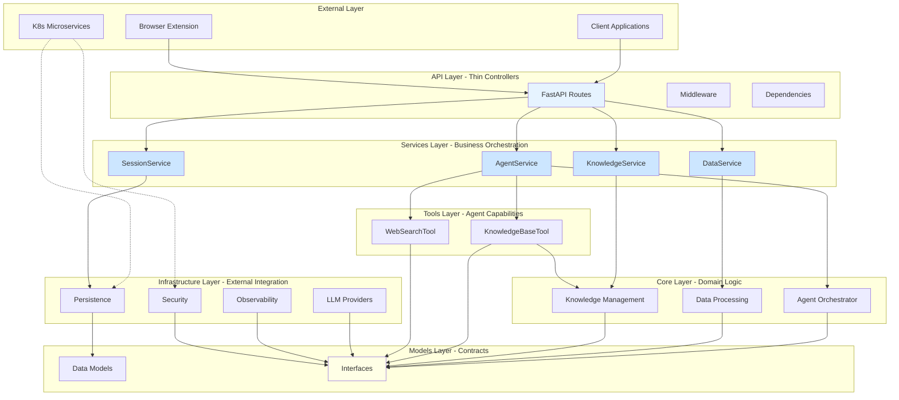

# FaultMaven Refactored Architecture

**Version**: 3.0  
**Date**: 2025-08-04  
**Status**: Proposed for Implementation

## Executive Summary

This document describes the refactored architecture of FaultMaven that addresses critical dependency violations identified in the architectural audit. The refactoring introduces strict layer boundaries, proper dependency injection, and interface-based design to prepare for microservices migration.

## Key Changes from v2.1

1. **Strict Layer Enforcement**: API routes no longer bypass the service layer
2. **Interface-Based Design**: Core components depend on interfaces, not implementations
3. **Circular Dependency Resolution**: Tools and Core layers properly decoupled
4. **Enhanced Dependency Injection**: Full DI container with proper lifecycle management
5. **Infrastructure Decoupling**: Infrastructure components communicate through interfaces

## Architecture Principles

1. **Strict Layer Boundaries**: Each layer can only depend on layers below it
2. **Dependency Injection**: All dependencies are injected, never instantiated directly
3. **Interface Segregation**: Components depend on interfaces, not concrete implementations
4. **Single Responsibility**: Each component has one clear, focused purpose
5. **Microservice Ready**: Components are loosely coupled for easy extraction

## Layer Architecture



## Layer Responsibilities (Refactored)

### 1. API Layer (`/api`) - Thin Controllers Only

**Purpose**: HTTP interface with NO business logic

**Strict Rules**:
- ✅ ONLY import from Services and Models layers
- ❌ NO imports from Core, Infrastructure, or Tools
- ❌ NO business logic - only input validation and response formatting
- ❌ NO direct instantiation of any components

**Example Pattern**:
```python
# api/v1/routes/agent.py
from fastapi import APIRouter, Depends
from faultmaven.api.v1.dependencies import get_agent_service
from faultmaven.services.agent_service import AgentService
from faultmaven.models import QueryRequest, TroubleshootingResponse

router = APIRouter()

@router.post("/troubleshoot", response_model=TroubleshootingResponse)
async def troubleshoot(
    request: QueryRequest,
    agent_service: AgentService = Depends(get_agent_service)
):
    """Thin controller - delegates immediately to service"""
    return await agent_service.troubleshoot(request)
```

### 2. Services Layer (`/services`) - All Business Logic

**Purpose**: Business logic orchestration and workflow management

**Responsibilities**:
- Orchestrate complex workflows
- Manage transactions
- Handle cross-cutting concerns
- Instantiate and configure core components
- Apply business rules and validations

**Example Pattern**:
```python
# services/agent_service.py
from typing import List
from faultmaven.core.agent.agent import FaultMavenAgent
from faultmaven.models.interfaces import BaseTool, ITracer, ISanitizer
from faultmaven.models import QueryRequest, TroubleshootingResponse

class AgentService:
    def __init__(
        self,
        agent_factory: Callable[[], FaultMavenAgent],
        tools: List[BaseTool],
        tracer: ITracer,
        sanitizer: ISanitizer
    ):
        self._agent_factory = agent_factory
        self._tools = tools
        self._tracer = tracer
        self._sanitizer = sanitizer
    
    async def troubleshoot(self, request: QueryRequest) -> TroubleshootingResponse:
        """Orchestrates the complete troubleshooting workflow"""
        with self._tracer.trace("troubleshoot"):
            # Business logic: Input sanitization
            clean_query = self._sanitizer.sanitize(request.query)
            
            # Business logic: Agent creation and configuration
            agent = self._agent_factory()
            agent.configure_tools(self._tools)
            
            # Business logic: Execute troubleshooting
            result = await agent.run(clean_query, session_id=request.session_id)
            
            # Business logic: Output sanitization
            clean_result = self._sanitizer.sanitize(result)
            
            return TroubleshootingResponse(**clean_result)
```

### 3. Core Layer (`/core`) - Pure Domain Logic

**Purpose**: Core algorithms and domain logic

**Strict Rules**:
- ✅ Depend on interfaces from Models layer
- ❌ NO imports from Services or API layers
- ❌ NO imports from concrete tool implementations
- ❌ NO direct infrastructure dependencies

**Example Pattern**:
```python
# core/agent/agent.py
from typing import List
from langgraph.graph import StateGraph
from faultmaven.models.interfaces import BaseTool
from faultmaven.models import AgentState

class FaultMavenAgent:
    def __init__(self, llm_interface: ILLMProvider):
        self._llm = llm_interface
        self._tools: List[BaseTool] = []
        self._graph = self._build_graph()
    
    def configure_tools(self, tools: List[BaseTool]) -> None:
        """Configure tools through interfaces"""
        self._tools = tools
    
    async def run(self, query: str, session_id: str) -> dict:
        """Execute agent workflow using interfaces"""
        # Pure domain logic using interfaces
        pass
```

### 4. Infrastructure Layer (`/infrastructure`) - External Integrations

**Purpose**: All external service integrations

**Strict Rules**:
- ✅ Implement interfaces defined in Models/Infrastructure
- ❌ NO imports from Core, Services, or API layers
- ❌ NO circular dependencies between infrastructure components

**Decoupling Strategy**:
```python
# infrastructure/interfaces.py
from abc import ABC, abstractmethod
from typing import Any, ContextManager

class ITracer(ABC):
    @abstractmethod
    def trace(self, operation: str) -> ContextManager:
        pass

class ISanitizer(ABC):
    @abstractmethod
    def sanitize(self, data: Any) -> Any:
        pass

class ILLMProvider(ABC):
    @abstractmethod
    async def generate(self, prompt: str, **kwargs) -> str:
        pass

# infrastructure/llm/router.py
from faultmaven.infrastructure.interfaces import ITracer, ISanitizer, ILLMProvider

class LLMRouter(ILLMProvider):
    def __init__(self, tracer: ITracer, sanitizer: ISanitizer):
        # Depend on interfaces, not concrete implementations
        self._tracer = tracer
        self._sanitizer = sanitizer
```

### 5. Models Layer (`/models`) - Contracts and Interfaces

**Purpose**: Data structures and interface definitions

**Components**:
- Pydantic models for data validation
- Abstract base classes for interfaces
- Domain entities
- NO business logic

**New Additions**:
```python
# models/interfaces.py
from abc import ABC, abstractmethod
from typing import Any, Dict
from pydantic import BaseModel

class ToolResult(BaseModel):
    success: bool
    data: Any
    error: Optional[str] = None

class BaseTool(ABC):
    """Interface for all agent tools"""
    
    @abstractmethod
    async def execute(self, params: Dict[str, Any]) -> ToolResult:
        """Execute tool with parameters"""
        pass
    
    @abstractmethod
    def get_schema(self) -> Dict[str, Any]:
        """Return JSON schema for tool parameters"""
        pass
```

### 6. Tools Layer (`/tools`) - Agent Capabilities

**Purpose**: Concrete tool implementations

**Strict Rules**:
- ✅ Implement BaseTool interface
- ✅ Can import from Core for functionality
- ❌ Core cannot import concrete tools

**Example**:
```python
# tools/knowledge_base.py
from faultmaven.models.interfaces import BaseTool, ToolResult
from faultmaven.core.knowledge.ingestion import KnowledgeIngester

class KnowledgeBaseTool(BaseTool):
    def __init__(self, ingester: KnowledgeIngester):
        self._ingester = ingester
    
    async def execute(self, params: Dict[str, Any]) -> ToolResult:
        # Implementation using core functionality
        pass
```

## Enhanced Dependency Injection Container

```python
# container.py
from dependency_injector import containers, providers
from dependency_injector.wiring import Provide, inject

class Container(containers.DeclarativeContainer):
    # Configuration
    config = providers.Configuration()
    
    # Infrastructure - Singletons
    redis_client = providers.Singleton(
        RedisClient,
        url=config.redis_url
    )
    
    tracer = providers.Singleton(
        Tracer,
        project_name=config.opik_project_name
    )
    
    sanitizer = providers.Singleton(
        DataSanitizer,
        presidio_url=config.presidio_url
    )
    
    # Infrastructure - Factories
    llm_router = providers.Factory(
        LLMRouter,
        tracer=tracer,
        sanitizer=sanitizer,
        providers=providers.List(
            providers.Factory(OpenAIProvider),
            providers.Factory(AnthropicProvider),
            providers.Factory(FireworksProvider)
        )
    )
    
    # Core - Factories
    knowledge_ingester = providers.Factory(
        KnowledgeIngester,
        vector_store=providers.Factory(
            ChromaDBClient,
            url=config.chromadb_url
        )
    )
    
    agent_factory = providers.Factory(
        FaultMavenAgent,
        llm_interface=llm_router
    )
    
    # Tools - Factories
    knowledge_tool = providers.Factory(
        KnowledgeBaseTool,
        ingester=knowledge_ingester
    )
    
    web_search_tool = providers.Factory(
        WebSearchTool,
        api_key=config.tavily_api_key
    )
    
    # Services - Factories with all dependencies
    agent_service = providers.Factory(
        AgentService,
        agent_factory=agent_factory.provider,
        tools=providers.List(
            knowledge_tool,
            web_search_tool
        ),
        tracer=tracer,
        sanitizer=sanitizer
    )
    
    data_service = providers.Factory(
        DataService,
        classifier=providers.Factory(DataClassifier),
        analyzer=providers.Factory(LogAnalyzer),
        tracer=tracer,
        sanitizer=sanitizer
    )
    
    knowledge_service = providers.Factory(
        KnowledgeService,
        ingester=knowledge_ingester,
        tracer=tracer,
        sanitizer=sanitizer
    )
    
    session_service = providers.Factory(
        SessionService,
        redis_client=redis_client,
        tracer=tracer
    )
```

## Refactoring Implementation Plan

### Phase 1: Create Interfaces (No Breaking Changes)
1. Create `/models/interfaces.py` with all interface definitions
2. Create `/infrastructure/interfaces.py` for infrastructure interfaces
3. Update existing models to implement interfaces

### Phase 2: Refactor Services Layer
1. Move all business logic from API routes to services
2. Update services to accept interfaces instead of concrete types
3. Implement proper dependency injection in services

### Phase 3: Fix API Layer Violations
1. Remove all Core and Infrastructure imports from API routes
2. Update routes to only call service methods
3. Move any remaining logic to appropriate services

### Phase 4: Resolve Circular Dependencies
1. Update Core agent to depend on tool interfaces
2. Remove concrete tool imports from Core
3. Inject tools through service layer

### Phase 5: Update Dependency Container
1. Implement complete DI container with all providers
2. Wire container to FastAPI dependency system
3. Update all imports to use injected dependencies

## Testing Strategy

### Architecture Tests
```python
# tests/test_architecture.py
import ast
import os
from pathlib import Path

def test_api_layer_boundaries():
    """Ensure API routes don't violate layer boundaries"""
    api_files = Path("faultmaven/api").rglob("*.py")
    
    for file in api_files:
        content = file.read_text()
        tree = ast.parse(content)
        
        for node in ast.walk(tree):
            if isinstance(node, ast.ImportFrom):
                module = node.module or ""
                # API should not import from these layers
                assert not module.startswith("faultmaven.core"), \
                    f"{file} imports from core layer: {module}"
                assert not module.startswith("faultmaven.infrastructure"), \
                    f"{file} imports from infrastructure: {module}"
                assert not module.startswith("faultmaven.tools"), \
                    f"{file} imports from tools: {module}"

def test_core_tool_independence():
    """Ensure Core doesn't depend on concrete tools"""
    core_files = Path("faultmaven/core").rglob("*.py")
    
    for file in core_files:
        content = file.read_text()
        assert "from faultmaven.tools" not in content, \
            f"{file} has concrete tool dependency"
```

## Migration Benefits

1. **Clean Architecture**: Clear separation of concerns
2. **Testability**: Easy to mock dependencies
3. **Flexibility**: Components can be swapped via DI
4. **Microservice Ready**: Each service can be extracted
5. **Maintainability**: Changes isolated to specific layers

## Backward Compatibility

- All existing endpoints remain unchanged
- Response formats are preserved
- Only internal structure is refactored
- No breaking changes to external APIs

## Conclusion

This refactoring addresses all architectural violations while maintaining backward compatibility. The strict layer boundaries and interface-based design create a solid foundation for future microservices migration while improving testability and maintainability.